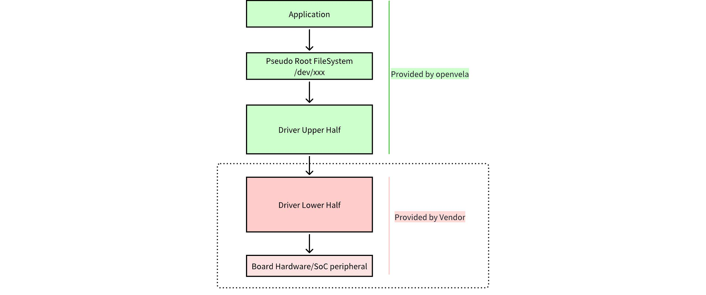
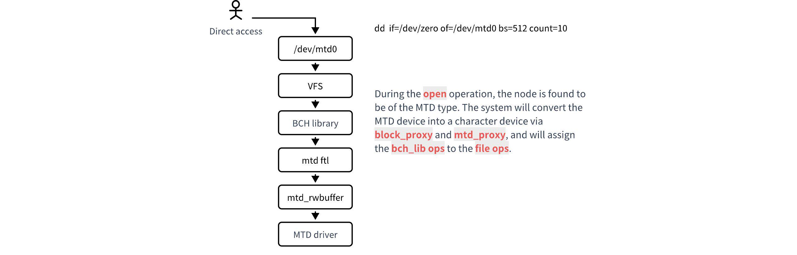

# Storage Driver Framework Guide

\[ English | [简体中文](../../../zh-cn/device_dev_guide/file_system/storage_driver_framework_guide.md) \]

## I. Overview

This document is intended to provide chip and board suppliers with a comprehensive introduction to the `openvela` storage driver framework. It will help developers understand its core architecture, driver models, and interaction with the system. Mastering these concepts is fundamental to specific driver development.

The `openvela` storage framework provides a unified and extensible access layer for various non-volatile storage media, such as eMMC, SD cards, and NOR/NAND Flash.

## II. Driver Model Overview

The `openvela` system primarily categorizes device drivers into three types: character devices, block devices, and special devices. For storage media, the system mainly employs the following two driver models:

- **Block Device Driver**

    Used to manage storage media that can be addressed and accessed in fixed-size blocks (sectors), such as eMMC and SD cards. These drivers are the ideal foundation for file systems like FAT and LittleFS.

    - **Byte-Stream Access Proxy**: Although block devices do not natively support byte-stream access, when an application attempts to open a block device node as a file, the `openvela` kernel automatically creates a temporary character device proxy via the **BCH (Block-to-Character)** module. This proxy is responsible for translating byte-stream requests into block operations on the underlying block device, thus shielding the implementation differences from the upper-layer application.

- **MTD (Memory Technology Device) Driver**
  
    Designed specifically for various flash memory chips (like NOR/NAND Flash) and other memory technologies (such as EEPROM and RRAM). The MTD model fully accounts for the unique characteristics of flash media, such as the **erase-before-write** requirement and limited erase/write cycles.

    - **Byte-Stream Access Proxy**: Similar to block devices, MTD devices can also be accessed as a byte stream by upper layers through a proxy mechanism. When an application opens an MTD device node, the kernel creates on-demand:

        - A temporary **FTL (Flash Translation Layer)** to emulate the MTD device as a block device.
        - A temporary **BCH** proxy to complete the conversion from the emulated block device to a character device.

## III. Upper/Lower Half Architecture

To maximize code reuse and enhance cross-platform portability, `openvela` drivers widely adopt a layered **Upper/Lower Half** architecture.

- **Upper Half Driver**

    - **Responsibilities**: Implements platform-independent, generic logic and provides standard POSIX interfaces (e.g., `open`, `read`, `write`) to upper-layer applications.
    - **Characteristics**: Provided by the `openvela` system; developers typically do not need to modify it. It interacts with the Lower Half driver through a standard set of function pointers.

- **Lower Half Driver**

    - **Responsibilities**: Implements hardware-specific logic, directly manipulating the chip's registers and controllers.
    - **Development Task**: **The primary responsibility of the chip or board supplier (Vendor) is to write the Lower Half driver**. You need to implement a set of operation interfaces defined by the Upper Half driver (`struct mtd_dev_s` or `struct block_operations`) and encapsulate the hardware-specific behavior within these interface functions.

This architecture completely isolates hardware differences in the Lower Half, enabling the core storage logic of `openvela` to be seamlessly reused across different chips and hardware platforms.

## IV. Interaction with the Virtual File System (VFS)

All storage drivers are ultimately registered with the `openvela` Virtual File System (VFS), typically located in the `/dev` directory, which serves as the entry point for application-layer access.

There are two main paths for an application layer to access storage devices:

- **Access via File System Mounting**:

    This is the most common usage pattern. A user associates a block device (or an FTL-emulated MTD device), a file system type (such as LittleFS), and a mount point directory using the `mount` command. Once mounted successfully, an application can use standard file operations (`fopen`, `fread`, `fwrite`, etc.) to access and manage files and directories on the storage medium.

    

- **Direct Access via Device Node**:

    An application can also directly `open` a device node located in the `/dev` directory (e.g., `/dev/mtdblock0`) and use interfaces like `read`, `write`, and `ioctl` to perform low-level I/O operations. This method bypasses the file system and is commonly used for scenarios such as partition formatting, firmware flashing (OTA), or raw data read/write.

    

## V. Next Steps

After understanding the `openvela` storage driver framework, you can refer to the following specific development guides to complete the Lower Half driver adaptation based on your hardware type:

- [MTD Driver Development Guide](./mtd_driver_development_guide.md)
- [Block Device Driver Development Guide](./block_device_driver_development_guide.md)

