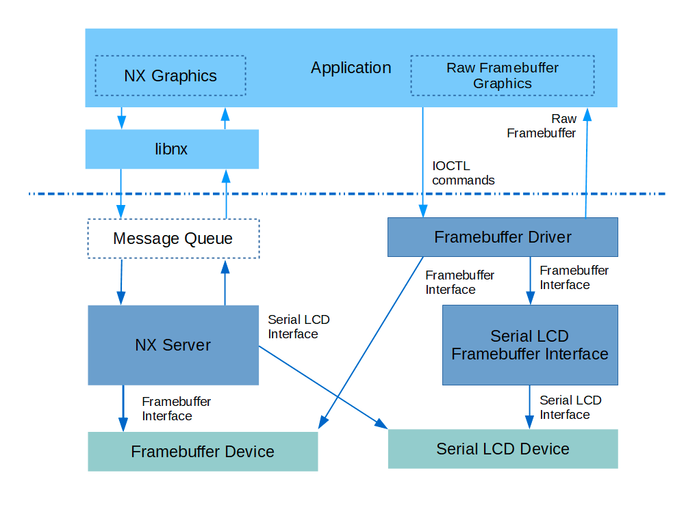
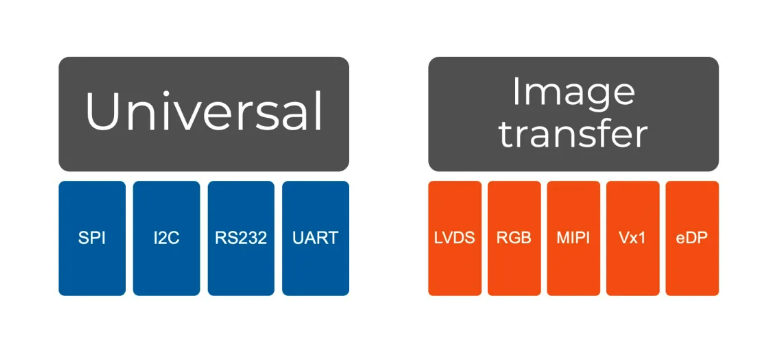

# Display driver

\[ English | [简体中文](../../../zh-cn/device_dev_guide/graphics/Display_Driver.md) \]

## I. openvela graphic framework

### 1. NX Graphics

openvela has integrated the graphics library NxWM, but due to its relatively simple functionality, it cannot meet more complex requirements.

Currently, the openvela system has adopted the more powerful LVGL graphics library to support broader application scenarios.

### 2. LVGL

LVGL is the most popular free and open source embedded graphics library that can create beautiful user interfaces for any MCU, MPU and display type.

From consumer electronics to industrial automation, any application can take advantage of LVGL's 30 built-in Widgets, 100 different style attributes, Web-like layouts and support for 30+ languages' typography systems.

### 3. Graphics Drivers

Common display types can be categorized into the following two types based on their data transmission bus modes:

- Universal Mode
- Image Transfer (Video Mode)

Correspondingly at the driver layer, they are divided into two types:

- Framebuffer Driver
    - Screens designed for Image Transfer (Video Mode) transmission mode.
    - Common application scenarios include:
        - TTL RGB
        - MIPI-DSI
- LCD Driver
    - Screens designed for Universal Mode transmission mode.
    - Common application scenarios include:
        - SPI (QSPI)
        - I2C

## II. Related Documents

For information about graphics driver adaptation methods, please refer to:

- [Framebuffer_Driver](./Framebuffer_Driver.md)
- [LCD_Driver](./LCD_Driver.md)

## III. References

- [Understanding PinePhone's Display (MIPI DSI)](https://lupyuen.github.io/articles/dsi)
- [Rendering PinePhone's Display (DE and TCON0)](https://lupyuen.github.io/articles/de)
- [Vela RTOS for PinePhone: MIPI Display Serial Interface](https://lupyuen.github.io/articles/dsi3)
- [Vela RTOS for PinePhone: Display Engine](https://lupyuen.github.io/articles/de3)
- [Vela RTOS for PinePhone: LCD Panel](https://lupyuen.github.io/articles/lcd)
- [Vela RTOS for PinePhone: Framebuffer](https://lupyuen.github.io/articles/fb)
