# Framebuffer Driver

\[ English | [简体中文](../../../zh-cn/device_dev_guide/graphics/Framebuffer_Driver.md) \]

## I. What is Framebuffer

Framebuffer (frame buffer/video memory) is a memory region used to store LCD image data for one frame. In embedded systems, Framebuffer is typically implemented through memory simulation, with its size determined by the LCD resolution and bytes per pixel.

### 1. Framebuffer Size Calculation

Take a 480x320 screen as example, the Framebuffer sizes under different pixel modes are:

1. ARGB888 (32bpp):

    - Calculation formula: 480 x 320 x 4 (bytes)
    - Size: 614,400 bytes

2. RGB565 (16bpp):

    - Calculation formula: 480 x 320 x 2 (bytes)
    - Size: 307,200 bytes

## II. Framebuffer Display Principle

The Framebuffer display principle can be summarized as: LCD Controller (LCDC) reads pixel data from the Framebuffer and transmits it to the LCD panel through a parallel data interface.

### 1. Display Flowchart

Below is the Framebuffer display workflow:



- Framebuffer: Stores pixel data.
- LCDC: Reads pixel data from the Framebuffer and transmits it to the LCD panel.
- LCD Panel: Receives data and displays the image.

### 2. Data Transfer Interface

LCDC transmits data to the LCD panel through the following signals:

- Clock: Clock signal, used to synchronize data transmission.
- Data: Pixel data, including R (red), G (green), and B (blue) three color channels.
- Control: Control signal, used to manage the timing and state of data transmission.

## III. openvela Framebuffer Interface

openvela's Framebuffer interface consists of two layers: upper-level user interface and lower-level driver interface. They provide flexible operation capabilities for users and device drivers, respectively. The following is a detailed description of the interface.

### 1. Upper-level User Interface

openvela's Framebuffer user interface resembles Linux systems, offering standard operations via VFS (Virtual File System), including `open`, `close`, `read`, `write`, and `ioctl`. Users can access the following functions by operating `/dev/fbx` device files:

1. Map Framebuffer to user space:

    Use `mmap` to map Framebuffer into user space for direct read/write operations

2. Switch Framebuffer:

    Use `ioctl` interface to switch between different Framebuffer configurations or modes.

### 2. Lower-level Driver Interface

openvela's Framebuffer driver interface for managing LCD devices is designed with simplicity. Developers can refer to  [video/fb.h](../../../../../../nuttx/blob/dev-ai-contest-2026/include/nuttx/video/fb.h) and  [/drivers/video/fb.c](../../../../../../nuttx/blob/dev-ai-contest-2026/drivers/video/fb.c). Below is the `fb_register()` source code showing key parts of the Framebuffer device driver implementation:

```C
int fb_register(int display, int plane)
{
  FAR struct fb_chardev_s *fb;

  ...

  /* Initialize the frame buffer device. */
  ret = up_fbinitialize(display);
  if (ret < 0)
    {
      gerr("ERROR: up_fbinitialize() failed for display %d: %d\n",
           display, ret);
      goto errout_with_fb;
    }
  DEBUGASSERT((unsigned)plane <= UINT8_MAX);
  fb->plane  = plane;
  fb->vtable = up_fbgetvplane(display, plane);
  if (fb->vtable == NULL)
    {
      gerr("ERROR: up_fbgetvplane() failed, vplane=%d\n", plane);
      goto errout_with_fb;
    }
  /* Initialize the frame buffer instance. */
  ...

  ret = register_driver(devname, &fb_fops, 0666, (FAR void *)fb);
  if (ret < 0)
    {
      gerr("ERROR: register_driver() failed: %d\n", ret);
      goto errout_with_fb;
    }
  return OK;
  
errout_with_fb:
  kmm_free(fb);
  return ret;
}
```

From the code, we can see the Framebuffer provides these 3 interfaces for LCD device drivers (must be implemented by drivers):

1. `void up_fbinitialize(int display)`

    - Initializes hardware LCD controller
    - Example: On STM32 platforms, `up_fbinitialize` needs to initialize LTDC (LCD-TFT Controller) or MIPI interface, and complete DSI peripheral & LCD IC initialization

2. `FAR struct fb_vtable_s *up_fbgetvplane(int display, int vplane)`

    - Retrieves `fb_vtable_s` structure information for LCD
    - `fb_vtable_s` is the core Framebuffer structure containing all interfaces. This function registers LCD controller information into the Framebuffer framework
    - Reference implementations:

        - `drivers/video/vnc/vnc_fbdev.c`
        - `boards/arm/stm32f7/stm32f746g-disco/stm32_lcd.c`

3. `void up_fbuninitialize(int display)`

    - Opposite operation of `up_fbinitialize` for resource release. Can be implemented as empty function when no operation needed.

### 3. `struct fb_vtable_s` Structure

`fb_vtable_s` is the core structure of Framebuffer, containing all interfaces for interacting with video hardware. The following are the main functional modules:

1. Core functions

    - `getvideoinfo`: Retrieves video controller configuration and color plane information
    - `getplaneinfo`: Retrieves information for the specified color plane

2. Optional functions (enabled based on configuration)

    - Color mapping (`CONFIG_FB_CMAP`):
        - `getcmap`: Retrieves the current color mapping table
        - `putcmap`: Updates the color mapping table
    - Hardware cursor (`CONFIG_FB_HWCURSOR`):
        - `getcursor`: Retrieves cursor properties
        - `setcursor`: Sets cursor configuration
    - Display update (`CONFIG_FB_UPDATE`):
        - `updatearea`: Notifies hardware to update the specified display area
    - Vertical sync (`CONFIG_FB_SYNC`):
        - `waitforvsync`: Waits for vertical sync signal to avoid screen tearing
    - Overlay management (`CONFIG_FB_OVERLAY`):
        - `getoverlayinfo`: Retrieves the configuration information of the overlay layer
        - `settransp`: Sets the transparency of the overlay layer
        - `setchromakey`: Sets the chroma key of the overlay layer
        - `setcolor`: Fills the overlay layer with the specified color
        - `setblank`: Enables or disables the overlay layer
        - `setarea`: Sets the active area for the overlay operation
        - Overlay layer Blit and Blend operations (`CONFIG_FB_OVERLAY_BLIT`):
            - `blit`: Performs Blit operation between overlay layers
            - `blend`: Performs Blend operation between overlay layers

3. Other control functions

    - Display translation:
        - `pandisplay`: Performs translation operation for multi-buffered display
    - Frame rate control:
        - `setframerate`: Sets the refresh rate of the Framebuffer
        - `getframerate`: Retrieves the current refresh rate
    - Power management:
        - `getpower`: Retrieves the power state of the panel
        - `setpower`: Enables or disables the panel power

#### Example Code

Here is a partial definition of `struct fb_vtable_s`:

```C
struct fb_vtable_s
{
  /* Get information about the video controller configuration and the
   * configuration of each color plane.
   */

  int (*getvideoinfo)(FAR struct fb_vtable_s *vtable,
                      FAR struct fb_videoinfo_s *vinfo);
  int (*getplaneinfo)(FAR struct fb_vtable_s *vtable, int planeno,
                      FAR struct fb_planeinfo_s *pinfo);

#ifdef CONFIG_FB_CMAP
  /* The following are provided only if the video hardware supports RGB
   * color mapping
   */

  int (*getcmap)(FAR struct fb_vtable_s *vtable,
                 FAR struct fb_cmap_s *cmap);
  int (*putcmap)(FAR struct fb_vtable_s *vtable,
                 FAR const struct fb_cmap_s *cmap);
#endif

#ifdef CONFIG_FB_HWCURSOR
  /* The following are provided only if the video hardware supports a
   * hardware cursor.
   */

  int (*getcursor)(FAR struct fb_vtable_s *vtable,
                   FAR struct fb_cursorattrib_s *attrib);
  int (*setcursor)(FAR struct fb_vtable_s *vtable,
                   FAR struct fb_setcursor_s *settings);
#endif

#ifdef CONFIG_FB_UPDATE
  /* The following are provided only if the video hardware need extera
   * notification to update display content.
   */

  int (*updatearea)(FAR struct fb_vtable_s *vtable,
                    FAR const struct fb_area_s *area);
#endif

#ifdef CONFIG_FB_SYNC
  /* The following are provided only if the video hardware signals
   * vertical sync.
   */

  int (*waitforvsync)(FAR struct fb_vtable_s *vtable);
#endif

#ifdef CONFIG_FB_OVERLAY
  /* Get information about the video controller configuration and the
   * configuration of each overlay.
   */

  int (*getoverlayinfo)(FAR struct fb_vtable_s *vtable, int overlayno,
                        FAR struct fb_overlayinfo_s *oinfo);

  /* The following are provided only if the video hardware supports
   * transparency
   */

  int (*settransp)(FAR struct fb_vtable_s *vtable,
                   FAR const struct fb_overlayinfo_s *oinfo);

  /* The following are provided only if the video hardware supports
   * chromakey
   */

  int (*setchromakey)(FAR struct fb_vtable_s *vtable,
                      FAR const struct fb_overlayinfo_s *oinfo);

  /* The following are provided only if the video hardware supports
   * filling the overlay with a color.
   */

  int (*setcolor)(FAR struct fb_vtable_s *vtable,
                  FAR const struct fb_overlayinfo_s *oinfo);

  /* The following allows to switch the overlay on or off */

  int (*setblank)(FAR struct fb_vtable_s *vtable,
                  FAR const struct fb_overlayinfo_s *oinfo);

  /* The following allows to set the active area for subsequently overlay
   * operations.
   */

  int (*setarea)(FAR struct fb_vtable_s *vtable,
                 FAR const struct fb_overlayinfo_s *oinfo);

#ifdef CONFIG_FB_OVERLAY_BLIT
  /* The following are provided only if the video hardware supports
   * blit operation between overlays.
   */

  int (*blit)(FAR struct fb_vtable_s *vtable,
              FAR const struct fb_overlayblit_s *blit);

  /* The following are provided only if the video hardware supports
   * blend operation between overlays.
   */

  int (*blend)(FAR struct fb_vtable_s *vtable,
               FAR const struct fb_overlayblend_s *blend);
#endif

  /* Pan display for multiple buffers. */

  int (*pandisplay)(FAR struct fb_vtable_s *vtable,
                    FAR struct fb_planeinfo_s *pinfo);

  /* Specific Controls ******************************************************/

  /* Set the frequency of the Framebuffer update panel (0: disable refresh) */

  int (*setframerate)(FAR struct fb_vtable_s *vtable, int rate);

  /* Get the frequency of the Framebuffer update panel (0: disable refresh) */

  int (*getframerate)(FAR struct fb_vtable_s *vtable);

  /* Get the panel power status (0: full off). */

  int (*getpower)(FAR struct fb_vtable_s *vtable);

  /* Enable/disable panel power (0: full off). */

  int (*setpower)(FAR struct fb_vtable_s *vtable, int power);
};
```

Developers should implement these interfaces according to specific hardware requirements to meet Framebuffer functionality needs.

## IV. Enabling the Framebuffer

To enable the framebuffer, follow these steps:

### 1. Enable the Framebuffer Build Option

Enable the following option in your configuration file:

```makefile
CONFIG_VIDEO_FB  
```

### 2. Register the Framebuffer

During the system initialization phase, call the `fb_register` function to register the framebuffer. Here is an example:

```C
#include <nuttx/video/fb.h>  

#ifdef CONFIG_VIDEO_FB  
    ret = fb_register(0, 0);  
    if (ret < 0)  
    {  
        syslog(LOG_ERR, "ERROR fb_register() failed: %d\n", ret);  
    }  
#endif
```

### 3. Handle VSync

To prevent screen tearing and improve rendering performance, it is recommended to handle VSync (Vertical Sync) in your implementation. For details on how to implement and optimize VSync, please refer to the [VSync](./VSync.md).

## V. Related Repositories

Here are the links to the code repository related to Framebuffer driver:


- [fb.c](../../../../../../nuttx/blob/dev-ai-contest-2026/drivers/video/fb.c)：Framebuffer Implementation files of the driver.
- [fb.h](../../../../../../nuttx/blob/dev-ai-contest-2026/include/nuttx/video/fb.h)：Framebuffer Interface definitions of the driver.
