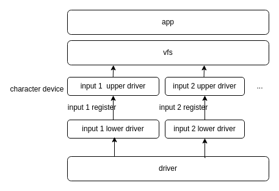

# Input Driver Development Guide

\[ English | [简体中文](../../../zh-cn/device_dev_guide/graphics/Input_Driver_Guide.md) \]

## I. Overview

This document is intended to provide embedded developers with a detailed guide for developing input device drivers on the `openvela` platform.

The `openvela` Input driver framework follows the standard layered model of NuttX, providing a unified software architecture for various input devices such as touchscreens, keyboards, and mice. The core goal of this framework is to decouple the hardware-related lower-level implementation from the upper-level application logic, thereby improving the portability and reusability of drivers.

## II. Architectural Analysis

The Input Driver is a key component that connects physical input devices to applications.

The Input driver framework adopts the classic **Upper Half** and **Lower Half** layered design. The vast majority of touch controller chips connect to the main controller via an I2C interface, and this part is placed in the Lower Half layer.



### Upper Half

The upper half is a generic interface layer for the operating system kernel and applications, responsible for handling logic that is independent of specific hardware. Its main responsibilities include:

- **Providing a standard device interface**: By creating a character device (e.g., `/dev/input0`) in the `drivers/input/` directory, it provides standard file operation interfaces like `open`, `read`, and `ioctl` for applications:

    ```C
    // File path: drivers/input/touchscreen_upper.c

    static const struct file_operations g_touch_fops =
    {
    touch_open,     /* open */
    touch_close,    /* close */
    touch_read,     /* read */
    touch_write,    /* write */
    NULL,           /* seek */
    touch_ioctl,    /* ioctl */
    NULL,           /* mmap */
    NULL,           /* truncate */
    touch_poll      /* poll */
    };
    ```

- **Managing the lower-half driver**: It provides registration (`touch_register`) and unregistration (`touch_unregister`) interfaces for mounting or unmounting the lower-half driver of specific hardware:

    ```C
    int touch_register(FAR struct touch_lowerhalf_s *lower,
                       FAR const char *path, uint8_t nums)
    void touch_unregister(FAR struct touch_lowerhalf_s *lower,
                          FAR const char *path)
    ```

- **Buffering event data**: It provides an event reporting interface (`touch_event`) that receives input data from the lower half and stores it in a Circular Buffer, making it available for upper-level applications to read:

    ```C
    // Write the touch event to a circular buffer
    void touch_event(FAR void *priv, FAR const struct touch_sample_s *sample);
    ```

### Lower Half

The lower half is the core implementation part of the driver, interacting directly with the input device hardware. The main work of a **driver developer** is concentrated in this layer. Its responsibilities include:

- **Hardware initialization**: Configuring chip registers, setting up interrupt modes, communication interfaces (like I2C/SPI), etc.
- **Interrupt handling**: Responding to hardware interrupts and reading raw input data from the device.
- **Event reporting**: Reporting the parsed, standardized input events through the interfaces provided by the upper half.

## III. Core APIs and Data Structures

To enable communication between the upper and lower halves, the framework defines a series of standardized data structures and interface functions.

### 1. Key Data Structures

These structures are used to describe the standardized format of touch events.

- **`struct touch_point_s`**: Describes the information of a single touch point.

    ```C
    #define TOUCH_DOWN           (1 << 0) /* A new touch contact is established */
    #define TOUCH_MOVE           (1 << 1) /* Movement occurred with previously reported contact */
    #define TOUCH_UP             (1 << 2) /* The touch contact was lost */
    #define TOUCH_ID_VALID       (1 << 3) /* Touch ID is certain */
    #define TOUCH_POS_VALID      (1 << 4) /* Hardware provided a valid X/Y position */
    #define TOUCH_PRESSURE_VALID (1 << 5) /* Hardware provided a valid pressure */
    #define TOUCH_SIZE_VALID     (1 << 6) /* Hardware provided a valid H/W contact size */
    #define TOUCH_GESTURE_VALID  (1 << 7) /* Hardware provided a valid gesture */
    
    struct touch_point_s
    {
      uint8_t  id;        /* Unique identifies contact; Same in all reports for the contact */
      uint8_t  flags;     /* See TOUCH_* definitions above */
      int16_t  x;         /* X coordinate of the touch point (uncalibrated) */
      int16_t  y;         /* Y coordinate of the touch point (uncalibrated) */
      int16_t  h;         /* Height of touch point (uncalibrated) */
      int16_t  w;         /* Width of touch point (uncalibrated) */
      uint16_t gesture;   /* Gesture of touchscreen contact */
      uint16_t pressure;  /* Touch pressure */
      uint64_t timestamp; /* Touch event time stamp, in microseconds */
    };
    ```

- **`struct touch_sample_s`**: A complete touch sample reported at one time, which can contain one or more touch points.

    ```C
    struct touch_sample_s
    {
      int npoints;                   /* The number of touch points in point[] */
      struct touch_point_s point[1]; /* Actual dimension is npoints */
    };
    
    #define SIZEOF_TOUCH_SAMPLE_S(n) \
      (sizeof(struct touch_sample_s) + ((n) - 1) * sizeof(struct touch_point_s))
     
    ```

- **`struct touch_lowerhalf_s`**: An instance of the lower-half driver, encapsulating hardware-related operations and properties.

    ```C
    struct touch_lowerhalf_s
    {
      uint8_t       maxpoint;       /* Maximal point supported by the touchscreen */
      FAR void      *priv;          /* Save the upper half pointer */
    
      /**************************************************************************
       * Name: control
       *
       * Description:
       *   Users can use this interface to implement custom IOCTL.
       *
       * Arguments:
       *   lower   - The instance of lower half of touchscreen device.
       *   cmd     - User defined specific command.
       *   arg     - Argument of the specific command.
       *
       * Return Value:
       *   Zero(OK) on success; a negated errno value on failure.
       *   -ENOTTY - The command is not supported.
       **************************************************************************/
    
      CODE int (*control)(FAR struct touch_lowerhalf_s *lower,
                          int cmd, unsigned long arg);
    
      /**************************************************************************
       * Name: write
       *
       * Description:
       *   Users can use this interface to implement custom write.
       *
       * Arguments:
       *   lower   - The instance of lower half of touchscreen device.
       *   buffer  - User defined specific buffer.
       *   buflen  - User defined specific buffer size.
       *
       * Return Value:
       *   Number of bytes written；a negated errno value on failure.
       *
       **************************************************************************/
    
      CODE ssize_t (*write)(FAR struct touch_lowerhalf_s *lower,
                            FAR const char *buffer, size_t buflen);
    };
    ```

### 2. Core Function Interfaces

- **Device Registration/Unregistration**

    ```C
    // Register the touchscreen lower-half driver
    int touch_register(FAR struct touch_lowerhalf_s *lower,
                    FAR const char *path, uint8_t nums);

    // Unregister the touchscreen lower-half driver
    void touch_unregister(FAR struct touch_lowerhalf_s *lower,
                        FAR const char *path);
    ```

- **Event Reporting**

    ```C
    // Report a touch event sample from the lower half to the upper half
    void touch_event(FAR void *priv, FAR const struct touch_sample_s *sample);
    ```

## IV. Driver Development Workflow

Developing an Input driver typically follows these standard steps.

### Step 1: Initialization and Registration

In the driver's initialization function, the lower-half driver must complete hardware initialization and call the corresponding registration function to register itself with the Input framework. For example, a touchscreen driver should call `touch_register`.

### Step 2: Interrupt Handling and Event Collection

When the hardware generates an input event (like a touch or key press) and triggers an interrupt, the driver's Interrupt Service Routine (ISR) is called.

> **Note**: The Interrupt Service Routine (ISR) must execute quickly in a context where preemption is disabled or interrupts are disabled. Since the upper-half `xxx_event` functions contain lock operations that may cause sleep, **it is strictly forbidden to call** **`xxx_event`** **functions directly within an ISR**.

The correct approach is to use the **Work Queue** mechanism:

```C++
int work_queue(int qid, FAR struct work_s *work, worker_t worker,
               FAR void *arg, clock_t delay)

Arguments:
  qid    - work queue ID：use HPWORK
  work   - the work structure to queue
  worker - the work callback 
  arg    - callback argument
  delay  - delay (in clock ticks) from the time queue until the worker is invoked. 
           Zero means to perform the work immediately.
```

- `qid`: Work queue ID. For high-priority interrupts, `HPWORK` should be used; for normal tasks, `LPWORK` can be used.
- `worker`: The callback function for the work queue task. The complete parsing and reporting of the event should be done in this function.
- `delay`: The delay time (in ticks) before execution. Setting it to `0` means scheduling it immediately.

### Step 3: Event Reporting

In the work queue's callback function (`worker`), the driver can safely perform the following operations:

1. Read the complete event data from the hardware via a bus like I2C/SPI.
2. Parse the raw data and populate it into a standard data structure (e.g., `struct touch_sample_s`).
3. Depending on the device type, call the corresponding event reporting function (e.g., `touch_event`) to send the event data to the upper half.

## V. Developer Adaptation Guide

This section will use a touchscreen driver as an example to explain the specific interfaces that the lower-half driver needs to implement.

### 1. Implementing the Lower-Half Interface

You need to define a static instance of `struct touch_lowerhalf_s` and populate its members according to the hardware's capabilities:

- `maxpoint`: Must be set accurately to the maximum number of concurrent touch points supported by the hardware. This value directly affects the amount of memory the upper half allocates for the circular buffer.
- `control`, `write`: If you need to support custom `ioctl` or `write` operations, implement these function pointers; otherwise, set them to `NULL`.

### 2. Registering the Input Device

During driver initialization, call the `touch_register` function.

```C++
int touch_register(FAR struct touch_lowerhalf_s *lower,
                   FAR const char *path, uint8_t nums)

Arguments:
  lower     - A pointer of lower half instance.
  path      - The path of touchscreen device. such as "/dev/input0"
  nums      - Number of the touch points structure, used to calculate circbuf size
```

- `lower`: A pointer to the `touch_lowerhalf_s` instance you implemented.
- `path`: The device node path, for example, `/dev/input0`.
- `nums`: The number of samples used to calculate the size of the circular buffer. It, along with `lower->maxpoint`, determines the total capacity of the buffer. The formula is as follows:

    `circbuf_size = nums * SIZEOF_TOUCH_SAMPLE_S(lower->maxpoint)`

### 3. Transmitting Input Events

In the work queue's callback function, call the `touch_event` function to report data.

```C++
void touch_event(FAR void *priv, FAR const struct touch_sample_s *sample);

Arguments:
  priv    - Upper half driver handle.
  sample  - pointer to data of touch point event.
```

- `priv`: The handle of the upper-half driver. This value is written back to the `lower->priv` member by the upper half after `touch_register` succeeds.
- `sample`: A pointer to a `touch_sample_s` structure that has been populated with data. Ensure that the value of `sample->npoints` accurately reflects the number of valid data points in the `sample->point` array.

## VI. Build and Verification

### 1. Build Configuration

Enable support for the corresponding type of Input driver framework in `menuconfig`.

```Makefile
# Enable touch driver
CONFIG_INPUT_TOUCHSCREEN=y

# Enable keyboard driver
CONFIG_INPUT_KEYBOARD=y

# Enable mouse driver
CONFIG_INPUT_MOUSE=y
```

Simultaneously, you also need to select your own lower-half driver in `menuconfig`.

### 2. Functional Verification

To verify the correctness of your driver, you can refer to standard testing tools like the [getevent Tool Usage Guide](./Getevent.md) to read the device node and observe whether the output event information is consistent with the actual hardware operations.

Comparing the event sequence output by the `getevent` tool with the hardware's behavior can effectively help debug whether coordinates, key values, event flags, etc., are correct.

## VII. Code Example

You can refer to the `goldfish_events.c` driver, which implements a complete set of Input event handling for the Goldfish emulator and serves as an excellent learning example.

- **Code Path**: `nuttx/drivers/input/goldfish_events.c`
