# VSync

\[ English | [简体中文](../../../zh-cn/device_dev_guide/graphics/VSync.md) \]

## I. Overview

This document introduces VSync and explains how to adapt hardware drivers for it. It is intended for developers who want to understand the interaction between the renderer and the display.

## II. What is VSync

First, let's consider a simple scenario:

1. The LCD controller transfers the content of the framebuffer to the screen at a fixed frequency of 60 Hz (approximately a 16 ms period). Each data transfer takes 8 ms.
2. The renderer draws on the framebuffer at a frequency of 100 Hz (a 10 ms period). Each rendering operation takes 8 ms. The content being rendered is a blue rectangle animating from left to right.

When verified on a physical device, the content displayed on the screen is not a complete rectangle but a disjointed one, which is inconsistent with the expected output. This phenomenon is called [Screen Tearing](https://en.wikipedia.org/wiki/Screen_tearing).

The root cause of screen tearing is a memory conflict. While the LCD is reading from the framebuffer, the renderer writes new data to it, causing parts of both the new and old frames to be displayed simultaneously. The timing diagram is shown below:

To solve this problem, a synchronization mechanism is needed to ensure that the renderer's operations and the LCD's buffer operations do not conflict, thus preventing screen tearing.

This synchronization mechanism is called VSync (Vertical Synchronization).

## III. VSync Implementation

### 1. Implementation Principle

To implement VSync, the renderer's buffer-writing operations and the LCD's buffer-reading operations must not overlap in time and space. This means the renderer cannot draw at any arbitrary moment; it must wait for the LCD to finish reading the entire framebuffer before starting to write a new frame.

Does this mean we can simply perform the rendering after the LCD has sent the buffer? As shown in the figure below:



This seems to solve the problem, but one thing to note is that the renderer's performance is affected by many factors, such as system scheduling, page complexity, and GPU drawing performance. This leads to variable rendering times. The rendering time can be very short or very long. If the rendering time is longer than the interval between two LCD buffer sends, screen tearing can still occur, as shown in the image below:


To solve the problem of variable rendering time, an additional buffer frame is introduced for the following reasons:

1. With two frames, one is always writable while the other is readable. With proper coordination, memory conflicts can be avoided.
2. The renderer's write operations and the LCD's read operations can run in parallel, ensuring maximum rendering efficiency.
3. The renderer can take a long time to render a frame. If rendering takes longer than the LCD's refresh interval, the LCD can simply display the old frame, ensuring the displayed image is complete.

### 2. Display Driver Modes

There are two main types of screens on the market: Video-mode screens and Command-mode screens. They have the following characteristics:

#### Video-mode Screen

1. Requires the LCD controller to periodically transfer a full frame of data to refresh the entire screen (typically at a 60 Hz refresh rate) to prevent the image from disappearing.
2. Even when the image is static, the LCD controller must continuously refresh the entire screen, leading to higher power consumption.
3. The hardware cost is lower, making them common in cost-sensitive but not power-sensitive products.

#### Command-mode Screen

1. The screen has built-in RAM that can store one frame of data. External components are only responsible for modifying the contents of this RAM. The screen refresh process is handled automatically by the screen's internal controller.
2. A transfer is only initiated when the framebuffer content is updated. It also supports transferring only the changed portions, reducing the amount of data sent and resulting in lower power consumption compared to Video-mode screens.
3. Due to the additional LCD controller and RAM in the hardware, the cost is higher than that of Video-mode screens. They are often used in power-sensitive products, such as battery-powered wearable devices like wristbands and watches.

### 3. Interrupt Service Routines

> **Note:**
>
> For interrupt fundamentals, refer to [Interrupt](https://en.wikipedia.org/wiki/Interrupt).

A simplified diagram of the hardware connection between a Microcontroller Unit (MCU) and the screen is shown below:


- TE (Tearing Effect): Receives a synchronization signal from the screen. The screen hardware changes the level of this pin just before displaying a new frame. The MCU receives and handles the TE event via a GPIO interrupt.
- MIPI (Mobile Industry Processor Interface): An interface for transmitting commands and data, acting as a bridge between the LCD controller and the LCD. The CPU controls the screen display by manipulating the LCD controller. After each transfer is complete, the LCD controller notifies the CPU via an interrupt that the buffer has been sent.

The LCD driver needs to provide two interrupt service routines (ISRs) to receive and handle events sent from the LCD.

- TE (Tearing Effect) Interrupt Service Routine: Called just before the LCD starts sending data. It is used to write the address of the buffer to be sent into the LCD controller.

    ```C
    static void lcdc_te_irq(int irq, void *context, void *arg)
    {
    }
    ```

- Framebuffer Transfer Complete Interrupt Service Routine: Triggered by the LCD controller and called when the LCD finishes sending data.

    ```C
    static void lcdc_framedone_irq(int irq, void *context, void *arg)
    {
    }
    ```

The figure below shows the timing of the TE IRQ and Framedone IRQ events. Note that the TE IRQ must occur before the LCD transfer starts, allowing time for register configuration.


**Note:**

When registering the interrupt service routine, the driver's `priv` should be passed as `arg`. This avoids using global variables for parameter passing. An example is shown below:

```C
static void lcdc_irqconfig(void)
{
  struct lcdcdev_s *priv = &g_lcdcdev;

  /* Attach TE interrupt vector */

  /* g_lcdcdev is a global variable defined by the user, and the specific data structure arrangement can refer to the STM32 LTDC driver:
   * nuttx/arch/arm/src/stm32/stm32_ltdc.c
   */

  irq_attach(priv->irq, lcdc_te_irq, priv);

  /* Enable the IRQ at the NVIC */

  up_enable_irq(priv->irq);

  ...
}
```

## IV. VSync Adaptation

There are two ways to implement the VSync synchronization mechanism.

### 1. (Recommended) Non-blocking Method

In most application scenarios, development is based on [libuv](https://libuv.org/). This means the upper layer cannot use any synchronous blocking wait calls like `sem_wait` or `usleep`, as they would disrupt the entire event loop.

The core of libuv is based on [poll](https://man7.org/linux/man-pages/man2/poll.2.html). Compared to traditional semaphores, the key advantage of `poll` is its ability to monitor multiple events simultaneously. `poll` exits its blocking state as soon as any one of the monitored events occurs. The principle of libuv is illustrated in the figure below:

The openvela framebuffer driver framework provides the necessary [interface](../../../../../../nuttx/blob/dev-ai-contest-2026/drivers/video/fb.c) for `poll` to monitor whether the framebuffer is in a writable state:

```C
/****************************************************************************
 * Name: fb_poll
 *
 * Description:
 *   Wait for framebuffer to be writable.
 *
 ****************************************************************************/

static int fb_poll(FAR struct file *filep, struct pollfd *fds, bool setup)
{
  FAR struct inode *inode;
  FAR struct fb_chardev_s *fb;
  FAR struct fb_priv_s *priv;
  FAR struct circbuf_s *panbuf;
  FAR struct pollfd **pollfds;
  irqstate_t flags;
  int ret = OK;

  /* Get the framebuffer instance */

  DEBUGASSERT(filep != NULL && filep->f_inode != NULL);
  inode = filep->f_inode;
  fb    = (FAR struct fb_chardev_s *)inode->i_private;
  priv  = (FAR struct fb_priv_s *)filep->f_priv;

  DEBUGASSERT(fb->vtable != NULL && priv != NULL);

  flags = enter_critical_section();

  if (setup)
    {
      pollfds = get_free_pollfds(fb, priv->overlay);
      if (pollfds == NULL)
        {
          ret = -EBUSY;
          goto errout;
        }

      *pollfds = fds;
      fds->priv = pollfds;
      
      /* If panbuf queue is not full, notify upper layer directly */
      panbuf = fb_get_panbuf(fb, priv->overlay);
      if (!circbuf_is_full(panbuf))
        {
          poll_notify(pollfds, 1, POLLOUT);
        }
    }
  else if (fds->priv != NULL)
    {
      /* This is a request to tear down the poll. */

      FAR struct pollfd **slot = (FAR struct pollfd **)fds->priv;
      *slot = NULL;
      fds->priv = NULL;
    }

errout:
  leave_critical_section(flags);
  return ret;
}
```

A queue mechanism called the `panbuf` queue is introduced in the framebuffer. The `panbuf` queue is essentially a simple circular buffer that stores information (`union fb_paninfo_u`) about rendered buffers that are ready to be sent.

For LCD controllers that support framebuffer overlays, each overlay layer has its own corresponding `panbuf` queue.

```C
union fb_paninfo_u
{
  struct fb_planeinfo_s planeinfo;
#ifdef CONFIG_FB_OVERLAY
  struct fb_overlayinfo_s overlayinfo;
#endif
};
```

The advantage of introducing the `panbuf` queue is that it decouples the rendering logic from the screen sending logic. The renderer is responsible for producing new frames and pushing them into the queue, while the LCD controller is responsible for consuming frames from the queue. They do not need to be concerned with each other's pace, achieving an adaptive effect.

From the renderer's perspective, when there is space in the queue, it starts rendering and pushes the new frame into the queue. When the queue is full, it stops rendering and waits for the LCD controller to release a framebuffer that has been transferred.

From the LCD controller's perspective, before each transmission, it checks if there is a buffer to be sent in the queue. If so, it takes one frame and starts sending it. If not, it continues to display the old frame.

The renderer pushes data into the underlying `panbuf` queue by calling the **`FBIOPAN_DISPLAY`** ioctl interface.

For LCD controllers that support FB overlays, the **`FBIOPAN_OVERLAY`** ioctl interface is used to push data to the overlay's `panbuf` queue.

```C
/****************************************************************************
 * Name: fb_ioctl
 *
 * Description:
 *   The standard ioctl method.
 *
 ****************************************************************************/

static int fb_ioctl(FAR struct file *filep, int cmd, unsigned long arg)
{
  FAR struct inode *inode;
  FAR struct fb_chardev_s *fb;
  int ret;

  ginfo("cmd: %d arg: %ld\n", cmd, arg);

  /* Get the framebuffer instance */

  DEBUGASSERT(filep != NULL && filep->f_inode != NULL);
  inode = filep->f_inode;
  fb    = (FAR struct fb_chardev_s *)inode->i_private;

  /* Process the IOCTL command */

  switch (cmd)
    {
      ...
#ifdef CONFIG_FB_OVERLAY
      ...
       case FBIOPAN_OVERLAY:
        {
          FAR struct fb_overlayinfo_s *oinfo =
            (FAR struct fb_overlayinfo_s *)((uintptr_t)arg);
          union fb_paninfo_u paninfo;

          DEBUGASSERT(oinfo != 0 && fb->vtable != NULL);

          memcpy(&paninfo, oinfo, sizeof(*oinfo));
          ret = fb_add_paninfo(fb->vtable, &paninfo, oinfo->overlay);

          if (ret >= 0 && fb->vtable->panoverlay)
            {
              fb->vtable->panoverlay(fb->vtable, oinfo);
            }
        }
        break;
      ...
#endif /* CONFIG_FB_OVERLAY */
      
      case FBIOPAN_DISPLAY:
        {
          FAR struct fb_planeinfo_s *pinfo =
            (FAR struct fb_planeinfo_s *)((uintptr_t)arg);
          union fb_paninfo_u paninfo;

          DEBUGASSERT(pinfo != NULL && fb->vtable != NULL);

          memcpy(&paninfo, pinfo, sizeof(*pinfo));
          ret = fb_add_paninfo(fb->vtable, &paninfo, FB_NO_OVERLAY);

          if (ret >= 0 && fb->vtable->pandisplay)
            {
              fb->vtable->pandisplay(fb->vtable, pinfo);
            }
        }
        break;
        ...
    }
}
```

The driver uses the `fb_remove_paninfo` function to notify the upper layer that a buffer is no longer in use. `fb_remove_paninfo` actively notifies any threads that are currently blocked waiting to draw.

```C
/****************************************************************************
 * Name: fb_remove_paninfo
 * Description:
 *   Remove a frame from pan info queue of the specified overlay.
 *
 * Input Parameters:
 *   vtable  - Pointer to framebuffer's virtual table.
 *   overlay - Overlay index.
 *
 * Returned Value:
 *   Zero is returned on success; a negated errno value is returned on any
 *   failure.
 ****************************************************************************/

int fb_remove_paninfo(FAR struct fb_vtable_s *vtable, int overlay)
{
  FAR struct circbuf_s *panbuf;
  FAR struct fb_chardev_s *fb;
  irqstate_t flags;
  ssize_t ret;

  fb = vtable->priv;
  if (fb == NULL)
    {
      return -EINVAL;
    }

  panbuf = fb_get_panbuf(fb, overlay);
  if (panbuf == NULL)
    {
      return -EINVAL;
    }

  flags = enter_critical_section();

  /* Attempt to take a frame from the pan info. */

  ret = circbuf_skip(panbuf, sizeof(union fb_paninfo_u));
  DEBUGASSERT(ret <= 0 || ret == sizeof(union fb_paninfo_u));

  /* Re-enable interrupts */

  leave_critical_section(flags);

  if (ret == sizeof(union fb_paninfo_u))
    {
      fb_pollnotify(vtable, overlay);
    }

  return ret <= 0 ? -ENOSPC : OK;
}
```

#### Adaptation Method for LCD Drivers

Under the new `panbuf` queue mechanism, the driver needs to use the following API interfaces to adapt to VSync:

- fb_peek_paninfo: Peeks at the information of the first frame in the `panbuf` queue.
- fb_remove_paninfo: Removes the first frame from the `panbuf` queue.
- fb_paninfo_count: Gets the number of paninfos in the `panbuf` queue.

```C
/****************************************************************************
 * Name: fb_peek_paninfo
 * Description:
 *   Peek a frame from pan info queue of the specified overlay.
 *
 * Input Parameters:
 *   vtable  - Pointer to framebuffer's virtual table.
 *   info    - Pointer to pan info.
 *   overlay - Overlay index.
 *
 * Returned Value:
 *   Zero is returned on success; a negated errno value is returned on any
 *   failure.
 ****************************************************************************/

int fb_peek_paninfo(FAR struct fb_vtable_s *vtable,
                    FAR union fb_paninfo_u *info, int overlay);
/****************************************************************************
 * Name: fb_remove_paninfo
 * Description:
 *   Remove a frame from pan info queue of the specified overlay.
 *
 * Input Parameters:
 *   vtable  - Pointer to framebuffer's virtual table.
 *   overlay - Overlay index.
 *
 * Returned Value:
 *   Zero is returned on success; a negated errno value is returned on any
 *   failure.
 ****************************************************************************/

int fb_remove_paninfo(FAR struct fb_vtable_s *vtable, int overlay);

/****************************************************************************
 * Name: fb_paninfo_count
 * Description:
 *   Get pan info count of specified overlay pan info queue.
 *
 * Input Parameters:
 *   vtable  - Pointer to framebuffer's virtual table.
 *   overlay - Overlay index.
 *
 * Returned Value:
 *   a non-negative value is returned on success; a negated errno value is
 *   returned on any failure.
 ****************************************************************************/

int fb_paninfo_count(FAR struct fb_vtable_s *vtable, int overlay);
```

##### Command-mode Screen

Since Command-mode screens have a built-in one-frame buffer, the frame can be removed from the `panbuf` queue immediately after it has been sent. When the TE signal arrives, the driver only needs to check if there is a new frame in the `panbuf` queue. If there is, it retrieves the address information and initiates the transfer.

```C
static void lcdc_te_irq(int irq, void *context, void *arg)
{
  struct lcdcdev_s *priv = arg;
  union fb_paninfo_u info;
  irqstate_t flags;
  ssize_t ret;

  if (fb_peek_paninfo(&priv->vtable, &info, FB_NO_OVERLAY) == OK)
    {
      uintptr_t buf = (uintptr_t)priv->pinfo.fbmem +
                                 priv->pinfo.stride * info.planeinfo.yoffset;
    
      /* Write the sent buffer address to the LCD controller. */
        
      lcdc_set_bufaddr(buf);
    }
    
#ifdef CONFIG_FB_OVERLAY
  for (i = 0; i < priv->overlaynum; i++)
    {
      if (fb_peek_paninfo(&priv->vtable, &info, i) == OK)
        {
          uintptr_t buf = (uintptr_t)priv->overlayinfo[i].fbmem +
                                     priv->overlayinfo[i].stride * info.overlayinfo.yoffset;
        
          /* Write the sent buffer address to the LCD controller. */
            
          lcdc_set_overlay_addr(buf, i);
        }
    }
#endif
}

static void lcdc_framedone_irq(int irq, void *context, void *arg)
{
  struct lcdcdev_s *priv = arg;
  union fb_paninfo_u info;

  /* After the sending is completed, remove it from the panbuf queue.
   */
  
  fb_remove_paninfo(&priv->vtable, FB_NO_OVERLAY);
  
#ifdef CONFIG_FB_OVERLAY
  for (i = 0; i < priv->overlaynum; i++)
    {
      fb_remove_paninfo(&priv->vtable, i);
    }
#endif
}
```

##### Video-mode Screen

Since Video-mode screens must send a framebuffer every VSync cycle, when the TE signal arrives, the driver needs to check if a new framebuffer has entered the `panbuf` queue. If so, it should drop the old framebuffer and send the new one.

```C
static void lcdc_te_irq(int irq, void *context, void *arg)
{
  struct lcdcdev_s *priv = arg;
  union fb_paninfo_u info;
  int count;
  
  count = fb_paninfo_count(&priv->vtable, FB_NO_OVERLAY);
  if (count > 0)
    {
      if (count > 1)
        {
          fb_remove_paninfo(&priv->vtable, FB_NO_OVERLAY);
        }
      
      if (fb_peek_paninfo(&priv->vtable, &info, FB_NO_OVERLAY) == OK)
        {
          uintptr_t buf = (uintptr_t)priv->pinfo.fbmem +
                                     priv->pinfo.stride * info.planeinfo.yoffset;
        
          /* Write the sent buffer address to the LCD controller. */
          
          lcdc_set_bufaddr(buf);
        }
    }
    
    /* If the driver has multiple overlay layers, the same operation needs to be done for the overlay layers. */
#ifdef CONFIG_FB_OVERLAY
  for (i = 0; i < priv->overlaynum; i++)
    {
      count = fb_paninfo_count(&priv->vtable, i);
      if (count  > 0)
        {
          if (count > 1)
            {
              fb_remove_paninfo(&priv->vtable, i);
            }
          
          if (fb_peek_paninfo(&priv->vtable, &info, i) == OK)
            {
              uintptr_t buf = (uintptr_t)priv->overlayinfo[i].fbmem +
                                         priv->overlayinfo[i].stride * info.overlayinfo.yoffset;
            
              /* Write the sent buffer address to the LCD controller. */
              
              lcdc_set_overlay_addr(buf, i);
            }
        }
    }
#endif
}
```

### 2. (Not Recommended) Blocking Mode

Using semaphores for synchronization is equivalent to locking the framebuffer. The renderer must acquire the lock before each rendering operation; otherwise, it will be blocked. For the code, see this [link](../../../../../../nuttx/blob/dev-ai-contest-2026/arch/arm/src/stm32/stm32_ltdc.c).

## V Related Repositories

- [nuttx](../../../../../nuttx)
