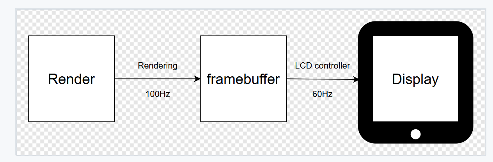

# VSync

\[ English | [简体中文](../../../zh-cn/device_dev_guide/graphics/VSync.md) \]

## I. overview

This document mainly introduces the knowledge of VSync and the methods of adapting the hardware driver. It is suitable for students who want to understand the relationship between the renderer and the Display.

## II. What is VSync

First, let's consider a simple scenario:

1. The LCD controller moves the contents of the Framebuffer to the screen at a fixed frequency of 60Hz (approximately 16ms), and the data transfer time is 8ms.
2. The renderer renders on the Framebuffer at a frequency of 100Hz (period 10ms), and the rendering time is 8ms. The rendered content is a blue rectangle that moves from left to right.



On the entity machine, the display content is not a complete rectangle, but a rectangle that is broken from top to bottom, and does not match the expected display content. This phenomenon is called [Screen Tearing](https://en.wikipedia.org/wiki/Screen_tearing) (**Screen Tearing**). As shown in the following figure:


The fundamental cause of screen tearing is actually memory stomp. While the LCD is reading the framebuffer, the renderer is writing new data to the framebuffer, resulting in the screen simultaneously displaying both the new and old frames. The timing is shown in the figure below:



To solve this problem, you need to introduce a synchronization mechanism to ensure that the rendering operation and the operation of the LCD buffer do not overlap in time and space, which means that rendering cannot be performed at any time, but should be started when the LCD is fully read from the Framebuffer.

This synchronization mechanism is called VSync (Vertical Synchronization), also called vertical synchronization.

## III. VSync implementation

### 1. Implementation principle

To implement VSync, you need to ensure that the rendering operation and the operation of the LCD buffer cannot overlap in time and space, which means that rendering cannot be performed at any time, but should be started when the LCD is fully read from the Framebuffer.

So does that mean we just need to simply place the rendering into the LCD sending buffer and then proceed? As shown in the figure below:


It seems to have solved the problem, but one point to note is that the performance of the renderer can be affected by many factors, such as system scheduling, the complexity of the page, and GPU drawing performance. This results in the rendering time being variable; it can be very short or very long. If the rendering time exceeds the interval time between the two buffer sends by the LCD, it may still cause screen tearing, as shown in the image below:


To address the issue of variable rendering duration, a third buffer should be introduced. This approach offers the following advantages:

1. Between two frames, one buffer is always available for writing while another is for reading. Proper coordination prevents memory overwriting.
2. Renderer write operations and LCD read operations can run in parallel, ensuring maximum rendering efficiency.
3. The renderer can occupy one buffer for extended rendering. When rendering exceeds the LCD transmission interval, the LCD will display the previously completed frame, maintaining visual integrity.

### 2. Display Driver Modes

There are two primary display types in the market: Video displays and Command displays, each with distinct characteristics:

#### Video display

1. Requires the LCD controller to periodically transfer entire frame data for screen refresh (typically at 60Hz) to maintain image persistence.
2. Maintains continuous refresh even for static content, resulting in higher power consumption.
3. Lower hardware cost - commonly used in cost-sensitive products where power efficiency is not critical

#### Command display

1. Incorporates dedicated RAM for frame storage within the display itself. The host system only needs to update this RAM, while display refresh is managed autonomously by the internal controller.
2. Transmission only activates when Framebuffer content changes, supporting partial updates to reduce data volume and power consumption compared to Video displays
3. Higher cost due to additional LCD controller and RAM hardware components. Typically used in power-sensitive products like battery-powered wearable devices (smartwatches/bands).

### 3. Interrupt Service Functions

> **Note:**
>
> For interrupt fundamentals, refer to [Interrupt](https://en.wikipedia.org/wiki/Interrupt).

The simplified hardware connection between MCU and display is shown below:


- **TE(Tearing Effect)**: Receives synchronization signals from the display. The display hardware changes this pin's voltage level before each frame refresh. MCU handles TE events through GPIO interrupts.
- **MIPI(Mobile Industry Processor Interface)**: Communication interface for commands/data transfer between LCD controller and display. CPU controls display content via LCD controller registers. The controller notifies CPU of buffer transmission completion through interrupts.

LCD drivers require two interrupt service routines:

- TE(Tearing Effect) interrupt service: Invoked before LCD starts transmission, updates the buffer address in LCD controller

    ```C
    static void lcdc_te_irq(int irq, void *context, void *arg)
    {
    }
    ```

- Framebuffer transmission complete interrupt service: Triggered by LCD controller, invoked when LCD transmission is complete.

    ```C
    static void lcdc_framedone_irq(int irq, void *context, void *arg)
    {
    }
    ```

The timing relationship between TE IRQ and Framedone IRQ is shown below. Notably, TE IRQ occurs before LCD transmission starts - this interval allows register configuration.


**Note:**

When registering ISRs, pass the driver's private data structure (priv) as the arg parameter to avoid global variables. Sample implementation:

```C
static void lcdc_irqconfig(void)
{
  struct lcdcdev_s *priv = &g_lcdcdev;

  /* Attach TE interrupt vector */

  /* g_lcdcdev is a global variable defined by the user, and the specific data structure arrangement can refer to the STM32 LTDC driver:
   * nuttx/arch/arm/src/stm32/stm32_ltdc.c
   */

  irq_attach(priv->irq, lcdc_te_irq, priv);

  /* Enable the IRQ at the NVIC */

  up_enable_irq(priv->irq);

  ...
}
```

## IV. VSync Adaptation

There are two ways to implement VSync:

### 1. (Recommended) Non-blocking way

In most business scenarios, the development is based on [libuv](https://libuv.org/), which means that the upper layer cannot use any synchronization blocking wait interface such as `sem_wait`, `usleep`, etc., otherwise it will affect the entire event loop.

The core of libuv is based on [poll](https://man7.org/linux/man-pages/man2/poll.2.html), which is the most important advantage of traditional semaphores. It can monitor multiple events at the same time. As soon as one event occurs, poll will exit the blocking state, and libuv is as follows:


The Framebuffer driver framework of openvela provides the [interface](../../../../../../nuttx/blob/dev/drivers/video/fb.c) needed for `poll`, to monitor whether the Framebuffer is in a writable state:

```C
/****************************************************************************
 * Name: fb_poll
 *
 * Description:
 *   Wait for framebuffer to be writable.
 *
 ****************************************************************************/

static int fb_poll(FAR struct file *filep, struct pollfd *fds, bool setup)
{
  FAR struct inode *inode;
  FAR struct fb_chardev_s *fb;
  FAR struct fb_priv_s *priv;
  FAR struct circbuf_s *panbuf;
  FAR struct pollfd **pollfds;
  irqstate_t flags;
  int ret = OK;

  /* Get the framebuffer instance */

  DEBUGASSERT(filep != NULL && filep->f_inode != NULL);
  inode = filep->f_inode;
  fb    = (FAR struct fb_chardev_s *)inode->i_private;
  priv  = (FAR struct fb_priv_s *)filep->f_priv;

  DEBUGASSERT(fb->vtable != NULL && priv != NULL);

  flags = enter_critical_section();

  if (setup)
    {
      pollfds = get_free_pollfds(fb, priv->overlay);
      if (pollfds == NULL)
        {
          ret = -EBUSY;
          goto errout;
        }

      *pollfds = fds;
      fds->priv = pollfds;
      
      /* If panbuf queue is not full, notify upper layer directly */
      panbuf = fb_get_panbuf(fb, priv->overlay);
      if (!circbuf_is_full(panbuf))
        {
          poll_notify(pollfds, 1, POLLOUT);
        }
    }
  else if (fds->priv != NULL)
    {
      /* This is a request to tear down the poll. */

      FAR struct pollfd **slot = (FAR struct pollfd **)fds->priv;
      *slot = NULL;
      fds->priv = NULL;
    }

errout:
  leave_critical_section(flags);
  return ret;
}
```

Introducing a queue mechanism called `panbuf` queue in the Framebuffer. This queue essentially functions as a circular buffer storing rendering-complete buffer information `union fb_paninfo_u` ready for transmission.

For LCD controllers supporting Framebuffer overlays, each overlay layer maintains its own dedicated panbuf queue.

```C
union fb_paninfo_u
{
  struct fb_planeinfo_s planeinfo;
#ifdef CONFIG_FB_OVERLAY
  struct fb_overlayinfo_s overlayinfo;
#endif
};
```

The benefit of introducing the panbuf queue is the decoupling of rendering and screen sending logic. The renderer is responsible for generating new frames to push into the queue, while the LCD controller is responsible for consuming frames from the queue, without having to care about each other's pacing, achieving an adaptive effect.

From the perspective of the renderer, when there is space in the queue, it starts rendering and pushing into the queue. When the queue is full, it stops rendering and waits for the LCD controller to release the Framebuffer that has been transmitted.

From the perspective of the LCD controller, before each transmission, it first checks if there are any buffers pending to be sent in the queue. If there is, it takes out a frame to start sending; if not, it maintains the previous frame for display.


The renderer pushes data to the underlying panbuf queue by calling the `FBIOPAN_DISPLAY` ioctl interface.
For LCD controllers that support FB overlay, the `FBIOPAN_OVERLAY` ioctl interface is used to push data to the overlay panbuf queue.

```C
/****************************************************************************
 * Name: fb_ioctl
 *
 * Description:
 *   The standard ioctl method.
 *
 ****************************************************************************/

static int fb_ioctl(FAR struct file *filep, int cmd, unsigned long arg)
{
  FAR struct inode *inode;
  FAR struct fb_chardev_s *fb;
  int ret;

  ginfo("cmd: %d arg: %ld\n", cmd, arg);

  /* Get the framebuffer instance */

  DEBUGASSERT(filep != NULL && filep->f_inode != NULL);
  inode = filep->f_inode;
  fb    = (FAR struct fb_chardev_s *)inode->i_private;

  /* Process the IOCTL command */

  switch (cmd)
    {
      ...
#ifdef CONFIG_FB_OVERLAY
      ...
       case FBIOPAN_OVERLAY:
        {
          FAR struct fb_overlayinfo_s *oinfo =
            (FAR struct fb_overlayinfo_s *)((uintptr_t)arg);
          union fb_paninfo_u paninfo;

          DEBUGASSERT(oinfo != 0 && fb->vtable != NULL);

          memcpy(&paninfo, oinfo, sizeof(*oinfo));
          ret = fb_add_paninfo(fb->vtable, &paninfo, oinfo->overlay);

          if (ret >= 0 && fb->vtable->panoverlay)
            {
              fb->vtable->panoverlay(fb->vtable, oinfo);
            }
        }
        break;
      ...
#endif /* CONFIG_FB_OVERLAY */
      
      case FBIOPAN_DISPLAY:
        {
          FAR struct fb_planeinfo_s *pinfo =
            (FAR struct fb_planeinfo_s *)((uintptr_t)arg);
          union fb_paninfo_u paninfo;

          DEBUGASSERT(pinfo != NULL && fb->vtable != NULL);

          memcpy(&paninfo, pinfo, sizeof(*pinfo));
          ret = fb_add_paninfo(fb->vtable, &paninfo, FB_NO_OVERLAY);

          if (ret >= 0 && fb->vtable->pandisplay)
            {
              fb->vtable->pandisplay(fb->vtable, pinfo);
            }
        }
        break;
        ...
    }
}
```

The driver uses the `fb_remove_paninfo` function to notify the upper layer that the buffer is no longer in use. `fb_remove_paninfo` will actively notify the currently blocking thread that is waiting to draw.

```C
/****************************************************************************
 * Name: fb_remove_paninfo
 * Description:
 *   Remove a frame from pan info queue of the specified overlay.
 *
 * Input Parameters:
 *   vtable  - Pointer to framebuffer's virtual table.
 *   overlay - Overlay index.
 *
 * Returned Value:
 *   Zero is returned on success; a negated errno value is returned on any
 *   failure.
 ****************************************************************************/

int fb_remove_paninfo(FAR struct fb_vtable_s *vtable, int overlay)
{
  FAR struct circbuf_s *panbuf;
  FAR struct fb_chardev_s *fb;
  irqstate_t flags;
  ssize_t ret;

  fb = vtable->priv;
  if (fb == NULL)
    {
      return -EINVAL;
    }

  panbuf = fb_get_panbuf(fb, overlay);
  if (panbuf == NULL)
    {
      return -EINVAL;
    }

  flags = enter_critical_section();

  /* Attempt to take a frame from the pan info. */

  ret = circbuf_skip(panbuf, sizeof(union fb_paninfo_u));
  DEBUGASSERT(ret <= 0 || ret == sizeof(union fb_paninfo_u));

  /* Re-enable interrupts */

  leave_critical_section(flags);

  if (ret == sizeof(union fb_paninfo_u))
    {
      fb_pollnotify(vtable, overlay);
    }

  return ret <= 0 ? -ENOSPC : OK;
}
```

#### LCD Driver Adapting VSync

In the new panbuf queue mechanism, the driver adapting VSync needs to use the following API interface:

- fb_peek_paninfo: Read the first frame of the pan info queue.
- fb_remove_paninfo: Delete the first frame of the pan info queue.
- fb_paninfo_count: Get the number of paninfo in the pan info queue.

```C
/****************************************************************************
 * Name: fb_peek_paninfo
 * Description:
 *   Peek a frame from pan info queue of the specified overlay.
 *
 * Input Parameters:
 *   vtable  - Pointer to framebuffer's virtual table.
 *   info    - Pointer to pan info.
 *   overlay - Overlay index.
 *
 * Returned Value:
 *   Zero is returned on success; a negated errno value is returned on any
 *   failure.
 ****************************************************************************/

int fb_peek_paninfo(FAR struct fb_vtable_s *vtable,
                    FAR union fb_paninfo_u *info, int overlay)
/****************************************************************************
 * Name: fb_remove_paninfo
 * Description:
 *   Remove a frame from pan info queue of the specified overlay.
 *
 * Input Parameters:
 *   vtable  - Pointer to framebuffer's virtual table.
 *   overlay - Overlay index.
 *
 * Returned Value:
 *   Zero is returned on success; a negated errno value is returned on any
 *   failure.
 ****************************************************************************/

int fb_remove_paninfo(FAR struct fb_vtable_s *vtable, int overlay);

/****************************************************************************
 * Name: fb_paninfo_count
 * Description:
 *   Get pan info count of specified overlay pan info queue.
 *
 * Input Parameters:
 *   vtable  - Pointer to framebuffer's virtual table.
 *   overlay - Overlay index.
 *
 * Returned Value:
 *   a non-negative value is returned on success; a negated errno value is
 *   returned on any failure.
 ****************************************************************************/

int fb_paninfo_count(FAR struct fb_vtable_s *vtable, int overlay);
```

##### Command Screen

Since the Command screen has a one-frame buffer, when the frame is sent, it can be immediately deleted from the panbuf queue. When the TE signal arrives, only check whether there is a new frame in the panbuf queue. If there is, take out the address information for sending.

```C
static void lcdc_te_irq(int irq, void *context, void *arg)
{
  struct lcdcdev_s *priv = arg;
  union fb_paninfo_u info;
  irqstate_t flags;
  ssize_t ret;

  if (fb_peek_paninfo(&priv->vtable, &info, FB_NO_OVERLAY) == OK)
    {
      uintptr_t buf = (uintptr_t)priv->pinfo.fbmem +
                                 priv->pinfo.stride * info.planeinfo.yoffset;
    
      /* Write the sent buffer address to the LCD controller. */
        
      lcdc_set_bufaddr(buf);
    }
    
#ifdef CONFIG_FB_OVERLAY
  for (i = 0; i < priv->overlaynum; i++)
    {
      if (fb_peek_paninfo(&priv->vtable, &info, i) == OK)
        {
          uintptr_t buf = (uintptr_t)priv->overlayinfo[i].fbmem +
                                     priv->overlayinfo[i].stride * info.overlayinfo.yoffset;
        
          /* Write the sent buffer address to the LCD controller. */
            
          lcdc_set_overlay_addr(buf, i);
        }
    }
#endif
}

static void lcdc_framedone_irq(int irq, void *context, void *arg)
{
  struct lcdcdev_s *priv = arg;
  union fb_paninfo_u info;

  /* After the sending is completed, remove it from the panbuf queue.
   */
  
  fb_remove_paninfo(&priv->vtable, FB_NO_OVERLAY);
  
#ifdef CONFIG_FB_OVERLAY
  for (i = 0; i < priv->overlaynum; i++)
    {
      fb_remove_paninfo(&priv->vtable, i);
    }
#endif
}
```

##### Video Screen

Since the Video screen needs to send the Framebuffer for each VSync cycle, when the TE signal comes, it needs to determine whether a new Framebuffer has entered the panbuf queue. If there is, then the old Framebuffer is removed and the new Framebuffer is taken to send the data.

```C
static void lcdc_te_irq(int irq, void *context, void *arg)
{
  struct lcdcdev_s *priv = arg;
  union fb_paninfo_u info;
  int count;
  
  count = fb_paninfo_count(&priv->vtable, FB_NO_OVERLAY);
  if (count > 0)
    {
      if (count > 1)
        {
          fb_remove_paninfo(&priv->vtable, FB_NO_OVERLAY);
        }
      
      if (fb_peek_paninfo(&priv->vtable, &info, FB_NO_OVERLAY) == OK)
        {
          uintptr_t buf = (uintptr_t)priv->pinfo.fbmem +
                                     priv->pinfo.stride * info.planeinfo.yoffset;
        
          /* Write the sent buffer address to the LCD controller. */
          
          lcdc_set_bufaddr(buf);
        }
    }
    
    /* If the driver has multiple overlay layers, the same operation needs to be done for the overlay layers. */
#ifdef CONFIG_FB_OVERLAY
  for (i = 0; i < priv->overlaynum; i++)
    {
      count = fb_paninfo_count(&priv->vtable, i);
      if (count  > 0)
        {
          if (count > 1)
            {
              fb_remove_paninfo(&priv->vtable, i);
            }
          
          if (fb_peek_paninfo(&priv->vtable, &info, i) == OK)
            {
              uintptr_t buf = (uintptr_t)priv->overlayinfo[i].fbmem +
                                         priv->overlayinfo[i].stride * info.overlayinfo.yoffset;
            
              /* Write the sent buffer address to the LCD controller. */
              
              lcdc_set_overlay_addr(buf, i);
            }
        }
    }
#endif
}
```

### 2. (Not Recommended) Blocking Mode

Using semaphores for synchronization is equivalent to locking the Framebuffer. The renderer must acquire the lock each time it begins rendering; otherwise, it will remain in a blocked state. Please refer to this [link](../../../../../../nuttx/blob/dev/arch/arm/src/stm32/stm32_ltdc.c) for the code.

## V Related Repositories

- [nuttx](https://github.com/open-vela/nuttx)
