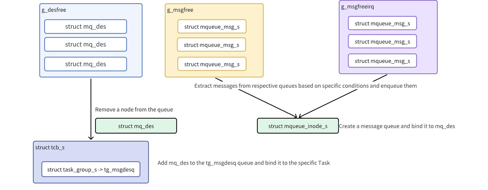

# Message Queue Development Guide

\[ English | [简体中文](../../../../zh-cn/device_dev_guide/kernel/IPC/message_queue.md) \]

## I. Overview

This document introduces how to use POSIX (Portable Operating System Interface) message queues in the openvela operating system. Message queues are a key mechanism for implementing reliable, asynchronous communication between tasks.

openvela OS adheres to the **POSIX** standard and provides a complete set of message queue APIs, allowing any task or interrupt service routine (ISR) to safely send and receive data. This standardized interface ensures good portability of the code.

Core features:

- **Named Queues**: Message queues are identified by a globally unique name, allowing multiple unrelated tasks to access the same queue.
- **Priority Messages**: Tasks can specify priorities for sent messages, and higher-priority messages are received first.
- **Blocking and Non-Blocking Operations**: The API supports three modes: blocking, non-blocking, and timeout, providing flexible synchronization strategies for different application scenarios.
- **Interrupt Safety**: You can safely send messages in interrupt service routines.

## II. Pre-requisite Concepts

In the source code, several groups of low-level macros/functions for synchronization and mutual exclusion frequently appear. Understanding them is crucial for in-depth analysis of kernel behavior.

### 1. `enter_critical_section/leave_critical_section`

These two functions are used to create a **critical section** and are the strongest level of locks in the system.

- **Function**: In a single-core system, it is implemented by **disabling interrupts**. In a multi-core system, it is used in conjunction with a spinlock.
- **Purpose**: It protects not only shared data between multiple tasks but, more importantly, shared data between tasks and interrupt service routines (ISRs). Since `mq_send` can be called in an interrupt, modifications to core data such as message linked lists and count values must be performed in an environment where concurrency (including interrupts) is completely prohibited.
- **Usage Principle**: The critical section should be as short as possible because disabling interrupts increases the system's interrupt latency.

### 2. `sched_lock/sched_unlock`

This pair of functions is used to lock/unlock the **scheduler**.

- **Function**: Prohibits task context switching, i.e., prohibits task preemption.
- **Difference from Critical Section**: It does not disable interrupts. When the scheduler is locked, interrupts can still occur and be processed normally, but after interrupt handling, the system will not perform task switching and will continue to run the locked task.
- **Purpose**: Used to protect the atomicity of a segment of logic, ensuring that it will not be interrupted by being preempted by a higher-priority task during execution. Its overhead is smaller than switching interrupts on and off.

### 3. `enter_cancellation_point/leave_cancellation_point`

This pair of functions is related to the POSIX thread cancellation mechanism.

- **Function**: Defines a cancellation point. According to the POSIX standard, functions that may block permanently, such as `mq_receive`, `read`, and `sleep`, must all be cancellation points.
- **Purpose**: When a task (thread) is requested to be canceled by another task (e.g., via `pthread_cancel`), it does not terminate immediately but continues to run until it reaches the next cancellation point. At the cancellation point, the system checks whether the task has a pending cancellation request. If so, it performs the cancellation operation to make the task exit. This ensures that the task can be terminated in a safe and known state.

## III. Prerequisites

Before starting development, include the header file in your code:

```c
#include <mqueue.h>
```

## IV. API Reference

We classify the APIs based on their roles in the message queue lifecycle: **lifecycle management**, **data transmission**, and **attributes and notifications**.

### 1. Lifecycle Management

Manages the creation, opening, closing, and deletion of message queues.

#### `mq_open()` - Create or Open a Message Queue

This function opens an existing message queue or creates a new queue based on the `oflags` parameter. Upon successful invocation, it returns a message queue descriptor (`mqd_t`) for use in subsequent functions.

```c
mqd_t mq_open(FAR const char *mq_name, int oflags, ...)
```

**Parameters**

| Parameter | Description                                                           |
| --------- | --------------------------------------------------------------------- |
| mq_name   | Pointer to the message queue name string, e.g., "/my_queue".          |
| oflags    | Operation flag bits, which can be combined using bitwise OR (&#124;). |

Common values for `oflags` include:

- Access modes (choose one):
    - `O_RDONLY`: Open for reading only.
    - `O_WRONLY`: Open for writing only.
    - `O_RDWR`: Open for reading and writing.

- Creation flags (optional):
    - `O_CREAT`: Create the queue if it does not exist.
        - When using this flag, `mq_open` requires two additional parameters: `mode_t mode` and `struct mq_attr *attr`.
    - `O_EXCL`: Used in conjunction with `O_CREAT`; if the queue already exists, the call fails.
    - `O_NONBLOCK`: Open in non-blocking mode, affecting subsequent `mq_send()` and `mq_receive()` calls.

#### `mq_close()` - Close a Message Queue

This function disconnects the calling task from the specified message queue.

```c
int mq_close(mqd_t mqdes)
```

**Notes**:

- Calling `mq_close()` does not destroy the message queue itself but only releases the descriptor held by the current task.
- Other tasks can still access the queue via `mq_open()`.

#### `mq_unlink()` - Delete a Message Queue

This function removes a message queue from the system.

```c
int mq_unlink(FAR const char *mq_name)
```

This interface deletes the message queue named `mq_name`. When one or more tasks have a message queue open, calling `mq_unlink` will wait until all tasks referencing the message queue have performed the close operation before deleting the message queue.

**Notes**:

- If `mq_unlink()` is called while tasks still have the queue open, the system marks the queue as "to be deleted".
- The system will wait until all tasks referencing the queue have called `mq_close()` before truly releasing the queue resources.

### 2. Data Transmission

Responsible for sending and receiving messages between tasks.

#### `mq_send()`/`mq_timedsend()` - Send a Message

```c
int mq_send(mqd_t mqdes, const void *msg, size_t msglen, int prio)
int mq_timedsend(mqd_t mqdes, const char *msg, size_t msglen, int prio,
                 const struct timespec *abstime);
```

Behavioral characteristics:

- Queue is full:
    - If the queue is full and `O_NONBLOCK` is not set:
        - `mq_send()` will block indefinitely until space is available in the queue.
        - `mq_timedsend()` will block until the absolute time specified by `abstime` times out.
    - If `O_NONBLOCK` is set, the function returns an error immediately without blocking.
- Message length: `msglen` must not exceed the maximum message length (`mq_msgsize`) defined in the queue attributes.

#### `mq_receive()`/`mq_timedreceive()` - Receive a Message

These two functions remove and return the highest-priority, longest-waiting message from the specified queue.

```c
ssize_t mq_receive(mqd_t mqdes, void *msg, size_t msglen, int *prio);
ssize_t mq_timedreceive(mqd_t mqdes, void *msg, size_t msglen,
                        int *prio, const struct timespec *abstime);
```

Behavioral characteristics:

- Queue is empty:
    - If the queue is empty and `O_NONBLOCK` is not set:
        - `mq_receive()` will block indefinitely until a new message arrives.
        - `mq_timedreceive()` will block until the absolute time specified by `abstime` times out.
    - If `O_NONBLOCK` is set, the function returns an error immediately.
- Multiple tasks waiting: If multiple tasks are waiting for the same empty queue, when a new message arrives, the system wakes up the task that has been waiting the longest and has the highest priority.
- Buffer size: `msglen` must be greater than or equal to the queue's maximum message length (`mq_msgsize`).

### 3. Attributes and Notifications

Used to query and configure advanced features of message queues.

#### `mq_getattr()`/`mq_setattr()` - Get and Set Queue Attributes

These two functions are used to query and modify the attributes of a message queue, respectively.

```c
int mq_getattr(mqd_t mqdes, FAR struct mq_attr *mq_stat);
int mq_setattr(mqd_t mqdes, FAR const struct mq_attr *mq_stat,
               FAR struct mq_attr *oldstat);
```

The `struct mq_attr` structure includes:

| Member     | Description                                                                 |
| ---------- | --------------------------------------------------------------------------- |
| mq_flags   | Queue flags (e.g., O_NONBLOCK).                                             |
| mq_maxmsg  | Maximum number of messages the queue can hold.                              |
| mq_msgsize | Maximum number of bytes per message.                                        |
| mq_curmsgs | Current number of messages in the queue (only obtainable via mq_getattr()). |

#### `mq_notify()` - Register Asynchronous Notification

This function registers an asynchronous event notification for a message queue. When an empty queue receives its first message, the system sends a signal to the registered task.

```c
int mq_notify(mqd_t mqdes, const struct sigevent *notification);
```

Working mechanism:

1. When the input parameter `notification` is non-`NULL`, `mq_notify` establishes a notification association between the current task and the message queue.
2. When a new message is put into the message queue, the system sends the signal defined in the `notification` to the task.
3. One-shot notification: After the signal is delivered, the notification registration is automatically removed. You must call `mq_notify()` again to receive the next notification.
4. When `notification` is `NULL`, the function removes the existing notification association.

**Note**:

- At any given time, only one task can successfully register for notifications of a particular message queue.

## V. Data Structures

To gain an in-depth understanding of the message queue's working mechanism, this section introduces its internal implementation in openvela OS, including core data structures and memory management strategies.

openvela OS implements each POSIX message queue as an inode node of a pseudo-file system in its architecture. This design unifies the kernel resource model, allowing message queues to be named and accessed like files.

Its core implementation includes two key components: the **message memory pool** and **core data structures**.

### 1. Message Memory Pool Management

To ensure real-time performance and deterministic memory usage, openvela OS uses a pre-allocated memory pool to manage message entities. The system creates two dedicated global message pools at startup.

- `g_msgfree`: General message pool, providing message storage space for ordinary tasks (Tasks).

    - Allocation strategy: When a task sends a message, the system first attempts to obtain a pre-allocated message block from this pool.
    - Dynamic expansion: If this pool is exhausted, the system will attempt to dynamically allocate memory via `malloc()` to create new message blocks and mark them as `MQ_ALLOC_DYN`.
    - Release: After a message is received, pre-allocated message blocks are returned to the `g_msgfree` pool; dynamically allocated message blocks are released via `free()` to prevent memory leaks.

- `g_msgfreeirq`: Interrupt-dedicated message pool, exclusively for interrupt service routines (ISRs).

    - Allocation strategy: When an interrupt service routine sends a message, the system obtains a message block from this pool.
    - No dynamic allocation: To ensure fast and deterministic interrupt handling, if this pool is exhausted, the system will directly return failure and never perform dynamic memory allocation.
    - Release: After a message is received, the message block is returned to the `g_msgfreeirq` pool.

This separate design ensures that even if the general message pool is exhausted or memory is fragmented, critical communication in interrupt services can still be executed reliably.

### 2. Core Data Structures

The functionality of the message queue is implemented by two core structures:

- `struct mqueue_inode_s` defines the queue itself.
- `struct mqueue_msg_s` defines the messages passed in the queue.

#### Message Queue Definition

`mqueue_inode_s` represents a complete message queue instance, including all its attributes and status.

```c
/* Common prologue of all message queue structures. */

struct mqueue_cmn_s
{
  dq_queue_t waitfornotempty; /* Task list waiting for not empty */
  dq_queue_t waitfornotfull;  /* Task list waiting for not full */
  int16_t nwaitnotfull;       /* Number tasks waiting for not full */
  int16_t nwaitnotempty;      /* Number tasks waiting for not empty */
};

/* This structure defines a message queue */

struct mqueue_inode_s
{
  struct mqueue_cmn_s cmn;    /* Common prologue */
  FAR struct inode *inode;    /* Containing inode */
  struct list_node msglist;   /* Prioritized message list */
  int16_t maxmsgs;            /* Maximum number of messages in the queue */
  int16_t nmsgs;              /* Number of message in the queue */
#if CONFIG_MQ_MAXMSGSIZE < 256
  uint8_t maxmsgsize;         /* Max size of message in message queue */
#else
  uint16_t maxmsgsize;        /* Max size of message in message queue */
#endif
#ifndef CONFIG_DISABLE_MQUEUE_NOTIFICATION
  pid_t ntpid;                /* Notification: Receiving Task's PID */
  struct sigevent ntevent;    /* Notification description */
  struct sigwork_s ntwork;    /* Notification work */
#endif
  FAR struct pollfd *fds[CONFIG_FS_MQUEUE_NPOLLWAITERS];
};
```

**Key member analysis**:

| Member        | Description                                                                                                |
| ------------- | ---------------------------------------------------------------------------------------------------------- |
| msglist       | A priority-sorted linked list for storing all pending messages.                                            |
| ntpid/ntevent | Used to implement the mq_notify() function, recording which task is waiting for asynchronous notification. |

#### Message Entity

`mqueue_msg_s` represents an independent message, which exists as a linked list node in the `msglist` of `mqueue_inode_s`.

```c
enum mqalloc_e
{
  MQ_ALLOC_FIXED = 0,  /* pre-allocated; never freed */
  MQ_ALLOC_DYN,        /* dynamically allocated; free when unused */
  MQ_ALLOC_IRQ         /* Preallocated, reserved for interrupt handling */
};

/* This structure describes one buffered POSIX message. */
struct mqueue_msg_s
{
  FAR struct mqueue_msg_s *next;  /* Forward link to next message */
  uint8_t type;                   /* (Used to manage allocations) */
  uint8_t priority;               /* priority of message */
#if MQ_MAX_BYTES < 256
  uint8_t msglen;                 /* Message data length */
#else
  uint16_t msglen;                /* Message data length */
#endif
  char mail[1];                   /* Message data */
};
```

Key member analysis:

| Member   | Description                                                                                                                            |
| -------- | -------------------------------------------------------------------------------------------------------------------------------------- |
| type     | Marks the source of the message block, determining whether it is returned to the memory pool or freed via free() after being received. |
| priority | Specified in mq_send, used to insert the message into the correct position in the queue.                                               |
| mail     | The actual payload of the message, whose actual size is determined at the time of allocation.                                          |

#### System Initialization

openvela OS calls `nxmq_initialize()` in the `nx_start()` function during system startup to complete the initialization of the message queue subsystem.

```c
/****************************************************************************
 * Name: nxmq_initialize
 *
 * Description:
 *   This function initializes the message system.  This function must
 *   be called early in the initialization sequence before any of the
 *   other message interfaces execute.
 *
 * Input Parameters:
 *   None
 *
 * Returned Value:
 *   None
 *
 ****************************************************************************/

void nxmq_initialize(void)
{
  FAR void *msg = &g_msgpool;

  sched_trace_begin();

  /* Initialize a block of messages for general use */
#ifndef CONFIG_DISABLE_MQUEUE
  list_initialize(&g_msgfree);

  msg = mq_msgblockinit(&g_msgfree, msg, CONFIG_PREALLOC_MQ_MSGS,
                         MQ_ALLOC_FIXED);

  /* Initialize a block of messages for use exclusively by
   * interrupt handlers
   */
  list_initialize(&g_msgfreeirq);

  msg = mq_msgblockinit(&g_msgfreeirq, msg, CONFIG_PREALLOC_MQ_IRQ_MSGS,
                         MQ_ALLOC_IRQ);
#endif

#ifndef CONFIG_DISABLE_MQUEUE_SYSV
  list_initialize(&g_msgfreelist);

  msg = sysv_msgblockinit(&g_msgfreelist, msg, CONFIG_PREALLOC_MQ_MSGS);
#endif

  sched_trace_end();
}
```

The main responsibilities of this function are:

1. Initialize the linked list headers of `g_msgfree` and `g_msgfreeirq`.
2. Call `mq_msgblockinit()` to split a specified number of message blocks from the system-reserved memory area (`g_msgpool`) and link them to the above two pools, respectively, to complete preallocation.

At this point, the message queue subsystem is ready and can respond to API calls from tasks and interrupts.

## VI. Implementation Principles

This section delves into the internal workflow of openvela OS message queues. The essence of the design lies in abstracting the message queue as an `inode` node in the virtual file system (VFS), thereby reusing the file system's naming, lookup, and permission management mechanisms.



The core process of the entire lifecycle can be summarized as follows:

- Creation/Opening (`mq_open`): Tasks access message queues via a unique name. The system looks up or creates a corresponding `inode` in the VFS and associates it with a newly allocated `mqueue_inode_s` structure.
- Sending/Receiving (`mq_send`/`mq_receive`): The core of data transmission is the `mqueue_msg_s` structure, which acts like a container. When sending, the system retrieves a container from the global memory pool (`g_msgfree` or `g_msgfreeirq`), loads the data, and hangs it into the target queue's `msglist`. The reverse occurs when receiving.
- Closing/Deleting (`mq_close`/`mq_unlink`): `mq_close` decrements the `inode` reference count. When the count reaches zero, `mq_unlink` can truly release the resources occupied by `inode` and `mqueue_inode_s`.

Below, we analyze the detailed implementation using key APIs as clues.

### 1. `mq_open`: Queue Creation and Connection

`mq_open` is the entry point for all operations, responsible for parsing a string name and associating it with a kernel message queue object.

The `mq_open` function performs the following tasks:

Its internal implementation logic (mainly in the `file_mq_vopen` function) can be broken down into the following steps:

1. Path resolution: Concatenate the user-provided `mq_name` (e.g., `"my_queue"`) with the system's preset mount point path (`CONFIG_FS_MQUEUE_VFS_PATH`, typically `"/var/mqueue"`) to form a complete VFS path, such as `"/var/mqueue/my_queue"`.
2. Atomic lookup: Enter a critical section (`enter_critical_section`) to ensure atomicity of the operation, then call `inode_find()` to look up the path in the VFS for the corresponding `inode`.
3. Branch processing:

    - Case A: The message queue already exists (`inode_find` is successful)

        - Check that the found `inode` is indeed a message queue type.
        - If the caller specifies both `O_CREAT` and `O_EXCL` flags, return an `EEXIST` error.
        - Success, associate the returned file descriptor with this existing `inode`. Increment the `inode` reference count by one.

    - Case B: The message queue does not exist (`inode_find` fails)

        - Check if the caller specified the `O_CREAT` flag; if not, return an `ENOENT` error.
        - Call `inode_reserve()` to create an `inode` node for the new queue in the VFS.
        - Call `nxmq_alloc_msgq()` to allocate and initialize an `mqueue_inode_s` structure.
        - Bind the newly created `inode` to the `mqueue_inode_s`:
            - `inode->i_private = msgq`
            - `msgq->inode = inode`

        - Set the initial reference count of the `inode` to 1.

Key code is as follows:

```c
static int file_mq_vopen(FAR struct file *mq, FAR const char *mq_name,
                         int oflags, mode_t umask, va_list ap,
                         FAR int *created)
{
  FAR struct inode *inode;
  FAR struct mqueue_inode_s *msgq;
  FAR struct mq_attr *attr = NULL;
  struct inode_search_s desc;
  char fullpath[MAX_MQUEUE_PATH];
  irqstate_t flags;
  mode_t mode = 0;
  int ret;

  /* Make sure that a non-NULL name is supplied */

  if (!mq || !mq_name || *mq_name == '\0')
    {
      ret = -EINVAL;
      goto errout;
    }

  if (sizeof(CONFIG_FS_MQUEUE_VFS_PATH) + 1 + strlen(mq_name)
      >= MAX_MQUEUE_PATH)
    {
      ret = -ENAMETOOLONG;
      goto errout;
    }

  /* Were we asked to create it? */

  if ((oflags & O_CREAT) != 0)
    {
      /* We have to extract the additional
       * parameters from the variable argument list.
       */

      mode = va_arg(ap, mode_t);
      attr = va_arg(ap, FAR struct mq_attr *);
      if (attr != NULL)
        {
          if (attr->mq_maxmsg <= 0 || attr->mq_msgsize <= 0)
            {
              ret = -EINVAL;
              goto errout;
            }
        }
    }

  mode &= ~umask;

  /* Skip over any leading '/'.  All message queue paths are relative to
   * CONFIG_FS_MQUEUE_VFS_PATH.
   */

  while (*mq_name == '/')
    {
      mq_name++;
    }

  /* Get the full path to the message queue */

  snprintf(fullpath, MAX_MQUEUE_PATH,
           CONFIG_FS_MQUEUE_VFS_PATH "/%s", mq_name);

  /* Make sure that the check for the existence of the message queue
   * and the creation of the message queue are atomic with respect to
   * other processes executing mq_open().  A simple sched_lock() would
   * be sufficient for non-SMP case but critical section is needed for
   * SMP case.
   */

  flags = enter_critical_section();

  /* Get the inode for this mqueue.  This should succeed if the message
   * queue has already been created.  In this case, inode_find() will
   * have incremented the reference count on the inode.
   */

  SETUP_SEARCH(&desc, fullpath, false);

  ret = inode_find(&desc);
  if (ret >= 0)
    {
      /* Something exists at this path.  Get the search results */

      inode = desc.node;

      /* Verify that the inode is a message queue */

      if (!INODE_IS_MQUEUE(inode))
        {
          ret = -ENXIO;
          goto errout_with_inode;
        }

      /* It exists and is a message queue.  Check if the caller wanted to
       * create a new mqueue with this name.
       */

      if ((oflags & (O_CREAT | O_EXCL)) == (O_CREAT | O_EXCL))
        {
          ret = -EEXIST;
          goto errout_with_inode;
        }

      /* Associate the inode with a file structure */

      memset(mq, 0, sizeof(*mq));
      mq->f_oflags = oflags;
      mq->f_inode  = inode;

      if (created)
        {
          *created = 1;
        }
    }
  else
    {
      /* The mqueue does not exists.  Were we asked to create it? */

      if ((oflags & O_CREAT) == 0)
        {
          /* The mqueue does not exist and O_CREAT is not set */

          ret = -ENOENT;
          goto errout_with_lock;
        }

      /* Create an inode in the pseudo-filesystem at this path */

      inode_lock();
      ret = inode_reserve(fullpath, mode, &inode);
      inode_unlock();

      if (ret < 0)
        {
          goto errout_with_lock;
        }

      /* Allocate memory for the new message queue.  The new inode will
       * be created with a reference count of zero.
       */

      ret = nxmq_alloc_msgq(attr, &msgq);
      if (ret < 0)
        {
          goto errout_with_inode;
        }

      /* Associate the inode with a file structure */

      memset(mq, 0, sizeof(*mq));
      mq->f_oflags = oflags;
      mq->f_inode  = inode;

      INODE_SET_MQUEUE(inode);
      inode->u.i_ops    = &g_nxmq_fileops;
      inode->i_private  = msgq;
      msgq->inode       = inode;

      /* Set the initial reference count on this inode to one */

      atomic_fetch_add(&inode->i_crefs, 1);

      if (created)
        {
          *created = 0;
        }
    }

  RELEASE_SEARCH(&desc);
  leave_critical_section(flags);
#ifdef CONFIG_FS_NOTIFY
  notify_open(fullpath, oflags);
#endif
  return OK;

errout_with_inode:
  inode_release(inode);

errout_with_lock:
  RELEASE_SEARCH(&desc);
  leave_critical_section(flags);

errout:
  return ret;
}
```

#### `nxmq_alloc_msgq()`: Allocation of Message Queue Instances

This function is responsible for creating the core data structure `mqueue_inode_s` of the message queue. Its implementation is relatively simple and straightforward:

```c
int nxmq_alloc_msgq(FAR struct mq_attr *attr,
                    FAR struct mqueue_inode_s **pmsgq)
{
  FAR struct mqueue_inode_s *msgq;

  /* Check if the caller is attempting to allocate a message for messages
   * larger than the configured maximum message size.
   */

  DEBUGASSERT((!attr || attr->mq_msgsize <= MQ_MAX_BYTES) && pmsgq);
  if ((attr && attr->mq_msgsize > MQ_MAX_BYTES) || !pmsgq)
    {
      return -EINVAL;
    }

  /* Allocate memory for the new message queue. */

  msgq = (FAR struct mqueue_inode_s *)
    kmm_zalloc(sizeof(struct mqueue_inode_s));

  if (msgq)
    {
      /* Initialize the new named message queue */

      list_initialize(&msgq->msglist);
      if (attr)
        {
          msgq->maxmsgs    = (int16_t)attr->mq_maxmsg;
          msgq->maxmsgsize = (int16_t)attr->mq_msgsize;
        }
      else
        {
          msgq->maxmsgs    = MQ_MAX_MSGS;
          msgq->maxmsgsize = MQ_MAX_BYTES;
        }

#ifndef CONFIG_DISABLE_MQUEUE_NOTIFICATION
      msgq->ntpid = INVALID_PROCESS_ID;
#endif

      dq_init(&msgq->cmn.waitfornotempty);
      dq_init(&msgq->cmn.waitfornotfull);
    }
  else
    {
      return -ENOSPC;
    }

  *pmsgq = msgq;
  return OK;
} 
```

Through this series of operations, `mq_open` skillfully integrates POSIX message queues into the system's VFS framework, laying the foundation for subsequent data sending and receiving.

### 2. `mq_send`: Message Sending and Blocking

`mq_send` is responsible for delivering a prioritized message to the target queue. The core of its implementation is handling different strategies when the queue is full: return immediately, block and wait, or return on timeout.

Its main logic is implemented by the internal function `file_mq_timedsend_internal`, and the process can be divided into the following two scenarios:

#### Scenario A: Queue is Not Full

1. **Message preallocation**: Before entering the critical section, the system first calls `nxmq_alloc_msg()` to apply for an `mqueue_msg_s` structure from the global memory pool and uses `memcpy` to fill in the user data and priority. This preprocessing reduces work in the critical section and improves efficiency.
2. **Enter critical section**: Call `enter_critical_section()` to ensure that modifications to the queue state are atomic.
3. **Insert message**: Call `nxmq_add_queue()`, which inserts the message into the correct position in the `msgq->msglist` linked list based on the message's priority. This is a priority-sorted insertion operation to ensure that higher-priority messages are always at the front of the list.
4. **Update queue status**:

    - Increment the queue's current message count `nmsgs` by one.
    - **Wake up receivers**: If the queue was empty before (`nmsgs` changed from 0 to 1), it means there may be tasks blocked on `mq_receive` due to an empty queue. At this point, `nxmq_notify_send()` needs to be called to wake up these waiting receiver tasks.

5. Exit critical section: `leave_critical_section()`.
6. Successful return.

##### Scenario B: Queue is Full

1. **Check non-blocking condition**: When `msgq->nmsgs >= msgq->maxmsgs`, the system first determines whether blocking is allowed:
    - Interrupt context: If currently in an interrupt (`up_interrupt_context()`), blocking is never allowed, and `-EAGAIN` is returned immediately.
    - Non-blocking mode: If the queue is opened with the `O_NONBLOCK` flag, `-EAGAIN` is also returned immediately.

2. **Transition to waiting**: If blocking is allowed, call the `nxmq_wait_send()` function, and the task will sleep here waiting for available space in the queue.
3. **Wait for return**:

    - If `nxmq_wait_send` returns successfully (i.e., the task is woken up and space is available in the queue), the process returns to step 3 of **Scenario A** to insert the preallocated message into the queue.
    - If it fails due to timeout or signal interruption, call `nxmq_free_msg()` to release the previously preallocated message body and return an error code to the upper layer.

Key code is as follows:

```c
/****************************************************************************
 * Name: file_mq_timedsend_internal
 *
 * Description:
 *   This is an internal function of file_mq_timedsend()/file_mq_ticksend(),
 *   please refer to the detailed description for more information.
 *
 * Input Parameters:
 *   mq      - Message queue descriptor
 *   msg     - Message to send
 *   msglen  - The length of the message in bytes
 *   prio    - The priority of the message
 *   abstime - the absolute time to wait until a timeout is decleared
 *   ticks   - Ticks to wait from the start time until the semaphore is
 *             posted.
 *
 * Returned Value:
 *   This is an internal OS interface and should not be used by applications.
 *   It follows the NuttX internal error return policy:  Zero (OK) is
 *   returned on success.  A negated errno value is returned on failure.
 *   (see mq_timedsend() for the list list valid return values).
 *
 *   EAGAIN   The queue was empty, and the O_NONBLOCK flag was set for the
 *            message queue description referred to by mq.
 *   EINVAL   Either msg or mq is NULL or the value of prio is invalid.
 *   EBADF    Message queue opened not opened for writing.
 *   EMSGSIZE 'msglen' was greater than the maxmsgsize attribute of the
 *            message queue.
 *   EINTR    The call was interrupted by a signal handler.
 *
 ****************************************************************************/

static
int file_mq_timedsend_internal(FAR struct file *mq, FAR const char *msg,
                               size_t msglen, unsigned int prio,
                               FAR const struct timespec *abstime,
                               sclock_t ticks)
{
  FAR struct mqueue_inode_s *msgq;
  FAR struct mqueue_msg_s *mqmsg;
  irqstate_t flags;
  int ret = 0;

  /* Verify the input parameters */

  if (abstime && (abstime->tv_nsec < 0 || abstime->tv_nsec >= 1000000000))
    {
      return -EINVAL;
    }

  if (mq == NULL)
    {
      return -EINVAL;
    }

#ifdef CONFIG_DEBUG_FEATURES
  /* Verify the input parameters on any failures to verify. */

  ret = nxmq_verify_send(mq, msg, msglen, prio);
  if (ret < 0)
    {
      return ret;
    }
#endif

  msgq = mq->f_inode->i_private;

  /* Pre-allocate a message structure */

  mqmsg = nxmq_alloc_msg(msglen);
  if (!mqmsg)
    {
      return -ENOMEM;
    }

  memcpy(mqmsg->mail, msg, msglen);
  mqmsg->priority = prio;
  mqmsg->msglen   = msglen;

  /* Disable interruption */

  flags = enter_critical_section();

  if (msgq->nmsgs >= msgq->maxmsgs)
    {
      /* Verify that the message is full and we can't wait */

      if ((up_interrupt_context() || (mq->f_oflags & O_NONBLOCK) != 0))
        {
          ret = -EAGAIN;
          goto out;
        }

      /* The message queue is full.  We will need to wait for the message
       * queue to become non-full.
       */

      ret = nxmq_wait_send(msgq, abstime, ticks);
      if (ret < 0)
        {
          goto out;
        }
    }

  /* Add the message to the message queue */

  nxmq_add_queue(msgq, mqmsg, prio);

  /* Increment the count of messages in the queue */

  if (msgq->nmsgs++ == 0)
    {
      nxmq_pollnotify(msgq, POLLIN);
    }

  /* Notify any tasks that are waiting for a message to become available */

  nxmq_notify_send(msgq);

out:
  leave_critical_section(flags);

  if (ret < 0)
    {
      nxmq_free_msg(mqmsg);
    }

  return ret;
}
```

`nxmq_wait_send`: Waiting for Queue Space

`nxmq_wait_send` functions in concert with `nxmq_wait_receive`, responsible for blocking sending tasks when the queue is full. Its mechanism is closely integrated with the scheduler to ensure efficient resource utilization.

Its core blocking logic is very similar to `nxmq_wait_receive`, with the difference being the waiting conditions and the lists used.

```c
/****************************************************************************
 * Name: nxmq_wait_send
 
 * Description:
 *   This is internal, common logic shared by both [nx]mq_send and
 *   [nx]mq_timesend.  This function waits until the message queue is not
 *   full.
 *
 * Input Parameters:
 *   msgq   - Message queue descriptor
 *   oflags - flags from user set
 *
 * Returned Value:
 *   On success, nxmq_wait_send() returns 0 (OK); a negated errno value is
 *   returned on any failure:
 *
 *   EAGAIN    The queue was full and the O_NONBLOCK flag was set for the
 *             message queue description referred to by msgq.
 *   EINTR     The call was interrupted by a signal handler.
 *   ETIMEDOUT A timeout expired before the message queue became non-full
 *             (mq_timedsend only).
 *
 * Assumptions/restrictions:
 * - The caller has verified the input parameters using nxmq_verify_send().
 * - Executes within a critical section established by the caller.
 *
 ****************************************************************************/

int nxmq_wait_send(FAR struct mqueue_inode_s *msgq, int oflags)
{
  FAR struct tcb_s *rtcb;
  bool switch_needed;

#ifdef CONFIG_CANCELLATION_POINTS
  /* nxmq_wait_send() is not a cancellation point, but may be called via
   * mq_send() or mq_timedsend() which are cancellation points.
   */

  if (check_cancellation_point())
    {
      /* If there is a pending cancellation, then do not perform
       * the wait.  Exit now with ECANCELED.
       */

      return -ECANCELED;
    }
#endif

  /* Verify that the queue is indeed full as the caller thinks */

  /* Loop until there are fewer than max allowable messages in the
   * receiving message queue
   */

  while (msgq->nmsgs >= msgq->maxmsgs)
    {
      /* Should we block until there is sufficient space in the
       * message queue?
       */

      if ((oflags & O_NONBLOCK) != 0)
        {
          /* No... We will return an error to the caller. */

          return -EAGAIN;
        }

      /* Block until the message queue is no longer full.
       * When we are unblocked, we will try again
       */

      rtcb          = this_task();
      rtcb->waitobj = msgq;
      msgq->cmn.nwaitnotfull++;

      /* Initialize the errcode used to communication wake-up error
       * conditions.
       */

      rtcb->errcode = OK;

      /* Make sure this is not the idle task, descheduling that
       * isn't going to end well.
       */

      DEBUGASSERT(!is_idle_task(rtcb));

      /* Remove the tcb task from the ready-to-run list. */

      switch_needed = nxsched_remove_readytorun(rtcb, true);

      /* Add the task to the specified blocked task list */

      rtcb->task_state = TSTATE_WAIT_MQNOTFULL;
      nxsched_add_prioritized(rtcb, MQ_WNFLIST(msgq->cmn));

      /* Now, perform the context switch if one is needed */

      if (switch_needed)
        {
          up_switch_context(this_task(), rtcb);
        }

      /* When we resume at this point, either (1) the message queue
       * is no longer empty, or (2) the wait has been interrupted by
       * a signal.  We can detect the latter case be examining the
       * per-task errno value (should be EINTR or ETIMEDOUT).
       */

      if (rtcb->errcode != OK)
        {
          return -rtcb->errcode;
        }
    }

  return OK;
}
```

### 3. `mq_receive`: Message Reception and Waiting

The `mq_receive()` interface is the reverse operation of message sending, responsible for safely retrieving messages from the queue. Its core tasks include:

- **Parameter validation**: Call `nxmq_verify_receive()` to validate the incoming buffer, length, and other parameters.
- **Message acquisition**: Attempt to obtain a message from the message queue.
- **Blocking handling**: When the queue is empty, decide whether to immediately return an error or call `nxmq_wait_receive()` to block the current task until a new message arrives or a timeout occurs, based on the queue attributes (whether it is `O_NONBLOCK`).
- **Data copying and resource release**: After successfully acquiring a message, copy its content to the user buffer and call `nxmq_free_msg()` to release the message structure.
- **Wake up senders**: When the receive operation changes a full queue to idle, wake up sending tasks blocked due to a full queue via `nxmq_notify_receive()`.

The execution flow of its internal implementation `file_mq_timedreceive_internal` can be divided into two scenarios:

#### Scenario A: Queue is Not Empty

1. Enter critical section: Call `enter_critical_section()` to lock the scheduler and ensure the atomicity of subsequent operations.
2. Extract message: Directly remove a message node from the head of the message linked list `msgq->msglist` (`list_remove_head`). Since `mq_send` inserts messages by priority, what is taken out here is always the longest-waiting and highest-priority message in the queue.
3. Update queue status and wake up senders:

    - After successfully acquiring the message, decrement the queue's current message count `nmsgs` by one.
    - Key wake-up: Check if `nmsgs` was equal to `maxmsgs` before decrementing (`if (msgq->nmsgs-- == msgq->maxmsgs)`). If so, it means the queue has just changed from a full state to a non-full state, and sending tasks that may be waiting must be woken up at this point.
    - Call `nxmq_notify_receive()`, which finds one (or more) waiting sending tasks from the `waitfornotfull` list and moves them back to the ready queue.
    - Simultaneously, issue a `POLLOUT` event via `nxmq_pollnotify(msgq, POLLOUT)` to notify `poll/select` watchers that the queue is now writable.

4. Exit critical section: Call `leave_critical_section()` to resume scheduling.
5. Data return and resource recovery:

    - Use `memcpy` to copy the data in the message node to the user-provided buffer.
    - Call `nxmq_free_msg()` to return the message node to the global memory pool.

#### Scenario B: Queue is EmptyRPMsg employs a layered architecture

1. Check the non-blocking flag: If the queue is empty (`mqmsg == NULL`), first check whether the `O_NONBLOCK` flag was set when `mq_open` was called.
    - If set, immediately exit the critical section and return the `-EAGAIN` error.
2. Transition to waiting: If blocking is allowed, call the `nxmq_wait_receive()` function, and the task will sleep here.
3. Wait for return: After `nxmq_wait_receive` returns:
    - If a message is successfully acquired (`ret` is `OK`, and `mqmsg` points to the new message), the process returns to step 3 of **Scenario A** to continue execution.
    - If it fails due to timeout or signal interruption (`ret` is negative), directly exit the critical section and return the corresponding error code.

Key code is as follows:

```c
/****************************************************************************
 * Name: file_mq_timedreceive_internal
 *
 * Description:
 *   This is an internal function of file_mq_timedreceive()/
 *   file_mq_tickreceive(), please refer to the detailed description for
 *   more information.
 *
 * Input Parameters:
 *   mq      - Message Queue Descriptor
 *   msg     - Buffer to receive the message
 *   msglen  - Size of the buffer in bytes
 *   prio    - If not NULL, the location to store message priority.
 *   abstime - the absolute time to wait until a timeout is declared.
 *
 * Returned Value:
 *   On success, the length of the selected message in bytes is returned.
 *   On failure, -1 (ERROR) is returned and the errno is set appropriately:
 *
 *   EAGAIN    The queue was empty, and the O_NONBLOCK flag was set
 *             for the message queue description referred to by 'mqdes'.
 *   EPERM     Message queue opened not opened for reading.
 *   EMSGSIZE  'msglen' was less than the maxmsgsize attribute of the
 *             message queue.
 *   EINTR     The call was interrupted by a signal handler.
 *   EINVAL    Invalid 'msg' or 'mqdes' or 'abstime'
 *   ETIMEDOUT The call timed out before a message could be transferred.
 *
 ****************************************************************************/

static
ssize_t file_mq_timedreceive_internal(FAR struct file *mq, FAR char *msg,
                                      size_t msglen, FAR unsigned int *prio,
                                      FAR const struct timespec *abstime,
                                      sclock_t ticks)
{
  FAR struct mqueue_inode_s *msgq;
  FAR struct mqueue_msg_s *mqmsg;
  irqstate_t flags;
  ssize_t ret = 0;

  DEBUGASSERT(up_interrupt_context() == false);

  /* Verify the input parameters */

  if (abstime && (abstime->tv_nsec < 0 || abstime->tv_nsec >= 1000000000))
    {
      return -EINVAL;
    }

  if (mq == NULL)
    {
      return -EINVAL;
    }

#ifdef CONFIG_DEBUG_FEATURES
  /* Verify the input parameters and, in case of an error, set
   * errno appropriately.
   */

  ret = nxmq_verify_receive(mq, msg, msglen);
  if (ret < 0)
    {
      return ret;
    }
#endif

  msgq = mq->f_inode->i_private;

  /* Furthermore, nxmq_wait_receive() expects to have interrupts disabled
   * because messages can be sent from interrupt level.
   */

  flags = enter_critical_section();

  /* Get the message from the message queue */

  mqmsg = (FAR struct mqueue_msg_s *)list_remove_head(&msgq->msglist);
  if (mqmsg == NULL)
    {
      if ((mq->f_oflags & O_NONBLOCK) != 0)
        {
          leave_critical_section(flags);
          return -EAGAIN;
        }

      /* Wait & get the message from the message queue */

      ret = nxmq_wait_receive(msgq, &mqmsg, abstime, ticks);
      if (ret < 0)
        {
          leave_critical_section(flags);
          return ret;
        }
    }

  /* If we got message, then decrement the number of messages in
   * the queue while we are still in the critical section
   */

  if (msgq->nmsgs-- == msgq->maxmsgs)
    {
      nxmq_pollnotify(msgq, POLLOUT);
    }

  /* Notify all threads waiting for a message in the message queue */

  nxmq_notify_receive(msgq);

  leave_critical_section(flags);

  /* Return the message to the caller */

  if (prio)
    {
      *prio = mqmsg->priority;
    }

  memcpy(msg, mqmsg->mail, mqmsg->msglen);
  ret = mqmsg->msglen;

  /* Free the message structure */

  nxmq_free_msg(mqmsg);

  return ret;
}
```

`nxmq_wait_receive`: Task Blocking and Wake-Up

`nxmq_wait_receive` is the core of the receive mechanism's interaction with the scheduler, precisely controlling task blocking and wake-up.

```c
/****************************************************************************
 * Name: nxmq_wait_receive
 *
 * Description:
 *   This is internal, common logic shared by both [nx]mq_receive and
 *   [nx]mq_timedreceive.  This function waits for a message to be received
 *   on the specified message queue, removes the message from the queue, and
 *   returns it.
 *
 * Input Parameters:
 *   msgq   - Message queue descriptor
 *   rcvmsg - The caller-provided location in which to return the newly
 *            received message.
 *   abstime - If non-NULL, this is the absolute time to wait until a
 *             message is received.
 *
 * Returned Value:
 *   On success, zero (OK) is returned.  A negated errno value is returned
 *   on any failure.
 *
 * Assumptions:
 * - The caller has provided all validity checking of the input parameters
 *   using nxmq_verify_receive.
 * - Interrupts should be disabled throughout this call.  This is necessary
 *   because messages can be sent from interrupt level processing.
 * - For mq_timedreceive, setting of the timer and this wait must be atomic.
 *
 ****************************************************************************/

int nxmq_wait_receive(FAR struct mqueue_inode_s *msgq,
                      FAR struct mqueue_msg_s **rcvmsg,
                      FAR const struct timespec *abstime,
                      sclock_t ticks)
{
  FAR struct mqueue_msg_s *newmsg;
  FAR struct tcb_s *rtcb = this_task();

#ifdef CONFIG_CANCELLATION_POINTS
  /* nxmq_wait_receive() is not a cancellation point, but it may be called
   * from mq_receive() or mq_timedreceive() which are cancellation point.
   */

  if (check_cancellation_point())
    {
      /* If there is a pending cancellation, then do not perform
       * the wait.  Exit now with ECANCELED.
       */

      return -ECANCELED;
    }
#endif

  if (abstime)
    {
      wd_start_realtime(&rtcb->waitdog, abstime,
                        nxmq_rcvtimeout, (wdparm_t)rtcb);
    }
  else if (ticks >= 0)
    {
      wd_start(&rtcb->waitdog, ticks,
               nxmq_rcvtimeout, (wdparm_t)rtcb);
    }

  /* Get the message from the head of the queue */

  while ((newmsg = (FAR struct mqueue_msg_s *)
                   list_remove_head(&msgq->msglist)) == NULL)
    {
      msgq->cmn.nwaitnotempty++;

      /* Initialize the 'errcode" used to communication wake-up error
       * conditions.
       */

      rtcb->waitobj = msgq;
      rtcb->errcode = OK;

      /* Remove the tcb task from the running list. */

      nxsched_remove_self(rtcb);

      /* Add the task to the specified blocked task list */

      rtcb->task_state = TSTATE_WAIT_MQNOTEMPTY;
      nxsched_add_prioritized(rtcb, MQ_WNELIST(msgq->cmn));

      /* Now, perform the context switch */

      up_switch_context(this_task(), rtcb);

      /* When we resume at this point, either (1) the message queue
       * is no longer empty, or (2) the wait has been interrupted by
       * a signal.  We can detect the latter case be examining the
       * errno value (should be either EINTR or ETIMEDOUT).
       */

      if (rtcb->errcode != OK)
        {
          break;
        }
    }

  if (abstime || ticks >= 0)
    {
      wd_cancel(&rtcb->waitdog);
    }

  *rcvmsg = newmsg;
  return -rtcb->errcode;
}
```

Its blocking and wake-up process forms a perfect symmetry with `nxmq_wait_send`:

- Blocking: The task sets itself to the `TSTATE_WAIT_MQNOTEMPTY` state, hangs itself into the `waitfornotempty` linked list, and then goes to sleep.
- Wake-up: When `mq_send` successfully delivers a message to an empty queue, it retrieves the waiting receiver task from the `waitfornotempty` linked list and puts it back into the scheduler's ready list, completing the wake-up.

### 4. `mq_close`: Close a Message Queue

`mq_close()` is used to close an opened message queue descriptor and release resources related to the task.

```c
/****************************************************************************
 * Name: mq_close
 *
 * Description:
 *   This function is used to indicate that the calling task is finished
 *   with the specified message queue mqdes.  The mq_close() deallocates
 *   any system resources allocated by the system for use by this task for
 *   its message queue.
 *
 *   If the calling task has attached a notification to the message queue
 *   via this mqdes, this attachment will be removed and the message queue
 *   is available for another process to attach a notification.
 *
 * Input Parameters:
 *   mqdes - Message queue descriptor.
 *
 * Returned Value:
 *   0 (OK) if the message queue is closed successfully,
 *   otherwise, -1 (ERROR).
 *
 * Assumptions:
 * - The behavior of a task that is blocked on either a [nx]mq_send() or
 *   [nx]mq_receive() is undefined when mq_close() is called.
 * - The results of using this message queue descriptor after a successful
 *   return from mq_close() is undefined.
 *
 ****************************************************************************/

int mq_close(mqd_t mqdes)
{
  return close(mqdes);
}
```

### 5. `mq_unlink`: Destroy a Message Queue

The role of `mq_unlink()` is to remove and destroy a message queue from the system. This is fundamentally different from `mq_close()`: `mq_close()` only closes a task's **connection** (file descriptor) to the queue, while `mq_unlink()` aims to delete the queue itself completely.

Its implementation relies on the VFS (Virtual File System) `inode` reference count mechanism to ensure that resources are only released when no tasks are using the queue. This is an elegant deferred deletion mechanism.

Its core logic is implemented by `file_mq_unlink`, and the process is as follows:

1. **Find Inode**: Based on the incoming queue name, find the corresponding `inode` in the VFS's `mqueue` mount point (e.g., `/dev/mqueue/`). The `inode` is the core data structure used by the file system to describe a file or device, representing the entire message queue here.
2. **Remove Naming**: Call `inode_remove()` to remove the `inode` from the VFS directory tree. This means the queue can no longer be `mq_open`ed by name.
    - Key point: If tasks still have the queue open at this time (i.e., the `inode` reference count `i_crefs` > 1), `inode_remove()` will successfully unbind the name but return `-EBUSY`, indicating that the `inode` itself cannot be deleted immediately due to being referenced. This is an expected behavior.
3. **Release References and Trigger Destruction**: Finally, call `mq_inode_release()`, which is where the decision to destroy the queue is truly made.

Summary: `mq_unlink` marks a message queue as **to be deleted**. The system tracks its usage status through the `inode` reference count. When the last task using the queue calls `mq_close`, the reference count decrements to 1, at which point the condition in `mq_inode_release` is met, triggering `nxmq_free_msgq` to perform final resource recovery, including all unread messages in the queue.

Main code is as follows:

```c
/****************************************************************************
 * Name: file_mq_unlink
 *
 * Description:
 *   This is an internal OS interface.  It is functionally equivalent to
 *   mq_unlink() except that:
 *
 *   - It is not a cancellation point, and
 *   - It does not modify the errno value.
 *
 *  See comments with mq_unlink() for a more complete description of the
 *  behavior of this function
 *
 * Input Parameters:
 *   mq_name - Name of the message queue
 *
 * Returned Value:
 *   This is an internal OS interface and should not be used by applications.
 *   It follows the NuttX internal error return policy:  Zero (OK) is
 *   returned on success. A negated errno value is returned on failure.
 *
 ****************************************************************************/

int file_mq_unlink(FAR const char *mq_name)
{
  FAR struct inode *inode;
  struct inode_search_s desc;
  char fullpath[MAX_MQUEUE_PATH];
  int ret;

  /* Get the full path to the message queue */

  snprintf(fullpath, MAX_MQUEUE_PATH,
           CONFIG_FS_MQUEUE_VFS_PATH "/%s", mq_name);

  /* Get the inode for this message queue. */

  SETUP_SEARCH(&desc, fullpath, false);

  ret = inode_find(&desc);
  if (ret < 0)
    {
      /* There is no inode that includes in this path */

      goto errout_with_search;
    }

  /* Get the search results */

  inode = desc.node;

  /* Verify that what we found is, indeed, a message queue */

  if (!INODE_IS_MQUEUE(inode))
    {
      ret = -ENXIO;
      goto errout_with_inode;
    }

  /* Refuse to unlink the inode if it has children.  I.e., if it is
   * functioning as a directory and the directory is not empty.
   */

  inode_lock();
  if (inode->i_child != NULL)
    {
      ret = -ENOTEMPTY;
      goto errout_with_lock;
    }

  /* Remove the old inode from the tree.  Because we hold a reference count
   * on the inode, it will not be deleted now. This will put reference of
   * inode.
   */

  ret = inode_remove(fullpath);

  /* inode_remove() should always fail with -EBUSY because we hae a reference
   * on the inode.  -EBUSY means that the inode was, indeed, unlinked but
   * thatis could not be freed because there are references.
   */

  DEBUGASSERT(ret >= 0 || ret == -EBUSY);

  /* Now we do not release the reference count in the normal way (by calling
   * inode release.  Rather, we call mq_inode_release().  mq_inode_release
   * will decrement the reference count on the inode.  But it will also free
   * the message queue if that reference count decrements to zero.  Since we
   * hold one reference, that can only occur if the message queue is not
   * in-use.
   */

  inode_unlock();
  mq_inode_release(inode);
  RELEASE_SEARCH(&desc);
#ifdef CONFIG_FS_NOTIFY
  notify_unlink(fullpath);
#endif
  return OK;

errout_with_lock:
  inode_unlock();

errout_with_inode:
  inode_release(inode);

errout_with_search:
  RELEASE_SEARCH(&desc);
  return ret;
}
/****************************************************************************
 * Name: mq_inode_release
 *
 * Description:
 *   Release a reference count on a message queue inode.
 *
 * Input Parameters:
 *   inode - The message queue inode
 *
 * Returned Value:
 *   None
 *
 ****************************************************************************/

static void mq_inode_release(FAR struct inode *inode)
{
  if (atomic_read(&inode->i_crefs) <= 1)
    {
      FAR struct mqueue_inode_s *msgq = inode->i_private;

      if (msgq)
        {
          nxmq_free_msgq(msgq);
          inode->i_private = NULL;
        }
    }

  inode_release(inode);
}
```

### 6. `mq_timedsend`/`mq_timedreceive`: Timeout Mechanism

These two interfaces with the `timed` suffix have exactly the same main logic as `mq_send` / `mq_receive`, with the only difference being the addition of a **timeout waiting** function. This function is implemented through the kernel's watchdog timer.

Working principle:

1. Start the timer: When a task calls `mq_timedsend` or `mq_timedreceive` and needs to block due to a full/empty queue, before it goes to sleep (calls `up_switch_context`), it starts a one-time watchdog timer for itself.
    - `wd_start()` adds a `watchdog` structure to the system's timer linked list and registers a timeout callback function.
    - For receive timeouts, the callback function is `nxmq_rcvtimeout`; for send timeouts, the callback function is `nxmq_sndtimeout`.
2. Task blocking: The task normally goes to sleep, waiting to be woken up.
3. Two wake-up paths:
    - Normal wake-up: Before the timer expires, the queue status changes (e.g., a new message is received), and another task normally wakes up the blocked task. After being woken up, the first thing the task does is call `wd_cancel()` to cancel the previously set watchdog timer, then sends and receives messages normally.
    - Timeout wake-up: If the task is not normally woken up within the specified time, when the system timer interrupt scans the `watchdog` linked list, it will find that the task's timer has expired.
        - The system will execute the preset callback function (`nxmq_rcvtimeout` or `nxmq_sndtimeout`).
        - These callback functions only do one thing: call `nxmq_wait_irq()`.
4. `nxmq_wait_irq`: Wake-up processor in interrupt context This function is specifically used to safely wake up a task blocked due to waiting for IPC in an interrupt context (such as a timer interrupt).

Code is as follows:

```c
/****************************************************************************
 * Name: nxmq_wait_irq
 *
 * Description:
 *   This function is called when a signal or a timeout is received by a
 *   task that is waiting on a message queue -- either for a queue to
 *   becoming not full (on mq_send and friends) or not empty (on mq_receive
 *   and friends).
 *   Note: this function should used within critical_section
 *
 * Input Parameters:
 *   wtcb - A pointer to the TCB of the task that is waiting on a message
 *          queue, but has received a signal instead.
 *
 * Returned Value:
 *   None
 *
 * Assumptions:
 *
 ****************************************************************************/

void nxmq_wait_irq(FAR struct tcb_s *wtcb, int errcode)
{
  FAR struct tcb_s *rtcb = this_task();
  FAR struct mqueue_inode_s *msgq;

  /* It is possible that an interrupt/context switch beat us to the punch and
   * already changed the task's state.  NOTE:  The operations within the if
   * are safe because interrupts are always disabled with the waitobj,
   * nwaitnotempty, and nwaitnotfull fields are modified.
   */

  /* Get the message queue associated with the waiter from the TCB */

  msgq = wtcb->waitobj;
  DEBUGASSERT(msgq);

  /* Decrement the count of waiters and cancel the wait */

  if (wtcb->task_state == TSTATE_WAIT_MQNOTEMPTY)
    {
      DEBUGASSERT(msgq->cmn.nwaitnotempty > 0);
      msgq->cmn.nwaitnotempty--;
      dq_rem((FAR dq_entry_t *)wtcb, MQ_WNELIST(msgq->cmn));
    }
  else
    {
      DEBUGASSERT(msgq->cmn.nwaitnotfull > 0);
      msgq->cmn.nwaitnotfull--;
      dq_rem((FAR dq_entry_t *)wtcb, MQ_WNFLIST(msgq->cmn));
    }

  /* Indicate that the wait is over. */

  wtcb->waitobj = NULL;

  /* Mark the error value for the thread. */

  wtcb->errcode = errcode;

  /* Add the task to ready-to-run task list and
   * perform the context switch if one is needed
   */

  if (nxsched_add_readytorun(wtcb))
    {
      up_switch_context(wtcb, rtcb);
    }
}
```