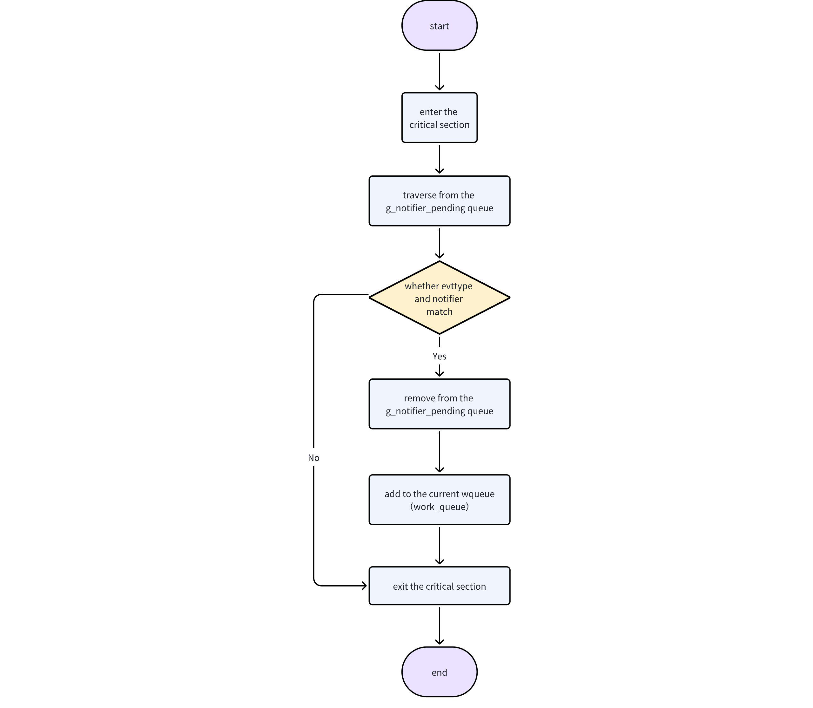

# Work Queue Development Guide

\[ English | [简体中文](../../../../zh-cn/device_dev_guide/kernel/IPC/work_queue.md) \]

## I. Overview

The openvela operating system provides a Work Queue mechanism to defer tasks (Work) for execution in a dedicated worker thread context. The core advantages of this mechanism are **deferred execution** and **serial execution** of tasks. The system places pending tasks into a first-in-first-out (FIFO) queue, where they are retrieved and executed in order by threads from the worker thread pool.

openvela offers three different types of work queues to meet various scenario requirements:

- High-Priority (HP) Kernel Work Queue
- Low-Priority (LP) Kernel Work Queue
- User-Mode Work Queue

## II. Work Queue Classification and Characteristics

### 1. High-Priority (HP) Work Queue

The high-priority work queue is designed for processing urgent and short-duration tasks, particularly suitable for handling the bottom half of interrupt service routines (ISRs) (referring to deferred cleanup or processing work stripped from the interrupt context, such as deferred memory deallocation).

To ensure tasks are processed nearly in real-time, the worker threads of this queue have a fixed high priority (default is **224**) to compete for resources with other high-priority tasks in the system.

When the high-priority work queue is disabled, its cleanup work is downgraded for processing in the following order:

1. Processed by the low-priority work queue if it is enabled.
2. Processed by the **IDLE** thread if the low-priority work queue is disabled. This method is not suitable for tasks with high real-time processing requirements.

#### Configuration Options

| Configuration Item           | Description                          | Default Value |
| ---------------------------- | ------------------------------------ | ------------- |
| CONFIG_SCHED_HPWORK          | Enable high-priority work queue      | y             |
| CONFIG_SCHED_HPNTHREADS      | Number of worker threads             | 1             |
| CONFIG_SCHED_HPWORKPRIORITY  | Priority of worker threads           | 224           |
| CONFIG_SCHED_HPWORKSTACKSIZE | Stack size per worker thread (bytes) | 2048          |

### 2. Low-Priority (LP) Work Queue

The low-priority work queue is primarily used for processing background tasks and non-urgent application-level jobs, such as file system cleanup, logging, and asynchronous I/O (AIO) operations. By scheduling these tasks at a lower priority, it avoids interfering with the execution of critical tasks, thereby enhancing the overall responsiveness and stability of the system.

#### Priority Inheritance

The low-priority kernel work queue supports the priority inheritance mechanism (requires enabling `CONFIG_PRIORITY_INHERITANCE`), allowing dynamic adjustment of worker thread priorities. This feature is not triggered automatically; developers need to actively call the following interfaces:

- `lpwork_boostpriority()`: Elevates the priority of a worker thread before scheduling a task.
- `lpwork_restorepriority()`: Restores the original priority of a worker thread after the task handler function (`work handler`) completes execution.

Currently, only the openvela asynchronous I/O (AIO) module uses this dynamic priority feature.

#### Configuration Options

| Configuration Item           | Description                                              | Default Value |
| ---------------------------- | -------------------------------------------------------- | ------------- |
| CONFIG_SCHED_LPWORK          | Enable low-priority work queue                           | y             |
| CONFIG_SCHED_LPNTHREADS      | Number of worker threads                                 | 1             |
| CONFIG_SCHED_LPWORKPRIORITY  | Minimum priority of worker threads                       | 100           |
| CONFIG_SCHED_LPWORKPRIOMAX   | Maximum priority to which worker threads can be elevated | 176           |
| CONFIG_SCHED_LPWORKSTACKSIZE | Stack size per worker thread (bytes)                     | 2048          |

### 4. Comparison of Kernel Work Queues

| Feature              | High-Priority (HP) Work Queue                                                                                                                                             | Low-Priority (LP) Work Queue                                                                                                                                                                              |
| -------------------- | ------------------------------------------------------------------------------------------------------------------------------------------------------------------------- | --------------------------------------------------------------------------------------------------------------------------------------------------------------------------------------------------------- |
| Application Scenario | **High-real-time tasks**: Interrupt bottom half processing, urgent data handling, tasks on critical paths.                                                                | **Background or non-urgent tasks**: Logging, file system cleanup, memory garbage collection, asynchronous I/O.                                                                                            |
| Advantages           | **Low latency**: Tasks are processed promptly to ensure system response speed.<br>**High real-time performance**: Ensures tasks complete within expected time.            | **Resource-friendly**: Executes when system load is low to avoid competing with critical tasks.<br>**Enhances system stability**: Isolates non-critical tasks to safeguard high-priority service quality. |
| Disadvantages        | **Resource competition**: May preempt the CPU, causing low-priority tasks to starve.<br>**Overload risk**: A large number of high-priority tasks may overload the system. | **High latency**: Task execution timing is uncertain and may be deferred for a long time.<br>**Not suitable for real-time scenarios**: Cannot guarantee immediate task response.                          |

### 4. User-Mode Work Queue

In `protected` or `kernel` build modes, user applications cannot directly access kernel-space work queues. To meet the asynchronous execution needs of user-space programs, openvela provides a user-mode work queue.

#### Differences from Kernel Work Queues

- API consistency: Provides the same programming interface as kernel work queues.
- Functional equivalence: Its functions and behavior are equivalent to the high-priority (HP) work queue.
- Independent implementation: It is implemented in user space, does not depend on kernel internal resources, and has no thread pool (adopts a single worker thread model).

#### Configuration Options

| Configuration Item          | Description                          | Default Value |
| --------------------------- | ------------------------------------ | ------------- |
| CONFIG_LIB_USRWORK          | Enable user-mode work queue          | y             |
| CONFIG_LIB_USRWORKPRIORITY  | Priority of worker threads           | 100           |
| CONFIG_LIB_USRWORKSTACKSIZE | Stack size per worker thread (bytes) | 2048          |

## III. Principles

### 1. Composition of Work Queue

The work queue in the openvela operating system consists of the following three core components:

1. **Task queue**: Used to store tasks that need deferred execution. Users add tasks to this queue through the `work_queue()` interface.
2. **Worker threads**: Responsible for executing tasks in the task queue. The kernel work queue supports multiple worker threads running in parallel.
3. **Delay parameter `delay`**: Defines the polling interval for tasks, used to determine if a task has reached the execution time.

The following diagram illustrates the basic working principle of the work queue:


### 2. Work Queue Startup Process

During system startup, openvela automatically creates and starts all configured work queues. The process begins with `nx_start()`, and the call chain is as follows:

```Plain
nx_start()
  └── nx_bringup()
        └── nx_workqueues()
              ├── work_start_highpri()       // Start high-priority kernel work queue
              ├── work_start_lowpri()        // Start low-priority kernel work queue
              └── USERSPACE->work_usrstart() // Start user-mode work queue
```

As shown above, the `nx_workqueues()` function is the unified entry point for initializing all types of work queues.

### 3. Kernel Work Queue Implementation

The working principles of high-priority and low-priority kernel work queues are very similar. The following details the creation and operation mechanism of the high-priority work queue.

#### Initialization

The `work_start_highpri()` function is responsible for initializing the high-priority work queue and creating the corresponding worker threads.

Main functions include:

- Initializing the work queue data structure.
- Creating multiple high-priority worker threads (`work_thread`).

```C
#if defined(CONFIG_SCHED_HPWORK)

/* Start high-priority kernel worker threads */
int work_start_highpri(void)
{
  sinfo("Starting high-priority kernel worker thread(s)\n");

  return work_thread_create(HPWORKNAME, CONFIG_SCHED_HPWORKPRIORITY,
                            CONFIG_SCHED_HPWORKSTACKSIZE,
                            CONFIG_SCHED_HPNTHREADS,
                            (FAR struct kwork_wqueue_s *)&g_hpwork);
}
#endif /* CONFIG_SCHED_HPWORK */
```

#### Creating Worker Threads

The `work_thread_create()` function creates one or more worker threads based on configuration parameters and binds them to the work queue.

```C
/*create nthreads worker*/
static int work_thread_create(FAR const char *name, int priority,
                              int stack_size, int nthread,
                              FAR struct kwork_wqueue_s *wqueue)
{
  FAR char *argv[2];
  char args[32];
  int wndx;
  int pid;

  snprintf(args, sizeof(args), "0x%" PRIxPTR, (uintptr_t)wqueue);
  argv[0] = args;
  argv[1] = NULL;

  /* Do not allow threads to run until the queue is fully initialized */
  sched_lock();

  for (wndx = 0; wndx < nthread; wndx++)
    {
      pid = kthread_create(name, priority, stack_size,
                           work_thread, argv);

      DEBUGASSERT(pid > 0);
      if (pid < 0)
        {
          serr("ERROR: work_thread_create %d failed: %d\n", wndx, pid);
          sched_unlock();
          return pid;
        }

      wqueue->worker[wndx].pid  = pid;
    }

  sched_unlock();
  return OK;
}
```

#### Worker Thread Logic

The core task of the worker thread `work_thread` is to retrieve tasks from the queue and execute their bound callback functions. The thread runs continuously until the system shuts down.

```C
/****************************************************************************
 * Name: work_thread
 *
 * Description:
 *   These are the worker threads that perform the actions placed on the
 *   high priority work queue.
 *
 *   These, along with the lower priority worker thread(s) are the kernel
 *   mode work queues (also built in the flat build).
 *
 *   All kernel mode worker threads are started by the OS during normal
 *   bring up.  This entry point is referenced by OS internally and should
 *   not be accessed by application logic.
 *
 * Input Parameters:
 *   argc, argv
 *
 * Returned Value:
 *   Does not return
 *
 ****************************************************************************/

static int work_thread(int argc, FAR char *argv[])
{
  FAR struct kwork_wqueue_s *wqueue;
  FAR struct work_s *work;
  worker_t worker;
  irqstate_t flags;
  FAR void *arg;

  /* Get the pointer to the work queue */
  wqueue = (FAR struct kwork_wqueue_s *)
           ((uintptr_t)strtoul(argv[1], NULL, 0));

  flags = enter_critical_section();

  /* Process the task queue in a loop */
  for (; ; )
    {
      /* Wait on the task semaphore until a task enters the queue */
      nxsem_wait_uninterruptible(&wqueue->sem);

      /* Traverse the tasks in the queue and execute them */
      while ((work = (FAR struct work_s *)dq_remfirst(&wqueue->q)) != NULL)
        {
          if (work->worker == NULL)
            {
              continue;
            }

          /* Get the callback function and arguments */
          worker = work->worker;
          arg = work->arg;

          /* Mark the task as completed */
          work->worker = NULL;

          /* Execute the task callback function */
          leave_critical_section(flags);
          CALL_WORKER(worker, arg);
          flags = enter_critical_section();
        }
    }

  leave_critical_section(flags);

  return OK; /* To keep some compilers happy */
}
```

#### Task Enqueueing

Tasks can be added to a specified work queue through the `work_queue()` function. The function decides how to process the task based on the task's delay time (`delay`):

1. If `delay == 0`, the task is directly inserted into the work queue.
2. If `delay > 0`, a timer (`wdog`) is started, and the task is inserted into the queue after the timer times out.

```C
/****************************************************************************
 * Name: work_queue
 *
 * Description:
 *   Queue kernel-mode work to be performed at a later time.  All queued
 *   work will be performed on the worker thread of execution (not the
 *   caller's).
 *
 *   The work structure is allocated and must be initialized to all zero by
 *   the caller.  Otherwise, the work structure is completely managed by the
 *   work queue logic.  The caller should never modify the contents of the
 *   work queue structure directly.  If work_queue() is called before the
 *   previous work has been performed and removed from the queue, then any
 *   pending work will be canceled and lost.
 *
 * Input Parameters:
 *   qid    - The work queue ID (index)
 *   work   - The work structure to queue
 *   worker - The worker callback to be invoked.  The callback will be
 *            invoked on the worker thread of execution.
 *   arg    - The argument that will be passed to the worker callback when
 *            it is invoked.
 *   delay  - Delay (in clock ticks) from the time queue until the worker
 *            is invoked. Zero means to perform the work immediately.
 *
 * Returned Value:
 *   Zero on success, a negated errno on failure
 *
 ****************************************************************************/

int work_queue(int qid, FAR struct work_s *work, worker_t worker,
               FAR void *arg, clock_t delay)
{
  if (qid == USRWORK)
    {
      /* Is there already pending work? */

      work_cancel(qid, work);

      return work_qqueue(&g_usrwork, work, worker, arg, delay);
    }
  else
    {
      return -EINVAL;
    }
}
```

### 4. User-Mode Work Queue Implementation

The user-mode work queue (User Work Queue) maintains API design consistency with the kernel queue, but its internal implementation mechanism differs significantly to adapt to user-space resources and constraints. It does not rely on the kernel's watchdog timer but implements a self-contained deferred processing logic.

#### Thread Creation

The `work_usrstart()` function is responsible for initializing the user queue and creating its unique worker thread. Depending on the system's build mode, it selects different thread creation methods:

- **Protected Mode/Kernel Mode Build** (`CONFIG_BUILD_PROTECTED`): Calls `task_create()` to create a user-space task.
- **Flat Mode Build** (`Flat Build`): Calls the standard `pthread_create()` to create a POSIX thread and sets it to detached state (`detach`).

```C
/****************************************************************************
 * Name: work_usrstart
 *
 * Description:
 *   Start the user mode work queue.
 *
 * Input Parameters:
 *   None
 *
 * Returned Value:
 *   The task ID of the worker thread is returned on success.  A negated
 *   errno value is returned on failure.
 *
 ****************************************************************************/

int work_usrstart(void)
{
  int ret;
#ifndef CONFIG_BUILD_PROTECTED
  pthread_t usrwork;
  pthread_attr_t attr;
  struct sched_param param;
#endif

  /* Initialize the work queue */

  dq_init(&g_usrwork.q);

#ifdef CONFIG_BUILD_PROTECTED

  /* In protected mode, create a user-space task */
  ret = task_create("uwork",
                    CONFIG_LIBC_USRWORKPRIORITY,
                    CONFIG_LIBC_USRWORKSTACKSIZE,
                    work_usrthread, NULL);
  if (ret < 0)
    {
      int errcode = get_errno();
      DEBUGASSERT(errcode > 0);
      return -errcode;
    }

  return ret;
#else
  /* Start a user-mode worker thread for use by applications. */

  pthread_attr_init(&attr);
  pthread_attr_setstacksize(&attr, CONFIG_LIBC_USRWORKSTACKSIZE);

  pthread_attr_getschedparam(&attr, &param);
  param.sched_priority = CONFIG_LIBC_USRWORKPRIORITY;
  pthread_attr_setschedparam(&attr, &param);

  ret = pthread_create(&usrwork, &attr, work_usrthread, NULL);
  if (ret != 0)
    {
      return -ret;
    }

  /* Detach because the return value and completion status will not be
   * requested.
   */

  pthread_detach(usrwork);

  return (pid_t)usrwork;
#endif
}
```

#### Task Processing Loop

The core of the user-mode work queue is the `work_process` function, which uses a mechanism based on an ordered queue and timed sleep instead of the kernel queue's event-driven model.

1. **Ordered Queue**: Unlike the FIFO (first-in-first-out) of the kernel queue, the user queue is an **ordered queue**. When a task is enqueued, it is inserted into the appropriate position in the queue based on its expected absolute execution time (`qtime`), ensuring the queue is always ordered by task expiration time.
2. **Processing and Sleep Loop**: The worker thread executes the following logic in a loop:

    1. **Check the queue head**: After locking the queue, check the expiration time of the head task.
    2. **Process expired tasks**: If the head task has expired (`elapsed >= 0`), dequeue it and execute its callback function. Since the queue is unlocked when the callback is executed, after completion, it is necessary to start checking from the head again to process new tasks that may have been inserted concurrently during task execution.
    3. **Calculate sleep time**: If the head task has not expired, it indicates no tasks need immediate execution in the current queue. At this time, calculate the time `next` remaining until the head task expires.
    4. **Timed or indefinite sleep**:

        - If the queue is empty (`next` is the maximum value), the thread calls `_SEM_WAIT()` to block indefinitely, waiting for new tasks.
        - If there are pending tasks in the queue, the thread calls `_SEM_TIMEDWAIT()` to sleep precisely for `next` duration. If a new task with an earlier expiration time is inserted into the head of the queue during sleep, the enqueue function will wake up the thread, allowing it to recalculate a shorter sleep time immediately.

This design cleverly implements deferred task scheduling in user space, with precision being a best-effort model affected by thread scheduling delays.

```C
/****************************************************************************
 * Name: work_process
 *
 * Description:
 *   This is the logic that performs actions placed on any work list.  This
 *   logic is the common underlying logic to all work queues.  This logic is
 *   part of the internal implementation of each work queue; it should not
 *   be called from application level logic.
 *
 * Input Parameters:
 *   wqueue - Describes the work queue to be processed
 *
 * Returned Value:
 *   None
 *
 ****************************************************************************/

static void work_process(FAR struct usr_wqueue_s *wqueue)
{
  volatile FAR struct work_s *work;
  worker_t worker;
  FAR void *arg;
  sclock_t elapsed;
  clock_t next;
  int ret;

  /* Then process queued work.  Lock the work queue while we process items
   * in the work list.
   */
  next = WORK_DELAY_MAX;
  ret = nxmutex_lock(&wqueue->lock);
  if (ret < 0)
    {
      /* Break out earlier if we were awakened by a signal */
      return;
    }

  /* And check each entry in the work queue.  Since we have locked the
   * work queue we know:  (1) we will not be suspended unless we do
   * so ourselves, and (2) there will be no changes to the work queue
   */
  work = (FAR struct work_s *)wqueue->q.head;
  while (work)
    {
      /* Is this work ready? It is ready if there is no delay or if
       * the delay has elapsed.  is the time that the work was added
       * to the work queue. Therefore a delay of equal or less than
       * zero will always execute immediately.
       */
      elapsed = clock() - work->u.s.qtime;

      /* Is this delay work ready? */
      if (elapsed >= 0)
        {
          /* Remove the ready-to-execute work from the list */
          dq_remfirst(&wqueue->q);

          /* Extract the work description from the entry (in case the work
           * instance by the re-used after it has been de-queued).
           */
          worker = work->worker;

          /* Check for a race condition where the work may be nullified
           * before it is removed from the queue.
           */
          if (worker != NULL)
            {
              /* Extract the work argument before unlocking the work queue */
              arg = work->arg;

              /* Mark the work as no longer being queued */
              work->worker = NULL;

              /* Do the work.  Unlock the work queue while the work is being
               * performed... we don't have any idea how long this will take!
               */
              nxmutex_unlock(&wqueue->lock);
              worker(arg);

              /* Now, unfortunately, since we unlocked the work queue we
               * don't know the state of the work list and we will have to
               * start back at the head of the list.
               */

              ret = nxmutex_lock(&wqueue->lock);
              if (ret < 0)
                {
                  /* Break out earlier if we were awakened by a signal */

                  return;
                }
            }

          work = (FAR struct work_s *)wqueue->q.head;
        }
      else
        {
          next = work->u.s.qtime - clock();
          break;
        }
    }

  /* Unlock the work queue before waiting. */
  nxmutex_unlock(&wqueue->lock);

  if (next == WORK_DELAY_MAX)
    {
      /* Wait indefinitely until work_queue has new items */

      _SEM_WAIT(&wqueue->wake);
    }
  else
    {
      struct timespec now;
      struct timespec delay;
      struct timespec rqtp;

      /* Wait awhile to check the work list.  We will wait here until
       * either the time elapses or until we are awakened by a semaphore.
       * Interrupts will be re-enabled while we wait.
       */
      clock_gettime(CLOCK_REALTIME, &now);
      clock_ticks2time(next, &delay);
      clock_timespec_add(&now, &delay, &rqtp);

      _SEM_TIMEDWAIT(&wqueue->wake, &rqtp);
    }
}
```

#### Task Enqueueing (`work_qqueue`)

To maintain queue order, the implementation of `work_qqueue()` is more complex than the kernel queue.

1. **Calculate absolute execution time**: First, calculate the task's absolute expiration time `work->u.s.qtime` based on the current system ticks (`clock()`) and the passed `delay`.
2. **Find insertion point**: Traverse the entire queue to find the first node whose execution time is later than the new task, determining the insertion position for the new task.
3. **Insert the task**: Insert the new task before the found position.
4. **Wake up the thread (key optimization)**: If the new task is inserted at the head of the queue, it means a task more urgent than all current pending tasks has arrived. At this point, it is necessary to call `_SEM_POST()` to wake up the sleeping worker thread. This allows the worker thread to interrupt its current (possibly long) wait and recalculate a shorter sleep time for this new task, ensuring system responsiveness.

```C
/****************************************************************************
 * Name: work_qqueue
 *
 * Description:
 *   Queue work to be performed at a later time.  All queued work will be
 *   performed on the worker thread of execution (not the caller's).
 *
 *   The work structure is allocated by caller, but completely managed by
 *   the work queue logic.  The caller should never modify the contents of
 *   the work queue structure; the caller should not call work_qqueue()
 *   again until either (1) the previous work has been performed and removed
 *   from the queue, or (2) work_cancel() has been called to cancel the work
 *   and remove it from the work queue.
 *
 * Input Parameters:
 *   wqueue - The work queue
 *   work   - The work structure to queue
 *   worker - The worker callback to be invoked.  The callback will be
 *            invoked on the worker thread of execution.
 *   arg    - The argument that will be passed to the worker callback when
 *            it is invoked.
 *   delay  - Delay (in clock ticks) from the time queue until the worker
 *            is invoked. Zero means to perform the work immediately.
 *
 * Returned Value:
 *   Zero on success, a negated errno on failure
 *
 ****************************************************************************/

static int work_qqueue(FAR struct usr_wqueue_s *wqueue,
                       FAR struct work_s *work, worker_t worker,
                       FAR void *arg, clock_t delay)
{
  FAR dq_entry_t *prev = NULL;
  FAR dq_entry_t *curr;
  sclock_t delta;
  int semcount;

  /* Get exclusive access to the work queue */
  while (nxmutex_lock(&wqueue->lock) < 0);

  /* Initialize the work structure */

  work->worker = worker;             /* Work callback. non-NULL means queued */
  work->arg    = arg;                /* Callback argument */
  work->u.s.qtime = clock() + delay; /* Delay until work performed */

  /* Do the easy case first -- when the work queue is empty. */
  if (wqueue->q.head == NULL)
    {
      /* Add the watchdog to the head == tail of the queue. */
      dq_addfirst(&work->u.s.dq, &wqueue->q);
      _SEM_POST(&wqueue->wake);
    }

  /* There are other active watchdogs in the timer queue */
  else
    {
      curr = wqueue->q.head;

      /* Check if the new work must be inserted before the curr. */
      do
        {
          delta = work->u.s.qtime - ((FAR struct work_s *)curr)->u.s.qtime;
          if (delta < 0)
            {
              break;
            }

          prev = curr;
          curr = curr->flink;
        }
      while (curr != NULL);

      /* Insert the new watchdog in the list */
      if (prev == NULL)
        {
          /* Insert the watchdog at the head of the list */
          dq_addfirst(&work->u.s.dq, &wqueue->q);
          _SEM_GETVALUE(&wqueue->wake, &semcount);
          if (semcount < 1)
            {
              _SEM_POST(&wqueue->wake);
            }
        }
      else
        {
          /* Insert the watchdog in mid- or end-of-queue */
          dq_addafter(prev, &work->u.s.dq, &wqueue->q);
        }
    }

  nxmutex_unlock(&wqueue->lock);
  return OK;
}
```

## IV. Data Structures

The core of the openvela work queue revolves around the `struct work_s` structure, which represents a task that needs to be executed asynchronously. The system organizes and schedules these tasks through different queue management structures.

### 1. Core Task Structure (`struct work_s`)

`struct work_s` is the **atomic unit** of the work queue mechanism, encapsulating all information about a task to be executed asynchronously. Whether for kernel or user queues, the basic scheduling object is this structure.

```C++
/* Represents an independent task unit */
struct work_s
{
  /* Union for reusing memory based on different scheduling methods */
  union
    {
      /* For user-mode work queue */
      struct
        {
          /* Doubly linked list node for chaining tasks into an ordered queue */
          struct dq_entry_s  dq;
          /* Absolute expiration time (system ticks) for task, used for sorting and determining execution */
          clock_t qtime;
        } s;
      /* For kernel deferred tasks: a watchdog timer instance */
      struct wdog_s timer;
      /* For kernel periodic tasks: a periodic watchdog timer instance */
      struct wdog_period_s ptimer;
    } u;
  /* Pointer to the callback function that actually executes the task */
  worker_t worker;
  /* Argument passed to the callback function */
  FAR void *arg;
};
```

Key points:

- Union `u`: To save memory, this structure uses a union to support different scheduling methods.

    - For the user-mode queue, the `u.s` member is used to link tasks into an ordered queue sorted by `qtime`.
    - For kernel deferred tasks, it is directly reused as a watchdog timer `u.timer`.

- Lifecycle management: The structure is allocated by the caller, but its internal members are managed by the work queue API (`work_queue()`). Users should not modify its contents directly after the task is enqueued.

### 2. Queue and Worker Thread Structures (Kernel)

These data structures define the form and state of kernel-mode work queues (HPWORK and LPWORK).

```C++
/* Overall description of the kernel work queue */
struct kwork_wqueue_s
{
  /* Head of the task queue, implemented using a doubly linked list */
  struct dq_queue_s q;

  /* Synchronization semaphore for blocking and waking up worker threads.
   * - When the queue is empty, worker threads wait on this semaphore.
   * - When a new task is enqueued, a worker thread is woken up by releasing this semaphore.
   */
  sem_t sem;

  /* Array of worker threads (actual size determined by configuration) */
  struct kworker_s worker[1];
};

/* Represents the state of a worker thread */
struct kworker_s
{
  /* PID of the worker thread */
  pid_t pid;

  /* Pointer to the task currently being processed by this thread */
  FAR struct work_s *work;

  /* Semaphore for controlling the waiting and waking up of a single thread (less frequently used) */
  sem_t wait;
};

// Global instances
#ifdef CONFIG_SCHED_HPWORK
/* Global instance of the kernel high-priority work queue */
extern struct hp_wqueue_s g_hpwork;
#endif
#ifdef CONFIG_SCHED_LPWORK
/* Global instance of the kernel low-priority work queue */
extern struct lp_wqueue_s g_lpwork;
#endif
```

### 3. User Interface and Usage

From a user perspective, the main interaction with the work queue involves the callback function type definition and the use of `struct work_s`.

#### Usage Instructions

When using the work queue, users typically only need to define an instance of `struct work_s` (usually as a static variable or included in another structure). Its internal members, such as `worker` and `arg`, are populated and managed through the `work_queue()` interface, and users should not operate on them directly.

#### Example

```C
// 1. Define a work structure instance
static struct work_s g_my_work;
// 2. Define the specific work function
static void my_work_function(FAR void *arg)
{
  // ... Perform specific tasks ...
}
// 3. Submit the task to the work queue
void schedule_my_work(void)
{
  // Submit g_my_work to the low-priority queue for immediate execution
  work_queue(LPWORK, &g_my_work, my_work_function, NULL, 0);
}
```

### 4. Notification Mechanism-Related Structures (Optional)

openvela builds a notification mechanism on top of the work queue, allowing code to **subscribe** to certain system events (such as process termination). The following are the related data structures.

```C++
/* work_notifier_s: Defines the content of a notification */
struct work_notifier_s
{
  uint8_t  evtype;      /* Event type */
  uint8_t  qid;         /* Queue ID where the task is scheduled */
  FAR void *qualifier;  /* Event qualifier, such as PID */
  FAR void *arg;        /* Argument passed to the callback */
  worker_t worker;      /* Callback executed when the event is triggered */
};
/* work_notifier_entry_s: Encapsulates notification information into a schedulable task */
struct work_notifier_entry_s
{
  struct dq_entry_s      entry; /* For linking to the notification linked list */
  struct work_s          work;  /* Work structure for actual scheduling */
  struct work_notifier_s info;  /* Contained notification information */
  int                    key;   /* Unique key for identifying and looking up notifications */
};
```

## V. API Interfaces

The openvela work queue APIs are distributed across different kernel files, with each file assuming specific functions. Below, we will detail the core interfaces according to module divisions.

### 1. Task Scheduling (`kwork_queue.c`)

This module provides the core APIs for submitting tasks (work) to the work queue, which are the most frequently used interfaces by developers. It supports scheduling of one-time tasks and periodic tasks.

```C
int work_queue_wq_period(FAR struct kwork_wqueue_s *wqueue,
                         FAR struct work_s *work, worker_t worker,
                         FAR void *arg, clock_t delay, clock_t period);
int work_queue_period(int qid, FAR struct work_s *work, worker_t worker,
                      FAR void *arg, clock_t delay, clock_t period);
                      
/*accord to qid,determine which queue the work should be add to
 *arg is the parameter of worker
 *delay is determine whether to join immediately
 */
int work_queue(int qid,FAR struct work_s *work, worker_t worker,FAR void    *arg,clock_t delay)

/*Queue a work item into a specific work queue*/
int work_queue_wq(FAR struct kwork_wqueue_s *wqueue,
                  FAR struct work_s *work, worker_t worker,
                  FAR void *arg, clock_t delay)；                      
                                              
```

| Function                      | Description                                                                                                                                                                                                                                                                                             |
| ----------------------------- | ------------------------------------------------------------------------------------------------------------------------------------------------------------------------------------------------------------------------------------------------------------------------------------------------------- |
| int work_queue(...)           | **General task enqueue interface**: <br> Submits a task to the specified global work queue based on qid (e.g., HPWORK or LPWORK). The delay parameter specifies how many system ticks to defer execution from the current time. If delay is 0, the task is scheduled for execution as soon as possible. |
| int work_queue_wq(...)        | **Specified queue task enqueue interface**: Functions the same as work_queue but directly accepts a work queue instance pointer wqueue instead of a queue ID. This is mainly used for operating private work queues dynamically created via work_queue_create.                                          |
| int work_queue_period(...)    | **Periodic task enqueue interface**: Submits a task to the global work queue specified by qid. The task executes after the first delay and then repeats at the period specified, until canceled.                                                                                                        |
| int work_queue_wq_period(...) | Functions the same as work_queue_period but directly accepts a work queue instance pointer wqueue for dynamically created queues.                                                                                                                                                                       |

### 2. Task Cancellation (`kwork_cancel.c`)

This module provides a mechanism to remove a task from the work queue before it is executed.

```C
/*cancel a specific work item in the work queue*/
static int work_qcancel(FAR struct kwork_wqueue_s *wqueue, int nthread, FAR struct work_s *work)；

/*cancel a work item in a specific queue*/
int work_cancel(int qid, FAR struct work_s *work);

/*cancel a work item and wait for the cancellation to complete*/
int work_cancel_sync(int qid, FAR struct work_s *work);
```

| Function                     | Description                                                                                                                                                                                                                                                                                                                                        |
| ---------------------------- | -------------------------------------------------------------------------------------------------------------------------------------------------------------------------------------------------------------------------------------------------------------------------------------------------------------------------------------------------- |
| int work_cancel(...)         | **Asynchronous task cancellation**: <br> Attempts to remove a pending task from the global work queue specified by qid. The function returns immediately without waiting for the cancellation to complete. If the task has started execution or is complete, it cannot be canceled.                                                                |
| int work_cancel_sync(...)    | **Synchronous task cancellation**: <br> Functions similarly to work_cancel but blocks until the task is successfully removed or (if the task is already running) until the task completes execution. This ensures that by the time the function returns, the work structure is no longer used by the work queue and can be safely freed or reused. |
| static int work_qcancel(...) | Internal implementation of work_cancel and work_cancel_sync, operating directly on the work queue instance without being exposed externally.                                                                                                                                                                                                       |

### 3. Event Notification Mechanism (`kwork_notifier.c`)

This module implements a publish-subscribe pattern event notification system. It allows various parts of the system to **subscribe** to specific events (such as process exit), and when an event is **published**, it automatically triggers the preset callback task and places it in the work queue for asynchronous execution.

#### Core Process

1. **Subscription (****`work_notifier_setup`****)**: Registers a notifier containing event type, callback function, etc., to the global pending list `g_notifier_pending`.
2. **Publication (****`work_notifier_signal`****)**: When an event occurs, the system calls this function, which traverses the `g_notifier_pending` list to find all matching notifiers.
3. **Scheduling**: The callback tasks associated with the found notifiers are submitted to the work queue for execution.
4. **Deregistration (****`work_notifier_teardown`****)**: Removes the notifier from the `g_notifier_pending` list, stopping event listening.



#### Interface Description

```C
/*generate a unique key for a work notifier*/
static uint32_t work_notifier_key(void)；
                 
/*According to the key, 
*go to the g_notifier_pending queue to find 
*if there is a corresponding notifier.
*/
static FAR struct work_notifier_entry_s *work_notifier_find(uint32_t key)；

/*whether the notifier is triggered,call its worker,
* this worker is the callback processed when you want 
* the work to be executed.
*/
static void work_notifier_worker(FAR void *arg)；

/*setup a work notifier*/
int work_notifier_setup(FAR struct work_notifier_s *info)；

/*teardown a work notifier,put it from pending queue to free queue*/
void work_notifier_teardown(int key)；

/*based on the evtype and qualifier, find the corresponding notifier
*from g_notifier_pending,remove notifier from g_pending queue
*add this notifier to the workqueue for asynchronous execution.
*/
void work_notifier_signal(enum work_evtype_e evtype, FAR void *qualifier)；
```

| Function                           | Description                                                                                                                                                                                                           |
| ---------------------------------- | --------------------------------------------------------------------------------------------------------------------------------------------------------------------------------------------------------------------- |
| `int work_notifier_setup(...)`     | Set up/subscribe to a notification: <br> Registers a notifier and returns a unique key for subsequent operations upon success.                                                                                        |
| `void work_notifier_teardown(...)` | Deregister a notification: <br> Moves the notifier specified by the key from the pending queue to the idle queue.                                                                                                     |
| `void work_notifier_signal(...)`   | Trigger/publish an event: <br> Based on the event type evtype and qualifier (such as PID), notifies all matching subscribers and schedules their associated work to the work queue for execution.                     |
| `static ... work_notifier_*`       | Internal helper functions like `work_notifier_key`, `work_notifier_find`, and `work_notifier_worker`, used for generating unique keys, finding notifiers, and encapsulating actual execution callbacks, respectively. |

### 4. Priority Inheritance (`kwork_inherit.c`)

This module is specifically designed to solve the **priority inversion** problem, particularly in the low-priority work queue (LPWORK). When a high-priority task needs to wait for results processed by a low-priority worker thread, these interfaces can be used to temporarily elevate the worker thread's priority, ensuring the critical path is not blocked.

```C
/*Raise the priority of a specified low-priority worker thread*/
static void lpwork_boostworker(pid_t wpid, uint8_t reqprio);
/*Restores the original priority of the specified worker thread*/
static void lpwork_restoreworker(pid_t wpid, uint8_t reqprio);
/*Raise the priority of all low-priority work queue threads.*/
void lpwork_boostpriority(uint8_t reqprio);
/*Restore the original priorities of all low-priority work queue threads*/
void lpwork_restorepriority(uint8_t reqprio);
```

| Function                              | Description                                                                                              |
| ------------------------------------- | -------------------------------------------------------------------------------------------------------- |
| void lpwork_boostpriority(...)        | Elevates the priority of all low-priority worker threads to the specified level reqprio.                 |
| void lpwork_restorepriority(...)      | Restores the original priority of all low-priority worker threads that have had their priority elevated. |
| static void lpwork_boostworker(...)   | Internal function to elevate the priority of a specific worker thread.                                   |
| static void lpwork_restoreworker(...) | Internal function to restore the original priority of a specific worker thread.                          |

### 5. Thread and Queue Management (`kwork_thread.c`)

This file is the **implementation core** of the work queue, responsible for worker thread creation, main loop logic, dynamic queue lifecycle management, and task traversal, among other low-level functions.

```C
/*take out of the work from queue and execute it
*agrc：number of parameters
*argv:parameter list
*/
static int work_thread(int argc,FAR char *argv[])；

/*create a work processing thread*/
static int work_thread_create(FAR const char *name,int priority,int stack_size,int nthread,FAR struct kwork_queue_s *wqueue)；

FAR struct kwork_wqueue_s *work_queue_create(FAR const char *name,
                                             int priority,
                                             FAR void *stack_addr,
                                             int stack_size, int nthreads);
                                             
int work_queue_free(FAR struct kwork_wqueue_s *wqueue);                                             
int work_queue_priority_wq(FAR struct kwork_wqueue_s *wqueue);

/*apply a handler function to each work item in the queue*/
void work_foreach(int qid,work_foreach_t handler,FAR void *arg)；

int work_queue_period(int qid, FAR struct work_s *work, worker_t worker,
                      FAR void *arg, clock_t delay, clock_t period);
```

| Function                           | Description                                                                                                                                                                                                                                         |
| ---------------------------------- | --------------------------------------------------------------------------------------------------------------------------------------------------------------------------------------------------------------------------------------------------- |
| work_queue_create(...)             | **Dynamically create a new work queue**: <br> Allows users to customize the queue name, number of worker threads, priority, and stack size. Internally calls work_thread_create to create worker threads.                                           |
| int work_queue_free(...)           | **Free a dynamically created work queue**: <br> Stops and cleans up all associated worker threads, then frees the memory occupied by the queue itself.                                                                                              |
| void work_foreach(...)             | **Traverse tasks in the queue**: <br> Executes a handler callback function for each work item in the queue specified by qid, commonly used for debugging or status checks.                                                                          |
| static int work_thread(...)        | **Main function of the worker thread**: <br> Each worker thread runs this function, which waits for task signals in an infinite loop, then retrieves and executes tasks from the queue. This is the foundation for the work queue to consume tasks. |
| static int work_thread_create(...) | Internal interface called by work_queue_create, responsible for creating and starting a specific worker thread using the specified parameters.                                                                                                      |
| int work_queue_priority_wq(...)    | Gets the current scheduling priority of worker threads in the specified work queue wqueue.                                                                                                                                                          |

## VI. Summary

The openvela work queue is a powerful and flexible background task processing framework whose core goal is to offload time-consuming or non-urgent tasks from critical execution paths (such as interrupt handlers, high-priority tasks) to dedicated low-priority threads for asynchronous execution, thereby improving system responsiveness and stability.

**Its core philosophy can be summarized as:**

- **Task deferral and asynchronization**: Provides standard interfaces allowing developers to submit a function call (`work`) to the system and specify its execution at a future time (immediate, deferred, or periodic).
- **Producer-consumer model**: Applications or kernel subsystems act as producers, placing tasks into a shared queue via APIs; a group of pre-created worker threads act as consumers, continuously retrieving and executing tasks from the queue.

**From an architectural and implementation perspective, this mechanism has the following key features:**

1. **Diversified queue types**: The system provides multiple preset work queues to meet different scenario requirements:

    - **Kernel high-priority queue (HPWORK)**: Processes time-sensitive, fast-response kernel-level tasks.
    - **Kernel low-priority queue (LPWORK)**: A general-purpose background task processing queue for most routine tasks that do not require immediate execution.
    - In addition, it supports **user-mode work queues**, offering great flexibility.

2. **Feature-rich APIs**: Provides a complete set of APIs covering task scheduling (`work_queue`), cancellation (`work_cancel`), event subscription/publishing (`work_notifier_setup`/`signal`), and dynamic management (`work_queue_create`), capable of meeting complex application requirements.
3. **Simple and consistent design**: In the openvela OS, despite different queue types, the underlying implementation follows a unified and simple design philosophy. Each queue consists of a task queue and a group of worker threads, scheduled uniformly by the kernel. This consistency reduces system complexity and the learning curve for developers.
