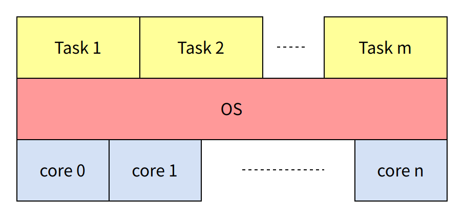
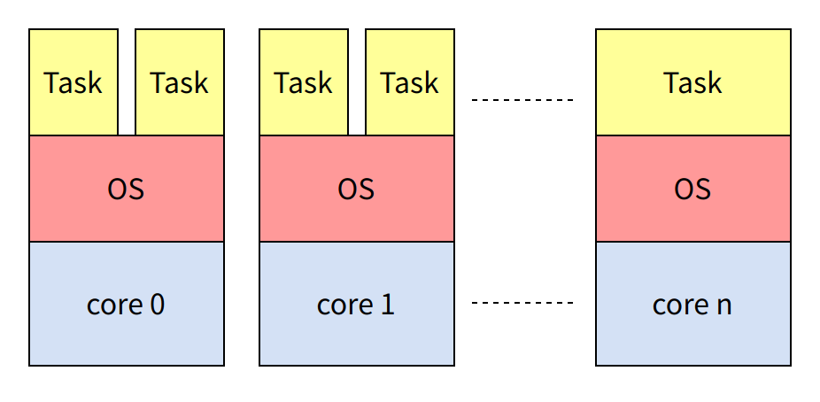

# Kernel Development Overview

\[ English | [简体中文](../../../zh-cn/device_dev_guide/kernel/KernelDev.md) \]

## I. Overview

The openvela kernel is built on the NuttX real-time operating system kernel. As a POSIX-compliant embedded real-time operating system, it offers the following core capabilities.

### 1. Real-time Task Processing Capabilities

- Supports concurrent execution of multiple threads and processes.
- Provides real-time synchronization mechanisms such as semaphores, message queues, and timers.
- Ensures low-latency task scheduling and response.

### 2. Storage and Communication Capabilities

- Compatible with various embedded file systems (such as **NxFFS**, **LittleFS**).
- Supports mainstream network protocol stacks (including **TCP/IP**, **UDP**).
- Provides stable data storage and network communication solutions.

### 3. Driver and Interface Compatibility

- Adopts **Linux/xBSD** standard driver interfaces.
- Supports porting of generic Linux user programs.
- Implements reuse and interoperation of modular components.

These features enable openvela to achieve efficient and reliable real-time operations on resource-constrained embedded platforms.

## II. Supported Processor Architectures

openvela is adaptable to various hardware platforms, making it widely applicable across scenarios ranging from low-power small devices to high-performance embedded computing systems. By supporting multiple mainstream embedded device hardware platforms, openvela enables developers to migrate and deploy across different architectures, thereby improving development efficiency and system compatibility.

### 1. CPU Architectures

openvela supports multiple processor architectures and covers various mainstream embedded device hardware platforms, including the following architectures:


### 2. Multiprocessor Support

openvela supports the following multiprocessor modes, aimed at providing flexible processor scheduling and optimized parallel processing capabilities to meet the requirements of different application scenarios.

#### SMP (Symmetric Multiprocessing)

In a Symmetric Multiprocessing (SMP) architecture, multiple CPUs of the same type share a single memory space. The operating system runs on these CPUs and distributes the workload among them.



#### AMP (Asymmetric Multiprocessing)

In an Asymmetric Multiprocessing (AMP) architecture, multiple CPUs, which can have different underlying architectures, each possess their own independent memory space. A separate operating system runs on each CPU, and these CPUs collaborate through an inter-core communication framework.



## III. Code Directory Structure

The openvela kernel code directory structure is as follows:

```Bash
.
|-- Documentation
|-- arch               # CPU architecture layer directories for all supported architectures
|   |-- arm            # ARM architecture
|   |-- arm64          # ARM64 architecture
|   |-- ...
|   `-- z80            # Z80 architecture
|-- audio              # Audio component code
|-- binfmt             # Binary format component code
|-- boards             # Board-level drivers and configurations for each CPU architecture
|   |-- arm            # ARM architecture board-level code
|   |-- arm64          # ARM64 architecture board-level code
|   |-- ...
|   `-- z80            # Z80 architecture board-level code
|-- cmake              # CMake scripts
|-- crypto             # Cryptography component code
|-- drivers            # Driver framework code
|-- dummy
|-- fs                 # File system code
|-- graphics           # Graphics framework code
|-- include            # openvela header files
|-- libs               # Library code
|-- mm                 # Memory management component code
|-- net                # Network component code
|-- openamp            # OpenAMP component code
|-- pass1
|-- sched              # Kernel critical component code (task, resource sync, IPC)
|   |-- addrenv        # Task address environment management
|   |-- clock          # Clock driver
|   |-- environ        # Environment variable code
|   |-- event          # Event code
|   |-- group          # Task group code
|   |-- init           # Kernel startup code
|   |-- instrument     # Instrumentation functionality
|   |-- irq            # Interrupt interface functions
|   |-- misc           # Miscellaneous items such as assert
|   |-- module         # ELF dynamic loading
|   |-- mqueue         # Message queue
|   |-- paging         # MMU paging
|   |-- pthread        # Kernel pthread code
|   |-- sched          # Kernel scheduling related code
|   |-- semaphore      # Semaphore code
|   |-- signal         # Signal code
|   |-- task           # Task related code
|   |-- timer          # Timer driver framework
|   |-- tls            # Thread Local Storage interface
|   |-- wdog           # Watchdog driver code
|   `-- wqueue         # Work queue code
|-- syscall            # System call framework code
|-- tools              # openvela tools
|-- video              # Video component code
`-- wireless           # Wireless component code

```

Developers can access the relevant code and resources of the openvela kernel through the following code repository:

- [openvela NuttX Repository](../../../../../../../open-vela/nuttx/)

## IV. System Features

### 1. Standards Compliance

- **POSIX Compatibility**: NuttX emphasizes POSIX standard compatibility, ensuring good portability and standardized interfaces.
- **ANSI Standards**: Supports ANSI C standards, providing standard programming interfaces for developers.

### 2. Scalability

- **From 8-bit to 64-bit**: NuttX can scale from 8-bit to 64-bit microcontroller environments, adapting to various embedded system requirements.
- **Modular Design**: The kernel adopts a modular design, making it easy to extend and customize.

### 3. Real-time Capabilities

- **Real-time Scheduling**: Supports real-time scheduling algorithms to meet the requirements of real-time systems.
- **Priority Scheduling**: Supports priority-based task scheduling, ensuring high-priority tasks execute first.

## V. Thread and Process Management

### 1. Thread Scheduling Overview

Thread scheduling is the core process by which the operating system manages multiple threads, determining the execution order and timing of threads. Scheduling strategies depend on the following key factors:

- **Priority**: Higher priority threads execute first.
- **Time Slice**: Allocates CPU execution time windows.
- **Resource Requirements**: Such as I/O waiting, synchronization locks, etc.

### 2. openvela Task Classification

openvela categorizes tasks/threads into three types, as shown in the diagram and detailed below.


#### Kernel Threads (Kthread)

Kernel threads run in **kernel space** and have the following characteristics:

- All Kthreads share the same memory space.
- Primarily used for managing hardware resources and executing system-level tasks.
- Do not directly interact with user applications.

##### Creating Kernel Threads

Use the `kthread_create()` function to create kernel threads:

```C
int kthread_create(FAR const char *name, int priority, int stack_size,
                   main_t entry, FAR char * const argv[]);
```

**Parameters**:

- `name`: Thread name.
- `priority`: Thread priority.
- `stack_size`: Stack size (bytes).
- `entry`: Entry function.
- `argv`: Array of parameters passed to the entry function.

#### User Threads (Pthread)

Pthreads follow the POSIX thread interface standard and have the following characteristics:

- Run in **user space**.
- Suitable for handling high-level tasks that do not involve direct hardware interaction.
- Provide standardized thread programming interfaces.

##### Creating User Threads

Use the `pthread_create()` function to create user threads:

```C
int pthread_create(FAR pthread_t *thread, FAR const pthread_attr_t *attr,
                   pthread_startroutine_t startroutine, pthread_addr_t arg);
```

**Parameters**:

- `thread`: Pointer to store the newly created thread ID.
- `attr`: Thread attributes.
- `startroutine`: Function executed by the thread.
- `arg`: Parameter passed to the thread function.

#### User Tasks (Task)

Tasks in openvela are similar to processes in Linux and have the following characteristics:

- Run in **user space**.
- Address spaces are isolated between different Tasks.
- One Task can create multiple Pthreads.

##### Task Group Concept

The main Task and all Pthreads it creates together form a task group, used to simulate POSIX processes. Task group members share the following resources:

- Environment variables
- File descriptors
- FILE streams
- Sockets
- pthread keys
- Open message queues

##### Creating User Tasks

Use the `posix_spawn()` function to create user tasks:

```C
int posix_spawn(FAR pid_t *pid, FAR const char *path,
      FAR const posix_spawn_file_actions_t *file_actions,
      FAR const posix_spawnattr_t *attr,
      FAR char * const argv[], FAR char * const envp[]);
```

**Parameters**:

- `pid`: Pointer to store the newly created task ID.
- `path`: Executable file path.
- `file_actions`: File operation actions.
- `attr`: Task attributes.
- `argv`: Command line parameter array.
- `envp`: Environment variable array.

### 3. Scheduling Algorithms

openvela uses threads as scheduling units and adopts the following scheduling strategies:

#### Priority Scheduling

For threads with different priorities, openvela strictly implements priority scheduling, with higher priority threads getting CPU resources first.

#### Same-Priority Thread Scheduling

For threads with the same priority, openvela supports two scheduling algorithms:

1. **First-In-First-Out (FIFO)**

    - Threads with the same priority execute in the order they were created.
    - The current thread must actively give up the CPU or block before switching to the next thread.
    - May cause longer response delays for later created threads.
    - **Default algorithm used by the system**.

2. **Round Robin**

    - Threads with the same priority take turns getting CPU time.
    - Each thread gets a fixed duration of execution time (time slice).
    - Automatically switches to the next same-priority thread when the time slice is exhausted.
    - Time slice length (milliseconds) is configured through `CONFIG_RR_INTERVAL`.
    - Only enabled when `CONFIG_RR_INTERVAL > 0`.

## VI. Resource Synchronization

openvela provides a variety of resource synchronization mechanisms to ensure data consistency and safe access in a multi-threaded environment. This chapter details the characteristics, use cases, and important considerations for each of these mechanisms.

### 1. Semaphores

A semaphore is a type of sleeping lock used to control access to shared resources.

#### How It Works

When a thread attempts to acquire an unavailable semaphore:

1. The semaphore adds the thread to a waiting queue.
2. The current thread is put to sleep.
3. The CPU schedules another thread for execution.
4. When the semaphore becomes available, the waiting thread is woken up.

#### Important Considerations

- Suitable Scenarios: Ideal for scenarios where a lock may be held for a long duration.
- Usage Restrictions: Can only be used in a thread context, not in an interrupt context.
- Lock Interactions: Do not hold a spinlock while holding a semaphore, as this can lead to a deadlock.
- Concurrency: Semaphores are designed to safely manage contention from multiple threads without causing deadlocks.
- Recommended API: Use the `nxsem_wait_uninterruptible()` function to wait for a semaphore.

#### References

- For a detailed explanation of semaphores, see [Semaphore Mechanism](./resource_sync/semaphore_mechanism.md).
- For the relevant implementation code, see [openvela Semaphore](../../../../../../../open-vela/nuttx/tree/dev-ai-contest-2026/sched/semaphore).

### 2. Mutexes

A mutex (mutual exclusion) is a sleeping lock that enforces mutual exclusion. In openvela, it is implemented as a semaphore with a count of 1.

#### Characteristics

- Supports recursive locking.
- At any given time, only one task can hold the mutex.

#### Important Considerations

- Ownership Principle: The thread that locks a mutex is responsible for unlocking it.
- Usage Restrictions: Cannot be used in an interrupt context.
- Best Practices: When implementing mutual exclusion, it is recommended to use a mutex instead of a semaphore.

#### References

- The implementation code can be found at [openvela Mutex](../../../../../../../open-vela/nuttx/tree/dev-ai-contest-2026/libs/libc/misc/lib_mutex.c).

### 3. Spinlocks

A spinlock is a non-blocking lock. When a thread attempts to acquire a spinlock that is already held, it continuously loops (spins), repeatedly checking the lock's state until it is released.

#### How It Works

- A thread attempting to acquire a held spinlock does not enter a sleeping state.
- The thread continuously loops, checking if the lock has been released.

#### Important Considerations

- Hold Time: Should not be held for long periods. Ideal for short-term, lightweight locking.
- Avoiding Context Switches: While holding a spinlock, do not call any API that could cause a context switch, as this can lead to a deadlock.
- Recursion: Recursive locking is not supported.
- Recommended APIs: Use `spin_lock_irqsave()` and `spin_unlock_irqrestore()` instead of `spin_lock()` and `spin_unlock()` directly.

#### References

The implementation code can be found at [openvela Spinlock](../../../../../../../open-vela/nuttx/tree/dev-ai-contest-2026/include/nuttx/spinlock.h).

### 4. Atomic Operations

Atomic operations guarantee that instructions execute indivisibly, meaning their execution process cannot be interrupted.

#### Advantages

- Minimal system overhead.
- No explicit locking mechanisms are required.

#### Considerations

- Architectural Support: Before use, ensure the target CPU architecture supports atomic instructions.
- Avoiding the ABA Problem: In multi-threaded contexts, using Compare-and-Swap (CAS) atomic operations is recommended to prevent the ABA problem.

#### References

- For a detailed description of atomic operations, see the [Atomic Operations API](./resource_sync/atomic_operation.md).
- For related interface code, see [openvela atomic](../../../../../../../open-vela/nuttx/tree/dev-ai-contest-2026/include/nuttx/atomic.h).

### 5. IRQ Control

Synchronization is achieved by controlling interrupts, which prevents a task from being interrupted while executing a critical section.

#### Implementation

openvela implements interrupt masking for the local CPU via `up_irq_xxx()` functions. These functions are typically called within wrappers like `spin_lock_irqsave()` and `spin_unlock_irqrestore()`.

#### Considerations

- Scope Limitation: Disables interrupts only on the local CPU; it cannot disable interrupts for all CPUs in a multi-core system.
- Scheduling Impact: Task switching remains permissible while interrupts are disabled.

#### References

- For details on interrupt system adaptation, refer to the [Interrupt System Adaptation Guide](./../../chip_porting/Interrupt_System_Adaptation_Guide.md).
- For the interface code, see the [openvela irq interface](../../../../../../../open-vela/nuttx/tree/dev-ai-contest-2026/include/nuttx/irq.h).

### 6. Scheduler Control

openvela implements scheduler control using `sched_lock()` and `sched_unlock()` to pause the kernel's scheduling process.

#### How It Works

- After the scheduler is locked, API calls that would normally cause a context switch do not take immediate effect.
- A context switch will only occur when the current task explicitly calls `sched_unlock()` or voluntarily yields the CPU.

#### Usage Example

As shown in the code example below, scheduler locking can be used when creating a child thread and waiting for its completion to prevent the child thread from preempting the parent:

```C
int nsh_builtin(FAR struct nsh_vtbl_s *vtbl, FAR const char *cmd,
                FAR char **argv,
                FAR const struct nsh_param_s *param)
{
  /* Lock the scheduler in an attempt to prevent the application from
   * running until waitpid() has been called.
   */

  sched_lock();

  /* Try to find and execute the command within the list of builtin
   * applications.
   */

  ret = exec_builtin(cmd, argv, param);
  if (ret >= 0)
    {
#ifdef CONFIG_SCHED_WAITPID

      /* CONFIG_SCHED_WAITPID is selected, so we may run the command in
       * foreground unless we were specifically requested to run the command
       * in background (and running commands in background is enabled).
       */

#  ifndef CONFIG_NSH_DISABLEBG
      if (vtbl->np.np_bg == false)
#  endif /* CONFIG_NSH_DISABLEBG */
        {
          /* Wait for the application to exit.  We did lock the scheduler
           * above, but that does not guarantee that the application did not
           * already run to completion in the case where I/O was redirected.
           * Here the scheduler will be unlocked while waitpid is waiting
           * and if the application has not yet run, it will now be able to
           * do so.
           *
           * Also, if CONFIG_SCHED_HAVE_PARENT is defined waitpid() might
           * fail even if task is still active:  If the I/O was re-directed
           * by a proxy task, then the task is a child of the proxy, and not
           * this task. waitpid() fails with ECHILD in either case.
           *
           * NOTE: WUNTRACED does nothing in the default case, but in the
           * case the where CONFIG_SIG_SIGSTOP_ACTION=y, the built-in app
           * may also be stopped.  In that case WUNTRACED will force
           * waitpid() to return with ECHILD.
           */

          ret = waitpid(ret, &rc, WUNTRACED);
        }
#endif /* !CONFIG_SCHED_WAITPID || !CONFIG_NSH_DISABLEBG */
    }

  sched_unlock();

  return ret;
}
```

#### Considerations

- Interrupt Impact: Interrupts remain unaffected while the scheduler is locked. To disable interrupts during this period, interrupt control functions must be called explicitly.
- Nested Usage: Nested calls to lock and unlock the scheduler are supported.

#### References

For the implementation code, see [openvela sched_lock.c](../../../../../../../open-vela/nuttx/tree/dev-ai-contest-2026/sched/sched/sched_lock.c) and [openvela sched_unlock.c](../../../../../../../open-vela/nuttx/tree/dev-ai-contest-2026/sched/sched/sched_unlock.c).

### 7. Pthread Mutexes

A mutex mechanism provided by the POSIX threads (Pthread) standard, intended exclusively for use with Pthreads.

#### Related APIs

- **Mutexes**: `pthread_mutex_lock()`, `pthread_mutex_unlock()` ([man page](https://linux.die.net/man/3/pthread_mutex_lock))
- **Read-Write Locks**: `pthread_rwlock_rdlock()`, `pthread_rwlock_wrlock()` ([man page](https://linux.die.net/man/3/pthread_rwlock_rdlock))
- **Spinlocks**: `pthread_spin_lock()`, `pthread_spin_trylock()` ([man page](https://linux.die.net/man/3/pthread_spin_trylock))
- **Barriers**: `pthread_barrier_init()`, `pthread_barrier_wait()` ([man page](https://linux.die.net/man/3/pthread_barrier_init))
- **One-Time Initialization**: `pthread_once()` ([man page](https://linux.die.net/man/3/pthread_once))

#### References

For the implementation code, see [openvela pthread](../../../../../../../open-vela/nuttx/tree/dev-ai-contest-2026/libs/libc/pthread).

### 8. Choosing a Synchronization Mechanism

#### Overhead Comparison (Lowest to Highest)

| **Overhead Rank** | **Mechanism**     | **Scope**             | **Use in Interrupt Context** | **Calling Scheduling APIs** |
| :---------------- | :---------------- | :-------------------- | :--------------------------- | :-------------------------- |
| 0                 | Atomic Operation  | Kernel and user space | Supported                    | Supported                   |
| 1                 | Spinlock          | Kernel and user space | Supported                    | Not supported               |
| 2                 | Scheduler Control | Kernel and user space | Ineffective                  | Supported                   |
| 3                 | Mutex             | Kernel and user space | Not supported                | Supported                   |
| 4                 | Pthread Mutex     | User space only       | Not supported                | Supported                   |

#### Recommended Usage Scenarios

| **Requirement**                       | **Recommended Mechanism** |
| :------------------------------------ | :------------------------ |
| Simple integer operations             | Use atomic operations     |
| Low-overhead locking                  | Prefer spinlocks          |
| Short-term locking                    | Prefer spinlocks          |
| Locking within an interrupt context   | Use spinlocks             |
| Long-term locking                     | Prefer mutexes            |
| Needing to sleep while holding a lock | Use mutexes               |

## VII. Thread Communication

The openvela operating system provides multiple inter-thread and inter-process communication (IPC) mechanisms, enabling developers to implement efficient task collaboration. This chapter details the primary communication mechanisms and the principles for selecting them.

### 1. Work Queues

A work queue is a task scheduling mechanism that allows work to be offloaded to a dedicated worker thread, enabling **deferred processing** and **serialized execution** of tasks.

#### How It Works

The work queue system consists of the following components:

- **Work Queue:** Stores the work items pending execution.
- **Worker Thread:** Fetches and executes work items from the queue.
- **Scheduler:** Manages the scheduling and execution of work items.

#### Work Queue Types

openvela supports three types of work queues, each with distinct characteristics:

| Type                           | Priority     | Primary Use Case                                               |
| :----------------------------- | :----------- | :------------------------------------------------------------- |
| **High-Priority Kernel Queue** | High         | Interrupt bottom-half processing, time-sensitive tasks.        |
| **Low-Priority Kernel Queue**  | Low          | Background tasks, such as logging or periodic data processing. |
| **User-Mode Queue**            | Configurable | Used by user-space applications.                               |

#### Usage Scenarios

Work queues are particularly well-suited for the following scenarios:

- Tasks that need to be deferred from an interrupt service routine.
- Operations that must run in a thread context but do not require a dedicated thread.
- Periodic background tasks.

#### References

- For a detailed description of work queues, refer to the [Work Queues](./IPC/work_queue.md).
- For the implementation code, see the [openvela wqueue](../../../../../../../open-vela/nuttx/tree/dev-ai-contest-2026/sched/wqueue).

### 2. Message Queues

A message queue is a structured communication mechanism that allows tasks to exchange messages, which can have associated types and priorities.

#### How It Works

The message queue system provides the following features:

- **Message Sending:** A task can package data into a message and send it to a queue.
- **Message Receiving:** A task can retrieve a message from a queue for processing.
- **Priority-Based Sorting:** Supports ordering of messages based on their priority.
- **Blocking Operations:** Supports blocking waits for both sending and receiving operations.

#### Usage Scenarios

Message queues are particularly well-suited for the following scenarios:

- Inter-task communication that requires structured data exchange.
- Applications that require message prioritization.
- Systems that need to implement a producer-consumer model.

#### References

- For a detailed description of message queues, refer to the [Message Queues](./IPC/message_queue.md).
- For the implementation code, see the [openvela mqueue](../../../../../../../open-vela/nuttx/tree/dev-ai-contest-2026/sched/mqueue) source.

### 3. Choosing a Communication Scheme

#### Thread Creation Principle

Avoid creating threads indiscriminately. In a single-core system, multi-threading does not improve performance; on the contrary, it increases stack space overhead and context-switching costs.

#### Communication Scheme Comparison

When multi-threading is necessary, the following common schemes can be considered:

| **Scheme**                 | **Overhead**                                                                           | **Advantages**                                                                                 | **Disadvantages**                                                         |
| :------------------------- | :------------------------------------------------------------------------------------- | :--------------------------------------------------------------------------------------------- | :------------------------------------------------------------------------ |
| **Work Queue**             | Framework: ~1 KB <br> Thread Stack: ~2 KB * n (configurable)                           | Centralizes interrupt bottom-half processing, saving resources; ideal for deferred operations. | Supports only FIFO; no priority strategy.                                 |
| **Thread + Semaphore**     | Thread Stack: ~2 KB                                                                    | Provides fully independent, priority-configurable threads; simple and intuitive.               | Suitable only for simple synchronization; does not support data transfer. |
| **Thread + Message Queue** | MQ Framework: ~1.5 KB <br> Thread Stack: ~2 KB <br> Pre-allocated Message Space: ~1 KB | Provides independent threads; both thread and message priorities are configurable.             | Has complex parameters; its usage scenario must be carefully evaluated.   |

## VIII. Examples

[OS Base Component Development Examples](./async_samples.md)
