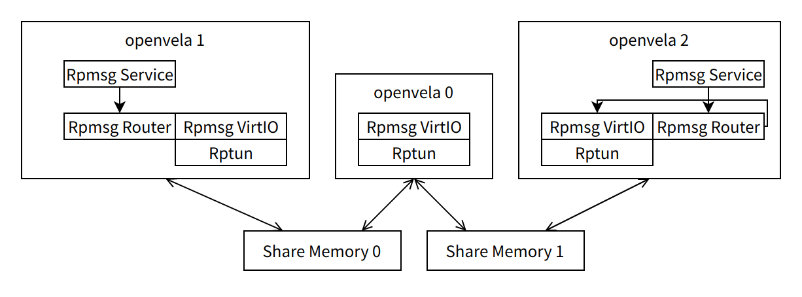
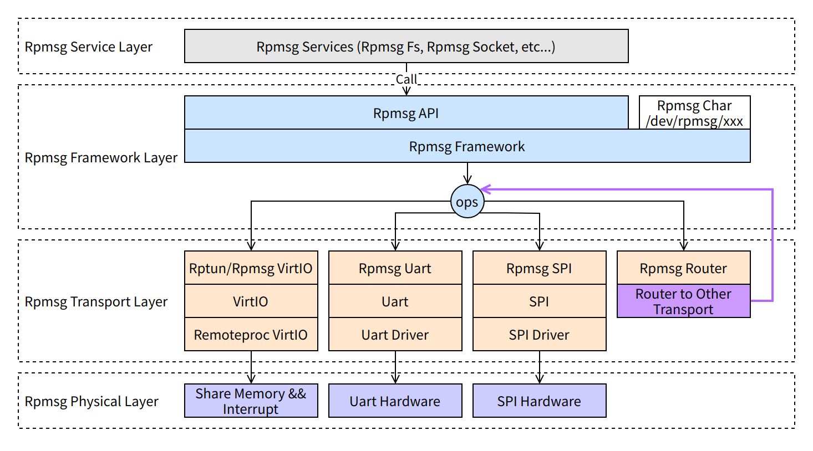
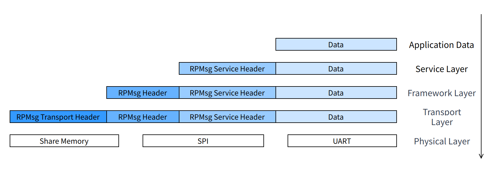
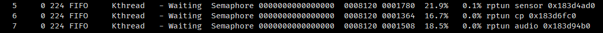

# RPMsg Core Concepts and Working Principles

\[ English | [简体中文](../../../../../zh-cn/device_dev_guide/kernel/inter_processor_communication/RPMsg/RPMsg.md) \]

## I. Overview

**Remote Processor Messaging (RPMsg)** is a lightweight messaging framework designed for inter-core communication in heterogeneous multicore systems. It defines a standardized binary interface, enabling processor cores running different operating systems (e.g., Linux) or real-time operating systems (RTOS) to efficiently and reliably exchange data.

RPMsg is primarily used in **Asymmetric Multiprocessing (AMP)** architectures and serves as a key component in building complex embedded systems. This document introduces RPMsg's core concepts, layered architecture, workflow, and practical applications.

## II. Typical Application Scenarios

The RPMsg framework supports various hardware topologies and communication media. The following are two typical application scenarios.

### 1. Heterogeneous AMP Systems (Big.LITTLE)

In a system containing high-performance cores ("big" cores) and low-power cores ("little" cores), RPMsg enables them to work collaboratively.

- **Scenario Description**: An application processor (big core) running **Linux** needs to communicate with a microcontroller (little core **A**) running an RTOS (e.g., openvela). Simultaneously, this microcontroller (little core **A**) must also communicate with another microcontroller (little core **B**).
- **Implementation**:
    - **Between the big core and little core A**: RPMsg over SPI is used for cross-chip communication.
    - **Between little core A and little core B**: RPMsg over VirtIO, based on shared memory, is used for on-chip communication.

As illustrated in the diagram below:


### 2. Homogeneous AMP Systems (All "Little" Cores)

In a system composed of multiple, identical low-power cores, RPMsg can also serve as an efficient communication bus.

- **Scenario Description**: Three peer cores, all running an RTOS (e.g., **openvela**), need to communicate with each other to complete complex collaborative tasks.
- **Implementation**: All inter-core communication is handled by RPMsg over VirtIO, leveraging shared memory for high-speed, low-latency data exchange.



## III. Core Architecture

RPMsg employs a layered architecture, similar to a network protocol stack, to modularize communication functions. This allows upper-layer applications to remain agnostic to the underlying physical implementation.

### 1. Layered Architecture



RPMsg uses a modular, layered architecture inspired by network protocol stacks. This design decouples application logic from the underlying physical transport, enhancing code portability and maintainability. The architecture consists of four core layers from top to bottom:

1. **Services Layer**

    This layer sits on top of the RPMsg framework, providing standardized, easy-to-use communication services for applications. It abstracts low-level message sending and receiving into higher-level application interfaces. For more details, refer to [RPMsg Services]().

    - **Key Services Include**:

        - **RPMsg Socket**: Provides a BSD Socket-like API, enabling network applications or those requiring stream-based communication to perform inter-core communication effortlessly.
        - **RPMsg FS**: Offers a file operation interface through a Virtual File System (VFS), allowing one core to access resources on another core as if they were local files.

2. **Framework Layer**

    As the core of RPMsg, this layer manages communication endpoints, channels, and message routing. It integrates the standard OpenAMP implementation and exposes core APIs to the upper layers. For more details, refer to [RPMsg Framework]().

    - **Primary Responsibilities:**

        - Lifecycle management of endpoints and channels.
        - Service discovery and matching based on names or addresses.
        - Registering a character device with the VFS, allowing user-space applications to perform inter-core communication using standard file operations (e.g., `open`, `read`, `write`).

3. **Transport Layer**

    This layer defines and implements the specific methods for message transport between processors. Developers can select or customize different transport layers based on system-specific physical connections and performance requirements. For more details, refer to [RPMsg Transport Layer]().

    - **Primary Implementations:**

        - **Rptun / RPMsg VirtIO**: An on-chip communication solution based on shared memory and interrupts, compliant with the VirtIO standard for high performance. It includes two versions:

            - **Rptun**: As an enhanced version of VirtIO, it supports more complex system features and is the recommended transport layer in the openvela system.
            - **RPMsg VirtIO**: A lightweight implementation suitable for resource-constrained devices or simpler communication scenarios.

        - **RPMsg UART**: Uses a Universal Asynchronous Receiver/Transmitter (UART) as the physical medium, suitable for low-speed, board-level, cross-chip communication.
        - **RPMsg SPI**: Uses the Serial Peripheral Interface (SPI) as the physical medium, offering higher bandwidth than UART, and also supports board-level, cross-chip communication.
        - **RPMsg Router**: A logical transport layer that does not perform physical data transfer itself. Its core function is to act as a message router, forwarding messages to other physical transport layers based on the destination address, thus enabling seamless routing across different communication domains.

4. **Physical Layer**

    This layer interacts directly with the hardware, executing the specific operations dictated by the transport layer. Its implementation is tightly coupled with the target hardware platform.

    - **Primary Responsibilities:**
        - Configuring Shared Memory regions.
        - Initializing and controlling Direct Memory Access (DMA) controllers.
        - Operating the registers of hardware controllers like SPI and UART.
        - Managing and responding to low-level hardware interrupts.

### 2. Message Encapsulation



As an RPMsg message travels from the Services Layer down to the Physical Layer, each layer prepends its own header. This process, similar to network packet encapsulation, ensures that each layer has the necessary context (e.g., source/destination address, length) to process the message, ultimately forming a complete data frame for transmission over the physical medium.

## IV. Workflow and Core Mechanisms

RPMsg's message transport functionality is realized through a well-defined workflow, covering the entire lifecycle from establishing a communication link to sending and receiving data.

### 1. Establishing a Communication Channel

The fundamental logical unit of RPMsg communication is the **channel**, which represents a bidirectional connection between a pair of endpoints on two processor cores. An application creates an endpoint and initiates the channel establishment process by calling the `rpmsg_create_ept()` function.

```C
/**
 * @brief Create rpmsg endpoint and register it to rpmsg device
 *
 * Create a RPMsg endpoint, initialize it with a name, source address,
 * remoteproc address, endpoint callback, and destroy endpoint callback,
 * and register it to the RPMsg device.
 *
 * In essence, an rpmsg endpoint represents a listener on the rpmsg bus, as
 * it binds an rpmsg address with an rx callback handler.
 *
 * Rpmsg client should create an endpoint to discuss with remote. rpmsg client
 * provide at least a channel name, a callback for message notification and by
 * default endpoint source address should be set to RPMSG_ADDR_ANY.
 *
 * As an option Some rpmsg clients can specify an endpoint with a specific
 * source address.
 *
 * @param ept           Pointer to rpmsg endpoint
 * @param rdev          RPMsg device associated with the endpoint
 * @param name          Service name associated to the endpoint (maximum size \ref RPMSG_NAME_SIZE)
 * @param src           Local address of the endpoint
 * @param dest          Target address of the endpoint
 * @param cb            Endpoint callback
 * @param ns_unbind_cb  Endpoint service unbind callback, called when remote
 *                      ept is destroyed.
 *
 * @return 0 on success, or negative error value on failure.
 */
int rpmsg_create_ept(struct rpmsg_endpoint *ept, struct rpmsg_device *rdev,
                     const char *name, uint32_t src, uint32_t dest,
                     rpmsg_ept_cb cb, rpmsg_ns_unbind_cb ns_unbind_cb);
```

The framework supports the following two channel establishment matching methods:

- **By Name (Dynamic Addressing)**: Both ends provide the same `name` string when creating their endpoints and set both the `src` and `dest` addresses to `RPMSG_ADDR_ANY`. The RPMsg framework automatically handles service announcement and discovery, negotiating and assigning unique addresses to establish the channel. This is the most common and flexible approach.
- **By Address (Static Addressing)**: Both ends use pre-defined, static addresses. The `src` address of an endpoint created on one core must exactly match the `dest` address of the endpoint on the other core, and vice versa. This method is suitable for simple systems where addresses are fixed during the design phase.


### 2. Sending a Message

Applications use the APIs provided by the RPMsg framework layer to send data. The framework offers two primary methods for sending:

- **Standard Send**: By calling `rpmsg_send()`, an application can directly send a data buffer. This method is straightforward but typically involves at least one memory copy to move the application data into RPMsg's internal transmit buffer.
- **Zero-Copy Send**: For maximum performance and minimal CPU overhead, the zero-copy mechanism is recommended. This process involves two steps:

    1. **Get Buffer**: Call `rpmsg_get_tx_payload_buffer()` to obtain an available transmit buffer directly from the transport layer.
    2. **Send Data**: The application fills this buffer with data and then calls `rpmsg_send_nocopy()` to send it. This approach avoids data copying between the application and framework layers, significantly improving efficiency for large data transfers.

### 3. Receiving and Processing a Message

As illustrated below, the message reception process can be broken down into several key steps:


This flow illustrates a communication scenario between two cores (openvela 0 and openvela 1) over an RPMsg channel.

1. **Sender (openvela 0)**: The application calls `rpmsg_send()`. The data passes through the RPMsg framework and transport layer and is ultimately sent to openvela 1 via a physical medium (e.g., shared memory).
2. **Receiver (openvela 1)**: The transport layer detects the arrival of new data via an interrupt. The interrupt wakes up a dedicated receive thread (RX Thread), which retrieves the message from shared memory and passes it to the RPMsg framework for processing.
3. **Callback Execution**: The RPMsg framework uses the destination address in the message header to find the corresponding endpoint B and invokes its registered callback function, `eptB->cb()`.

The diagram below depicts the message processing path on the receiving end:


1. **Interrupt Trigger**: A message arriving from the remote core triggers a hardware interrupt on the receiving core.
2. **RX Thread Wake-up**: The Interrupt Service Routine (ISR) is very lightweight; it typically only wakes up a dedicated RX thread responsible for handling incoming messages from that specific remote core.
3. **Serial Processing**: The RX thread runs in a loop, continuously dequeuing messages from a shared memory ring buffer (vring).
4. **Callback Dispatch**: For each message dequeued, the RPMsg framework parses its destination endpoint and immediately calls the callback function registered with that endpoint.

#### 4. Key Features and Design Considerations

- **FIFO Order Guarantee:**

    Within a single communication link handled by the same **RX** thread, messages are processed in a strict **First-In, First-Out (FIFO)** order. This means that messages sent first are always processed first by the receiver's callback, ensuring sequentiality.

- **Blocking Risk**

    Because all messages from the same remote core are processed **serially within the same RX thread**, the execution efficiency of the callback function is critical. If a callback performs a long-running operation (e.g., synchronous I/O, complex computation, or waiting on a lock), it will block the thread, preventing all subsequent messages—even those destined for different endpoints—from being processed promptly.

    - **Impact**: This can lead to data piling up in the receive buffer, increased system latency, and even packet loss due to buffer overflow.

    - **Design Principles and Countermeasures:**

        - **Keep Callbacks Short**: Callback functions should only perform essential data parsing and dispatching, then return as quickly as possible.
        - **Task Offloading**: Move all time-consuming operations out of the callback and delegate them to a dedicated worker thread pool for asynchronous processing.
        - **Use Multiple Instances/Channels**: For business logic that requires isolation or different priorities, create multiple parallel RPMsg channels. Each channel can have its own resources, thus preventing interference.
        - **Priority Schemes**: In more complex systems, consider implementing a message priority mechanism at the framework or application layer to ensure high-priority messages are processed first.

## V. Diagnostics and Debugging: Inspecting Inter-Core Channels

In the **openvela** operating system, the status of RPMsg connections can be quickly diagnosed by inspecting the system's running threads. Typically, each RPMsg link established between the local core and a remote core corresponds to a dedicated RX thread.

For example, on the main core (AP) of a project, running the `ps` or `tasks` command might show the following thread list:



This output clearly indicates that:

- The AP core is communicating with three remote cores via the `rptun` (RPMsg over VirtIO) transport layer.
- These three remote cores are `sensor`, `cp` (communications processor), and `audio` (audio DSP).
- Each communication link has an independent RX thread responsible for processing its messages, which confirms the message handling model described in the previous section.
