# VirtIO Framework

\[ English | [简体中文](../../../../../zh-cn/device_dev_guide/kernel/inter_processor_communication/VirtIO/VirtIO_Framework.md) \]

## I. Introduction

openvela implements a complete VirtIO framework based on OpenAMP. The framework's upper layer supports the implementation of various VirtIO drivers compliant with the VirtIO standard, such as VirtIO-Net and VirtIO-Block. Its lower layer supports different VirtIO transport layer implementations, including VirtIO-MMIO and VirtIO-PCI.

## II. Architecture

### 1. Framework Diagram

The following diagram illustrates the overall structure of the openvela VirtIO framework, which can be divided into three parts:

1. Driver Layer:

    This layer is responsible for interfacing VirtIO with the openvela driver framework. It initializes the device and handles data interaction by calling the unified interfaces provided by VirtIO.

2. VirtIO Layer:

    This layer provides a unified interface for drivers, supporting the registration, unregistration, and matching mechanism for Drivers and Devices.

3. Transport Layer:

    This layer provides support for different transport methods, including MMIO, RemoteProc, and PCI.



### 2. Flowchart



The diagram above shows the matching process and call sequence for a VirtIO Device and a VirtIO Driver:

1. Driver Registration.

    During openvela initialization, `virtio_register_drivers()` is called to register all supported VirtIO Drivers with the VirtIO bus.

2. Device Registration. The registration process is initiated by the transport layer:

    - The MMIO transport layer calls `virtio_register_mmio_device()`.
    - The REMOTEPROC transport layer calls `rptun_register_device()`.
    - The PCI transport layer calls `virtio_pci_probe()`.

    After the transport layer completes initialization, it calls `virtio_register_device()` to register the VirtIO Device with the VirtIO bus.

3. Driver and Device Matching.

    When a device is registered on the bus, the system attempts to match a Driver with the Device. If a match is successful, the Driver's `probe` function is executed. Inside the `probe` function, the driver initializes and configures the VirtIO Device and performs operations like feature negotiation. Depending on the device's complexity and type, it may also need to initialize private structures or perform additional operations.

4. Registering the openvela Driver.

    The driver is registered with the Virtual File System (VFS) by calling APIs provided by the openvela driver framework, making it available to users.

5. Runtime Operation.

    During operation, the Driver uses the generic `virtqueue` interface provided by OpenAMP to exchange data and send notifications according to the VirtIO standard, thereby implementing the driver's functionality.

## III. Code Directory

```plaintext
|--- nuttx
|    |--- drivers
|    |    |--- virtio
|    |         |--- virtio.c       # VirtIO framework core implementation
|    |--- include
|    |    |--- nuttx
|    |         |--- virtio
|    |              |--- virtio.h  # VirtIO header file
|    |--- openamp
|    |    |--- open-amp            # OpenAMP repository
```

## IV. API Reference

This section describes the APIs that need to be called during VirtIO driver adaptation.

### 1. openvela Log Interfaces

- `vrtinfo(...)`

    Description: VirtIO system log interface for the INFO level.

- `vrtwarn(...)`

    Description: VirtIO system log interface for the WARNING level.

- `vrterr(...)`

    Description: VirtIO system log interface for the ERROR level.

### 2. openvela VirtIO Framework Interfaces

- `int virtio_register_driver(FAR struct virtio_driver *driver)`

    Description: Registers a VirtIO Driver with the VirtIO bus. If a corresponding device already exists on the bus, it is matched immediately, and the driver's `probe` function is called. If no corresponding device is present, the driver's `probe` function is called back to complete driver initialization once a matching VirtIO device is registered on the bus.

### 3. OpenAMP Interfaces

#### Prerequisites

- Driver TX virtqueue:

    The driver's transmit queue. To send data, a buffer is retrieved from the `used ring` of the `txvq`, populated with data, and then added to the `avail ring` of the `txvq`.

- Driver RX virtqueue:

    The driver's receive queue. To receive data, a buffer containing data is retrieved from the `used ring` of the `rxvq`. After the data is read, the buffer is returned to the `avail ring` of the `rxvq`.

#### API Description

- `void *virtqueue_get_buffer(struct virtqueue *vq, uint32_t *len, uint16_t *idx)`

    Description: Gets a buffer from the `used ring` of a virtqueue.

    Parameters:

        - `vq`: A pointer to the virtqueue.
        - `len`: The length of the retrieved buffer.
        - `idx`: The index of the retrieved buffer in the `used ring`.

- `int virtqueue_add_buffer(struct virtqueue *vq, struct virtqueue_buf *buf_list, int readable, int writable, void *cookie)`

    Description: Adds a buffer to the `avail ring` of a `virtqueue`.

    Parameters:

        - `vq`: A pointer to the virtqueue.
        - `buf_list`: An array of buffers to be added.
        - `readable`: The number of readable buffers in `buf_list`, representing the parts intended for the Device to read.
        - `writable`: The number of writable buffers in `buf_list`, representing the parts intended for the Device to fill.
        - `cookie`: A private pointer (cookie) that will be returned when the buffer is retrieved using `virtqueue_get_buffer`.

- `void virtqueue_kick(struct virtqueue *vq)`

    Description: Notifies the Device. This function is typically called after sending data to the device or returning a buffer to it, signaling that the device can proceed with the next operation.

    Parameters:

    - `vq`: A pointer to the virtqueue.

- `virtqueue_enable_cb(struct virtqueue *vq)` and `virtqueue_disable_cb(struct virtqueue *vq)`

    Description: Enables or disables interrupts for the virtqueue.

    Parameters:

    - `vq`: A pointer to the virtqueue.

## V. Related Documents

- [virtio: Towards a De-Facto Standard For Virtual I/O Devices](https://ozlabs.org/~rusty/virtio-spec/virtio-paper.pdf)
- [Virtual I/O Device (VIRTIO) Version 1.2](https://docs.oasis-open.org/virtio/virtio/v1.2/csd01/virtio-v1.2-csd01.pdf)