# Introduction to VirtIO

\[ English | [简体中文](../../../../../zh-cn/device_dev_guide/kernel/inter_processor_communication/VirtIO/introduction_to_virtio.md) \]

## I. Overview

### 1. Background

VirtIO is a device abstraction layer for semi-virtualization, contrasting with the device emulation of full virtualization. With technological advancements, VirtIO has been widely applied in the communication architecture among multi-cores, virtual machines, and simulators, gradually becoming the de facto standard for inter-system (including inter-core) communication.

VirtIO was proposed in 2008 when Linux systems had independent drivers (such as block, net, console, etc.) for different virtualization platforms (like KVM, XEN, and lguest). The goal of VirtIO was to provide a unified set of virtualization drivers (front-end) for Linux, while the hypervisor only needed to implement the back-end part of the device. In this way, the virtualization drivers of the Linux system were unified, and a new hypervisor only needed to implement the back-end to be compatible.

### 2. Core Mechanisms of VirtIO

To achieve the above goals, VirtIO proposes the following two core mechanisms:

1. Feature extension mechanism.
    - Provides a feature extension mechanism applicable to all drivers, facilitating the extension of VirtIO driver functions.
    - Supports feature negotiation to ensure forward and backward compatibility.

2. Buffer transmission mechanism (vring/virtqueue).
    - Applicable to all drivers, with a simple design supporting zero-copy and lock-free operations.

### 3. Document Structure

This document will introduce VirtIO in detail in the following two parts:

1. First part:
    - Introduces the data structure of Virtqueue, the data sending process at both ends, and advanced features designed for performance optimization.

2. Second part:
    - Explains the basic concepts of VirtIO Device.

All code in this document is described based on the OpenAMP implementation. Implementations in other operating systems (such as FreeBSD and Linux) may differ slightly, but the overall approach is similar.

### 4. openvela VirtIO Framework Diagram


The openvela VirtIO framework can be divided into three layers from top to bottom:

1. VirtIO Drivers Layer: Various VirtIO drivers conforming to the VirtIO standard.
2. VirtIO Framework Layer: The VirtIO framework layer implemented based on OpenAMP.
3. VirtIO Transport Layer: Two transport layers conforming to the VirtIO standard, VirtIO-MMIO and VirtIO-PCI, as well as the VirtIO-Remoteproc transport layer for cross-core communication.

## II. Vring/Virtqueue

### 1. Overview of Virtqueue

Virtqueue is a shared memory area allocated by the guest, where both the guest and host can read and write. One end fills data into the shared memory, and the other end consumes these data to achieve data transfer.

There are two types of Virtqueues:

1. Split Virtqueue: The initial implementation of the VirtIO queue, where each vring is divided into three parts:
    - Descriptor Table
    - Available Ring
    - Used Ring

2. Packed Virtqueue: Proposed in VirtIO v1.1, which merges the Descriptor Table, Available Ring, and Used Ring of the Split Virtqueue into one structure, being more friendly to caches and hardware.

> **Note**
>
> This article only introduces **Split Virtqueue** because OpenAMP currently only implements this type.

### 2. Data Flow Schematic of Split Virtqueue

The following is a data flow schematic of the Split Virtqueue:


### 3. Structure of Split Virtqueue

The structure of Split Virtqueue is as follows:

1. Descriptor Table

    The Descriptor Table is used to describe the data buffer for interaction between the Driver and Device, containing the following information:

    - Buffer address
    - Buffer length
    - Flag bits (used to implement additional functions)

2. Available Ring and Used Ring

    Available Ring and Used Ring are used to manage the data sending and receiving processes:

    - Driver sends data:

        1. The Driver places the index of the Descriptor Table containing the sent data in the Available Ring for the Device to obtain.
        2. After the Device receives the data, it places the index of the Descriptor Table in the Used Ring, indicating that the data has been returned to the Driver.

    - Driver receives data:

        1. The Driver places the index of the Descriptor Table containing blank memory in the Available Ring for the back-end driver to obtain.
        2. The back-end driver fills the data to be sent into the blank memory and places the index in the Used Ring.
        3. The Driver obtains the corresponding Descriptor Table from the Used Ring to get the data.

### 4. Data Structures

#### 4.1 Descriptor Table

The Descriptor Table is the core data structure of Virtqueue, used to describe the address, length, flag bits, and linked list relationship of the data buffer. The following are its definition and key field descriptions.

##### Data Structure Definition

```C
/* This marks a buffer as continuing via the next field. */
#define VIRTQ_DESC_F_NEXT 1
/* This marks a buffer as device write-only (otherwise device read-only). */
#define VIRTQ_DESC_F_WRITE 2
/* This means the buffer contains a list of buffer descriptors. */
#define VIRTQ_DESC_F_INDIRECT 4

struct virtq_desc {
    /* Address (guest-physical).*/
    uint64_t addr;
    /* Length. */
    uint32_t len;
    /* The flags as indicated above. */
    uint16_t flags;
    /* Next field if (flags & NEXT) is active */
    uint16_t next;
};

struct indirect_descriptor_table {
    /* The actual descriptors (16 bytes each) */
    struct virtq_desc desc[len / 16];
};
```

##### Field Descriptions

1. addr:
    - Physical address of the buffer.
2. len:
    - Length of the buffer.
3. flags:

    - VIRTQ_DESC_F_NEXT: If set, it indicates that the current buffer is part of a linked list, and the `next` field points to the position of the next buffer in the Descriptor Table.
    - VIRTQ_DESC_F_WRITE: If set, it indicates that the buffer is writable by the device; if not set, it indicates that the buffer is read-only by the device.
    - VIRTQ_DESC_F_INDIRECT: If set, it indicates that an indirect Descriptor Table (secondary table) is used to transmit the buffer.

4. next:
    - If `flags & VIRTQ_DESC_F_NEXT` is true, it indicates the position of the next buffer in the Descriptor Table.

##### Descriptor Table Example


#### 4.2 Available Ring

The Available Ring is one of the key data structures of Virtqueue, used to manage the available descriptor indices provided by the Driver to the Device. The following are its definition and key field descriptions.

##### Data Structure Definition

```C
#define VIRTQ_AVAIL_F_NO_INTERRUPT 1

struct virtq_avail {
    uint16_t flags;
    uint16_t idx;
    uint16_t ring[ /* Queue Size */ ];
    uint16_t used_event; /* Only if VIRTIO_F_EVENT_IDX */
};
```

##### Field Descriptions

1. flags:
    - VIRTQ_AVAIL_F_NO_INTERRUPT: If set, the Device will not send an interrupt notification (notification) to the Driver.

2. idx:
    - Points to the valid boundary of `virtq_avail.ring[]`, indicating the current number of available descriptors.

3. ring:
    - An array of indices of the Descriptor Table.
    - The Driver stores the indices of the Descriptor Table in `ring[]`, and the Device obtains the corresponding buffer information through `desc_table[ring[x]]`.

4. used_event:
    - When the VIRTIO_F_EVENT_IDX feature is enabled, the VIRTQ_AVAIL_F_NO_INTERRUPT in `flags` is invalid.
    - The notification behavior of the Device is determined by `avail.used_event`:
        - When the Device writes to the used ring, if `used_ring.idx == used_event`, it sends a notification; otherwise, it does not.

    - This mechanism is used to control the rhythm of Device notifications and reduce unnecessary interrupts.

##### Available Ring Example


#### 4.3 Used Ring

The Used Ring is one of the key data structures of Virtqueue, used to manage the used descriptor information returned by the Device to the Driver. The following are its definition and key field descriptions.

##### Data Structure Definition

```C
#define VIRTQ_USED_F_NO_NOTIFY 1

/* uint32_t is used here for ids for padding reasons. */
struct virtq_used_elem {
    union {
        uint16_t event;
        /* Index of start of used descriptor chain. */
        uint32_t id;
    };
    /*
    * The number of bytes written into the device writable portion of
    * the buffer described by the descriptor chain.
    */
    uint32_t len;
};

struct virtq_used {
    /** Flag which determines whether device notifications are required */
    uint16_t flags;
    /**
     * Indicates where the driver puts the next descriptor entry in the
     * ring (modulo the queue size)
     */
    uint16_t idx;
    /** The ring of descriptors */
    struct virtq_used_elem ring[ /* Queue Size */];
    uint16_t avail_event; /* Only if VIRTIO_F_EVENT_IDX */
};
```

##### Field Descriptions

1. flags:
    - VIRTQ_USED_F_NO_NOTIFY: If set, the Driver will not send an interrupt notification (notification) to the Device.

2. idx:
    - Points to the valid boundary of `virtq_used.ring[]`, indicating the current number of used descriptors.

3. ring:
    - id: Index of the Descriptor Table, through which the Driver can obtain the corresponding buffer information via `desc_table[ring[x].id]`.
    - len: The number of bytes written by the Device into the writable buffer (i.e., `VIRTQ_DESC_F_WRITE`), supporting buffer chains.

4. avail_event:
    - When the VIRTIO_F_EVENT_IDX feature is enabled, the VIRTQ_USED_F_NO_NOTIFY in `flags` is invalid.
    - The notification behavior of the Driver is determined by `avail_event`:
        - When the Driver writes to the Available Ring, if `avail_ring.idx == avail_event`, it sends a notification; otherwise, it does not.
    - This mechanism is used to control the rhythm of Driver notifications and reduce unnecessary interrupts.

##### Used Ring Example



#### 4.4 Vring

Vring is the core structure of Virtqueue, used to organize and manage the Descriptor Table, Available Ring, and Used Ring. It defines the overall layout of Virtqueue and realizes data interaction between the Driver and Device through shared memory.

##### Data Structure Definition

```C
struct vring {
    /**
     * The maximum number of buffer descriptors in the virtqueue.
     * The value is always a power of 2.
     */
    unsigned int num;
    /** The actual buffer descriptors, 16 bytes each */
    struct virtq_desc *desc;
    /** A ring of available descriptor heads with free-running index */
    struct virtq_avail *avail;
    /** A ring of used descriptor heads with free-running index */
    struct virtq_used *used;
};
```

##### Field Descriptions

1. num:
    - The length of Virtqueue, indicating the size of the Descriptor Table, Available Ring, and Used Ring.
    - The value of `num` is always a power of 2.
2. desc:
    - The array address of the Descriptor Table.
3. avail:
    - The address of the Available Ring.
    - Used to store the available descriptor indices provided by the Driver.
4. used:
    - The address of the Used Ring.
    - Used to store the used descriptor indices returned by the Device.

##### Vring Data Structure Diagram


#### 4.5 Virtqueue

Virtqueue is one of the core components of VirtIO, responsible for managing the data transmission queue. It achieves efficient communication between the Driver and Device by combining with the Vring structure. The following are the definition and key field descriptions of Virtqueue.

##### Data Structure Definition

```C
struct vq_desc_extra {
    void *cookie;
    uint16_t ndescs;
};

struct virtqueue {
        /** Associated virtio device. */
        struct virtio_device *vq_dev;

        /** Name of the virtio queue. */
        const char *vq_name;

        /** Index of the virtio queue. */
        uint16_t vq_queue_index;

        /** Max number of buffers in the virtio queue. */
        uint16_t vq_nentries;

        /** Function to invoke, when message is available on the virtio queue. */
        void (*callback)(struct virtqueue *vq);

        /** Private data associated to the virtio queue. */
        void *priv;

        /** Function to invoke, to inform the other side about an update in the virtio queue. */
        void (*notify)(struct virtqueue *vq);

        /** Associated virtio ring. */
        struct vring vq_ring;

        /** Number of free descriptor in the virtio ring. */
        uint16_t vq_free_cnt;

        /** Number of queued buffer in the virtio ring. */
        uint16_t vq_queued_cnt;

        /**
         * Metal I/O region of the buffers.
         * This structure is used for conversion between virtual and physical addresses.
         */
        struct metal_io_region *shm_io;

        /**
         * Head of the free chain in the descriptor table. If there are no free descriptors,
         * this will be set to VQ_RING_DESC_CHAIN_END.
         */
        uint16_t vq_desc_head_idx;

        /** Last consumed descriptor in the used table, trails vq_ring.used->idx. */
        uint16_t vq_used_cons_idx;

        /** Last consumed descriptor in the available table, used by the consumer side. */
        uint16_t vq_available_idx;

#ifdef VQUEUE_DEBUG
        /** Debug counter for virtqueue reentrance check. */
        bool vq_inuse;
#endif

        /**
         * Used by the host side during callback. Cookie holds the address of
         * buffer received from other side. Other fields in this structure are not
         * used currently.
         */
        struct vq_desc_extra vq_descx[0];
};
```

##### Field Descriptions

1. vq_name:
    - The name of the current Virtqueue, used to identify the Virtqueue.
2. vq_queue_index:
    - The index of the Virtqueue. A VirtIO Driver can contain multiple Virtqueues, distinguished by this field.
3. vq_nentries:
    - The maximum capacity of the Virtqueue, indicating the number of buffers that can be accommodated in the queue.
4. callback:
    - A callback function triggered when the Virtqueue receives a message, similar to an interrupt mechanism.
5. priv:
    - Private data of the Virtqueue. Although not currently used, it is applied in the MMIO transport layer of the OpenAMP community.
6. notify:
    - A function used to notify the other end of the Virtqueue update. After being called, the callback function of the other end's Virtqueue will be triggered.
7. vring:
    - The associated vring structure, responsible for managing the Descriptor Table, Available Ring, and Used Ring.
8. vq_free_cnt:
    - The number of idle descriptors in the current Virtqueue, indicating the remaining capacity of the queue.
9. vq_queued_cnt:
    - The number of used descriptors in the current Virtqueue, indicating the occupied capacity in the queue.
10. vq_desc_head_idx:
    - The head index of the unused Descriptor Table. All idle descriptors form a linked list, and this field points to the head of the linked list.
11. vq_used_cons_idx:
    - The index of the last consumed descriptor in the Used Ring. Subtracting it from the `used.idx` in the shared memory gives the number of unconsumed buffers.
12. vq_available_idx:
    - The index of the last consumed descriptor in the Available Ring. Subtracting it from the `avail.idx` in the shared memory gives the number of unused buffers.
13. vq_inuse:
    - Indicates whether the current Virtqueue is being used, used to check concurrent access issues.
14. vq_descx:
    - Stores the cookie data of the VirtIO Driver side, with a capacity equal to `vq_nentries`, ensuring that each descriptor can correspond to a cookie.

##### Virtqueue Data Structure Diagram


### 5. Sending and Receiving Processes

#### 5.1 Data Interaction Diagram


#### 5.2 Driver Sending and Device Receiving

In the process of Driver sending data and Device receiving data, both sides collaborate through the Descriptor Table, Available Ring, and Used Ring. The following are the specific steps:

1. Driver prepares data:
    - The Driver fills the data buffer into the Descriptor Table and updates the `avail_ring.idx` of the corresponding `tx virtqueue`, indicating that new data is available.

2. Driver notifies Device:
    - The Driver calls to send an interrupt to the Device, informing it that new data is available.

3. Device receives data:
    - The Device obtains the descriptor index from the Available Ring (`desc[avail.ring[last_avail_idx + 1]]`) and finds the corresponding buffer.

4. Device processes data:
    - The Device reads the read-only area and fills the writable area according to the descriptor information.
    - The data processing method varies depending on the device type and characteristics.

5. Device returns data:
    - The Device returns the processed data to the Driver through the Used Ring and updates the `used_ring.idx` of the `rx virtqueue`, indicating that new data has been returned.

6. Device notifies Driver:
    - The Device calls the notification function to send an interrupt to the Driver, informing it that new data has been returned.

7. Device receives data:
    - The Driver obtains the descriptor index from the Used Ring (`desc[used.ring[last_used_idx + 1].id]`) and finds the corresponding buffer.

8. Driver processes data:
    - The Driver performs corresponding processing based on the received data. The specific processing method varies depending on the device type and characteristics.

#### 5.3 Device Sending and Driver Receiving

The process of Device sending/Driver receiving data is basically the same as the process of Driver sending/Device receiving, with the only difference being:

- Buffer management:
    - All buffers are managed by the Driver. The data sent by the Device comes from the Driver's pre-filled Available Ring.

### 6. Lock-Free Implementation of Sending and Receiving

Virtqueue adopts a lock-free design to improve performance. By clearly dividing the access permissions of the Driver and Device to the shared data structure, the use of locks is avoided, thus achieving efficient data interaction. The following introduces the key implementations of the Driver and Device in the lock-free design.

#### 6.1 Access Permission Division

| Role   | Descriptor Table                     | Available Ring                       | Used Ring                             | desc_head_idx                       | last_avail_idx                        | last_used_idx                       |
| ------ | ------------------------------------ | ------------------------------------ | ------------------------------------- | ----------------------------------- | ------------------------------------- | ----------------------------------- |
| Driver | <span style="color:blue;">RW</span>  | <span style="color:blue;">RW</span>  | <span style="color:blue;">R</span>    | <span style="color:blue;">RW</span> | ×                                     | <span style="color:blue;">RW</span> |
| Device | <span style="color:orange;">R</span> | <span style="color:orange;">R</span> | <span style="color:orange;">RW</span> | ×                                   | <span style="color:orange;">RW</span> | ×                                   |

- Blue part: Maintained by the Driver.
- Orange part: Maintained by the Device.

#### 6.2 Driver Sending and Device Receiving

When sending data, the Driver mainly completes the update of the Descriptor Table and Available Ring through the following steps, and notifies the Device to process the data. The following is the key implementation of the Driver sending.

##### Driver Sending

The Driver adds the buffer to the Descriptor Table through the `virtqueue_add_buffer` function, updates the Available Ring, and notifies the Device to process the data. The following is the key implementation of the Driver sending the buffer.

```C
int virtqueue_add_buffer(struct virtqueue *vq, struct virtqueue_buf *buf_list,
                         int readable, int writable, void *cookie)
{
        struct vq_desc_extra *dxp = NULL;
        int status = VQUEUE_SUCCESS;
        uint16_t head_idx;
        uint16_t idx;
        int needed;

        needed = readable + writable;

        VQ_PARAM_CHK(vq == NULL, status, ERROR_VQUEUE_INVLD_PARAM);
        VQ_PARAM_CHK(needed < 1, status, ERROR_VQUEUE_INVLD_PARAM);
        VQ_PARAM_CHK(vq->vq_free_cnt < needed, status, ERROR_VRING_FULL);

        VQUEUE_BUSY(vq);

        if (status == VQUEUE_SUCCESS) {
                VQASSERT(vq, cookie != NULL, "enqueuing with no cookie");

                head_idx = vq->vq_desc_head_idx;
                VQ_RING_ASSERT_VALID_IDX(vq, head_idx);
                dxp = &vq->vq_descx[head_idx];

                VQASSERT(vq, dxp->cookie == NULL,
                         "cookie already exists for index");

                dxp->cookie = cookie;
                dxp->ndescs = needed;

                /* Enqueue buffer onto the ring. */
                idx = vq_ring_add_buffer(vq, vq->vq_ring.desc, head_idx,
                                         buf_list, readable, writable);

                vq->vq_desc_head_idx = idx;
                vq->vq_free_cnt -= needed;

                if (vq->vq_free_cnt == 0) {
                        VQ_RING_ASSERT_CHAIN_TERM(vq);
                } else {
                        VQ_RING_ASSERT_VALID_IDX(vq, idx);
                }

                /*
                 * Update vring_avail control block fields so that other
                 * side can get buffer using it.
                 */
                vq_ring_update_avail(vq, head_idx);
        }

        VQUEUE_IDLE(vq);

        return status;
}

static uint16_t vq_ring_add_buffer(struct virtqueue *vq,
                                   struct vring_desc *desc, uint16_t head_idx,
                                   struct virtqueue_buf *buf_list, int readable,
                                   int writable)
{
        struct vring_desc *dp;
        int i, needed;
        uint16_t idx;

        (void)vq;

        needed = readable + writable;

        for (i = 0, idx = head_idx; i < needed; i++, idx = dp->next) {
                VQASSERT(vq, idx != VQ_RING_DESC_CHAIN_END,
                         "premature end of free desc chain");

                /* CACHE: No need to invalidate desc because it is only written by driver */
                dp = &desc[idx];
                dp->addr = virtqueue_virt_to_phys(vq, buf_list[i].buf);
                dp->len = buf_list[i].len;
                dp->flags = 0;

                if (i < needed - 1)
                        dp->flags |= VRING_DESC_F_NEXT;

                /*
                 * Readable buffers are inserted  into vring before the
                 * writable buffers.
                 */
                if (i >= readable)
                        dp->flags |= VRING_DESC_F_WRITE;

                /*
                 * Instead of flushing the whole desc region, we flush only the
                 * single entry hopefully saving some cycles
                 */
                VRING_FLUSH(&desc[idx], sizeof(desc[idx]));

        }

        return idx;
}
```

##### Device Receiving

The Device obtains the buffer information from the Available Ring through `avail.idx` and `last_avail_idx`, and finds the corresponding buffer for processing according to the Descriptor Table. The following is the key implementation of the Device receiving the buffer.

```C
void *virtqueue_get_available_buffer(struct virtqueue *vq, uint16_t *avail_idx,
                                     uint32_t *len)
{
        uint16_t head_idx = 0;
        void *buffer;

        atomic_thread_fence(memory_order_seq_cst);

        /* Avail.idx is updated by driver, invalidate it */
        VRING_INVALIDATE(&vq->vq_ring.avail->idx, sizeof(vq->vq_ring.avail->idx));
        if (vq->vq_available_idx == vq->vq_ring.avail->idx) {
                return NULL;
        }

        VQUEUE_BUSY(vq);

        head_idx = vq->vq_available_idx++ & (vq->vq_nentries - 1);

        /* Avail.ring is updated by driver, invalidate it */
        VRING_INVALIDATE(&vq->vq_ring.avail->ring[head_idx],
                         sizeof(vq->vq_ring.avail->ring[head_idx]));
        *avail_idx = vq->vq_ring.avail->ring[head_idx];

        buffer = virtqueue_get_buffer_addr(vq, *avail_idx);
        *len = virtqueue_get_buffer_length(vq, *avail_idx);

        VQUEUE_IDLE(vq);

        return buffer;
}
```

#### 6.2 Device Sending and Driver Receiving

##### Device Sending

After filling the buffer passed by the Driver, the Device returns it to the Driver through the Used Ring.

```C
int virtqueue_add_consumed_buffer(struct virtqueue *vq, uint16_t head_idx,
                                  uint32_t len)
{
        struct vring_used_elem *used_desc = NULL;
        uint16_t used_idx;

        if (head_idx >= vq->vq_nentries) {
                return ERROR_VRING_NO_BUFF;
        }

        VQUEUE_BUSY(vq);

        /* CACHE: used is never written by driver, so it's safe to directly access it */
        used_idx = vq->vq_ring.used->idx & (vq->vq_nentries - 1);
        used_desc = &vq->vq_ring.used->ring[used_idx];
        used_desc->id = head_idx;
        used_desc->len = len;

        /* We still need to flush it because this is read by driver */
        VRING_FLUSH(&vq->vq_ring.used->ring[used_idx],
                    sizeof(vq->vq_ring.used->ring[used_idx]));

        atomic_thread_fence(memory_order_seq_cst);

        vq->vq_ring.used->idx++;

        /* Used.idx is read by driver, so we need to flush it */
        VRING_FLUSH(&vq->vq_ring.used->idx, sizeof(vq->vq_ring.used->idx));

        /* Keep pending count until virtqueue_notify(). */
        vq->vq_queued_cnt++;

        VQUEUE_IDLE(vq);

        return VQUEUE_SUCCESS;
}
```

##### Driver Receiving

The Driver obtains the processed buffer returned by the Device from the Used Ring and releases the corresponding descriptor chain. The following is the key implementation:

```C
void *virtqueue_get_buffer(struct virtqueue *vq, uint32_t *len, uint16_t *idx)
{
        struct vring_used_elem *uep;
        void *cookie;
        uint16_t used_idx, desc_idx;

        /* Used.idx is updated by the virtio device, so we need to invalidate */
        VRING_INVALIDATE(&vq->vq_ring.used->idx, sizeof(vq->vq_ring.used->idx));

        if (!vq || vq->vq_used_cons_idx == vq->vq_ring.used->idx)
                return NULL;

        VQUEUE_BUSY(vq);

        used_idx = vq->vq_used_cons_idx++ & (vq->vq_nentries - 1);
        uep = &vq->vq_ring.used->ring[used_idx];

        atomic_thread_fence(memory_order_seq_cst);

        /* Used.ring is written by remote, invalidate it */
        VRING_INVALIDATE(&vq->vq_ring.used->ring[used_idx],
                         sizeof(vq->vq_ring.used->ring[used_idx]));

        desc_idx = (uint16_t)uep->id;
        if (len)
                *len = uep->len;

        vq_ring_free_chain(vq, desc_idx);

        cookie = vq->vq_descx[desc_idx].cookie;
        vq->vq_descx[desc_idx].cookie = NULL;

        if (idx)
                *idx = used_idx;
        VQUEUE_IDLE(vq);

        return cookie;
}

static void vq_ring_free_chain(struct virtqueue *vq, uint16_t desc_idx)
{
        struct vring_desc *dp;
        struct vq_desc_extra *dxp;

        /* CACHE: desc is never written by remote, no need to invalidate */
        VQ_RING_ASSERT_VALID_IDX(vq, desc_idx);
        dp = &vq->vq_ring.desc[desc_idx];
        dxp = &vq->vq_descx[desc_idx];

        if (vq->vq_free_cnt == 0) {
                VQ_RING_ASSERT_CHAIN_TERM(vq);
        }

        vq->vq_free_cnt += dxp->ndescs;
        dxp->ndescs--;

        if ((dp->flags & VRING_DESC_F_INDIRECT) == 0) {
                while (dp->flags & VRING_DESC_F_NEXT) {
                        VQ_RING_ASSERT_VALID_IDX(vq, dp->next);
                        dp = &vq->vq_ring.desc[dp->next];
                        dxp->ndescs--;
                }
        }

        VQASSERT(vq, dxp->ndescs == 0,
                 "failed to free entire desc chain, remaining");

        /*
         * We must append the existing free chain, if any, to the end of
         * newly freed chain. If the virtqueue was completely used, then
         * head would be VQ_RING_DESC_CHAIN_END (ASSERTed above).
         *
         * CACHE: desc.next is never read by remote, no need to flush it.
         */
        dp->next = vq->vq_desc_head_idx;
        vq->vq_desc_head_idx = desc_idx;
}
```

### 7. Data Transmission of Discontinuous Memory

VirtIO supports sending discontinuous memory as a whole without needing to reorganize the scattered data into a large continuous block before sending. This design greatly improves the efficiency of data transmission, especially in scenarios dealing with scattered memory.

#### 7.1 Application Scenarios

In typical applications of VirtIO, such as the `virtio-net` driver, when the `IOB_BUFFERSIZE` used by the protocol stack is less than 1512 bytes, VirtIO can directly send multiple non-continuous buffers as a whole without needing to synthesize these buffers into a continuous buffer inside the Driver before sending.

#### 7.2 Workflow


### 8. Notification Suppression and Batch Submission

In the implementation of Virtqueue, the notification suppression and batch submission mechanisms can reduce unnecessary interrupts and notifications, thereby improving system performance. The following is a detailed description.

#### 8.1 Notification Suppression

When `VIRTIO_RING_F_EVENT_IDX` is not enabled, both the Driver and Device can suppress notifications or interrupts by setting the corresponding flag bits.

##### Driver-Side Notification Suppression

If the Driver does not want to receive RX interrupts, it can set the following flag bit:

```Plain
rxvq.ring.avail.flags |= VIRTQ_AVAIL_F_NO_INTERRUPT
```

Function: The Device will check `txvq.ring.avail.flags` before sending an interrupt. If `VIRTQ_AVAIL_F_NO_INTERRUPT` is set, no interrupt will be sent.

##### Device-Side Notification Suppression

If the Device does not want to be notified immediately after receiving data, it can set the following flag bit:

```Plain
rxvq.ring.used.flags |= VIRTQ_USED_F_NO_NOTIFY
```

Function: The Driver will check `txvq.ring.used.flags` before sending a notification. If `VIRTQ_USED_F_NO_NOTIFY` is set, no notification will be sent.

##### OpenAMP Interfaces

In OpenAMP, you can easily enable or disable notifications through the following interfaces:

- Enable notification: `virtqueue_enable_cb(VQ)`
- Disable notification: `virtqueue_disable_cb(VQ)`

#### 8.2 Batch Submission

In the normal case, after the Driver sends data to the Device, it will call `virtqueue_kick()` to notify the Device that data needs to be processed. However, sending a notification each time a buffer is added will result in low efficiency. A more ideal approach is:

- Batch submission: Only call `virtqueue_kick()` when the Virtqueue is full or there are no more buffers to send. The sample code is as follows:

    ```C
    /* Batch submission: Call virtqueue_kick() to notify the other side after adding enough buffers */
    void xxx_transimit()
    {
        ...
        for (; ; ) {
          ...
          virtqueue_add_buffer(...);
        }
    
        if (virtqueue full or no more buffer need transimit)
            virtqueue_kick();
    }
    
    /* Non-batch submission: Call virtqueue_kick() to notify the other side after adding each buffer */
    void xxx_transimit()
    {
        ...
        virtqueue_add_buffer(...);
        virtqueue_kick();
    }
    ```

## III. VirtIO Device

VirtIO Device is the core component in the VirtIO framework, responsible for interacting with the Driver. The following are the key functions and implementations of VirtIO Device.

### 1. Device ID

The Device side provides the device type information through the `Device ID`, and the Driver side identifies the device type by reading the `Device ID`.

```C
#define VIRTIO_ID_NETWORK      1UL
#define VIRTIO_ID_BLOCK        2UL
#define VIRTIO_ID_CONSOLE      3UL
#define VIRTIO_ID_ENTROPY      4UL
#define VIRTIO_ID_BALLOON      5UL
#define VIRTIO_ID_IOMEMORY     6UL
#define VIRTIO_ID_RPMSG        7UL
#define VIRTIO_ID_SCSI         8UL
#define VIRTIO_ID_9P           9UL
#define VIRTIO_ID_RPROC_SERIAL 11UL
#define VIRTIO_ID_GPU          16UL
#define VIRTIO_ID_INPUT        18UL
#define VIRTIO_ID_VSOCK        19UL
#define VIRTIO_ID_CRYPTO       20UL
#define VIRTIO_ID_IOMMU        23UL
#define VIRTIO_ID_MEM          24UL
#define VIRTIO_ID_SOUND        25UL
#define VIRTIO_ID_FS           26UL
#define VIRTIO_ID_PMEM         27UL
#define VIRTIO_ID_RPMB         28UL
#define VIRTIO_ID_SCMI         32UL
#define VIRTIO_ID_I2C_ADAPTER  34UL
#define VIRTIO_ID_BT           40UL
#define VIRTIO_ID_GPIO         41UL
```

### 2. Device Status Field

The Device status field is a shared memory area used to store the status information of the device. Both the Guest OS and Host OS can access this field, completing device initialization and error handling through the status field.

- ACKNOWLEDGE (1): Indicates that the Guest OS has discovered the device and recognized it as a valid VirtIO device.
- DRIVER (2): Indicates that the Guest OS knows how to drive the device.
- FAILED (128): Indicates that the Guest OS has an error and abandons the device. This may be due to internal errors, the Driver not supporting the device, or fatal errors occurring during device operation.
- FEATURES_OK (8): Indicates that the Driver has confirmed all supported functions, and the function negotiation is complete.
- DRIVER_OK (4): Indicates that the Driver has completed setup and is ready to drive the device.
- DEVICE_NEEDS_RESET (64): Indicates that the device has an unrecoverable error and needs to be reset.

The initial value of the device status field is 0 and is reinitialized to 0 during device reset.

### 3. Feature Negotiation

Feature negotiation is completed through a shared memory area, used to store the functions supported by the Device side (`dfeature`) and the finally negotiated functions (`gfeature`). Each bit represents a function.

#### Example: Feature Definition of Block Device

- Read-only device: `1 << VIRTIO_BLK_F_RO (5)` indicates that the device is read-only.
- Support for Flush command: `1 << VIRTIO_BLK_F_FLUSH (9)` indicates that the block device supports the Flush command.

#### Feature Negotiation Flow Chart



1. Device writes its own features:
    The Device writes its supported features into `device feature`.

2. Driver reads and calculates the final features:
    The Driver reads `device feature`, performs a bitwise AND operation with its supported features to obtain the final Feature Bit, and writes it into `gfeature`.

3. Device reads the final features:
    The Device reads `gfeature` to complete feature negotiation. At this point, both the Device and Driver only use the features supported by both (`gfeature`) for interaction.

Through the above mechanism, the negotiation, extension, and forward/backward compatibility of features are achieved.

### 4. Reading and Writing Configuration Information

Some complex VirtIO devices may contain configuration information (usually related to supported features). The Driver completes device initialization and operation by reading this configuration information. The way to obtain configuration information is related to the transport layer implementation.

#### Configuration Structure Example

The following is an example of the configuration structure of a VirtIO network device:

```C
struct virtio_net_config
{
    u8 mac[6];
    uint16_t status;
    uint16_t max_virtqueue_pairs;
    uint16_t mtu;
    uint32_t speed;
    u8 duplex;
    u8 rss_max_key_size;
    uint16_t rss_max_indirection_table_length;
    uint32_t supported_hash_types;
};
```

## IV. VirtIO Transport Layer

The transport layer of VirtIO defines the communication method between the Driver and Device. The following are two common transport layer implementations:

- VirtIO PCI
- VirtIO MMIO

## V. References

- [Virtual I/O Device (VIRTIO) Version 1.2](https://docs.oasis-open.org/virtio/virtio/v1.2/csd01/virtio-v1.2-csd01.pdf) - The official OASIS standard for VIRTIO.
- [Virtio: A De-Facto Standard For Virtual I/O Devices](https://ozlabs.org/~rusty/virtio-spec/virtio-paper.pdf) - The original paper by Rusty Russell.
