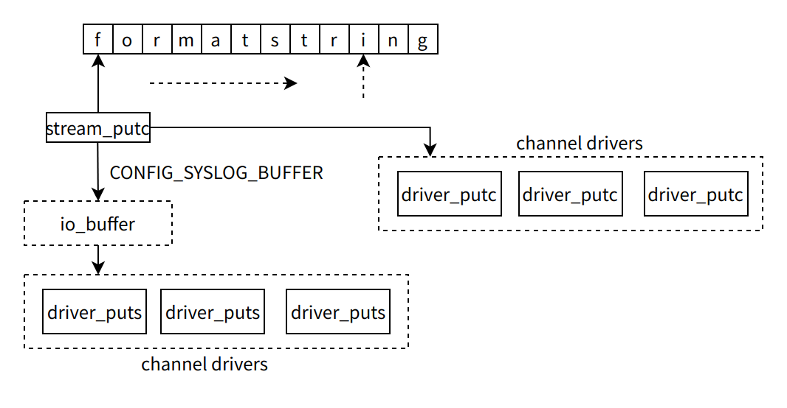

# A Deep Dive into the System Log (Syslog)

\[ English | [简体中文](../../../../zh-cn/device_dev_guide/kernel/logging/syslog.md) \]

## I. Overview

The `syslog` is the standard framework in the openvela system for recording kernel and application logs. It provides a flexible and extensible logging solution capable of capturing critical information during system runtime.

**Core Features:**

- **Graded Logging**: Supports multiple log priorities, from `LOG_DEBUG` to `LOG_EMERG`, to facilitate classification and filtering.
- **Multi-Channel Output**: Allows logs to be routed simultaneously to multiple destinations, such as a physical serial port, an in-memory buffer (RAM log), the filesystem, or a remote processor.
- **Flexible Formatting**: Can automatically prepend each log entry with rich contextual information, such as a timestamp, CPU ID, and process/thread ID (PID).

## II. API Reference and Usage Guidelines

### 1. Application Layer API

Application developers use the `syslog()` function to submit logs to the system.

**Function Prototype**:

```C
#include <syslog.h>
void syslog(int priority, const char *format, ...);
```

**Parameters**:

- `priority`: The priority of the log, such as `LOG_INFO`, `LOG_ERR`, etc.
- `format`: A format string compatible with `printf` syntax.

### 2. Kernel Layer Usage Guidelines

Kernel code (including drivers) **must** use the logging macros provided in `include/debug.h`, such as `_info()`, `_warn()`, and `_err()`, and **should not** call the `syslog()` function directly.

- **Advantages**: These macros are configurable and can be completely removed at compile time based on Kconfig options.
- **Purpose**: This mechanism effectively prevents unnecessary logging code from being included in production firmware, thereby reducing firmware size and improving system performance.

## III. Core Architecture: Internal Workflow and Data Flow

The core of the `syslog` framework is a dispatch mechanism that receives logs, formats them, and then routes them to their final destinations through various channels. The overall architecture is shown in the figure below:


### 1. Core Workflow

1. **Reception and Filtering**: When `syslog()` or a kernel log macro is called, the system first filters the message based on the currently configured log level.
2. **Formatting**: The `nx_vsyslog()` function adds metadata such as a prefix, timestamp, and PID to the log according to Kconfig settings.
3. **Output to Stream**: All formatting operations ultimately converge on `lib_vsprintf()`, which writes the formatted string character by character to an abstract output stream.
4. **Dispatch to Channels**: The `syslog` output stream is a special multiplexer. It distributes each character it receives to all registered log channels.
5. **Driver Output**: Each channel is responsible for outputting the log data to a specific medium, such as a UART, RAM buffer, or file, via its underlying driver.

### 2. Call Stack Overview

```Bash
// Application/Kernel Log Call
syslog() / _info()
    |
    v-- Formatting & Dispatch
nx_vsyslog()
    |
    v-- C Library Standard Formatting
lib_vsprintf()
    |
    v-- Write to Syslog Output Stream
stream_putc() --> syslogstream_putc()
    |
    v-- Iterate All Registered Channels & Differentiate Context
syslog_putc()
    |
    v-- Call Channel Driver's Output Function
g_syslog_channel[i]->sc_ops->sc_putc()    // Task context
g_syslog_channel[i]->sc_ops->sc_force()   // Interrupt context
```

### 3. Dynamic Channel Registration Mechanism

Any module in the system (such as a driver) can register a custom log output channel using the `syslog_channel()` function.

#### Registration Interface

```C
// Defined in: drivers/syslog/syslog_channel.c
int syslog_channel(FAR struct syslog_channel_s *channel);
```

When registering, the channel driver must provide a set of operations (`ops`) that defines how the channel handles log data.

#### Channel Operations Interface (`struct syslog_channel_ops_s`)

```C
// Defined in: include/nuttx/syslog/syslog.h
struct syslog_channel_ops_s {
  // Character output for task context (can be blocking)
  syslog_putc_t  sc_putc;
  // Character output for interrupt context (must be non-blocking and re-entrant)
  syslog_putc_t  sc_force;
  // Force a buffer flush (e.g., called on system crash)
  syslog_flush_t sc_flush;
  // Optimization: write multiple bytes at once
  syslog_write_t sc_write;
  // Channel close callback
  syslog_close_t sc_close;
};
```

#### How It Works

1. **Driver Call**: During driver initialization, a `syslog_channel_s` structure is created and its `ops` function set is populated.

2. **Register with Core**: The driver calls the `syslog_channel()` function, passing a pointer to this structure to the `syslog` core.

3. **Add to List**: The `syslog` core stores the received channel pointer in a global array, `g_syslog_channel[]`. `CONFIG_SYSLOG_MAX_CHANNELS` defines the size of this array.

    > **Note**: `CONFIG_SYSLOG_MAX_CHANNELS` defines the size of this array, which is the maximum number of channels supported by the system.

#### Key Design: Context Safety

The `syslog` framework can automatically detect the current execution context (task or interrupt).

- In a **task context**, it calls `sc_putc`.
- In an **interrupt context**, it calls `sc_force` to avoid blocking or resource contention within an Interrupt Service Routine (ISR).

Therefore, channel driver developers must ensure their `sc_force` function implementation is **non-blocking and re-entrant**, which is critical for maintaining system real-time performance and stability.

### 4. Underlying Data Flow: Buffering vs. Direct Write

The data path from `lib_vsprintf` to the physical channel has two core operating modes, controlled by `CONFIG_SYSLOG_BUFFER`. This is illustrated in the figure below:



#### Mode 1: Buffered Output (`CONFIG_SYSLOG_BUFFER=y`)

This is the default and recommended mode, designed to improve performance by reducing the number of I/O operations.

1. **Write to Buffer**: Formatted characters are added one by one to an internal I/O buffer.
2. **Batch Flush**: When the buffer is full or a newline character is encountered, the `syslogstream_flush()` function is triggered.
3. **Efficient Write**: This function iterates through all registered channels and calls each channel's `sc_write()` method to write the entire buffer's data at once. This approach significantly reduces the function call overhead associated with high-frequency logging.

#### Mode 2: Direct Output (without `CONFIG_SYSLOG_BUFFER`)

In this mode, the system does not use an intermediate buffer; each character is sent immediately.

1. **Direct Dispatch**: `stream_putc` directly calls `syslog_putc()`.
2. **Context Awareness**: The `syslog_putc()` function checks the current execution context:

    - If in a **task context**, it calls the channel driver's `sc_putc()` function.
    - If in an **interrupt context**, it calls the channel driver's `sc_force()` function, which must be non-blocking.

3. **Character-by-Character Sending**: Each character triggers an iteration and function call for all channels.

> **Note**: Even in direct output mode, the `syslog` framework still uses a separate **interrupt log buffer** (`CONFIG_SYSLOG_INTBUFFER`) to ensure the atomicity and non-blocking nature of interrupt logs, preventing log content from becoming interleaved. See [Logging in Interrupts](#vii-logging-in-interrupts).

## IV. Log Control and Filtering

The `syslog` framework provides both compile-time and runtime mechanisms for flexible log control, allowing developers to precisely manage log output content and destinations.

### 1. Log Priorities

The system defines 8 standard log priorities, listed below from highest to lowest:

| Priority | C Macro     | Description                        |
| -------- | ----------- | ---------------------------------- |
| Highest  | LOG_EMERG   | System is unusable                 |
|          | LOG_ALERT   | Action must be taken immediately   |
|          | LOG_CRIT    | Critical conditions                |
|          | LOG_ERR     | Error conditions                   |
|          | LOG_WARNING | Warning conditions                 |
|          | LOG_NOTICE  | Normal, but significant, condition |
|          | LOG_INFO    | Informational message              |
| Lowest   | LOG_DEBUG   | Debug-level message                |

### 2. Compile-Time Filtering: Control via Kconfig

Compile-time filtering is the **most effective** way to control firmware size and performance. By disabling specific modules or log levels in Kconfig, the associated logging code is completely removed from the final binary.

- **General-Purpose Log Macros**: These macros are used throughout the kernel.
  
    - `CONFIG_DEBUG_INFO`: Controls `_info()`
    - `CONFIG_DEBUG_WARN`: Controls `_warn()`
    - `CONFIG_DEBUG_ERROR`: Controls `_err()`
    - `CONFIG_DEBUG_ASSERT`: Controls `_alert()` and `ASSERT()`

- **Subsystem-Specific Macros**: For more granular control, many kernel subsystems (like the scheduler or memory management) provide their own dedicated logging macros. This allows developers to enable logging only for the specific module they are debugging while keeping others quiet.

    - `CONFIG_DEBUG_SCHED_INFO`: Controls `sinfo()` (scheduler info)
    - `CONFIG_DEBUG_MM_ERROR`: Controls `merr()` (memory management error)

### 3. Runtime Control: The `setlogmask` Command

`setlogmask` is a powerful shell command that allows users to dynamically adjust logging behavior at runtime without recompiling the firmware.

**Required Configuration**:

```Bash
# Enable the setlogmask command
CONFIG_SYSTEM_SETLOGMASK=y

# Enable log channel control via ioctl
CONFIG_SYSLOG_IOCTL=y
```

The `setlogmask` command has two main functions: setting the log filter level and managing output channels.

#### Function 1: Setting the Log Filter Level

This function sets the **minimum** log priority for system output. Only logs with a priority **equal to or higher than** the set level will be output.

**Usage Examples**:

```Bash
# View help and available levels
nsh> setlogmask -h
Usage: setlogmask <d|i|n|w|e|c|a|r>
Where: d=DEBUG, i=INFO, ..., r=EMERG

# Set level to DEBUG, outputting all logs
nsh> setlogmask d

# Set level to ERROR, outputting only LOG_ERR and higher priority logs
nsh> setlogmask e
```

#### Function 2: Dynamically Managing Output Channels

This function allows users to dynamically enable or disable registered log channels, thereby controlling the log output destinations.

**Usage Examples**:

```Bash
# List all registered channels and their current status
nsh> setlogmask list
Channels:
  default: enable
  ramlog: enable

# Temporarily disable log output to the physical serial port (usually the 'default' channel)
nsh> setlogmask disable default

# Check again to confirm the channel status has changed
nsh> setlogmask list
Channels:
  default: disable
  ramlog: enable

# Re-enable serial log output
nsh> setlogmask enable default
```

## V. Multi-Channel Log Configuration

The kernel logging system supports outputting logs to multiple channels, such as the terminal, memory, filesystem, etc. Developers can flexibly combine and configure these channels to meet different debugging and product requirements.

### 1. Channel Overview and Selection

To help you quickly select the appropriate log channel, the following table summarizes the features and use cases of each channel:

| Channel     | Primary Kconfig Macro | Features and Core Use Cases                                                                             | Limitations and Considerations                                                                  |
| ----------- | --------------------- | ------------------------------------------------------------------------------------------------------- | ----------------------------------------------------------------------------------------------- |
| Default     | CONFIG_SYSLOG_DEFAULT | Outputs via the low-level `up_putc` interface. Suitable for early boot-stage debugging. Interrupt-safe. | Simplest functionality, usually outputs to the first serial port. May mix with `printf` output. |
| RAM Log     | CONFIG_RAMLOG_SYSLOG  | Writes to an in-memory ring buffer. Extremely fast with minimal impact on system performance.           | Logs are lost on device reboot. Buffer size is limited.                                         |
| File Log    | CONFIG_SYSLOG_FILE    | Persists logs to a file, supports log rotation. Ideal for post-mortem analysis.                         | Depends on the filesystem; not suitable for early boot logging.                                 |
| Device Log  | CONFIG_SYSLOG_CHAR    | Writes logs to a specified character device file (e.g., /dev/ttyS1). Highly flexible.                   | Depends on device driver initialization. Not interrupt-safe due to internal locking.            |
| Console Log | CONFIG_SYSLOG_CONSOLE | A special case of Device Log, fixed to output to /dev/console.                                          | Same as Device Log: driver-dependent and not interrupt-safe.                                    |
| RPMSG       | CONFIG_SYSLOG_RPMSG   | For multi-core systems, sends logs from a Remote Core to the Master Core via the RPMSG framework.       | Depends on a functional RPMSG communication framework.                                          |
| USB CDC-ACM | CONFIG_SYSLOG_CDCACM  | Outputs logs over a USB Virtual COM Port, convenient for connecting to a PC for debugging.              | Depends on the USB stack initialization.                                                        |

### 2. Detailed Channel Configuration

#### Default Channel (Low-Level Serial Output)

This is the most basic log channel. It bypasses upper-level drivers and directly calls the low-level character output function (`up_putc`), typically for serial port output.

- **Use Cases**: Capturing logs during the early boot stage, before device drivers are fully initialized.

- **Core Configuration**:

  ```Makefile
  # Enable the Default channel
  CONFIG_SYSLOG_DEFAULT=y
  
  # Ensure the low-level putc interface is implemented
  CONFIG_ARCH_LOWPUTC=y
  ```

- **How It Works**: This channel directly calls `up_putc`, which typically sends data by polling hardware registers and disables interrupts, making it interrupt-safe.

#### RAM Log Channel (In-Memory Buffer)

Writes logs at high speed into a pre-allocated memory buffer.

- **Use Cases**: Scenarios requiring high-performance logging with minimal impact on real-time performance. Often used for performance analysis or for exporting logs from memory after an issue has been reproduced.

- **Core Configuration**:

  ```Makefile
  # Enable the RAMLOG feature
  CONFIG_RAMLOG=y

  # Use RAMLOG as a syslog channel
  CONFIG_RAMLOG_SYSLOG=y

  # Set the buffer size (in bytes); old logs are overwritten when full
  CONFIG_RAMLOG_BUFSIZE=1024

  # (Optional) Place the buffer in a specific memory section
  # RAMLOG_BUFFER_SECTION=".bss"
  ```

- **Note**: Logs stored in RAM are volatile and will be lost if the device is powered off or restarted.

#### File Log Channel (Persistent Storage)

Saves logs to the filesystem for persistent storage.

- **Use Cases**: Scenarios where historical logs need to be preserved and analyzed long after the device has been running.

- **Core Configuration**:

  ```Makefile
  # Enable the File Log channel
  CONFIG_SYSLOG_FILE=y
  ```

- **Usage**: This channel is not active by default. The application layer must initialize it by calling `syslog_file_channel()` after the filesystem has been mounted, specifying the log file path.

- **Advanced Options**:

    | Option                 | Description                                                                                                           | Default      |
    | ---------------------- | --------------------------------------------------------------------------------------------------------------------- | ------------ |
    | SYSLOG_FILE_SEPARATE   | If 'y', writes a blank line to the log file on each reboot to separate log sessions.                                  | n            |
    | SYSLOG_FILE_ROTATIONS  | Enables log rotation. Creates a new file when the size limit is reached. Defines the number of old log files to keep. | 0 (disabled) |
    | SYSLOG_FILE_SIZE_LIMIT | When rotation is enabled, the maximum size of a single log file (in bytes).                                           | 524288       |

#### Device / Console Channel (Character Device Output)

Writes logs as a standard data stream to a character device file.

- **Use Cases**: Redirecting logs to a specific serial port, virtual terminal, or other character device.

- **Configuration**:

    - To output to a specific device (e.g., `/dev/ttyS1`):

      ```Makefile
      # Enable the character device channel
      CONFIG_SYSLOG_CHAR=y
      
      # Specify the target device path
      CONFIG_SYSLOG_DEVPATH="/dev/ttyS1"
      ```

    - To output to the system console (`/dev/console`):

      ```Makefile
      # Enable the Console channel
      CONFIG_SYSLOG_CONSOLE=y
      ```

- **How It Works**: This channel writes logs to the device node via standard file I/O (`write()`). Because it acquires a device lock, it **must not be used in an interrupt context**, as this could lead to a system deadlock.

- **Special Configuration `CONSOLE_SYSLOG`**:

    - **Function**: This macro **replaces** the underlying implementation of `/dev/console` with the syslog system. This means all content directed to the console via standard library functions like `printf` will be redirected to all enabled syslog channels (e.g., File, RAM Log).
    - **Note**: `CONFIG_CONSOLE_SYSLOG` and `CONFIG_SYSLOG_CONSOLE` are **mutually exclusive** and cannot be enabled at the same time.

#### RPMSG Channel (Multi-Core Logging)

Used in multi-core processor architectures to allow a remote core to send logs to the primary core.

- **Use Cases**: Centralizing the collection and management of logs from all cores in an Asymmetric Multiprocessing (AMP) system.

- **Core Configuration**:

    - **Master Core (Receiver) Configuration**:

      ```Makefile
      CONFIG_SYSLOG_RPMSG_SERVER=y    
      ```

      And call `syslog_rpmsg_server_init()` in the board-level initialization code.

    - **Remote Core (Sender) Configuration**:

      ```Makefile
      CONFIG_SYSLOG_RPMSG=y
      CONFIG_SYSLOG_RPMSG_SERVER_NAME="ap" # RPMSG server endpoint name
      ```

      And call `syslog_rpmsg_init()` and `syslog_rpmsg_init_early` in the board-level initialization code.

- **See Also**: [Rpmsg Syslog]()

#### USB CDC-ACM Channel (USB Virtual COM Port)

Outputs logs via a USB interface, which a PC recognizes as a virtual serial port.

- **Use Cases**: When the device lacks a physical serial port, or for convenient log viewing by connecting to a PC via USB.
- **Core Configuration**: `CONFIG_SYSLOG_CDCACM=y`

## VI. Log Output Formatting

To facilitate debugging and analysis, you can automatically prepend various contextual information, such as timestamps and thread IDs, to your raw log messages.

The following formatting options are available and can be combined as needed:

| Category      | Kconfig Macro                              | Description                                                                                                                 |
| ------------- | ------------------------------------------ | --------------------------------------------------------------------------------------------------------------------------- |
| Timestamp     | CONFIG_SYSLOG_TIMESTAMP                    | (Master switch) Adds a timestamp before each log. By default, outputs raw system time units (ticks) since boot.             |
|               | CONFIG_SYSLOG_TIMESTAMP_REALTIME           | Resolves the timestamp to wall-clock time. Depends on the RTC being set correctly.                                          |
|               | CONFIG_SYSLOG_TIMESTAMP_FORMATTED          | Enables custom formatted time string functionality.                                                                         |
|               | CONFIG_SYSLOG_TIMESTAMP_LOCALTIME          | (Requires _REALTIME) Displays time in the local timezone instead of UTC.                                                    |
|               | CONFIG_SYSLOG_TIMESTAMP_FORMAT             | (Requires _FORMATTED) Defines the time format, e.g., "%y/%m/%d %H:%M:%S".                                                   |
|               | CONFIG_SYSLOG_TIMESTAMP_FORMAT_MICROSECOND | (Requires _FORMATTED) Appends milliseconds or microseconds to the formatted time for higher precision.                      |
|               | CONFIG_SYSLOG_TIMESTAMP_BUFFER             | (Advanced/Internal) Defines the buffer size for the formatted timestamp string. Rarely needs changing.                      |
| Log Metadata  | CONFIG_SYSLOG_PRIORITY                     | Displays the log priority (e.g., [ERR], [WARN], [INFO]).                                                                    |
|               | CONFIG_SYSLOG_PROCESSID                    | Displays the PID of the current task (thread).                                                                              |
|               | CONFIG_SYSLOG_PROCESS_NAME                 | Displays the name of the current task (thread).                                                                             |
| Custom Prefix | CONFIG_SYSLOG_PREFIX                       | (Master switch) Adds a fixed string prefix to all logs.                                                                     |
|               | CONFIG_SYSLOG_PREFIX_STRING                | Defines the specific prefix content, e.g., "ap:" or "core0:".                                                               |
| Visuals       | CONFIG_SYSLOG_COLOR_OUTPUT                 | Displays logs in different colors based on priority.<br> **Note**: This adds color control characters to the output stream. |

### 1. Configuration Example

Suppose you want logs to include a custom prefix "ap", display the priority and process ID, and show the local time in "year/month/day hour:minute:second.millisecond" format.

```Makefile
# --- Timestamp Configuration ---
CONFIG_SYSLOG_TIMESTAMP=y
CONFIG_SYSLOG_TIMESTAMP_REALTIME=y
CONFIG_SYSLOG_TIMESTAMP_FORMATTED=y
CONFIG_SYSLOG_TIMESTAMP_FORMAT="%y/%m/%d %H:%M:%S"
CONFIG_SYSLOG_TIMESTAMP_FORMAT_MICROSECOND=y
CONFIG_SYSLOG_TIMESTAMP_LOCALTIME=y

# --- Metadata and Prefix Configuration ---
CONFIG_SYSLOG_PRIORITY=y
CONFIG_SYSLOG_PROCESSID=y
CONFIG_SYSLOG_PREFIX=y
CONFIG_SYSLOG_PREFIX_STRING="ap"
```

**The final output might look like this:**

`ap [INFO][12] 23/10/26 15:30:05.123: This is a sample log message`.

## VII. Logging in Interrupts

Printing logs from within an Interrupt Service Routine (ISR) requires special handling to avoid impacting system real-time performance and to ensure log integrity.

### The Problem

1. **Excessive Execution Time**: Performing I/O operations (like writing to a serial port) directly in an ISR consumes valuable CPU time and may cause other more critical interrupts to be missed.
2. **Log Interleaving**: If logs from an ISR and a normal task are simultaneously output to the `default_channel` or `ramlog_channel`, their content can become mixed, resulting in corrupted or unreadable log messages.
3. **Functional Limitations**: The `dev_channel` (including File and Console channels) uses internal locking mechanisms and is **strictly forbidden** from being used in an ISR, as it would cause a system deadlock.

### Solution: The Interrupt Log Buffer

To address these issues, the system provides a dedicated **interrupt log buffer** (`SYSLOG_INTBUFFER`).

**Core Configuration:**

```Makefile
# Enable the interrupt log buffer
CONFIG_SYSLOG_INTBUFFER=y

# Set the buffer size (in bytes)
CONFIG_SYSLOG_INTBUFSIZE=512
```

### How It Works: Defer and Flush

- **In an ISR**: When `syslog()` is called from an interrupt context, it does **not** immediately send the log to the final channel. Instead, it quickly stages the log content into the interrupt buffer, and the ISR returns immediately. This process is extremely fast and has minimal impact on system real-time performance.

- **In a Task**: The next time `syslog()` is called from a normal task context (non-interrupt), the system performs an extra step: it first checks if there are any pending logs in the interrupt buffer. If so, the system will **first flush all logs from the buffer to the final channel in their entirety**, and only then will it process the new log from the current task.

This "defer and flush" mechanism ensures that ISRs execute quickly while also guaranteeing that all logs (from both interrupts and tasks) are output in the correct chronological order without interleaving.

## VIII. Related Documents

- [printf Function Usage Guidelines](./printf.md)
- [Log Management and Troubleshooting](./troubleshooting.md)
