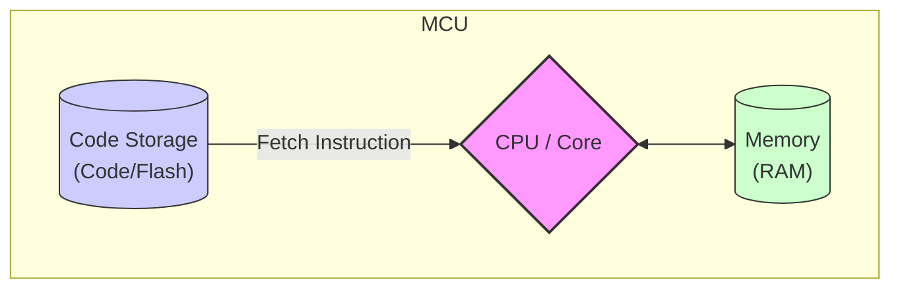
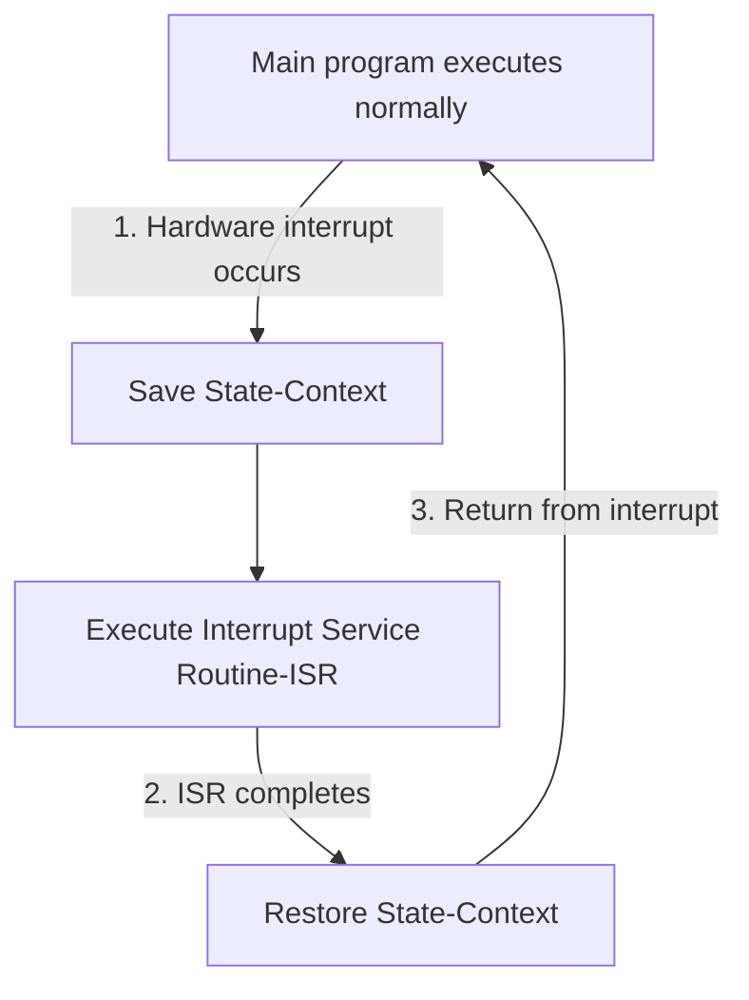
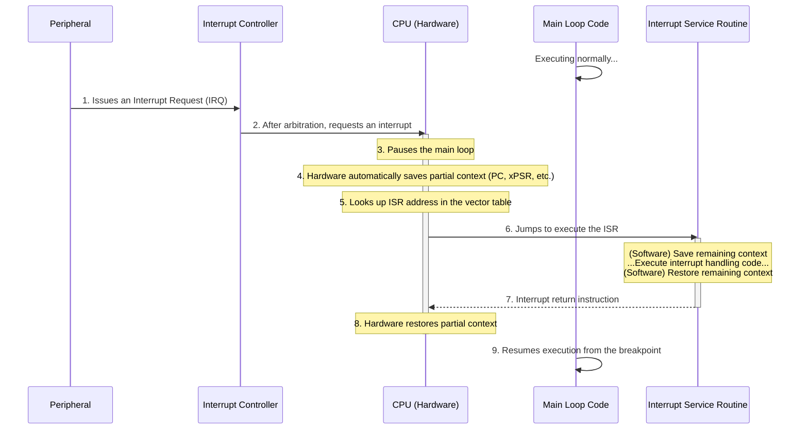
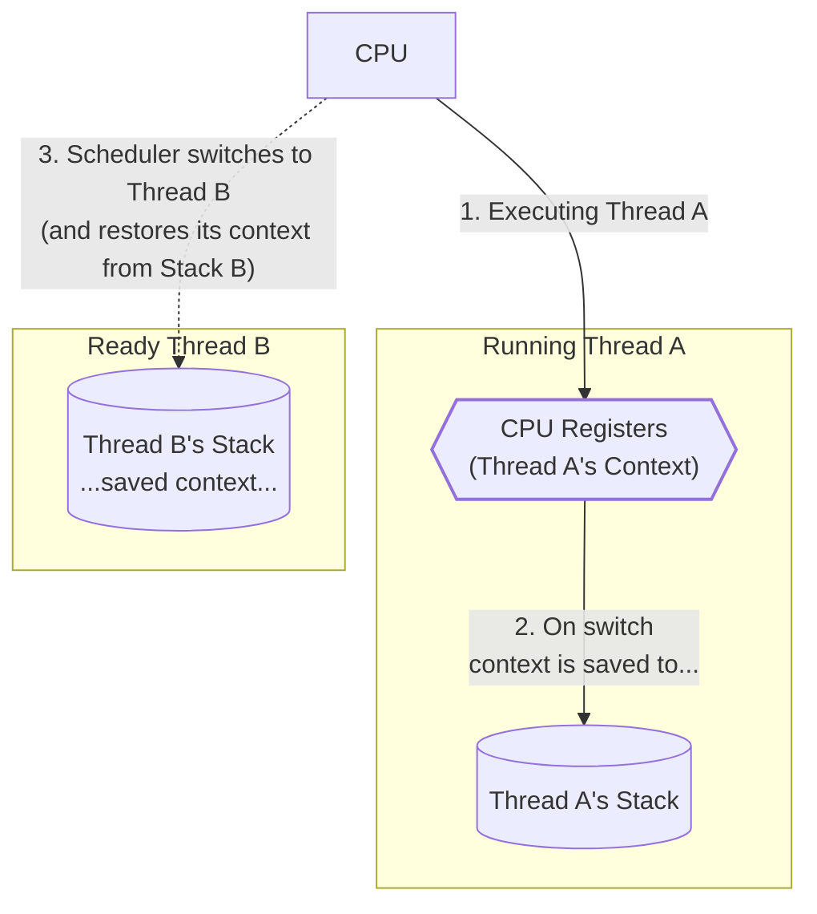
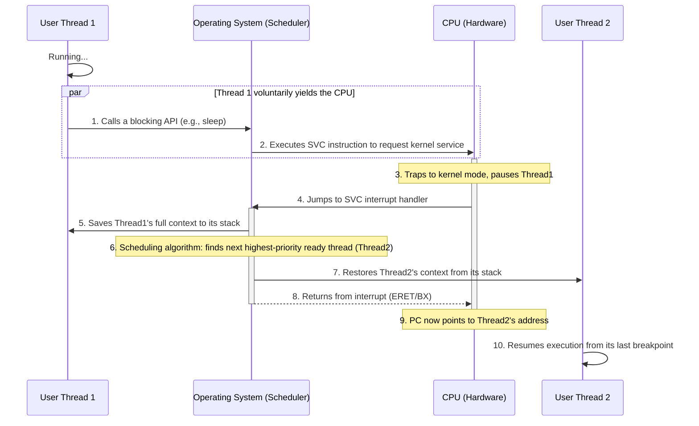

# Exploring RTOS from Scratch: From Single-Task Loops to Preemptive Multithreading

\[ English | [简体中文](../../../zh-cn/device_dev_guide/kernel/rtos_from_scratch.md) \]

This article is for beginners in operating systems. It aims to guide you through the evolution of computers from doing one thing at a time to handling multiple tasks simultaneously, all in the simplest way possible. Together, we will demystify the core concepts of **multithreading**, **interrupts**, and **context switching**.

After reading this article, you will understand:

- Why do modern operating systems need multithreading?
- What is an interrupt, and how does it make the CPU "all-seeing and all-hearing"?
- What exactly is switched during a "context switch"? How does it achieve "seamless" task transitions?

## I. How Programs Run: The Basics of CPU Operation

Imagine the computer's brain is a very diligent but simple-minded worker, which we usually call the **Central Processing Unit (CPU)**. Its job is to strictly follow a manual of "instructions."

In many electronic devices around us, such as smart wristbands and remote controls, this "brain" is often a highly integrated chip called a **Microcontroller Unit (MCU)**. You can think of an MCU as a mini-computer that integrates the CPU core, **Code Storage (Code)** for instructions, and **Memory (RAM)** for temporary data all in one package.

Whether it's a general-purpose CPU or an integrated MCU, it needs these components to work:

- **Instructions (Code)**: Tell the processor what to do next.
- **Data**: The raw materials the processor needs to read and write during its work.
- **Registers**: The processor's built-in "high-speed pockets" for temporarily storing the address of the instruction or data being processed.



Its workflow is very straightforward: **The MCU/CPU fetches an instruction from code storage, executes it, then fetches the next one, and so on.** This is the most basic form of program execution.

## II. The First Attempt: Running a Single Task on Bare Metal

Running a program directly on hardware without an operating system is called "bare-metal" programming. The simplest bare-metal program might be an infinite loop:

<details>
<summary>Click to expand code</summary>

```C
// Pseudocode: A simple bare-metal program
void main() {
    // 1. Initialize hardware (e.g., clock, memory)
    // 2. Prepare the C language runtime environment
    // 3. Initialize the UART driver for printing information
    while (1) {
        printf("Hello, I am a bare-metal program!\n");
    }
}
```

</details>

---

If the printing is too fast, we might want to make the CPU "wait a bit." But without an OS, we don't have functions like `sleep()`. The most direct way is to make the CPU do some useless work to kill time, which is called a "busy-wait."

<details>
<summary>Click to expand code</summary>

```C
void udelay(int microseconds) {
    // Make the CPU spin in a loop to consume the specified time
    for (int i = 0; i < (microseconds * SOME_MAGIC_NUMBER); i++) {
        // Do nothing
    }
}
while (1) {
    printf("Hello, I am a bare-metal program!\n");
    udelay(1000000); // Busy-wait for 1 second
}
```

</details>

---

Key Problem: Although this method "slows things down," the CPU is always running at 100%, which is very power-hungry and inefficient.

## III. Moving Towards Multitasking: The Simple Super-Loop

Now, our bare-metal program is no longer content with doing just one thing. Suppose we want it to **blink an LED** and **check if a button is pressed** at the same time.

The most intuitive idea is to execute these tasks one after another in the `while(1)` loop. This structure is commonly known as a "super-loop" in the embedded world.

### 1. The First Attempt: Blocking Polling

We write each task as a function and call them sequentially in the main loop:

<details>
<summary>Click to expand code</summary>

```C
// Pseudocode: A blocking super-loop
void task_blink_led() {
    // Toggle LED state, print logs, etc.
    printf("LED toggled!\n");
    // Use the previous busy-wait to delay for 1 second
    udelay(1000000);
}
void task_check_button() {
    if (is_button_pressed()) {
        printf("Button was pressed!\n");
    }
}
void main() {
    // ... Initialization ...
    while (1) {
        task_blink_led();
        task_check_button();
    }
}
```

</details>

---

This approach is simple and direct, but it quickly reveals fatal flaws:

> **Key Problems:**
>
> 1. **Blocking**: The `task_blink_led()` function contains a 1-second delay `udelay()`. During this second, the CPU is completely occupied, and `task_check_button()` has no chance to run. This means the user must press the button at the exact moment the LED turns on or off to have it detected, which is nearly impossible. The overall system responsiveness becomes extremely slow.
> 2. **No Priority**: Even if some tasks are more urgent (like handling user input), they must wait in line for the preceding tasks to finish.
> 3. **CPU Always Spinning**: Whether executing useful tasks or spinning in `udelay`, the CPU is always 100% busy and highly inefficient.

### 2. Improvement: Cooperative Scheduling (Non-blocking)

To solve the "blocking" problem, we need a change in mindset: **No task should hog the CPU for a long time.**

Each task should be broken down into many tiny steps. After executing a small step, it should immediately return, "yielding" CPU control to other tasks. This is like a polite team where everyone actively "cooperates" instead of one person working to death. This model is also often called a "state machine."

<details>
<summary>Click to expand code</summary>

```C
// Pseudocode: Non-blocking cooperative scheduling
// Global variable for inter-task communication
long long last_led_toggle_time = 0;
// The LED task now only checks and executes, without waiting
void task_blink_led_nonblocking() {
    if (get_current_time() - last_led_toggle_time > 1000) {
        // Time is up, toggle the LED and update the time
        toggle_led();
        last_led_toggle_time = get_current_time();
    }
    // If time is not up, return immediately
}
void task_check_button_nonblocking() {
    if (is_button_pressed()) {
        printf("Button was pressed!\n");
    }
}
void main() {
    // ... Initialization ...
    while (1) {
        task_blink_led_nonblocking();
        task_check_button_nonblocking();
        // In theory, there could be task_c, task_d...
    }
}
```

</details>

---

**Advantages**:

- The blocking problem is solved! `task_blink_led` no longer has `udelay`. Each time it's called, it just checks the time and returns immediately if the condition isn't met, giving `task_check_button` a chance to run. System responsiveness is greatly improved.

**New Disadvantages**:

1. **Still No Preemption**: If some task (like `task_c`) is a complex computation that takes a long time, it will still block all other tasks. High-priority tasks (like button handling) still cannot "jump the queue."
2. **CPU Still Spinning**: When all tasks have nothing to do (it's not time to toggle the LED, and the user hasn't pressed the button), the `while(1)` loop is still running frantically, calling each task function over and over, doing pointless checks.
3. **Tasks Must Be "Well-Behaved"**: The success of this model relies entirely on the programmer's discipline to ensure no task runs for too long. One "misbehaving" task can bring down the entire system.

> **The Core Conflict:** We want the system to be responsive when there's work to do, but we also want it to **rest** to save power when it's idle.
>
> So, can we add `sleep()` at the end of the `while(1)` loop when all tasks are not ready?
>
> How long should we `sleep()`?
>
> - Sleep too long, and we might miss the next event that needs processing (like a button press).
> - Sleep too short, and it's not much different from not sleeping at all—still frequently waking up, checking, and sleeping again, wasting energy.
>
> We need a mechanism that allows the CPU to **"sleep until an event occurs, then be awakened."**

### 3. The Path to the Final Answer: The Event-Driven Model

This conflict is not unsolvable. In modern operating systems and high-level libraries like `libuv`, there are already mature solutions. The core idea can be represented by the classic pseudocode you provided:

<details>
<summary>Click to expand code</summary>

```C++
// Pseudocode: The classic event loop model
while (1) {
    // 1. Wait for any of the interested events to occur
    poll(all_event_sources);
    // 2. After waking up, check which event is ready and process it
    if (event_source_0_is_ready()) {
        process_event_0();
    }
    if (event_source_1_is_ready()) {
        process_event_1();
    }
    // ...
}
```

</details>

---

Let's dissect the essence of this model:

- **`poll(all_event_sources)`**: This is the heart of the model. It no longer makes the CPU spin in a `while` loop. Instead, it performs a special "wait" operation. This operation tells the system kernel: **Please suspend me until something happens on any of these event sources I care about (`all_event_sources`). While I'm waiting, let the CPU sleep or serve other programs.**
- **Wake-up and Processing**: When an event (like network data arrival or a timer expiration) actually occurs, the system "wakes up" the `poll` function. The program returns from `poll` and continues execution, checking which event occurred and calling the corresponding handler.

This model elegantly solves all the previous problems: the CPU no longer spins, achieving efficient waiting; the system responds promptly because any event can wake the program immediately.

#### From `poll` to Bare Metal

Now, let's apply this perfect idea to our bare-metal environment.

On bare metal, we don't have an OS kernel or "file descriptors (fd)," but we have their hardware equivalents:

| **Concept (OS/High-Level Library)** | **Corresponding Concept (Bare-Metal Hardware)**                    |
| :---------------------------------- | :----------------------------------------------------------------- |
| Event Source                        | **Hardware Module** (e.g., Timer, GPIO, UART)                      |
| Waiting (`poll()`)                  | **CPU Sleep Instruction** (e.g., ARM's `WFI` - Wait For Interrupt) |
| Event Occurs, Waking `poll`         | **Hardware Interrupt Signal**                                      |

So, the classic event loop above "translates" into this in our bare-metal world:

<details>
<summary>Click to expand code</summary>

```C
// Pseudocode: An event-driven model in a bare-metal environment
void main() {
    // ... Initialize hardware modules and "tell" them to trigger an interrupt on completion ...
    while (1) {
        // 1. Execute the WFI instruction to put the CPU into a low-power sleep mode.
        //    The CPU will "sleep" here until an interrupt occurs.
        WFI();
        // 2. When an interrupt occurs, the CPU is awakened by hardware and continues execution
        //    from the line after WFI. The Interrupt Service Routine (ISR) has usually
        //    handled the urgent part and set a flag.
        // 3. In the main loop, handle the non-urgent follow-up tasks.
        if (g_timer_expired_flag == true) {
            process_led_task();
            g_timer_expired_flag = false; // Clear the flag
        }
        if (g_button_pressed_flag == true) {
            process_button_task();
            g_button_pressed_flag = false; // Clear the flag
        }
    }
}
```

</details>

---

This final form leads to two ultimate hardware questions, which are the answers we are about to reveal:

1. **How does the CPU "sleep"?** -> Through the `WFI` instruction.
2. **Who wakes up the sleeping CPU?** -> A hardware signal that is independent of the CPU's normal execution flow.

This hardware mechanism that can "interrupt" the CPU's current state (whether it's sleeping or executing other code) and force it to handle urgent events is the star we are about to introduce—the **Interrupt**.

## IV. Interrupts: The Key to Waking a Sleeping CPU

We have a clear goal: let the CPU sleep with the `WFI` instruction when idle and be awakened when an event occurs. But who plays the role of this "wake-up call"? The answer is a powerful mechanism directly supported by hardware—the **Interrupt**.

### 1. What is an Interrupt?



**Interrupt**: A mechanism by which the CPU responds to an asynchronous event in the system. It suspends the currently executing task, saves its working state, and then jumps to handle the event. After handling is complete, it precisely returns to the point where it was paused, restores the state, and continues execution.

This definition might be a bit abstract, so let's use a classic analogy to understand it:

Imagine you are engrossed in reading a book (the CPU executing the main program), and suddenly the doorbell rings (a hardware event, like a button press).

- **Pause and Mark**: You don't just throw the book away. You remember which page and line you were on, or you insert a bookmark (CPU **saves context**).
- **Handle the Event**: You get up to open the door, see who it is, and take care of the matter (CPU jumps to execute an **Interrupt Service Routine, ISR**).
- **Return and Continue**: After the matter is handled, you return to your seat, find your place using the bookmark, and continue reading (CPU **restores context** and returns to the main program).

The entire process is seamless. You neither missed the urgent event at the door nor lost your reading progress. An interrupt is just such an efficient, hardware-guaranteed event-handling flow.

### 2. The Interrupt Execution Flow



This "answering the phone" process is a precise collaboration between hardware and software. The detailed steps are as follows:

1. **Interrupt Request (IRQ)**: A peripheral (like a UART) finishes its job (e.g., receiving a data byte) and sends a "I need attention" signal to the **Interrupt Controller (like the NVIC in ARM Cortex-M)**.
2. **Arbitration and Dispatch**: The interrupt controller, like a central dispatcher, decides whether to disturb the CPU based on the priority of this interrupt request.
3. **CPU Response**: After finishing the current instruction, the CPU checks the interrupt controller's signal. If it finds a valid request, it pauses the current task.
4. **Context Save (Hardware)**: The CPU automatically pushes the Program Counter (PC), status registers, and other core state information onto the current task's stack. This action is performed by hardware to ensure speed and atomicity.
5. **Find Handler Function**: The CPU learns which interrupt source triggered the event (the "interrupt number") from the controller. It then uses this as an index to find the corresponding handler's address in the **Interrupt Vector Table**. This table is like a predefined emergency contact list.
6. **Jump to ISR**: The CPU jumps to that address and starts executing the **Interrupt Service Routine (ISR)** written for that interrupt. To ensure the ISR doesn't "pollute" the main program's environment, programmers typically save some general-purpose registers they might use at the beginning of the ISR via software.
7. **Execute Interrupt Handling**: Here, we execute the actual event-handling code. There's a golden rule: **Keep the ISR short and fast**. While an ISR is running, lower-priority interrupts are masked. A long ISR will degrade the overall system's responsiveness.
8. **Context Restore**: At the end of the ISR, the software manually restores the general-purpose registers saved in step 6.
9. **Interrupt Return**: A special interrupt return instruction is executed. The CPU hardware automatically pops the core state saved in step 4 from the stack. The Program Counter (PC) points back to the interrupted location, and the main program continues as if nothing ever happened.

### 3. The New Interrupt-Driven Model

With interrupts, our `while(1)` loop can finally rest easy. Based on interrupts, we have evolved two typical programming models.

#### Model 1: ISR Sets a Flag, Main Loop Processes (Recommended Paradigm)

This is the most robust and commonly used architecture in embedded systems. It clearly divides interrupt handling into a "top-half" and a "bottom-half."

- **Top-Half**: The ISR itself. It does only the most urgent things: clearing the interrupt flag, reading data, setting a global flag, and then exiting quickly.
- **Bottom-Half**: The main loop. After being awakened from `WFI`, it polls these flags and executes the less urgent but potentially more time-consuming business logic.

<details>
<summary>Click to expand code</summary>

```C
volatile bool g_task0_ready = false;
volatile bool g_task1_ready = false;
// ISR (Top-Half) - short and fast
void task0_irq_handler() {
    g_task0_ready = true;
}
void task1_irq_handler() {
    g_task1_ready = true;
}
void main() {
    // ... Initialize hardware and interrupts ...
    while (1) {
        // Enter sleep, wait for any interrupt to wake up
        WFI();
        // Bottom-Half - process tasks after waking up
        if (g_task0_ready) {
            g_task0_ready = false;
            task0_func();
        }
        if (g_task1_ready) {
            g_task1_ready = false;
            task1_func();
        }
    }
}
```

</details>

#### Model 2: Do All Work in the ISR (Should be Avoided)

This model places all task logic inside the ISR.

<details>
<summary>Click to expand code</summary>

```C
void task0_irq_handler() {
    task0_func(); // Execute the full task inside the interrupt
}
void main() {
    // ... Initialization ...
    while (1) {
        WFI(); // The main loop is only responsible for sleeping
    }
}
```

</details>

---

**Why is Model 1 the better choice?** Because the system's real-time performance depends on its responsiveness to the highest-priority event. If a more urgent interrupt (like a power failure) occurs while a lengthy ISR (like `task0_irq_handler` in Model 2) is executing, the system won't be able to respond in time. Therefore, keeping ISRs short is the cornerstone of ensuring system stability and reliability.

### 4. New Challenges

The interrupt mechanism greatly improves system efficiency and responsiveness. However, when we try to build a more complex system with it, a series of new, higher-level problems emerge:

1. **High-Priority Tasks Get Blocked**: In the `if-else` structure of the main loop, the task execution order is fixed. A high-priority task, even if awakened by an interrupt, might have to wait for a low-priority, long-running task to complete. We have achieved **interrupt preemption**, but the **task logic** in the main loop is still sequential and cannot be preempted.
2. **Unintuitive Programming Model**: To use interrupts, we have to break down a linear business logic (like `read -> process -> send`) into state machines and flags, making the code complex and hard to maintain.
3. **Lack of Fair Scheduling**: When multiple tasks of the same priority are ready, a simple `if` check cannot guarantee they will share CPU time fairly.
4. **Fragile System**: All tasks run in a shared address space without isolation. A bug in one task (like an infinite loop or stack overflow) can easily crash the entire system.

We have solved a low-level problem but introduced a series of high-level application challenges. These complex issues of **task scheduling, preemption, synchronization, communication, and resource management** are beyond what a simple `while(1)` + interrupt setup can elegantly handle.

It's time to bring in a professional "system manager." This is the stage where the **Real-Time Operating System (RTOS)** makes its entrance.

## V. The Core of an RTOS: Multithreading and Context Switching

We have finally arrived at the doorstep of the RTOS. All the problems we encountered earlier, such as priority inversion and complex programming models, will be solved by this newly introduced "system manager." The core magic of an RTOS is **Multithreading**.

### 1. Multithreading: What's New?

When we say "multithreading," we don't just mean having multiple task functions. The multiple `if` branches in a `while(1)` loop are also like multiple tasks, but they share the same execution environment. The essence of multithreading is that **each thread has its own independent execution environment**, and when switching between them, their running states do not interfere with each other.

This independent execution environment is known as the **Context** in an operating system.

Let's use a specific example to understand what "context" really is. Suppose we have two threads, `task0` and `task1`:

<details>
<summary>Click to expand code</summary>

```C
// Global variable, shared by all threads
int g_global = 5;
// Thread 1
void task0() {
   int i = 0;          // Local variable, private to task0
   char *p0 = malloc(8); // Heap memory, theoretically shared globally
   while (1) {
     // ... task0's work ...
   }
}
// Thread 2
void task1() {
   int j = 3;          // Local variable, private to task1
   char *p1 = malloc(8); // Heap memory, theoretically shared globally
   while (1) {
     // ... task1's work ...
   }
}
```

</details>

---

When the OS decides to switch the CPU from `task0` to `task1`, what needs to be saved so that `task0` can resume perfectly when it's switched back?

- **Save the code?** No. The code segment is read-only and shared by all threads.
- **Save the global variable `g_global`?** No. It doesn't belong to any specific thread; it's public property.
- **Save the heap memory?** No. Memory allocated by `malloc` is managed by the memory manager and belongs to a global resource pool.
- **Save the local variables `i` and `j`? Yes!** `i` is `task0`'s private property, and `j` is `task1`'s. They are typically stored on their respective stacks. Therefore, each thread must have its own independent stack space.

Most importantly, we need to save the CPU's "state of mind" at that instant—the **registers**. This includes:

- **General-Purpose Registers**: Store intermediate calculation results.
- **Program Counter (PC)**: Records the address of the next instruction to be executed (i.e., "where I am").
- **Stack Pointer (SP)**: Points to the top of the current thread's stack.
- **Special Registers**: Such as floating-point unit (FPU) registers.

**Conclusion:** A thread's **context** is essentially a snapshot of the **CPU's core register set**. The only truly private property of each thread is its own **stack space** and the **context copy** saved on that stack when it is swapped out.



### 2. The Context Switch Process

A **Context Switch** is the "swap" operation performed by the RTOS scheduler. It is far more complex than a normal interrupt handler because an interrupt returns to the **same task**, whereas a context switch results in executing a **completely new task**.

Modern RTOSs typically unify this core operation within the interrupt handling process to ensure atomicity and consistency. A typical switch process (initiated by a thread) is as follows:



1. **Initiate Switch**: `Thread1`, while running, calls a blocking API like `wait()` or `sleep()`.
2. **Trap to Kernel**: This API requests an OS service via a **software interrupt** instruction (like `SVC` on ARM architectures). This is the "official channel" for transitioning from user mode to kernel mode in a controlled way.
3. **CPU Response**: The CPU pauses `Thread1` and jumps to the `SVC` interrupt handler entry.
4. **Save Old Context**: The **RTOS scheduler** gets to work. It first **saves** the complete context of `Thread1` (all registers that need saving) onto **`Thread1`'s private stack**.
5. **Find New Task**: The scheduler uses its scheduling algorithm (e.g., priority-based) to find the next thread that should run, which is `Thread2`.
6. **Switch Stack Pointer**: The scheduler points the CPU's Stack Pointer (SP) to `Thread2`'s private stack. (This might involve first switching to an interrupt stack for safety).
7. **Restore New Context**: The scheduler **restores** the context that was saved for **`Thread2`** the last time it was swapped out from its stack into the CPU's registers.
8. **Return from Interrupt**: An interrupt return instruction is executed. At this point, since the PC, SP, and all other registers now belong to `Thread2`, the program continues executing from where `Thread2` was last interrupted, as if nothing happened.

To the CPU, it just feels like it executed an interrupt. But to the user program, the flow of execution has magically "jumped" from one function to another.

### 3. When to Switch: Voluntary Yielding vs. Involuntary Preemption

Context switches can occur in two scenarios:

#### Cooperative Switching

The thread itself calls APIs like `sleep()`, `wait()`, or `sched_yield()` (voluntary yield) to give up the CPU. This is a form of cooperative scheduling that relies on the "good behavior" of threads.

#### Preemptive Switching

This is the key to ensuring system **real-time performance**. The switch is triggered by an external hardware interrupt and is not decided by the currently running thread, achieving "preemption."

Let's look at a classic scenario: a low-priority logging thread (`LOG`) is running, and the data needed by a high-priority audio thread (`AUDIO`) has just been prepared by DMA.

1. The `LOG` thread is running in its `while(1)` loop.
2. The DMA controller finishes the data transfer and triggers a **hardware interrupt**.
3. The CPU immediately pauses the `LOG` thread and jumps to the DMA's Interrupt Service Routine (ISR).
4. In the ISR, the driver wakes up the `AUDIO` thread, which was waiting for data (e.g., by `post`ing a semaphore).
5. **Before the ISR returns**, the scheduler intervenes to check the state. It finds that a higher-priority thread, `AUDIO`, is now ready to run.
6. The scheduler **immediately decides to perform a context switch**: it saves the context of `LOG` and restores the context of `AUDIO`.
7. After the interrupt returns, the CPU starts executing the high-priority `AUDIO` thread, not returning to the `LOG` thread.

**What if there were no preemption?** If the system did not support preemption, then even if the `AUDIO` thread was awakened, it would have to wait until the `LOG` thread voluntarily gave up the CPU. If the `LOG` thread was in a busy-wait loop, the `AUDIO` thread would never get to run, leading to severe real-time problems (like audio stuttering).

> **Practical Analysis: "Fake" Interrupts in Simulators and API Evolution**
>
> - **Simulating Preemption**: In a PC simulation environment (SIM), it's very difficult to simulate >real hardware interrupts. Early simulators lacked interrupt preemption, leading to a phenomenon where a low-priority `while(1)` busy-wait loop could "starve" a high-priority shell thread. The solution was to introduce `CONFIG_SIM_WALLTIME_SIGNAL`, which uses the host machine's timer to periodically send a `signal` to the simulation process. The simulation process catches this `signal` and **performs a schedule within the `signal` handler**, thereby simulating a "tick interrupt" and forcing preemption.
> - **Unifying Switches**: In early versions of openvela, the implementations for cooperative switches (direct assembly calls) and preemptive switches (handled in interrupts) were separate. This made maintenance difficult, as changes in one place were often forgotten in the other. Therefore, in subsequent iterations, **cooperative switches were also unified to be handled through the interrupt path by triggering a soft interrupt (`SVC`)**. This ensures that all context switches go through the same core code, greatly improving system consistency and maintainability.

### 4. Protecting Shared Resources: Critical Sections and Scheduler Locks

Multithreading brings the convenience of parallelism but also the risk of access conflicts. When multiple threads need to access the same resource (like a global variable or a peripheral), it must be protected. An RTOS provides different levels of protection mechanisms:

- **Disable/Enable Scheduling (`sched_lock()`/`sched_unlock()`)**

    - **Effect**: Between this pair of functions, the scheduler will not perform a thread switch.
    - **Characteristics**: It only "advises" the scheduler not to switch threads; it **does not prevent hardware interrupts from occurring**. ISRs will still execute. This is a relatively lightweight lock used to protect short code segments that should not be interrupted by other threads.

- **Critical Sections (`enter_critical_section()`/`leave_critical_section()`)**

    - **Effect**: On a single-core CPU, this is typically implemented by **disabling global interrupts**.
    - **Characteristics**: This is the strongest protection. Once in a critical section, not only are thread switches disabled, but all (maskable) hardware interrupts are also disabled. This guarantees absolute atomicity for a small piece of code, but it must be executed and exited extremely quickly, or it will severely impact system responsiveness.

- **Spinlocks (`spin_lock_irqsave()`/`spin_unlock_irqrestore()`)**

    - **Effect**: In a multi-core system, it prevents other cores from entering the critical section simultaneously. In a single-core system, its effect is equivalent to a critical section (disabling interrupts).
    - **Core Principle**: While holding any kind of lock, especially within a critical section, you **must never call any function that could cause sleep or blocking** (like `sleep`, `wait`). Doing so can easily lead to a system deadlock.

> **Developer's Perspective: APIs and Underlying Implementation**
>
> On a single-core CPU, the `enter_critical_section()` and `spin_lock_irqsave()` API pairs have equivalent final effects. They both rely on the underlying operation of disabling interrupts, typically implemented by functions like `up_irq_save()` / `up_irq_restore()`.
>
> Although functionally equivalent, you should **always prefer higher-level abstractions like `enter_critical_section` or `spin_lock` instead of directly calling `up_irq_save`**. This is because the higher-level APIs have clearer semantics and better portability.

### 5. Are More Threads Always Better?

Since threads are so useful, should we create a thread for every functional module? For example, in an audio player with `decoder + resample + filter + output`, should we create 4 threads?

The answer is **no**. Threads are not a "free lunch," and their number requires a trade-off.

- **Increased Overhead**: Each thread requires its own stack space, consuming precious RAM. Context switching itself also consumes CPU time.
- **Synchronization Complexity**: The more threads there are, the more synchronization and communication are needed between them. The increased use of locks and semaphores adds to code complexity and the risk of deadlocks.
- **Maintenance Difficulty**: Too many threads can make the system's data and control flows difficult to trace and debug.

Designing a reasonable number of threads is an art. Typically, we group **functionally cohesive and tightly coupled** modules into a single thread, while creating separate threads for **independent functions that need to run in parallel or have different real-time requirements**. For example, putting the `decoder` and `resample` in one thread, while placing the `output` (which interacts directly with hardware) in another high-priority thread, might be a better design.

### 6. The Boundary of Isolation: From Threads to Processes

Multithreading gives us a preliminary means of task isolation, with each thread focusing on its own logic. But this layer of isolation is very thin, because in most RTOSs on MCUs:

- All threads share the same memory address space.
- An illegal memory access by one thread (like an array out-of-bounds or a wild pointer) can easily corrupt the data of another thread, or even the kernel itself, causing the entire system to crash.

To achieve stronger isolation, operating systems introduced the concept of a **Process**. Different operating systems have very different implementations and levels of isolation for processes and threads, especially depending on the presence of a Memory Management Unit (MMU).

The following table clearly shows the differences between openvela (without an MMU) and Linux (with an MMU):

| **System**            | **Process**                                                 | **Threads within the Same Process**                                   | **API**                                                    |
| :-------------------- | :---------------------------------------------------------- | :-------------------------------------------------------------------- | :--------------------------------------------------------- |
| **openvela (no MMU)** | Shared address space<br>Shared global variables             | Shared FDs<br>Shared Signals<br>Shared ENV<br>Private local variables | **Process**: `task_create`<br>**Thread**: `pthread_create` |
| **Linux (with MMU)**  | **Separate address spaces**<br>**Private global variables** | Shared FDs<br>Shared Signals<br>Shared ENV<br>Private local variables | **Process**: `fork`<br>**Thread**: `pthread_create`        |

From the table, we can see:

- On a Linux system with an MMU, processes have independent virtual address spaces, achieving hardware-level memory isolation. One process crashing does not affect others, leading to high robustness.
- On openvela without an MMU, a "process" is a "soft" concept. "Processes" created by `task_create` and "threads" created by `pthread_create` still share the same physical address space. Their main difference lies in resource ownership (like whether they have independent file descriptor tables), and the isolation is much weaker than that of a Linux process.

## VI. The Memory Foundation of an RTOS: Thread, Interrupt, and Idle Stacks

In the previous chapter, we learned that the independence of each thread comes from its private context, which is saved on its own stack. In an RTOS, stack management is a required skill, directly related to system stability and memory efficiency. A typical RTOS environment has three main types of stacks.

### 1. Thread Stack

This is the stack we are most familiar with. Every thread (or task) in the system must have its own independent stack space.

- **Purpose**:

    - To store local variables, parameters, and return addresses during function calls.
    - To save the thread's complete context (CPU register snapshot) when it is switched out.

- **Source**: Where does the memory for a thread stack come from? There are typically two ways:
  
    - **Provided by the caller (static/pre-allocated)**: The developer pre-allocates a block of memory (e.g., a global array in the `.data` or `.bss` section) and passes its address and size to the thread creation function.
        1. **openvela API**: `task_create_with_stack()`
        2. **POSIX API**: `pthread_create()`, requires setting the `stackaddr` field in the `pthread_attr_t` attributes.

    - **Dynamically allocated by the system**: The caller only specifies the required stack size, and the OS `malloc`s a block of memory from the heap to be used as the thread stack when the thread is created.
        1. **openvela API**: `task_create()`
        2. **POSIX API**: `pthread_create()`, with the `stackaddr` field in the `pthread_attr_t` attributes set to `NULL`.

- **Challenge**: Allocating a reasonably sized stack for a thread is a classic challenge in embedded development. A stack that is too small will lead to a "stack overflow," one of the most insidious and fatal bugs. A stack that is too large wastes precious RAM.

### 2. The Idle Thread and Idle Stack

Every RTOS has a special "Idle Thread," which is also considered the "last thread" in the system.

- **Purpose**: When there are no user threads in the ready queue to run, the scheduler will select the Idle thread to execute. It signifies that the CPU is currently "idle."
- **Characteristics**:

    - **Lowest Priority**: The Idle thread's priority is always set to the lowest in the system, ensuring that any user thread, as soon as it becomes ready, can immediately preempt it.
    - **Never Blocks**: The Idle thread is a `while(1)` loop that never sleeps and never waits for any resource. **Therefore, you must never call any blocking APIs like `wait`/`sleep` in the Idle thread.**
    - **Power Saving**: A well-designed Idle thread does not waste CPU cycles by spinning in a `while(1)` loop. Instead, it executes an instruction like `WFI` (Wait For Interrupt) to put the CPU into a low-power sleep state until the next hardware interrupt wakes it up.

    ```C
    // The core logic of a minimalist Idle thread
    void idle_thread_entry(void) {
        while (1) {
            // Put the CPU in a low-power state, waiting for the next interrupt
            asm("WFI");
        }
    }
    ```

- **Idle Stack**: As the first thread created after the system starts (in openvela, it evolves from the `nx_start` function), the Idle thread also needs its own stack space. This stack is usually not large. To ensure the most basic system functions can run, it, like the interrupt stack, is statically allocated at compile time via the **linker script**.

### 3. The Interrupt Stack

This is a very critical but often overlooked concept.

- **The Problem**: Imagine a scenario where a thread A's stack has only a few dozen bytes left. Suddenly, an interrupt occurs. The Interrupt Service Routine (ISR) itself also needs stack space to run. If this ISR has deep nesting levels or defines large local variables, it will easily "step over the line" when pushing to the stack, destroying thread A's stack data and causing the system to behave erratically or crash after returning from the interrupt.
- **The Solution**: To completely isolate interrupt handling from thread execution, an RTOS introduces the **Interrupt Stack**. This is a system-level, independent stack space shared by all interrupts.
- **Working Modes**:

    - **Use a Separate Interrupt Stack (Recommended)**: Enabled and sized via a configuration option (e.g., `CONFIG_ARCH_INTERRUPTSTACK=2048`). When any hardware interrupt occurs, the CPU, before executing the ISR, will automatically (or with kernel assistance) switch the Stack Pointer (SP) to this reserved interrupt stack. After the interrupt is handled, it switches back to the original thread stack.
    - **Reuse the Interrupted Thread's Stack**: If the configuration is `CONFIG_ARCH_INTERRUPTSTACK=0`, the system will not have a separate interrupt stack. When an interrupt occurs, the ISR will directly use the stack of the currently interrupted thread.

- **Advantages**: The benefits of using a separate interrupt stack are enormous. It means that when calculating the stack size for each thread, you **no longer need to consider the worst-case stack space required for interrupt nesting**. This greatly simplifies stack size estimation and fundamentally prevents the risk of interrupts "corrupting" thread stacks, significantly improving system stability. Like the Idle stack, the interrupt stack is a statically reserved block of memory, and its location and size must be explicitly specified in the linker script.

## VII. Deep Dive: Advanced Scheduling and Context Details

In this chapter, we use a Q&A format to answer some common in-depth questions about the internal mechanisms of an RTOS, helping you connect theoretical knowledge with concrete code implementations.

### Q1: Is there only one single stack for interrupts, shared by all tasks and threads?

**A**: This question can be broken down into three clear points:

1. **Thread Stacks are Private**: Each thread (Task or Thread) has its own independent stack. They are not shared. This is the foundation of independent thread execution.
2. **The Interrupt Stack is Unique (if enabled)**: When the system is configured with a separate interrupt stack (e.g., via `CONFIG_ARCH_INTERRUPTSTACK`), there is **only one** such stack in the entire system. All hardware interrupts (regardless of the source or which thread was running) will switch to **this same** interrupt stack for processing. It's a system-level public safety zone.
3. **It's Configurable**: Developers can choose whether to enable a separate interrupt stack based on project requirements.

    1. **Enabled (Mainstream Choice)**: This is the recommended practice for the vast majority of projects. It fundamentally prevents interrupt handlers from "corrupting" thread stacks, greatly enhancing system stability and simplifying the developer's task of estimating each thread's stack size.
    2. **Disabled (Reuse Thread Stacks)**: When an interrupt occurs, the ISR will directly use the stack of the **currently interrupted thread**. This approach saves a block of statically allocated RAM, but it shifts the risk of stack overflow due to interrupt nesting onto each individual thread, making the estimation of thread stack sizes extremely demanding and complex.

### Q2: For an architecture like ARMv8-M, doesn't the hardware automatically push to the stack? Why do interrupt entry functions like `exception_common` still need to operate on registers like R2 and R3?

**A**: This question touches on the core of how hardware and software collaborate to perform a context switch.

First, you are correct. The CPU hardware in ARM Cortex-M architectures automatically pushes a portion of the registers (like `xPSR`, `PC`, `LR`, `R12`, `R3-R0`) onto the current thread's stack when an exception (including an interrupt) occurs. This is known as the "hardware-saved context."

However, this is not the complete picture! A thread's full context also includes general-purpose registers like `R4-R11` and special-purpose registers like `BASEPRI`. The hardware only does "half" the job; the other half must be completed by the **operating system via software in the interrupt handler**.

In a generic exception entry point like `exception_common`, the operations you see on registers like `R2` and `R3` are not redundant stack pushes. Instead, they are a **clever use of these already-saved registers as "temporary workers" to complete the task of saving the "other half" of the context**.

For example:

- Upon entering `exception_common`, the original values of `R2` and `R3` have already been safely saved on the stack by the hardware.
- At this point, the software code can safely **overwrite** the current values of `R2` and `R3` to use them for saving tasks. For instance, it might use `R2` to read and temporarily store the value of the `BASEPRI` register, and use `R3` to get the correct stack pointer address (`R13`/`SP`).
- Then, the software saves `R4-R11` along with the value of `BASEPRI` (temporarily held in `R2` or `R3`) into the full context save area on the thread's stack.

So, these instructions are **part of the software context-saving process**. They are necessary steps to complete a full context switch, not a redundancy of hardware behavior.

### Q3: How is the scheduler's Round-Robin time-slicing implemented?

**A**: Round-robin scheduling is designed to ensure that **multiple threads of the same priority** can share CPU time fairly, preventing one "workaholic" thread from permanently hogging the CPU and "starving" its peers.

The core implementation is quite clever and can be summarized as a **"dequeue and re-enqueue"** operation. The specific process is as follows:

1. **Clock Interrupt Trigger**: The system's periodic tick interrupt occurs. In the tick ISR, the time-slice counter for the currently running thread is decremented.
2. **Time Slice Exhausted**: When a thread's time slice is exhausted (the counter reaches 0), the scheduler initiates a round-robin scheduling action, for example, by calling `nxsched_process_roundrobin()`.
3. **Re-queuing**: This function calls a lower-level function, `nxsched_reprioritize_rtr()`, whose core logic is (as your notes described):

    - It removes the thread whose time slice has just expired from the **head** of its priority's ready-to-run queue (`rm task from ready queue`).
    - It then adds that same thread to the **tail** of the **same priority** ready-to-run queue (`add task to ready queue at the end of the list for that priority`).

4. **Switch to New Thread**: After the re-queuing is complete, the scheduler will naturally select the new thread at the head of that priority queue to run.

Through this simple "move from head to tail" operation, the system ensures that all threads at that priority level get a turn to execute, achieving fair scheduling.
