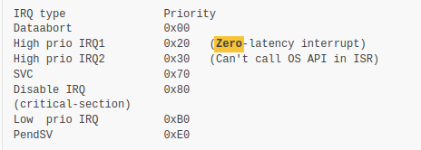
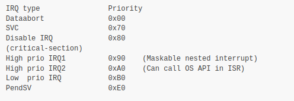

# ARM Cortex-M Series Interrupt Nesting

\[ English | [简体中文](../../../../zh-cn/device_dev_guide/kernel/scheduling_interrupts/ARM_Cortex-M_Series_Interrupt_Nesting.md) \]

## I. Introduction

This document introduces the support for interrupt nesting in the ARM Cortex-M series within the openvela system, as well as considerations for supporting interrupt nesting during new platform porting. Key points that system developers need to pay special attention to when implementing interrupt handling are also elaborated in this document.

## II. ARM Cortex-M Series Interrupt Nesting Modes

### 1. Zero-Latency High-Priority Interrupt Nesting

The system supports zero-latency interrupt nesting in the following two cases:

- No interrupt stack, only process stack.

    - Interrupt nesting is supported by default.
    - Both normal operation and interrupt/exception triggering use the current process stack pointed to by the MSP (Main Stack Pointer).
    - Note: This mode may require configuring a larger process stack.

- With interrupt stack.

    - Requires configuring `CONFIG_ARCH_INTERRUPTSTACK` (for details, refer to [CONFIG Configuration](#1-config-configuration)).
    - Handler mode (entered when an interrupt/exception is triggered): The hardware automatically switches to MSP. After system initialization, MSP always points to the interrupt stack, and interrupt/exception handling runs on the interrupt stack.
    - Thread mode (entered during normal process execution): Uses PSP (Process Stack Pointer). After system initialization, PSP always points to the current process stack, and process execution runs on the process stack.
    - After system reset (Reset):
        - The system is in Thread mode, privileged level. The hardware uses MSP by default, which points to `IDLE_STACK` in the `_vectors` table (for details, refer to [System Initialization](#2-system-initialization)).
        - During system initialization, MSP and PSP are adjusted: MSP points to the top of the interrupt stack, and PSP points to the current position of the IDLE process stack.

#### Zero-Latency Interrupt Priority Arrangement

The priority arrangement of zero-latency interrupts is as shown in the following figure:



Notes:

- System API call restrictions: In zero-latency interrupts, system APIs cannot be called in the ISR (Interrupt Service Routine), but high-priority interrupts can achieve zero latency.

- Special handling method: Although system APIs cannot be called, special handling can be completed by triggering the registered PendSV (Pendable Service Call) callback.

```C
# Register pendsv during initialization
irq_attach(NVIC_IRQ_PENDSV, pendsv_callback, NULL);
up_enable_irq(NVIC_IRQ_PENDSV);
# Trigger/clear pendsv when needed
up_trigger_irq(NVIC_IRQ_PENDSV, 0);
```

> **Note**: Since context switching also triggers PendSV, it is necessary to determine in the PendSV's ISR whether it is triggered by the system or by the ISR itself.

### 2. Maskable Interrupt Nesting

The ARM Cortex-M series supports the BASEPRI (Base Priority Register) function, which is used to disable interrupts below a certain priority. This function enables **maskable nested interrupts**.

#### Feature Description

- Maskable nested interrupts follow the system's interrupt masking mechanism.
- After setting the `BASEPRI` register to a specific threshold, all interrupts with a priority lower than or equal to this value will be masked.
- High-priority interrupts (such as non-maskable interrupts or zero-latency interrupts) are not affected by masking.

#### Maskable Interrupt Priority Arrangement

The priority arrangement of maskable interrupts is as shown in the following figure:



Notes:

- In maskable interrupts, system APIs can be called in the ISR, but they will be affected by interrupt disabling.

## III. Considerations for New Platform Porting

### 1. CONFIG Configuration

- No interrupt stack configured: If no interrupt stack is configured, the process stack supports interrupt nesting by default, requiring no additional configuration.
- Interrupt stack configured: If an interrupt stack is configured (`CONFIG_ARCH_INTERRUPTSTACK=xxxx`), interrupt nesting is not supported by default.

### 2. System Initialization

The system defaults to a configured `_vectors` table. If there are no special requirements, use the `_vectors` table initialized by the system. The default configuration includes the following:

1. Idle process stack: `IDLE_STACK`.
2. Reset entry: `__start`.
3. General interrupt handling subsystem entry: `exception_common`.
4. Interrupt entry with fewer contexts and support for nesting: `exception_direct`.

The following is sample code for the `_vectors` table:

```C
const void * const _vectors[] locate_data(".vectors") =
{
/* Initial stack */

IDLE_STACK,

/* Reset exception handler */

__start,

/* Vectors 2 - n point directly at the generic handler */
[2 ... NVIC_IRQ_PENDSV] = &exception_common,
[(NVIC_IRQ_PENDSV + 1) ... (15 + XXXX_PERIPHERAL_INTERRUPTS)]
= &exception_direct
};
```

### 3. New Platform Porting Requirements

#### Case Where Interrupt Stack Is Not Enabled

When the interrupt stack is not enabled, new platform porting needs to meet the following requirements:

1. State after hardware reset:

    - `CONTROL.SELSP = 0`, using MSP by default, pointing to `IDLE_STACK`.
    - The system is in Thread mode, privileged level.

2. Reset entry implementation:

    - When implementing the Reset entry `__start` in vendor code, the above state should be maintained.
    - Use MSP throughout system operation; do not use PSP (Process Stack Pointer).

#### Case Where Interrupt Stack Is Enabled

When the interrupt stack is enabled, new platform porting needs to meet the following requirements:

1. State after hardware reset:

    - `CONTROL.SELSP = 0`, using MSP by default, pointing to `IDLE_STACK`.
    - The system is in Thread mode, privileged level.

2. Reset entry implementation:

    - When implementing the Reset entry `__start` in vendor code, the above state should be maintained.
    - During system initialization, `arm_initialize_stack` is called to switch stacks:

        - MSP points to the top of the interrupt stack.
        - PSP points to the current position of the `IDLE` process stack.
        - Set `CONTROL.SELSP = 1` to enable PSP.
        - ARMv8-M also requires setting PSPLIM and MSPLIM.

3. Case with OTA support: If OTA is supported, there may be multiple firmwares (such as `boot`, `ota`, `ap`, etc.). When `boot` jumps to `ap` for execution, pay attention to the following:

    - State before jumping:

        - `CONTROL.SELSP = 1`, using PSP pointing to the `boot` process stack.
        - MSP points to the `boot` interrupt stack.

    - Requirements for jumping to `ap`:

        - Correctly set the stack pointer register to ensure the current stack pointer points to the `ap`'s `IDLE` process stack.
        - The following are two common cases:
            - `CONTROL.SELSP = 1`: Use PSP pointing to the `ap`'s `IDLE` stack. (ARMv8-M also requires setting PSPLIM).
            - `CONTROL.SELSP = 0`: Use MSP pointing to the `ap`'s `IDLE` stack. (ARMv8-M also requires setting MSPLIM).

    - Notes on Reset entry implementation:

        - Note that entering `__start` may not be in a hardware reset state, requiring additional handling.

### 4. Interrupt Priority Settings

#### BASEPRI Support

- ARMv6-M: Does not support BASEPRI (Base Priority Register), only supports NMI (Non-Maskable Interrupt).
- ARMv7-M and ARMv8-M: Support BASEPRI, allowing configuration of interrupts with different priorities as needed.

#### Interrupt Priority Configuration Example

The following is a sample code for configuring high-priority interrupts via `Makefile`:

```Makefile
# Configure support for high-priority interrupts
CONFIG_ARCH_HIPRI_INTERRUPT=y

# ARMV7-M
# Default configuration when CONFIG_ARCH_HIPRI_INTERRUPT is configured
# Dependent configurations: CONFIG_ARCH_CORTEXM3, CONFIG_ARCH_CORTEXM4, CONFIG_ARCH_CORTEXM7
CONFIG_ARMV7M_USEBASEPRI=y

# ARMV8-M
# Default configuration when CONFIG_ARCH_HIPRI_INTERRUPT is configured
CONFIG_ARMV8M_USEBASEPRI=y
```
