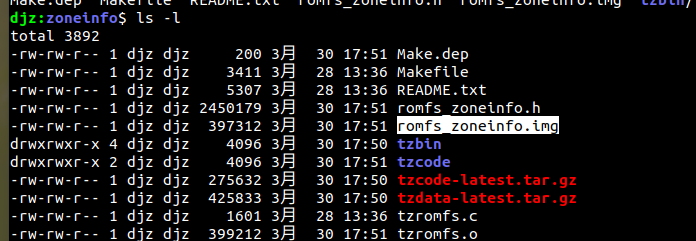

# Time System  

\[ English | [简体中文](../../../zh-cn/device_dev_guide/kernel/time_system.md) \] 

## I. Introduction  

This document provides an overview of the time system, including key time concepts, time types, APIs, and commands for managing time and time zones.  


## II. Preliminary Concepts  

### 1. Coordinated Universal Time (UTC)  

- **Definition**: UTC is the global standard time reference.  
- **Relationship with Beijing Time (CST)**: Beijing Time is **8 hours** ahead of UTC (**UTC+8**).  


### 2. Calendar Time  

- **Definition**: Calendar time is a relative time representation, expressed as the number of seconds elapsed from a standard reference point to the current moment.  
- **Key Features**:  
  - **Uniformity**: The calendar time for the same moment is consistent across all time zones relative to the same reference point.  
  - **Reference Point**: Typically based on **UTC 1970-01-01 00:00:00**(Unix epoch).  
  - **Representation**: Stored as a timestamp in seconds, widely used in computer systems.  


## III. Implementation of `localtime` in openvela  

### Two Implementation Modes  

- **When `CONFIG_LIBC_LOCALTIME` is enabled**:  
  - `localtime` relies on `zoneinfo` to convert time correctly based on the time zone.  
  - Advantages: Supports time zone conversion for complete functionality.  
  - Disadvantages: Increases code size by approximately **6.4KB**.  

      

- **When `CONFIG_LIBC_LOCALTIME` is disabled**:  
  - `localtime` behaves the same as `gmtime`, returning UTC time without time zone conversion.  
  - Advantages: Saves space with no extra overhead.  
  - Disadvantages: Does not support time zone conversion.  


## IV. Time Zone Setup  

### `tzset` Function  

- Obtains time zone information from the environment variable `TZ` and initializes:  
  - `timezone`: Offset (in seconds) of the current time zone from UTC.  
  - `daylight`: Indicates if daylight saving time is enabled (non-zero value means enabled).  


### 1. Format of `TZ` Environment Variable  

#### String Format  

The `TZ` environment variable supports the following format:  

```bash
std offset[dst[offset][,start[/time],end[/time]]]
```  

**Parameter Description**:  
1. `std`
     - Indicates a time zone abbreviation, consisting of three or more characters. For example:
     - CST (China Standard Time).
     - EST (Eastern Standard Time).  
2. offset 
     - Offset from UTC
     - formatted as `±hh:mm:ss`,(e.g., `+8:00:00` for UTC+8).  
3. dst (optional)
     - Daylight saving time (DST) abbreviation.  
4. offset (optional)
     - DST offset from UTC.
     - defaults to +1 hour if omitted.  
5. start[/time], end[/time] (optional)
    Indicates the start and end rules of daylight saving time
     - formatted as `M<month>.<week>.<day>` 
         - `M10.1.0` for the first Sunday in October.  
         - `M3.3.0` for the third Sunday in March.
    - `/time` indicates the specific time (optional).


#### File Path Format  

The `TZ` environment variable can specify time zone information via a file path:  
1. Path formats:  
    - `Asia/Shanghai`: Relative path (uses the system time zone directory specified by `CONFIG_LIBC_TZDIR`).  
    - `/Asia/Shanghai`: Absolute path，Indicates the full path to the file in the specified time zone
    - `:Asia/Shanghai`: Supports both absolute paths and relative paths in the system time zone directory.  
2. Parsing rule: After locating the time zone file, it is parsed in `tzfile` format to load time zone information.  


### 2. `zoneinfo` Creation and Mounting Guide  

#### `zoneinfo` Creation Process  

1. `tzfile` format
 `zoneinfo` uses the `tzfile` format; see [tzfile documentation](https://man7.org/linux/man-pages/man5/tzfile.5.html) for details.  
2. Database download
 Obtain the latest time zone data from the [Time Zone Database](https://www.iana.org/time-zones).  
3. Generate `tzbin` directory
 Use the downloaded data to create a `tzbin` directory containing `zoneinfo` files (as shown below).  

      

4. Create `romfs` file
 - Package the `tzbin` directory into a `romfs` image using the Linux tool `genromfs`
 - The image file can be mounted on the device for use by the program  


#### Mounting Methods for Simulators and Boards  

##### Mounting in Simulator (sim)  

1. Create a RAM disk.
   ```bash
   mkrd -m 10 -s 512 102400
   ```  
   - `-m 10`: Specifies RAM device number `/dev/ram10`.  
   - `-s 512`: Sets block size to 512 bytes.  
   - `102400`: Sets disk size to 102400 blocks.  

2. **Mount the `hostfs` file system**
     - Store the romfs.img file in the current directory and mount it:

    ```bash
    mount -t hostfs fs=. /data
    ```  
 

3. **Write `romfs.img` to the RAM disk**
   ```bash
   dd if=/data/romfs.img of=/dev/ram10
   ```  

4. **Mount the `romfs` file system**  
   ```bash
   mount -t romfs /dev/ram10
   ```  


##### Mounting on Hardware Boards  

1. Locate the file partition start address
- Burn the `romfs` image to the corresponding physical partition using a download tool.  
2. Mount the partition
- Access time zone files after mounting.  


#### `zoneinfo` Creation Tools  

1. Automatic generation 
   - The `Makefile` in `libs/libc/zoneinfo/` can automatically download the time zone database and package it into a `romfs` image (corresponding to the `config` below).  

       

   - Running the `Makefile` generates `romfs_zoneinfo.img`.  

       

2. Mount the generated image 
   - Mounting in the simulator  
   ```bash
   mkrd -m 10 -s 512 800  
   dd if=data/romfs_zoneinfo.img of=/dev/ram10  
   mount -t romfs /dev/ram10 zoneinfo
   ```  


#### **Specify `zoneinfo` Location**  

To specify the `zoneinfo` location, set the macro:  
```makefile
CONFIG_LIBC_TZDIR=/zoneinfo
```  


### 3. Methods to Set Time Zones  

#### Set Time Zone via Startup Script

In the `rcS` startup script, set environment variables (take effect after calling `tzset`):  
```bash
# Set to Shanghai time zone  
set TZ Asia/Shanghai  

# China Standard Time (no DST)  
set TZ CST+08:00:00  

# Set to Auckland time zone  
set TZ :Pacific/Auckland  

# Set to Chatham time zone  
set TZ :Pacific/Chatham  

# New Zealand Standard Time and DST  
set TZ "NZST-12:00:00NZDT-13:00:00,M10.1.0,M3.3.0"
```  


#### Dynamically Set Time Zone in Code  

1. Call `setenv` to set the `TZ` environment variable (each task has independent environment variables, allowing different time zones).  
2. Call `tzset` to synchronize time zone information.  


#### Set Time Zone via Command Line  

Use command-line tools:  
```bash
# Set to Tokyo time zone  
timedatectl set-timezone Asia/Tokyo
```  


## V. Multi-Core Time Zone Setup  

In multi-core systems, openvela recommends:  
1. **UI core**: Responsible for setting time zone information for local time display.  
2. **Other cores**: Always use UTC time to avoid time zone setup.  

**Rationale**:  
- `tzset` is independent per core and cannot be synchronized automatically.  
- To maintain consistent time zones across cores, each core must call `tzset` individually.  

**Recommendations**:  
- Except for the UI core, other cores should avoid using `localtime` and use UTC (`gmtime`) instead.  
- Logging in multi-core systems should use UTC for consistency.  

**Special Cases**:  

- If a multi-core needs access to the `zoneinfo` file:
     - When the resource is stored in the eMMC, other cores need to go through `rpmsgfs` to access the `tzfile` information.

## VI. Time Types  

### `time_t`  
- **Description**: Stores the number of seconds since 1970-01-01 00:00:00.  
- **Implementation**: In openvela, `time_t` is implemented as `uint32_t` or `int64_t`.  


### `struct timeval`  
- Description: Provides seconds and microseconds with microsecond precision.  
- Structure:  
  ```c
  struct timeval {
    time_t tv_sec;  // Seconds since 1970-01-01 00:00:00  
    long tv_usec;   // Microseconds  
  };
  ```  


### `struct timespec`  
- Description: Provides seconds and nanoseconds with nanosecond precision.  
- Structure:  
  ```c
  struct timespec {
    time_t tv_sec;  
    long   tv_nsec; 
  };
  ```  


### `struct tm`  
- Description: Provides detailed date and time information.  
- Structure:  
  ```c
  struct tm {
    int  tm_sec;         /* Seconds (0-61, allows leap seconds) */
    int  tm_min;         /* Minutes (0-59) */
    int  tm_hour;        /* Hours (0-23) */
    int  tm_mday;        /* Day of month (1-31) */
    int  tm_mon;         /* Month (0-11) */
    int  tm_year;        /* Years since 1900 */
    int  tm_wday;        /* Day of week (0-6) */
    int  tm_yday;        /* Day of year (0-365) */
    int  tm_isdst;       /* Non-0 if DST is active */
    long tm_gmtoff;      /* Offset from UTC in seconds */
    const char *tm_zone; /* Timezone abbreviation */
  };
  ```  


## VII. Time APIs  

### 1. Common Time APIs  

#### `time_t time(FAR time_t *timep)`  
- Description: Gets or sets the current calendar time.  
- Parameters: Pointer to store calendar time (if `NULL`, returns the current time).  
- Return Value: Current calendar time as `time_t`.  
- Example:  
  ```c
  time_t current_time;  
  current_time = time(NULL); // Get current calendar time  
  printf("Current time: %ld\n", current_time);
  ```  


#### `int clock_gettime(clockid_t clockid, FAR struct timespec *tp)`  
- Description: Gets the current time of a specified clock.  
- Parameters:  
  - `clockid`: Clock to query (e.g., `CLOCK_REALTIME`, `CLOCK_MONOTONIC`).  
  - `tp`: Pointer to `struct timespec` for storing the result.  
- Return Value: `0` on success, `-1` on error.  
- Example:  
  ```c
  struct timespec ts;  
  clock_gettime(CLOCK_REALTIME, &ts);  
  printf("Seconds: %ld, Nanoseconds: %ld\n", ts.tv_sec, ts.tv_nsec);
  ```  


#### `int clock_settime(clockid_t clock_id, FAR const struct timespec *tp)`  
- Description: Set the time of the specified clock. When `clockid` is `CLOCK_REALTIME`, it is used to set the UTC time.


#### `int clock_getres(clockid_t clk_id, struct timespec *res)`  
- It is used to obtain clock accuracy, with the highest accuracy being nanoseconds 


### 2. Time Conversion APIs  

1. `time_t timegm(FAR struct tm *tmp)`  
   - Converts `struct tm` to seconds since `1970-01-01 00:00:00` (UTC).  

2. `FAR struct tm *gmtime(FAR const time_t *timep)`  
   - Convert the number of seconds from `1970-01-01 00:00:00` to the present to the time in `struct tm` format, and is represented by UTC time.  
   - Note: `gmtime_r` is the thread-safe version.  

3. `time_t mktime(FAR struct tm *tp)`  
   - Converts `struct tm` to seconds based on the local time zone.  

4. `FAR struct tm *localtime(FAR const time_t *timep)`  
   - Converts seconds since `1970-01-01 00:00:00` to `struct tm` in the local time zone.  
   - Note: `localtime_r` is the thread-safe version.  

5. `FAR char *asctime(FAR const struct tm *tp)`  
   - Formats date and time as a string.  
   - Note: `asctime_r` is the thread-safe version.  

6. `size_t strftime(FAR char *s, size_t max, FAR const char *format, FAR const struct tm *tm)`  
   - Formatting the data in the `struct tm` into the string `s` according to the given `format`, up to a maximum of `max` characters

7. `FAR char *strptime(FAR const char *s, FAR const char *format, FAR struct tm *tm)`  
   - Parses string `s` into `struct tm` based on `format`.  

8. `FAR char *ctime(FAR const time_t *timep)`  
   - Returns a string representing `local time`.  
   - Note: `ctime_r` is the thread-safe version.  

9. `double difftime(time_t time2, time_t time1)`  
   - Returns the difference (in seconds) between two times.  


### 3. High-Precision Time APIs  

1. `int gettimeofday(FAR struct timeval *tv, FAR struct timezone *tz)`  
   - **Description**: Returns the current time with seconds and microseconds since `1970-01-01 00:00:00`.  
   - **Parameters**:  
     - `tv`: Pointer to `struct timeval` for seconds and microseconds.  
     - `tz`: Time zone info (usually `NULL`).  
   - **Example**:  
     ```c
     struct timeval tv;  
     gettimeofday(&tv, NULL);  
     printf("Seconds: %ld, Microseconds: %ld\n", tv.tv_sec, tv.tv_usec);
     ```  

2. `int settimeofday(FAR const struct timeval *tv, FAR struct timezone *tz)`  
   - Sets the system time (UTC).  

3. `int clock_systime_timespec(FAR struct timespec *ts)`  
   - Gets the system up time (kernel-level API).  


## VIII. Command Reference  

### 1. View System Uptime  
```bash
ap> uptime
14:11:37 up 3 days, 16:49, load average: 0.07, 0.07, 0.07
```  


### 2. Set Time Zone  
```bash
ap> timedatectl set-timezone Asia/Tokyo
```  


### 3. Set System Time  
```bash
ap> date -s "May 11 11:11:21 2022"
```  


### 4. View Local Time 
By default, local time is displayed, and UTC is displayed when there is no time zone. 
```bash
ap> date
Wed, Oct 22 14:11:54 2104  # Displays localtime (UTC if no time zone)
```  


### 5. View UTC Time  
```bash
ap> date -u
Wed, Oct 22 14:13:21 2104  # UTC time
```  


### 6. View Time and Time Zone Info  
```bash
ap> timedatectl
      TimeZone: CST, 28800
    Local time: Mon, Oct 17 16:23:46 2022 CST
 Universal time: Mon, Oct 17 08:23:46 2022 UTC
      RTC time: Mon, Oct 17 08:23:47 2022
```