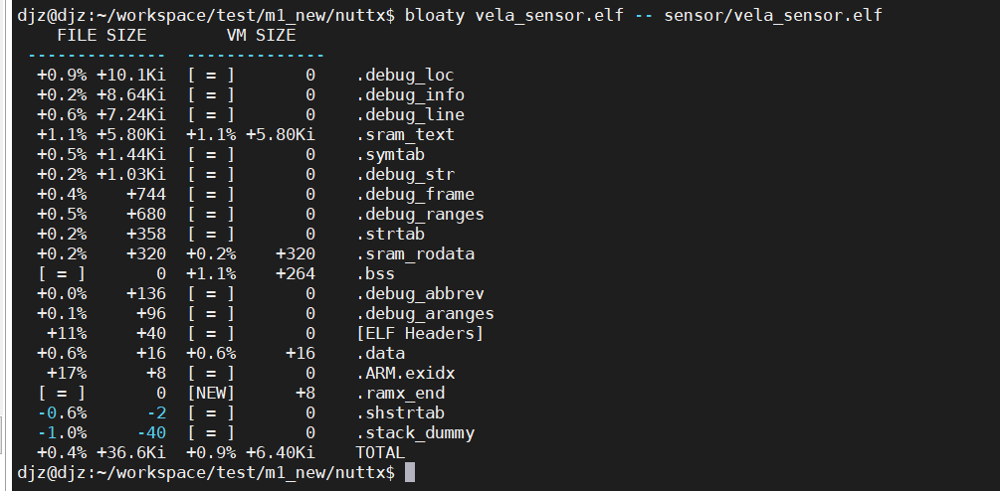
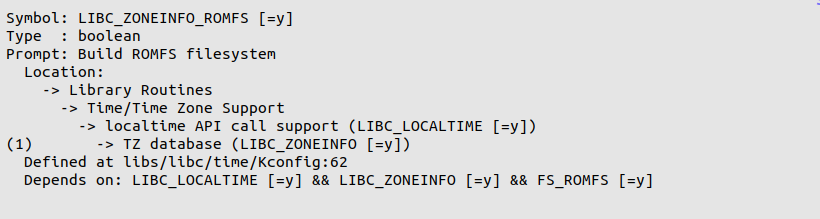

# Time System  

\[ English | [简体中文](../../../zh-cn/device_dev_guide/kernel/time_system.md) \] 

## I. Overview  

This document provides an overview of the time system, including key time concepts, data types, APIs, and commands for managing time and timezones.

## II. Prerequisite Concepts

### 1. Coordinated Universal Time (UTC)

- **Definition**: UTC is the primary time standard by which the world regulates clocks and time.
- **Relationship with China Standard Time (CST)**: CST is 8 hours ahead of UTC, denoted as UTC+8. 

### 2. Calendar Time  

- **Definition**: Calendar Time is a relative time value, representing the number of seconds that have elapsed since a standard reference point.
- **Characteristics**:

    - **Uniformity**: At any given moment, the Calendar Time is consistent across all timezones relative to the same reference point.
    - **Reference Point**: The standard reference point is typically 00:00:00 UTC on January 1, 1970 (also known as the Unix Epoch).
    - **Representation**: It is represented as a number of seconds and is commonly used in computer systems as a timestamp.

## III. `localtime` Implementation in openvela

### Two Implementation Methods

- **With `CONFIG_LIBC_LOCALTIME` enabled**:

    - The `localtime` implementation depends on `zoneinfo` data to correctly convert time based on the timezone.
    - **Advantage**: Supports timezone conversions, providing more complete functionality.
    - **Disadvantage**: Increases the code size by **approximately 6.4 KB**.

      

- **Without `CONFIG_LIBC_LOCALTIME` enabled**:

    - `localtime` and `gmtime` have the same effect; they both return UTC time without performing any timezone conversion.
    - **Advantage**: Saves space with no additional overhead.
    - **Disadvantage**: Does not support timezone conversions.

## IV. Setting the Timezone

**`tzset` Function**

This function retrieves timezone information from the `TZ` environment variable and initializes the following global variables:

- `timezone`: The offset of the current timezone from UTC in seconds.
- `daylight`: A non-zero value indicates that Daylight Saving Time (DST) rules apply. 

### 1. TZ Environment Variable Format

#### String Format  

The `TZ` environment variable supports the following format:

```bash
std offset[dst[offset][,start[/time],end[/time]]]
```  

**Parameter Descriptions**:  

1. **std**

    Represents the standard timezone abbreviation, consisting of three or more characters. For example:

    - `CST`: China Standard Time
    - `EST`: Eastern Standard Time

2. **offset**

    - The offset of the standard timezone from UTC.
    - The format is `±hh:mm:ss`. For example, `+8:00:00` represents UTC+8.

3. **dst** (optional)

    Represents the Daylight Saving Time timezone abbreviation.

4. **offset** (optional)

    - The offset of the DST timezone from UTC.
    - If omitted, it defaults to one hour ahead of the standard time.

5. **start[/time],end[/time]** (optional)

    Defines the rules for the start and end of DST:

    - The format is `M<month>.<week>.<day>`:
        - `M10.1.0`: The first Sunday of October.
        - `M3.3.0`: The third Sunday of March.
    - `/time` specifies the exact time of the change (optional).

#### File Path Format  

The `TZ` environment variable also supports specifying timezone information via a file path in the following formats:

1. **Path Formats**:

    - `Asia/Shanghai`: A relative path to a file in the system timezone directory (specified by `CONFIG_LIBC_TZDIR`).
    - `/Asia/Shanghai`: An absolute path directly specifying the full path to the timezone file.
    - `:Asia/Shanghai`: Allows resolution using either an absolute path or a relative path within the system timezone directory.

2. **Parsing Rule**: Once the timezone file is located, its content is parsed according to the `tzfile` format to load the corresponding timezone information.

### 2. Creating and Mounting `zoneinfo` Data

#### `zoneinfo` Creation Process  

1. **`tzfile` Format**

    `zoneinfo` files use the `tzfile` format to store timezone information. For details, refer to the [tzfile documentation](https://man7.org/linux/man-pages/man5/tzfile.5.html).

2. **Database Download**

    Download the latest timezone data from the [Time Zone Database](https://www.iana.org/time-zones).

3. **Generate `tzbin` Directory**

    Use the downloaded timezone data to generate a `tzbin` directory containing the `zoneinfo` files, as shown below:

    

4. **Generate `romfs` File**

    - Use the Linux tool `genromfs` to package the `tzbin` directory into a `romfs` image file.
    - This image file can be mounted on the device for programs to use.

#### Mounting on a Simulator and a Board

##### Mounting in Simulator (sim)  

1. **Create a RAM Disk**

    ```bash
    mkrd -m 10 -s 512 102400
    ```  

    - `-m 10`: Specifies RAM device number `/dev/ram10`.  
    - `-s 512`: Sets block size to 512 bytes.  
    - `102400`: Sets disk size to 102400 blocks.  

2. **Mount the `hostfs` file system**

    Store the romfs.img file in the current directory and mount it:

    ```bash
    mount -t hostfs fs=. /data
    ```  

3. **Write `romfs.img` to the RAM disk**

    ```bash
    dd if=/data/romfs.img of=/dev/ram10
    ```  

4. **Mount the `romfs` file system**  

    ```bash
    mount -t romfs /dev/ram10
    ```

##### Mounting on a Board

1. **Find the File Partition Start Address**

    - Use a flashing tool to write the `romfs` image file to the corresponding physical partition address.

2. **Mount the Partition**

    - The timezone files can be used after the partition is mounted.

#### `zoneinfo` Creation Tools  

1. **Automatic Generation**

    - The `Makefile` in the `libs/libc/zoneinfo/` directory can automatically download the timezone database and package it into a `romfs` image file. The corresponding configuration is shown below:

        

    - After running the `Makefile`, a `romfs_zoneinfo.img` file is generated.

2. **Mount the Generated Image File**

    To mount in the simulator:

    ```bash
    mkrd -m 10 -s 512 800  
    dd if=data/romfs_zoneinfo.img of=/dev/ram10  
    mount -t romfs /dev/ram10 zoneinfo
    ```  

#### Specifying the `zoneinfo` File Location

To specify a custom location for `zoneinfo` files, set the following macro:

```makefile
CONFIG_LIBC_TZDIR=/zoneinfo
```  

### 3. Methods for Setting the Timezone

#### Setting via Startup Script

Set the environment variable in the `rcS` startup script (takes effect after `tzset` is called):

```bash
# Set to Shanghai time zone  
set TZ Asia/Shanghai  

# China Standard Time (no DST)  
set TZ CST+08:00:00  

# Set to Auckland time zone  
set TZ :Pacific/Auckland  

# Set to Chatham time zone  
set TZ :Pacific/Chatham  

# New Zealand Standard Time and DST  
set TZ "NZST-12:00:00NZDT-13:00:00,M10.1.0,M3.3.0"
```  

#### Setting Dynamically

Set the timezone dynamically in code:

1. Call `setenv`: Sets the `TZ` environment variable.

    Each task has its own independent environment variables and can therefore hold different timezone information.

2. Call `tzset`: Synchronizes the timezone information.

#### Setting from the Command Line

Use a command-line tool to set the timezone:

```bash
# Set to Tokyo time zone  
timedatectl set-timezone Asia/Tokyo
```  

## V. Multi-Core Time Zone Setup  

In a multi-core system, openvela recommends the following approach:

1. **UI Core**: The core responsible for the UI display should handle timezone settings for local time display.
2. **Other Cores**: Should always use UTC time and avoid setting a timezone.

**Reasoning:**

- `tzset` is independent for each core and cannot be automatically synchronized.
- If multiple cores need to maintain the same timezone, `tzset` must be called individually on each core.

**Recommendations:**

- Except for the UI core, other cores should avoid using `localtime` and use UTC time (`gmtime`) exclusively.
- Logs in a multi-core system should consistently use UTC time.

**Special Case:**

- If multiple cores need to access `zoneinfo` files:

    - When resources are stored on eMMC, other cores may need to use `rpmsgfs` to access `tzfile` information.

## VI. Time Data Types

**`time_t`**

- **Description**: Stores the number of seconds that have elapsed since 00:00:00 on January 1, 1970.
- **Implementation**: In openvela, `time_t` is implemented as `uint32_t` or `int64_t`.

**`struct timeval`**

- **Description**: Provides time in seconds and microseconds, with microsecond precision.
- **Structure**:

    ```c
    struct timeval {
        time_t tv_sec;  // Seconds since 1970-01-01 00:00:00  
        long tv_usec;   // Microseconds  
    };
    ```  

**`struct timespec`**

- **Description**: Provides time in seconds and nanoseconds, with nanosecond precision.
- **Structure**:

    ```c
    struct timespec {
        time_t tv_sec;  
        long   tv_nsec; 
    };
    ```

**`struct tm`**

- **Description**: Provides a detailed breakdown of date and time information.
- **Structure**:

    ```c
    struct tm {
        int  tm_sec;         /* Seconds (0-61, allows leap seconds) */
        int  tm_min;         /* Minutes (0-59) */
        int  tm_hour;        /* Hours (0-23) */
        int  tm_mday;        /* Day of month (1-31) */
        int  tm_mon;         /* Month (0-11) */
        int  tm_year;        /* Years since 1900 */
        int  tm_wday;        /* Day of week (0-6) */
        int  tm_yday;        /* Day of year (0-365) */
        int  tm_isdst;       /* Non-0 if DST is active */
        long tm_gmtoff;      /* Offset from UTC in seconds */
        const char *tm_zone; /* Timezone abbreviation */
    };
    ```  

## VII. Time APIs  

### 1. Common Time APIs  

`time_t time(FAR time_t *timep)`

- **Description**: Gets or sets the current calendar time.
- **Parameters**: A pointer to a `time_t` variable to store the calendar time. If `NULL`, the function returns the current calendar time.
- **Return Value**: Returns the current calendar time as a `time_t` value.
- **Example**:

    ```c
    time_t current_time;  
    current_time = time(NULL); // Get current calendar time  
    printf("Current time: %ld\n", current_time);
    ```  

`int clock_gettime(clockid_t clockid, FAR struct timespec *tp)`  

- **Description**: Gets the current time of a specified clock.
- **Parameters**:

    - `clockid`: The clock to query. Common values are `CLOCK_REALTIME` and `CLOCK_MONOTONIC`.
    - `tp`: A pointer to a `struct timespec` to store the retrieved time.

- **Return Value**: Returns `0` on success, or `-1` on failure.
- **Example**:

    ```c
    struct timespec ts;  
    clock_gettime(CLOCK_REALTIME, &ts);  
    printf("Seconds: %ld, Nanoseconds: %ld\n", ts.tv_sec, ts.tv_nsec);
    ```

`int clock_settime(clockid_t clock_id, FAR const struct timespec *tp)`

- **Description**: Sets the time of a specified clock. When `clockid` is `CLOCK_REALTIME`, it is used to set the system's UTC time.

`int clock_getres(clockid_t clk_id, struct timespec *res)`

- **Description**: Gets the resolution (precision) of a clock, which can be as high as nanoseconds.

### 2. Time Conversion APIs  

1. `time_t timegm(FAR struct tm *tmp)`

    - **Description**: Converts a `struct tm` into the number of seconds since `1970-01-01 00:00:00` (UTC).

2. `FAR struct tm *gmtime(FAR const time_t *timep)`

    - **Description**: Converts the number of seconds since the epoch into a `struct tm` format, represented in UTC.
    - **Note**: `gmtime_r` is the thread-safe version.

3. `time_t mktime(FAR struct tm *tp)`

    - **Description**: Converts a `struct tm` into the number of seconds based on the local timezone.

4. `FAR struct tm *localtime(FAR const time_t *timep)`

    - **Description**: Converts the number of seconds since the epoch into a `struct tm` format, represented in the local timezone.
    - **Note**: `localtime_r` is the thread-safe version.

5. `FAR char *asctime(FAR const struct tm *tp)`

    - **Description**: Formats a date and time into a string and returns it.
    - **Note**: `asctime_r` is the thread-safe version.

6. `size_t strftime(FAR char *s, size_t max, FAR const char *format, FAR const struct tm *tm)`

    - **Description**: Formats the data in a `struct tm` into a string `s` according to the `format` string, with a maximum length of `max`.

7. `FAR char *strptime(FAR const char *s, FAR const char *format, FAR struct tm *tm)`

    - **Description**: Parses the string `s` according to the `format` string and initializes a `struct tm`.

8. `FAR char *ctime(FAR const time_t *timep)`

    - **Description**: Returns a string representing the local time (`localtime`).
    - **Note**: `ctime_r` is the thread-safe version.

9. `double difftime(time_t time2, time_t time1)`

    - **Description**: Returns the difference between two times in seconds.

### 3. High-Precision Time APIs  

1. `int gettimeofday(FAR struct timeval *tv, FAR struct timezone *tz)`

    - **Description**: Returns the current time, including the number of seconds and microseconds since `1970-01-01 00:00:00`.

    - **Parameters**:

        - `tv`: A pointer to a `struct timeval` to store the seconds and microseconds.
        - `tz`: Timezone information, usually passed as `NULL`.

    - **Example**:

        ```C
        struct timeval tv;  
        gettimeofday(&tv, NULL);  
        printf("Seconds: %ld, Microseconds: %ld\n", tv.tv_sec, tv.tv_usec);
        ```

2. `int settimeofday(FAR const struct timeval *tv, FAR struct timezone *tz)`

    - **Description**: Sets the system time (UTC).

3. `int clock_systime_timespec(FAR struct timespec *ts)`

    - **Description**: Gets the system's monotonic running time (a kernel-level API).

## VIII. Command Reference  

### 1. View System Uptime  

```bash
ap> uptime
14:11:37 up 3 days, 16:49, load average: 0.07, 0.07, 0.07
```  

### 2. Set Timezone  

```bash
ap> timedatectl set-timezone Asia/Tokyo
```  

### 3. Set Time  

```bash
ap> date -s "May 11 11:11:21 2022"
```  

### 4. View Local Time

By default, local time is displayed, and UTC is displayed when there is no time zone. 

```bash
ap> date
Wed, Oct 22 14:11:54 2104  # Displays localtime (UTC if no time zone)
```  

### 5. View UTC Time  

```bash
ap> date -u
Wed, Oct 22 14:13:21 2104  # UTC time
```  

### 6. View Time and Timezone Information

```bash
ap> timedatectl
      TimeZone: CST, 28800
    Local time: Mon, Oct 17 16:23:46 2022 CST
 Universal time: Mon, Oct 17 08:23:46 2022 UTC
      RTC time: Mon, Oct 17 08:23:47 2022
```
