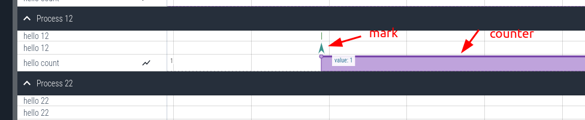
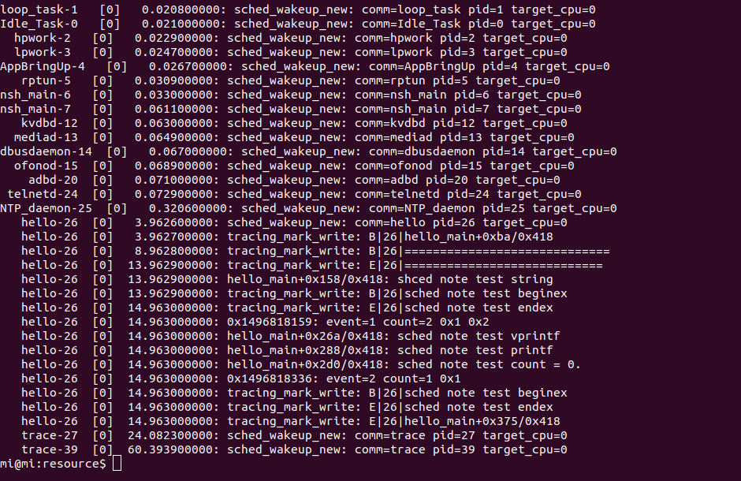

# Trace System

\[ English | [简体中文](../../../zh-cn/device_dev_guide/kernel/trace_system.md) \] 

## I. Introduction to Trace

Trace is a tool used to track and record system activities. It can capture the detailed behavior of the `Kernel`, `Kernel Extension`, and `User Program`, especially the following events:

- `System Call`
- `Kernel Service`
- `Interrupt Handlers`
- `Context Switch` 

Trace records events with microsecond precision and arranges them in chronological order, providing an accurate system operation log.

### 1. Core Principles

The Trace system collects event data by instrumenting key points in the system's execution. For example:

- `sched_note_start` is called when a task starts.
- `sched_note_irqhandle` is called within an interrupt function.

### 2. Supported Event Types

The Trace tool supports the tracking and recording of the following events:

1. Task execution, termination, and switching.
2. Entry and exit of system calls.
3. Entry and exit of interrupt handlers.
4. Events actively instrumented in the application code.

Additionally, the Trace tool can display the collected event data graphically, helping users to intuitively analyze system behavior.

## II. Configuration Instructions

During system compilation, you can configure the `Kernel Events` to be recorded or traced and optional `Channels` via `/drivers/note/Kconfig`.

### 1. Configure Kernel Events

The following are the `Kernel Events` that can be configured to record and trace key events in the system:

```Makefile
# General configuration for kernel instrumentation
CONFIG_SCHED_INSTRUMENTATION=y
# Enable task scheduling instrumentation, commonly used
SCHED_INSTRUMENTATION_SWITCH   
# Interrupt handling, commonly used
SCHED_INSTRUMENTATION_IRQHANDLER
# User-defined trace, commonly used
SCHED_INSTRUMENTATION_DUMP

# Scheduler locks
SCHED_INSTRUMENTATION_PREEMPTION
# Critical sections
SCHED_INSTRUMENTATION_CSECTION
# Spinlocks
SCHED_INSTRUMENTATION_SPINLOCKS
# System calls
SCHED_INSTRUMENTATION_SYSCALL
```

### 2. Configuration for Adding Custom Traces via API

To add custom traces using only the API, enable the following configuration options:

```Makefile
# The following configurations must be enabled. When adding custom traces using only the API, enable only these options.
CONFIG_SCHED_INSTRUMENTATION=y
CONFIG_SCHED_INSTRUMENTATION_FILTER_DEFAULT_MODE=0x3e
CONFIG_SCHED_INSTRUMENTATION_FILTER=y
CONFIG_SCHED_INSTRUMENTATION_DUMP=y
CONFIG_DRIVERS_NOTE=y
CONFIG_DRIVERS_NOTERAM=y
CONFIG_DRIVERS_NOTECTL=y
CONFIG_SYSTEM_TRACE=y
CONFIG_SYSTEM_TRACE_STACKSIZE=4096
CONFIG_ARCH_PERF_EVENTS=y
CONFIG_PERF_OVERFLOW_CORRECTION=y

# The default Trace Buffer size is 2K. It is recommended to adjust it to a larger value based on your needs, for example, 2M:
CONFIG_DRIVERS_NOTERAM_BUFSIZE=204800
```

##### Specify the Section for the Buffer

If necessary, you can specify the storage location for the Buffer:

```Makefile
# If necessary, you can specify the section for the buffer
CONFIG_DRIVERS_NOTERAM_SECTION=".bss.xxx"
```

##### Configuration to Increase Trace Data Volume

The following configuration options are optional. Enabling them will significantly increase the amount of trace data:

- Task switching

    ```Makefile
    CONFIG_SCHED_INSTRUMENTATION_SWITCH=y
    ```

- Interrupt handler entry/exit

    ```Makefile
    CONFIG_SCHED_INSTRUMENTATION_IRQHANDLER=y
    ```

##### Non-essential Configurations

The following configuration options are generally not recommended to be enabled:

- Scheduler locks

    ```Makefile
    # Scheduler locks
    SCHED_INSTRUMENTATION_PREEMPTION
    ```

- Critical sections

    ```Makefile
    # Critical sections
    SCHED_INSTRUMENTATION_CSECTION
    ```

- Spinlocks

    ```Makefile
    # Spinlocks
    SCHED_INSTRUMENTATION_SPINLOCKS
    ```

##### Other Configurations

- System call entry/exit

    To record the entry and exit of system calls, you can enable the following configuration:

    ```Makefile
    # Enable system call entry/exit
    CONFIG_SCHED_INSTRUMENTATION_SYSCALL=y
    ```

- Function Name Display Issues

    If function names are not displayed at runtime, enable the following configuration:

    ```Makefile
    # If function names are not displayed at runtime, enable the following configuration
    CONFIG_ALLSYMS=y
    ```

## III. Timestamping Precision Configuration

The system tracing tool obtains its clock source through the `perf_gettime` API. It can be configured with one of the following three clock sources. The first scheme is recommended:

### Scheme 1 (Recommended): Use Hardware PMU as the Clock Source

The hardware PMU provides high-precision (nanosecond-level) timing and supports handling time rollback issues.

```Bash
# Enable the hardware PMU clock source
CONFIG_ARCH_PERF_EVENTS=y
# Handle perf clock overflow; disabling this may cause time to roll back
CONFIG_PERF_OVERFLOW_CORRECTION=y
```

### Scheme 2: Use a Hardware Timer as the Clock Source

Using a hardware timer as the clock source provides a clock precision consistent with the `oneshot timer` and supports handling time rollback issues.

```Bash
# Disable the hardware PMU clock source and use a timer as the perf clock source
CONFIG_ARCH_PERF_EVENTS=n
```

### Scheme 3: Use the System Tick as the Clock Source

Disabling the following configurations will cause the system to default to using the system systick as the clock source. The clock precision will be consistent with the `CONFIG_USEC_PER_TICK` configuration, which is 10ms by default.

```Bash
# When all configurations are disabled, the system time is automatically used as the clock source
CONFIG_ALARM_ARCH=n
CONFIG_TIMER_ARCH=n
CONFIG_ARCH_PERF_EVENTS=n
```

## IV. Trace System Principles

The core principle of the Trace system is to instrument key points in the system's execution to collect runtime data. For example:

- `sched_note_start` is called when a task starts.
- `sched_note_irqhandle` is called within an interrupt function.


### 1. Data Collection and Dispatch

The Trace system collects system runtime data through instrumentation APIs and dispatches the data to different channels. Each channel can output to a different backend. Currently supported backends include:

- RAM
- Syslog
- RTT
- SysView
- RPMsg
- ITM

## V. API Usage Guide

### 1. Kernel Tracing Functions/Macros

The following APIs are used to add fixed instrumentation code within the kernel.

> **Note**: Normally, you do not need to call these APIs directly unless you have special requirements.

#### Task-related APIs

- Task start and stop

    ```C
    // Task start and stop, always enabled
    void sched_note_start(FAR struct tcb_s *tcb);
    void sched_note_stop(FAR struct tcb_s *tcb);
    ```

- Task scheduling (requires `CONFIG_SCHED_INSTRUMENTATION_SWITCH` to be enabled)

    ```C
    // Task scheduling, CONFIG_SCHED_INSTRUMENTATION_SWITCH
    void sched_note_suspend(FAR struct tcb_s *tcb);
    void sched_note_resume(FAR struct tcb_s *tcb);
    ```

- Multi-core task scheduling (requires `CONFIG_SMP` and `CONFIG_SCHED_INSTRUMENTATION_SWITCH` to be enabled)

    ```C
    // Multi-core task scheduling, CONFIG_SMP && CONFIG_SCHED_INSTRUMENTATION_SWITCH
    void sched_note_cpu_start(FAR struct tcb_s *tcb, int cpu);
    void sched_note_cpu_started(FAR struct tcb_s *tcb);
    void sched_note_cpu_pause(FAR struct tcb_s *tcb, int cpu);
    void sched_note_cpu_paused(FAR struct tcb_s *tcb);
    void sched_note_cpu_resume(FAR struct tcb_s *tcb, int cpu);
    void sched_note_cpu_resumed(FAR struct tcb_s *tcb);
    ```

#### Lock-related APIs

- Scheduler lock (requires `CONFIG_SCHED_INSTRUMENTATION_PREEMPTION` to be enabled)

    ```C
    // Scheduler lock, CONFIG_SCHED_INSTRUMENTATION_PREEMPTION
    void sched_note_premption(FAR struct tcb_s *tcb, bool locked);
    ```

- Critical section (requires `CONFIG_SCHED_INSTRUMENTATION_CSECTION` to be enabled)

    ```C
    // Critical section, CONFIG_SCHED_INSTRUMENTATION_CSECTION
    void sched_note_csection(FAR struct tcb_s *tcb, bool enter);
    ```

- Spinlock (requires `CONFIG_SCHED_INSTRUMENTATION_SPINLOCK` to be enabled)

    ```C
    // Spinlock, CONFIG_SCHED_INSTRUMENTATION_SPINLOCK
    void sched_note_spinlock(FAR struct tcb_s *tcb, FAR volatile spinlock_t *spinlock, int type);
    ```

#### Interrupt and System Call-related APIs

- Interrupt handling (requires `CONFIG_SCHED_INSTRUMENTATION_IRQHANDLER` to be enabled)

    ```C
    void sched_note_irqhandler(int irq, FAR void *handler, bool enter);  
    ```

- System call (requires `CONFIG_SCHED_INSTRUMENTATION_SYSCALL` to be enabled)

    ```C
    void sched_note_syscall_enter(int nr, int argc, ...);  
    void sched_note_syscall_leave(int nr, uintptr_t result);  
    ```

### 2. Custom Tracing APIs

The extended part of `sched_note` can be used to add tracing functionality in application code. This feature can be enabled by configuring the `CONFIG_SCHED_INSTRUMENTATION_DUMP` macro.

#### API List

The following is a list of APIs provided by `sched_note` and their functional descriptions:

- Output event information: Records event information for debugging and performance analysis.

    ```C
    //#include <nuttx/sched_note.h>
    
    // Output event information
    #define sched_note_event(tag, event, buf, len)
    #define sched_note_vprintf(tag, fmt, va) 
    #define sched_note_printf(tag, fmt, ...) 
    ```

- Function tracing (multiple uses): Adds tracing points within a function; can be used multiple times in different functions.

    ```C
    //#include <nuttx/sched_note.h>
    
    // Add trace points in a function, can be used in different functions without limitation
    #define sched_note_beginex(tag, str) 
    #define sched_note_endex(tag, str) 
    ```

- Function tracing (single use)

    ```C
    //#include <nuttx/sched_note.h>
    
    // Add trace points in a function, can only be used once per function
    #define sched_note_begin(tag) 
    #define sched_note_end(tag)
    ```

- Mark events and counters

    ```C
    //#include <nuttx/sched_note.h>
    
    #define sched_note_mark(tag, str)
    
    #define sched_note_counter(tag, name, value)
    ```

    

#### Tag Parameter Description

###### Tag Parameter Function

The `Tag` parameter is used to specify the module where the trace output originates. The following parameter can be selected:

- `NOTE_TAG_ALWAYS`: Indicates that the output should always be generated.

###### Tag Parameter Enum Definition

The following is the complete definition of the `note_tag_e` enumeration:

```C
enum note_tag_e
{
  NOTE_TAG_ALWAYS = 0,
  NOTE_TAG_LOG,
  NOTE_TAG_LOG_EMERG = NOTE_TAG_LOG,
  NOTE_TAG_LOG_ALERT,
  NOTE_TAG_LOG_CRIT,
  NOTE_TAG_LOG_ERR,
  NOTE_TAG_LOG_WARNING,
  NOTE_TAG_LOG_NOTICE,
  NOTE_TAG_LOG_INFO,
  NOTE_TAG_LOG_DEBUG,
  NOTE_TAG_APP,
  NOTE_TAG_ARCH,
  NOTE_TAG_AUDIO,
  NOTE_TAG_BOARDS,
  NOTE_TAG_CRYPTO,
  NOTE_TAG_DRIVERS,
  NOTE_TAG_FS,
  NOTE_TAG_GRAPHICS,
  NOTE_TAG_INPUT,
  NOTE_TAG_LIBS,
  NOTE_TAG_MM,
  NOTE_TAG_NET,
  NOTE_TAG_SCHED,
  NOTE_TAG_VIDEO,
  NOTE_TAG_WIRLESS,

  /* Always last */

  NOTE_TAG_LAST,
  NOTE_TAG_MAX = NOTE_TAG_LAST + 16
};
```

###### Custom Events

- `Event`: Supports custom event IDs, which can be used in combination with the enumeration values above to more precisely identify and classify events.

### 3. Custom Trace Buffer

If a kernel module needs a custom buffer to store private events, it can register a `noteram` driver and specify the types of events to be monitored using the following method.

#### Required Configuration

When using a custom `trace buffer`, the following configuration options must be enabled:

```Bash
# Enable custom tracing functionality
CONFIG_SCHED_INSTRUMENTATION_DUMP=y
# Enable the noteram driver
CONFIG_DRIVERS_NOTERAM=y
# Set the maximum number of supported drivers (configure according to actual needs)
CONFIG_DRIVERS_NOTE_MAX=3
# Enable the filtering feature (if not enabled, all data will be recorded to the buffer)
CONFIG_SCHED_INSTRUMENTATION_FILTER=y
```

#### Example

The following example demonstrates how to create a custom trace buffer for the `rpmsg` module.

```C
// Register a noteram driver
// devpath: Device name (usually /dev/note/xxx, where /dev/note is the common directory for all related drivers)
// bufsize: Size of the trace buffer
// overwrite: Whether to enable circular overwrite mode
// Return value: The handle of the corresponding driver
FAR struct note_driver_s *
noteram_initialize(FAR const char *devpath, size_t bufsize, bool overwrite);

void note_rpmsg_initialize(void)
{
  static FAR struct note_driver_s *drv = NULL;

  if (drv == NULL)
    {
      // 1. Register a dedicated trace buffer of 16K, with circular overwrite mode enabled
      drv = noteram_initialize("/dev/note/rpmsg", 16384, true);
      
      // 2. Set up a filter to specify the events to be monitored
      // NOTE_FILTER_TAGMASK_ZERO clears all events
      NOTE_FILTER_TAGMASK_ZERO(&drv->filter.tag_mask);
      // NOTE_FILTER_TAGMASK_SET sets the tag to be monitored; unmatched events will not be recorded in the buffer
      NOTE_FILTER_TAGMASK_SET(NOTE_TAG_RPMSG, &drv->filter.tag_mask);
      // 3. Enable the driver to start recording data
      // NOTE_FILTER_MODE_FLAG_ENABLE enables the driver
      // NOTE_FILTER_MODE_FLAG_DUMP enables custom data types
      drv->filter.mode.flag = NOTE_FILTER_MODE_FLAG_ENABLE | NOTE_FILTER_MODE_FLAG_DUMP;
    }

  // 4. Add instrumentation points in the module code and specify the corresponding tag
  static int count = 0;
  sched_note_begin(NOTE_TAG_RPMSG);
  sched_note_printf(NOTE_TAG_RPMSG, "rpmsg send count: %d\n", count++);
  usleep(10000);
  sched_note_mark(NOTE_TAG_RPMSG, "rpmsg evnet trigger");
  usleep(10000);
  sched_note_end(NOTE_TAG_RPMSG);
}
```

### 4. Usage Example

#### Function Description

- Kernel scheduling `Hook` functions.
  
    The kernel scheduling `Hook` functions are already added in the code by default. No additional code is needed for their use. You only need to modify the relevant configurations in `menuconfig` to enable them.

- Application tracing.

    Application tracing is an extension of `sched_note` that can be used for tracing in application code. It is configured via the `CONFIG_SCHED_INSTRUMENTATION_DUMP` macro (this feature is primarily based on the application tracing implementation of ATRACE).

#### Example Code

The following is a complete code example that demonstrates how to use `sched_note` for tracing in an application:

```C
#include <nuttx/config.h>
#include <stdio.h>
#include <nuttx/sched_note.h>

int main(int argc, FAR char *argv[])
{
  printf("Hello, World!!\n");
  sched_note_begin(0);
  
  sleep(5);

  sched_note_beginex(0, "=============================");
  sleep(5);//task
  sched_note_endex(0, "============================"); 

  char *str = "shced note test string";

  sched_note_beginex(0, "sleep");
  sleep(1);
  sched_note_endex(0, "sleep"); 

  sched_note_vprintf(0, "sched note test vprintf", 1);

  sched_note_printf(0,"sched note test printf"); 
  int count = 0;
  sched_note_printf(NOTE_TAG_ALWAYS,
                        "sched note test count = %d.", count++); 
  
  
  sched_note_beginex(0, "sched note test beginex");
  sched_note_endex(0, "sched note test endex"); 
    
  sched_note_end(0);

  printf("test\n");

  return 0;
}
```

#### Trace Log Capture

1. Generate Trace File.

    > **Note**: The generated trace log file is named trace.txt.

    ```Bash
    ap> trace start 
    ap> hello
    ap> trace dump
    ap> trace dump /data/trace.txt   # vendor/sim/boards/vela/resource/trace.txt
    ```

    

2. Upload File.

    Open [Perfetto](https://ui.perfetto.dev/) in a Chrome browser and drag the `trace.txt` file into the interface.

3. Analyze Data.

    Use the interactive interface of [Perfetto](https://ui.perfetto.dev/) to view and analyze performance data, such as CPU activity, thread scheduling, memory usage, etc.

## VI. Using ATRACE

### 1. Functional Overview

ATRACE is a tool for performance analysis and debugging. It provides a series of macros for recording different types of events and context information. For example, ATRACE can be used to track function execution time, asynchronous events, instant events, and changes in integer counters.

### 2. ATRACE Macro Descriptions

The following are the main macros provided by ATRACE and their functional descriptions:

```C
// #include <cutils/trace.h>

ATRACE_ENABLED()

/**
 * Trace the beginning of a context.  name is used to identify the context.
 * This is often used to time function execution.
 */
ATRACE_BEGIN(name)

/**
 * Trace the end of a context.
 * This should match up (and occur after) a corresponding ATRACE_BEGIN.
 */
ATRACE_END() 

/**
 * Trace the beginning of an asynchronous event. Unlike ATRACE_BEGIN/ATRACE_END
 * contexts, asynchronous events do not need to be nested. The name describes
 * the event, and the cookie provides a unique identifier for distinguishing
 * simultaneous events. The name and cookie used to begin an event must be
 * used to end it.
 */
ATRACE_ASYNC_BEGIN(name, cookie)

/**
 * Trace the end of an asynchronous event.
 * This should have a corresponding ATRACE_ASYNC_BEGIN.
 */
ATRACE_ASYNC_END(name, cookie)

/**
 * Trace the beginning of an asynchronous event. In addition to the name and a
 * cookie as in ATRACE_ASYNC_BEGIN/ATRACE_ASYNC_END, a track name argument is
 * provided, which is the name of the row where this async event should be
 * recorded. The track name, name, and cookie used to begin an event must be
 * used to end it.
 */
ATRACE_ASYNC_FOR_TRACK_BEGIN(track_name, name, cookie) 

/**
 * Trace the end of an asynchronous event.
 * This should correspond to a previous ATRACE_ASYNC_FOR_TRACK_BEGIN.
 */
ATRACE_ASYNC_FOR_TRACK_END(track_name,cookie)

/**
 * Trace an instantaneous context. name is used to identify the context.
 *
 * An "instant" is an event with no defined duration. Visually is displayed like a single marker
 * in the timeline (rather than a span, in the case of begin/end events).
 *
 * By default, instant events are added into a dedicated track that has the same name of the event.
 * Use atrace_instant_for_track to put different instant events into the same timeline track/row.
 */
ATRACE_INSTANT(name)

/**
 * Trace an instantaneous context. name is used to identify the context.
 * track_name is the name of the row where the event should be recorded.
 *
 * An "instant" is an event with no defined duration. Visually is displayed like a single marker
 * in the timeline (rather than a span, in the case of begin/end events).
 */
ATRACE_INSTANT_FOR_TRACK(name)

/**
 * Traces an integer counter value.  name is used to identify the counter.
 * This can be used to track how a value changes over time.
 */
ATRACE_INT(name, value)

/**
 * Traces a 64-bit integer counter value.  name is used to identify the
 * counter. This can be used to track how a value changes over time.
 */
ATRACE_INT64(name, value)
```

```C
// utils/Trace.h

// ATRACE_NAME traces from its location until the end of its enclosing scope.
#define _PASTE(x, y) x ## y
#define PASTE(x, y) _PASTE(x,y)
#define ATRACE_NAME(name) ::android::ScopedTrace PASTE(___tracer, __LINE__)(ATRACE_TAG, name)

// ATRACE_CALL is an ATRACE_NAME that uses the current function name.
#define ATRACE_CALL() ATRACE_NAME(__FUNCTION__)

namespace android {

class ScopedTrace {
public:
    inline ScopedTrace(uint64_t tag, const char* name) : mTag(tag) {
        atrace_begin(mTag, name);
    }

    inline ~ScopedTrace() {
        atrace_end(mTag);
    }

private:
    uint64_t mTag;
};
```

### 3. ATrace TAG

```C
#define ATRACE_TAG_NEVER            0       // This tag is never enabled.
#define ATRACE_TAG_ALWAYS           (1<<0)  // This tag is always enabled.
#define ATRACE_TAG_GRAPHICS         (1<<1)
#define ATRACE_TAG_INPUT            (1<<2)
#define ATRACE_TAG_VIEW             (1<<3)
#define ATRACE_TAG_WEBVIEW          (1<<4)
#define ATRACE_TAG_WINDOW_MANAGER   (1<<5)
#define ATRACE_TAG_ACTIVITY_MANAGER (1<<6)
#define ATRACE_TAG_SYNC_MANAGER     (1<<7)
#define ATRACE_TAG_AUDIO            (1<<8)
#define ATRACE_TAG_VIDEO            (1<<9)
#define ATRACE_TAG_CAMERA           (1<<10)
#define ATRACE_TAG_HAL              (1<<11)
#define ATRACE_TAG_APP              (1<<12)
#define ATRACE_TAG_RESOURCES        (1<<13)
#define ATRACE_TAG_DALVIK           (1<<14)
#define ATRACE_TAG_RS               (1<<15)
#define ATRACE_TAG_BIONIC           (1<<16)
#define ATRACE_TAG_POWER            (1<<17)
#define ATRACE_TAG_PACKAGE_MANAGER  (1<<18)
#define ATRACE_TAG_SYSTEM_SERVER    (1<<19)
#define ATRACE_TAG_DATABASE         (1<<20)
#define ATRACE_TAG_NETWORK          (1<<21)
#define ATRACE_TAG_ADB              (1<<22)
#define ATRACE_TAG_VIBRATOR         (1<<23)
#define ATRACE_TAG_AIDL             (1<<24)
#define ATRACE_TAG_NNAPI            (1<<25)
#define ATRACE_TAG_RRO              (1<<26)
#define ATRACE_TAG_THERMAL          (1 << 27)
#define ATRACE_TAG_LAST             ATRACE_TAG_THERMAL
```

### 4. Usage Example

1. Instrumenting the Code.

    ATRACE provides a simple way to instrument code for performance analysis and debugging. The following examples show how to use ATRACE for instrumentation in C and C++.

    ```C
    // ATRACE_TAG must be defined, and the header file must be included
    #define ATRACE_TAG ATRACE_TAG_ALWAYS
    #include <cutils/trace.h>

    int main(int argc, char *argv[])
    {
        // Instrument the current function
        ATRACE_BEGIN("hello_main");
        
        // Simulate a task
        sleep(1);
        
        // Record an instant event
        ATRACE_INSTANT("printf");
        printf("hello world!");
        
        // End instrumentation
        ATRACE_END();
        return 0;
    }
    ```

    ```C++
    // Include header file
    #include <utils/Trace.h>

    int fun1(void)
    {
        // Instrument the current function
        ATRACE_CALL();
        
        // Simulate a task
        sleep(1);
        printf("entry fun1!");
        return 0;
    }

    int fun2(void)
    {
        // Instrument the current function
        ATRACE_CALL();
        printf("entry fun2!");
        return 0;
    }
      ```

2. Example Output.

    The following is an example of the output after using the `trace dump` command:

    ```C
    hello-7   [0]   3.187400000: sched_wakeup_new: comm=hello pid=7 target_cpu=0
    hello-7   [0]   3.187400000: tracing_mark_write: B|7|hello_main
    hello-7   [0]   4.197700000: tracing_mark_write: I|7|printf
    hello-7   [0]   4.187700000: tracing_mark_write: E|7|hello_main
    ```

3. View the Timeline Chart.

    Use [Perfetto](http://ui.perfetto.dev) to view the trace timeline chart.
    

## VII. Automatic Function Instrumentation

### 1. Principle Introduction

The functions `__cyg_profile_func_enter` and `__cyg_profile_func_exit` are used to automatically record the entry and exit of functions. Combined with compiler options, users can enable automatic instrumentation for specified modules while excluding specific files or functions. The following is the implementation code for the instrumentation functions:

```C
/****************************************************************************
 * Name: __cyg_profile_func_enter
 ****************************************************************************/

void noinstrument_function
__cyg_profile_func_enter(void *this_fn, void *call_site)
{
  sched_note_string_ip(NOTE_TAG_ALWAYS, (uintptr_t)this_fn, "B");
}

/****************************************************************************
 * Name: __cyg_profile_func_exit
 ****************************************************************************/

void noinstrument_function
__cyg_profile_func_exit(void *this_fn, void *call_site)
{
  sched_note_string_ip(NOTE_TAG_ALWAYS, (uintptr_t)this_fn, "E");
}
```

### 2. How to Use

1. Enable the Feature Option. 
  
    Enable the following configuration option in `menuconfig`:

    ```Makefile
    CONFIG_SCHED_INSTRUMENTATION_FUNCTION 
    ```

2. Enable Instrumentation for a Module. 

    Add the following compiler option to the target module's `Makefile`:

    ```Makefile
    CFLAGS += -finstrument-functions 
    ```

    This option automatically instruments all functions in the module, recording function entry and exit information.

3. Exclude Specific Files or Functions.

    Add the following parameters to the `Makefile` to exclude specified files or functions from instrumentation:

    ```Makefile
    // Exclude all functions whose names contain "up" or "mm"
    CFLAGS += -finstrument-functions-exclude-function-list=up,mm

    // Exclude files whose paths contain "arch" or "board"
    CFLAGS += -finstrument-functions-exclude-file-list=arch,board
    ```
