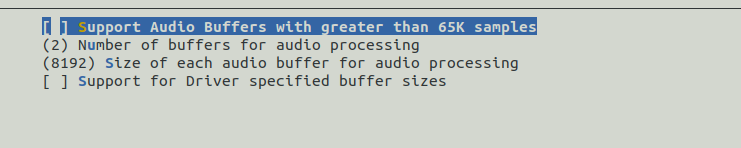

# Audio Driver Configuration

\[ [English] | [简体中文](../../../../zh-cn/device_dev_guide/media/audio/Audio_Driver_Cfg_Guide.md) \]

## I. Opening the Configuration Interface

1. Open `menuconfig`.
2. Search for the keyword **audio**.
3. Locate the **Audio Support** configuration item. The interface is shown in the figure below (UI color scheme may vary).

    

## II. Explanation of Configuration Items

### Audio Support

- Function: Enable audio device driver.

    - Required for all product categories except specific module types.

### Support Audio Composition

- Function: Support composite nodes.

    - Detailed explanation of composite nodes can be found in [Audio Driver Principle Description](./Audio_Driver_Prin_desc.md).

### Support Multiple Sessions

- Function: Support multiple sessions.

    - By default, this option is usually **disabled**.

### Audio Buffer Configuration

- Function: Configure audio buffer.

    - Buffers are used for data transfer between applications and the audio driver.

### Support Audio Buffers with Greater Than 65K Samples



- Function: Support buffers larger than 65K samples.

    - By default, buffer size is defined using `uint16_t`, with a maximum of 32K samples. After enabling this option, buffer size is defined using `uint32_t`, supporting up to 65K samples.

    - Code example:

        ```C
        #ifdef CONFIG_AUDIO_LARGE_BUFFERS
        typedef uint32_t apb_samp_t;
        #else
        typedef uint16_t apb_samp_t;
        #endif
        ```

### Number of Buffers for Audio Processing

- Function: Set the number of buffers for audio processing.

    - Default value: 2.

### Size of Each Audio Buffer for Audio Processing

- Function: Set the size of each audio processing buffer.

    - Default value: 8192.

### Support for Driver-Specified Buffer Sizes

- Function: Support custom buffer sizes and quantities.

### Supported Audio Formats


- Function: Configure audio formats supported by the device.

    - Supported formats include:

        - PCM Audio: Support for PCM format.
        - MPEG 3 Layer 1: Support for audio compression devices; other formats can be selected based on device capabilities.

### Exclude Specific Audio Features

- Function: Exclude specific audio features.

### Use Custom Device Path

- Function: Customize the registration path of audio device nodes.

    - Default registration path: `/dev/audio`.

## III. Configuration Examples

Two typical audio configuration examples are provided below: **Simulator Environment** and **a certain hardware platform**. Users can refer to these configurations based on actual needs.

### 1. Simulator Environment

The following is an audio configuration example for the **Simulator Environment**:

```Makefile
#
# Audio Support
#
CONFIG_AUDIO=y
# CONFIG_AUDIO_COMP is not set
# CONFIG_AUDIO_MULTI_SESSION is not set

#
# Audio Buffer Configuration
#
# CONFIG_AUDIO_LARGE_BUFFERS is not set
CONFIG_AUDIO_NUM_BUFFERS=2
CONFIG_AUDIO_BUFFER_NUMBYTES=8192
# CONFIG_AUDIO_DRIVER_SPECIFIC_BUFFERS is not set

#
# Supported Audio Formats
#
# CONFIG_AUDIO_FORMAT_AC3 is not set
# CONFIG_AUDIO_FORMAT_DTS is not set
CONFIG_AUDIO_FORMAT_PCM=y
# CONFIG_AUDIO_FORMAT_RAW is not set
CONFIG_AUDIO_FORMAT_MP3=y
# CONFIG_AUDIO_FORMAT_MIDI is not set
# CONFIG_AUDIO_FORMAT_WMA is not set
# CONFIG_AUDIO_FORMAT_OGG_VORBIS is not set

#
# Exclude Specific Audio Features
#
# CONFIG_AUDIO_EXCLUDE_VOLUME is not set
# CONFIG_AUDIO_EXCLUDE_BALANCE is not set
CONFIG_AUDIO_EXCLUDE_EQUALIZER=y
# CONFIG_AUDIO_EXCLUDE_TONE is not set
# CONFIG_AUDIO_EXCLUDE_PAUSE_RESUME is not set
# CONFIG_AUDIO_EXCLUDE_STOP is not set
# CONFIG_AUDIO_EXCLUDE_FFORWARD is not set
CONFIG_AUDIO_EXCLUDE_REWIND=y
# CONFIG_AUDIO_CUSTOM_DEV_PATH is not set
```

### 2. Certain Hardware Platform

The following is an audio configuration example for a **certain hardware platform**:

```Makefile
#
# Audio Support
#
CONFIG_AUDIO=y
# CONFIG_AUDIO_COMP is not set
# CONFIG_AUDIO_MULTI_SESSION is not set

#
# Audio Buffer Configuration
#
# CONFIG_AUDIO_LARGE_BUFFERS is not set
CONFIG_AUDIO_NUM_BUFFERS=2
CONFIG_AUDIO_BUFFER_NUMBYTES=8192
CONFIG_AUDIO_DRIVER_SPECIFIC_BUFFERS=y

#
# Supported Audio Formats
#
# CONFIG_AUDIO_FORMAT_AC3 is not set
# CONFIG_AUDIO_FORMAT_DTS is not set
CONFIG_AUDIO_FORMAT_PCM=y
# CONFIG_AUDIO_FORMAT_RAW is not set
# CONFIG_AUDIO_FORMAT_MP3 is not set
# CONFIG_AUDIO_FORMAT_MIDI is not set
# CONFIG_AUDIO_FORMAT_WMA is not set
# CONFIG_AUDIO_FORMAT_OGG_VORBIS is not set

#
# Exclude Specific Audio Features
#
# CONFIG_AUDIO_EXCLUDE_VOLUME is not set
# CONFIG_AUDIO_EXCLUDE_BALANCE is not set
CONFIG_AUDIO_EXCLUDE_EQUALIZER=y
# CONFIG_AUDIO_EXCLUDE_TONE is not set
# CONFIG_AUDIO_EXCLUDE_PAUSE_RESUME is not set
# CONFIG_AUDIO_EXCLUDE_STOP is not set
# CONFIG_AUDIO_EXCLUDE_FFORWARD is not set
CONFIG_AUDIO_EXCLUDE_REWIND=y
# CONFIG_AUDIO_CUSTOM_DEV_PATH is not set
```
