# Audio Driver Principles

\[ [English] | [简体中文](../../../../zh-cn/device_dev_guide/media/audio/Audio_Driver_Prin_desc.md) \]

## I. Overview

openvela provides an abstract audio device-node interface that enables applications to perform audio playback and recording. Applications interact with the audio driver via the standard `open`, `close`, and `ioctl` system calls.  

openvela audio driver uses a layered architecture consisting of two parts:

1. **Upper Half Driver**: Defines a unified external interface and common code, and provides default implementations for certain `ioctl` commands.  
2. **Lower Half Driver**: Implements the hardware-specific interaction logic (e.g., controlling the audio hardware).  

This layered design modularizes audio functionality, decouples it from hardware, offers higher flexibility and extensibility, and reduces maintenance effort and hardware-adaptation complexity for developers.  

## II. Software Layers

openvela provides three built-in tools—`nxplayer`, `nxrecorder`, and `nxlooper`—to help developers verify the audio driver. These tools offer a convenient way to test and validate multimedia features such as playback and recording.

The audio driver exposes its functionality through the audio interface, providing multimedia audio capabilities to application developers. The layer structure of the openvela audio driver is as follows:

- **Audio Applications**: For multimedia functionality development, e.g., music players.  
- **Vela Audio Driver**: Provides audio interfaces to upper-level applications and encapsulates hardware-related details.  

  

## III. Code Directory

The openvela audio driver source is located under the `nuttx/audio` directory. Its structure is:

```bash
user@user:~/vela/nuttx/audio$ tree
├── audio.c
├── audio_comp.c
├── Kconfig
├── Make.dep
├── Makefile
└── README.txt

0 directories, 10 files
```

This directory contains the core implementation files, configuration (`Kconfig`), build files (`Makefile` and `Make.dep`), and related documentation (`README.txt`). Developers can extend or modify the audio driver functionality here as needed.

## IV. External Interfaces

The openVela audio driver provides a standardized set of interfaces for applications to perform audio operations via the `ioctl` system call. The following commands are defined:

```c
#define AUDIOIOC_GETCAPS            _AUDIOIOC(1)
#define AUDIOIOC_RESERVE            _AUDIOIOC(2)
#define AUDIOIOC_RELEASE            _AUDIOIOC(3)
#define AUDIOIOC_CONFIGURE          _AUDIOIOC(4)
#define AUDIOIOC_SHUTDOWN           _AUDIOIOC(5)
#define AUDIOIOC_START              _AUDIOIOC(6)
#define AUDIOIOC_STOP               _AUDIOIOC(7)
#define AUDIOIOC_PAUSE              _AUDIOIOC(8)
#define AUDIOIOC_RESUME             _AUDIOIOC(9)
#define AUDIOIOC_GETBUFFERINFO      _AUDIOIOC(10)
#define AUDIOIOC_ALLOCBUFFER        _AUDIOIOC(11)
#define AUDIOIOC_FREEBUFFER         _AUDIOIOC(12)
#define AUDIOIOC_ENQUEUEBUFFER      _AUDIOIOC(13)
#define AUDIOIOC_REGISTERMQ         _AUDIOIOC(14)
#define AUDIOIOC_UNREGISTERMQ       _AUDIOIOC(15)
#define AUDIOIOC_HWRESET            _AUDIOIOC(16)
#define AUDIOIOC_SETBUFFERINFO      _AUDIOIOC(17)
#define AUDIOIOC_SETPARAMETER       _AUDIOIOC(18)
#define AUDIOIOC_GETLATENCY         _AUDIOIOC(19)
#define AUDIOIOC_FLUSH              _AUDIOIOC(20)
```

These interfaces cover device configuration, start, pause, stop, buffer management, and other audio operations to satisfy various application scenarios.

### Example Code

```C
precorder->dev_fd = open("/dev/audio/pcm0c", O_RDWR | O_CLOEXEC);
ioctl(precorder->dev_fd, AUDIOIOC_CONFIGURE, (unsigned long)&cap_desc);
close(dev_fd);
```

The example demonstrates how to:

1. **Open** the audio device node (e.g., `/dev/audio/pcm0c`) using `open`.
2. **Configure** the device by invoking `ioctl` with `AUDIOIOC_CONFIGURE` and passing the configuration descriptor.
3. **Close** the device file descriptor using `close`.

## V. Audio Device Nodes

On the openvela `sim` platform, after the system boots there are four audio device nodes under `/dev/audio/`:

```Bash
ap> ls /dev/audio
 pcm0c
 pcm0p
 pcm1c
 pcm1p
```

### 1. Device Node Registration Process

Device node registration is the process by which the Upper Half Driver establishes its link to the Lower Half Driver. The key steps are outlined below.

#### 1.1 `audio_register`

```Bash
int audio_register(FAR const char *name, FAR struct audio_lowerhalf_s *dev)
```

- Parameters:

    - `name`: the device-node name, e.g., `"pcm0p"`.
    - `dev`: pointer to the lower-half driver’s structure.

- Return Value:

    - Returns `0` on success.
    - Returns a negative error code on failure.

##### Data Structures

1. `audio_upperhalf_s`

    The upper-half driver’s state structure, which maintains device status information.

    ```C
    struct audio_upperhalf_s
    {
        uint8_t           crefs;            /* The number of times the device has been opened */
        volatile bool     started;          /* True: playback is active */
        mutex_t           lock;             /* Supports mutual exclusion */
        FAR struct audio_lowerhalf_s *dev;  /* lower-half state */
        struct file      *usermq;           /* User mode app's message queue */
    };
    ```

2. `audio_lowerhalf_s`

    The lower-half driver’s structure for hardware adaptation.

    ```C
    struct audio_lowerhalf_s
    {
    /* The first field of this state structure must be a pointer to the Audio
        * callback structure:
        */
    
    FAR const struct audio_ops_s *ops;  
    
    /* The bind data to the upper-half driver used for callbacks of dequeuing
        * buffer, reporting asynchronous event, reporting errors, etc.
        */
    
    FAR audio_callback_t  upper;
    
    /* The private opaque pointer to be passed to upper-layer during
        * callbacks  
        */
        
    FAR void *priv;
        
    /* The custom Audio device state structure may include additional fields
        * after the pointer to the Audio callback structure.
        */
    }; 
    ```

##### Implementation

`audio_register` is implemented as follows, with single-line comments added to explain the assignment of key variables. This function populates the critical fields of the `audio_lowerhalf_s` structure and completes registration of the audio device.

Note: The lower-half driver must be adapted by chip vendors to match specific hardware, so implementations vary across platforms.

```C
int audio_register(FAR const char *name, FAR struct audio_lowerhalf_s *dev)
{
 upper = (FAR struct audio_upperhalf_s *)kmm_zalloc(
                                           sizeof(struct audio_upperhalf_s));
 /* Initialize the Audio device structure
  * (it was already zeroed by kmm_zalloc())
  */

  nxmutex_init(&upper->lock);
  
  /* assign dev to upper->dev */
  upper->dev = dev;                  
  
  /* Now build the path for registration */
  ...
  
  /* set callback to lower half, use msg callback  */
  dev->upper = audio_callback;
  
  /* set upper to priv of lower half. */
  dev->priv = upper;
  
  return register_driver(path, &g_audioops, 0666, upper);
}
```

The `g_audioops` structure defines the device operations:

```C
static const struct file_operations g_audioops =
{
  audio_open,  /* open */
  audio_close, /* close */
  audio_read,  /* read */
  audio_write, /* write */
  NULL,        /* seek */
  audio_ioctl, /* ioctl */
};
```

Through g_audioops, the audio device’s fundamental operations are abstracted into a unified interface, making it easier for upper-layer applications to invoke.

##### Call Flow

The UML diagram below illustrates the complete call path from `nxplayer` to the lower-half driver:



##### Call Stacks

The following GDB backtraces show the paths for `audio_open`, `audio_ioctl`, and `audio_close`.

1. Invoke `audio_open`.

    ```Bash
    (gdb) bt
    #0  audio_open (filep=0xf400bad0) at audio.c:139
    #1  0x597a9c8e in file_vopen (filep=0xee9eca50, path=0xee9ecca0 "/dev/audio/pcm0p", oflags=3, umask=0, ap=0xee9ecb9c "1\277\232Y\n\327?f\001") at vfs/fs_open.c:194
    #2  0x597aa078 in nx_vopen (path=0xee9ecca0 "/dev/audio/pcm0p", oflags=3, ap=0xee9ecb98 "5\033`Y1\277\232Y\n\327?f\001") at vfs/fs_open.c:253
    #3  0x597aa9e7 in open (path=0xee9ecca0 "/dev/audio/pcm0p", oflags=3) at vfs/fs_open.c:411
    #4  0x599ac02d in nxplayer_setdevice (pplayer=0xf3808d40, pdevice=0xee9ecca0 "/dev/audio/pcm0p") at nxplayer.c:1663
    #5  0x59954325 in nxplayer_cmd_device (pplayer=0xf3808d40, parg=0xee9eceb7 "pcm0p") at nxplayer_main.c:612
    #6  0x599557d0 in nxplayer_main (argc=1, argv=0xee7dd830) at nxplayer_main.c:811
    #7  0x596003b1 in nxtask_startup (entrypt=0x59954d90 <nxplayer_main>, argc=1, argv=0xee7dd830) at sched/task_startup.c:70
    #8  0x5955347f in nxtask_start () at task/task_start.c:134
    #9  0x00000000 in ?? ()
    ```

2. Invoke `audio_ioctl`.

    ```Bash
    (gdb) bt
    #0  audio_ioctl (filep=0xf440c900, cmd=6529667, arg=1715459884) at audio.c:349
    #1  0x597a6d2b in file_vioctl (filep=0xf440c7fc, req=4097, ap=<optimized out>) at vfs/fs_ioctl.c:67
    #2  0x597a78df in ioctl (fd=3, req=4097) at vfs/fs_ioctl.c:212
    #3  0x599ac104 in nxplayer_setdevice (pplayer=0xf3808d40, pdevice=0xee9ecca0 "/dev/audio/pcm0p") at nxplayer.c:1676
    #4  0x59954325 in nxplayer_cmd_device (pplayer=0xf3808d40, parg=0xee9eceb7 "pcm0p") at nxplayer_main.c:612
    #5  0x599557d0 in nxplayer_main (argc=1, argv=0xee7dd830) at nxplayer_main.c:811
    #6  0x596003b1 in nxtask_startup (entrypt=0x59954d90 <nxplayer_main>, argc=1, argv=0xee7dd830) at sched/task_startup.c:70
    #7  0x5955347f in nxtask_start () at task/task_start.c:134
    #8  0x00000000 in ?? ()
    ```

3. Invoke `audio_close`.

    ```Bash
    (gdb) bt
    #0  audio_close (filep=0x5957f73e <sem_post+18>) at audio.c:190
    #1  0x597a472d in file_close (filep=0xee9ecac0) at vfs/fs_close.c:74
    #2  0x597a0baa in nx_close (fd=3) at inode/fs_files.c:592
    #3  0x597a0c62 in close (fd=3) at inode/fs_files.c:626
    #4  0x599ac162 in nxplayer_setdevice (pplayer=0xf3808d40, pdevice=0xee9ecca0 "/dev/audio/pcm0p") at nxplayer.c:1686
    #5  0x59954325 in nxplayer_cmd_device (pplayer=0xf3808d40, parg=0xee9eceb7 "pcm0p") at nxplayer_main.c:612
    #6  0x599557d0 in nxplayer_main (argc=1, argv=0xee7dd830) at nxplayer_main.c:811
    #7  0x596003b1 in nxtask_startup (entrypt=0x59954d90 <nxplayer_main>, argc=1, argv=0xee7dd830) at sched/task_startup.c:70
    #8  0x5955347f in nxtask_start () at task/task_start.c:134
    #9  0x00000000 in ?? ()
    ```

##### Example

On the Simulator platform, the lower-half driver uses the host’s ALSA capabilities. For example:

```C
 audio_register("pcm0p", sim_audio_initialize(true, false));
```

- `pcm0p` is the registered node name.
- `sim_audio_initialize` initializes the lower-half driver.

This code is located in the arch/sim/src/sim/posix/sim_alsa.c file. On the Simulator platform, pcm0p is registered by a single lower-half driver.

#### 1.2 `audio_comp_initialize`

`audio_comp_initialize` is a function used to register a composite audio device. Its functionality is similar to combining `platform`/`dai`/`codec` drivers in the Linux ASoC framework; however, in openvela all audio drivers are abstracted as `audio_lowerhalf`, with no distinction between `platform`, `dai`, and `codec`.  

##### Function Definition

```c
FAR struct audio_lowerhalf_s *audio_comp_initialize(FAR const char *name, ...);
```

##### Description

Unlike `audio_register`, `audio_comp_initialize` accepts a variable number of `audio_lowerhalf` arguments, allowing multiple lower-half drivers to be combined into a single PCM device.

- `audio_register`: Single-device registration.
- `audio_comp_initialize`: Composite registration with multiple devices.

##### Use Cases

These flexibility advantages are evident in the following scenarios:

- On some platforms, the `i2s lowerhalf driver` is fixed, but different `PA` (power amplifiers) can be attached.  
- The `i2s lowerhalf driver` is provided by the chip platform and is essentially fixed, whereas the `PA lowerhalf driver` must be adapted to project‐specific requirements.  
- Using `audio_comp_initialize`, you can combine the `i2s lowerhalf driver` and the `PA lowerhalf driver` into a single audio device, thereby enhancing adaptation flexibility.  

##### Data Structure

`audio_comp_priv_s` is a data structure describing the internal state of a composite audio device. It is defined as follows:  

```C
/* This structure describes the internal state of the audio composite */

struct audio_comp_priv_s
{
  /* This is is our appearance to the outside world. This *MUST* be the
   * first element of the structure so that we can freely cast between
   * types struct audio_lowerhalf and struct audio_comp_dev_s.
   */

  struct audio_lowerhalf_s export;

  /* This is the contained, low-level audio device array and count. */

  FAR struct audio_lowerhalf_s **lower;
  int count;
};
```

- `export`: a field of type `audio_lowerhalf_s` that serves as the export interface for multiple lower-half drivers, connecting to the upper-half driver.  
- `lower`: a pointer to the array of contained lower-half audio devices.  
- `count`: the number of contained lower-half audio devices.  

##### Implementation

Here is the implementation of `audio_comp_initialize`, with comments explaining the key steps:

```C
FAR struct audio_lowerhalf_s *audio_comp_initialize(FAR const char *name,
                                                    ...)
{
    FAR struct audio_comp_priv_s *priv;
    
    priv = kmm_zalloc(sizeof(struct audio_comp_priv_s));
  
    priv->export.ops = &g_audio_comp_ops;
    
    /* Get how many lowerhalf drivers */
    va_start(ap, name);
    while (va_arg(ap, FAR struct audio_lowerhalf_s *))
        {
          priv->count++;
        }
    
    va_end(ap);
    
    /* alloc space to store lowerhalf drivers */
    priv->lower = kmm_calloc(priv->count,
                               sizeof(FAR struct audio_lowerhalf_s *));
    if (priv->lower == NULL)
        {
          goto free_priv;
        }
    
    /* Initialized for each lower half driver */
    va_start(ap, name);
    for (i = 0; i < priv->count; i++)
        {
          FAR struct audio_lowerhalf_s *tmp;
    
          tmp = va_arg(ap, FAR struct audio_lowerhalf_s *);
          tmp->upper = audio_comp_callback;
          tmp->priv = priv;
    
          priv->lower[i] = tmp;
        }
    
    va_end(ap);
    
    ret = audio_register(name, &priv->export);
    
    return &priv->export;
}
```

Process Description:

1. Allocate Private Data Structure: Use `kmm_zalloc` to allocate the `audio_comp_priv_s` structure and initialize its operation interface.
2. Count lower`lowerhalf`half Drivers: Traverse the variable-length arguments using `va_arg` to count the number of included `audio_lowerhalf` drivers.
3. Allocate Storage Space: Allocate storage space for the `audio_lowerhalf` drivers.
4. Initialize `lowerhalf` Drivers: Set callback functions and private data for each `audio_lowerhalf` driver.
5. Register Device Node: Call the `audio_register` function to register the composite audio device as a device node.

##### Process Description

The following steps outline the process:

1. **Allocate Private Data Structure**: Allocate the `audio_comp_priv_s` structure using `kmm_zalloc` and initialize its operation interfaces.
2. **Count `lowerhalf` Drivers**: Traverse the variable-length arguments using `va_arg` to count the number of `audio_lowerhalf` drivers included.
3. **Allocate Storage Space**: Allocate storage space for each `audio_lowerhalf` driver.
4. **Initialize `lowerhalf` Drivers**: Set callback functions and private data for each `audio_lowerhalf` driver.
5. **Register Device Node**: Call the `audio_register` function to register the composite audio device as a device node.

##### New Interfaces

The following are some newly added interfaces used by `audio_comp_initialize` and their functional descriptions.

###### `g_audio_comp_ops`

`g_audio_comp_ops` is a collection of operation interfaces for composite audio devices, defining all the functionalities provided by the composite audio device. These functionalities are passed to each audio lower-half driver through the upper-half driver. It is defined as follows:

```c
static const struct audio_ops_s g_audio_comp_ops =
{
  audio_comp_getcaps,       /* getcaps        */
  audio_comp_configure,     /* configure      */
  audio_comp_shutdown,      /* shutdown       */
  audio_comp_start,         /* start          */
#ifndef CONFIG_AUDIO_EXCLUDE_STOP
  audio_comp_stop,          /* stop           */
#endif
#ifndef CONFIG_AUDIO_EXCLUDE_PAUSE_RESUME
  audio_comp_pause,         /* pause          */
  audio_comp_resume,        /* resume         */
#endif
  audio_comp_allocbuffer,   /* allocbuffer    */
  audio_comp_freebuffer,    /* freebuffer     */
  audio_comp_enqueuebuffer, /* enqueue_buffer */
  audio_comp_cancelbuffer,  /* cancel_buffer  */
  audio_comp_ioctl,         /* ioctl          */
  audio_comp_read,          /* read           */
  audio_comp_write,         /* write          */
  audio_comp_reserve,       /* reserve        */
  audio_comp_release        /* release        */
};
```

Core Functions:

- Provides a unified operation interface for composite audio devices, for use by upper-half drivers.
- Implements abstraction of external functionalities for composite audio devices, supporting features such as pause, start, and buffer management.

###### `audio_comp_callback`

`audio_comp_callback` is the callback function for composite audio devices, used to handle events from each audio lower-half device and pass them to the upper-half driver for processing.

The implementation of `audio_comp_callback` is as follows:

```c
#ifdef CONFIG_AUDIO_MULTI_SESSION
static void audio_comp_callback(FAR void *arg, uint16_t reason,
                                FAR struct ap_buffer_s *apb, uint16_t status,
                                FAR void *session)
#else
static void audio_comp_callback(FAR void *arg, uint16_t reason,
                                FAR struct ap_buffer_s *apb, uint16_t status)
#endif
{
  FAR struct audio_comp_priv_s *priv = arg;

#ifdef CONFIG_AUDIO_MULTI_SESSION
  priv->export.upper(priv->export.priv, reason, apb, status, session);
#else
  priv->export.upper(priv->export.priv, reason, apb, status);
#endif
}
```

- Parameter Descriptions:

    - `arg`: Pointer to the composite audio device's private data structure `audio_comp_priv_s`.
    - `reason`: The reason for the callback, such as buffer completion or error.
    - `apb`: Audio buffer.
    - `status`: Callback status.
    - `session` (optional): Session information when multi-session support is enabled.

##### Call Flow

The following outlines the function call flow for composite audio devices:

- `open` and `close`: Consistent with standard audio devices, no changes.

- `ioctl` Call Chain:

    `ioctl` → `file_vioctl` → `audio_ioctl` → `audio_comp_configure`, where in the `audio_comp_configure` function, each `audio_lowerhalf` driver's `configure` interface is called sequentially to complete the configuration of the composite device.

    ```c
    static int audio_comp_configure(FAR struct audio_lowerhalf_s *dev,
                                    FAR const struct audio_caps_s *caps)
    {
        for (i = 0; i < priv->count; i++)
        {
            if (lower[i]->ops->configure)
            {
                /* Forward ioctl to lowerhalf driver*/
    #ifdef CONFIG_AUDIO_MULTI_SESSION
                int tmp = lower[i]->ops->configure(lower[i], sess[i], caps);
    #else
                int tmp = lower[i]->ops->configure(lower[i], caps);
    #endif
            }
        }

        return ret;
    }
    ```

- Function: `audio_comp_configure` forwards the configuration command (`configure`) to each `audio_lowerhalf` driver that constitutes the composite device, achieving the configuration of the composite device.

### 2. When to Register Device Node

The registration of audio device nodes typically occurs during the system initialization phase. This section demonstrates the call path for registering audio device nodes through the GDB debug call stack.

Captured call stack information during debugging:

```bash
(gdb) bt
#0  audio_register (name=0xf46007b0 "", dev=0x4c) at audio.c:919
#1  0x596369f2 in up_initialize () at sim/sim_initialize.c:295
#2  0x5954c5a8 in nx_start () at init/nx_start.c:610
#3  0x594db783 in main (argc=1, argv=0xffffd604, envp=0xffffd60c) at sim/sim_head.c:130
```

### 3. Summary

This chapter summarizes the following points:

1. Audio Driver Registration Methods: Introduced two methods for registering audio drivers in openvela, including `audio_register` and its derived function `audio_comp_initialize`, the latter supporting the combination of multiple audio lower-half drivers.

2. Function Call Flow: Described the complete call path from the application (e.g., `nxplayer`) to the audio lower-half driver, i.e., `apps (nxplayer) → vfs → audio upper-half driver → audio lower-half driver`.

## VI. Introduction to Audio Lower-Half Drivers

In the previous chapter, we introduced the complete call path from the application (e.g., `nxplayer`) to the audio driver, i.e., `apps (nxplayer) → vfs → audio upper-half driver → audio lower-half driver`. The implementations of the first three parts are independent of specific chips or products, but the `audio lower-half driver` is chip-specific and may even vary among different products of the same chip.

Here are some common scenarios of differences:

- Capability Differences: For example, different products may support different sampling rates or channel counts.

- Data Processing Method Differences:

    - Some platforms have a general-purpose DMA module, and the audio driver may need to reserve a specific DMA channel.
    - Other platforms may have DMA functionality as an internal auxiliary feature of the audio.

- External PA Support:

    - Some platforms support registering audio drivers through a combination of `i2s lower-half driver` and `pa lower-half driver`.
    - In specific projects, if the PA needs to be updated, simply re-implementing the `pa lower-half driver` can meet the requirements.

In summary, due to platform specificity, audio lower-half drivers are typically implemented by chip manufacturers.

### 1. `audio_lowerhalf_s`

`audio_lowerhalf_s` is the core data structure for audio lower-half drivers, used to implement hardware adaptation and the connection between upper and lower layers. It is defined as follows:

```c
struct audio_lowerhalf_s
{
  /* The first field of this state structure must be a pointer to the Audio
   * callback structure:
   */

  FAR const struct audio_ops_s *ops;  

  /* The bind data to the upper-half driver used for callbacks of dequeuing
   * buffer, reporting asynchronous event, reporting errors, etc.
   */

  FAR audio_callback_t upper;

  /* The private opaque pointer to be passed to upper-layer during
   * callbacks
   */

  FAR void *priv;

  /* The custom Audio device state structure may include additional fields
   * after the pointer to the Audio callback structure.
   */
}; 
```

- `ops`: A pointer to `audio_ops_s`, defining all the interfaces that the audio lower-half driver needs to implement, such as device control, playback, recording, and buffer management. The audio lower-half driver must re-implement these interfaces based on hardware characteristics.
- `upper`: The callback function for the upper-half driver, used for buffer management, event notification, etc.
- `priv`: A private data pointer used to pass context information in callbacks.

### 2. `audio_ops_s`

`audio_ops_s` defines the operation interfaces for audio drivers, located in `include/nuttx/audio/audio.h`, including control interfaces and data interfaces. It implements the control of audio drivers by applications and the flow of data. The main interfaces and their functions are as follows:

#### Control Interfaces

| Interface Name         | Function Description                                         |
| :--------------------- | :----------------------------------------------------------- |
| AUDIOIOC\_GETCAPS      | Get device capabilities.                                     |
| AUDIOIOC\_RESERVE      | Reserve the audio device's buffer.                           |
| AUDIOIOC\_RELEASE      | Release the device.                                          |
| AUDIOIOC\_CONFIGURE    | Set device parameters.                                       |
| AUDIOIOC\_SHUTDOWN     | Shut down the device.                                        |
| AUDIOIOC\_START        | Start playback or recording.                                 |
| AUDIOIOC\_STOP         | Stop playback or recording.                                  |
| AUDIOIOC\_PAUSE        | Pause playback or recording.                                 |
| AUDIOIOC\_RESUME       | Resume playback or recording.                                |
| AUDIOIOC\_REGISTERMQ   | Register message queue for driver-application communication. |
| AUDIOIOC\_UNREGISTERMQ | Unregister message queue.                                    |
| AUDIOIOC\_HWRESET      | Perform hardware reset.                                      |
| AUDIOIOC\_SETPARAMTER  | Set parameters in `key=value` format.                        |
| AUDIOIOC\_FLUSH        | Clear buffer data.                                           |

#### Data Interfaces

| Interface Name          | Function Description                                      |
| :---------------------- | :-------------------------------------------------------- |
| AUDIOIOC\_GETBUFFERINFO | Get buffer information.                                   |
| AUDIOIOC\_ALLOCBUFFER   | Allocate buffer.                                          |
| AUDIOIOC\_FREEBUFFER    | Free buffer.                                              |
| AUDIOIOC\_ENQUEUEBUFFER | Application passes data to driver through this interface. |
| AUDIOIOC\_SETBUFFERINFO | Set buffer information.                                   |
| AUDIOIOC\_GETLATENCY    | Get driver playback latency.                              |

#### Single Device vs. Composite Device Implementation

- Single Device: For a single audio device, the control and data interfaces of `audio_ops_s` need to be fully implemented to provide complete audio functionality.

- Composite Device: For devices composed of multiple `audio_lowerhalf_s` drivers:

    - One of the more complex devices needs to implement the complete control and data interfaces.
    - The remaining simpler devices need to implement only a subset of the interfaces.

## Ⅶ. `audio_dma` Audio Lower-Half Driver Example

### 1. Overview of `audio_dma`

`audio_dma` is a built-in audio lower-half driver provided by openvela, with its source code located at `drivers/audio/audio_dma.c`. This section explains its implementation in detail.

### 1.1 Data Structures

`audio_dma` implements audio functionalities by overriding the interfaces defined in `audio_ops_s`. The following is the operation interface definition for `audio_dma`:

```c
static const struct audio_ops_s g_audio_dma_ops =
{
  .getcaps = audio_dma_getcaps,
  .configure = audio_dma_configure,
  .shutdown = audio_dma_shutdown,
  .start = audio_dma_start,
#ifndef CONFIG_AUDIO_EXCLUDE_STOP
  .stop = audio_dma_stop,
#endif
#ifndef CONFIG_AUDIO_EXCLUDE_PAUSE_RESUME
  .pause = audio_dma_pause,
  .resume = audio_dma_resume,
#endif
  .allocbuffer = audio_dma_allocbuffer,
  .freebuffer = audio_dma_freebuffer,
  .enqueuebuffer = audio_dma_enqueuebuffer,
  .ioctl = audio_dma_ioctl,
  .reserve = audio_dma_reserve,
  .release = audio_dma_release,
};
```

- **Control interfaces**: Functions such as `getcaps`, `configure`, `start`, and `stop` control the audio device.
- **Data interfaces**: Functions such as `allocbuffer`, `freebuffer`, and `enqueuebuffer` manage audio data flow.

### 1.2 Control Interfaces

The control interfaces of `audio_dma` are tightly coupled with the hardware and ultimately invoke the underlying DMA module APIs (e.g., `DMA_START_CYCLIC`). Some of the control interfaces are described below:

- `getcaps`: Retrieves the capabilities of the device.
- `configure`: Configures device parameters.
- `start/stop`: Starts or stops the audio device.
- `pause/resume`: Pauses or resumes the audio device.
- `ioctl`: Supports multiple control commands, such as:

    - `AUDIOIOC_SETPARAMTER`: Sets parameters using a `key=value` format, for example, `set_scenario=phone`.

An example implementation of the `configure` interface:

```c
static int audio_dma_configure(struct audio_lowerhalf_s *dev,
                               const struct audio_caps_s *caps)
{
  struct audio_dma_s *audio_dma = (struct audio_dma_s *)dev;
  struct dma_config_s cfg;
  int ret = -EINVAL;
  ...
  switch (caps->ac_type)
    {
      case AUDIO_TYPE_OUTPUT:
        if (audio_dma->playback)
          {
            ...
            ret = DMA_CONFIG(audio_dma->chan, &cfg);
          }
        break;
        ...
}
```

The macro `DMA_CONFIG` is defined as:

```c
#define DMA_CONFIG(chan, cfg) (chan)->ops->config(chan, cfg)
```

### 1.3 Key Data Structures

Two key data structures are used for data exchange in the audio driver:

1. **`ap_buffer_s`**: Represents a buffer that holds actual audio data, including its memory location and metadata. Important fields:

    - `samp`: Pointer to the audio data.
    - `nmaxbytes`: Maximum size of the buffer.
    - `nbytes`: Actual size of the audio data.
    - `curbytes`: Current offset for data processing, typically 0.
    - `nsamples`: Number of audio samples stored.

2. **`audio_buf_desc_s`**: A descriptor structure used to represent `ap_buffer_s`, typically passed as an argument to `ioctl` calls.

A UML diagram of these structures is available below:


### 1.4 Interface Descriptions

Below are the key `audio_dma` interfaces and their functions:

1. `AUDIOIOC_GETBUFFERINFO`

    - Function: Retrieves buffer size and count from the driver.

2. `AUDIOIOC_SETBUFFERINFO`

    - Function: Sets buffer size and count.

3. `AUDIOIOC_ALLOCBUFFER`

    - Function: Allocates an audio buffer.

    - Details:

        - Memory shared between the audio driver and the application is allocated by the driver.
        - The default allocator is `apb_alloc`, but custom implementations are allowed in the lower-half driver.
        - By default, `apb_alloc` allocates a contiguous block large enough to hold both the `ap_buffer_s` structure and the actual audio data (`apb->samp`).
        - `audio_dma_allocbuffer` ensures DMA compatibility by allocating a physically contiguous region for the buffer.

    - Optimization:

        - Using the default `apb_alloc` may involve an extra data copy.
        - `audio_dma` allows the application to write directly into the DMA buffer, reducing memory copy overhead.

4. `AUDIOIOC_FREEBUFFER`

    - Function: Frees an audio buffer.

5. `AUDIOIOC_ENQUEUBUFFER`

    - Function: Passes an audio buffer to the driver for playback or receives an empty buffer for recording.

    - Implementation example:

    ```c
    flags = enter_critical_section();
    dq_addlast(&apb->dq_entry, &audio_dma->pendq);  // Add to pending queue
    leave_critical_section(flags);
    ```

    - Processing mechanism:

        - Interrupt handler: Functions like `audio_dma_callback` are invoked by DMA interrupts to trigger the `DEQUEUE` callback.
        - High-priority worker thread: Waits for signals from hardware callbacks (e.g., DMA or I2S) to consume the next audio frame.

### 1.5 Key Handler Functions

#### `audio_dma_enqueuebuffer`

- Function: Enqueues an audio buffer into the pending queue.
- Implementation:

    ```c
    static int audio_dma_enqueuebuffer(struct audio_lowerhalf_s *dev,
                                        struct ap_buffer_s*apb)
    {
        struct audio_dma_s *audio_dma = (struct audio_dma_s*)dev;
        irqstate_t flags;
        ...
        apb->flags |= AUDIO_APB_OUTPUT_ENQUEUED;

        flags = enter_critical_section();
        dq_addlast(&apb->dq_entry, &audio_dma->pendq);
        leave_critical_section(flags);
        ...
        return OK;
    }
    ```

#### `audio_dma_callback`

- Function: DMA interrupt handler that dequeues a buffer and triggers the `DEQUEUE` callback.

- Implementation:

    ```c
    /*DMA interrupt handling function*/
    static void audio_dma_callback(struct dma_chan_s *chan,
                                   void*arg, ssize_t len)
    {
      struct audio_dma_s *audio_dma = (struct audio_dma_s*)arg;
      struct ap_buffer_s *apb;
      bool final = false;

      apb = (struct ap_buffer_s *)dq_remfirst(&audio_dma->pendq);
      ...
      /* DEQUEUE callback */
    #ifdef CONFIG_AUDIO_MULTI_SESSION
        audio_dma->dev.upper(audio_dma->dev.priv, AUDIO_CALLBACK_DEQUEUE,
                             apb, OK, NULL);
    #else
        audio_dma->dev.upper(audio_dma->dev.priv, AUDIO_CALLBACK_DEQUEUE,
                             apb, OK);
    #endif
      ...
    }
    ```

### Summary

`audio_dma` provides a wrapper around general-purpose DMA functionality to fully implement the audio driver's data interface, while offloading control logic to the DMA module (`dma_ops_s`). Key features include:

1. Efficient data transfer: By allocating DMA-compatible buffers, it avoids unnecessary memory copying.
2. Flexible interface: Supports a range of control and data operations, suitable for varied use cases.
3. Modular design: Uses interrupts and worker threads to manage data flow, enabling support across different hardware platforms.

By studying the `audio_dma` implementation, developers can follow its design as a reference to quickly build their own custom audio lower-half drivers.

---

Let me know if you'd like this section adapted for a specific audience (e.g., beginner-friendly, API reference, or internal SDK documentation).

### 2. `audio_i2s`

`audio_i2s` is a built-in lower-half audio driver provided by openvela, mainly used for audio data transmission and control. Below is a detailed explanation of `audio_i2s`.

#### 2.1 Data Structures

`audio_i2s` implements audio driver functionality by overriding the interfaces in `audio_ops_s`. The interface definition for `audio_i2s` is as follows:

```c
static const struct audio_ops_s g_audio_i2s_ops =
{
  audio_i2s_getcaps,       /* Get capabilities */
  audio_i2s_configure,     /* Configure parameters */
  audio_i2s_shutdown,      /* Shutdown */
  audio_i2s_start,         /* Start */
#ifndef CONFIG_AUDIO_EXCLUDE_STOP
  audio_i2s_stop,          /* Stop */
#endif
#ifndef CONFIG_AUDIO_EXCLUDE_PAUSE_RESUME
  audio_i2s_pause,         /* Pause */
  audio_i2s_resume,        /* Resume */
#endif
  audio_i2s_allocbuffer,   /* Allocate PCM playback buffer */
  audio_i2s_freebuffer,    /* Free PCM buffer */
  audio_i2s_enqueuebuffer, /* PCM data exchange between apps and driver */
  NULL,                    /* Cancel buffer */
  audio_i2s_ioctl,         /* IOCTL */
  NULL,                    /* Read */
  NULL,                    /* Write */
  audio_i2s_reserve,       /* Reserve */
  audio_i2s_release        /* Release */
};
```

##### I2S Device Structure

The system defines the I2S device structure as follows:

```c
struct i2s_dev_s
{
  FAR const struct i2s_ops_s *ops;
};
```

##### I2S Operation Interfaces

`i2s_ops_s` defines the I2S operation interfaces to be implemented, primarily including receiver methods, transmitter methods, master clock configuration, and a general control interface:

```c
struct i2s_ops_s
{
  /* Receiver methods */
  CODE int      (*i2s_rxchannels)(FAR struct i2s_dev_s *dev,
                                  uint8_t channels);
  CODE uint32_t (*i2s_rxsamplerate)(FAR struct i2s_dev_s *dev,
                                    uint32_t rate);
  CODE uint32_t (*i2s_rxdatawidth)(FAR struct i2s_dev_s *dev,
                                   int bits);
  CODE int      (*i2s_receive)(FAR struct i2s_dev_s *dev,
                               FAR struct ap_buffer_s *apb,
                               i2s_callback_t callback,
                               FAR void *arg,
                               uint32_t timeout);

  /* Transmitter methods */
  CODE int      (*i2s_txchannels)(FAR struct i2s_dev_s *dev,
                                  uint8_t channels);
  CODE uint32_t (*i2s_txsamplerate)(FAR struct i2s_dev_s *dev,
                                    uint32_t rate);
  CODE uint32_t (*i2s_txdatawidth)(FAR struct i2s_dev_s *dev,
                                   int bits);
  CODE int      (*i2s_send)(FAR struct i2s_dev_s *dev,
                            FAR struct ap_buffer_s *apb,
                            i2s_callback_t callback,
                            FAR void *arg,
                            uint32_t timeout);

  /* Master Clock methods */
  CODE uint32_t (*i2s_mclkfrequency)(FAR struct i2s_dev_s *dev,
                                     uint32_t frequency);

  /* Ioctl */
  CODE int      (*i2s_ioctl)(FAR struct i2s_dev_s *dev,
                             int cmd, unsigned long arg);
};
```

The `i2s_ops_s` interface is closely related to hardware and must be implemented by hardware vendors. The main functionalities include:

- Configuring I2S data transmission format (channel count, data width, sample rate).
- Sending and receiving PCM data.
- Configuring master clock (MCLK).
- Control interface (`ioctl`).

#### 2.2 Code Location

The code location for `audio_i2s` is as follows:

- Implementation: `nuttx/drivers/audio/audio_i2s.c`
- Header file: `nuttx/include/nuttx/audio/i2s.h`

#### 2.3 Control Interface

The control interface of `audio_i2s` invokes the `i2s_ops_s` interface to implement specific functionality. The following macro definition allows `audio_i2s` to call the control interface of `i2s_ops_s`:

```c
#define I2S_IOCTL(d,c,a) \
  ((d)->ops->i2s_ioctl ? (d)->ops->i2s_ioctl(d,c,a) : -ENOTTY)
```

##### Control Interfaces

- Get device capabilities: `getcaps`

```c
    I2S_IOCTL(i2s, AUDIOIOC_GETCAPS, (unsigned long)caps);
```

- Start device: `start`

```c
    I2S_IOCTL(i2s, AUDIOIOC_START, audio_i2s->playback);
```

- Allocate buffer: `allocbuffer`

```c
    I2S_IOCTL(i2s, AUDIOIOC_ALLOCBUFFER, (unsigned long)bufdesc);
```

##### Device Configuration

Below is an example implementation of `audio_i2s_configure`:

```c
static int audio_i2s_configure(FAR struct audio_lowerhalf_s *dev,
                               FAR const struct audio_caps_s *caps)
{
  FAR struct audio_i2s_s *audio_i2s = (struct audio_i2s_s *)dev;
  FAR struct i2s_dev_s *i2s;
  int samprate;
  int nchannels;
  int bpsamp;
  int ret = OK;
  ...
  switch (caps->ac_type)
    {
      case AUDIO_TYPE_OUTPUT:
      case AUDIO_TYPE_INPUT:

        /* Save the current stream configuration */

        samprate  = caps->ac_controls.hw[0] |
                    (caps->ac_controls.b[3] << 16);
        nchannels = caps->ac_channels;
        bpsamp    = caps->ac_controls.b[2];

        if (audio_i2s->playback)
          {
            I2S_TXCHANNELS(i2s, nchannels);
            I2S_TXDATAWIDTH(i2s, bpsamp);
            I2S_TXSAMPLERATE(i2s, samprate);
          }
        else
          {
            I2S_RXCHANNELS(i2s, nchannels);
            I2S_RXDATAWIDTH(i2s, bpsamp);
            I2S_RXSAMPLERATE(i2s, samprate);
          }
        break;
        ...
    }
  ...
}
```

#### 2.4 Data Interfaces

1. `AUDIOIOC_ALLOCBUFFER`

    - Function: Calls `i2s_ops_s->ioctl()` to allocate memory buffers for I2S PCM transmission.

2. `AUDIOIOC_FREEBUFFER`

    - Function: Frees previously allocated memory buffers.

3. `AUDIOIOC_ENQUEUBUFFER`

    - Function: Transfers audio data (playback path) or empty buffers (recording path) to `audio_i2s` via enqueue ioctl.
    - Implementation:

        - `audio_i2s` calls `i2s_ops_s->i2s_send()` or `i2s_ops_s->i2s_receive()` to complete PCM data transfer.

Below is an example implementation of `audio_i2s_enqueuebuffer`:

```c
static int audio_i2s_enqueuebuffer(FAR struct audio_lowerhalf_s *dev,
                                   FAR struct ap_buffer_s *apb)
{
  FAR struct audio_i2s_s *audio_i2s = (struct audio_i2s_s *)dev;
  FAR struct i2s_dev_s *i2s = audio_i2s->i2s;

  if (audio_i2s->playback)
    {
      return I2S_SEND(i2s, apb, audio_i2s_callback, audio_i2s, 0);
    }
  else
    {
      return I2S_RECEIVE(i2s, apb, audio_i2s_callback, audio_i2s, 0);
    }
}
```

##### I2S PCM Transfer Completion Callback

`audio_i2s` provides a callback function to handle events when PCM data transfer is complete. The specific code is as follows:

```c
static void audio_i2s_callback(struct i2s_dev_s *dev,
                               FAR struct ap_buffer_s *apb,
                               FAR void *arg, int result)
{
  FAR struct audio_i2s_s *audio_i2s = arg;
  bool final = false;
  ...
#ifdef CONFIG_AUDIO_MULTI_SESSION
  audio_i2s->dev.upper(audio_i2s->dev.priv, AUDIO_CALLBACK_DEQUEUE, apb,
                       OK, NULL);
#else
  audio_i2s->dev.upper(audio_i2s->dev.priv, AUDIO_CALLBACK_DEQUEUE, apb,
                       OK);
#endif
  ...
}
```

Vendors must call this callback function upon PCM data transfer completion when implementing `i2s_send()` and `i2s_receive()`.

#### 2.5 Summary

`audio_i2s` is an abstraction layer for general I2S, fully implementing the data interface of an audio driver. Its key features include:

1. Flexible hardware adaptation: Deep integration with hardware through the `i2s_ops_s` interface.
2. Efficient data transmission: Supports sending and receiving of PCM data.
3. Modular design: Control interface is delegated to the I2S module, resulting in a clearer driver architecture.

By implementing `audio_i2s`, developers can quickly adapt to different vendors' I2S hardware and achieve efficient audio data transmission.

### 3. sim\_alsa

`sim_alsa` is a built-in lower-half audio driver provided by openvela, primarily used to bridge the openvela audio driver with the host ALSA (Advanced Linux Sound Architecture) capabilities on a simulated platform, enabling audio playback and recording.

#### 3.1 Code Location

The code location for `sim_alsa` is as follows:

- `arch/sim/src/sim/posix/sim_alsa.c`
- `arch/sim/src/sim/posix/sim_offload.c`

#### 3.2 Control and Data Interfaces

`sim_alsa` implements the `audio_ops_s` interface to complete control and data interaction for audio devices. The interface is defined as follows:

```c
static const struct audio_ops_s g_sim_audio_ops =
{
  .getcaps       = sim_audio_getcaps,
  .configure     = sim_audio_configure,
  .shutdown      = sim_audio_shutdown,
  .start         = sim_audio_start,
#ifndef CONFIG_AUDIO_EXCLUDE_STOP
  .stop          = sim_audio_stop,
#endif
#ifndef CONFIG_AUDIO_EXCLUDE_PAUSE_RESUME
  .pause         = sim_audio_pause,
  .resume        = sim_audio_resume,
#endif
  .enqueuebuffer = sim_audio_enqueuebuffer,
  .ioctl         = sim_audio_ioctl,
  .reserve       = sim_audio_reserve,
  .release       = sim_audio_release,
};
```

#### 3.3 Function Overview

The main function of `sim_alsa` is to bridge the openvela audio driver with the host ALSA system, supporting the following scenarios:

- Audio playback: Transfers audio data from the simulated platform to the host ALSA system for playback.
- Audio recording: Acquires audio data from the host ALSA system and passes it to the simulated platform.

#### 3.4 Implementation Notes

The `sim_alsa` interface implementation is similar to `audio_dma`, primarily including:

- Control interface: such as `getcaps`, `configure`, `start`, `stop`, etc., used for controlling audio devices.
- Data interface: such as `enqueuebuffer`, used for managing the flow of audio data.

Developers can refer to the code implementation in `sim_alsa.c` and `sim_offload.c` for details.

## VIII. Compress Capability

### 1. Background

Similar to the compress nodes provided by ALSA, openvela audio drivers can also abstract similar compress nodes to support audio data decoding and output.

For example, on certain platforms, if a dedicated DSP (Digital Signal Processor) exists for audio codec operations, the compress node abstraction in openvela can support the following features:

- Applications pass compressed audio data to the compress node via the ENQUEUE interface.
- The driver communicates with the DSP via RPC to complete decoding and playback of the audio data.

### 2. Overview

Compress capability refers to the openvela audio driver's ability to play and record compressed audio data. With compress nodes, the driver can process compressed audio formats and internally handle decoding or encoding.

### 3. Example

On the openvela simulation platform, `pcm1p` and `pcm1c` nodes are registered to simulate compress node functionality. The following features are currently implemented:

- Supported formats: MP3 audio playback and recording.
- Implementation: Audio encoding and decoding for MP3 format is performed using `libmad` and `lame` libraries on the host.
