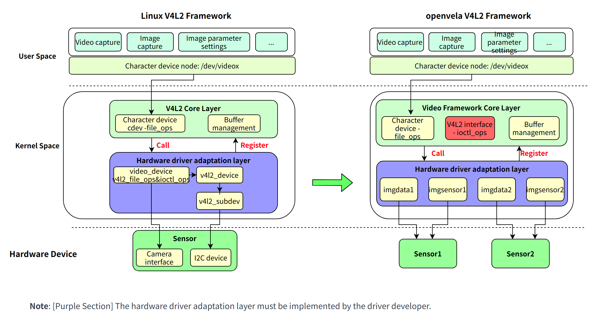
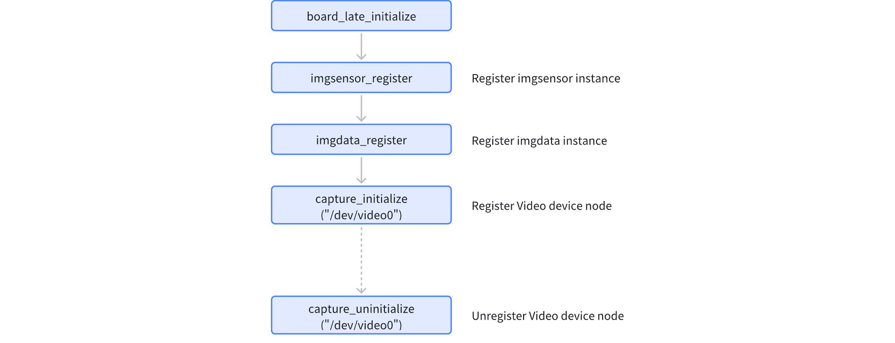

# Camera Driver Framework Guide

\[ [English] | [简体中文](../../../../zh-cn/device_dev_guide/media/camera/Camera_Driver.md) \]

## I. Overview

The `openvela` operating system implements a video driver framework inspired by Video for Linux 2 (V4L2). This framework allows application-layer developers to follow standard V4L2 operating procedures, such as opening a device node, setting the format via an `ioctl` command (`VIDIOC_S_FMT`), requesting buffers (`VIDIOC_REQBUFS`), queuing a buffer (`VIDIOC_QBUF`), and dequeuing it to acquire and process data (`VIDIOC_DQBUF`).



Compared to the standard Linux framework, the core difference in the `openvela` Camera driver framework lies in its **simplified driver adaptation logic**. On the `openvela` platform, adapting a new Camera driver primarily involves implementing the operation interfaces of two abstract layers: `struct imgdata_s` and `struct imgsensor_s`. This significantly reduces the complexity of driver development.

## II. System Configuration

### 1. Enable the Video Framework

Enable the following configuration options in your project's Kconfig file to enable the Video framework.

```Makefile
# General configuration
CONFIG_VIDEO=y
CONFIG_VIDEO_STREAM=y

# Driver path for the host machine in the Simulator environment
CONFIG_HOST_CAMERA_DEV_PATH="/dev/video0"
# Device node actually registered by openvela in the Simulator environment
CONFIG_SIM_CAMERA_DEV_PATH="/dev/video"
```

- In the Linux Simulator environment, when `CONFIG_VIDEO=y` is set, the system automatically selects `CONFIG_SIM_CAMERA`, which enables the video components.
- The `CONFIG_HOST_CAMERA_DEV_PATH` variable should point to the video device path to be used on the host machine, which defaults to `/dev/video0`.

### 2. Enable the Framebuffer

If your application needs to render video images, enable the Framebuffer feature.

```Makefile
# General configuration
CONFIG_VIDEO_FB=y

# Simulator environment configuration
CONFIG_SIM_X11FB=y
CONFIG_SIM_FBHEIGHT=480
CONFIG_SIM_FBWIDTH=640
```

## III. Source Code Directory Structure

- Framework Core Logic:

    ```C++
    nuttx/drivers/video/v4l2_cap.c
    nuttx/drivers/video/v4l2_core.c
    ```

- Physical Device Driver Example:

    ```C++
    nuttx/drivers/video/isx012.c
    nuttx/drivers/video/isx019.c
    ```

- Simulator Driver Source Code:

    ```C++
    nuttx/arch/sim/src/sim/sim_camera.c
    nuttx/arch/sim/src/sim/posix/sim_host_v4l2.c
    ```

## IV. Driver Initialization and Registration

### 1. Registering the Device Node

`openvela` provides two sets of driver registration interfaces: a recommended set that supports multi-instance devices and a legacy set for single-instance devices.

#### Multi-Instance Registration Interface (Recommended)

The `capture_register` interface is the recommended method for registration. It supports mounting multiple `imgsensor` instances to a single `imgdata` instance and allows multiple independent Camera devices to be registered in the system. The code is as follows:

```C++
/* New API to register capture driver.
 *
 *  param [in] devpath: path to capture device
 *  param [in] data: provide imgdata ops
 *  param [in] sensor: provide imgsensor ops array
 *  param [in] sensor_num: the number of imgsensor ops array
 *
 *  Return on success, 0 is returned. On failure,
 *  negative value is returned.
 */

int capture_register(FAR const char *devpath,
                     FAR struct imgdata_s *data,
                     FAR struct imgsensor_s **sensors,
                     size_t sensor_num);

/* New API to Unregister capture driver.
 *
 *  param [in] devpath: path to capture device
 *
 *  Return on success, 0 is returned. On failure,
 *  negative value is returned.
 */

int capture_unregister(FAR const char *devpath);
```

##### Call Flow


##### Core Steps

1. Complete the adaptation for `imgdata` and `imgsensor`.
2. Call the **`capture_register`** interface, passing the corresponding `imgdata`, `imgsensor`, and the device node name (`/dev/videox`) to complete the device node registration.
3. To register multiple device nodes, you can call the **`capture_register`** interface multiple times.
4. Finally, to uninstall a device node, call **`capture_unregister`**, passing the specific device node to be destroyed.

#### Single-Instance Registration Interface (Not Recommended)

This set of interfaces relies on global variables to store instances, so **only one** Camera device can be registered in a system. Newly developed drivers should avoid using these interfaces.

##### Call Flow



##### Core Steps

1. Complete the adaptation for `imgdata` and `imgsensor`.
2. Call `imgsensor_register` to register the `imgsensor` object.
3. Call `imgdata_register` to register the `imgdata` object.
4. Call the `capture_initialize` interface, passing the device node name (`/dev/videox`), to complete the device node registration.

##### External Interfaces

```C++
/* Register image sensor operations. */

int imgsensor_register(FAR struct imgsensor_s *sensor);

/* Register image data operations. */

void imgdata_register(FAR struct imgdata_s *data);

/* Initialize capture driver.
 *
 *  param [in] devpath: path to capture device
 *
 *  Return on success, 0 is returned. On failure,
 *  negative value is returned.
 */

int capture_initialize(FAR const char *devpath);

/* Uninitialize capture driver.
 *
 *  Return on success, 0 is returned. On failure,
 *  negative value is returned.
 */

int capture_uninitialize(FAR const char *devpath);
```

## V. Application Layer Interface

### 1. `ioctl` Commands

The `openvela` Video driver provides users with `ioctl` interfaces compatible with Linux V4L2, including standard and platform-specific interfaces.

#### Standard Interfaces

The system already supports most standard V4L2 interfaces covering a wide range of application scenarios.

```C++
#define VIDIOC_QUERYCAP               _VIDIOC(0x0000)

/* Enumerate the formats supported by device */

#define VIDIOC_ENUM_FMT               _VIDIOC(0x0002)

/* Get the data format */

#define VIDIOC_G_FMT                  _VIDIOC(0x0004)

/* Set the data format */

#define VIDIOC_S_FMT                  _VIDIOC(0x0005)

/* Initiate user pointer I/O */

#define VIDIOC_REQBUFS                _VIDIOC(0x0008)

/* ... (other standard ioctl definitions are the same as in the original text) ... */
```

#### Proprietary Interfaces

The `openvela` platform extends `ioctl` with proprietary interfaces to support advanced features like still image capture and scene parameter settings.

```C
/* Cancel DQBUF
 *  enum #v4l2_buf_type
 */

#define VIDIOC_CANCEL_DQBUF           _VIDIOC(0x00c1)

/* Do halfpush */

#define VIDIOC_DO_HALFPUSH            _VIDIOC(0x00c2)

/* ... (other proprietary ioctl definitions are the same as in the original text) ... */
```

### 2. API Call Flow

The procedure for using V4L2 interfaces on the `openvela` platform is consistent with the standard Linux flow, as described below:

1. Open the device:

    ```C
    int fd=open("/dev/video", O_RDWR);
    ```

2. Query the device: Obtain device capabilities and check if it is a video capture device by testing for `V4L2_CAP_VIDEO_CAPTURE`.

     ```C
    ioctl(fd, VIDIOC_QUERYCAP, &cap);
    ```

3. Set the video frame format: This includes pixel format, width, and height.

    ```C
    ioctl(fd, VIDIOC_S_FMT, &fmt);
    ```

4. Set the video frame rate:

    ```C
    ioctl(fd, VIDIOC_S_PARM, &parm);
    ```

5. Request frame buffers from the driver: The number of buffers should not exceed `V4L2_REQBUFS_COUNT_MAX` (default is 3).

    ```C
    ioctl(fd, VIDIOC_REQBUFS, &req);
    ```

    **Buffer Type Description**: At this point, you can choose `V4L2_MEMORY_MMAP` (memory managed by the driver) or `V4L2_MEMORY_USERPTR` (memory allocated and managed by the user). If `USERPTR` is used, skip steps 6 and 7.

6. (MMAP Mode) Query the length and offset of the frame buffer in kernel space:

    ```C
    ioctl(fd, VIDIOC_QUERYBUF, &buf);
    ```

7. (MMAP Mode) Map the requested frame buffer to user space via `mmap`: This allows direct manipulation of the captured frame without copying.

    ```C
    buffers[i].start = mmap (NULL, buffers[i].length, PROT_READ | PROT_WRITE, 
                            MAP_SHARED,fd, buffers[i].offset); 
    ```

8. Enqueue all requested frame buffers: This makes them available to store captured data.

    ```C
    ioctl(fd, VIDIOC_QBUF, &buf);
    ```

9. Start video capture:

    ```C
    ioctl(fd, VIDIOC_STREAMON, &type);
    ```

10. Loop to process data:

    - Dequeue a buffer to get a frame with captured data and access the raw data.

        ```C
          ioctl(fd, VIDIOC_DQBUF, &buf);
          ```

    - Process the data.

    - After processing, re-enqueue the buffer to the tail of the queue. This allows for continuous capturing until streaming is stopped.

11. Stop video capture:

    ```C
    ioctl (fd, VIDIOC_STREAMOFF, &type);
    ```

12. Release the requested video frame buffers (in MMAP mode) and close the video device:

    ```C
    unmap(buffers[i].start, buffers[i].length); /* MMAP */
    close(fd);
    ```

## VI. Driver Adaptation Guide

The core of driver adaptation is to implement the `imgdata_ops_s` and `imgsensor_ops_s` operation function sets, which collectively define the behavior of the Camera driver.

**Header File Paths:**

```C++
include/nuttx/video/imgdata.h
include/nuttx/video/imgsensor.h
```

### 1. Core Concept: Division of Responsibilities between `imgdata` and `imgsensor`

The `openvela` Camera framework significantly improves driver portability and reusability by decoupling the driver logic into a **platform data interface layer (`imgdata`)** and a **sensor device layer (`imgsensor`)**.


| **Data Structure** | **Functional Description**                                                                                                                                                                                             | **Usage**                                                                                                                                                                                                    |
| :----------------- | :--------------------------------------------------------------------------------------------------------------------------------------------------------------------------------------------------------------------- | :----------------------------------------------------------------------------------------------------------------------------------------------------------------------------------------------------------- |
| **`imgdata`**      | Implements **generic** functions for Camera operations on the **main controller (SoC)**. One `imgdata` can correspond to multiple different `imgsensor`s.                                                              | Calls SoC interfaces to initialize the logic for interfacing with the sensor. Completes the setup of peripheral parameters like MIPI and I2C, and the initialization of the main controller's sensor module. |
| **`imgsensor`**    | Implements functions for operating a **specific Sensor** by **reading and writing its registers**. This interface abstracts away the differences between various sensors, as each has a unique register configuration. | Calls I2C interfaces to configure sensor registers, implementing image parameter settings, and controlling the start and stop of image capture.                                                              |

### 2. Core Data Structure Definitions

```C++
struct imgdata_s
{
  FAR const struct imgdata_ops_s *ops;
};

// Operation function set for the platform data interface layer
struct imgdata_ops_s
{
  // Device initialization and uninitialization
  CODE int (*init)(FAR struct imgdata_s *data);
  CODE int (*uninit)(FAR struct imgdata_s *data);
  
  // Set the buffer address for the driver to fill with captured data
  CODE int (*set_buf)(FAR struct imgdata_s *data,
                      uint8_t nr_datafmts,
                      FAR imgdata_format_t *datafmts,
                      uint8_t *addr, uint32_t size);
                      
  // Set the driver's resolution, pixel format, and frame rate parameters
  CODE int (*validate_frame_setting)(FAR struct imgdata_s *data,
                                     uint8_t nr_datafmts,
                                     FAR imgdata_format_t *datafmts,
                                     FAR imgdata_interval_t *interval);
                                     
  // Start streaming and set the completion callback function
  CODE int (*start_capture)(FAR struct imgdata_s *data,
                            uint8_t nr_datafmts,
                            FAR imgdata_format_t *datafmts,
                            FAR imgdata_interval_t *interval,
                            FAR imgdata_capture_t callback,
                            FAR void *arg);
  // Stop streaming
  CODE int (*stop_capture)(FAR struct imgdata_s *data);
  
  // (Optional) Custom buffer allocation for drivers that require specific buffer types (e.g., uncached)
  CODE void *(*alloc)(FAR struct imgdata_s *data, uint32_t align_size, uint32_t size);
  CODE void (*free)(FAR struct imgdata_s *data, void *addr);
};

struct imgsensor_s
{
  // Defines the operation interfaces related to the sensor
  FAR const struct imgsensor_ops_s *ops;
  // Defines the image formats, resolutions, and frame rates supported by the sensor
  size_t fmtdescs_num;
  FAR const struct v4l2_fmtdesc *fmtdescs;
  size_t frmsizes_num;
  FAR const struct v4l2_frmsizeenum *frmsizes;
  size_t frmintervals_num;
  FAR const struct v4l2_frmivalenum *frmintervals;
};

/* Operation function set for the sensor device layer */
struct imgsensor_ops_s
{
  // Check if the current sensor is available
  CODE bool (*is_available)(FAR struct imgsensor_s *sensor);
  // Sensor initialization and uninitialization
  CODE int  (*init)(FAR struct imgsensor_s *sensor);
  CODE int  (*uninit)(FAR struct imgsensor_s *sensor);
  // Get the driver name
  CODE const char * (*get_driver_name)(FAR struct imgsensor_s *sensor);
  // Set the sensor's resolution, image format, and frame rate parameters
  CODE int  (*validate_frame_setting)(FAR struct imgsensor_s *sensor,
                                      imgsensor_stream_type_t type,
                                      uint8_t nr_datafmts,
                                      FAR imgsensor_format_t *datafmts,
                                      FAR imgsensor_interval_t *interval);
  // Start streaming
  CODE int  (*start_capture)(FAR struct imgsensor_s *sensor,
                             imgsensor_stream_type_t type,
                             uint8_t nr_datafmts,
                             FAR imgsensor_format_t *datafmts,
                             FAR imgsensor_interval_t *interval);
  // Stop streaming
  CODE int  (*stop_capture)(FAR struct imgsensor_s *sensor,
                            imgsensor_stream_type_t type);
  // Get the sensor's frame rate
  CODE int  (*get_frame_interval)(FAR struct imgsensor_s *sensor,
                                  imgsensor_stream_type_t type,
                                  FAR imgsensor_interval_t *interval);

  // Get the image parameters supported by the sensor, such as brightness, contrast, saturation, etc.
  CODE int  (*get_supported_value)(FAR struct imgsensor_s *sensor,
                                   uint32_t id,
                                   FAR imgsensor_supported_value_t *value);
  // Get sensor parameters
  CODE int  (*get_value)(FAR struct imgsensor_s *sensor,
                         uint32_t id, uint32_t size,
                         FAR imgsensor_value_t *value);
  // Set sensor parameters, such as brightness, contrast, etc.
  CODE int  (*set_value)(FAR struct imgsensor_s *sensor,
                         uint32_t id, uint32_t size,
                         imgsensor_value_t value);
};
```

### 3. `imgdata_ops_s` Interface Details

| **Interface Name**             | **Main Logic**                                                                                                                                                                                 |
| :----------------------------- | :--------------------------------------------------------------------------------------------------------------------------------------------------------------------------------------------- |
| `init`/`uninit`                | **Device initialization/uninitialization.**<br>Called when the device node is `open`ed or `close`d.                                                                                            |
| `validate_frame_setting`       | **Check frame format.**<br>Called during `ioctl`s like `VIDIOC_TRY_FMT` and `VIDIOC_S_PARM` to verify if the platform (SoC) supports the requested parameters.                                 |
| `set_buf`                      | **Set the next frame buffer address.**<br>Called by the driver at the start of streaming and after each frame is captured (in the `complete_capture` callback).                                |
| `start_capture`/`stop_capture` | **Start/stop capture.**<br>Called when the video stream state changes (`VIDIOC_STREAMON`/`OFF`).                                                                                               |
| `alloc`/`free`                 | **(Optional) Custom memory allocation/release.**<br>Called when the application requests buffers. If the driver adapts the `alloc` interface, it will be used to allocate video frame buffers. |

### 4. `imgsensor_ops_s` Interface Details

| **Interface Name**             | **Main Logic**                                                                                                                                                     |
| :----------------------------- | :----------------------------------------------------------------------------------------------------------------------------------------------------------------- |
| `is_available`                 | **Check if the sensor is available.**<br>Called during device node registration, specifically within the `capture_register` interface.                             |
| `init`/`uninit`                | **Sensor initialization/uninitialization.**<br>Called on device `open`/`close`. This is typically where sensor power-up, reset, and register initialization occur. |
| `get_driver_name`              | **Get the driver name.**<br>Called during `ioctl`s like `VIDIOC_QUERYCAP` to return device information.                                                            |
| `validate_frame_setting`       | **Check frame format.**<br>Called during `ioctl`s like `VIDIOC_TRY_FMT` to check if the sensor supports the requested resolution, format, frame rate, etc.         |
| `start_capture`/`stop_capture` | **Start/stop capture.**<br>Called when the video stream state changes.                                                                                             |
| `get_frame_interval`           | **Get frame rate parameters.**<br>Called within the `g_parm` interface.                                                                                            |
| `get_supported_value`          | **Get supported image parameters.**<br>Called in interfaces like `querymenu`.                                                                                      |
| `get_value`/`set_value`        | **Get/set image parameters.**                                                                                                                                      |

## VII. Driver Implementation Examples

This section details the driver adaptation process and key technical points through two cases: the Simulator and real hardware (cxd56xx).

### 1. Simulator Camera Driver

The Simulator platform's Camera driver uses the host machine's V4L2 framework to simulate real hardware. Its design clearly demonstrates the division of responsibilities between `imgdata` and `imgsensor`.

- Code Paths:

    ```C++
    nuttx/arch/sim/src/sim/sim_camera.c
    nuttx/arch/sim/src/sim/posix/sim_host_v4l2.c
    ```

- Implementation Characteristics:

    - **`imgdata` handles platform interaction**: The `imgdata_ops_s` implementation encapsulates operations like `open` and `ioctl` on the host machine's `/dev/videoX` node. This logic represents generic, platform-related (Simulator) functionality.
    - **`imgsensor` acts as a logical placeholder**: Since there is no real sensor hardware, most functions in `imgsensor_ops_s` are empty implementations. Only `get_driver_name` returns a virtual name.
    - **Static capability definition**: The sensor's capabilities (e.g., supporting `640x480` resolution) are hardcoded in static array members of the `imgsensor_s` instance for the upper layer to query.

- Example Code:

    ```C++
    // In the sim environment, most adapted interfaces for imgsensor are empty; only get_driver_name returns an actual value.
    static const struct imgsensor_ops_s g_sim_camera_ops =
    {
    .is_available           = sim_camera_is_available,
    .init                   = sim_camera_init,
    .uninit                 = sim_camera_uninit,
    .get_driver_name        = sim_camera_get_driver_name,
    .validate_frame_setting = sim_camera_validate_frame_setting,
    .start_capture          = sim_camera_start_capture,
    .stop_capture           = sim_camera_stop_capture,
    };

    static const char *sim_camera_get_driver_name(struct imgsensor_s *sensor)
    {
    return "V4L2 NuttX Sim Driver";
    }

    /* imgsensor is mainly responsible for defining static capabilities and a name */
    static const struct v4l2_frmsizeenum g_frmsizes[] =
    {
    {
        .type = V4L2_FRMSIZE_TYPE_DISCRETE,
        .discrete =
        {
        .width = 640,
        .height = 480,
        }
    }
    };

    struct imgsensor_s sensor =
    {
        .ops = &g_sim_camera_ops, // ops are mostly empty implementations
        .frmsizes_num = 1,        // Specify the sensor's resolution
        .frmsizes = g_frmsizes,   // Point to the static array defining resolutions
    };
    ```

    ```C++
    // imgdata handles all the actual work of interacting with the Host V4L2
    static const struct imgdata_ops_s g_sim_camera_data_ops =
    {
    .init                   = sim_camera_data_init,  // Open the host video device node
    .uninit                 = sim_camera_data_uninit,// Close the host video device node
    .set_buf                = sim_camera_data_set_buf,// Set the buffer address
    .validate_frame_setting = sim_camera_data_validate_frame_setting, // Set format and frame rate info
    .start_capture          = sim_camera_data_start_capture, // Start streaming, initialize buffers, and send VIDIOC_STREAMON
    .stop_capture           = sim_camera_data_stop_capture,  // Stop streaming, send VIDIOC_STREAMOFF
    };
    ```

### 2. Hardware Camera Driver (cxd56xx Example)

The Sony cxd56xx platform provides drivers for two different sensors (isx012 and isx019). The essence of this case is that they **share a single `imgdata` implementation** but have **separate `imgsensor` implementations**, perfectly illustrating the framework's decoupling philosophy.

#### Reference Code

```C
// Driver registration and initialization entry point
boards/arm/cxd56xx/spresense/src/cxd56_bringup.c
// imgdata (platform layer) adaptation code
arch/arm/src/cxd56xx/cxd56_cisif.c
// imgsensor (device layer) adaptation code
nuttx/drivers/video/isx012.c
nuttx/drivers/video/isx019.c

int cxd56_bringup(void)
{
    ...
#ifdef CONFIG_VIDEO_ISX019
  // Register the isx019 imgsensor
  ret = isx019_initialize();
  if (ret < 0)
    {
      _err("ERROR: Failed to initialize ISX019 board. %d\n", errno);
    }
#endif /* CONFIG_VIDEO_ISX019 */

#ifdef CONFIG_VIDEO_ISX012
  // Register the isx012 imgsensor
  ret = isx012_initialize();
  if (ret < 0)
    {
      _err("ERROR: Failed to initialize ISX012 board. %d\n", errno);
    }
#endif /* CONFIG_VIDEO_ISX012 */

#ifdef CONFIG_CXD56_CISIF
  // Register the cxd56 board imgdata
  ret = cxd56_cisif_initialize();
  if (ret < 0)
    {
      _err("ERROR: Failed to initialize CISIF. %d\n", errno);
      ret = ERROR;
    }
#endif /* CONFIG_CXD56_CISIF */
    ...
}

static const struct imgdata_ops_s g_cxd56_cisif_ops =
{
  .init                   = cxd56_cisif_init,
  .uninit                 = cxd56_cisif_uninit,
  .set_buf                = cxd56_cisif_set_buf,
  .validate_frame_setting = cxd56_cisif_validate_frame_setting,
  .start_capture          = cxd56_cisif_start_capture,
  .stop_capture           = cxd56_cisif_stop_capture,
};

static struct imgdata_s g_cxd56_cisif =
{
  &g_cxd56_cisif_ops
};

static const struct imgsensor_ops_s g_isx012_ops =
{
  isx012_is_available,                  /* is HW available */
  isx012_init,                          /* init */
  isx012_uninit,                        /* uninit */
  isx012_get_driver_name,               /* get driver name */
  isx012_validate_frame_setting,        /* validate_frame_setting */
  isx012_start_capture,                 /* start_capture */
  isx012_stop_capture,                  /* stop_capture */
  NULL,                                 /* get_frame_interval */
  isx012_get_supported_value,           /* get_supported_value */
  isx012_get_value,                     /* get_value */
  isx012_set_value                      /* set_value */
};

static isx012_dev_t g_isx012_private =
{
  {
    &g_isx012_ops,
  },
  NXMUTEX_INITIALIZER,
};

static const struct imgsensor_ops_s g_isx019_ops =
{
  isx019_is_available,
  isx019_init,
  isx019_uninit,
  isx019_get_driver_name,
  isx019_validate_frame_setting,
  isx019_start_capture,
  isx019_stop_capture,
  isx019_get_frame_interval,
  isx019_get_supported_value,
  isx019_get_value,
  isx019_set_value,
};

static isx019_dev_t g_isx019_private =
{
  {
    &g_isx019_ops
  },
  NXMUTEX_INITIALIZER,
  NXMUTEX_INITIALIZER,
};
```

#### Implementation Points

1. Responsibility Separation: The implementations of `imgdata->init` and `imgsensor->init` clearly delineate the responsibilities of the platform and the device:

    - `cxd56_cisif_init` (`imgdata->init`) handles platform-side operations, such as registering interrupt handlers and enabling interrupts.

    - `isx012_init` (`imgsensor->init`) handles sensor-side operations, such as enabling the sensor and initializing its registers.

    ```C++
    static int cxd56_cisif_init(struct imgdata_s *data)
    {
    if (g_state != STATE_STANDBY)
        {
        return -EPERM;
        }
    
    CXD56_PIN_CONFIGS(PINCONFS_IS);
    
    /* enable CISIF clock */
    
    cxd56_img_cisif_clock_enable();
    
    /* disable CISIF interrupt */
    
    cisif_reg_write(CISIF_INTR_DISABLE, ALL_CLEAR_INT);
    cisif_reg_write(CISIF_INTR_CLEAR, ALL_CLEAR_INT);
    
    /* attach interrupt handler */
    
    irq_attach(CXD56_IRQ_CISIF, cisif_intc_handler, NULL);
    
    /* enable CISIF irq  */
    
    up_enable_irq(CXD56_IRQ_CISIF);
    
    #ifdef CISIF_INTR_TRACE
    cisif_reg_write(CISIF_INTR_ENABLE, VS_INT);
    #endif
    
    g_state = STATE_READY;
    return OK;
    }
    
    static int isx012_init(FAR struct imgsensor_s *sensor)
    {
    FAR isx012_dev_t *priv = (FAR isx012_dev_t *)sensor;
    int ret = 0;
    
    priv->i2c               = board_isx012_initialize();
    priv->i2c_cfg.address   = ISX012_I2C_SLV_ADDR;
    priv->i2c_cfg.addrlen   = 7;
    priv->i2c_cfg.frequency = I2CFREQ_STANDARD;
    
    ret = board_isx012_power_on();
    if (ret < 0)
        {
        verr("Failed to power on %d\n", ret);
        return ret;
        }
    
    ret = init_isx012(priv);
    if (ret < 0)
        {
        verr("Failed to init_isx012 %d\n", ret);
        board_isx012_set_reset();
        board_isx012_power_off();
        return ret;
        }
    
    return ret;
    }
    ```

2. `imgdata` Supports Custom Memory Management:

    If the hardware (e.g., a DMA controller) requires a special type of memory like `uncached` to ensure data consistency, the driver can specify a custom memory allocator by implementing the `alloc` and `free` interfaces in `imgdata_ops_s`.

    ```C++
    /* Register custom memory allocation functions in the imgdata operation set */
    const struct imgdata_ops_s dcam_ops = {
            .init    = dcam_init,
            .uninit  = dcam_uninit,
            .set_buf = dcam_set_buf,
            .validate_frame_setting = dcam_validate_frame_setting,
            .start_capture = dcam_start_capture,
            .stop_capture  = dcam_stop_capture,
    #ifdef CONFIG_DCAM_UNCACHE_MEM
            .alloc = dcam_malloc,
            .free  = dcam_free,
    #endif
    };
    
    void *dcam_malloc(FAR struct imgdata_s *data, uint32_t align_size, uint32_t size)
    {
        return uncache_memalign(align_size, size);
    }
    
    void dcam_free(FAR struct imgdata_s *data, void *heap)
    {
        uncache_free(heap);
    }
    ```

3. Static Capability Definition:

    - Fixed capabilities of the sensor, such as supported resolutions and frame rates, are typically defined as static arrays within the `imgsensor_s` structure. This allows the V4L2 core layer to use them when responding to `ioctl` queries.

## VIII. Driver Testing

Once the camera driver adaptation is complete, you can use the `nxcamera` tool provided by openvela for testing.

For details, please see the [Camera Testing Guide](./Camera_Testing.md).