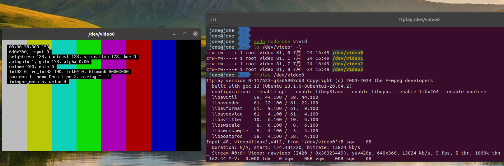
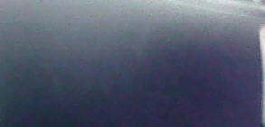

# Camera Functional Testing Guide

\[ [English] | [简体中文](../../../../zh-cn/device_dev_guide/media/camera/Camera_Testing.md) \]

This guide details how to test camera functionality in the `openvela` real-time operating system. By using the `nxcamera` application with either a physical camera or a virtual camera, you can complete the entire process from environment setup to functional validation.

## I. Environment Setup

Before starting the test, you must first prepare a camera device in the `openvela` system. You can choose to use a physical USB camera or, if one is not available, a virtual camera provided by a Linux system.

### Option 1: Using a Physical Camera

1. Identify the Device Node.

    Connect a USB camera to your Linux host and execute the following command to find its device node.

    ```Bash
    ls /dev/video*
    ```

    The system will list all available video devices, for example:

    ```bash
    /dev/video0  /dev/video1  /dev/video2  /dev/video3
    /dev/video4  /dev/video5
    ```

2. Configure the `openvela` System.

    Select a device node (e.g., `/dev/video0`) and enable the following configurations in `menuconfig` to pass the device through to the `openvela` system.

    ```Makefile
    CONFIG_VIDEO=y
    CONFIG_VIDEO_STREAM=y
    CONFIG_HOST_CAMERA_DEV_PATH="/dev/video0"
    ```

### Option 2: Using a Virtual Camera

If your development environment lacks a physical camera, `openvela` supports testing with a virtual camera. We recommend creating a V4L2 (Video4Linux2) virtual camera on your Linux host using one of the following two methods.

#### Method 1: Use the Vivid Driver

Vivid is a virtual video driver included in the Linux kernel that can simulate various video device features, making it a convenient choice for testing.

1. Load the **Vivid** driver.

    Execute the following command to load the driver module.

    ```Bash
    # Load
    sudo modprobe vivid
    ```

2. Verify the virtual device.

    After the driver loads, the system typically creates several `/dev/video*` device nodes. By default, `/dev/video0` is a usable video capture device. You can use the `ffplay` command to verify that it is working correctly.

    ```Bash
    ffplay /dev/video0
    ```

    If a video window appears showing color bars or a test pattern, the virtual camera has been created successfully.

    

3. (Optional) Unload the **Vivid** driver. After testing is complete, you can use the following command to unload the driver if needed.

    ```Bash
    # Unload
    sudo modprobe -r vivid
    ```

#### Method 2: Use v4l2loopback and FFmpeg

This method allows you to use a video file, screen capture, or any other FFmpeg-supported video source as input for the virtual camera, offering greater customization.

1. Install the v4l2loopback module.

    On Debian/Ubuntu-based systems, run the following command to install it. For other Linux distributions, use the appropriate package manager.

    ```Bash
    sudo apt-get -y install v4l2loopback-dkms
    ```

2. Load the v4l2loopback module.

    ```bash
    sudo modprobe v4l2loopback
    ```

3. (Optional) Disable Secure Boot on Ubuntu 20.04+.

    If the module fails to load due to signature issues, you may need to disable Secure Boot. Execute the following commands:

    ```bash
    sudo apt install mokutil
    sudo mokutil --disable-validation
    
    reboot
    ```

    After rebooting, select `change secure boot state` in the MOK management screen, enter the password characters as prompted, then select `Disable Secure Boot` and confirm.

4. Verify module loading.

    Run the `lsmod | grep v4l2loopback` command. If you see output similar to the following, the module has loaded successfully.

    ```bash
    v4l2loopback           57344  2
    videodev              315392  6 videobuf2_v4l2,v4l2loopback,uvcvideo,videobuf2_common
    ```

5. Install FFmpeg and stream to the virtual device.

    First, install FFmpeg.

    ```Bash
    sudo apt install ffmpeg
    ```

    Next, use FFmpeg to capture your desktop and stream it as a video feed to the `/dev/video0` device.

    ```Bash
    ffmpeg -f x11grab -r 30 -s 640x480 -i $DISPLAY -vcodec rawvideo -pix_fmt yuv420p -threads 0 -f v4l2 /dev/video0
    ```

    **Note**: This command captures the screen at a resolution of 640x480 and a frame rate of 30fps, converting it to the `yuv420p` (YU12) format for streaming.

6. Verify the virtual camera.

    Open a new terminal and use `ffplay` to play the virtual device node.

    ```Bash
    ffplay -i /dev/video0
    ```

    If you see a real-time capture of your screen, the virtual camera is working correctly.

    

## II. Testing with `nxcamera`

`nxcamera` is the command-line application in the `openvela` system used for camera functional validation.

### Step 1: Configuration and Compilation

1. Enable Required Components.

    In `menuconfig`, you must enable the `nxcamera` application and the `libyuv` library. `libyuv` is used to convert the raw YUV data captured from the camera into the RGB format required by the Framebuffer.

    ```Makefile
    CONFIG_LIBYUV=y
    CONFIG_SYSTEM_NXCAMERA=y
    ```

2. Recompile the System.

    Save the configuration and recompile the `openvela` firmware.

### Step 2: Running and Validation

1. Start `nxcamera`.

    In the `openvela` shell (Nsh), run the `nxcamera` command to start the application.

    ```Shell
    nsh> nxcamera
    ```

2. Execute Test Commands.

    Enter the following commands sequentially to configure the video input source, the output destination, and to start the video stream.

    - Specify the input device:

        ```Shell
        nxcamera> input /dev/video
        ```

    - Specify the output device:

        ```Shell
        nxcamera> output /dev/fb0
        ```

    - Start the video stream:

        ```Shell
        nxcamera> stream 640 480 30 YU12
        ```

        or

        ```Shell
        nxcamera> stream 640 480 30 YUYV
        ```

3. Understanding the Command Parameters.

    - `input`: Specifies the video input device path within the `openvela` system.
    - `output`: Specifies the Framebuffer device path within the `openvela` system.
    - `stream`: Sets the `width`, `height`, `framerate`, and `video format` of the video stream, in that order.

        - The format parameter is a [FourCC](https://en.wikipedia.org/wiki/FourCC) code. Currently, `nxcamera` **only supports** **`YUYV`** **and** **`YU12`** **formats by default**. Ensure this format matches the output of your camera (physical or virtual).
        - The source code for `nxcamera` is located in the `apps/system/nxcamera` directory. If you encounter an unsupported video format during debugging, you can modify the source code to call other format conversion functions available in the `libyuv` library to support additional input formats.

4. View the Results.

    After executing the commands, you will see logs indicating that the video stream has started successfully.

    ```Bash
    nxcamera> input /dev/video
    nxcamera> 
    nxcamera> output /dev/fb0
    nxcamera> 
    nxcamera> stream 640 480 30 YUYV
    nxcamera_stream: ==============================
    nxcamera_stream: streaming video
    nxcamera_stream: ==============================
    nxcamera_loopthread: Entry
    nxcamera> 
    ```

    At this point, you should see the live image from the camera (physical or virtual) on the Framebuffer display simulated by `openvela`.

    - Result on Framebuffer with a physical camera:

        

    - Result on Framebuffer with the Vivid virtual driver:

        
