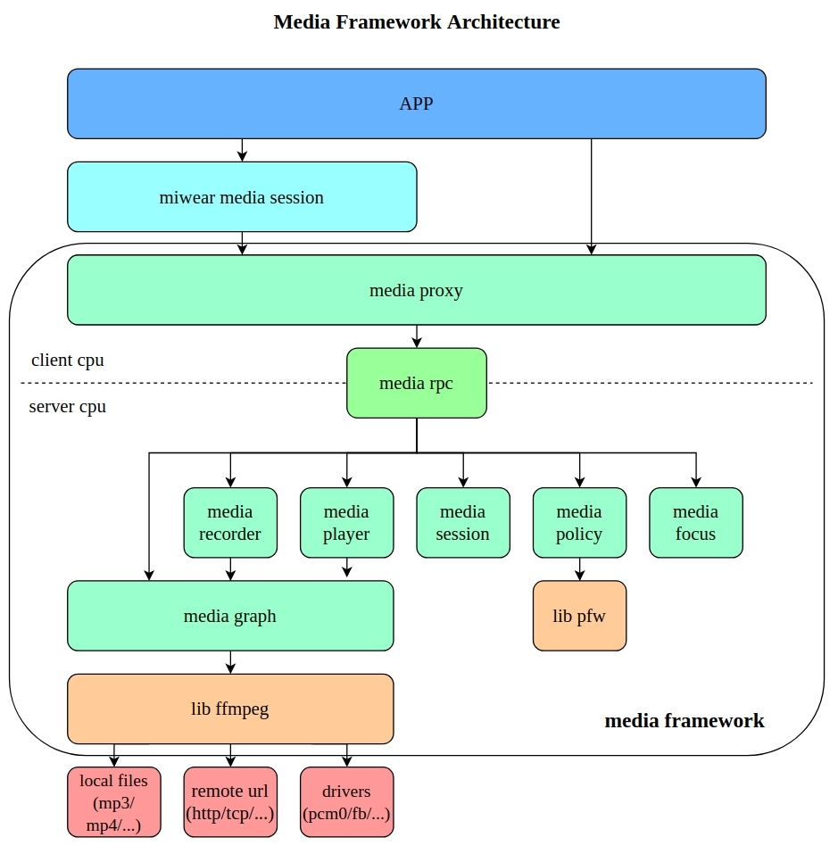
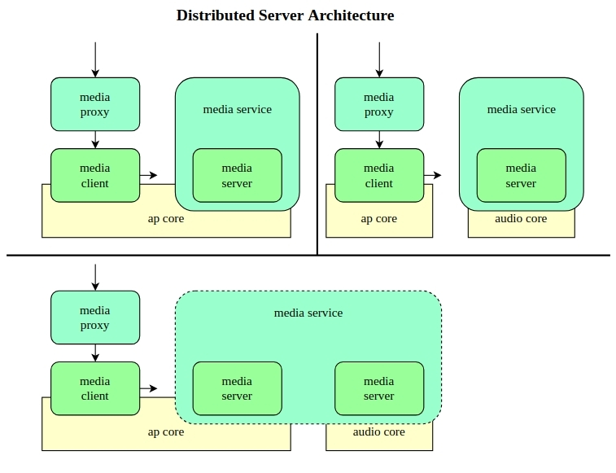

# Media Framework

[English | [简体中文](../../../zh-cn/device_dev_guide/media/media_framework.md)]

## I. Overview

The Media Framework is a library for processing audio and video, providing a rich set of APIs for applications. The Media Framework uses a **Client-Server (CS) architecture**, where the client interface packs commands and sends them via RPC to the server, and the server's loop performs the actual work. The Media Framework supports the playback and recording of various audio and video formats and features a distributed architecture that can run on multiple CPUs.

## II. Features

The main functional modules of the Media Framework include **Media Player**, **Media Recorder**, **Media Focus**, **Media Policy**, and **Media Session**. **Media Player** and **Media Recorder** are encapsulated by the **Media Graph** module.

### 1. Media Player

- **Playback Service**: Creates a player instance and controls playback.
- **Format Support**: Supports various audio and video formats, ensuring broad compatibility.
- **Playback Control**: Provides rich playback control functions, such as play, pause, stop, and fast-forward, to meet various user needs for audio and video playback.

### 2. Media Recorder

- **Recording Service**: Creates a recorder instance and controls recording.
- **Format Support**: Supports various audio and video formats, ensuring broad compatibility.
- **Recording Control**: Provides rich recording control functions, such as start, pause, and stop recording, to meet various user needs for audio and video recording.

### 3. Media Focus

Through its focus management mechanism, it effectively handles competition for media focus among multiple applications, ensuring that only one application can gain media focus and play media at any given time. Users can subscribe to focus events, participate in the **focus preemption** logic, and receive behavioral suggestions from the focus manager, resulting in a smooth user experience.

### 4. Media Policy

Media Policy uses **PFW** to construct various states, such as routing and audio policies. It can be extended through plugins to support features like handling FFmpeg commands and setting device parameters. Additionally, by writing policy configuration files and setting parameters for the policy, you can change some of the Graph's global states according to predefined strategies in the configuration file—such as switching input/output device paths and controlling volume—providing users with a highly customizable media processing environment.

### 5. Media Session

It adopts a controller-and-controllable architecture to achieve fine-grained control and status notifications for media playback. It provides functions for registering controllers and controllables, sending control commands, handling event notifications, and updating media metadata, facilitating unified management and control over multiple media clients.

### 6. Media RPC

It uses a dual-socket communication model: two independent sockets are used for communication, regardless of whether it's cross-core.

- **Trans socket**: Responsible for transmitting control commands from the Client to the Server and returning RPC execution results.
- **Notify socket**: Responsible for transmitting message notifications from the Server to the Client, which are delivered to the user via callbacks.

- **Generality**: The RPC mechanism is common for Player, Recorder, Session, Policy, and Focus users, allowing applications to communicate between different CPUs.
- **Mode Support**: The Media Framework supports both synchronous and asynchronous RPC modes.

    - **Synchronous Mode**: The client sends a request and waits for the server's response, suitable for scenarios requiring immediate feedback.
    - **Asynchronous Mode**: The client sends a request and returns immediately. The server notifies the client via a callback after processing the request. This provides an efficient communication mechanism, ensuring data transmission reliability and real-time performance.

## III. Media Framework Architecture

- [Client Model](./client/media_client.md)
- [Server Model](./server/media_server.md)

## IV. Test Media Framework

The Mediatool test program is used to test the Media Framework API and can simulate real-world usage scenarios.

[Mediatool User Guide](./mediatool.md)
