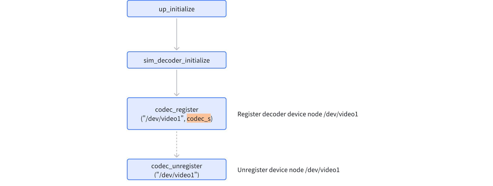
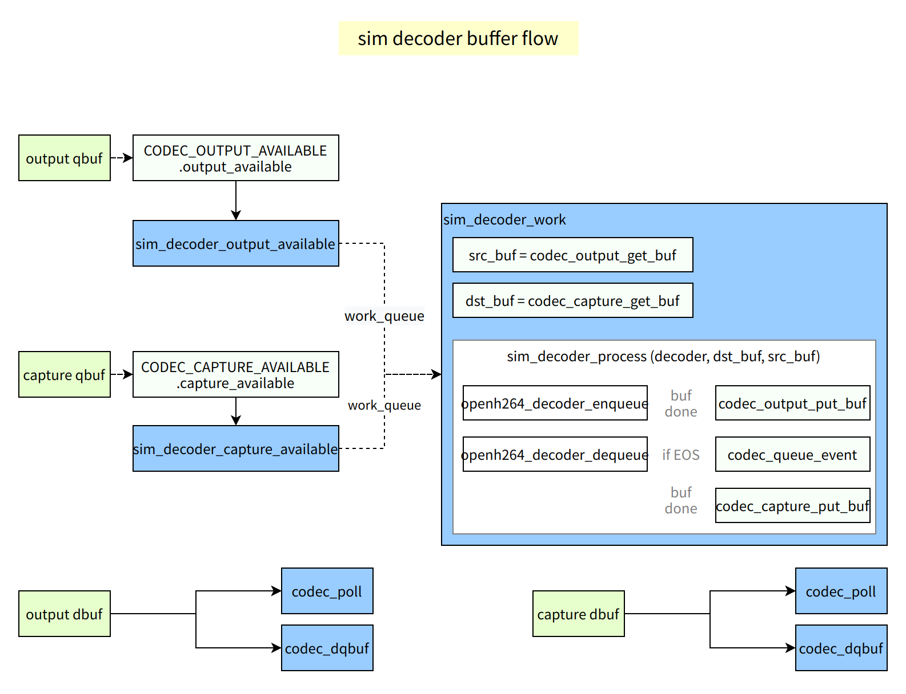

# V4L2 M2M Codec Driver Development Guide

[English | [简体中文](../../../../zh-cn/device_dev_guide/media/v4l2/v4l2_m2m_driver_guide.md)]

## I. Overview

### 1. Target Audience and Scope

This guide is intended for embedded driver development engineers from chip vendors.

This document provides a detailed explanation of how to adapt and develop hardware video codec drivers based on the V4L2 M2M (Memory-to-Memory) Codec framework in the `openvela` real-time operating system. It also introduces related debugging methods and best practices.

> **Note:** To keep this document concise, the adaptation process for a decoder will be used as the primary example. The adaptation flow for an encoder is highly similar, and common parts will not be repeated.

### 2. Core Code Paths

The driver development process primarily involves the following code files:

- **M2M Framework Core:**

    - `drivers/video/v4l2_m2m.c`
    - `drivers/video/v4l2_core.c`
    - `drivers/video/video_framebuff.c`

- **Framework Public Header File:**

    - `include/nuttx/video/v4l2_m2m.h`

- **Reference Implementation:**

    - `arch/sim/src/sim/sim_decoder.c` (Decoder)
    - `arch/sim/src/sim/sim_encoder.c` (Encoder)

## II. Driver Registration and Lifecycle

A V4L2 Codec driver is typically registered during the system startup phase. The core flow is as follows:



### Core Steps

1. **Implement the driver's core logic:** Based on the hardware's characteristics, the developer must fully implement the callback functions defined in the `codec_ops_s` structure and encapsulate them within a `codec_s` structure.
2. **Register the device node:** In the driver's initialization function, call the `codec_register()` interface. This function takes the device node path (e.g., `/dev/video0`) and the instantiated `codec_s` structure as parameters to register a V4L2 Codec device with the system.
3. **Unregister the device node:** When the device is no longer needed (e.g., when the module is unloaded), the `codec_unregister()` interface should be called to release resources and remove the device node.

## III. Core of Driver Implementation: `codec_ops_s` Explained

The `codec_ops_s` structure is the bridge connecting the V4L2 M2M framework to the underlying hardware codec. The **primary task** for a driver developer is to populate the function pointers in this structure to respond to calls from the framework.

```C
struct codec_ops_s
{
  CODE int (*open)(FAR void *cookie, FAR void **priv);
  CODE int (*close)(FAR void *priv);

  CODE int (*capture_streamon)(FAR void *priv);
  CODE int (*output_streamon)(FAR void *priv);
  CODE int (*capture_streamoff)(FAR void *priv);
  CODE int (*output_streamoff)(FAR void *priv);

  CODE int (*capture_available)(FAR void *priv);
  CODE int (*output_available)(FAR void *priv);

  /* VIDIOC_QUERYCAP handler */

  CODE int (*querycap)(FAR void *priv,
                       FAR struct v4l2_capability *cap);

  /* VIDIOC_ENUM_FMT handlers */

  CODE int (*capture_enum_fmt)(FAR void *priv,
                               FAR struct v4l2_fmtdesc *fmt);

  CODE int (*output_enum_fmt)(FAR void *priv,
                              FAR struct v4l2_fmtdesc *fmt);

  /* VIDIOC_G_FMT handlers */

  CODE int (*capture_g_fmt)(FAR void *priv,
                            FAR struct v4l2_format *fmt);
  CODE int (*output_g_fmt)(FAR void *priv,
                           FAR struct v4l2_format *fmt);

  /* VIDIOC_S_FMT handlers */

  CODE int (*capture_s_fmt)(FAR void *priv,
                            FAR struct v4l2_format *fmt);
  CODE int (*output_s_fmt)(FAR void *priv,
                           FAR struct v4l2_format *fmt);

  /* VIDIOC_TRY_FMT handlers */

  CODE int (*capture_try_fmt)(FAR void *priv,
                              FAR struct v4l2_format *fmt);
  CODE int (*output_try_fmt)(FAR void *priv,
                             FAR struct v4l2_format *fmt);

  /* Buffer handlers  */

  CODE size_t (*capture_g_bufsize)(FAR void *priv);
  CODE size_t (*output_g_bufsize)(FAR void *priv);

  /* Stream type-dependent parameter ioctls */

  CODE int (*capture_g_parm)(FAR void *priv,
                             FAR struct v4l2_streamparm *parm);
  CODE int (*output_g_parm)(FAR void *priv,
                            FAR struct v4l2_streamparm *parm);
  CODE int (*capture_s_parm)(FAR void *priv,
                             FAR struct v4l2_streamparm *parm);
  CODE int (*output_s_parm)(FAR void *priv,
                            FAR struct v4l2_streamparm *parm);

  /* Control handlers */

  CODE int (*g_ext_ctrls)(FAR void *priv,
                          FAR struct v4l2_ext_controls *ctrls);
  CODE int (*s_ext_ctrls)(FAR void *priv,
                          FAR struct v4l2_ext_controls *ctrls);

  /* Crop ioctls */

  CODE int (*capture_g_selection)(FAR void *priv,
                                  FAR struct v4l2_selection *clip);
  CODE int (*output_g_selection)(FAR void *priv,
                                 FAR struct v4l2_selection *clip);
  CODE int (*capture_s_selection)(FAR void *priv,
                                  FAR struct v4l2_selection *clip);
  CODE int (*output_s_selection)(FAR void *priv,
                                 FAR struct v4l2_selection *clip);
  CODE int (*capture_cropcap)(FAR void *priv,
                              FAR struct v4l2_cropcap *cropcap);
  CODE int (*output_cropcap)(FAR void *priv,
                             FAR struct v4l2_cropcap *cropcap);

  /* Event handlers */

  CODE int (*subscribe_event)(FAR void *priv,
                              FAR struct v4l2_event_subscription *sub);

  /* Command handlers */

  CODE int (*decoder_cmd)(FAR void *priv,
                          FAR struct v4l2_decoder_cmd *cmd);
  CODE int (*encoder_cmd)(FAR void *priv,
                          FAR struct v4l2_encoder_cmd *cmd);
};
```

The core function of each interface is detailed below:

| **Interface Name**                             | **Core Responsibility and Calling Context**                                                                                                                                                                                                                                                                                                                                                                                                                                                                                  |
| :--------------------------------------------- | :--------------------------------------------------------------------------------------------------------------------------------------------------------------------------------------------------------------------------------------------------------------------------------------------------------------------------------------------------------------------------------------------------------------------------------------------------------------------------------------------------------------------------- |
| `open`                                         | Called by the framework when the application layer calls `open()` on the device node. The developer should initialize single-instance resources here.<br>**Parameter Description:**<br>`cookie`: A session handle maintained by the M2M framework layer, used for subsequent calls to framework-provided APIs (e.g., `codec_*_get_buf`).<br>`priv`: A private data pointer allocated and returned by the driver, used to store the context for this instance. The framework passes it transparently to subsequent callbacks. |
| `close`                                        | Called by the framework when the application layer calls `close()` on the device node.<br>The developer should release the private resources allocated during `open`.                                                                                                                                                                                                                                                                                                                                                        |
| `output_streamon`                              | Responds to `VIDIOC_STREAMON` (`OUTPUT` queue).<br>At this point, the input format is determined, the driver can get the decoded image format, and the Decoder can be initialized.                                                                                                                                                                                                                                                                                                                                           |
| `capture_streamon`                             | Responds to `VIDIOC_STREAMON` (`CAPTURE` queue).<br>At this point, the buffers are ready, and the work queue (`work_queue`) can be started to begin data processing.                                                                                                                                                                                                                                                                                                                                                         |
| `output_streamoff`                             | Responds to `VIDIOC_STREAMOFF` (`OUTPUT` queue).<br>Stops receiving new input data.                                                                                                                                                                                                                                                                                                                                                                                                                                          |
| `capture_streamoff`                            | Responds to `VIDIOC_STREAMOFF` (`CAPTURE` queue).<br>Stops processing and outputting data and ensures that any data cached inside the hardware is flushed.                                                                                                                                                                                                                                                                                                                                                                   |
| `output_available`                             | Called by the framework when the application layer provides a frame of data to be processed (e.g., an H.264 stream) to the `OUTPUT` queue via `QBUF`.<br>This typically triggers a work queue to process the new data, allowing the underlying decoder to prepare for decoding.                                                                                                                                                                                                                                              |
| `capture_available`                            | Called by the framework when the application layer returns an empty `CAPTURE` buffer to the driver via `QBUF`.<br>This typically triggers a work queue to fill this buffer.                                                                                                                                                                                                                                                                                                                                                  |
| `querycap`                                     | Responds to `VIDIOC_QUERYCAP`.<br>Populates the `v4l2_capability` structure to report the driver's capabilities to the application layer, such as device type and streaming support.                                                                                                                                                                                                                                                                                                                                         |
| `output_enum_fmt`                              | Responds to `VIDIOC_ENUM_FMT` (`OUTPUT` queue).<br>Enumerates the input data formats supported by the driver:<br>Decoder: `V4L2_PIX_FMT_H264`, etc.<br>Encoder: `V4L2_PIX_FMT_YUV420`, etc.                                                                                                                                                                                                                                                                                                                                  |
| `capture_enum_fmt`                             | Responds to `VIDIOC_ENUM_FMT` (`CAPTURE` queue).<br>Enumerates the output data formats supported by the driver:<br>Decoder: `V4L2_PIX_FMT_YUV420`, etc.<br>Encoder: `V4L2_PIX_FMT_H264`, etc.                                                                                                                                                                                                                                                                                                                                |
| `output_s_fmt` / `capture_s_fmt`               | Responds to `VIDIOC_S_FMT`.<br>Sets parameters for the input/output queue, such as pixel format and resolution.                                                                                                                                                                                                                                                                                                                                                                                                              |
| `output_g_fmt` / `capture_g_fmt`               | Responds to `VIDIOC_G_FMT`.<br>Gets the current format of the input/output queue.                                                                                                                                                                                                                                                                                                                                                                                                                                            |
| `output_try_fmt` / `capture_try_fmt`           | Responds to `VIDIOC_TRY_FMT`.<br>Validates and adjusts the format that the application layer attempts to set.                                                                                                                                                                                                                                                                                                                                                                                                                |
| `output_g_bufsize`                             | Returns the recommended size for a single buffer in the `OUTPUT` queue.<br>For a decoder, this should be set to a size that can accommodate the largest compressed frame (e.g., max I-frame).                                                                                                                                                                                                                                                                                                                                |
| `capture_g_bufsize`                            | Returns the recommended size for a single buffer in the `CAPTURE` queue.<br>For a decoder, this is the size of one decoded raw image (e.g., YUV) (w * h * 3 / 2).<br>For an encoder, this is the size of the largest compressed frame after encoding.                                                                                                                                                                                                                                                                        |
| `alloc_buf`/`free_buf`                         | **Optional.**<br>The current M2M mmap buffer mode internally uses the `kumm_memalign(align:32)` memory allocation interface.<br>If the hardware has special memory requirements (e.g., physically contiguous), implement these two functions to override the framework's default memory allocation behavior.                                                                                                                                                                                                                 |
| `decoder_cmd`                                  | `VIDIOC_DECODER_CMD`: Handles decoding control commands, such as `START`, `STOP`, `PAUSE`, `FLUSH`.                                                                                                                                                                                                                                                                                                                                                                                                                          |
| `encoder_cmd`                                  | `VIDIOC_ENCODER_CMD`: Handles encoding control commands, such as `START`, `STOP`, `PAUSE`.                                                                                                                                                                                                                                                                                                                                                                                                                                   |
| `g_ext_ctrls`/`s_ext_ctrls`                    | `VIDIOC_G_EXT_CTRLS` / `VIDIOC_S_EXT_CTRLS`: Batch gets or sets extended control parameters, such as an encoder's GOP, bitrate, Profile, etc.                                                                                                                                                                                                                                                                                                                                                                                |
| `output_g/s_parm` `capture_g/s_parm`           | `VIDIOC_G_PARM` / `VIDIOC_S_PARM`: Gets or sets stream parameters, such as frame rate and field format.                                                                                                                                                                                                                                                                                                                                                                                                                      |
| `output_g/s_selection` `capture_g/s_selection` | Gets or sets the processing region for the input/output.                                                                                                                                                                                                                                                                                                                                                                                                                                                                     |
| `capture_cropcap`/`output_cropcap`             | `VIDIOC_CROPCAP`: Gets the cropping parameters for the input/output.                                                                                                                                                                                                                                                                                                                                                                                                                                                         |
| `subscribe_event`                              | `VIDIOC_SUBSCRIBE_EVENT`: Allows the application layer to subscribe to driver events, such as `V4L2_EVENT_EOS`.                                                                                                                                                                                                                                                                                                                                                                                                              |

## IV. M2M Framework Helper APIs

The V4L2 M2M framework provides a series of helper APIs for the lower-half driver to simplify device management, buffer interaction, and event notification.

### 1. Device Registration and Unregistration

```C++
/* Register a V4L2 M2M Codec device */
int codec_register(FAR const char *devpath, FAR struct codec_s *codec);

/* Unregister a V4L2 M2M Codec device */
int codec_unregister(FAR const char *devpath);
```

### 2. Buffer Interaction

The driver uses the following APIs to get and return data buffers from the M2M framework. This is the core of implementing the data processing stream.

```C++
// Get a buffer from M2M
// Decoding scenario:
// - The output queue stores compressed video data. output_get_buf gets one frame of compressed data from the M2M output queue.
// - The capture queue stores decoded video frames. capture_get_buf gets an empty buffer from the M2M capture queue to be filled with decoded data.

// Encoding scenario:
// - The output queue stores raw video data. output_get_buf gets one frame of raw data from the M2M output queue.
// - The capture queue stores compressed encoded data. capture_get_buf gets an empty buffer from the M2M capture queue to be filled with encoded data.

// Get a buffer to be processed from the OUTPUT queue
FAR struct v4l2_buffer *codec_output_get_buf(FAR void *cookie);

// Get an empty buffer from the CAPTURE queue to fill with results
FAR struct v4l2_buffer *codec_capture_get_buf(FAR void *cookie);

// Return a processed OUTPUT buffer to the framework
int codec_output_put_buf(FAR void *cookie, FAR struct v4l2_buffer *buf);

// Return a filled CAPTURE buffer to the framework, making it visible to the application layer
int codec_capture_put_buf(FAR void *cookie, FAR struct v4l2_buffer *buf);
```

**Usage Example (Decoder):**

1. In the work queue, call `codec_output_get_buf()` to get a frame of compressed data to be decoded (e.g., H.264).
2. Call `codec_capture_get_buf()` to get an empty buffer to store the decoding result (e.g., YUV).
3. Send the compressed data to the hardware for decoding and fill the specified buffer with the decoded YUV data.
4. Call `codec_output_put_buf()` to return the used compressed data buffer.
5. Call `codec_capture_put_buf()` to return the buffer filled with the decoding result.

### 3. Event Notification

The driver can use this API to proactively send asynchronous events to the application layer.

```C++
// The driver sends an event to the application, e.g., sending an EOS event when encoding/decoding is finished.
int codec_queue_event(FAR void *cookie, FAR struct v4l2_event *evt);
```

## V. Key Development Considerations and Best Practices

### 1. Setting the Compressed Data Buffer Size

Setting a reasonable buffer size for the compressed data queue (the `OUTPUT` queue for a decoder, the `CAPTURE` queue for an encoder) is crucial. This size is defined by implementing `output_g_bufsize` or `capture_g_bufsize` and takes effect when the application layer calls `VIDIOC_REQBUFS`.

- **Decoder (`output_g_bufsize`)**: The size of incoming compressed frames is variable. It is recommended to set the buffer size to a safe upper limit, for example, half the size of the raw image at the target resolution.

    - **Example**: For `640x480` `YUV420P` format, the raw image size is `640 * 480 * 3 / 2 = 460800` bytes. The input buffer size can be set to `230400` bytes.

- **Encoder (`capture_g_bufsize`)**: The size of outgoing compressed frames is also variable. It is recommended to set this to the size of the largest possible I-frame that the hardware might produce.

### 2. Implementing Zero-Copy Data Flow

The `openvela` V4L2 M2M framework is designed to promote zero-copy data flow to maximize performance. The driver should avoid unnecessary internal data copying and let the framework manage the buffer lifecycle.

#### Default Memory Management Mode

If the hardware has no special memory requirements, the driver should rely entirely on the M2M framework for memory management.

1. **Memory Allocation**: When the application layer calls `VIDIOC_REQBUFS`, the M2M framework allocates all buffers using `kumm_memalign(32, ...)` based on the `g_bufsize` callback provided by the driver.
2. **Data Processing (Decoder example)**:

    - **Input**: The buffer address obtained via `codec_output_get_buf()` is passed directly to the hardware for decoding.
    - **Output**: The hardware writes the decoding result directly to the buffer address obtained from `codec_capture_get_buf()`.

3. **Memory Release**: When the application closes the device, the framework automatically releases all buffers.

#### Custom Memory Allocation Mode

If the hardware requires special memory (e.g., physically contiguous, specific address range), the driver needs to adapt the `alloc_buf` and `free_buf` callbacks.

1. **Implement Interfaces**: Provide specific implementations for `alloc_buf` and `free_buf` in `codec_ops_s`, calling the chip platform's dedicated memory allocator internally.
2. **Data Flow**: The buffer interaction flow is identical to the default mode. The driver still interacts with the framework via the `get_buf`/`put_buf` APIs, achieving zero-copy.

## VI. Practical Case: Simulator Driver

`openvela` provides a set of simulator drivers based on openH264 (decoding) and x264 (encoding). They are the best reference for learning and developing V4L2 M2M drivers.

### 1. Environment Configuration

Enable the following configuration options in `menuconfig` to use codec capabilities in the i386 simulator environment.

#### Video Decoder Configuration

```Makefile
CONFIG_SIM_VIDEO_DECODER=y
CONFIG_SIM_VIDEO_DECODER_DEV_PATH="/dev/video1"
CONFIG_VIDEOUTILS_OPENH264=y
```

#### Video Encoder Configuration

```Makefile
CONFIG_SIM_VIDEO_ENCODER=y
CONFIG_SIM_ENCODER_DEV_PATH="/dev/video2"
CONFIG_VIDEOUTILS_LIBX264=y
```

#### Common Video Dependencies

```C
CONFIG_VIDEO=y
CONFIG_DRIVERS_VIDEO=y
CONFIG_VIDEO_STREAM=y
```

### 2. Detailed Explanation of the Simulator Decoder

#### Initialization Flow

The `sim_decoder` driver calls `codec_register` via the `sim_decoder_initialize` function during system startup, creating the `/dev/video1` device node in the VFS. When the application layer `open`s this node, it triggers `codec_open`, which in turn calls the driver's `open` callback to create the instance and initialize buffers.


#### Buffer Processing Flow

The core decoding task of `sim_decoder` is executed asynchronously in a work queue (`sim_decoder_work`). This task is triggered by the `sim_decoder_output_available` and `sim_decoder_capture_available` callbacks.



#### Ops Implementation Analysis (`g_sim_decoder_ops`)

`g_sim_decoder_ops` is the `sim_decoder` driver's specific implementation of the `codec_ops_s` interface. The implemented APIs are as follows:

- **Stream Control Interfaces (`streamon`/`streamoff`)**

    - `sim_decoder_output_streamon`: When this callback is triggered, it initializes the openH264 decoder instance and configures related parameters.
    - `sim_decoder_capture_streamon`: When this callback is triggered, it indicates that the M2M layer's buffers are ready, at which point the work queue is scheduled to start decoding.
    - `sim_decoder_output_streamoff`: Sets a flush state and starts the work queue to process all remaining buffered frames in the decoder.
    - `sim_decoder_capture_streamoff`: Closes and releases the openH264 decoder instance.

- **Data Availability Interfaces (`available`)**

    - `sim_decoder_output_available` / `sim_decoder_capture_available`: When new input data or an available output buffer arrives, the M2M generic layer calls these callbacks. They typically do only one thing: trigger the work queue to perform the actual decoding work.

- **`g_bufsize` Interface (openvela Extension)**

    - `capture_g_bufsize` / `output_g_bufsize`: These two interfaces are specific extensions in `openvela` that allow the lower-half driver to calculate and return a precise buffer size based on the current format (resolution, pixel format, etc.). The M2M generic layer uses this return value when allocating memory. This differs from how Linux V4L2 negotiates size via `S_FMT` and is a characteristic of the `openvela` implementation.

- **Format Negotiation Interfaces (`xxx_fmt`)**

    - The implementation of these interfaces (e.g., `capture_enum_fmt`, `output_g_fmt`) is similar to standard Linux V4L2 drivers, responsible for querying and setting the device's supported pixel formats, resolutions, etc.

### 3. Simulator Encoder

The driver implementation of `sim_encoder` is structurally very similar to `sim_decoder`. The main differences are that the data flow is reversed and it calls the x264 library for encoding. Developers can refer directly to its source code for learning.

`openvela` provides a fully functional decoder driver example in `arch/sim/src/sim/sim_decoder.c`. We strongly recommend that developers study this file's implementation in detail before starting their own adaptation.

Its processing logic and design patterns can be referenced in the [Introduction to the V4L2 M2M Framework](./v4l2_m2m_framework.md).

## VII. Driver Debugging and Testing

After driver development is complete, `openvela` provides various tools for functional verification and performance debugging.

### 1. `nxcodec` Test Tool

`nxcodec` is a command-line tool specifically designed for directly testing the `ioctl` interfaces and basic codec functions of a V4L2 Codec driver. This tool is the first choice for functional verification in the early stages of driver development. For usage instructions, please refer to the [nxcodec User Guide](./nxcodec.md).

### 2. FFmpeg Test Tool

In real-world application scenarios, upper-layer multimedia applications typically use `FFmpeg` to call V4L2 M2M drivers. Therefore, performing integration testing with `FFmpeg` and `mediatool` is a key step to ensure driver stability and compatibility. For usage instructions, please refer to the [FFmpeg V4L2 M2M Usage Guide](./ffmpeg_v4l2m2m_guide.md).
