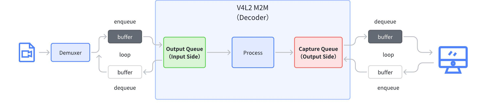
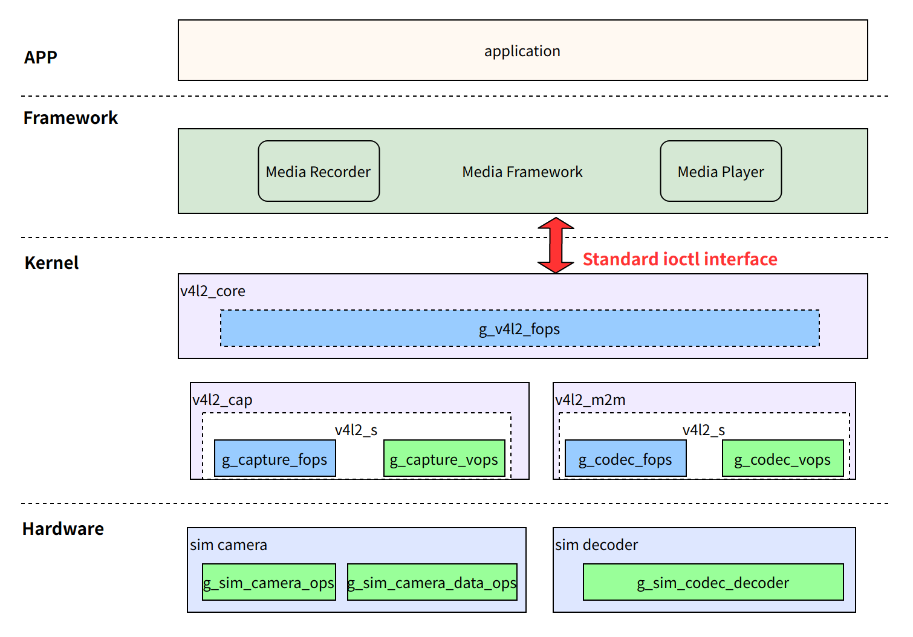
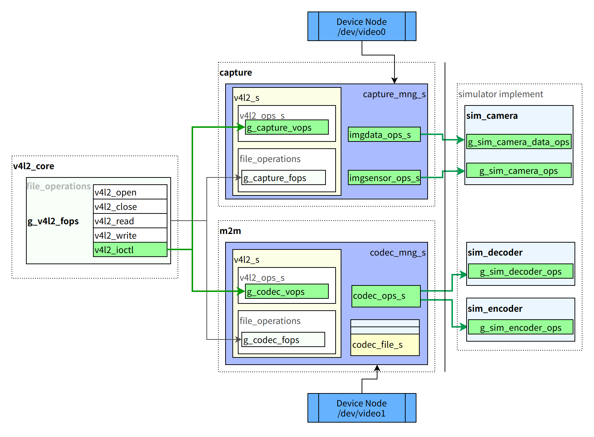

# Introduction to the V4L2 M2M Framework

[English | [简体中文](../../../../zh-cn/device_dev_guide/media/v4l2/v4l2_m2m_framework.md)]

## I. Overview

The **video codec** framework in `openvela` is inspired by the **Video for Linux 2 (V4L2)** framework from the Linux kernel, with a primary focus on implementing its **Memory-to-Memory (M2M)** model. In Linux, `v4l2m2m` is a standard module dedicated to handling hardware that requires memory for both input and output, such as video codecs.

By introducing the `v4l2m2m` interface into `openvela`, we have successfully unified the **video codec driver framework**, providing a standard codec driver access layer for **downstream chip vendors**. This allows third-party hardware to be easily integrated into the `openvela` ecosystem, significantly reducing development and adaptation costs.

The core concept of the V4L2 M2M framework is to reuse the `frame buffer` management module from the V4L2 framework, adding an `output queue` to receive input data for the codec and using the original `capture queue` to store the codec's output data. The following diagram illustrates the processing flow of the M2M framework using video decoding as an example.



> **Note**: In the V4L2 M2M framework, the `output queue` serves as the **input end** for data. The `capture queue` always acts as the **output end**, primarily to maintain consistency with the queue usage conventions of the V4L2 Camera framework.

## II. Framework Overview

The `openvela` V4L2 M2M framework adopts a classic **layered** design, decoupling generic logic from device-specific implementations. This model is similar to the **Upper-Half** and **Lower-Half** model used in `openvela` audio drivers.

For upper-layer applications, the `openvela` V4L2 M2M framework provides Linux-compatible standard interfaces. For lower-layer driver developers, the framework offers simplified adaptation interfaces, enabling rapid driver development.



- **V4L2 Generic Layer (Upper-Half):**
  
    - Consists of the `v4l2_core`, `v4l2_cap` (for capture devices like cameras), and `v4l2_m2m` (for codec devices) modules, with corresponding `capture ops` and `codec ops`.
    - This layer is responsible for responding to `ioctl` system calls from applications, handling core V4L2 logic, buffer management, and event mechanisms. It defines a standard set of operation functions (ops) for the lower-half driver.

- **Device Driver Layer (Lower-Half):**

    - Comprises specific hardware drivers, such as `sim_camera` and `sim_decoder` used as examples in this document.
    - The **core task for driver developers** is to implement this layer. By populating and registering a specific `ops` structure, the driver can seamlessly interface with the generic layer.

After the system boots, the lower-half driver (e.g., `sim_decoder`) **registers a corresponding device node (e.g., `/dev/video1`)**. Applications access these nodes through standard **file interfaces**. Requests are routed through the V4L2 generic layer and ultimately dispatched to the corresponding **lower-half driver for processing**.

## III. Detailed Framework Analysis

This chapter provides an in-depth analysis of the internal mechanisms of the `openvela` V4L2 M2M Codec driver, covering its core components, interface definitions, data interaction model, and key development practices.

### 1. Core Components

The `openvela` `v4l2m2m` implementation draws from the mature design of Linux, with its architecture built around the following four core components:

- **`codec_ops_s`**: **The core implementation of the lower-half driver**. It defines a set of operational callback functions, functionally equivalent to Linux's **`v4l2_ioctl_ops`**. The primary task for driver developers is to implement this interface.
- **`v4l2_ops_s`**: **The generic V4L2 `ioctl` interface**. This is a framework-level (Upper-Half) interface. The M2M generic layer provides an instance of this interface (`g_codec_vops`), which is responsible for receiving upper-layer requests and calling the specific implementations in the lower-half driver's `codec_ops_s`.
- **`codec_file_s`**: **Device instance manager**. Whenever an application `open`s a device node, the framework creates a `codec_file_s` instance to manage the session's context, including independent buffer queues, thereby enabling multi-instance support. Buffer allocation and management in M2M are also handled through `codec_file_s`.
- **`codec_mng_s`**: **Top-level device manager**. When a driver registers a device node (e.g., `/dev/video1`), the framework creates a `codec_mng_s` instance to serve as the global handle for that device in the kernel.



> **Figure Caption:** This diagram clearly illustrates how `v4l2_ops_s`, acting as a generic entry point, ultimately calls the driver developer's implemented `codec_ops_s` through `codec_mng_s` and `codec_file_s`.

### 2. Key Code

The logic of the V4L2 M2M framework is primarily distributed across the following files:

- `nuttx/drivers/video/v4l2_core.c`: The main entry point for the V4L2 framework. It defines the top-level file operations, **`g_v4l2_fops`**, and dispatches requests to either the Camera or M2M implementation.

- `nuttx/drivers/video/v4l2_m2m.c`: **M2M Generic Layer (Upper-Half)**. Implements the generic logic for M2M devices, defining `g_codec_fops` and `g_codec_vops` which correspond to `file_operations` and `v4l2_ops_s`. **This is the primary module the lower-half driver interacts with**. Referring to `sim_decoder`, codec development mainly involves implementing `codec_ops_s` and integrating the input and output `buffer`s.

- `nuttx/drivers/video/video_framebuff.c`: The generic buffer management module for V4L2. It provides unified buffer allocation, queuing, and lifecycle management capabilities for the upper layers.

- `nuttx/drivers/video/v4l2_cap.c`: The generic implementation for Camera devices, which is generally not directly involved in Codec development. It includes `image capture` and `video capture` and defines the Camera's `g_capture_fops` and `g_capture_vops`, corresponding to `file_operations` and `v4l2_ops_s`.

### 3. Interfaces and Data Structures

This section details the key data structures and operation sets involved in M2M driver development, explained in a top-down order.

#### `codec_mng_t`

`codec_mng_t` is the main device management structure. It is dynamically allocated when the `codec_register` driver registration interface is called and is bound to the `driver` implementation interface. This binding converts requests from the upper-layer application into `driver` requests.

```C
struct codec_mng_s
{
  struct v4l2_s v4l2;        // Generic V4L2 framework structure, framework implementation
  FAR struct codec_s *codec; // V4L2 driver implementation interface, implemented by Vendor
};
```

#### `v4l2_s`

In the `openvela` V4L2 framework, each V4L2 device corresponds to a `v4l2_s` structure, which encapsulates two core function pointer tables for device-specific operations: `vops` and `fops`.

- `vops`: Points to a `v4l2_ops_s` structure, which defines all V4L2-related `ioctl` operations.
- `fops`: Points to a `file_operations` structure, which defines standard VFS file operations (e.g., `open`, `close`, `poll`).

Depending on the device type, `v4l2_s` is instantiated and pointed to different implementations. For example, a Camera device corresponds to `g_capture_vops` and `g_capture_fops`, while an M2M Codec device corresponds to `g_codec_vops` and `g_codec_fops`.

```C
struct v4l2_s
{
  FAR const struct v4l2_ops_s      *vops;
  FAR const struct file_operations *fops;
};
```

#### `v4l2_ops_s`

`v4l2_ops_s` is the **generic** `ioctl` operation function set in the V4L2 framework. It defines the prototypes for all operations that a V4L2 device (including Camera and M2M Codec) might support. When an `ioctl` request is passed to the V4L2 core layer through the VFS, it is ultimately dispatched through the function pointers in this structure to the generic layer of the specific device type (e.g., `v4l2_m2m.c`) for processing.

```C
struct v4l2_ops_s
{
  CODE int (*querycap)(FAR struct file *filep,
                       FAR struct v4l2_capability *cap);
  CODE int (*g_input)(FAR int *num);
  CODE int (*enum_input)(FAR struct file *filep,
                         FAR struct v4l2_input *input);
  CODE int (*reqbufs)(FAR struct file *filep,
                      FAR struct v4l2_requestbuffers *reqbufs);
  CODE int (*querybuf)(FAR struct file *filep,
                       FAR struct v4l2_buffer *buf);
// ... other standard V4L2 operations ...
```

#### `codec_s`

The `codec_s` structure currently only contains the `codec_ops_s` structure, meaning the `driver` only needs to adapt the `codec_ops_s` interface. The `codec_s` structure will be expanded later based on actual requirements.

```C
struct codec_s
{
  FAR const struct codec_ops_s *ops;
};
```

`codec_ops_s` is the set of operational callback functions that the lower-half driver must implement. Driver developers need to instantiate a `codec_ops_s` structure and populate its function pointers based on hardware capabilities. The `codec_s` structure then binds this operation set to the driver's private data.

```C
/* Set of operational callback functions to be implemented by the lower-half driver */
struct codec_ops_s
{
  /* Device lifecycle management */
  CODE int (*open)(FAR struct codec_s *codec, void *arg);
  CODE int (*close)(FAR struct codec_s *codec);

  /* Stream control */
  CODE int (*capture_streamon)(FAR struct codec_s *codec);
  CODE int (*output_streamon)(FAR struct codec_s *codec);
  // ... other streamon/streamoff and available callbacks ...

  /* Specific implementations of standard V4L2 IOCTLs */
  CODE int (*querycap)(FAR struct codec_s *codec, FAR struct v4l2_capability *cap);
  CODE int (*capture_enum_fmt)(FAR struct codec_s *codec, FAR struct v4l2_fmtdesc *f);
  // ... other ops, such as g_fmt, s_fmt, g_parm, s_parm, events, cmds, etc. ...
};

/* Bind ops with the driver's private data */
struct codec_s
{
  FAR const struct codec_ops_s *ops;
  FAR void                     *priv;
};
```

> **Note:** Many operations in `codec_ops_s` are **optional**. Drivers can implement them selectively based on the features supported by the hardware.

#### `codec_file_t`

`codec_file_t`(`struct` `codec_file_s`): **Device file instance**. It is created upon `open`, and its `priv` pointer is used to associate with the lower-half driver's private data. It is key to implementing multi-instance support. Each time a device node is `open`ed, a new `codec_file_t` is created, corresponding to a different `codec context`, thus fulfilling the requirement for multiple instances.

```C
struct codec_file_s
{
  codec_type_inf_t  capture_inf; // capture queue buffer info
  codec_type_inf_t  output_inf;  // output  queue buffer info
  sq_queue_t        event_avail; // Singly linked list for available events
  sq_queue_t        event_free;  // Singly linked list for free events
  codec_event_t     event_pool[CODEC_EVENT_COUNT]; // Event queue
  FAR struct pollfd *fds;
  FAR void          *priv; // Stores the driver's private data. When the open interface is called, the driver can store its private structure pointer in priv for easy access in subsequent framework interface calls.
};
```

- **`codec_type_inf_t`(`struct codec_type_inf_s`)**: Manages buffer information for a single type (Capture or Output).

    ```C
    struct codec_type_inf_s
    {
      video_framebuff_t bufinf;     /* video framebuff 队列 */
      FAR uint8_t       *bufheap;   /* for V4L2_MEMORY_MMAP buffers */
      bool              buflast;
    };
    ```

- **`codec_event_t`(`struct codec_event_s`)**: An internal structure used for subscribing to `event`s and managing V4L2 events.

    ```C
    struct codec_event_s
    {
      sq_entry_t        entry;
      struct v4l2_event event;
    };
    ```

#### `g_codec_fops`

`g_codec_fops` (`struct file_operations`) is a generic global file operations instance interface provided by the M2M framework, and it's a global static variable. After the driver is registered, `fops` in `v4l2_core` will directly call the `codec`'s `fops` to perform `open`/`close`/`mmap`/`poll` operations for the `codec`.

```C
static const struct file_operations g_codec_fops =
{
  codec_open,            /* open */
  codec_close,           /* close */
  NULL,                  /* read */
  NULL,                  /* write */
  NULL,                  /* seek */
  NULL,                  /* ioctl */
  codec_mmap,            /* mmap */
  NULL,                  /* truncate */
  codec_poll,            /* poll */
};
```

#### `g_codec_vops`

`g_codec_vops` (`struct v4l2_ops_s`) is a generic global operations instance interface provided by the M2M framework, and it's a global static variable. It implements the generic `ioctl` command interface for V4L2. These functions act as an **adaptation layer**, and their internal logic calls the corresponding callback functions registered by the lower-half driver in `codec_ops_s`. For example, the `codec_querycap` function ultimately calls `(codec->ops->querycap)(...)`.

```C
/* v4l2_ops_s implementation provided by the M2M generic layer */
static const struct v4l2_ops_s g_codec_vops =
{
  codec_querycap,                   /* querycap */
  NULL,                             /* g_input */
  NULL,                             /* enum_input */
  codec_reqbufs,                    /* reqbufs */
  codec_querybuf,                   /* querybuf */
  codec_qbuf,                       /* qbuf */
  codec_dqbuf,                      /* dqbuf */
  // ... over 20 other implemented interfaces ...
  codec_decoder_cmd,                /* decoder_cmd */
  codec_encoder_cmd                 /* encoder_cmd */
};
```

### 4. Buffer Interaction Model

The core of the V4L2 M2M framework is its dual-queue buffer model. Memory is allocated and managed by the M2M generic layer based on `VIDIOC_REQBUFS` requests from userspace. The lower-half driver exchanges buffer data with the generic layer using the following APIs:

- **Get a buffer**:

    - `codec_output_get_buf()`: Gets an input buffer containing data to be processed (e.g., an H.264 bitstream).
    - `codec_capture_get_buf()`: Gets an empty output buffer for storing the processed results (e.g., YUV data).

- **Return a buffer**:

    - `codec_output_put_buf()`: Returns a processed input buffer to the M2M generic layer.
    - `codec_capture_put_buf()`: Returns a filled output buffer to the M2M generic layer, making it available for the application layer to read.

```C
FAR struct v4l2_buffer *codec_output_get_buf(FAR void *cookie);
FAR struct v4l2_buffer *codec_capture_get_buf(FAR void *cookie);

int codec_output_put_buf(FAR void *cookie, FAR struct v4l2_buffer *buf);
int codec_capture_put_buf(FAR void *cookie, FAR struct v4l2_buffer *buf);
```


> **Figure Caption:** This diagram details how a decoder driver exchanges input and output buffers with the M2M generic layer using the `get_buf` and `put_buf` APIs.

### 5. Development Notes

- **Buffer Allocation:** Both input (`output`) and output (`capture`) buffers are requested from userspace via the `VIDIOC_REQBUFS` `ioctl` command. The memory is uniformly allocated and managed by the M2M generic layer.
- **Queue Operations:** Due to the current implementation of `video_framebuff`, it is not recommended to enqueue all requested `output` buffers to M2M at once. The recommended pattern is to first try to dequeue all processed buffers before enqueuing a new `output` buffer.
- **Delayed Initialization:** The `sim_decoder` example defers the initialization of `sim_openh264dec` to the `output_streamon` callback. This practice avoids unnecessary hardware initialization and shutdown during the driver's probe phase and is a recommended optimization.
- **Flush Operation:** When calling `output_streamoff`, the driver must ensure that all cached frames in the hardware are fully processed and output. The `sim_decoder` achieves this by setting a flush flag and scheduling a work queue to clear any remaining data inside the decoder.

## IV. References

- [Linux Media Subsystem Documentation (Official)](https://www.kernel.org/doc/html/latest/userspace-api/media/index.html)
