# Overview of Clock Framework

\[ English | [简体中文](../../../zh-cn/device_dev_guide/power_mgt/Clock.md) \]

## I. Clock Configuration

### Configuration Options

The following are the relevant options for clock configuration:

```Makefile
CONFIG_CLK=y 
CONFIG_CLK_RPMSG=y // Support cross-core control
```

## II. Clock Framework

### 1. Overall Architecture

The following are the main components of the clock framework and their functions:


Middle Layer:

- Provides a unified clock control interface, supporting multiple clock types and hardware adaptation.

### 2. Southbound Adaptation Layer

#### Southbound Interface Implementation

The southbound adaptation of the clock needs to implement the `struct clk_ops_s` interface to support the following features:

| **Feature**     | **Southbound Interface** | **Function**                                                                                                         |
| --------------- | ------------------------ | -------------------------------------------------------------------------------------------------------------------- |
| **clk gate**    | `enable`                 | Enable the clock.                                                                                                    |
|                 | `disable`                | Disable the clock.                                                                                                   |
|                 | `is_enabled`             | Determine whether the clock is enabled.                                                                              |
| **calc rate**   | `recalc_rate`            | Calculate the current clock frequency based on the parent clock frequency.                                           |
|                 | `round_rate`             | Calculate the appropriate frequency and parent clock frequency based on the target frequency.                        |
|                 | `determine_rate`         | Calculate the best frequency, the best parent clock, and its frequency based on the target frequency.                |
| **multiplexer** | `set_parent`             | Set the corresponding parent clock.                                                                                  |
|                 | `get_parent`             | Obtain the current parent clock.                                                                                     |
| **set rate**    | `set_rate`               | Configure the current clock frequency based on the parent clock frequency.                                           |
|                 | `set_rate_and_parent`    | Configure the current clock frequency based on the parent clock frequency and select the corresponding parent clock. |
| **phase**       | `get_phase`              | Obtain the clock phase.                                                                                              |
|                 | `set_phase`              | Set the clock phase.                                                                                                 |

- `struct clk_ops_s` definition

  The following is the definition of `struct clk_ops_s` and its interface parameters:

```C
struct clk_ops_s
{
  CODE int       (*enable)(FAR struct clk_s *clk);
  CODE void      (*disable)(FAR struct clk_s *clk);
  CODE int       (*is_enabled)(FAR struct clk_s *clk);
  CODE uint32_t  (*recalc_rate)(FAR struct clk_s *clk, uint32_t parent_rate);
  CODE uint32_t  (*round_rate)(FAR struct clk_s *clk,
                               uint32_t rate, uint32_t *parent_rate);
  CODE uint32_t  (*determine_rate)(FAR struct clk_s *clk, uint32_t rate,
                                   uint32_t *best_parent_rate,
                                   struct clk_s **best_parent_clk);
  CODE int       (*set_parent)(FAR struct clk_s *clk, uint8_t index);
  CODE uint8_t   (*get_parent)(FAR struct clk_s *clk);
  CODE int       (*set_rate)(FAR struct clk_s *clk, uint32_t rate,
                             uint32_t parent_rate);
  CODE int       (*set_rate_and_parent)(FAR struct clk_s *clk, uint32_t rate,
                                        uint32_t parent_rate,
                                        uint8_t index);
  CODE int       (*get_phase)(FAR struct clk_s *clk);
  CODE int       (*set_phase)(FAR struct clk_s *clk, int degrees);
};
```

- Clock node registration interface

  The framework provides the `clk_register` interface for registering clock control nodes. The definition is as follows:

```C
FAR struct clk_s *clk_register(FAR const char *name,
                               FAR const char * const *parent_names,
                               uint8_t num_parents, uint8_t flags,
                               FAR const struct clk_ops_s *ops,
                               FAR void *private_data, size_t private_size);
```

##### Parameter Description

| **Parameter** | **Description**                  |
| :------------ | :------------------------------- |
| name          | Name of the clock unit           |
| parent_names  | Array of parent clock unit names |
| num_parents   | Number of parent clock units     |
| flags         | Attributes of the clock unit     |
| ops           | Clock unit control interface     |
| private_data  | Private data                     |
| private_size  | Length of private data           |

##### Description of Registration Attributes

The following are the attribute flags during clock registration and their descriptions:

| **flag**                  | **Attribute Description**                                                                                                                                     |
| :------------------------ | :------------------------------------------------------------------------------------------------------------------------------------------------------------ |
| CLK_SET_RATE_GATE         | When calling `clk_set_rate` to set the frequency, it is necessary to gate the current clock.                                                                  |
| CLK_SET_PARENT_GATE       | When calling `clk_set_parent` to associate a non-current parent clock, it is necessary to gate the current clock.                                             |
| CLK_SET_RATE_PARENT       | When calling `clk_set_rate` to set the frequency, the parent clock and its frequency can be changed.                                                          |
| CLK_SET_RATE_NO_REPARENT  | When setting the frequency, there is no need to rechange the parent clock.                                                                                    |
| CLK_GET_RATE_NOCACHE      | When calling `clk_get_rate`, the frequency is recalculated based on the parent clock frequency; otherwise, it is directly obtained from the memory structure. |
| CLK_NAME_IS_STATIC        | When calling `clk_register`, the clock name is static memory.                                                                                                 |
| CLK_PARENT_NAME_IS_STATIC | When calling `clk_register`, the parent clock name is static memory.                                                                                          |
| CLK_IS_CRITICAL           | The clock is not allowed to be turned off.                                                                                                                    |
| CLK_OPS_PARENT_ENABLE     | When calling `clk_set_parent`, `clk_set_rate`, `clk_enable`, or `clk_disable`, the parent clock needs to be enabled.                                          |

### 3. Registration Interfaces of Middle Framework Layer

#### 3.1 Divider

The following is the registration interface of the divider middle framework:

```C
FAR struct clk_s *clk_register_divider(FAR const char *name,
                                       FAR const char *parent_name,
                                       uint8_t flags, uint32_t reg,
                                       uint8_t shift, uint8_t width,
                                       uint16_t clk_divider_flags)
```

- Parameter Description

| **Parameter**     | **Description**                                                      |
| ----------------- | -------------------------------------------------------------------- |
| name              | Name of the clock unit                                               |
| parent_name       | Name of the parent clock unit                                        |
| flags             | Attribute flags of the clock unit                                    |
| reg               | Specify the address of the operation register                        |
| shift             | Offset of the configuration register                                 |
| width             | Width of the configuration register                                  |
| clk_divider_flags | Divider attribute flags, used to control the behavior of the divider |

- Function: Divide the parent clock frequency according to the value of the bit corresponding to `reg`.

- Attributes and Calculation Formulas

    The following are the attribute flags of the divider, their calculation formulas, and functions:

| **Attribute**                 | **Calculation Formula and Function**                                                                                                                                       |
| ----------------------------- | -------------------------------------------------------------------------------------------------------------------------------------------------------------------------- |
| **CLK_DIVIDER_ONE_BASED**     | `fout = (fin + val − 1) / val`<br>The division factor starts from 1. When this flag is not present, `val` needs to be incremented by 1 after being read from the register. |
| **CLK_DIVIDER_HIWORD_MASK**   | High 16-bit mask. When modifying the `value` of the low 16 bits, mask operations are performed, and configuration can be completed without rereading the register.         |
| **CLK_DIVIDER_ROUND_CLOSEST** | When `round_rate` is called, find the division value closest to the target frequency.                                                                                      |
| **CLK_DIVIDER_READ_ONLY**     | When `round_rate` is called, modifying the register value is not allowed.                                                                                                  |
| **CLK_DIVIDER_MAX_HALF**      | The maximum division factor is calculated as half of the mask value.                                                                                                       |
| **CLK_DIVIDER_DIV_NEED_EVEN** | The division factor needs to be even.                                                                                                                                      |
| **CLK_DIVIDER_POWER_OF_TWO**  | `fout = (fin + 2^n − 1) / 2^n`<br>The division factor is the nth power of 2.                                                                                               |
| **CLK_DIVIDER_MINDIV_OFF**    | Offset of the minimum division number in `flags`.                                                                                                                          |
| **CLK_DIVIDER_MINDIV_MSK**    | Bit mask of the minimum division number in `flags`.                                                                                                                        |

- `round_rate` algorithm flow

    The following is the flow chart of the divider `round_rate` algorithm:



#### 3.2 Fixed Factor Frequency Modulator

```C
FAR struct clk_s *clk_register_fixed_factor(FAR const char *name,
                                            FAR const char *parent_name,
                                            uint8_t flags, uint8_t mult,
                                            uint8_t div)
```

- Frequency Modulation Formula

    The output frequency (fout) of the fixed factor frequency modulator is calculated by the following formula:

    `fout = fin * mult / div`

    ```shell
        fin: Parent clock frequency.
        mult: Multiplication factor.
        div: Division factor.
        round_rate algorithm
    ```

- The `round_rate` algorithm is used to calculate the output frequency closest to the target frequency, and the specific steps are as follows:

    1. Invert the parent clock frequency (`fp`) based on the target output frequency (`fout`):

        fp = fout * div / mult

    2. Round the parent clock frequency (`fp`) to obtain the closest parent clock frequency (`fpbest`).

    3. Calculate the optimal output frequency (`foutbest`) based on the optimal parent clock frequency (`fpbest`):

        foutbest = fpbest * mult / div

#### 3.3 Fixed Frequency Regulator

```C
FAR struct clk_s *clk_register_fixed_rate(FAR const char *name,
                                          FAR const char *parent_name,
                                          uint8_t flags, uint32_t fixed_rate)
```

- fixed_rate: Fixed output frequency value.

#### 3.4 Strobe

```C
FAR struct clk_s *clk_register_gate(FAR const char *name,
                                    FAR const char *parent_name,
                                    uint8_t flags, uint32_t reg,
                                    uint8_t bit_idx,
                                    uint8_t clk_gate_flags)
```

- bit_idx: Specifies the bit index in the register used for strobe operations.

#### 3.5 Multiplier

```C
FAR struct clk_s *clk_register_multiplier(FAR const char *name,
                                          FAR const char *parent_name,
                                          uint8_t flags, uint32_t reg,
                                          uint8_t shift,
                                          uint8_t width,
                                          uint8_t clk_multiplier_flags)
```

- Parameter Description

| Parameter | Description                         |
| --------- | ----------------------------------- |
| reg       | Address of the multiplier register. |
| shift     | Offset of the multiplier register.  |
| width     | Width of the multiplier register.   |

- Multiplier Attributes and Calculation Formulas

    The following are the attribute flags of the multiplier, their calculation formulas, and functions:

| **Attribute**          | **Calculation Formula and Function**                                                                                                                                 |
| :--------------------- | :------------------------------------------------------------------------------------------------------------------------------------------------------------------- |
| CLK_MULT_ONE_BASED     | fout = fin * val <br> The multiplication factor starts from 1. When this flag is not present, `val` needs to be incremented by 1 after being read from the register. |
| CLK_MULT_ALLOW_ZERO    | Allow the multiplication factor to be 0.                                                                                                                             |
| CLK_MULT_HIWORD_MASK   | High 16-bit mask. When modifying the `value` of the low 16 bits, mask operations are performed, and configuration can be completed without rereading the register.   |
| CLK_MULT_MAX_HALF      | The maximum multiplication factor is calculated as half of the mask value.                                                                                           |
| CLK_MULT_ROUND_CLOSEST | When `round_rate` is called, find the multiplication value closest to the target frequency.                                                                          |

- `round_rate` algorithm flow



#### 3.6 Multiplexer

```C
FAR struct clk_s *clk_register_mux(FAR const char *name,
                                   const char * const *parent_names,
                                   uint8_t num_parents,
                                   uint8_t flags, uint32_t reg,
                                   uint8_t shift, uint8_t width,
                                   uint8_t clk_mux_flags)
```

- Parameter Description

| Parameter | Description                          |
| --------- | ------------------------------------ |
| reg       | Address of the multiplexer register. |
| shift     | Offset of the multiplexer register.  |
| width     | Width of the multiplexer register.   |

Function: Select the parent clock frequency output according to the bit corresponding to `reg`.

- Description of Multiplexer Attributes

| Attribute             | Description                                                                                                                                                        |
| --------------------- | ------------------------------------------------------------------------------------------------------------------------------------------------------------------ |
| CLK_MUX_HIWORD_MASK   | High 16-bit mask. When modifying the `value` of the low 16 bits, mask operations are performed, and configuration can be completed without rereading the register. |
| CLK_MUX_READ_ONLY     | Only supports obtaining the parent clock frequency, not modifying it.                                                                                              |
| CLK_MUX_ROUND_CLOSEST | When `determine_rate` is called, find the parent clock frequency closest to the target frequency.                                                                  |

- `determine_rate` steps


#### 3.7 Phase Regulator

```C
FAR struct clk_s *clk_register_phase(FAR const char *name,
                                     FAR const char *parent_name,
                                     uint8_t flags, uint32_t reg,
                                     uint8_t shift, uint8_t width,
                                     uint8_t clk_phase_flags)
```

- Parameter Description

| Parameter | Description                              |
| --------- | ---------------------------------------- |
| reg       | Address of the phase regulator register. |
| shift     | Offset of the phase regulator register.  |
| width     | Width of the phase regulator register.   |

Function: Select the parent clock frequency according to the bit corresponding to `reg` and perform phase regulation.

- Description of Phase Regulator Attributes

| **Attribute**         | **Description**                                                                                                                                                    |
| :-------------------- | :----------------------------------------------------------------------------------------------------------------------------------------------------------------- |
| CLK_PHASE_HIWORD_MASK | High 16-bit mask. When modifying the `value` of the low 16 bits, mask operations are performed, and configuration can be completed without rereading the register. |

#### 3.8 Fractional Divider

```C
FAR struct clk_s *
clk_register_fractional_divider(FAR const char *name,
                                FAR const char *parent_name,
                                uint8_t flags, uint32_t reg,
                                uint8_t mshift, uint8_t mwidth,
                                uint8_t nshift, uint8_t nwidth,
                                uint8_t clk_divider_flags)
```

- Parameter Description

| Parameter | Description                                            |
| --------- | ------------------------------------------------------ |
| reg       | Address of the fractional divider register.            |
| mshift    | Offset of the fractional divider denominator register. |
| mwidth    | Width of the fractional divider denominator register.  |
| nshift    | Offset of the fractional divider numerator register.   |
| nwidth    | Width of the fractional divider numerator register.    |

Function: Select the parent clock frequency according to the bit corresponding to `reg` and calculate the output frequency through fractional division.

- Fractional Divider Attributes and Calculation Formulas

| **Attribute**          | **Description**                                                                 |
| :--------------------- | :------------------------------------------------------------------------------ |
| CLK_FRAC_DIV_DOUBLE    | Without this flag: `fout = fin * m /n` <br>With this flag: `fout = fin * m /2n` |
| CLK_FRAC_MUL_NEED_EVEN | When `round_rate` is called, the `m` value needs to be even.                    |

### 4. API Interface Layer

| **API**                 | **Function**                                                                                                                                                                          |
| :---------------------- | :------------------------------------------------------------------------------------------------------------------------------------------------------------------------------------ |
| clk_get                 | Match the `clk_s` with the specified name from `g_clk_root_list` and `g_clk_orphan_list`.                                                                                             |
| clk_get_parent          | Obtain the `clk_s` of the current associated parent clock of `clk_s`.                                                                                                                 |
| clk_get_parent_by_index | Obtain the `clk_s` corresponding to the `index`th parent clock of `clk_s`.                                                                                                            |
| clk_set_parent          | Associate the parent clock according to whether the parent clock name matches the parent clock name of `clk`, and refresh the frequency of `clk` based on the parent clock frequency. |
| clk_enable              | Enable the parent clock, enable `clk_s`, and increment `enable_count`.                                                                                                                |
| clk_disable             | Decrement `enable_count`, disable `clk_s`, and disable the parent clock.                                                                                                              |
| clk_is_enabled          | Determine whether `clk_s` has been enabled.                                                                                                                                           |
| clk_round_rate          | Calculate the most appropriate frequency based on the target frequency.                                                                                                               |
| clk_set_rate            | Set the frequency of `clk`.                                                                                                                                                           |
| clk_set_rates           | Batch configure the frequencies of multiple `clk`.                                                                                                                                    |
| clk_get_rate            | Obtain the current frequency of `clk`.                                                                                                                                                |
| clk_set_phase           | Configure the phase of `clk`.                                                                                                                                                         |
| clk_get_phase           | Obtain the phase of `clk`.                                                                                                                                                            |
| clk_disable_unused      | Turn off the unused `clk`.                                                                                                                                                            |
| clk_get_name            | Obtain the name of `clk`.                                                                                                                                                             |

## III. Debug PROCFS

Through the `/proc/clk` file node, you can view the structural relationship of the clock tree and the following information of each clock node:

    - enable_cnt: Clock enable count.
    - rate: Clock frequency.
    - phase: Clock phase.

- Example Operations

The following is an example of viewing the `/proc/clk` file through the `cat` command:

```Bash
ap> cat /proc/clk
   clock                                  enable_cnt        rate       phase
   clk_1000                                         0        1000           0
   clk_2000                                         0        2000           0
ap> 
```

## IV. Reference Documents

- For asynchronous cross-core support, please refer to the relevant documents of `rpmsg clk`.
