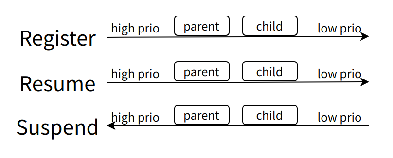

# Power Management Driver Development Guide

\[ English | [简体中文](../../../zh-cn/device_dev_guide/power_mgt/pm_driver_guide.md) \]

This document guides embedded developers on how to write device drivers for the openvela system that can participate in Power Management (PM). By implementing the specified PM callback interfaces, your driver can respond to system power state changes, enabling fine-grained energy-saving control.

**Target Audience**: Embedded systems developers who need to add PM functionality to device drivers on a specific hardware platform.

**Prerequisites**: Before you begin, we highly recommend reading the [Power Management Framework Guide](./pm_framework_guide.md) to fully understand the core concepts of the PM framework, such as Power States, Power Domains, and Governors.

## I. Core API and Data Structures

A driver interacts with the PM framework through callback structures and registration functions defined in `pm.h`.

**Related Header File**: [openvela include/nuttx/power/pm.h](../../../../../../nuttx/blob/dev-ai-contest-2026/include/nuttx/power/pm.h)

### 1. `pm_state_e` Power State Enumeration

This enumeration defines the logical power states supported by the system. In its PM callback, a driver receives a target state of this type and must perform corresponding hardware operations based on that state.

```C
enum pm_state_e
{
  PM_RESTORE = -1, /* Internal state: Notifies the driver to resume from a low-power state */
  PM_NORMAL  = 0,  /* Normal operational state */
  PM_IDLE,         /* Idle state */
  PM_STANDBY,      /* Standby state */
  PM_SLEEP,        /* Sleep state */
  PM_COUNT,        /* Total number of states, for internal management */
};
```

- **Note**: The specific hardware behavior for `PM_IDLE`, `PM_STANDBY`, and `PM_SLEEP` (e.g., clock frequency, peripheral power, memory mode) is defined and implemented by the chip-specific platform code.

### 2. `pm_callback_s` Callback Structure

This is the core component for a driver's participation in PM. You must define a variable of this type in your driver and implement its callback function pointers. This structure is registered with the PM system via the `pm_register` function during driver initialization.

```C
struct pm_callback_s
{
  /* Used for an internal doubly-linked list */
  struct dq_entry_s entry;

  /* Callback priority. A higher value means it is called earlier when entering a low-power state.
   * Default or same priority follows the registration order.
   */
  int prio;

  CODE int (*prepare)(FAR struct pm_callback_s *cb, int domain,
                      enum pm_state_e pmstate);

  CODE void (*notify)(FAR struct pm_callback_s *cb, int domain,
                      enum pm_state_e pmstate);
};
```

**Performance Note**:

The PM framework calls registered callbacks every time it checks or changes the power state (e.g., within the system idle loop). To avoid impacting system performance, your callback functions must be **fast and non-blocking**. If your driver only needs notification or only preparation, set the unused function pointer to `NULL` to prevent unnecessary calls.



#### `prepare` Callback Function

- **Purpose**: Before the PM framework transitions to a low-power state, it calls the `prepare` callback of all registered devices to check if they are ready. For example, it can check if a serial port's DMA buffer or transmit queue still has data to process.
- **Best Practice**: It is highly recommended to use a **Wakelock** ([PM Wakelock Usage Guide](./pm_wakelock_guide.md)) at the application logic layer to prevent the system from sleeping. Use the `prepare` callback as a last line of defense only when the device state cannot be anticipated at a higher level (e.g., for sudden DMA requests).
- **Note**: If you only need the `notify` callback, set `prepare` to `NULL` to reduce unnecessary function calls.
- **Parameters**:

    - `cb`: A pointer to the callback structure you registered.
    - `domain`: The power domain that initiated the state transition.
    - `pmstate`: The target power state that the PM framework intends to enter.

- **Return Value**:

    - `OK` (0): Indicates the device is ready, allowing the state transition to proceed.
    - `< 0`: Indicates the device is not ready. The PM framework will **abort** the current state transition.

#### `notify` Callback Function

After all driver `prepare` callbacks have returned `OK`, the PM framework calls the `notify` callback to **execute** the actual hardware operations.

- **Purpose**: The driver performs the actual hardware state transitions based on the notified `domain` and target `pmstate`. Examples include disabling peripheral clocks, entering clock gating, setting pin states, or restoring device configurations when resuming from a low-power state.
- **Note**: If you only need the `prepare` callback, set `notify` to `NULL` to reduce unnecessary function calls.
- **Parameters**:

    - `cb`: A pointer to the callback structure you registered.
    - `domain`: The power domain that initiated the state transition.
    - `pmstate`: The target power state that the PM framework is entering.

- **Return Value**: None. Vetoing the state transition is not allowed at this stage.

### 3. Callback Registration Functions

#### pm_domain_register

Registers your `pm_callback_s` structure to the callback list of a specified `domain`. This is the generic registration interface, similar to `pm_register`, but suitable for scenarios with multiple defined domains.

```C
int pm_domain_register(int domain, FAR struct pm_callback_s *cb)
```

#### pm_register

This is a convenience macro that registers a callback to the default `PM_IDLE_DOMAIN` (domain 0). For simple systems that are single-core or do not differentiate between power domains, this macro is sufficient.

```C
#define pm_register(cb) pm_domain_register(PM_IDLE_DOMAIN, cb)
```

## II. Driver Development in Practice: STM32 Serial Driver Example

This section uses the stm32f7 serial driver as an example to demonstrate how to implement PM functionality step-by-step.

**Source Code Reference**: [arch/arm/src/stm32f7/stm32_serial.c](../../../../../../nuttx/blob/dev-ai-contest-2026/arch/arm/src/stm32f7/stm32_serial.c)

### Step 1: Define the Callback Structure and State Variables

In the driver file, define a structure that includes `pm_callback_s` and other PM-related state variables.

```C
#ifdef CONFIG_PM
/* Structure dedicated to PM, containing callbacks and driver-internal state */
static struct pm_config_s g_serialpm =
{
  .pm_cb.notify     = up_pm_notify,   /* Associate with the notify implementation */
  .pm_cb.prepare    = up_pm_prepare,  /* Associate with the prepare implementation */
  .serial_suspended = false
};
#endif
```

### Step 2: Implement the `prepare` Callback

This function is responsible for checking if the serial port has any unfinished data transfers before entering the `STANDBY` or `SLEEP` state.

```C
static int up_pm_prepare(struct pm_callback_s *cb, int domain,
                         enum pm_state_e pmstate)
{
  int n;

  /* Logic to prepare for a reduced power state goes here. */
  switch (pmstate)
    {
    case PM_NORMAL:
    case PM_IDLE:
      break;

    case PM_STANDBY:
    case PM_SLEEP:

#ifdef SERIAL_HAVE_RXDMA
      /* Ensure all DMA operations are synchronized */
      stm32_serial_dma_poll();
#endif

      /* Iterate through all initialized serial devices */
      for (n = 0; n < STM32F7_NUSART + STM32F7_NUART; n++)
        {
          struct up_dev_s *priv = g_uart_devs[n];

          if (!priv || !priv->initialized)
            {
              /* Not active, skip. */
              continue;
            }

          if (priv->suspended)
            {
              /* Port already suspended, skip. */
              continue;
            }

          if (priv->dev.isconsole)
            {
              /* Allow losing some debug traces. */
              continue;
            }

          /* If the transmit or receive buffer is not empty, return an error to prevent sleep */
          if (priv->dev.xmit.head != priv->dev.xmit.tail)
            {
              return ERROR;
            }

          if (priv->dev.recv.head != priv->dev.recv.tail)
            {
              return ERROR;
            }
        }
      break;

    default:
      /* Should not get here */
      break;
    }

  return OK;
}
```

Before entering the `PM_STANDBY` or `PM_SLEEP` states, the driver checks if the serial port buffers contain data:

- If they do, it returns `ERROR` to prevent the PM framework from entering the low-power state.
- Otherwise, it returns `OK`, allowing the PM system to proceed with the state transition.

### Step 3: Implement the `notify` Callback

This function executes the suspend or resume operations for the serial port based on the final decision of the PM framework.

```C
static void up_pm_notify(struct pm_callback_s *cb, int domain,
                         enum pm_state_e pmstate)
{
  switch (pmstate)
    {
      case PM_NORMAL:
        {
          /*
          * The target state is an active state (NORMAL/IDLE),
          * so the serial port functionality should be resumed.
          */
          up_pm_setsuspend(false);
        }
        break;

      case PM_IDLE:
        {
          up_pm_setsuspend(false);
        }
        break;

      case PM_STANDBY:
        {
          /* The target state is a low-power state, so suspend the serial port functionality */
          up_pm_setsuspend(true);
        }
        break;

      case PM_SLEEP:
        {
          up_pm_setsuspend(true);
        }
        break;

      default:

        /* Should not get here */

        break;
    }
}
```

The logic inside `up_pm_notify` is divided into two cases:

- When `pmstate` <= `PM_IDLE`: Call `up_pm_setsuspend(false)`.
- When `pmstate` >= `PM_STANDBY`: Call `up_pm_setsuspend(true)`.

```C
static void up_pm_setsuspend(bool suspend)
{
  int n;

  /* Already in desired state? */
  if (suspend == g_serialpm.serial_suspended)
    {
      return;
    }

  g_serialpm.serial_suspended = suspend;

  for (n = 0; n < STM32F7_NUSART + STM32F7_NUART; n++)
    {
      struct up_dev_s *priv = g_uart_devs[n];

      if (!priv || !priv->initialized)
        {
          continue;
        }

      up_setsuspend(&priv->dev, suspend);
    }
}
```

The `up_pm_setsuspend()` function is where the actual hardware operations are performed.

- **Suspend Operation**:

    1. If flow control is enabled, assert the GPIO to prevent further RX data reception.
    2. Disable the TX interrupt to stop transmitting data.
    3. Clear any remaining data in the serial port's TX FIFO.
    4. If DMA is used, stop the DMA.
    5. Best Practice: To maximize energy savings, you should also disable the clocks and, if possible, the power for the relevant modules here.

- **Resume Operation**:

    1. Best Practice: Enable the clocks and power for the relevant modules.
    2. If DMA is used, enable the DMA.
    3. Re-enable the serial port's TX interrupt.

#### Handling the `PM_RESTORE` State

`PM_RESTORE` is a special notification that informs the driver that the system is waking up from a `STANDBY` or `SLEEP` state. The driver must perform its resume operations in response to this notification.

In some simple scenarios (like this serial example), the resume operation may be identical to the one for entering the `PM_NORMAL` state. However, in complex drivers that explicitly manage clocks and power (e.g., a regulator driver), hardware restoration must be handled in the `case PM_RESTORE` branch.

The current driver does not explicitly handle `PM_RESTORE` because its functionality is automatically restored upon exiting a low-power state. If clock gating is required, the resume action must be implemented synchronously within the `notify` callback.

The current driver does not explicitly handle `PM_RESTORE` because its functionality is automatically restored upon exiting a low-power state. If clock gating is required, the resume action must be implemented synchronously within the `notify` callback.

**Source Code Reference**: [Handling of PM_RESTORE in regulator.c](../../../../../../nuttx/blob/d0f8abc4ece6a8c1924dd2d1c64f773c7db51d8f/drivers/power/supply/regulator.c#L471-L476)

### Step 4: Register the Callback During Driver Initialization

Finally, in the driver's initialization function (e.g., `arm_serialinit`), call `pm_register` to register your callback with the PM framework.

```C
#ifdef CONFIG_PM
  ret = pm_register(&g_serialpm.pm_cb);
  if (ret < 0)
    {
      /* Handle registration failure error */
    }
#endif
```

## III. Key Points and Best Practices

- **Execution Context**: PM callbacks are executed in the context of the IDLE thread, where interrupts may be partially or fully disabled. Therefore, callback implementations must be **extremely efficient, non-blocking, and must not perform any operations that could cause a context switch** (such as taking a semaphore).

- **Registration**: A driver registers its callback with a **specific** power domain via `pm_domain_register()`. The `pm_register()` macro is a simplified wrapper for registering to the default `PM_IDLE_DOMAIN`. Your callback function should check the incoming `domain` parameter to support multi-domain systems.

- In the `prepare` function, check if the current module is permitted to enter the target `pm_state`. If not, you must return an error code.

- In the `notify` function, perform the operations corresponding to the `pm_state` to ensure the driver enters the appropriate low-power state. These operations include, but are not limited to:

    - Stopping data transfers (DMA and interrupts).
    - Disabling module clocks.
    - Turning off module power.

## IV. Related Documents

- [Implementing Power Management in the IDLE Thread](./pm_idle_impl.md)
