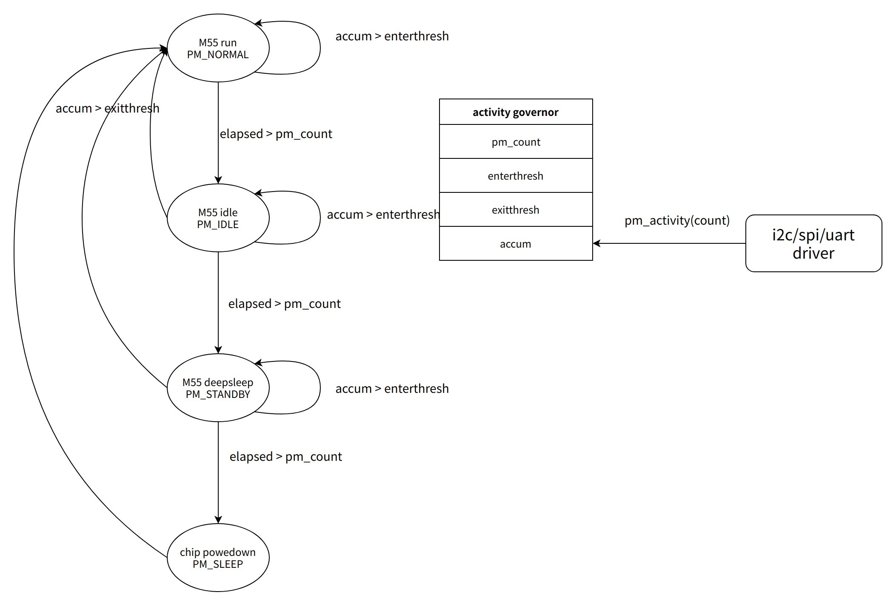
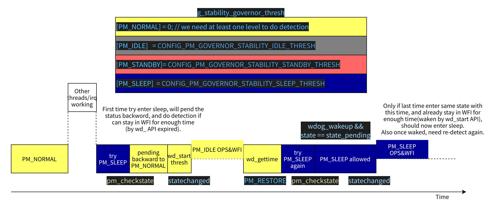

# Power Management Framework Guide

\[ English | [简体中文](../../../zh-cn/device_dev_guide/power_mgt/pm_framework_guide.md) \]

This document details the core concepts, API usage, and available power management policies (Governors) of the openvela Power Management (PM) framework.

**Target Audience**: Embedded systems developers who need to develop or adapt power management features for a specific hardware platform.

**Related Header Files**: [openvela include/nuttx/power/pm.h](../../../../../../nuttx/blob/dev-ai-contest-2026/include/nuttx/power/pm.h)

## I. Core Concepts

Before diving into the API and configuration, you need to understand the three core concepts of the PM framework: **Power States**, **Power Domains**, and **Governors**.

### 1. Power States

The openvela PM framework defines standard power states that correspond to different hardware operational states. During chip bring-up, you need to map these to the specific hardware run modes of your chip. The actual power consumption in each state depends on the chip's power design.

| **State**   | **`enum pm_state_e`** | **Core Feature Description**                                                                                                                                                                                                                                                                                                                                                                            |
| :---------- | :-------------------- | :------------------------------------------------------------------------------------------------------------------------------------------------------------------------------------------------------------------------------------------------------------------------------------------------------------------------------------------------------------------------------------------------------ |
| **Normal**  | `PM_NORMAL`           | The chip is in its normal operating state.                                                                                                                                                                                                                                                                                                                                                              |
| **Idle**    | `PM_IDLE`             | A low-power state where consumption can be reduced through simple steps without disrupting normal operation.<br>For example, dimming the backlight when the system is idle. Standby is a low-power mode that may involve more extensive power management steps, such as disabling clocks or setting the processor to a low-power mode.<br>The system can wake up **almost instantly** via an interrupt. |
| **Standby** | `PM_STANDBY`          | A deeper low-power state than `Idle`.<br>It may involve shutting down more clock domains or peripheral power, but memory (RAM) remains powered (in retention). The system can achieve a **fast recovery**.                                                                                                                                                                                              |
| **Sleep**   | `PM_SLEEP`            | The deepest low-power state.<br>The entire chip enters its lowest power mode, and the most aggressive power-saving measures should be taken.<br>This includes, but is not limited to, powering off the CPU, peripherals, and even parts of RAM.<br>Recovery to normal operation is allowed to **take a considerable amount of time** (some MCUs may even require a reset to boot).                      |

**Internal Control State**:

- `PM_RESTORE` (enum value -1) is an internal state used to notify registered peripheral drivers to return from a low-power state. It is not an actual power state itself.

**Timing Diagram**:


**Further Reading**:

- [Power Management Driver Development Guide](./pm_driver_guide.md)

### 2. Power Domains

A Power Domain is a logical unit that the PM framework uses for power management. You can define a dedicated power domain for multiple drivers and modules, or a single one, to achieve fine-grained power control.

- **Planning**: You need to plan the division of power domains based on your product's business logic and the dependencies between the processor and peripherals.
- **SMP Support**: In a Symmetric Multi-Processing (SMP) system, you must reserve a dedicated power domain for each CPU core.

### 3. Working Principle and Governors

The PM framework uses timing data about when the CPU enters/exits a power state, combined with driver activity data (`activity`), to decide the CPU's next power management state via a governor.


## II. Basic Configuration and Initialization

This section guides you through the basic configuration and initialization process of the PM framework.

### 1. Initialize the PM Framework

You must call `pm_initialize()` to initialize the PM framework after the kernel starts but before peripheral drivers are initialized.

```C
void pm_initialize(void)
```

### 2. Configure the Number of Power Domains

Use the Kconfig option `CONFIG_PM_NDOMAINS` to define the total number of power domains supported by the system.

```CMake
# Example: Define 3 power domains, which may include CPU and peripheral domains
CONFIG_PM_NDOMAINS=3
```

### 3. Set the Governor for a Specific Domain

The system sets a default governor for all domains during initialization. If you need to specify a different policy for a particular domain, call `pm_set_governor()` immediately after `pm_initialize()`.

```C
int pm_set_governor(int domain, FAR const struct pm_governor_s *gov)
```

**Example**: Set the `stability` governor for `PM_IDLE_DOMAIN`.

```C
void arm_pminitialize(void)
{
    /* First, initialize the PM framework */
    pm_initialize();
  
    /* Specify the stability governor for PM_IDLE_DOMAIN */  
    pm_set_governor(PM_IDLE_DOMAIN, pm_stability_governor_initialize());
}
```

## III. API Reference

This section provides a detailed introduction to the core APIs offered by the PM framework.

### 1. Callback Registration and Unregistration

#### pm_domain_register

Registers a callback structure to receive notifications when the power state changes. All drivers or modules that need to participate in power management must call this interface.

```C
int pm_domain_register(int domain, FAR struct pm_callback_s *cb);

/* Macro for simplified registration on PM_IDLE_DOMAIN */
#define pm_register(cb) pm_domain_register(PM_IDLE_DOMAIN, cb)
```

#### pm_domain_unregister

When a driver or module no longer needs to receive PM notifications, it calls this interface to unregister its callback.

```C
int pm_domain_unregister(int domain, FAR struct pm_callback_s *cb);

/* Macro for simplified unregistration on PM_IDLE_DOMAIN */
#define pm_unregister(cb) pm_domain_unregister(PM_IDLE_DOMAIN, cb)
```

### 2. Activity and State Requests

#### pm_activity

Notifies the PM framework that a specified domain is active, thereby preventing it from entering a low-power mode for a period of time.

```C
void pm_activity(int domain, int priority)
```

- **`priority`** parameter: Represents the activity level. A higher level prevents the system from entering a low-power state for a longer duration.

#### pm_stay

Requests the PM framework to force a specified domain to remain in a certain power state, preventing it from entering a lower power state. This function maintains an internal reference count, allowing for multiple calls.

```C
void pm_stay(int domain, enum pm_state_e state);
```

#### pm_relax

Releases one state-holding request made by `pm_stay()`. It can be called multiple times. **`pm_stay()` and `pm_relax()` must be used in pairs.**

```C
void pm_relax(int domain, enum pm_state_e state);
```

#### pm_staytimeout

Requests the PM framework to keep a specified domain in a certain state for a specified duration (in milliseconds). The request is automatically released after the timeout.

```C
void pm_staytimeout(int domain, enum pm_state_e state, int ms)
```

### 3. Wakelock Management

Wakelocks provide a more structured way to manage state locks.

#### pm_wakelock_stay

Requests the PM framework to prevent the system from entering a lower power state via a `wakelock` structure.

```C
void pm_wakelock_stay(FAR struct pm_wakelock_s *wakelock)
```

#### pm_wakelock_relax

Releases a wakelock acquired by `pm_wakelock_stay()`. **These two functions must be used in pairs.**

```C
void pm_wakelock_relax(FAR struct pm_wakelock_s *wakelock)
```

**Note**: When the `procfs` filesystem is enabled, you can observe wakelock statistics in `pmconfig` or its corresponding path.

- **Further Reading**: [PM Wakelock Usage Guide](./pm_wakelock_guide.md)

### 4. State Query

#### pm_staycount

This interface queries the `pm_stay()` reference count for a specified domain and state. `pm_stay` and `pm_relax` must be used in pairs; the state hold is only released when the counter reaches 0.

```C
uint32_t pm_staycount(int domain, enum pm_state_e state)
```

#### pm_querystate

Queries the current actual power state of a specified domain.

```C
enum pm_state_e pm_querystate(int domain)
```

### 5. Interfaces to Use with Caution

The following interfaces can have system-level impacts or cause significant delays. Please use them with caution after fully understanding their mechanisms.

#### pm_checkstate

Checks the recommended state for a driver or module and works with `pm_changestate` to transition to that state, allowing it to operate in the optimal low-power state.

```C
enum pm_state_e pm_checkstate(int domain);
```

**Warning**: The recommendation from this interface is based solely on the driver or module state and does not perform checks on all registered callbacks. For example, it may not be aware of external conditions like a low battery level. Therefore, its recommendation may not always be optimal or safe.

#### pm_changestate

Sets all drivers and modules to a specific power state. Using this function first disables interrupts and then checks via callbacks if all drivers or modules within this domain are ready to enter the `newstate`:

- If all are ready, the mode transition begins.
- If not ready, the transition is aborted, the state is rolled back to the last known valid state, and the function returns a failure.

```C
int pm_changestate(int domain, enum pm_state_e newstate);
```

**Warning:** This interface calls the callback functions registered with `pm_register`, which can be time-consuming. Typically, a domain should only have one entry point for this call.

For example, state transitions for `PM_IDLE_DOMAIN` are managed exclusively by the system's Idle thread.

- **Further Reading**: [Implementing Power Management in the IDLE Thread](./pm_idle_impl.md)

## IV. Power Management Policies

Governors are the core of the PM framework, implementing different power management policies. openvela currently supports three standard power management policies.

### 1. Greedy Governor

- **How it Works**: The simplest policy. It selects the lowest available power level that is not locked.
- **Use Cases**: Suitable for domains with simple requirements. It is recommended to start PM adaptation with this governor.
- **Default Behavior**: If this option is enabled, `pm_initialize` will set this governor as the default for all domains.
- **Source Code Reference**: [openvela drivers/power/pm/greedy_governor.c](../../../../../../nuttx/blob/dev-ai-contest-2026/drivers/power/pm/greedy_governor.c)

- **Configuration Options**:

    ```CMake
    # Enable the PM subsystem
    CONFIG_PM=y
    # Enable the Greedy governor
    CONFIG_PM_GOVERNOR_GREEDY=y
    ```

### 2. Activity Governor

- **How it Works**: Dynamically determines the most appropriate power state by analyzing driver activity time, the expected time to enter the next power state, and the expected time to exit the current power state.
- **Use Cases**: Suitable for complex scenarios that require dynamic power adjustment based on system load.
- **Default Behavior**: If the `greedy` governor is not enabled but the `activity` governor is, the latter becomes the default for all domains.
- **Source Code Reference**: [openvela drivers/power/pm/activity_governor.c](../../../../../../nuttx/blob/dev-ai-contest-2026/drivers/power/pm/activity_governor.c)

- **Note**: The timing for each state is configurable. The time data for entering/exiting a power state is passed in via configuration, and all domains will be configured with the same data.

- **Governor Operation Example**: The figure below shows an example with an M55 CPU, illustrating how the `activity governor` interacts with drivers and performs state transitions.

    

- **Configuration Options**:

    ```CMake
    # Enable the PM subsystem
    CONFIG_PM=y
    # Enable the Activity governor
    CONFIG_PM_GOVERNOR_ACTIVITY=y

    # Configure enter/exit thresholds and minimum hold times for various states (unit: ticks)
    CONFIG_PM_GOVERNOR_IDLEENTER_THRESH
    CONFIG_PM_GOVERNOR_IDLEEXIT_THRESH
    CONFIG_PM_GOVERNOR_IDLEENTER_COUNT

    # ... (similar configurations for STANDBY and SLEEP states)
    CONFIG_PM_GOVERNOR_STANDBYENTER_THRESH
    # ...
    ```

### 3. Stability Governor (Anti-Jitter)

- **How it Works**: An anti-jitter mechanism. When the system wakes up from a low-power state, it forces the system to stay in a non-sleep state for a period to avoid rapid toggling between wake and sleep due to frequent external interrupts.

- **Use Cases**: Suitable for platforms where wake-up/sleep costs are high or for scenarios requiring quick, consecutive responses to external interrupts.

- **Best Practice**: This policy is not suitable as a global default. **It is strongly recommended to apply this policy only to `PM_IDLE_DOMAIN` individually via `pm_set_governor()`.**

    ```C
    pm_set_governor(PM_IDLE_DOMAIN, pm_stability_governor_initialize());
    ```

- **Source Code Reference**: [openvela drivers/power/pm/stability_governor.c](../../../../../../nuttx/blob/dev-ai-contest-2026/drivers/power/pm/stability_governor.c)

- **Key Implementation Detail**: When the system wakes from `SLEEP` and returns to `IDLE`, it cannot use `last_state` to check the `WFI` hold time. Instead, it selects the deepest power level with a non-zero threshold from the configuration list (e.g., if the `SLEEP` threshold is 0 and the `STANDBY` threshold is 10, it will select `STANDBY`) as the new baseline for checking.

- **Governor Operation Example:** The figure below shows the core logic of the `stability` governor, where it checks if the time spent in `PM_IDLE` (WFI) meets the threshold before attempting to enter `PM_SLEEP`.

    

- **Configuration Options**:

    ```CMake
    # Enable the PM subsystem
    CONFIG_PM=y
    # Enable the Stability governor
    CONFIG_PM_GOVERNOR_STABILITY=y

    # Configure the delay time before entering each level (unit: ticks)
    # Set to 0 to disable delay checking for that state
    CONFIG_PM_GOVERNOR_STABILITY_IDLE_THRESH
    CONFIG_PM_GOVERNOR_STABILITY_STANDBY_THRESH
    CONFIG_PM_GOVERNOR_STABILITY_SLEEP_THRESH
    ```

## V. References

- [Apache NuttX Official Documentation - Power Management](https://nuttx.apache.org/docs/10.0.0/components/power.html)
