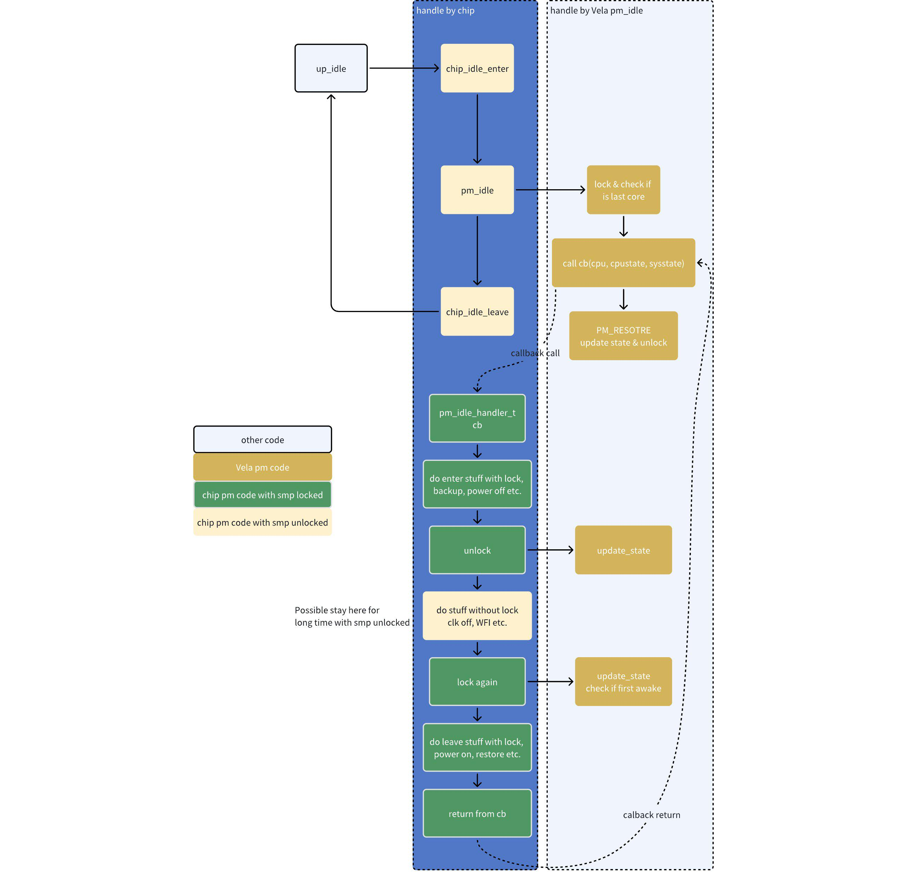

# Standardizing Idle Thread Power Management with pm_idle

\[ English | [简体中文](../../../zh-cn/device_dev_guide/power_mgt/pm_idle_guide.md) \]

## I. Overview

This document provides embedded systems developers with a guide on how to implement standardized Idle thread power management in the openvela real-time operating system using the `pm_idle` interface.

openvela provides the `pm_idle` interface to offer a unified, standard processing flow for the Idle thread in both **Uniprocessor (UP)** and **Symmetric Multiprocessing (SMP)** architectures. This interface encapsulates complex power state decision-making and multicore synchronization logic, which can significantly simplify the implementation of the platform-specific `up_idle` function and reduce development risks.

**Target Audience:** Embedded software engineers responsible for implementing or maintaining platform-level power management logic.

**Prerequisite Reading**: Before you begin, we highly recommend reading the following documents to understand the fundamental concepts of power management in openvela:

- [Power Management Framework Guide](./pm_framework_guide.md)
- [Implementing Power Management in the IDLE Thread](./pm_idle_impl.md)

## II. API Reference

The definition of the `pm_idle` interface varies depending on whether the system has SMP (`CONFIG_SMP`) enabled.

### 1. Uniprocessor (UP) Scenario

In a UP scenario, the system manages only a single, global power state (System State). The developer only needs to provide a callback function to respond to this state.

#### Function Pointer: `pm_idle_handler_t`

Defines a callback function for handling operations before the system enters different power states.

```C
typedef void (*pm_idle_handler_t)(enum pm_state_e systemstate);
```

- `systemstate`: An `enum pm_state_e` type, indicating the target power state the system is about to enter, such as `PM_SLEEP`.

#### Core Function: `pm_idle`

This function is called within the system's Idle loop (`up_idle`). It calculates the lowest power state the system can currently enter and invokes the `handler` you provide.

```C
void pm_idle(pm_idle_handler_t handler);
```

- `handler`: A function pointer of type `pm_idle_handler_t`, pointing to the platform-specific power state handling callback function.

### 2. Multiprocessor (SMP) Scenario

In an SMP scenario, each CPU Core has its own independent power state (CPU State), while the entire system also has a shared power state (System State). The `pm_idle` interface extends its functionality to coordinate multicore behavior.

#### Function Pointer: `pm_idle_handler_t`

The callback definition is extended with `cpu` and `cpustate` parameters to handle the state of a specific core. It returns a boolean value to indicate if the core is the first to wake up.

```C
typedef bool (*pm_idle_handler_t)(int cpu,
                                  enum pm_state_e cpustate,
                                  enum pm_state_e systemstate);
```

- `cpu`: The ID of the CPU core currently executing this callback.
- `cpustate`: An `enum pm_state_e` type, indicating the power state the current core is about to enter.
- `systemstate`: An `enum pm_state_e` type, indicating the shared power state the system will enter after all cores have gone idle.
- Return value: A `bool`. Returns `true` if the current core is the first to wake from the `WFI` state and is responsible for restoring system-level resources; otherwise, returns `false`.

The following diagram illustrates how `pm_idle` collaborates with platform code (`chip_idle_...`) and the user callback (`pm_idle_handler_cb`) to complete an entire SMP Idle sequence.



#### Core Function: `pm_idle`

Similar to the UP version, this is called in each core's Idle loop.

```C
void pm_idle(pm_idle_handler_t handler);
```

- `handler`: A function pointer of type `pm_idle_handler_t`, pointing to the platform-specific power state handling callback function.

#### Multicore Synchronization Interface

In an SMP scenario, to ensure that all cores can safely enter and exit low-power states, the `pm_idle` framework internally manages synchronization locks between cores. However, within the platform-specific callback (`handler`), you must manually call `pm_idle_unlock` and `pm_idle_lock` at precise moments to cooperate with the framework's synchronization.

The core mechanism is as follows:

1. The `pm_idle` framework acquires a lock **before** calling your `handler`.
2. Your `handler` calls `pm_idle_unlock()` to release the lock **before** entering `WFI`.
3. Your `handler` calls `pm_idle_lock()` to re-acquire the lock **after** waking from `WFI`, using it to determine if it is the first core to wake.
4. The `pm_idle` framework ultimately releases the lock **after** your `handler` returns.

---

`pm_idle_unlock`

Called **before** entering the `WFI` (Wait For Interrupt) instruction. This function releases the inter-core synchronization lock, allowing other cores to proceed with their `pm_idle` flow. After calling this function, you should not perform any operations that depend on multicore synchronization (e.g., accessing shared resources).

```C
void pm_idle_unlock(void);
```

`pm_idle_lock`

Called immediately **after** waking from the `WFI` instruction. This function re-acquires the inter-core synchronization lock and determines if the current core is the first one to be awakened.

```C
bool pm_idle_lock(int cpu);
```

## III. Implementation Guide

Following the implementation in [Implementing Power Management in the IDLE Thread](./pm_idle_impl.md), the process in `pm_idle.c` has been standardized, exposing only the `handler` to manage the logic previously handled by the `switch` statement in the IDLE thread.

### 1. Uniprocessor (UP) Scenario Implementation

In a UP system, the implementation of `up_idle` is very straightforward. You only need to encapsulate the platform-specific low-power instructions (like `WFI`) within the `up_pm_idle_handler` callback and pass it to `pm_idle`.

```C
/*
 * Define the platform-specific power state handler.
 * For all supported low-power states, execute the WFI instruction 
 * to make the CPU wait for an interrupt.
 */
static void up_pm_idle_handler(enum pm_state_e state)
{
  switch (state)
    {
      case PM_NORMAL:
      case PM_IDLE:
      case PM_STANDBY:
      case PM_SLEEP:
      default:
        /* Execute the instruction to put the CPU into a low-power wait state. */
        up_cpu_wfi();
        break;
    }
}

/*
 * Implement the OS's main Idle thread function.
 * In a loop, call pm_idle to delegate power management logic to the PM framework.
 */
void up_idle(void)
{
  pm_idle(up_pm_idle_handler);
}
```

### 2. Multiprocessor (SMP) Scenario Implementation

In an SMP system, the `handler` implementation is more complex because it must manage power state transitions for both the CPU Domain and the System Domain, while also correctly using the `lock`/`unlock` interface for synchronization.

#### Workflow

The following diagram details the internal logic of `pm_idle` in an SMP scenario and the interaction timing between `pm_idle` and the platform callback `handler`.


#### Code Example

The following example demonstrates a typical SMP `handler` implementation, with steps that correspond to the workflow diagram above.

```C
static bool up_pm_idle_handler(int cpu,
                               enum pm_state_e cpu_state,
                               enum pm_state_e system_state)
{
  bool first = false;
  switch (cpu_state)
    {
      case PM_NORMAL:
      case PM_IDLE:
      case PM_STANDBY:
      case PM_SLEEP:

        /*
         * Step 1: Perform CPU Domain pre-sleep operations.
         * For example, gate a specific clock for this core or adjust its voltage.
         * The multicore synchronization lock is still held at this point.
         */
        /* do cpu domain pm enter operations */
        asm("NOP");


        /* 
         * Step 2: If the system state is valid, perform System Domain pre-sleep operations.
         * The internal mechanism of pm_idle ensures this part is typically executed
         * only by the last core to enter idle.
         */
        if (system_state >= PM_NORMAL)
          {
            switch (system_state)
              {
                case PM_NORMAL:
                case PM_IDLE:
                case PM_STANDBY:
                case PM_SLEEP:

                  /* do system domain pm enter operations */

                  asm("NOP");

                  break;
                default:
                  break;
              }
          }

        /*
         * Step 3: Release the multicore synchronization lock in preparation for WFI.
         * No operations requiring multicore synchronization should be performed after this.
         */
        pm_idle_unlock();

        /*
         * Step 4: Execute the WFI instruction. The CPU will pause here until an interrupt occurs.
         */
        up_cpu_wfi();
        
        /*
         * Step 5: Immediately after waking from WFI, acquire the multicore lock.
         * The function returns true if this core is the first to wake up.
         */
        first = pm_idle_lock(cpu);
        
        /*
         * Step 6: If this is the first core to wake up, perform operations to restore
         * system-level shared resources.
         */
        if (first)
          {
            /* do system domain pm leave operations */

            asm("NOP");
          }

        /*
         * Step 7: Perform CPU domain post-wakeup operations.
         * The multicore synchronization lock is held again at this point.
         */
        /* do cpu domain pm leave operations */

        asm("NOP");

        break;
      default:
        break;
    }

  /* Return the wakeup status to inform the pm_idle framework whether this core was the first to wake. */
  return first;
}

void up_idle(void)
{
  pm_idle(up_pm_idle_handler);
}
```

## IV. Driver Adaptation Guide

When a driver needs to respond to power state changes, you must register its callback with the correct Power Domain.

### System Domain (`PM_IDLE_DOMAIN`)

- **Behavior**: A change in `system_state` will notify drivers registered to the `PM_IDLE_DOMAIN`.
- **Compatibility**: To maintain compatibility with UP usage, the standard `pm_register` and `pm_unregister` interfaces register callbacks to this domain by default.
- **Use Case**: Suitable for drivers that need to respond to system-level (shared by all cores) power state changes, such as those controlling the main memory controller or a shared bus.

**Note**: If you want a driver callback (`struct pm_callback_s`) to receive state change notifications from other specific domains, you must use the `pm_domain_register` / `pm_domain_unregister` interfaces and explicitly specify the `domain` ID.

### CPU Domain

- **Behavior**: If a driver or the hardware it controls is tightly coupled with a specific CPU Core, you should register it to that core's corresponding CPU Domain.

- **Getting the Domain ID**: Use the `PM_SMP_CPU_DOMAIN(cpu)` macro to get the Domain ID for a specific core.

    ```C
    #  define PM_SMP_CPU_DOMAIN(cpu) (CONFIG_PM_NDOMAINS - CONFIG_SMP_NCPUS + (cpu))

    /* Get the Domain ID for the current core */
    int domain = PM_SMP_CPU_DOMAIN(this_cpu());

    /* Register the callback using the domain ID */
    pm_domain_register(domain, &my_driver_pm_cb);
    ```

- **Use Case**: Suitable for managing peripherals used exclusively by a single core, such as a per-core timer or interrupt controller.
