# Security Configuration

\[ [English] | [简体中文](../../../zh-cn/device_dev_guide/security/security_configuration.md) \]

## I. Introduction

This document introduces how to build a TEE (Trusted Execution Environment) and security service framework on devices or simulators through Kconfig configuration. The configuration covers both TEE core and AP core, including the following core modules:

- TEE framework: providing the foundation for the trusted execution environment.
- Cross-core communication configuration: enabling efficient communication between AP core and TEE core.
- Application CA (Client Application) and TA (Trusted Application): supporting the operation of client applications and trusted applications.

## II. Architecture Diagram

The following architecture diagram illustrates the core components of the TEE and secure service framework, along with their runtime environment.

## III. Code Directories

| Serial Number | Code Directory | Description |
| :--- | :----------------------------------------- | :------------------ |
| 1 | `frameworks/security` | CA and TA framework code |
| 2 | `external/optee/optee_os/optee_os` | OPTEE OS source code |
| 3 | `external/optee/optee_client/optee_client` | OPTEE client code |
| 4 | `frameworks/security/optee_vela` | OPTEE Vela related code |
| 5 | `external/optee/optee_test/optee_test` | OP-TEE test code |

## IV. TEE Core Configuration

The following sections introduce TEE core configuration items, including cross-core communication, the WAMR runtime environment, and TA-related feature configurations.

| Serial Number | Configuration Item | Mandatory | Default Value | Function Description | Remarks |
| :--- | :------------------------------------------------- | :------- | :----- | :----------------------------------------- | :----------------------- |
| 1 | `CONFIG_OPTEE_OS` | Yes | `y` | Basic configuration of the TEE OS framework | |
| 2 | `CONFIG_NET_RPMSG` | Yes | `y` | AP and TEE cross-core communication via RPMSG | |
| 3 | `CONFIG_RPTUN` | Yes | `y` | | |
| 4 | `CONFIG_OPTEE_SERVER_RPMSG` | Yes | `y` | | |
| 5 | `CONFIG_RPMSG_LOCAL_CPUNAME` | Yes | `tee` | | |
| 6 | `CONFIG_BOARDCTL_UNIQUEID` | Yes | `y` | Requires hardware vendors to provide Hardware Unique Key adaptation | |
| 7 | `CONFIG_BOARDCTL_UNIQUEKEY` | Yes | `y` | | |
| 8 | `CONFIG_INTERPRETERS_WAMR` | Yes | `y` | Configure WAMR (WebAssembly Micro Runtime) environment | |
| 9 | `CONFIG_INTERPRETERS_WAMR_AOT` | Yes | `y` | | |
| 10 | `CONFIG_INTERPRETERS_WAMR_BUILD_MODULES_FOR_NUTTX` | Yes | `y` | | |
| 11 | `CONFIG_INTERPRETERS_WAMR_LIBC_BUILTIN` | Yes | `y` | | |
| 12 | `CONFIG_TA_COMSST` | No | `y` `n` | Security storage function TA | Decided whether to enable according to device characteristics |
| 13 | `CONFIG_TA_HELLO_WORLD` | No | `y` `n` | Hello World example TA | |
| 14 | `CONFIG_TA_PIN` | No | `y` `n` | PIN code function TA | |
| 15 | `CONFIG_TA_TRIAD` | No | `y` `n` | Triad function TA | |

## V. AP Core Configuration

| Serial Number | Configuration Item | Mandatory | Default Value | Function Description |
| :--- | :----------------------- | :------- | :----- | :------------------------------------- |
| 1 | `CONFIG_LIB_TEEC` | Yes | `y` | AP-side CA interacts with TEE-side via Client API |
| 2 | `CONFIG_DEV_OPTEE_RPMSG` | Yes | `y` | Device driver implements cross-core communication RPMSG |
| 3 | `CA_COMSST_API` | No | `y` `n` | API for security storage function CA |
| 4 | `CA_HELLO_WORLD` | No | `y` `n` | API of Hello World example CA |
| 5 | `CA_PIN_API` | No | `y` `n` | API of PIN code function CA |
| 6 | `CA_TRIAD_API` | No | `y` `n` | API of Triad function CA |

## VI. QEMU/SIM Simulation Platform Configuration

On the QEMU (Quick Emulator)/SIM simulation platform, there is no need to use an independent TEE core to provide a security environment. The functions of the TEE core can be integrated into an independent AP service process through simulated operation. To achieve this, the following adjustments are required:

1. Communication mode adjustment: Modify the cross-core communication mode from RPMsg to LOCAL SOCKET communication to simplify the communication logic and adapt to the simulation platform.
2. Configuration migration: Migrate all TEE core-related configurations to the AP core to centrally implement the functional logic of the system.

| Serial Number | Configuration Item | Mandatory | Default Value | Function Description |
| :--- | :------------------------------------------------- | :------- | :----- | :----------------------------------------- |
| 1 | `CONFIG_OPTEE_OS` | Yes | `y` | Basic configuration of the TEE OS framework |
| 2 | `CONFIG_OPTEE_SERVER_LOCAL` | Yes | `y` | Support communication between TEE core and AP core in the simulator |
| 3 | `CONFIG_DEV_OPTEE_LOCAL` | Yes | `y` | |
| 4 | `CONFIG_BOARDCTL_UNIQUEID` | Yes | `y` | Requiring hardware vendors to provide Hardware Unique Key adaptation |
| 5 | `CONFIG_BOARDCTL_UNIQUEKEY` | Yes | `y` | |
| 6 | `CONFIG_INTERPRETERS_WAMR` | Yes | `y` | Configure WAMR (WebAssembly Micro Runtime) environment |
| 7 | `CONFIG_INTERPRETERS_WAMR_AOT` | Yes | `y` | |
| 8 | `CONFIG_INTERPRETERS_WAMR_BUILD_MODULES_FOR_NUTTX` | Yes | `y` | |
| 9 | `CONFIG_INTERPRETERS_WAMR_LIBC_BUILTIN` | Yes | `y` | |