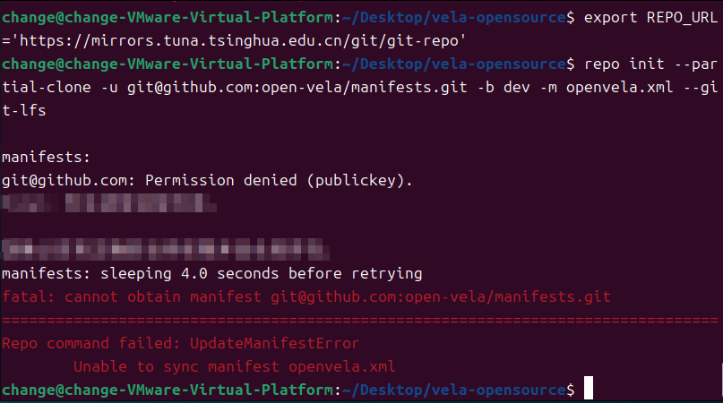
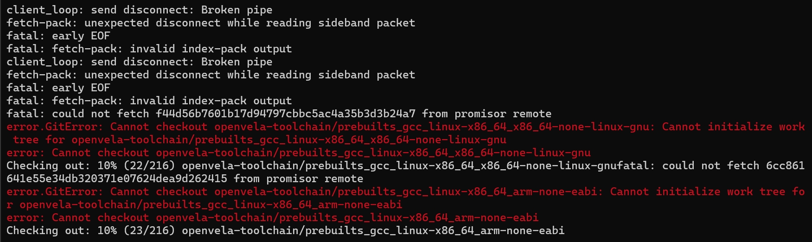
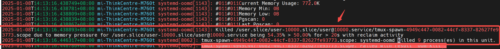
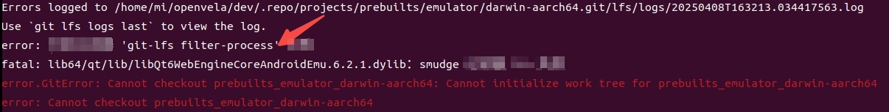
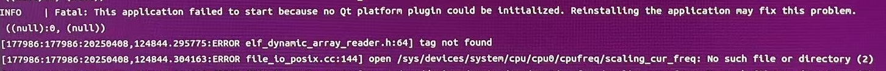

# Quick Start FAQ

\[ English | [简体中文](./../../zh-cn/faq/QuickStart_FAQ.md) \]

## I. Unable to Access Remote Repository

### Problem Description

The following error occurs when initializing the openvela repository:

```Bash
repo init --partial-clone -u git@gitee.com:open-vela/manifests.git -b dev -m openvela.xml --git-lfs
```



### Root Cause

**SSH public key not properly configured**, preventing access to Gitee or GitHub remote repositories via SSH protocol.

### Solution

Refer to the official documentation to complete **SSH public key** generation and configuration:

- [GitHub](https://docs.github.com/zh/authentication/connecting-to-github-with-ssh/adding-a-new-ssh-key-to-your-github-account)
- [Gitee](https://gitee.com/help/articles/4191#article-header0)

## II. Unable to Access Google Source Code Repository

### Problem Description

When running the repo initialization command, the following error appears:

```Bash
fatal: unable to access 'https://gerrit.googlesource.com/git-repo/': Failed to connect to gerrit.googlesource.com
```


### Root Cause

Network restrictions, mirror source regional limitations, or DNS resolution issues preventing access to Google's code repository.

### Solution

- Permanently modify the repo source:

    ```Shell
    # Find the repo script path
    which repo
    # For example, the result is /usr/bin/repo

    # Switch to Tsinghua mirror, replace /usr/bin/repo with the actual file path
    sed -i 's#https://gerrit.googlesource.com/git-repo#https://mirrors.tuna.tsinghua.edu.cn/git/git-repo#' /usr/bin/repo

    # Or switch to USTC mirror (backup, if Tsinghua mirror is unstable), replace /usr/bin/repo with the actual file path
    sed -i 's#https://gerrit.googlesource.com/git-repo#https://mirrors.ustc.edu.cn/aosp/git-repo#' /usr/bin/repo
    ```

- Temporarily modify the repo source:

    ```Shell
    # Tsinghua mirror
    repo init xxxxxx  --repo-url=https://mirrors.tuna.tsinghua.edu.cn/git/git-repo
    
    # USTC mirror (backup)
    repo init xxxxxx  --repo-url=https://mirrors.ustc.edu.cn/aosp/git-repo
    ```

## III. Repo Sync Fails Due to Network Interruption

### Problem Description

The `repo sync` command is interrupted with a fatal: **early EOF error**.



### Root Cause

- **SSH** protocol lacks stability during network fluctuations.
- Large file transfers time out.

### Solution

Switch to **HTTPS** protocol for downloading.

- Github：

    ```Bash
    repo init --partial-clone -u https://github.com/open-vela/manifests.git -b dev -m openvela.xml --git-lfs
    
    
    # Install Git LFS (Large File Storage) for managing large files
    sudo apt install git-lfs
    cd .repo/manifests 
    git lfs install
    git lfs --version
    cd ../../
    ```

- Gitee：

    ```Bash
    repo init --partial-clone -u https://gitee.com/open-vela/manifests.git -b dev -m openvela.xml --git-lfs
    
    
    # Install Git LFS (Large File Storage) for managing large files
    sudo apt install git-lfs
    cd .repo/manifests 
    git lfs install
    git lfs --version
    cd ../../
    ```

## IV. Code Fetching Fails Due to Insufficient Memory

### Problem Description

The terminal is terminated during code synchronization; checking `/var/log/syslog` reveals **OOM-related** logs.



### Root Cause

- In **Ubuntu 22.04** and above, when memory usage exceeds **50%** for more than **20 seconds** and cannot be reclaimed, the **systemd-oomd** process terminates processes consuming large amounts of memory.

- Physical memory less than 16GB.

### Solution

1. Temporarily disable the **systemd-oomd** daemon:

    ```Shell
    sudo systemctl stop systemd-oomd systemd-oomd.socket
    sudo systemctl status systemd-oomd
    ```

2. Re-enable the daemon after download completion:

    ```Shell
    sudo systemctl start systemd-oomd systemd-oomd.socket
    sudo systemctl status systemd-oomd
    ```

## V. Git LFS File Download Issues

### Problem Description

Large file-related errors appear during first compilation:



### Root Cause

This issue is typically caused by **Git Large File Storage (Git LFS)** files not being correctly downloaded, possibly due to:

1. Using an outdated repo tool version (**below v2.10**).
2. Incorrect **Git LFS** support configuration.
3. Network interruptions causing incomplete **LFS** file downloads.

### Solution

1. Check the repo version:

    ```Bash
    repo --version
    ```

2. Confirm repo version compatibility:

   | **Version** | **Release Date** | **Support Status**                            |
   | ----------- | ---------------- | --------------------------------------------- |
   | v2.4        | 2021-01          | Experimental support, some features unstable. |
   | v2.10       | 2022-03          | Officially supported                          |
   | v2.22       | 2023-present     | Enabled by default, stable functionality.     |

3. Update repo if version is too old:

    If the version is below v2.22, it's recommended to reinstall the repo.

## VI. Qt Platform Plugin Initialization Failure

### Problem Description

The following error occurs when running the emulator:

```Bash
./emulator.sh vela
```

Error message:

```Bash
No Qt platform plugin could be initialized
```



### Root Cause

The source code path contains Chinese characters, preventing the tool from correctly parsing the path.

### Solution

Move the source code to a directory path without Chinese characters.

## VII. How to Use build.sh to Compile NuttX-supported Development Boards

Using **qemu-armv7a:nsh** as an example, two compilation methods are provided:

- Using the `build.sh` script for compilation:

    ```Bash
    # Using the improved build.sh script
    ./build.sh qemu-armv7a:nsh -j12
    ```

- Using the `configure.sh` script for compilation:

     ```Bash
    # Using NuttX's built-in configuration script
    ./tools/configure.sh -l qemu-armv7a:nsh
    make -j12
    ```

The `build.sh` script optimizes the compilation process, making operations simpler; it's recommended to use it as the first choice.
