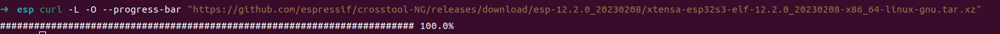
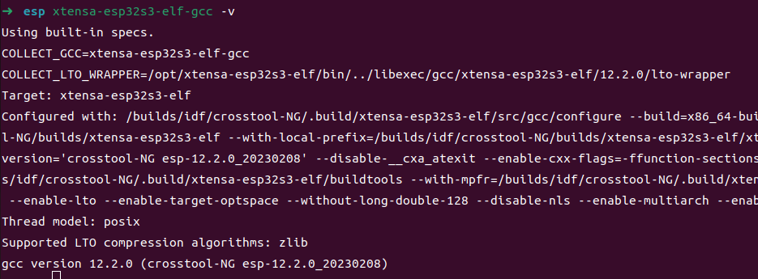
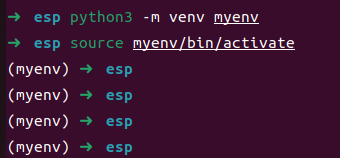
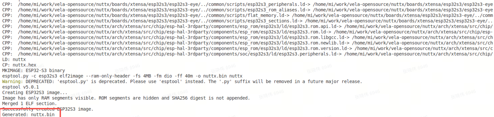

# Porting openvela to the ESP32-S3-EYE Development Board

\[ English | [简体中文](../../../zh-cn/quickstart/development_board/ESP32-S3-EYE.md) \]

## I. Overview

This guide details how to port the `openvela` system to the Espressif ESP32-S3-EYE development board, focusing on enabling its onboard Wi-Fi feature.

**Target Audience**: Engineers familiar with `openvela` and the embedded development workflow.

**Final Goal**: To successfully compile and flash a Wi-Fi-enabled `openvela` firmware to the ESP32-S3-EYE board and verify the network interface using the NuttShell (NSH) command line.

## II. Prerequisites

To download the source code, see [Quick Start](./../openvela_ubuntu_quick_start.md).

## III. Preparation: Set Up the ESP32-S3 Development Environment

You need to prepare a dedicated cross-compilation toolchain and flashing tool for the ESP32-S3 chip.

### 1. Install the ESP32-S3 Toolchain

1. Download the toolchain: Execute the following command to download the cross-compilation toolchain for the Xtensa architecture.

    ```Bash
    curl -L -O --progress-bar "https://github.com/espressif/crosstool-NG/releases/download/esp-12.2.0_20230208/xtensa-esp32s3-elf-12.2.0_20230208-x86_64-linux-gnu.tar.xz"
      ```

    

2. Extract the toolchain: Unzip the downloaded archive to your chosen installation directory (e.g., `/opt`).

    ```Bash
    tar -xf xtensa-esp32s3-elf-12.2.0_20230208-x86_64-linux-gnu.tar.xz -C /opt/
    ```

3. Configure environment variables: Add the toolchain's `bin` directory to your system's `PATH` environment variable so that the system can find the compiler.

    ```Bash
    export PATH="/opt/xtensa-esp32s3-elf/bin:$PATH"
    ```

    > **Note:** To make this configuration permanent, add the above `export` command to your `~/.bashrc` or `~/.zshrc` file, and then run `source ~/.bashrc`.

4. Verify the installation: Run the following command. If the toolchain version is displayed correctly, the installation was successful.

    ```Bash
    xtensa-esp32s3-elf-gcc -v
    ```

    

### 2. Install esptool

`esptool` is a key utility for flashing firmware to Espressif chips. We strongly recommend installing it in a Python virtual environment to avoid conflicts with other system-wide Python packages.

1. Create and activate the virtual environment:

    ```Bash
    apt install python3.10-venv
    
    python3 -m venv myenv
    source myenv/bin/activate
    ```

    After successful activation, your command line prompt will be prefixed with `(myenv)`.

    

2. Install esptool in the virtual environment:

    ```Bash
    pip install esptool
    ```

    > **Note**: All subsequent compilation and flashing operations should be performed within this activated `(myenv)` environment.

    

## IV. Porting and Compilation

This section guides you through creating a board-specific configuration file and compiling the firmware.

### 1. Understand the esp32s3-eye Board-Level Code Structure

Before proceeding with the configuration, familiarize yourself with the Board Support Package (BSP) [directory structure](../../../../../../nuttx/tree/dev-ai-contest-2026/boards/xtensa/esp32s3/esp32s3-eye) for the `esp32s3-eye`. This will help you understand the purpose of each file.

```bash
esp32s3-eye/
├── configs/                 # Board-level feature configuration center, containing defconfig files for various features
│   ├── gpio/        
│   │      └── defconfig     # GPIO pin function mapping (e.g., buttons/LEDs/sensor control)
│   ├── i2c/           
│   │      └── defconfig     # I2C bus parameters (rate/device address/interrupt configuration)
│   ├── lcd/         
│   │      └── defconfig     # Display interface protocol (SPI/I2C), resolution, timing parameters
│   ├── nsh/         
│   │      └── defconfig     # NuttShell (NSH) interactive environment configuration (serial terminal/startup script)
│   ├── usbhsh/      
│   │       └── defconfig    # USB Host stack configuration (peripheral driver support)
│   └── wifi/        
│           └── defconfig    # Wi-Fi/BLE wireless protocol parameters (SSID/encryption/RF calibration)
├── include/                 # Board-level Hardware Abstraction Layer (HAL) header files
│   └── board.h              # Defines memory layout, clock, peripheral base addresses, etc.
├── scripts/                 # Build system scripts
│   └── Make.defs            # Defines cross-compiler, compilation options, etc.
└── src/                     # Board-level driver source code and feature initialization code
    └── Kconfig              # Kconfig menu configuration items for menuconfig
```

### 2. Create a Custom Board-Level Configuration File

You need to create a separate set of board-level configurations for your project under the `vendor` directory.

1. Create the directory structure. Execute the following command to create the required directories. The `-p` flag ensures that parent directories are also created.

    ```Bash
    mkdir -p vendor/espressif/boards/esp32s3/esp32s3-eye/configs/openvela
    ```

2. Add the Wi-Fi configuration file. In the newly created `openvela` directory, create a new file named `defconfig`. This file contains all the `openvela` configuration items required to enable the Wi-Fi feature.

3. Copy and paste the entire content from [Appendix A: Wi-Fi Feature defconfig](#appendix-a-wi-fi-feature-defconfig) into the `vendor/espressif/boards/esp32s3/esp32s3-eye/configs/openvela/defconfig` file.

### 3. Run the Compilation

Now, use the `build.sh` script and specify the path to the `defconfig` we just created to compile `openvela`.

```Bash
# Ensure you are still in the (myenv) virtual environment
rm nuttx/.config
rm nuttx/Make.defs

./build.sh vendor/espressif/boards/esp32s3/esp32s3-eye/configs/openvela/ -j8
```



## V. Flashing and Verification

After a successful compilation, flash the generated firmware to the development board and verify its functionality.

### 1. Flash the Firmware

1. Connect the development board:

    Use a USB cable to connect the ESP32-S3-EYE board to your computer.

2. Identify the serial port device:

    Run the `ls /dev/ttyACM*` or `dmesg` command to find the serial port device corresponding to the board, which is typically `/dev/ttyACM0`.

3. Execute the flash command:

    In the `nuttx` directory, run the `make flash` command. Replace `ESPTOOL_PORT` with your actual serial port device.

    ```Bash
    # Ensure you are still in the (myenv) virtual environment
    # Enter the nuttx source directory
    cd nuttx
    
    make -j$(nproc) flash ESPTOOL_PORT=/dev/ttyACM0 ESPTOOL_BINDIR=./
    ```

    

### 2. Verify the Wi-Fi Feature

1. Open a serial terminal: Use `minicom` or another serial terminal tool to connect to the board. The baud rate is typically 115200.

    ```Bash
    sudo minicom -D /dev/ttyACM0
    ```

2. Check the network interface: After the system boots, you will see the NSH command prompt `nsh>`. Type the `ifconfig` command and press Enter.

    

    **Verification Point:** If you can see the `wlan0` network interface in the output, as shown in the image above, it indicates that the Wi-Fi driver has loaded successfully and the porting is complete.

## VI. Summary

This guide demonstrated how to port `openvela` to the ESP32-S3-EYE development board and enable its Wi-Fi feature by configuring the ESP32-S3 toolchain and creating/applying a custom `defconfig` file. The core tasks involve correctly setting up the build environment and providing a `defconfig` that includes the complete network stack and drivers.

## VII. References

- [esp32s3-eye](../../../../../../nuttx/tree/dev-ai-contest-2026/boards/xtensa/esp32s3/esp32s3-eye)
- [defconfig](../../../../../../vendor_espressif/blob/dev-ai-contest-2026/boards/esp32s3/esp32s3-eye/configs/openvela/defconfig)
- [Managing esptool on virtual environment](https://nuttx.apache.org/docs/latest/platforms/xtensa/esp32s3/index.html#managing-esptool-on-virtual-environment)

## Appendix A: Wi-Fi Feature defconfig

```Bash
#
# This file is autogenerated: PLEASE DO NOT EDIT IT.
#
# You can use "make menuconfig" to make any modifications to the installed .config file.
# You can then do "make savedefconfig" to generate a new defconfig file that includes your
# modifications.
#
# CONFIG_ARCH_LEDS is not set
# CONFIG_NSH_ARGCAT is not set
# CONFIG_NSH_CMDOPT_HEXDUMP is not set
CONFIG_ARCH="xtensa"
CONFIG_ARCH_BOARD="esp32s3-eye"
CONFIG_ARCH_BOARD_COMMON=y
CONFIG_ARCH_BOARD_ESP32S3_EYE=y
CONFIG_ARCH_CHIP="esp32s3"
CONFIG_ARCH_CHIP_ESP32S3=y
CONFIG_ARCH_CHIP_ESP32S3WROOM1N4=y
CONFIG_ARCH_INTERRUPTSTACK=2048
CONFIG_ARCH_STACKDUMP=y
CONFIG_ARCH_XTENSA=y
CONFIG_BOARD_LOOPSPERMSEC=16717
CONFIG_BUILTIN=y
CONFIG_DEBUG_FULLOPT=y
CONFIG_DEBUG_SYMBOLS=y
CONFIG_DEFAULT_TASK_STACKSIZE=4096
CONFIG_DEV_ZERO=y
CONFIG_DRIVERS_IEEE80211=y
CONFIG_DRIVERS_VIDEO=y
CONFIG_DRIVERS_WIRELESS=y
CONFIG_ESP32S3_EYE_LCD=y
CONFIG_ESP32S3_GPIO_IRQ=y
CONFIG_ESP32S3_RT_TIMER_TASK_STACK_SIZE=4096
CONFIG_ESP32S3_SPI2_CLKPIN=21
CONFIG_ESP32S3_SPI2_CSPIN=44
CONFIG_ESP32S3_SPI2_MISOPIN=1
CONFIG_ESP32S3_SPI2_MOSIPIN=47
CONFIG_ESP32S3_SPIRAM=y
CONFIG_ESP32S3_SPIRAM_MODE_OCT=y
CONFIG_ESP32S3_USBSERIAL=y
CONFIG_ESP32S3_WIFI=y
CONFIG_EXAMPLES_FB=y
CONFIG_EXAMPLES_LVGLDEMO=y
CONFIG_EXAMPLES_RANDOM=y
CONFIG_FS_PROCFS=y
CONFIG_GRAPHICS_LVGL=y
CONFIG_HAVE_CXXINITIALIZE=y
CONFIG_IDLETHREAD_STACKSIZE=3072
CONFIG_INIT_ENTRYPOINT="nsh_main"
CONFIG_INIT_STACKSIZE=3072
CONFIG_INTELHEX_BINARY=y
CONFIG_IOB_NBUFFERS=124
CONFIG_IOB_THROTTLE=24
CONFIG_LCD_FRAMEBUFFER=y
CONFIG_LCD_PORTRAIT=y
CONFIG_LCD_ST7789_BGR=y
CONFIG_LCD_ST7789_FREQUENCY=40000000
CONFIG_LCD_ST7789_YRES=240
CONFIG_LIBYUV=y
CONFIG_LINE_MAX=64
CONFIG_LV_FONT_MONTSERRAT_20=y
CONFIG_LV_NUTTX_LCD_DOUBLE_BUFFER=y
CONFIG_LV_USE_CLIB_MALLOC=y
CONFIG_LV_USE_CLIB_SPRINTF=y
CONFIG_LV_USE_CLIB_STRING=y
CONFIG_LV_USE_DEMO_WIDGETS=y
CONFIG_LV_USE_LOG=y
CONFIG_LV_USE_NUTTX=y
CONFIG_LV_USE_NUTTX_LCD=y
CONFIG_LV_USE_NUTTX_TOUCHSCREEN=y
CONFIG_MM_REGIONS=2
CONFIG_NAME_MAX=48
CONFIG_NETDB_BUFSIZE=512
CONFIG_NETDB_DNSCLIENT=y
CONFIG_NETDB_DNSCLIENT_RECV_TIMEOUT=2
CONFIG_NETDB_DNSCLIENT_RETRIES=8
CONFIG_NETDB_DNSSERVER_NOADDR=y
CONFIG_NETDEV_LATEINIT=y
CONFIG_NETDEV_MAX_IPv6_ADDR=4
CONFIG_NETDEV_MULTIPLE_IPv6=y
CONFIG_NETDEV_PHY_IOCTL=y
CONFIG_NETDEV_STATISTICS=y
CONFIG_NETDEV_WIRELESS_IOCTL=y
CONFIG_NETDOWN_NOTIFIER=y
CONFIG_NETLINK_ALLOC_CONNS=1
CONFIG_NETLINK_ROUTE=y
CONFIG_NETUTILS_CJSON=y
CONFIG_NETUTILS_DHCPC_RECV_TIMEOUT_MS=200
CONFIG_NETUTILS_DHCPC_RETRIES=20
CONFIG_NETUTILS_IPERF=y
CONFIG_NET_ALLOC_DEVIF_CALLBACKS=1
CONFIG_NET_ARPTAB_SIZE=48
CONFIG_NET_ARP_IPIN=y
CONFIG_NET_BROADCAST=y
CONFIG_NET_ETH_PKTSIZE=1514
CONFIG_NET_GUARDSIZE=4
CONFIG_NET_ICMP_ALLOC_CONNS=1
CONFIG_NET_ICMP_NPOLLWAITERS=2
CONFIG_NET_ICMP_SOCKET=y
CONFIG_NET_ICMPv6=y
CONFIG_NET_ICMPv6_ALLOC_CONNS=1
CONFIG_NET_ICMPv6_AUTOCONF=y
CONFIG_NET_ICMPv6_NEIGHBOR=y
CONFIG_NET_ICMPv6_SOCKET=y
CONFIG_NET_IPFRAG=y
CONFIG_NET_IPv6=y
CONFIG_NET_LOCAL=y
CONFIG_NET_LOCAL_SCM=y
CONFIG_NET_LOOPBACK=y
CONFIG_NET_NETLINK=y
CONFIG_NET_PKT=y
CONFIG_NET_SEND_BUFSIZE=16384
CONFIG_NET_STATISTICS=y
CONFIG_NET_TCP=y
CONFIG_NET_TCPBACKLOG=y
CONFIG_NET_TCP_ALLOC_CONNS=1
CONFIG_NET_TCP_DELAYED_ACK=y
CONFIG_NET_TCP_NWRBCHAINS=128
CONFIG_NET_TCP_RTO=1
CONFIG_NET_TCP_SELECTIVE_ACK=y
CONFIG_NET_TCP_WAIT_TIMEOUT=0
CONFIG_NET_TCP_WRITE_BUFFERS=y
CONFIG_NET_UDP=y
CONFIG_NET_UDP_ALLOC_CONNS=1
CONFIG_NET_UDP_NOTIFIER=y
CONFIG_NET_UDP_NWRBCHAINS=64
CONFIG_NET_UDP_WRITE_BUFFERS=y
CONFIG_NSH_ARCHINIT=y
CONFIG_NSH_BUILTIN_APPS=y
CONFIG_NSH_FILEIOSIZE=512
CONFIG_NSH_READLINE=y
CONFIG_POSIX_SPAWN_DEFAULT_STACKSIZE=2048
CONFIG_PREALLOC_TIMERS=4
CONFIG_PTHREAD_MUTEX_TYPES=y
CONFIG_RAM_SIZE=114688
CONFIG_RAM_START=0x20000000
CONFIG_RR_INTERVAL=200
CONFIG_SCHED_LPWORK=y
CONFIG_SCHED_WAITPID=y
CONFIG_SIG_DEFAULT=y
CONFIG_SMP=y
CONFIG_SMP_NCPUS=2
CONFIG_START_DAY=6
CONFIG_START_MONTH=12
CONFIG_START_YEAR=2011
CONFIG_SYSLOG_BUFFER=y
CONFIG_SYSTEM_DHCPC_RENEW6=y
CONFIG_SYSTEM_DHCPC_RENEW=y
CONFIG_SYSTEM_NSH=y
CONFIG_SYSTEM_PING=y
CONFIG_SYSTEM_PING_STACKSIZE=3072
CONFIG_SYSTEM_TCPDUMP=y
CONFIG_TIMER=y
CONFIG_TLS_TASK_NELEM=4
CONFIG_UTILS_IPERF2=y
CONFIG_VIDEO=y
CONFIG_VIDEO_FB=y
CONFIG_WIRELESS=y
CONFIG_WIRELESS_WAPI=y
CONFIG_WIRELESS_WAPI_CMDTOOL=y
CONFIG_WIRELESS_WAPI_INITCONF=y
CONFIG_WIRELESS_WAPI_STACKSIZE=8192
```