# Blinking an LED on STM32F411 with openvela

\[ English | [简体中文](../../../zh-cn/quickstart/development_board/STM32F411.md) \]

## I. Overview

This guide will walk you through a basic LED blinking example on the `STM32F411` microcontroller, based on the `openvela` real-time operating system. You will learn the basic workflow of using `openvela`, including setting up the development environment, compiling the project, flashing the firmware, and registering and using the `LED` driver.

## II. Final Result

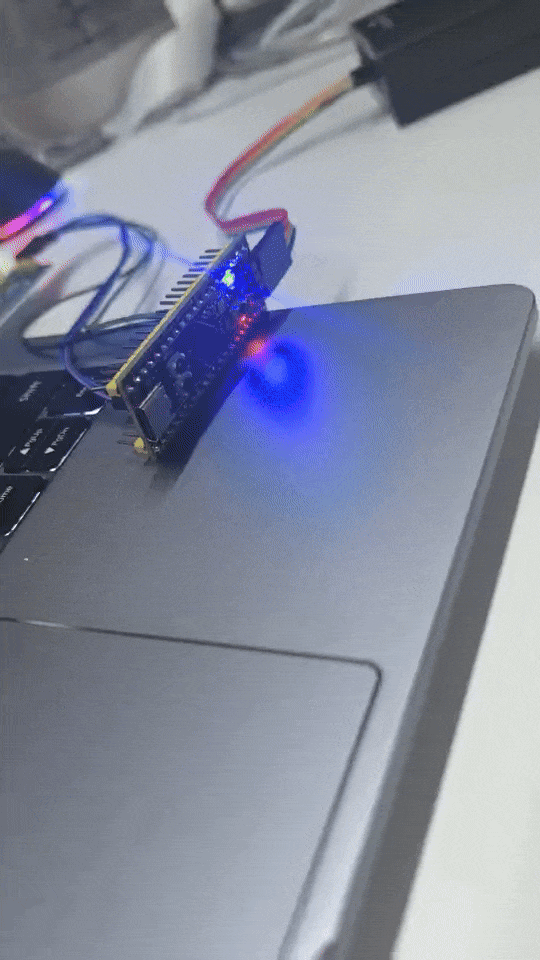

## III. Preparations

### 1. Hardware

- **Development Board**: A board based on the STM32F411.
- **Debugger**: An ST-Link V2 debugger (or the onboard ST-Link).
- **Serial Tool**: A USB to TTL serial module for viewing log output.
- **Cables**: A USB data cable and several Dupont wires.

### 2. Software and Toolchain

Please install and configure the following software on your development host (Ubuntu).

1. **Set up the openvela development environment.**

    Please refer to the official [Quick Start](./../openvela_ubuntu_quick_start.md) document to set up the basic `openvela` development environment.

2. **Install the ARM GCC toolchain.**

    This toolchain is used to compile firmware for the target platform. Open a terminal and execute the following command:

    ```Bash
    sudo apt install gcc-arm-none-eabi binutils-arm-none-eabi
    ```

3. **Install STM32CubeProgrammer.**

    This tool is used to flash the compiled firmware to the STM32 microcontroller.

    - **Download Link**: Please download the version matching your operating system from the [ST official website](https://www.st.com/en/development-tools/stm32cubeprog.html) and complete the installation.

        

    - **Install Dependencies**: To ensure STM32CubeProgrammer can correctly identify USB devices, please install `libusb`.

        ```Bash
        sudo apt-get install libusb-1.0.0-dev
        ```

4. **Install ST-Link drivers.**

    To allow the Linux system to access the ST-Link device with normal user permissions, you need to install udev rules.

    - **Download Link**: Please download the `stsw-link007` package from the [ST official website](https://www.st.com/en/development-tools/stsw-link007.html#get-software) and extract it.

    - **Run the installation script**: Follow the instructions in the `readme.txt` file within the package to install the udev rules.

        ```bash
        sudo sh st-stlink-udev-rules-*-linux-noarch.sh
        ```

5. **The startup interface looks like this:**

    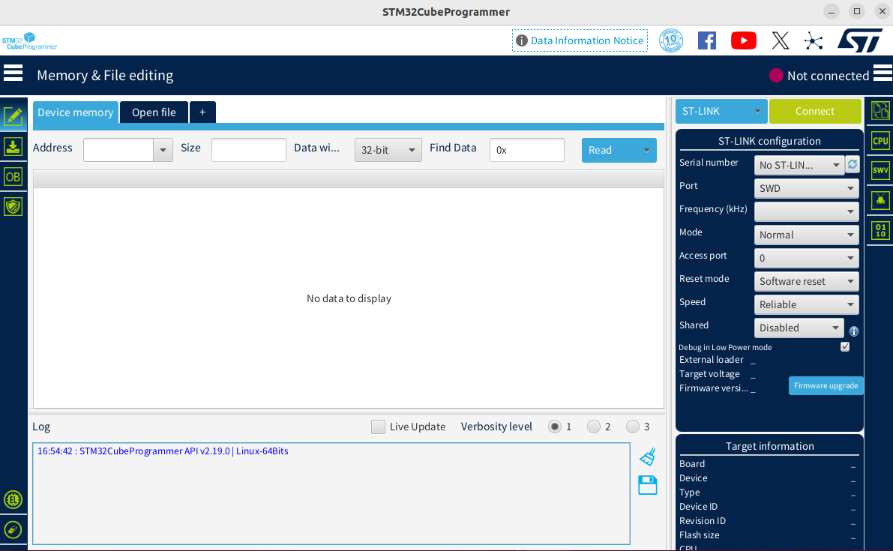

### 3. Hardware Connection and Verification

1. **Refer to the schematic to prepare the hardware connections.**

    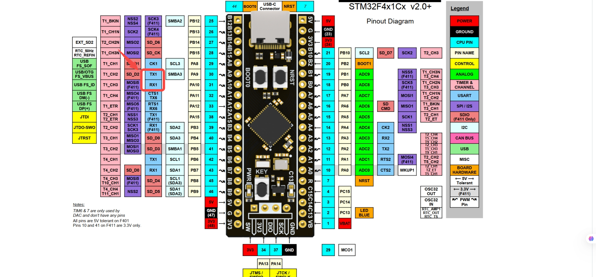

2. **Please connect the components as shown in the table below.**

    | From                  | To                        | Description          |
    | --------------------- | ------------------------- | -------------------- |
    | PC USB Port           | ST-Link Debugger USB Port | Power and Debugging  |
    | USB to TTL Module TX  | Board PA10 (USART1_RX)    | Serial Communication |
    | USB to TTL Module RX  | Board PA9 (USART1_TX)     | Serial Communication |
    | USB to TTL Module GND | Board GND                 | Common Ground        |

    A reference for the physical connection is shown below:

    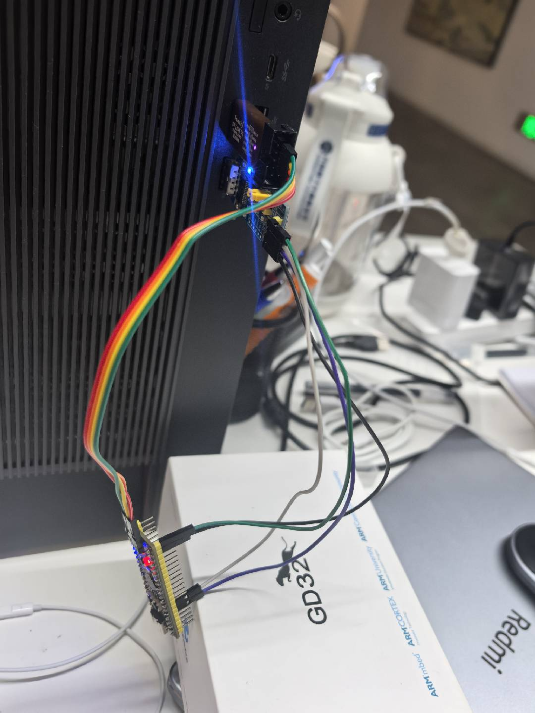

3. **Verify the connection.**

    Use the STM32CubeProgrammer tool to verify if the hardware connection is successful.

    1. Launch **STM32CubeProgrammer**.
    2. In the **ST-LINK Configuration** area in the upper right, click the **Refresh** button. If a device serial number appears in the **Serial number** dropdown list, the debugger has been successfully recognized.

        

    3. Select **Erasing & Programming** from the left navigation bar, as shown below:

        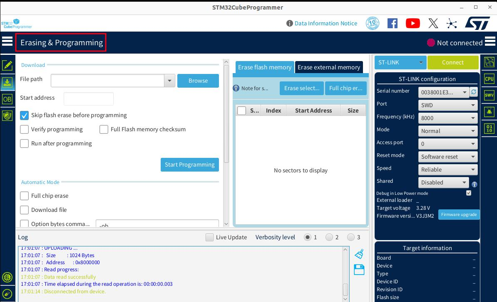

    4. Select the **J-Link** or **STLINK** method and click the green **Connect** button. When the button changes to **Disconnect**, it means the development board is successfully connected, as shown below:

        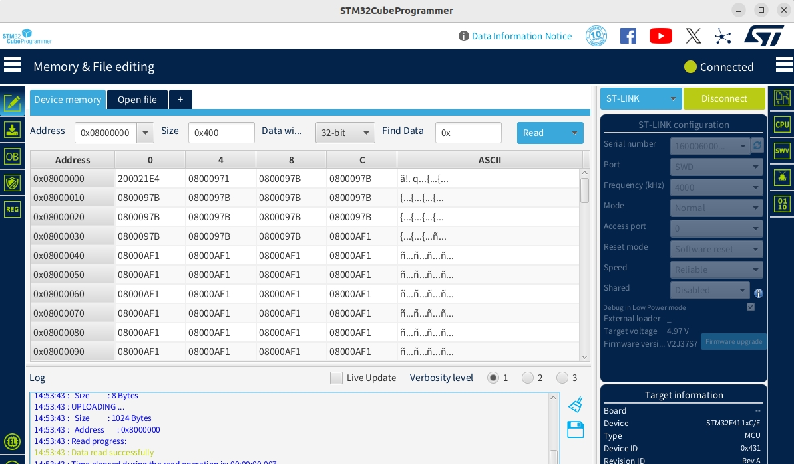

## IV. Running the Demo

This section will guide you on how to compile and run an LED blinking example for the `STM32F411-minimum` board based on the `openvela` source code.

### 1. Get the Sample Code

Please ensure you have the complete `openvela` source code ready locally, following the official documentation [Download openvela Source Code](../../quickstart/Download_Vela_sources.md).

### 2. (Optional) Understand the Project Structure

The `openvela` code follows a layered design. Understanding the key directories will help with future custom development.

- **Application Layer (Examples)**: [nuttx-apps/examples/leds](../../../../../../../open-vela/nuttx-apps/tree/dev-ai-contest-2026/examples/leds)
- **Board Support Package (BSP)**: [nuttx/boards/arm/stm32/stm32f411-minimum](../../../../../../../open-vela/nuttx/tree/dev-ai-contest-2026/boards/arm/stm32/stm32f411-minimum)

The table below briefly describes the function of core directories:

| Directory Path                                 | Function Description                                                                                                                                             |
| ---------------------------------------------- | ---------------------------------------------------------------------------------------------------------------------------------------------------------------- |
| `nuttx/boards/arm/stm32/stm32f411-minimum/src` | Contains STM32F411 board-specific driver implementations, such as GPIO initialization and device registration (e.g., /dev/userleds).                             |
| `nuttx/arch/arm/src/stm32`                     | Contains generic SoC-level drivers for the STM32 chip family, such as low-level R/W and clock configuration for I2C, SPI, GPIO.                                  |
| `nuttx/drivers`                                | Contains upper-layer driver interfaces compliant with the openvela standard driver model. Applications interact with hardware through these standard interfaces. |

### 3. Load and Configure the Project

1. Execute the following command to open the `menuconfig` configuration interface:

    ```Bash
    ./build.sh nuttx/boards/arm/stm32/stm32f411-minimum/configs/rgbled menuconfig
    ```

2. **Select the target board.**

    1. Press Enter to go to **Board Selection** and open the board selection menu.

        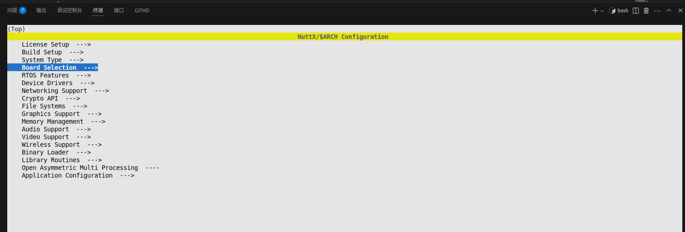

    2. Press Enter to select **Select target board** and choose the target platform to compile for:

        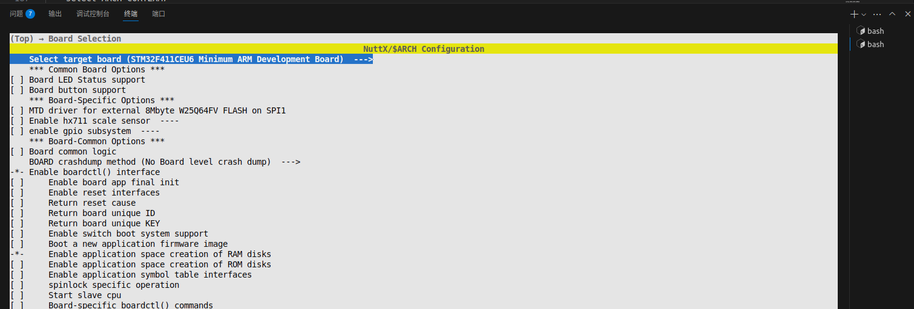

    3. ress Enter to select **STM32F411CEU6 Minimum ARM Development Board** to compile firmware for the STM32F411CEU6 minimum system board:

        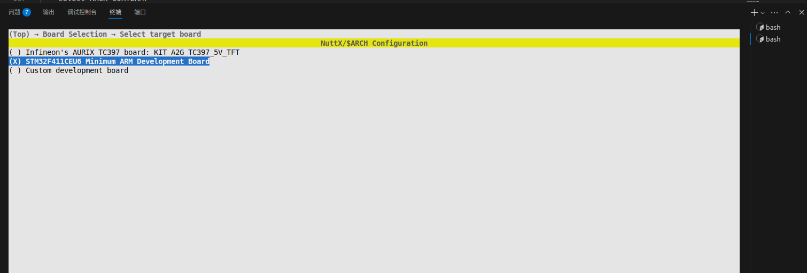

3. **Enable the LED driver.**

    1. Press Esc twice to return to the top-level menu, then select **Device Drivers**:

        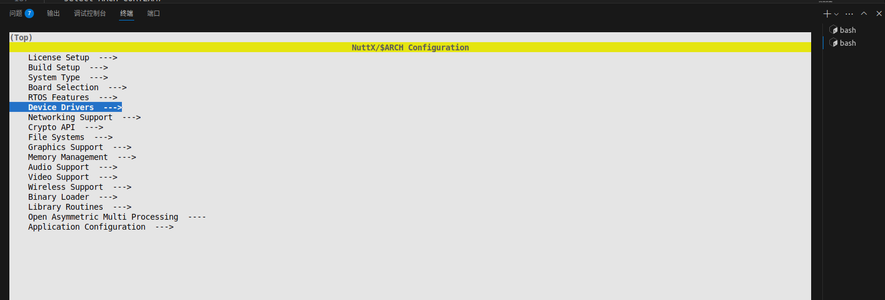

    2. Press Enter to go into `LED support`:

        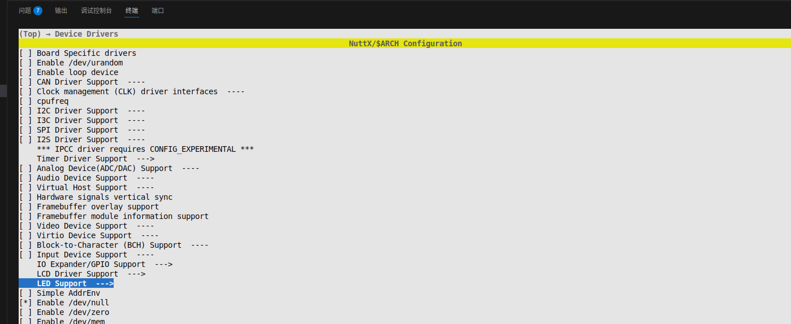

    3. Enable the following configuration options:

        - **LED driver**
        - **Generic Lower Half LED Driver**

            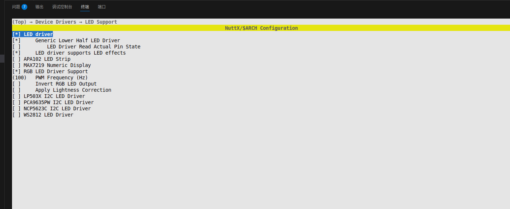

4. **Enable the example program.**

    1. Press `/` to search for and enable **EXAMPLES_LEDS**.

        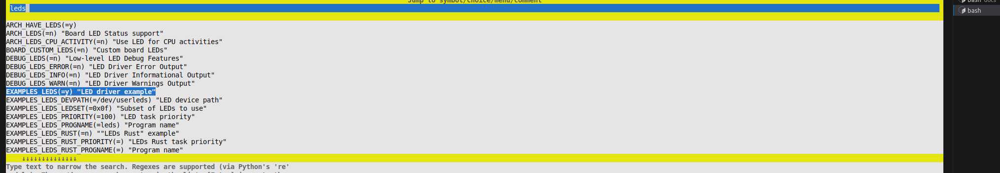

    2. Press `/` to search for and disable **ARCH_LEDS** (to avoid conflicts).

        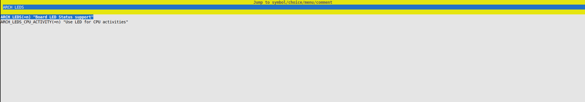

5. **Save the configuration.** Press `Q` to exit the menu and select `Y` to save the configuration.

### 4. Compile the Project

1. Return to the `openvela` root directory and use the following command to compile the LED example program:

    ```Bash
    ./build.sh nuttx/boards/arm/stm32/stm32f411-minimum/configs/rgbled -j8
    ```

2. After a successful compilation, `nuttx.hex` and `nuttx.bin` firmware files will be generated in the `nuttx` directory.

### 5. Flash the Firmware

1. Launch the **STM32CubeProgrammer** tool and connect to the development board.
2. Click **Browse**, select the firmware file generated in the previous step, **`openvela/nuttx/nuttx.hex`**, and check the box for **Skip flash erase before programming**, as shown below:

    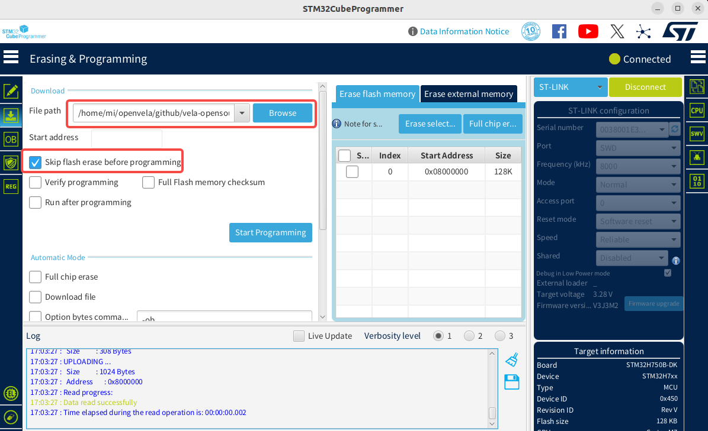

3. Click **Start Programming** to begin downloading. A pop-up will appear upon completion, and the log window will display relevant information.

    

4. If an **Error** occurs during the download, click the **Full chip erase** button to erase the chip data, then try downloading the firmware again.

    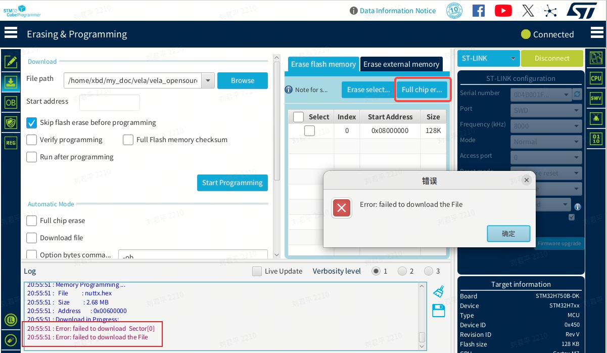

### 6. Connect to the Serial Port

1. Use **Minicom** or another serial terminal tool to connect to the board.

    ```Bash
    # Note: Your device might be ttyACM1, please modify accordingly.
    sudo minicom -D /dev/ttyACM0 -b 115200
    ```

2. (Optional) If Minicom does not accept keyboard input on the first use, follow these steps to modify its configuration:

    1. Use the following command to open the Minicom configuration interface:

        ```Bash
        sudo minicom -s
        ```

        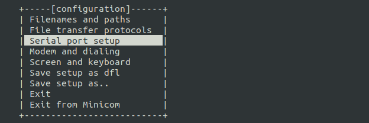

    2. Go to the **Serial port setup** menu and ensure the following two options are set to **No**:

        - Hardware Flow Control: No
        - Software Flow Control: No

            

    3. Select `Save setup as dfl` to save as the default configuration, then `Exit`.

    4. Reconnect. If problems persist, press the `Reset` button on the development board.

### 7. Run the LED Example

1. Reopen Minicom. After a successful connection, press Enter in the terminal, and you will see the `nsh>` prompt.

    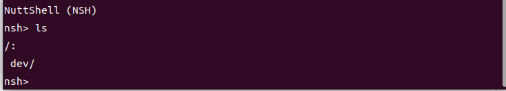

2. To run the LED example, enter the following command:

    ```bash
    leds
    ```

3. You will see the user LED on the board start blinking, and the serial terminal will output run logs.

## V. How to Add a New Demo

This chapter will guide you on how to add, configure, and run a custom LED control application in the `openvela` `packages/demos` directory.

### 1. Core Steps Overview

Integrating a new application into `openvela` primarily follows this workflow:

1. **Create Application Files**: Create a new directory under `packages/demos/` and write the application's C source code, `Kconfig`, and `Makefile`.
2. **Register the Application with the Build System**: Modify the parent `Make.defs` file so the build system can discover your new application.
3. **Configure and Compile**: Enable the new application via `menuconfig` and compile to generate firmware with the new feature.
4. **Run and Verify**: Flash the firmware and run your demo via a terminal command.

### 2. Create Demo Source Code and Configuration Files

1. **Create the `led` directory:**

    ```Bash
    # Ensure you are in the openvela source root directory
    mkdir -p packages/demos/led
    ```

2. **Create the C source file (`packages/demos/led/led_main.c`):** This file contains the core logic of the demo, interacting with the low-level LED driver via the `ioctl` system call.

    ```C++
    /****************************************************************************
    * Included Files
    ****************************************************************************/
    #include <nuttx/config.h>
    #include <nuttx/leds/userled.h>
    #include <sys/ioctl.h>
    #include <stdio.h>
    #include <stdlib.h>
    #include <fcntl.h>
    #include <unistd.h>
    /****************************************************************************
    * Public Functions
    ****************************************************************************/
    int main(int argc, char *argv[])
    {
        int fd;
        int ret;
        userled_set_t ledset; // Define a set of LED states
        printf("Starting LED Demo...\n");
        // 1. Open the userled device driver
        fd = open("/dev/userleds", O_WRONLY);
        if (fd < 0)
        {
            printf("Failed to open /dev/userleds, please ensure USERLED is enabled.\n");
            return -1;
        }
        // 2. Turn on the first LED (usually LED 0)
        printf("Turning ON LED 0.\n");
        ledset = 1 << 0; // Use a bitmask to select the first LED
        ret = ioctl(fd, ULEDIOC_SETALL, (unsigned long)ledset);
        if (ret < 0)
        {
            printf("ioctl(ULEDIOC_SETALL) failed: %d\n", ret);
            close(fd);
            return -1;
        }
        sleep(2); // Stay on for 2 seconds
        // 3. Turn off all LEDs
        printf("Turning OFF all LEDs.\n");
        ledset = 0;
        ioctl(fd, ULEDIOC_SETALL, (unsigned long)ledset);
        // 4. Close the device
        close(fd);
        printf("LED Demo finished.\n");
        return 0;
    }
    ```

3. **Create the `Kconfig` file:** This file creates a separate configuration option in `menuconfig` to control whether this demo is compiled.

    `packages/demos/led/Kconfig`:

    ```Kconfig
    # Defines the configuration option for the custom LED Demo.
    # This will appear under "Application Configuration -> Demos".
    config APP_DEMOS_LED
        bool "Custom LED control demo"
        default n
        depends on USERLED  # This demo requires the base USERLED driver
        ---help---
            Enable this to build the custom LED control demo, which
            demonstrates how to turn an LED on and off via ioctl.
    ```

    **Note**: We created a separate `APP_DEMOS_LED` option instead of reusing `EXAMPLES_LEDS`. This makes the new demo's logic clear and its configuration simple, avoiding unnecessary dependencies and confusion.

4. **Create the `Makefile`:** This file defines the compilation rules for this application, such as the program name, priority, and stack size.

    `packages/demos/led/Makefile`:

    ```Makefile
    include $(APPDIR)/Make.defs
    # Application details, linked to the Kconfig option
    PROGNAME  = led_demo
    PRIORITY  = 100
    STACKSIZE = 2048
    # Source file for the application
    MAINSRC = led_main.c
    include $(APPDIR)/Application.mk
    ```

### 3. Register the New Demo with the Build System

Edit the `Make.defs` file in the `packages/demos/` directory to add our `led` demo to the compilation list.

1. Open the `packages/demos/Make.defs` file.

2. Add the following code at the end of the file:

    ```Makefile
    # ... (other demo configurations might be here) ...
    # Add our custom LED demo to the build if it's enabled in Kconfig.
    ifneq ($(CONFIG_APP_DEMOS_LED),)
    CONFIGURED_APPS += $(APPDIR)/packages/demos/led
    endif
    ```

### 4. Configure and Compile

#### Configure the Project

Return to the `openvela` root directory and run `menuconfig`.

```Bash
./build.sh nuttx/boards/arm/stm32/stm32f411-minimum/configs/rgbled menuconfig
```

#### Enable Required Configurations

In the `menuconfig` interface, ensure the following two options are enabled (you can use `/` to search):

- **Enable the low-level LED driver (dependency)**

    - Path: `Device Drivers ---> LED Driver Support ---> [*] User LED Support`
    - Ensure `CONFIG_USERLED` is checked.

- **Enable the LED Demo**
    - Path: `Application Configuration ---> Demos ---> [*] Custom LED control demo`
    - Ensure `CONFIG_APP_DEMOS_LED` is checked.

Save the configuration and exit.

#### Compile the Project

Switch to the `openvela` root directory, clean the previous build, and then build the project:

```Bash
# (Optional but recommended) Clean previous build artifacts
./build.sh nuttx/boards/arm/stm32/stm32f411-minimum/configs/rgbled distclean
# Build the project with the new configuration
./build.sh nuttx/boards/arm/stm32/stm32f411-minimum/configs/rgbled -j8
```

### 5. Run the Demo

Please follow the instructions in [Chapter 4](#iv-running-the-demo) to run the demo.

1. **Flash the firmware**: Follow the instructions in [Flash the Firmware](#5-flash-the-firmware) to flash the newly generated `nuttx/nuttx.hex` file.

2. **Run the command**: Connect to the serial terminal and, at the `nsh>` prompt, enter the program name defined in the `Makefile`, `led_demo`.

    ```Shell
    nsh> led_demo
    ```

3. **Observe the results**:
    - You will see log output like **Starting LED Demo...** in the terminal.
    - Simultaneously, the user LED on the board will **turn on for 2 seconds, and then turn off**.

## VI. FAQ

### 1. `undefined reference to board_userled...` error during compilation

#### Symptom

After configuring `menuconfig` and running the build, a linker error similar to the following **undefined reference** occurs.

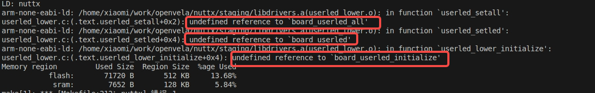

#### Cause Analysis

This is a configuration conflict between the generic `USERLED` driver and the board-specific `ARCH_LEDS` driver.

- `CONFIG_USERLED=y`: Enables the generic `/dev/userleds` driver framework. This framework relies on low-level `board_userled...` functions to perform actual hardware operations.
- `CONFIG_ARCH_LEDS=y`: Enables the board-level LED driver. In this mode, the system assumes that LEDs are controlled directly by architecture-specific code, so it does not compile and link the `board_userled...` related functions. This causes the `USERLED` driver to fail to find its implementation, resulting in a linker error.

#### Solution

Disable the board-level `ARCH_LEDS` driver to allow the generic `USERLED` driver to work correctly.

1. Enter `menuconfig`:

    ```Bash
    ./build.sh nuttx/boards/arm/stm32/stm32f411-minimum/configs/rgbled menuconfig
    ```

2. Disable `ARCH_LEDS`.

3. Clean and recompile:

    ```Bash
    # Clean old configuration and build artifacts
    ./build.sh nuttx/boards/arm/stm32/stm32f411-minimum/configs/rgbled distclean
    # Recompile the project
    ./build.sh nuttx/boards/arm/stm32/stm32f411-minimum/configs/rgbled -j8
    ```

### 2. Program reports `Failed to open /dev/userleds` at runtime

#### Symptom

When running the demo in the terminal, the program outputs an error message and cannot open the device file.

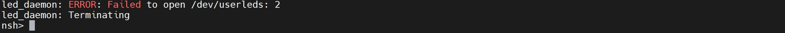

#### Cause Analysis

This issue indicates that the `/dev/userleds` device node has not been created. This is usually because openvela's generic `USERLED` driver was not enabled in the configuration, so the relevant code was not compiled into the firmware.

#### Solution

As described in the demo's Kconfig file, enable the **EXAMPLES_LEDS** and **USERLED** configurations.

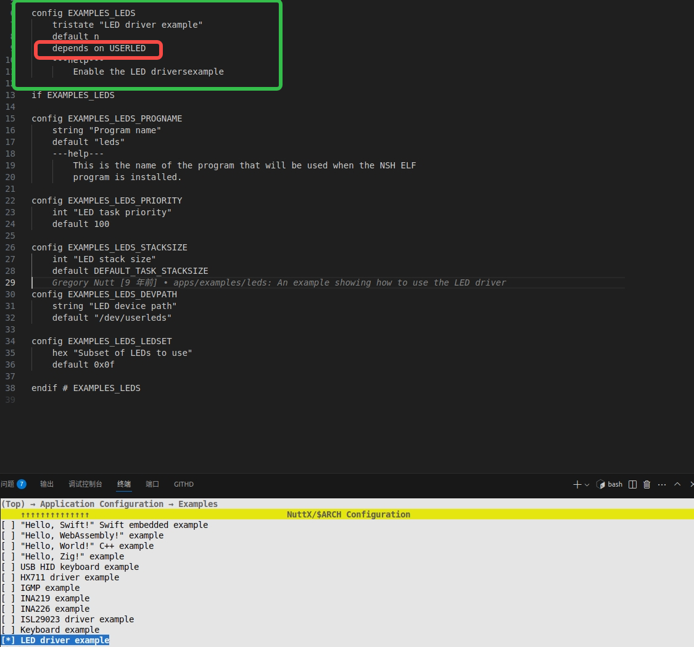

### 3. What is the difference between the `packages/demos` and `nuttx/apps/examples` directories?

- **https://github.com/open-vela/nuttx-apps/tree/dev-ai-contest-2026/examples**

    - **Source**: Official NuttX community.
    - **Content**: Contains various examples maintained by the NuttX community to demonstrate its core features.
    - **Nature**: Generic, application-agnostic.

- **https://github.com/open-vela/packages_demos**

    - **Source**: openvela project.
    - **Content**: Contains examples created to showcase specific openvelaela features or integration solutions.
    - **Nature**: Customized for openvelapenVela, tightly coupled with the project.

- **Development Recommendation**: When adding custom demos or applications to your openvela project, it is highly recommended to create them in the **`packages/demos`** directory.

## VII. References

- **[Deploying openvela on STM32H750](../../en/quickstart/development_board/STM32H750.md)**

    - A concrete, end-to-end hardware deployment case study.

- **[NuttX Official Documentation](https://nuttx.apache.org/docs/latest/)**

    - The definitive guide to understanding the underlying mechanisms of NuttX. The **Build System** and **Kconfig** sections are especially crucial for adding new components.

- **[STM32CubeProgrammer Software Guide](https://www.st.com/en/development-tools/stm32cubeprog.html)**

    - Learn how to use the official ST tools for operations like flashing firmware and configuring option bytes.
