# Deploy openvela on STM32H750 ​

\[ English | [简体中文](../../../zh-cn/quickstart/development_board/STM32H750.md) \]

## I. Overview

This document explains how to deploy openvela on the STMicroelectronics **STM32H750** microcontroller development board (STM32H750). It also shows how to run a Light and Versatile Graphics Library (**LVGL**) demo on the openvela operating system.

## II. Preparation

### 1. Set up the development environment

1. Configure the build environment:

    To compile openvela, you need to set up the development environment. For details, see [Quick Start](./../openvela_ubuntu_quick_start.md).


2. Install the build tools:

    ```Bash
    sudo apt install gcc-arm-none-eabi binutils-arm-none-eabi
    ```

3. Download the required software:

    1. Download and install STM32CubeProgrammer, which is used to flash firmware. Get the installer from the [official STM32CubeProgrammer download page](https://www.st.com/en/development-tools/stm32cubeprog.html).

    2. After installation, install **libusb** to enable USB connectivity:

        ```Bash
        sudo apt-get install libusb-1.0.0-dev 
        ```

    3. Download the [stsw‑link](https://www.st.com/en/development-tools/stsw-link007.html#get-software) package and extract it. The archive contains driver files for your platform. Follow the instructions in `readme.txt` to complete the installation:

        ```Bash
        sudo sh st-stlink-udev-rules-xxxx-linux-noarch.sh
        ```

        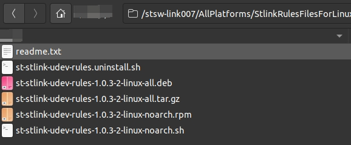

        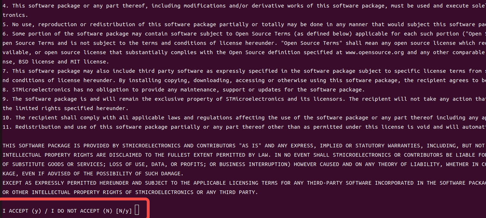

    4. When the tool starts, the home screen looks similar to the following illustration.

        

### 2. Connect the Development Board

1. Use a **USB**  data cable to connect the ST-Link debug interface of the development board to the host computer, as shown in the figure below:

    

2. Start STM32CubeProgrammer. Click the **Refresh** button (indicated by the red box). If a serial number appears in the **Serial number** dropdown list, the development board has been successfully detected.

    

3. In the left navigation bar, select **Erasing & Programming**, as shown in the figure below:

    

4. Select the **ST-LINK** connection method. Click the green **Connect** button. When the button changes to **Disconnect**, the development board is successfully connected, as shown in the figure below:

    **Note**: For **ST-LINK** documentation, see the [official documentation](https://www.st.com/resource/en/technical_note/tn1235-overview-of-stlink-derivatives-stmicroelectronics.pdf).

    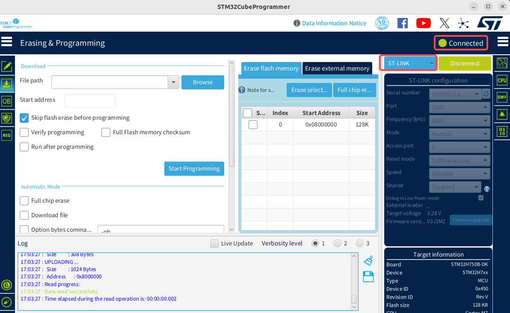

## III. Running the Demo

### 1. Download the Code

Refer to [Quick Start](../openvela_ubuntu_quick_start.md) to download the code.

### 2. Compile the code

After cloning and downloading the code repository, follow these steps to generate the required binary files for the STM32H750B-DK development board:

```Bash
# Navigate to the nuttx root directory
cd nuttx

# Configure the development board environment  
/build.sh stm32h750b-dk:lvgl -j8


# Optional: Before running 'make' to build, you can use 'make menuconfig' to modify the configuration.  
# Ensure that the required feature modules are enabled, such as the LVGL Demo example.  

# Start the build process
make
```

After the build completes, the generated files are located in the `nuttx` directory and include:

- `nuttx.bin`
- `nuttx.hex`

    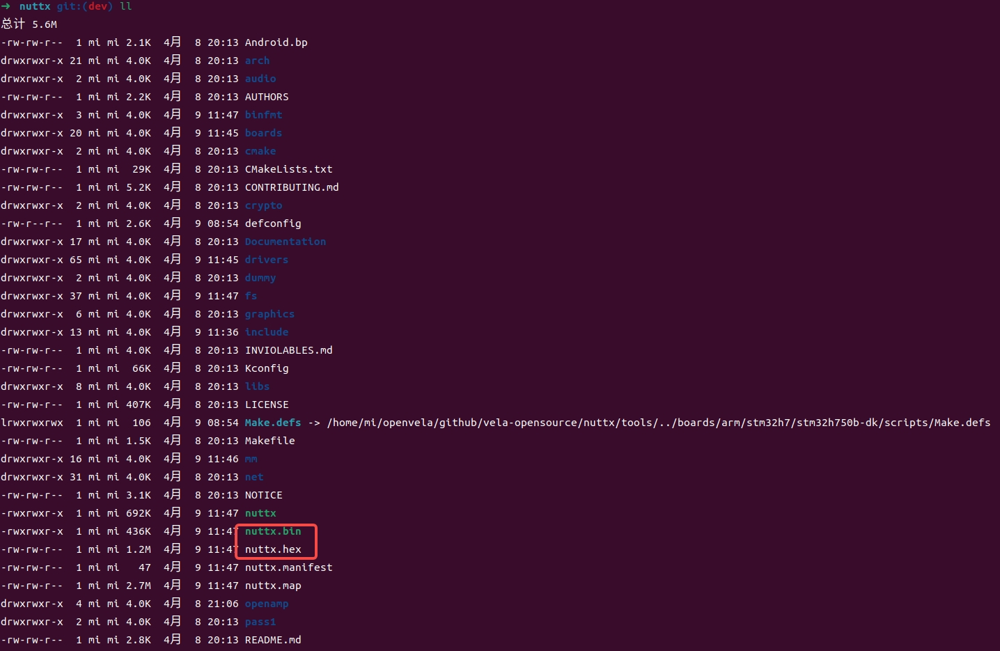

### 3. Run the program

1. Open the **STM32CubeProgrammer** tool installed in the previous step.

2. Select the binary file to download, which is the `nuttx.hex` file generated in the previous step, and check the **Skip flash erase before programming** option, as shown in the figure below:

    

3. Click the **Start Programming** button to start the download. When the download is complete, a dialog box appears, and relevant information is displayed in the log window.

    

4. If an **Error** occurs during the download, click the **Full chip erase** button to erase the chip data, then download the firmware again to resolve the issue.

    

5. Use a serial terminal tool, such as **Minicom** or **Tera Term**, to connect to and access the development board. The following example uses **Minicom**. Run the following command:

    ```Bash
    sudo minicom -D /dev/ttyACM0 -b 115200
    ```

6. Configure Minicom for serial terminal access using the following steps:

    1. If you’re using Minicom for the first time and cannot enter keyboard input, adjust the related Minicom settings.

    2. Enter the following command to open the Minicom configuration page:

        ```Bash
        sudo minicom -s
        ```

        

    3. Go to the Serial port setup configuration menu and ensure the following two settings are set to No:

        - Hardware Flow Control: No
        - Software Flow Control: No

        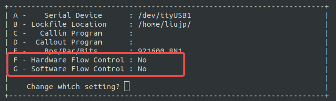

    4. After completing the configuration, restart Minicom. If you still cannot input characters, try pressing the black button on the development board, power cycle the board, and then restart Minicom again.

        

7. Enter the following command to run the sample program:

     ```Bash
    lvgldemo
    ```

    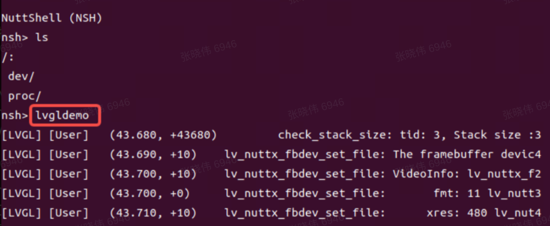

8. The sample program execution result is shown in the figure below:

    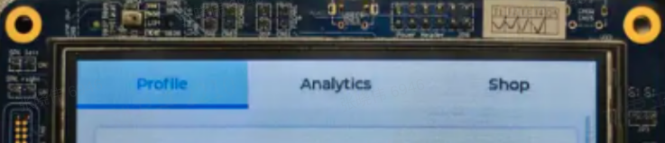

## IV. Development Board Overview

### 1. Appearance

1. Top view of the development board.

    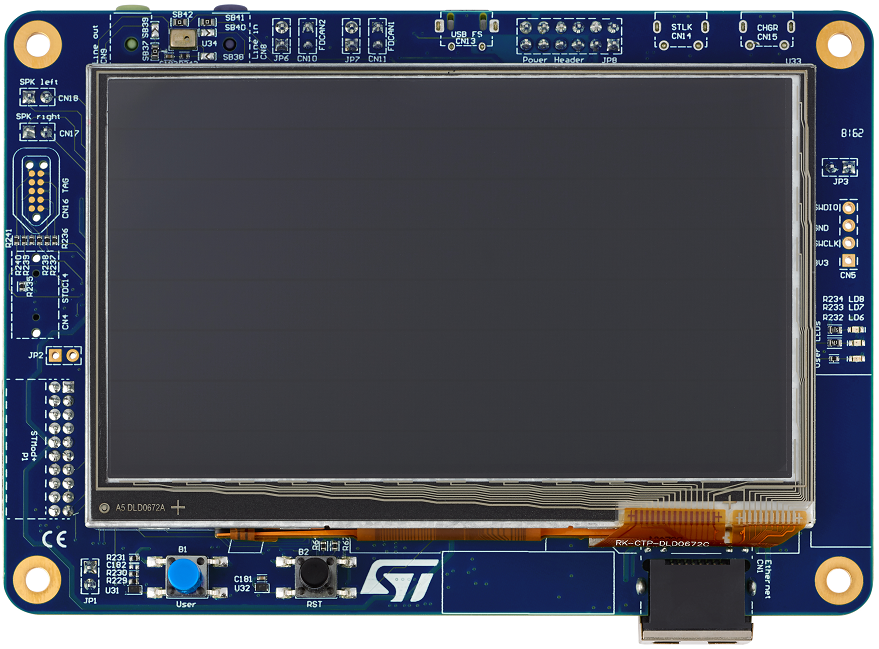

2. Bottom view of the development board.

    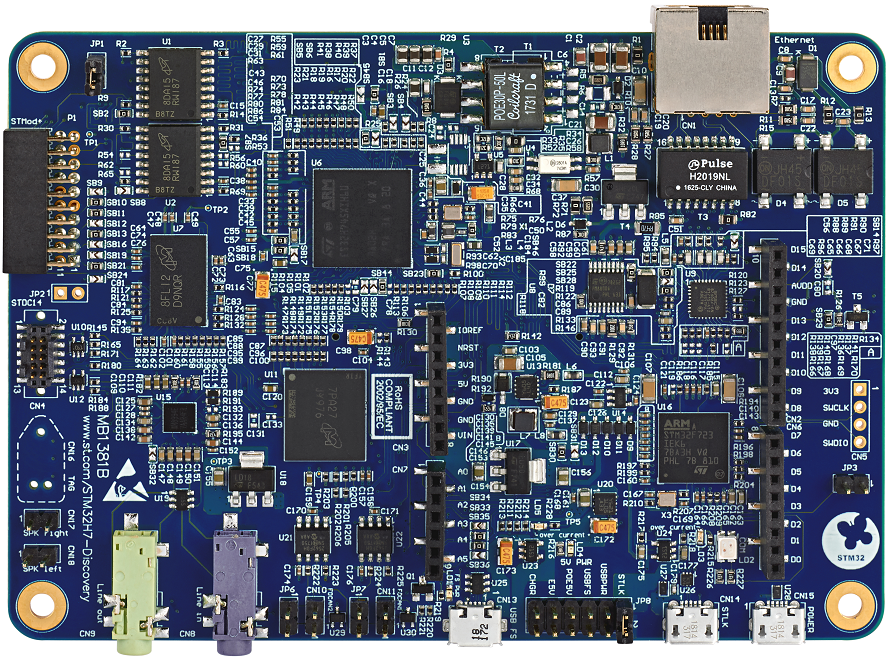

### 2. Key Hardware Features

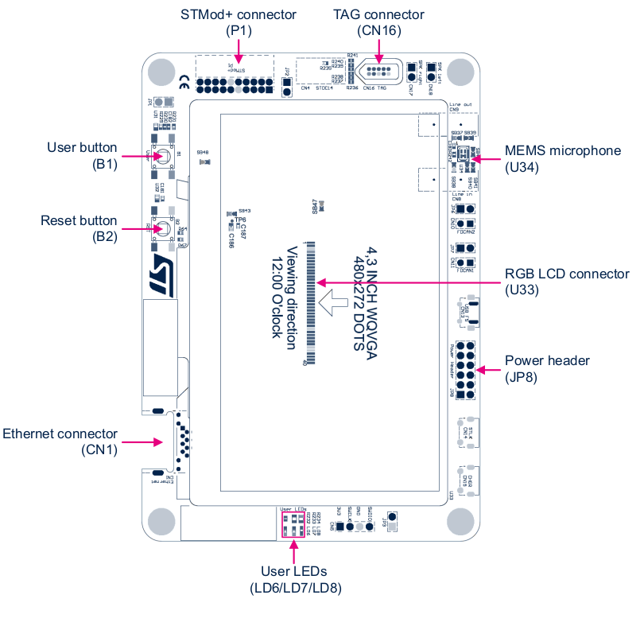


For more details about the development board, refer to the [official documentation](https://www.st.com.cn/zh/evaluation-tools/stm32h750b-dk.html#documentation).

## V. Appendix

### 1. Create Development Board Configuration File Directory

1. Under the `nuttx/boards/arm/stm32h7` directory, create the following configuration file structure for the **STM32H750B-DK** development board to support the openvela project development requirements.

    ```Bash
    nuttx/boards/arm/stm32h7
    └── stm32h750b-dk     // New development board directory
        └── configs
        │   ├── lvgl          // New defconfig directory
        │   │   └── defconfig // Configuration options
        │   └── nsh           // Other defconfig directory 
        │       └── defconfig // Configuration options
        ├── include           // Development board configuration information
        │   └── board.h
        ├── scripts           // Startup scripts and link files
        │   ├── flash.ld
        │   ├── ...
        │   └── flash_m4.ld
        ├── src                 // Development board resource files
        │   ├── stm32h745b-dk.h
        │   ├── ...
        │   └── stm32_boot.c
        ├── CMakeLists.txt      // CMake configuration file
        └── Kconfig             // Kernel configuration file
    ```

    Ensure the **configs** directory contains a defconfig file based on **lvgl** to apply the relevant configuration options.

2. Adjust the pin configuration for the LCD controller (LCDC).

    To ensure the screen displays correctly, you need to adjust the pin configuration of the LCD controller according to the hardware information of the **STM32H750B-DK** development board, so that it is consistent with the actual hardware settings. The pin mapping modification steps are as follows:

    1. Refer to the development board's [user manual](https://www.st.com/resource/en/user_manual/um2488-discovery-kits-with-stm32h745xi-and-stm32h750xb-mcus-stmicroelectronics.pdf) and the [device pinout diagram](https://www.st.com/resource/en/schematic_pack/mb1381-h750xb-b01-schematic.pdf) to find the correspondence between each signal of the **LCD Connector** and the chip pins.

        

    2. Take R3 (red data bit 3) of the **LCD panel** as an example:  

        1. The R3 signal is connected to pin PH9 of the STM32H750 chip.  
        2. In the `stm32h7xxx_pinmap.h` file, the combination of `GPIO_PORTH` and `GPIO_PIN9` is defined as the macro `GPIO_LTDC_R3_1`.

            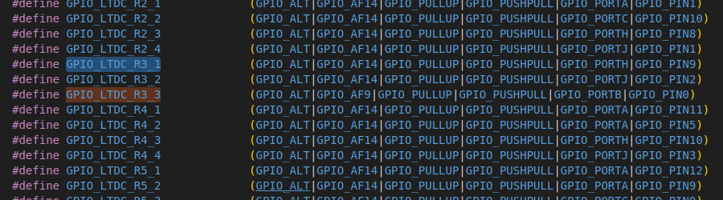

    3. Modify the `board.h` file included in the current build configuration to change the definition of `GPIO_LTDC_R3` to:  

        ```C
        #define GPIO_LTDC_R3  GPIO_LTDC_R3_1 | GPIO_SPEED_XXXX
        ```

        Please set `GPIO_SPEED_XXXX` according to the actual hardware requirements.  

    4. Adjust the remaining related signal pins using the method described above to ensure all pin definitions are consistent with the hardware design.

### 2. Enable Double Buffering Drawing Mode

The development board defaults to a single-buffer display mode, which can cause screen flickering during scrolling. Please follow the steps below to configure the double-buffer display mode to improve display quality and user experience.

#### 2.1 Configure SDRAM to Support Double Buffering Mode

1. Calculate the RAM requirement for double buffering based on the screen size.

    For example, with a resolution of 480 × 272 and 16-bit (2 bytes) color depth, double buffering requires two frame buffers:

    ```Plain
    // Screen Width * Screen Height * Color Depth/8 * Number of Buffers
    480 * 272 * 2 * 2 = 522240 Bytes
    ```

    > **Note**: The internal Static Random Access Memory (SRAM) of the development board is insufficient, so external Synchronous Dynamic Random Access Memory (SDRAM) is required.

2. Configure the SDRAM address mapping.

    According to the STM32H750B-DK development board's [User manual](https://www.st.com/resource/en/user_manual/um2488-discovery-kits-with-stm32h745xi-and-stm32h750xb-mcus-stmicroelectronics.pdf) and [Programming manual](https://www.st.com/resource/en/programming_manual/pm0253-stm32f7-series-and-stm32h7-series-cortexm7-processor-programming-manual-stmicroelectronics.pdf), complete the SDRAM address mapping configuration.

    1. Confirm the SDRAM management method.

        According to the user manual, SDRAM is managed by the Flexible Memory Controller (FMC).

        

    2. Refer to the address mapping information.

        In the FMC section of the programming manual, find the address mapping diagram for external devices:

        

    3. Select a Bank and configure the address.

        The development board is equipped with 128 MB of SDRAM, consisting of two 64 MB banks. Choose one of the banks, record the starting address as the base address, and declare it in the link script.

    4. Edit the link script.

        Open `nuttx/boards/arm/stm32h7/stm32h750b-dk/scripts/flash.ld` and add the SDRAM address declaration. An example configuration is as follows:

        ```Plain
        /* Configure SDRAM area */
        sdram (rw) : ORIGIN = 0xD0000000, LENGTH = 8M
        ```

        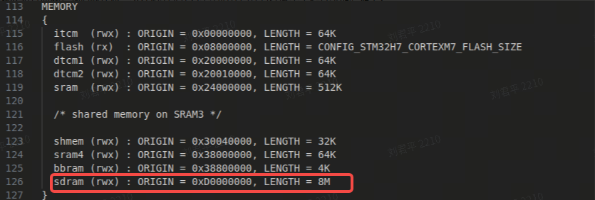

        - `ORIGIN`：Starting address of SDRAM.
        - `LENGTH`：Required capacity value; please ensure it does not exceed the actual mapped end address of the SDRAM.

#### 2.2 Configure the LTDC Frame Buffer to SDRAM

To enable the double buffering frame buffer to operate in SDRAM, the following configurations need to be set in **make menuconfig**:

```Bash
// Add the following configurations in make menuconfig
CONFIG_STM32H7_LTDC=y
CONFIG_STM32H7_LTDC_FB_BASE=0xd0000000
CONFIG_STM32H7_LTDC_FB_SIZE=522240
```

After completing the configuration, the frame buffer will be assigned to the starting address of SDRAM.

#### 2.3 Modifying the LCDC Driver to Support Double Buffering

To adapt to the double buffering display mode, the following modifications are required for the Liquid Crystal Display Controller (LCDC) related driver files.

1. Locate and open the driver file.

    Find the LTDC driver source file for the STM32H7 platform:

    ```C++
    nuttx/arch/arm/src/stm32h7/stm32_ltdc.c
    ```

2. Modify driver parameters to support double buffering.

    1. Configure the frame buffer size.

        Modify the frame buffer size formula to support double buffering, here the height is multiplied by 2, reserving double the display area for double buffering.

        ```C++
        // Set STM32_LTDC_L1_FBSIZE to support double buffering  
        #define STM32_LTDC_L1_FBSIZE        (STM32_LTDC_L1_STRIDE * STM32_LTDC_HEIGHT * 2)
        ```

    2. Set the virtual Y resolution.

        Adjust the virtual resolution parameter `yres_virtual` to support screen switching under double buffering:

        ```C++
        // Modify g_vtable pinfo yres_virtual height to STM32_LTDC_HEIGHT * 2  
        .pinfo =
            {
            .fbmem           = (uint8_t *)STM32_LTDC_BUFFER_L1,
            .fblen           = STM32_LTDC_L1_FBSIZE,
            .stride          = STM32_LTDC_L1_STRIDE,
            .display         = 0,
            .bpp             = STM32_LTDC_L1_BPP,
            .xres_virtual    = STM32_LTDC_WIDTH,
        #if defined(CONFIG_FB_DOUBLE_BUFFER)
            .yres_virtual    = STM32_LTDC_HEIGHT * 2,
        #else
            .yres_virtual    = STM32_LTDC_HEIGHT,
        #endif
        ```

#### 2.4 Adding the `pandisplay` Method to Trigger Display Content Updates

To support the double buffering mode, the `pandisplay` method needs to be added at the driver layer to trigger the LCDC reload and achieve screen switching.

1. Add the `pandisplay` method pointer to the virtual table.

    In the virtual table structure `vtable` of the LCDC driver, add the new method pointer based on the configuration conditions:

    ```C++
    .vtable =
        {
        .getvideoinfo    = stm32_getvideoinfo,
        .getplaneinfo    = stm32_getplaneinfo
    #ifdef CONFIG_FB_SYNC
        ,
        .waitforvsync    = stm32_waitforvsync
    #endif

    #if defined(CONFIG_FB_DOUBLE_BUFFER)
        ,
        .pandisplay = stm32_pandisplay
    #endif
    ```

    > **Note**: This addition allows the `pandisplay` method to be used only when double buffering (`CONFIG_FB_DOUBLE_BUFFER`) is enabled.

2. Implement the `pandisplay` method to trigger the LCDC screen transfer.

    ```C++
    // pandisplay method: triggers LCDC screen transfer via stm32_ltdc_reload  
    static int stm32_pandisplay(struct fb_vtable_s *vtable,
                                struct fb_planeinfo_s *pinfo)
    {
    int ret = 0;

    DEBUGASSERT(vtable != NULL && vtable == &g_vtable.vtable);

    uint32_t new_fb_start = (uint32_t)pinfo->fbmem +
                            pinfo->yoffset * pinfo->stride +
                            pinfo->xoffset * (pinfo->bpp / 8);

    putreg32(new_fb_start, stm32_cfbar_layer_t[0]);
    ret = stm32_ltdc_reload(LTDC_SRCR_VBR, true);

    return ret;
    }
    ```

    > **Note**: This method calculates the new frame start address based on buffer parameters and calls the reload interface to ensure the new content is displayed on screen in a timely manner.

#### 2.5 Clearing the Previous Frame Data in the Reload Interrupt Callback

To better support double buffering display mode, the LCDC `Reload` interrupt callback function needs to call the `fb_remove_paninfo` method to notify the display buffer management module to clear the previous frame data.

Add the following code in the `Reload` interrupt handling logic:

```C++
  if (regval & LTDC_ISR_RRIF)
    {
      /* Register reload interrupt */

      /* Clear the interrupt status register */
      reginfo("Register reloaded\n");
      putreg32(LTDC_ICR_CRRIF, STM32_LTDC_ICR);
      priv->error = OK;

      fb_remove_paninfo(&g_vtable.vtable, FB_NO_OVERLAY);
    }
```

> Note
>
> - When the reload complete interrupt (`LTDC_ISR_RRIF`) is received, `fb_remove_paninfo` is called to notify the `panbuffer` to clear unusable data from the previous frame.
> - This change ensures that frame data management during double buffering switch is more efficient and safe.

#### 2.6 Verifying the Effect of Double Buffering Mode Configuration

1. Rebuild and download the program to the development board.
2. Start the development board and run a graphical interface demonstration application (`lvgldemo`).
3. Observe the terminal logs to confirm that **double buffering mode** is activated, with smooth screen scrolling and no noticeable jitter.

    

### 3. Configuring Demo Application to Start Automatically at Boot

This section describes how to configure the system to automatically run the Demo application (such as `lvgldemo`) after system startup.

#### 3.1 Creating the System Startup Scripts

Refer to the [Boot Process](../../device_dev_guide/kernel/boot_process.md) documentation. To enable auto-start functionality, add the following script files to the startup process:

- `nuttx/boards/arm/stm32h7/stm32h750b-dk/src/etc/init.d/``rcS`
- `nuttx/boards/arm/stm32h7/stm32h750b-dk/src/etc/init.d/``rc.sysinit`

The `rc.sysinit` script is used for starting core applications and mounting the file system; rcS is used to start user applications.

Add the following content to the `rcS` file:

```C++
echo "Starting System..."
lvgldemo &
```

> **Note**: This script will run automatically during the system startup phase to launch the Demo application `lvgldemo`.

#### 3.2 Configuring the Read-Only Memory File System (ROMFS)

To support script automatic startup, ROMFS-related options need to be enabled and configured as follows:

1. Run the configuration tool:

    ```Bash
    make menuconfig
    ```

2. Enable and set the following configuration options:

    ```C++
    CONFIG_FS_FAT=y
    CONFIG_FS_ROMFS=y
    CONFIG_FS_ROMFS_CACHE_NODE=y
    CONFIG_FS_ROMFS_CACHE_FILE_NSECTORS=1
    CONFIG_ETC_ROMFS=y
    CONFIG_ETC_ROMFSMOUNTPT="/etc"
    CONFIG_ETC_ROMFSDEVNO=0
    CONFIG_ETC_ROMFSSECTSIZE=64
    CONFIG_NSH_SYSINITSCRIPT="init.d/rc.sysinit"
    CONFIG_NSH_INITSCRIPT="init.d/rcS"
    CONFIG_NSH_SCRIPT_REDIRECT_PATH=""
    ```

3. Save the configuration and exit.

#### 3.3 Compiling the Startup Script into the Target File

To ensure the system automatically executes the created [system startup script](#31-creating-the-system-startup-scripts) at startup, you can compile the script into the target file using any of the following methods according to the startup process.

##### Method 1: Generate `etc_romfs.c` File

1. Generate the ROMFS source file using the following command:

    ```Bash
    ./tools/mkromfsimg.sh . ../nuttx/boards/arm/stm32h7/stm32h750b-dk/src/etc/init.d/rc.sysinit ../nuttx/boards/arm/stm32h7/stm32h750b-dk/src/etc/init.d/rcS
    ```

2. Reference the generated file in `nuttx/boards/arm/stm32h7/stm32h750b-dk/src/Makefile`:

    ```Makefile
    ifeq ($(CONFIG_ETC_ROMFS),y)
    CSRCS += $(TOPDIR)/etc_romfs.c
    endif
    ```

##### Method 2: Directly Reference the Startup Scripts in the Makefile

Add `rc.sysinit` and `rcS` files in the `nuttx/boards/arm/stm32h7/stm32h750b-dk/src/Makefile` file.

```Makefile
ifeq ($(CONFIG_ETC_ROMFS),y)
RCSRCS = etc/init.d/rc.sysinit etc/init.d/rcS
RCRAWS = etc/group etc/passwd
endif
```

#### 3.4 Compiling and Downloading the Program

After completing the above configuration and modifications, follow these steps:

1. In the project root directory, execute `make clean` to remove any intermediate files from the previous build.
2. Execute `make` to recompile the project and generate new firmware files (in `.hex` format).
3. Use the appropriate programming tool to write the generated `HEX` file to the development board.
4. Power cycle the board again (or press the reset button) to start the development board. After startup, the system will automatically run `lvgldemo`.
