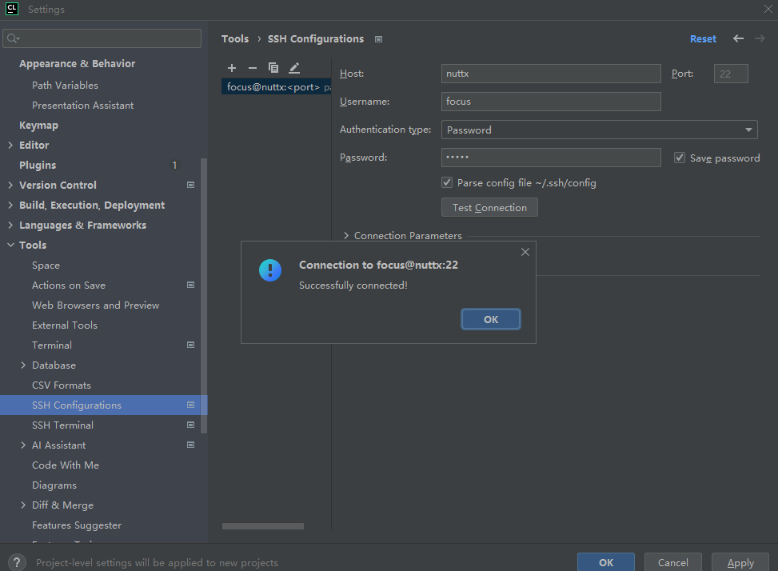
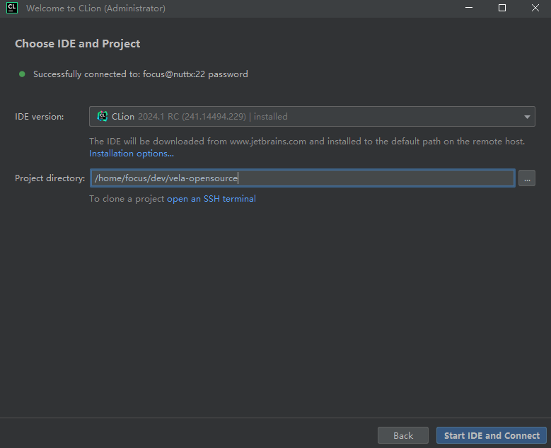
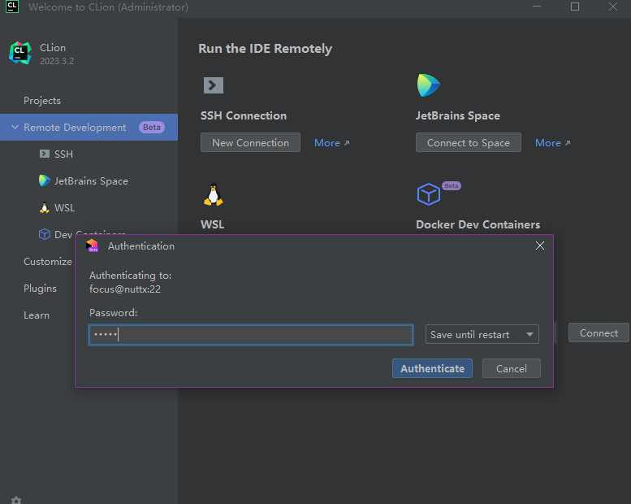
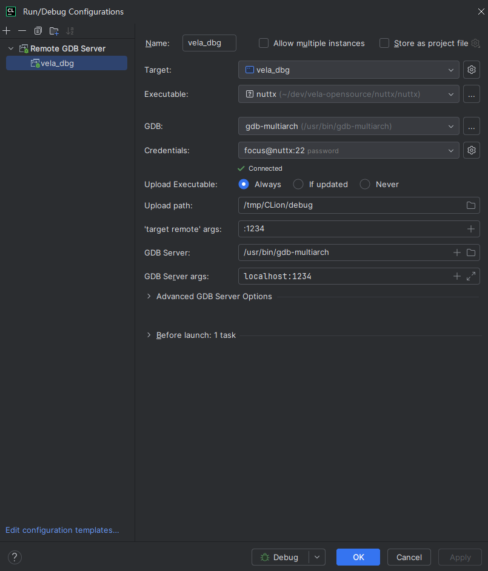
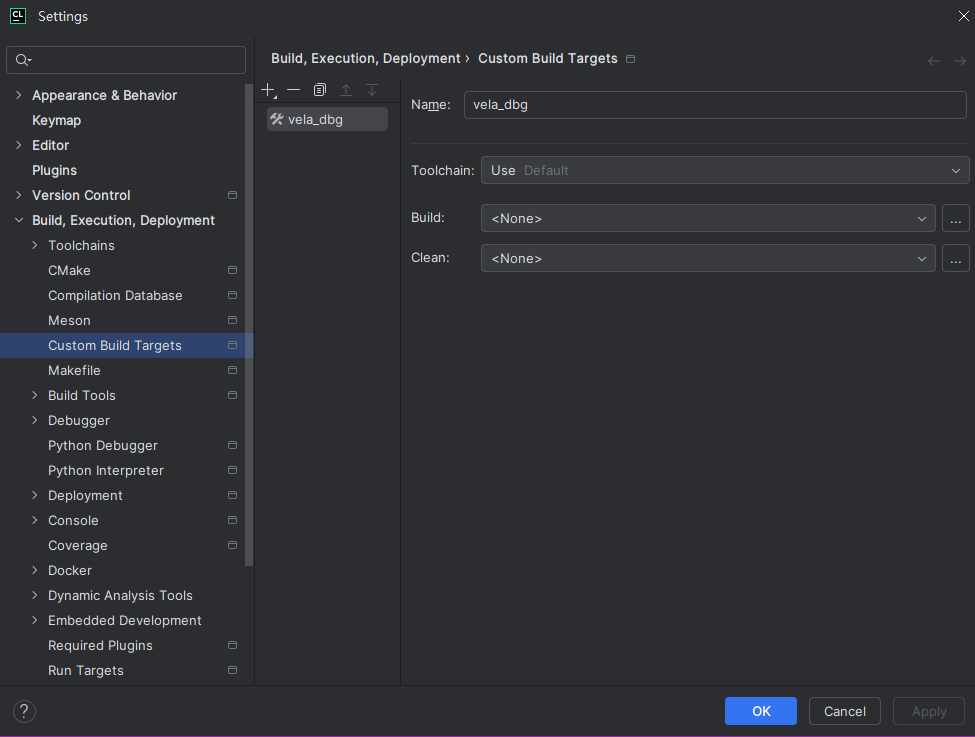
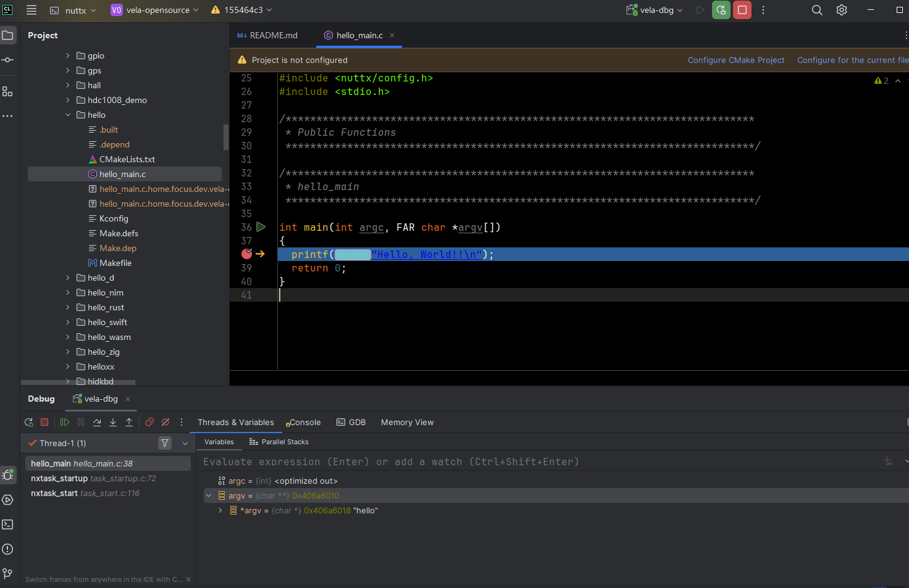
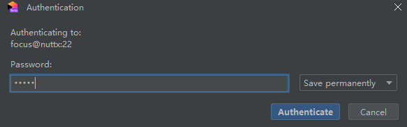
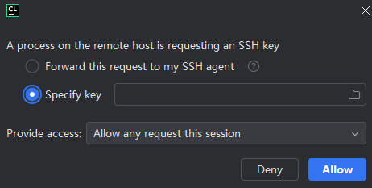

# Debugging with Emulator

\[ English | [简体中文](./../../../zh-cn/quickstart/emulator/Debugging_Vela_with_Vela_Emulator_zh-cn.md) \]

## I. Using the GDB Console

Use the following commands to install the required packages on an Ubuntu 22.04 system:

```bash
sudo apt update
sudo apt install gdb-multiarch
```

The emulator supports using GDB through the GDB remote connection tool (gdbstub). You can debug openvela code just as you would with low-level debugging tools like JTAG on real hardware. You can stop and start the virtual machine, inspect the state of registers and memory, and set breakpoints and watchpoints.

Start the emulator with the `-s` and `-S` options to use GDB. The `-s` option will make the emulator listen for incoming connections from GDB on TCP port 1234, while the `-S` option will prevent the emulator from starting the guest virtual machine until it receives a notification from GDB.

To enable the connection with the GDB Server, you need to pass the `-qemu -S -s` arguments to `emulator.sh`.

```bash
./emulator.sh vela -qemu -S -s
```

Open a new terminal and run `gdb-multiarch`:

```bash
gdb-multiarch nuttx/nuttx
```

```bash
GNU gdb (Ubuntu 12.1-0ubuntu1~22.04.2) 12.1
Copyright (C) 2022 Free Software Foundation, Inc.
License GPLv3+: GNU GPL version 3 or later <http://gnu.org/licenses/gpl.html>
This is free software: you are free to change and redistribute it.
There is NO WARRANTY, to the extent permitted by law.
Type "show copying" and "show warranty" for details.
This GDB was configured as "x86_64-linux-gnu".
Type "show configuration" for configuration details.
For bug reporting instructions, please see:
<https://www.gnu.org/software/gdb/bugs/>.
Find the GDB manual and other documentation resources online at:
    <http://www.gnu.org/software/gdb/documentation/>.

For help, type "help".
Type "apropos word" to search for commands related to "word"...
Reading symbols from nuttx/nuttx...
```

You need to create a remote connection to connect the host GDB to the emulator's GDB Server.

After connecting, you can debug in the emulated environment just as you would with any other application.

```bash
(gdb) target remote localhost:1234
```

```bash
Remote debugging using localhost:1234
__start () at armv7-a/arm_head.S:207
207		cpsid		if, #PSR_MODE_SYS
```

Set a breakpoint:

```bash
(gdb) b nx_start
```

```bash
Breakpoint 1 at 0x601cdc: file init/nx_start.c, line 317.
```

Continue execution:

```bash
(gdb) c
```

```bash
Continuing.

Breakpoint 1, nx_start () at init/nx_start.c:317
317	{
```

Display the source code:

```bash
(gdb) l
```

```plaintext
312	 *   Does not return.
313	 *
314	 ****************************************************************************/
315	
316	void nx_start(void)
317	{
318	  int i;
319	
320	  sinfo("Entry\n");
321
```

Display information about all breakpoints in the current GDB session:

```bash
(gdb) info break
```

```bash
Num     Type           Disp Enb Address    What
1       breakpoint     keep y   0x00601cdc in nx_start at init/nx_start.c:317
	breakpoint already hit 1 time
```

Enable or disable a breakpoint:

```bash
disable <breakpoint-number>
enable <breakpoint-number>
```

Delete a breakpoint:

```bash
d <breakpoint-number>
```

Exit GDB:

```bash
(gdb) q
```

## II. Using Visual Studio Code

1. Click [here](https://code.visualstudio.com/) to download and install Visual Studio Code.

2. Install the Visual Studio Code extension.

    ```bash
    code --install-extension ms-vscode.cpptools-extension-pack
    ```

3. Open the openvela workspace.

    You can open the workspace by selecting the folder where openvela is located via the `File` > `Open Folder...` menu.

    Alternatively, if you start Visual Studio Code from the terminal, you can pass the path to the openvela source code as the first argument to the `code` command.

    For example, the following command opens the current directory as the workspace in Visual Studio Code.

    ```bash
    code .
    ```

4. Add a launch configuration.

    To debug or run the openvela source code in Visual Studio Code, select `Run and Debug` in the Debug view or press the `F5` key. Visual Studio Code will then run the currently active file.

    In most debugging scenarios, it is very useful to create a launch configuration file. It allows you to configure and save detailed debugging settings. You can save this configuration information in the `launch.json` file in the `.vscode` folder of your workspace (the project's root folder), or directly in your user or workspace settings.

    To create a `launch.json` file, select `create a launch.json file` in the Run and Debug view.

    The following is a launch configuration for debugging openvela:

    ```bash
    {
        // Use IntelliSense to learn about possible attributes.
        // Hover to view descriptions of existing attributes.
        // For more information, visit: https://go.microsoft.com/fwlink/?linkid=830387
        "version": "0.2.0",
        "configurations": [
            {
                "name": "Debug openvela",
                "type": "cppdbg",
                "request": "launch",
                "program": "${workspaceFolder}/nuttx/nuttx",
                "cwd": "${workspaceFolder}",
                "MIMode": "gdb",
                "miDebuggerPath": "/usr/bin/gdb-multiarch",
                "miDebuggerServerAddress": "localhost:1234"
            }
        ]
    }
    ```

    Return to the File Explorer view (Ctrl+Shift+E), and you will see that Visual Studio Code has created a `.vscode` folder and added the `launch.json` file to your workspace.

5. Start the emulator with the `-s` and `-S` options to use GDB.

    ```bash
    ./emulator.sh vela -qemu -S -s
    ```

6. Start the debugging session.

    To start a debugging session, first select the `Debug openvela` configuration from the `Configuration` dropdown list in the `Run and Debug` view. After setting the launch configuration, use `F5` to start the debugging session.

## III. Using CLion (Remote Debugging)

1. Download and install [CLion (a recent version is recommended)](https://www.jetbrains.com/clion/).

2. Open the SSH Configurations menu.

    You can open the menu from the Welcome screen via `Customize | All Settings`. If you already have a project open, you can return to the Welcome screen by clicking `File | Close Project`.

    Click the `+` symbol, fill in the required information, test the connection, and then save it. For example:

    

3. Configure and select the remote project.

    On the Welcome screen, select `Remote Development | SSH | New Project`, choose the SSH connection you just created, and click `Check Connection and Continue` in the bottom right corner. Select an IDE version, set the project path to the root directory of the cloned vela project, and then click `Start IDE and Connect`. For example:

    

    Wait for the download to complete and click `Authenticate`:

    

4. Create a debug configuration.

    Click `Add Configuration | Remote GDB Server` and configure it as shown in the example below:

    

    An example of creating a Target:

    

5. Start the emulator with the `-s` and `-S` options to use GDB.

    ```bash
    ./emulator.sh vela -qemu -S -s
    ```

6. Start the debugging session.

    Click the debug button to start debugging:

    

    If an authentication dialog pops up, enter your password or select the configured SSH key:

    
    
