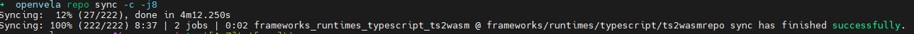
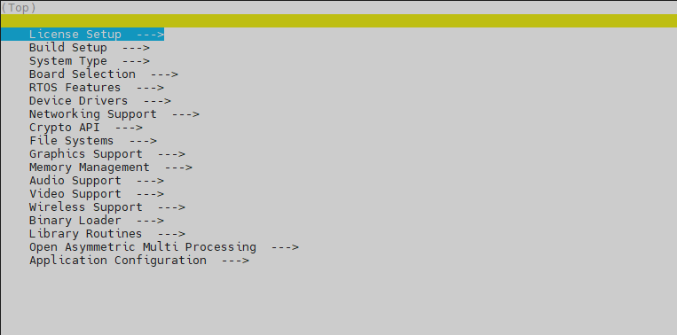
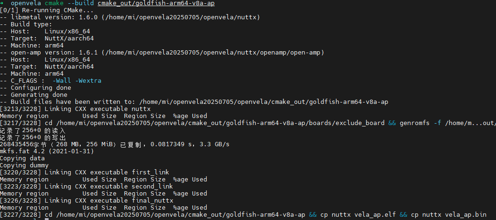

# Quick Start (Ubuntu)

[ English | [简体中文](./../../zh-cn/quickstart/openvela_ubuntu_quick_start.md) ]

This guide will walk you through setting up the development environment, downloading the source code, compiling, and building openvela on **Ubuntu 22.04**, and finally running the build artifacts using the Vela Emulator.

> **Environment Requirements**
>
> This guide is only for **Ubuntu 22.04**. Compiling in Windows Subsystem for Linux (WSL) or Docker container environments is not supported.

> **AI-Assisted Setup (Optional)**
>
> If you use an AI coding assistant (e.g., [Claude Code](https://docs.anthropic.com/en/docs/claude-code)), you can automate the entire setup process using openvela AI Skills:
>
> ```bash
> git clone https://github.com/open-vela/.claude.git .claude
> ```
>
> Then tell your AI assistant: "Help me set up the openvela development environment".
>
> The AI will automatically handle environment detection, dependency installation, source selection, code download, compilation, and emulator launch, providing targeted solutions if any issues arise.
>
> To set up manually, continue with the steps below.

## Step 1: Preparations

Before you begin, please ensure your development environment meets the following requirements.

### 1. Hardware Requirements

- **Hard drive:** At least 40 GB of free space for the source code and build artifacts.
- **Memory:** At least 16 GB of RAM.

### 2. Operating System Requirements

- **Operating System:** Ubuntu 22.04 (arm64/x86_64)

### 3. Install Development Tools

Before you start, you need to install the necessary packages for compiling openvela.

Open a terminal and run the following commands to update the package list and install  Git, curl, CMake, Python 3, libc++abi-dev, and the build-essential toolchain.

```Bash
sudo apt update
sudo apt install git curl cmake python3 libc++abi-dev build-essential
```

### 4. Install Git LFS

> **Note**: This project contains large binary files (e.g., model weights, datasets). You must configure **Git LFS**; **otherwise, the pulled files will be corrupted (appearing as mere text pointers of a few KB) and the project will fail to run.**

Please run the following commands in your Ubuntu terminal to install and initialize:

```bash
# Step 1: Configure the official repo and install (ensures the latest version)
curl -s https://packagecloud.io/install/repositories/github/git-lfs/script.deb.sh | sudo bash
sudo apt-get install git-lfs

# Step 2: Initialize configuration (Important: You must run this, otherwise LFS will not work)
git lfs install
```

## Step 2: Download the Source Code

openvela uses the `repo` tool to manage its source code, which is distributed across multiple Git repositories.

### 1. Install the Repo Tool

`repo` is a repository management tool built on top of Git. Run the following commands to securely download and install it.

```Bash
curl -sSL "https://storage.googleapis.com/git-repo-downloads/repo" > repo
chmod +x repo
sudo mv repo /usr/local/bin
```

After installation, you can run `repo --version` to verify it.

### 2. Initialize and Sync the Repository

1. Create a working directory to store all of openvela's source code.

    ```bash
    mkdir openvela && cd openvela
    ```

2. Initialize the project manifest using `repo` and specify the `dev` branch.

    Please select one of the following methods (SSH is recommended) based on your network environment and preference to initialize the repository.

    #### Option A: Download from GitHub

    - Method 1: SSH (Recommended)

        This method requires you to add your SSH public key to your GitHub account first. Please refer to the [official GitHub documentation](https://docs.github.com/en/authentication/connecting-to-github-with-ssh/adding-a-new-ssh-key-to-your-github-account).

        ```bash
        repo init -u ssh://git@github.com/open-vela/manifests.git -b dev-ai-contest-2026 -m openvela.xml --repo-url=https://mirrors.tuna.tsinghua.edu.cn/git/git-repo/ --git-lfs
        ```

    - Method 2: HTTPS

        ```bash
        repo init -u https://github.com/open-vela/manifests.git -b dev-ai-contest-2026 -m openvela.xml --repo-url=https://mirrors.tuna.tsinghua.edu.cn/git/git-repo/ --git-lfs
        ```

    #### Option B: Download from Gitee

    - Method 1: SSH (Recommended)

        This method requires you to add your SSH public key to your Gitee account first. Please refer to the [official Gitee documentation](https://gitee.com/help/articles/4191).

        ```bash
        repo init -u ssh://git@gitee.com/open-vela/manifests.git -b dev-ai-contest-2026 -m openvela.xml --repo-url=https://mirrors.tuna.tsinghua.edu.cn/git/git-repo/ --git-lfs
        ```

    - Method 2: HTTPS

        ```bash
        repo init -u https://gitee.com/open-vela/manifests.git -b dev-ai-contest-2026 -m openvela.xml --repo-url=https://mirrors.tuna.tsinghua.edu.cn/git/git-repo/ --git-lfs
        ```

    #### Option C: Download from GitCode

    - Method 1: SSH (Recommended)

        This method requires you to add your SSH public key to your GitCode account first. Please refer to the [official GitCode documentation](https://docs.gitcode.com/docs/help/home/user_center/security_management/ssh).

        ```bash
        repo init -u ssh://git@gitcode.com/open-vela/manifests.git -b dev-ai-contest-2026 -m openvela.xml --repo-url=https://mirrors.tuna.tsinghua.edu.cn/git/git-repo/ --git-lfs
        ```

    - Method 2: HTTPS

        ```bash
        repo init -u https://gitcode.com/open-vela/manifests.git -b dev-ai-contest-2026 -m openvela.xml --repo-url=https://mirrors.tuna.tsinghua.edu.cn/git/git-repo/ --git-lfs
        ```

3. Execute the sync command. `repo` will download all related source code repositories according to the manifest file (`openvela.xml`).

    ```bash
    repo sync -c -j8
    ```

    

    > **Tip**
    >
    > - The initial sync can be time-consuming, depending on your network connection and disk performance.
    > - If the sync is interrupted due to network issues, you can run `repo sync` again to resume.

## Step 3: Compile Source Code

After downloading the source code, execute the following compilation steps in the openvela root directory.

### 1. (Optional) Custom Kernel Configuration

You can use the `menuconfig` command to open a graphical interface to adjust the NuttX kernel and component configurations.

```Bash
./build.sh vendor/openvela/boards/vela/configs/goldfish-arm64-v8a-ap/ --cmake menuconfig
```

> **Operation Tricks**
>
> - Press `/` to search for configuration items.
> - Press `Space` to toggle selection status (Enable/Disable/Modularize).
> - After configuration, select **Save** to save and exit.



### 2. Execute Compilation

Execute the following command to build the entire project.

```Bash
./build.sh vendor/openvela/boards/vela/configs/goldfish-arm64-v8a-ap/ --cmake -j$(nproc)
```

Upon successful compilation, you will find build artifacts such as `nuttx` in the `cmake_out/vela_goldfish-arm64-v8a-ap` directory.



## Step 4: Run Emulator

In the openvela root directory, execute the following script to start the `Vela Emulator` and load your build artifacts.

```Bash
./emulator.sh cmake_out/vela_goldfish-arm64-v8a-ap/
```

After the emulator starts, you will see the `goldfish-armv8a-ap>` prompt, indicating that openvela has run successfully.


## Next Steps

- Frequently Asked Questions

    - [Quick Start FAQ](../faq/QuickStart_FAQ.md)
    - [Developer FAQ](../faq/QuickStart_FAQ.md)

- Further Reading

    - [Debugging Vela with the Vela Emulator](./emulator/Debugging_Vela_with_Vela_Emulator.md)
    - [Android Debug Bridge commands](./emulator/Android_Debug_Bridge_commands.md)
    - [Send emulator console commands](./emulator/Send_emulator_console_commands.md)
