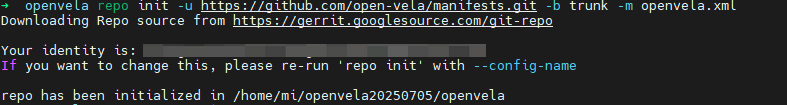
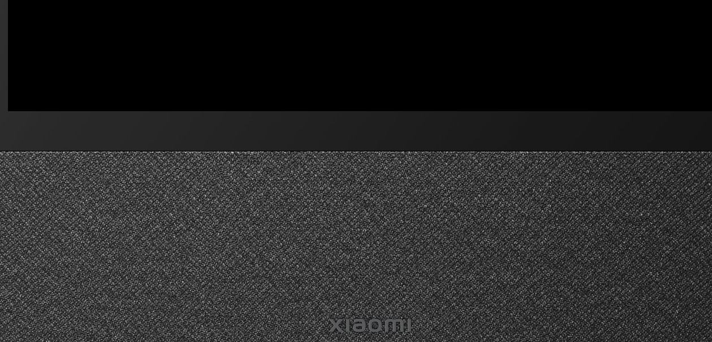

# Quick Start (Ubuntu)

[ English | [简体中文](./../../zh-cn/quickstart/openvela_ubuntu_quick_start.md) ]

This guide will walk you through setting up the development environment, downloading the source code, compiling, and building openvela on **Ubuntu 22.04**, and finally running the build artifacts using the Vela Emulator.

> **Environment Requirements**
>
> This guide is only for **Ubuntu 22.04**. Compiling in Windows Subsystem for Linux (WSL) or Docker container environments is not supported.

## Step 1: Preparations

Before you begin, please ensure your development environment meets the following requirements.

### 1. Hardware Requirements

- **Hard drive:** At least 40 GB of free space for the source code and build artifacts.
- **Memory:** At least 16 GB of RAM.

### 2. Operating System Requirements

- **Operating System:** Ubuntu 22.04 (arm64/x86_64)

### 3. Install Development Tools

Before you start, you need to install the necessary packages for compiling openvela.

Open a terminal and run the following commands to update the package list and install Git, CMake, Python 3, and the build-essential toolchain.

```Bash
sudo apt update
sudo apt install git git-lfs cmake python3 build-essential
```

## Step 2: Download the Source Code

openvela uses the `repo` tool to manage its source code, which is distributed across multiple Git repositories.

### 1. Install the Repo Tool

`repo` is a repository management tool built on top of Git. Run the following commands to securely download and install it.

```Bash
curl -sSL "https://storage.googleapis.com/git-repo-downloads/repo" > repo
chmod +x repo
sudo mv repo /usr/local/bin
```

After installation, you can run `repo --version` to verify it.

### 2. Initialize and Sync the Repository

1. Create a working directory to store all of openvela's source code.

    ```bash
    mkdir openvela && cd openvela
    ```

2. Use `repo` to initialize the project manifest, specifying the `trunk` branch.

    ```bash
    repo init -u https://github.com/open-vela/manifests.git -b trunk -m tags/trunk-5.2.xml
    ```

    

3. Execute the sync command. `repo` will download all related source code repositories according to the manifest file (`openvela.xml`).

    ```bash
    repo sync -c -j8
    ```

    

    > **Tip**
    >
    >  - The initial sync can be time-consuming, depending on your network connection and disk performance.
    >  - If the sync is interrupted due to network issues, you can run `repo sync` again to resume.

## Step 3: Build the Source Code

After downloading the source code, perform the following compilation steps in the openvela root directory.

### 1. Set Environment Variables

Run the following command to add the paths of the prebuilt toolchains to the environment variables for the current terminal session.

```Bash
uname_s=$(uname -s | tr '[A-Z]' '[a-z]')
uname_m=$(uname -m)
export PATH=$PWD/prebuilts/build-tools/${uname_s}-${uname_m}/bin:$PATH
export PATH=$PWD/prebuilts/cmake/${uname_s}-${uname_m}/bin:$PATH
export PATH=$PWD/prebuilts/python/${uname_s}-${uname_m}/bin:$PATH
export PATH=$PWD/prebuilts/gcc/${uname_s}-${uname_m}/aarch64-none-elf/bin:$PATH
export PATH=$PWD/prebuilts/gcc/${uname_s}-${uname_m}/arm-none-eabi/bin:$PATH
export PYTHONPATH=$PWD/prebuilts/tools/python/dist-packages/cxxfilt
export PYTHONPATH=$PWD/prebuilts/tools/python/dist-packages/kconfiglib:$PYTHONPATH
export PYTHONPATH=$PWD/prebuilts/tools/python/dist-packages/pyelftools:$PYTHONPATH
```

> **Note**: These environment variable settings are only valid for the current terminal session. If you open a new terminal, you must run this script again.

### 2. Configure the CMake Project (Out-of-Tree)

openvela uses an **Out-of-tree build** approach, which separates the build artifacts from the source code to keep the source directory clean.

Run the following `cmake` command to configure the project. This command will:

- Generate build system files in the `cmake_out/goldfish-arm64-v8a-ap` directory.
- Use Ninja as the build tool to accelerate compilation.
- Specify the configuration file for the target board.

```Bash
cmake \
  -B cmake_out/goldfish-arm64-v8a-ap \
  -S $PWD/nuttx \
  -GNinja \
  -DBOARD_CONFIG=../vendor/openvela/boards/vela/configs/goldfish-arm64-v8a-ap \
  -DEXTRA_FLAGS="-Wno-cpp -Wno-deprecated-declarations"
```


### 3. (Optional) Customize Kernel Configuration

You can use the `menuconfig` command to open a graphical interface to adjust the configuration of the NuttX kernel and its components.

```Bash
cmake --build cmake_out/goldfish-arm64-v8a-ap -t menuconfig
```

> **Tips**
>
> - Press `/` to search for configuration options.
> - Press the `Spacebar` to toggle the selection state (enable/disable/module).
> - After configuring, select "Save" to save and exit.


### 4. Start the Build

Execute the following command to build the entire project.

```Bash
cmake --build cmake_out/goldfish-arm64-v8a-ap
```

Upon successful compilation, you will find `nuttx` and other build artifacts in the `cmake_out/goldfish-arm64-v8a-ap` directory.


## Step 4: Run the Emulator

In the openvela root directory, run the following script to start the `Vela Emulator` and load your build artifacts.

```Bash
./emulator.sh cmake_out/goldfish-arm64-v8a-ap
```

After the emulator starts, you will see the `goldfish-armv8a-ap>` prompt, indicating that openvela is running successfully.




## Next Steps

- Frequently Asked Questions

    - [Quick Start FAQ](../faq/QuickStart_FAQ.md)

- Further Reading

    - [Debugging Vela with the Vela Emulator](./emulator/Debugging_Vela_with_Vela_Emulator.md)
    - [Android Debug Bridge commands](./emulator/Android_Debug_Bridge_commands.md)
    - [Send emulator console commands](./emulator/Send_emulator_console_commands.md)