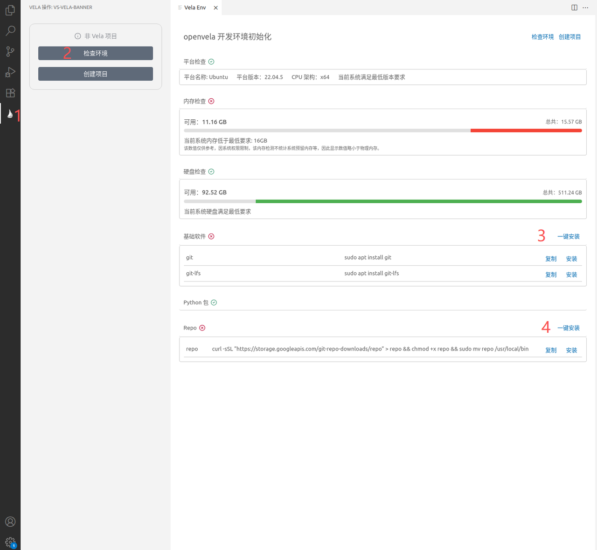
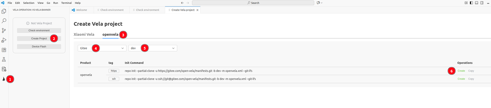
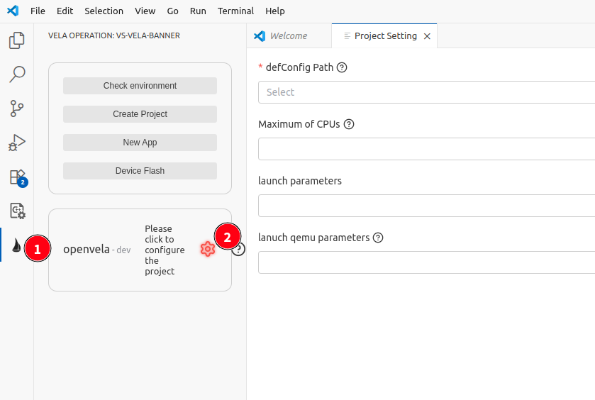
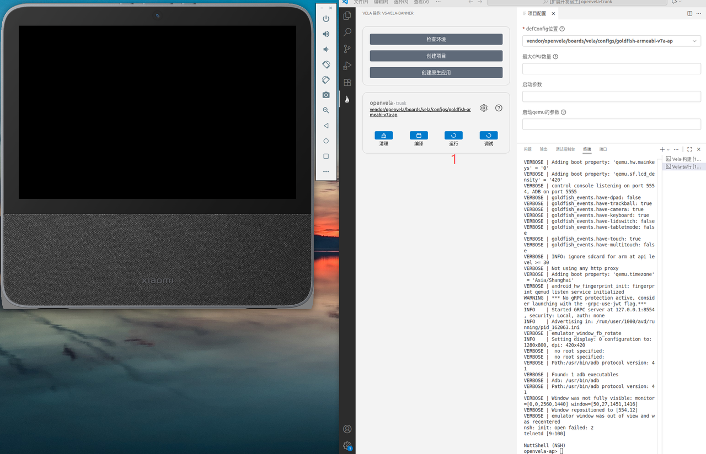
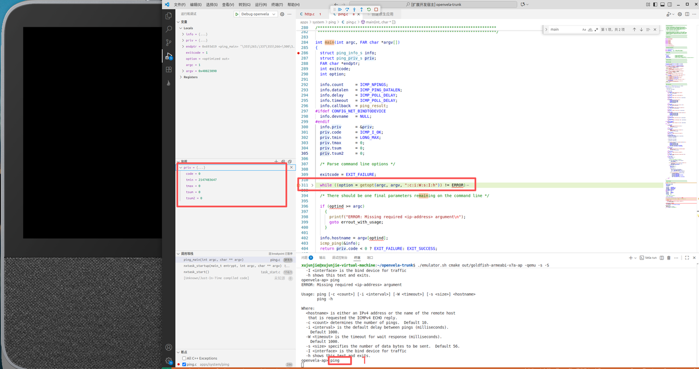
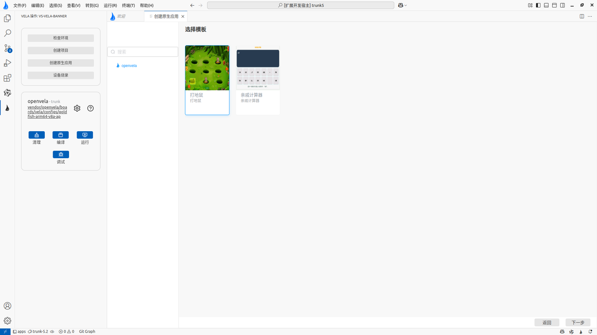
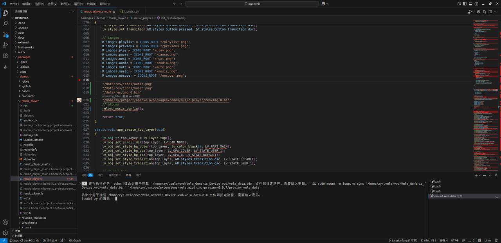
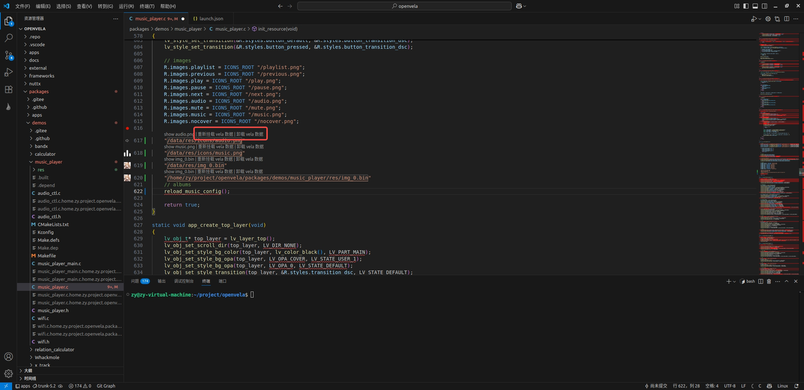
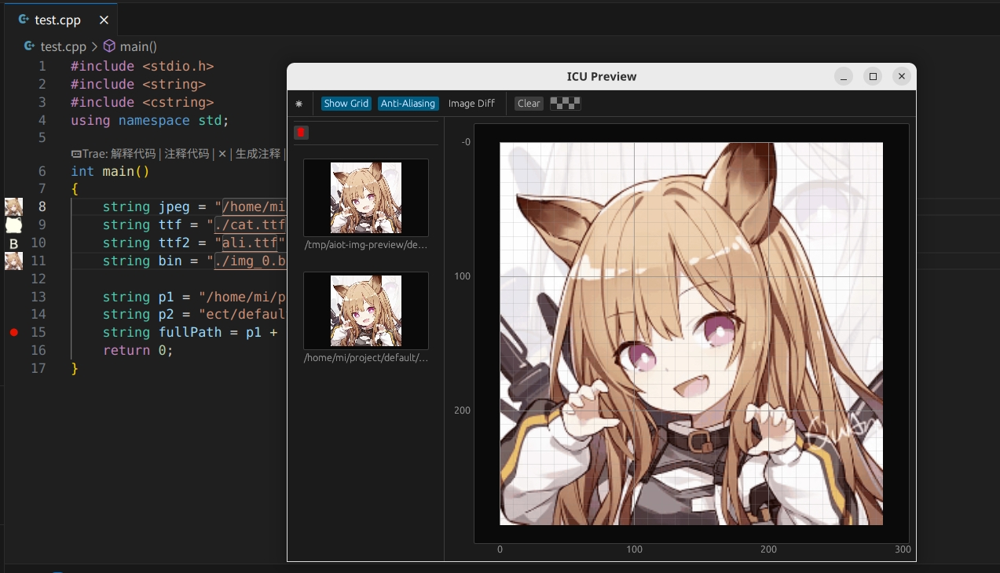

# openvela VS Code Plugin User Guide

[ English | [简体中文](./../../zh-cn/quickstart/vscode_plugin_usage.md) ]

This document guides developers through installing the openvela VS Code plugin in an Ubuntu environment and completing openvela project creation, compilation, debugging, and application development.

## I. Environment Preparation

Before starting, please ensure the development environment meets the following hardware and software requirements.

### 1. Hardware Configuration

- **Disk**: At least **40 GB** of available space (for storing source code and compilation artifacts).
- **Memory**: At least **16 GB** RAM.

### 2. Operating System

- **System Version**: Ubuntu 22.04 (supports arm64 or x86_64 architectures).

## II. Installing openvela Extensions

> **Note**: Debugging features depend on the C++ extension; therefore, it must be installed and running in VS Code.

Search for and install the following in the VS Code (version >= 1.99.0) Extension Marketplace:

- vela.vs-aiot-ide-vela

    

- vela.vela-preview

    

## III. Environment Configuration and Verification

After the plugin is installed, check the development environment and install the necessary build toolchains and dependency packages.

### 1. Check and Install Dependencies

Refer to the image below to perform an environment check in VS Code. If prompted that components are missing, please follow the wizard to install them.

### 2. Verify Environment Readiness

When all dependencies are successfully installed, the interface will display the following content, indicating that the environment is ready:

## IV. Creating an openvela Project

### 1. Initialize Project Directory

Create a new directory in the file system (e.g., `openvela`).

> **Warning**: Ensure that the **absolute path** of this directory **does not contain Chinese characters, spaces, or other special symbols**; otherwise, the Build System will report errors.

### 2. Get Source Code

1. In VS Code, refer to the steps in the image below to open the "Create Project" wizard.

    

2. Configure project parameters:

    - Select Source: Choose the appropriate repository source based on network conditions.
    - Select Branch: Select the appropriate branch.

        - trunk (Main Stable Branch): A fully tested stable version; stable features from the `dev` branch are merged here. Recommended for most users seeking stability.
        - dev (Development Branch): Collects the latest features and fixes, which may be unstable. Recommended for developers who wish to experience new features or contribute.

    - Download Method: Select SSH or HTTPS.

     **Note**: If choosing the SSH method, please ensure that the SSH Key has been configured on the corresponding code hosting platform (click the blue link in the interface to view detailed documentation).

3. Select the `openvela` project directory created in step 1, and click **Select** in the upper right corner, as shown below:

    

4. Wait for the project creation to complete. The download progress is shown below:

    **Note**: The source code download process takes a long time; please prevent the computer from entering sleep mode.

    

### 3. Configure Build Parameters

1. Open the created `openvela` directory:

    

2. Click the openvela **Sailboat** icon on the left, then click the **Configure** button, as shown below:

    

3. Select the corresponding `defconfig` file and other optional parameters:

    

## V. Compile and Run

### 1. Compile Project

1. Click the **Build** button and wait for the build system to complete compilation:

    

2. The compilation completion effect is shown below:

    

### 2. Run Simulator

1. Click the **Run** button to start the simulator:

    

2. Enter `lvgldemo` in the simulator terminal to launch the openvela demo application:

    

    

## VI. Debug Application

1. Click the **Debug** button. The system will start the simulator and attach the debugging process:

    

2. Open the source code file `apps/system/ping/ping.c` and set a breakpoint at the `main` function:

    

3. Execute the `ping` command in the simulator terminal. The system will run the Ping application, automatically hit the breakpoint, and enter debug mode.

    

## VII. Develop Native Application

### 1. Create Application

1. Click **Create Native App** in the plugin interface:

    

2. Select an application template:

    

3. Enter the project name (e.g., `Whackmole1`):

    

### 2. Compile and Run New Application

1. Upon completion, VS Code will automatically locate the source code directory of the new application.

   

2. Re-execute **Build** -> **Run**.

3. Enter the application name (e.g., `Whackmole1`) in the simulator terminal to start the new application.

## VIII. Resource Management and Visual Preview

The openvela plugin provides powerful visual preview capabilities, supporting images, fonts, and binary resources, as well as simulator file system mounting.

<video src="./videos/plugin.mp4" controls="controls" width="100%"></video>

### 1. Mount Data Volume

When using the `openvela` repository for the first time, the system will automatically pop up a terminal to execute the mount command, mounting `vela_data.bin` to the local directory.

<video src="./videos/mount.mp4" controls="controls" width="100%"></video>

Developers can manually manage the mount state via the right-click menu:

- Mount openvela: Execute mount.

    

    

- Remount openvela: When files in the simulator change (for example, after executing `adb push`), perform this operation to refresh the file system.

    

- Unmount openvela: Disconnect the mount.

### 2. File Preview

Supports previewing standard images, `.bin`, `.ttf`, and other formats (supports both absolute and relative paths).

### 3. Hover Preview

**Code Resource Preview**: Hovering the mouse over a resource path string will display a thumbnail of the resource.

### 4. Variable Preview during Debugging

In debug mode, hovering the mouse over a variable allows retrieving the current value and previewing it.

> **Tip**: Hold the `Alt` key to toggle between "Debug Value Hover" and "Standard Resource Hover".

### 5. Configure Preview Base Directory

1. Click the VS Code **Settings** button (or use the shortcut `Ctrl+,`).

2. Find **Extensions** in the left menu and select **AIoT Image Preview**.

3. Set the `Base Dir` parameter to adapt to different environments (such as simulator version).

    
