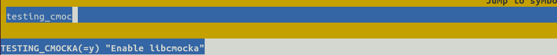
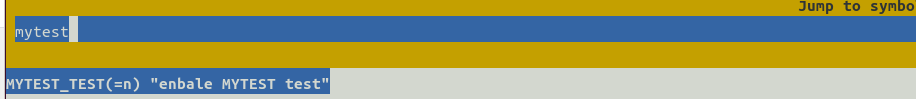
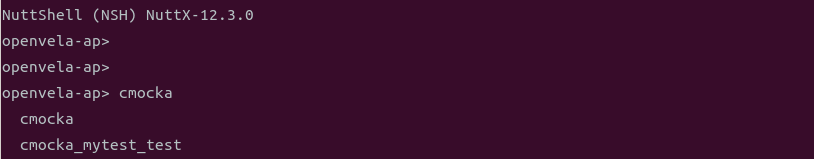
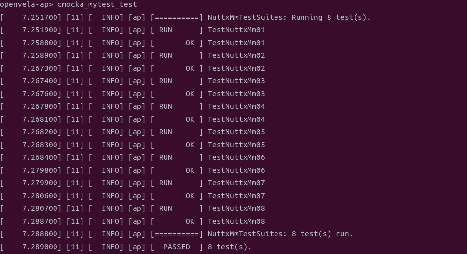
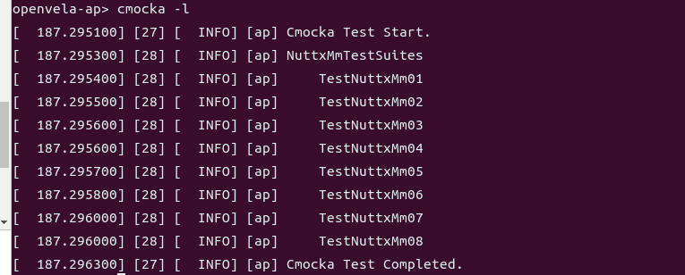
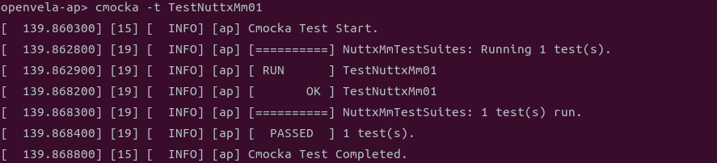
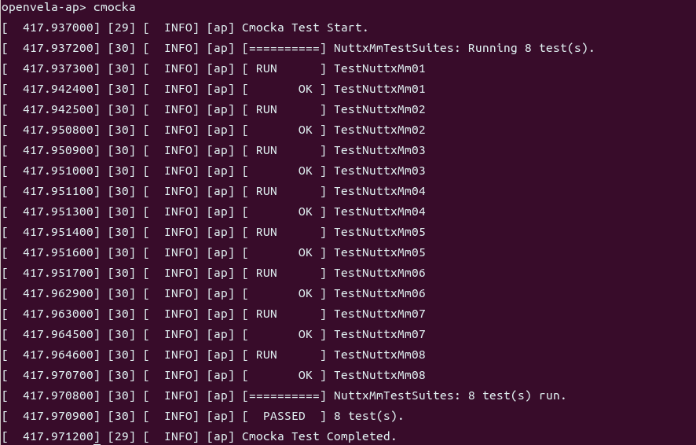

# openvela Test Case Development Guide

\[ English | [简体中文](../../zh-cn/test_dev_guide/openvela_testcase_dev_guide.md) \]

## I. Introduction

openvela provides developers with a comprehensive development self-testing framework called cmocka. Developers can develop relevant test cases according to their needs, detect defects early during the development phase, and improve code quality. This document introduces how to use this framework to develop test cases.

## II. Code Directory

```Bash
├─tests
│    └──scripts
│       ├── env          # Automation framework environment requirements
│       ├── script       # Test scripts executed by the automation framework
│       └── utils
│    ├── testcases       # Test toolkit
│    └── testsuites      # cmocka test toolkit
```

## III. Developing Test Cases

### 1. Creating a New Case Directory

All test cases written with cmocka should be placed in the tests directory. When you need to write new test cases using cmocka, follow these steps:

1. Create a test case subdirectory and various level directories in the corresponding subdirectory to store test case files, header files, test resources, test entry files, etc. The directory structure is shown below:

    ```Bash
    ├─tests
    │   └── mytest  # Automation test suite name, name according to your actual situation
    │       ├── Kconfig
    │       ├── Make.defs
    │       ├── Makefile
    │       ├── include    # Header files needed for test cases, declarations of custom functions
    │       ├── src        # Directory for test case files
    │       ├── util       # Directory for common functions
    ```

2. Modify the Kconfig file to set compilation options.

    Define test switches, priorities, and STACKSIZE in the Kconfig file. Refer to the following example and complete the Kconfig file according to actual needs.

    ```Bash
    config MY_TESTS                 
        tristate "vela auto tests mytest"
        default n
        depends on TESTING_CMOCKA             # Must include, can depend on the module being tested
        ---help---
            Enable auto tests for the open-vela

    if MY_TESTS
    
    config MY_TESTS_PRIORITY            # Priority
        int "Task priority"
        default 100
    
    config MY_TESTS_STACKSIZE           # stack size
        int "Stack size"
        default DEFAULT_TASK_STACKSIZE
    
    endif
    ```

3. Modify the Makefile file.

    Define the test PROGNAME and MAINSRC file. Refer to the following example and complete the Makefile according to actual needs.

    > Note: **PROGNAME must start with cmocka_**.

    ```Makefile
    include $(APPDIR)/Make.defs
    # Common functions and header files
    CFLAGS += -I$(APPDIR)/tests/mytest/util
    CSRCS += $(wildcard $(APPDIR)/tests/mytest/util/*.c)
    
    # Test case files and test case header files
    CFLAGS += -I$(APPDIR)/tests/mytest/include
    CSRCS += $(wildcard $(APPDIR)/tests/mytest/src/*.c)
    
    # Header files for API calls (add as needed)
    CFLAGS += ${INCDIR_PREFIX}$(APPDIR)/include
    
    PRIORITY  = $(CONFIG_MY_TESTS_PRIORITY)
    STACKSIZE = $(CONFIG_MY_TESTS_STACKSIZE)
    MODULE    = $(CONFIG_MY_TESTS)
    
    PROGNAME += cmocka_mytest_test       # PROGNAME is the application name used when launching in nsh
    MAINSRC  += $(CURDIR)/mytest_entry.c  #  Unified test entry file for all written test cases, cmocka unit test entry file (see Section 2.2 below for details)
    include $(APPDIR)/Application.mk
    ```

4. Modify the Make.defs file.

    ```Makefile
    ifneq ($(CONFIG_MY_TESTS),)
    CONFIGURED_APPS += $(APPDIR)/tests/mytest
    endif
    ```

### 2、Writing Test Cases

Create test case files in the src folder. It is recommended that one file contains only one test case. The directory structure is as follows:

```Bash
├─tests
│   └── mytest     # Scenario automation test suite
│       ├── Kconfig
│       ├── Make.defs
│       ├── Makefile
│       ├── include    # Header files needed for test cases, declarations of custom functions
│       │   ├── mytest.h
│       ├── src         # Directory for test case files
│       │   ├── test_mytest_example_01.c
│       │   ├── test_mytest_example_02.c
│       │   ├── test_mytest_example_03.c
│       ├── util
```

- Writing test case files in the src directory.

    - Test case file naming: start with the keyword **"test_"**, include feature name, e.g., `test_mytest_example_01.c`.

    - Test function naming: start with the keyword **"test_"**, e.g., `test_mytest_example_01(FAR void **state)`.

Complete example as follows:

```C
  /****************************************************************************
   * Included Files
   ****************************************************************************/
  //5 header files that must be included when using the cmocka framework
  #include <stdarg.h>
  #include <stddef.h>
  #include <stdint.h>
  #include <setjmp.h>
  #include <cmocka.h>
  
  // Other headers used in the system
  #include <xxx.h> 
  // Test function definition headers
  #include "mytest.h"
  #include "mytest_util.h"
  
  /****************************************************************************
   * Name: test_mytest_example_01
   * Description: This is a simple example.
   ****************************************************************************/
  
  void test_mytest_example_01(FAR void **state)
  {
      int ret = 15;
      assert_true(ret > 0);
  }
  ```

- Writing header files in the include directory.

    - Header file naming: it is recommended to include the feature and test keywords, e.g., `mytest.h`.

    - Test function definition, e.g., `void test_mytest_example_01(FAR void **state)`.

    - Define macros for the test suite, adding all cases that need to be tested.

Complete example as follows:

```C
/****************************************************************************
 * Included Files
 ****************************************************************************/
//5 header files that must be included when using the cmocka framework, if included here, they don't need to be included in the test case files above
#include <stdarg.h>
#include <stdarg.h>
#include <stddef.h>
#include <stdint.h>
#include <setjmp.h>
#include <cmocka.h>

// Other headers used in the system
#include <mytest.h> 

/****************************************************************************
 * Pre-processor Definitions
 ****************************************************************************/

// Define macros for the test suite, adding all cases that need to be tested
// cmocka_unit_test_setup_teardown(f, setup, teardown) initializes cmocka unit test structure, see definition in cmocka.h header file
// Here, the specific method to be executed is test_mytest_example_01, with setup and teardown functions: test_mytest_common_setup and test_mytest_common_teardown
#define CM_MYTEST_TESTCASES \
    cmocka_unit_test_setup_teardown(test_mytest_example_01, \
        NULL, NULL), \
    cmocka_unit_test_setup_teardown(test_mytest_example_02, \
        test_mytest_common_setup, test_mytest_common_teardown), \
    cmocka_unit_test_setup_teardown(test_mytest_example_03, \
        test_mytest_common_setup, test_mytest_common_teardown),
#endif

/****************************************************************************
 * Public Function Prototypes
 ****************************************************************************/

/* TEST CASES FUNCTIONS */
void test_mytest_example_01(FAR void **state);
void test_mytest_example_02(FAR void **state);
void test_mytest_example_03(FAR void **state);
```

### 3、Writing the Test Entry File

To better decouple module test cases from test case entries and ensure that modifications to individual modules do not render the entire test suite unusable, the test entry file is kept separate and placed in the root directory of the module's test cases. The complete directory structure is shown below:

```Bash
├─tests
│   └── mytest
│       ├── Kconfig
│       ├── Make.defs
│       ├── Makefile
│       ├── include    # Header files needed for test cases, declarations of custom functions
│       │   ├── mytest.h
│       ├── src        # Directory for test case files
│       │   ├── test_mytest_example_01.c
│       │   ├── test_mytest_example_02.c
│       │   ├── test_mytest_example_03.c   
│       ├── util
│       ├── mytest_test.c         # Entry file for all written test cases at runtime
```

The test case entry file includes: header files and the main function for cmocka testing.

Note: Test suite names for different modules must be unique, such as `MyTestSuite` in the example below.

```C
/****************************************************************************
 * Included Files
 ****************************************************************************/

// All headers used for testing
#include <setjmp.h>
#include <stdarg.h>
#include <stddef.h>
#include <cmocka.h>
#include "mytest_util.h"
#include "mytest.h"

/****************************************************************************
 * Name: cmocka_test_main
 ****************************************************************************/

int main(int argc, char* argv[])
{
      /* Add Test Cases, name must not duplicate with other test suites */
      const struct CMUnitTest MyTestSuite[] =
      {
            CM_MYTEST_TESTCASES
      };
      /* Run Test cases */
      cmocka_run_group_tests(MyTestSuite, NULL, NULL);
      return 0;
}
```

### 4、Defining Setup and Teardown Functions

For a certain class of cases that share the same `setup` and `teardown` functions (such as environment initialization and destruction after testing, like memory deallocation, network reset, etc.), these functions can be extracted and placed in the common `util` directory. The directory structure is as follows:

```Bash
├─tests
│   └── mytest
│       ├── Kconfig
│       ├── Make.defs
│       ├── Makefile
│       ├── include    # Header files needed for test cases, declarations of custom functions
│       │   ├── mytest.h
│       ├── src        # Directory for test case files
│       │   ├── test_mytest_example_01.c
│       │   ├── test_mytest_example_02.c
│       │   ├── test_mytest_example_03.c    
│       ├── util
│           ├── media_util.c     # Common function implementation file
│           └── media_util.h     # Common function definition file
│       ├── mytest_test.c         # Entry file for all written test cases at runtime
```

The media_util.h and media_util.c files are as follows:

```C
// media_util.h

int test_mytest_common_setup(FAR void **state);
int test_mytest_common_teardown(FAR void **state);
int get_mytest_time(void);
// media_util.c

static int mytest_time;

int test_mytest_common_setup(FAR void** state)
{
    mytest_time = 15;
    return 0;
}

int test_mytest_common_teardown(FAR void** state)
{
    mytest_time = 10;
    return 0;
}

int get_mytest_time(void)
{
  return mytest_time;
}
// test_mytest_example_02.c

void test_mytest_example_02(FAR void **state)
{
    int ret = get_mytest_time();
    assert_int_equal(ret, 15);
}
```

### 5、 Using the State Pointer

Variables created in the setup function can be passed to test cases via the state pointer. The state pointer implementation is as follows:

```C
int test_mytest_pre_num_setup(FAR void **state);
int test_mytest_pre_num_teardown(FAR void **state);
int test_mytest_pre_num_setup(FAR void** state)
{
    struct mytest_state* priv;
    priv = malloc(sizeof(struct mytest_state));
    if (!priv)
        return -ENOMEM;

    priv->pre_num = 1;
    *state = priv;

    return 0;
}

int test_mytest_pre_num_teardown(FAR void** state)
{
    struct mytest_state* priv = *state;
    if (priv) {
        free(priv);
    }
  return 0;
}
void test_mytest_example_03(FAR void **state)
{
   /* Use variables defined in setup within the test case */
    struct mytest_state *my_state = *state;  
    int ret = 10;
    assert_int_equal(ret, my_state->pre_num);
}
```

### 6、Assertions

Cmocka provides a set of assertions for testing logical conditions, which are used in the same way as standard C assertions. Implementation is as follows:

```C
void test_mytest_example_01(FAR void **state)
{
    int ret = 15;
    assert_true(ret > 0);

    assert_non_null(ret);

    assert_in_range(ret, 10, 20);

    const uintmax_t ret_set[] = {10, 20, 30};
    assert_in_set(ret, ret_set, 3);
}
```

## IV. Executing Test Cases

### 1. Compiling Test Cases

1. Use menuconfig to enable the `TESTING_CMOCKA` switch.

    Note: `TESTING_CMOCKA` depends on `LIBC_REGEX`, and `LIBC_REGEX` depends on `ALLOW_MIT_COMPONENTS`. If these two configs are not enabled, they need to be enabled first.

    ```Bash
    ./build.sh vendor/openvela/boards/vela/configs/goldfish-armeabi-v7a-ap menuconfig
    ```

    

2. Use menuconfig to enable the module-defined test case switch (CONFIG_MYTEST_TEST).

    

3. Compile by executing the following command:

    ```Bash
    ./build.sh vendor/openvela/boards/vela/configs/goldfish-armeabi-v7a-ap -e -Werror -j20
    ```

### 2、Executing Test Cases

After compilation, enter nsh and execute the following command:

```Bash
./emulator.sh vela
```



- Enter the corresponding PROGNAME to run the test. This method will run all test cases in the group sequentially. If you need the execution results of a specific test case, you must wait for the process to complete.

    

- openvela implements a command-line tool for cmocka for flexible execution of test cases. Below shows how to print cases and execute specific cases.

    - Print all cases by executing the following command:

    ```Bash
    cmocka -l
        ```
    
    
    
- Execute the TestNuttxMm01 case. The -t parameter matches the corresponding case name.

    ```Bash
    cmocka -t TestNuttxMm01
    ```

    

### 3、Viewing Test Results

Test case execution results have three states:

- **PASSED**
- **FAILED**
- **SKIPPED**

> **Note**: If a test case **FAILED**, the corresponding error message will be displayed, including the code file, file line number, and the cause of the exception, facilitating problem identification. After all cases are executed, statistics for the three result types will be provided.

