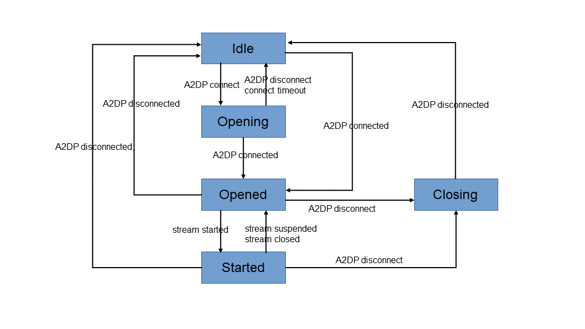

\[ [English](../../../../en/api/framework/bluetooth/bt_a2dp.md) | 简体中文 \]

# 蓝牙 A2DP API

openvela 蓝牙 A2DP（高级音频分发）接口，支持音频流的发送（Source）和接收（Sink）。

头文件：#include "bt_a2dp.h"、#include "bt_a2dp_sink.h"、#include "bt_a2dp_source.h"


## openvela 实现说明

- **双角色支持**：Source（音频发送端）和 Sink（音频接收端）
- **编解码器**：支持 SBC 和 AAC
- **传输模式**：支持硬件卸载（Offloading）和非卸载模式


## 连接状态机

A2DP 连接建立、流传输以及断开过程中的状态转换如下图所示：



各状态含义：

- **Idle**：空闲，未建立 A2DP 连接。
- **Opening**：正在建立 A2DP 连接（本端发起 `A2DP connect` 之后）。
- **Opened**：A2DP 信令连接已建立，可准备音频流。
- **Started**：音频流已启动，正在传输音频数据。
- **Closing**：正在断开 A2DP 连接，直至对端确认 `A2DP disconnected`。


## 同步接口


### bt_a2dp_sink_unregister_callbacks

```c
bool bt_a2dp_sink_unregister_callbacks(bt_instance_t* ins, void* cookie);
```

取消注册回调函数，停止接收状态变更通知。

**参数**：

- `ins` 蓝牙客户端实例。
- `cookie` 用户上下文。


**返回值**：

成功时返回 `true`，失败时返回 `false`。


### bt_a2dp_sink_is_connected

```c
bool bt_a2dp_sink_is_connected(bt_instance_t* ins, bt_address_t* addr);
```

查询指定设备的 A2DP Sink 是否已连接。

**参数**：

- `ins` 蓝牙客户端实例。
- `addr` 对端设备蓝牙地址。

**返回值**：

已连接时返回 `true`，未连接时返回 `false`。


### bt_a2dp_sink_is_playing

```c
bool bt_a2dp_sink_is_playing(bt_instance_t* ins, bt_address_t* addr);
```

查询指定设备的 A2DP Sink 是否正在播放音频流。

**参数**：

- `ins` 蓝牙客户端实例。
- `addr` 对端设备蓝牙地址。

**返回值**：

正在播放时返回 `true`，未播放时返回 `false`。


### bt_a2dp_sink_get_connection_state

```c
profile_connection_state_t bt_a2dp_sink_get_connection_state(bt_instance_t* ins, bt_address_t* addr);
```

获取指定设备的 A2DP Sink 连接状态。

**参数**：

- `ins` 蓝牙客户端实例。
- `addr` 远程设备蓝牙地址。


**返回值**：

返回当前连接状态枚举值，参见 `profile_connection_state_t`。


### bt_a2dp_sink_connect

```c
bt_status_t bt_a2dp_sink_connect(bt_instance_t* ins, bt_address_t* addr);
```

发起与远程设备的 A2DP Sink 连接。

**参数**：

- `ins` 蓝牙客户端实例。
- `addr` 对端设备蓝牙地址。

**返回值**：

成功时返回 BT_STATUS_SUCCESS，失败时返回错误码。


### bt_a2dp_sink_disconnect

```c
bt_status_t bt_a2dp_sink_disconnect(bt_instance_t* ins, bt_address_t* addr);
```

断开与远程设备的 A2DP Sink 连接。

**参数**：

- `ins` 蓝牙客户端实例。
- `addr` 对端设备蓝牙地址。

**返回值**：

成功时返回 BT_STATUS_SUCCESS，失败时返回错误码。


### bt_a2dp_source_unregister_callbacks

```c
bool bt_a2dp_source_unregister_callbacks(bt_instance_t* ins, void* cookie);
```

取消注册回调函数，停止接收状态变更通知。

**参数**：

- `ins` 蓝牙客户端实例。
- `cookie` 用户上下文。


**返回值**：

成功时返回 `true`，失败时返回 `false`。


### bt_a2dp_source_is_connected

```c
bool bt_a2dp_source_is_connected(bt_instance_t* ins, bt_address_t* addr);
```

查询指定设备的 A2DP Source 是否已连接。

**参数**：

- `ins` 蓝牙客户端实例。
- `addr` 对端设备蓝牙地址。

**返回值**：

已连接时返回 `true`，未连接时返回 `false`。


### bt_a2dp_source_is_playing

```c
bool bt_a2dp_source_is_playing(bt_instance_t* ins, bt_address_t* addr);
```

查询指定设备的 A2DP Source 是否正在播放音频流。

**参数**：

- `ins` 蓝牙客户端实例。
- `addr` 对端设备蓝牙地址。

**返回值**：

正在播放时返回 `true`，未播放时返回 `false`。


### bt_a2dp_source_get_connection_state

```c
profile_connection_state_t bt_a2dp_source_get_connection_state(bt_instance_t* ins, bt_address_t* addr);
```

获取指定设备的 A2DP Source 连接状态。

**参数**：

- `ins` 蓝牙客户端实例。
- `addr` 远程设备蓝牙地址。


**返回值**：

返回当前连接状态枚举值，参见 `profile_connection_state_t`。


### bt_a2dp_source_connect

```c
bt_status_t bt_a2dp_source_connect(bt_instance_t* ins, bt_address_t* addr);
```

发起与远程设备的 A2DP Source 连接。

**参数**：

- `ins` 蓝牙客户端实例。
- `addr` 对端设备蓝牙地址。

**返回值**：

成功时返回 BT_STATUS_SUCCESS，失败时返回错误码。


### bt_a2dp_source_disconnect

```c
bt_status_t bt_a2dp_source_disconnect(bt_instance_t* ins, bt_address_t* addr);
```

断开与远程设备的连接。

**参数**：

- `ins` 蓝牙客户端实例。
- `addr` 远程设备蓝牙地址。


**返回值**：

成功时返回 BT_STATUS_SUCCESS，失败时返回错误码。


### bt_a2dp_source_set_silence_device

```c
bt_status_t bt_a2dp_source_set_silence_device(bt_instance_t* ins, bt_address_t* addr, bool silence);
```

设置静音设备。

**参数**：

- `ins` 蓝牙客户端实例。
- `addr` 远程设备蓝牙地址。
- `silence` 是否设为静音模式（true 为静音）。


**返回值**：

成功时返回 BT_STATUS_SUCCESS，失败时返回错误码。


### bt_a2dp_source_set_active_device

```c
bt_status_t bt_a2dp_source_set_active_device(bt_instance_t* ins, bt_address_t* addr);
```

设置活跃设备。

**参数**：

- `ins` 蓝牙客户端实例。
- `addr` 远程设备蓝牙地址。


**返回值**：

成功时返回 BT_STATUS_SUCCESS，失败时返回错误码。
