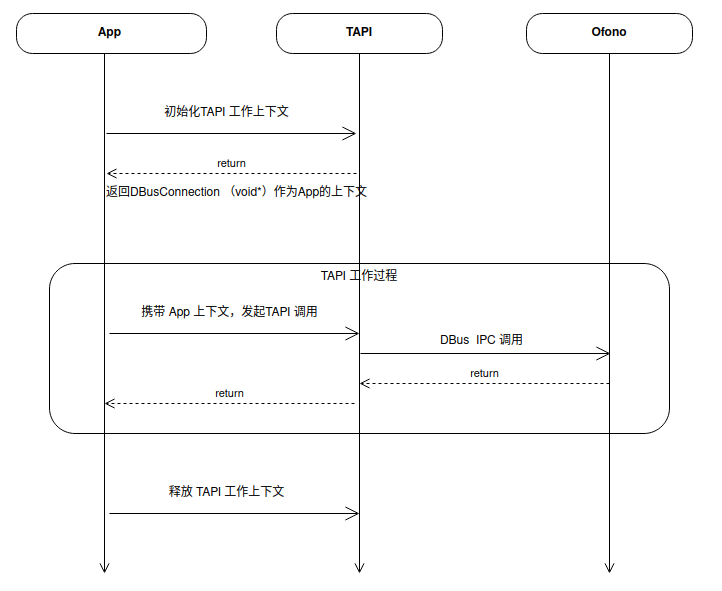

\[ [English](../../../../en/api/framework/telephony/index.md) | 简体中文 \]

# Telephony API

Telephony 提供蜂窝通信能力，`framework/telephony` 是 openvela 蜂窝通信对应用层提供的接口层，又称为 TAPI（Telephony API）。封装的接口涵盖了蜂窝通信业务：网络服务、通话、短信、数据、SIM 双卡和 modem 配置管理等。

TAPI 独立于 openvela telephony core stack，内部逻辑基于 DBUS LIB 对 Core Stack 进行业务逻辑封装，屏蔽掉 D-Bus 的复杂操作，对外以标准 C 的方式提供标准化统一的 Telephony API 接口定义，方便 openvela 应用层 APP 的使用，让 openvela APP 实现 openvela 系统版本间复用。

## openvela 实现说明

- **架构**：TAPI 基于 D-Bus 对 Telephony Core Stack（oFono）进行封装，以标准 C 接口对外提供
- **SIM 卡标识**：通过 `slot_id` 参数区分不同 SIM 卡槽
- **异步模型**：大部分操作通过回调函数异步返回结果

## 模块代码介绍

| 模块 | 源码 | API 文档 | 说明 |
| :--- | :--- | :--- | :--- |
| 对外统一头文件 | `tapi.h` | [公共工具](telephony.md) | 公共类型定义、字符串/枚举转换 utils |
| Radio 接口 | `tapi_manager.c/h` | [管理](telephony_manager.md) | Telephony 初始化、状态查询、事件注册 |
| Call 接口 | `tapi_call.c/h` | [通话](telephony_call.md) | 语音通话控制 |
| 补充业务 | `tapi_ss.c/h` | [补充业务 SS](telephony_ss.md) | 呼叫转移/呼叫限制/呼叫等待/CLIR/USSD |
| 简化电话服务 | `tapi_phone.c/h` | [简化电话服务](telephony_phone.md) | 轻量客户端封装 |
| Network 接口 | `tapi_network.c/h` | [网络](telephony_network.md) | 网络注册、信号、运营商 |
| Data 接口 | `tapi_data.c/h` | [数据](telephony_data.md) | 蜂窝数据连接 |
| SIM 接口 | `tapi_sim.c/h` | [SIM 卡](telephony_sim.md) | SIM 卡管理 |
| SIM Toolkit | `tapi_stk.c/h` | [SIM Toolkit](telephony_stk.md) | STK Agent 与 SIM 卡主动命令 |
| 电话簿 | `tapi_phonebook.c/h` | [电话簿](telephony_phonebook.md) | ADN/FDN 电话簿管理 |
| SMS 接口 | `tapi_sms.c/h` | [短信](telephony_sms.md) | 短信收发 |
| Cell Broadcast | `tapi_cbs.c/h` | [小区广播 CBS](telephony_cbs.md) | 小区广播消息 |
| IMS 接口 | `tapi_ims.c/h` | [IMS](telephony_ims.md) | VoLTE/VoWiFi |

## TAPI 配置

完整的 Telephony 业务涉及模块众多，需要所有模块开启完整使用 Telephony 业务。

**DBUS 配置**

```kconfig
CONFIG_DBUS_DAEMON=y
CONFIG_DBUS_MONITOR=y
CONFIG_DBUS_SEND=y
CONFIG_LIB_DBUS=y
```

**GLIB 配置**

```kconfig
CONFIG_LIB_GLIB=y
```

**OFONO 配置**

```kconfig
CONFIG_LIB_ELL=y
CONFIG_OFONO=y
CONFIG_OFONO_RILMODEM=y  # modem 类型选择，支持 rild 的选择 rilmodem
CONFIG_OFONO_ATMODEM=y   # 支持串口、USB 的选择 atmodem
```

**GDBUS 配置**

```kconfig
CONFIG_LIB_DBUS=y
```

**Telephony API 配置**

```kconfig
CONFIG_TELEPHONY=y
CONFIG_TELEPHONY_TOOL=y  # debug 工具，可选
```

## TAPI 工作使用模型



## TAPI 函数使用举例

### 获取 TAPI 工作上下文

先声明一个 callback 函数：

```c
static void on_tapi_client_ready(const char* client_name, void* user_data)
{
    if (client_name != NULL)
        syslog(LOG_DEBUG, "tapi is ready for %s\n", client_name);
    ...
}
```

再调用 `tapi_open` 函数获取上下文。获取成功需要 oFono、D-Bus 等服务启动成功，当 ready 后会调用 callback 函数。

```c
tapi_context context;
char* dbus_name = "vela.telephony.tool";
context = tapi_open(dbus_name, on_tapi_client_ready, NULL);
```

### 释放 TAPI 工作上下文

```c
tapi_close(context);
```

### 查询当前的 radio power 状态

```c
int slot_id = 0;
bool value = false;
tapi_get_radio_power(context, slot_id, &value);
```
