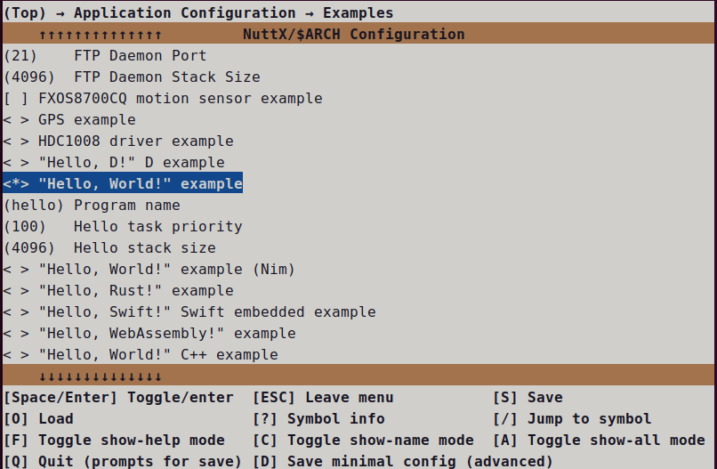
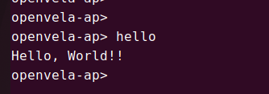
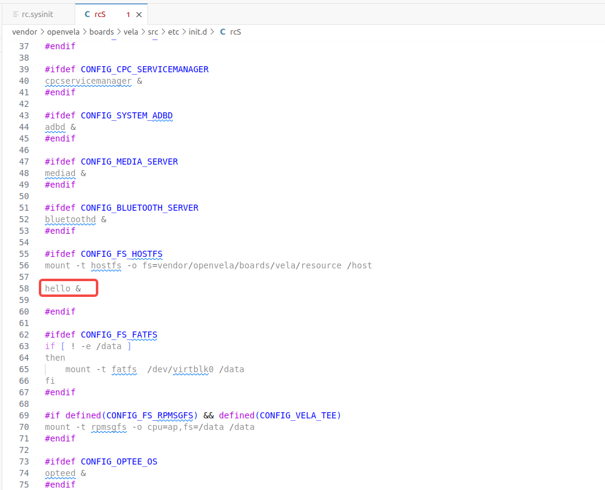
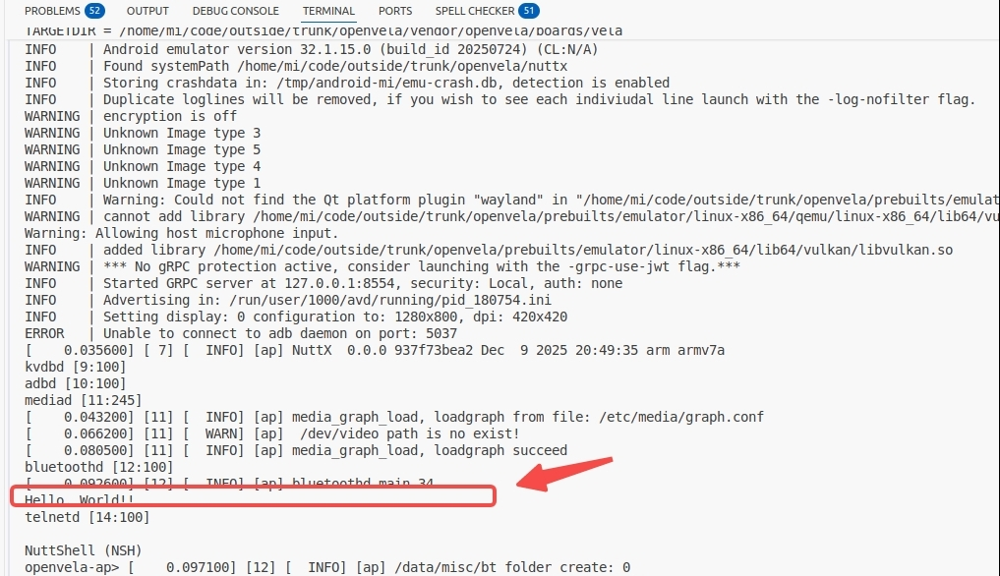

# 运行 Hello World 示例

[ [English](../../../../en/app_dev/system_apps/hello_world/Hello_World.md) | 简体中文 ]

## 概述

本文档面向开发者，旨在详细介绍如何在 openvela 操作系统中添加、配置和运行一个新的用户应用程序。openvela 基于 NuttX RTOS 构建，其模块化的设计允许开发者方便地集成自定义功能或第三方库。

一个典型的功能模块包含以下部分：

- **系统应用 (System Application)**：作为系统内置功能的一部分，通常存放于 `apps/` 目录下。
- **第三方库 (Third-Party Library)**：作为外部依赖引入，通常存放于 `external/` 目录下。

示例目录结构如下：

```Bash
└── vela
    ├── apps
    │   └── examples
    │       ├── hello_main_1
    │       └── hello_main_2
    └── external
        ├── libs_1
        └── libs_2
```

本指南将以 `Hello, World!` 示例应用程序为引导，完整演示从代码编写到构建、运行和自启动的全过程。

## 步骤一：查看 Hello World 示例框架

本节介绍如何在 openvela 中添加一个示例应用程序，包括主体框架、文件内容以及相关构建配置。

### 1、主体框架

Hello World 示例应用程序需要包含以下核心文件：

- `hello_main.c`：应用程序的源代码，包含 `main` 函数入口。
- `Kconfig`：构建系统的配置文件，用于在 `menuconfig` 中提供可裁剪的编译选项。
- `CMakeLists.txt`：CMake 构建脚本，用于定义源码、依赖和编译规则。

目录结构示例如下，当前 Hello World 已添加完毕：

```Bash
apps
 └── examples
     └── hello
         ├── hello_main.c
         ├── CMakeLists.txt
         ├── Kconfig
```

### 2、编写源代码 (hello_main.c)

查看 `hello_main.c` 文件，这是应用程序的执行逻辑入口：

```C
#include <stdio.h>

int main(int argc, char *argv[])
{
    printf("Hello, World!!\n");
    return 0;
}
```

如果您需要使用 C++，请确保 `main` 函数使用 `extern "C"` 声明，以保证其 C 语言链接兼容性，从而能被系统正确调用：

```C++
#include <iostream>

extern "C" int main(int argc, char *argv[])
{
    std::cout << "Hello, World!!" << endl;
    return 0;
}
```

### 3、创建 Kconfig 配置文件

查看 `Kconfig` 文件，用于定义应用程序的编译选项。这些选项将显示在 `menuconfig` 图形配置界面中，允许用户按需启用或配置您的应用：

```makefile
config EXAMPLES_HELLO
        tristate "\"Hello, World!\" example"
        default n
        ---help---
                Enable the \"Hello, World!\" example

# 仅当 EXAMPLES_HELLO 启用时，以下选项才可见
if EXAMPLES_HELLO

# 定义应用程序在 openvela 中执行的命令名称
config EXAMPLES_HELLO_PROGNAME
        string "Program name"
        default "hello"
        ---help---
                This is the name of the program that will be used when the NSH ELF
                program is installed.

# 定义应用程序任务的优先级
config EXAMPLES_HELLO_PRIORITY
        int "Hello task priority"
        default 100

# 定义应用程序任务的堆栈大小
config EXAMPLES_HELLO_STACKSIZE
        int "Hello stack size"
        default DEFAULT_TASK_STACKSIZE
        
endif
```

### 4、创建 CMake 构建脚本

查看 `CMakeLists.txt` 文件。openvela 的构建系统会自动加载 `.config` 文件中的所有宏定义作为 CMake 变量，因此您可以直接使用 `Kconfig` 中定义的配置。

```CMake
# 检查 'EXAMPLES_HELLO' 是否在 .config 中被启用
if(CONFIG_EXAMPLES_HELLO) # 如果defconfig使能了该feature则加入编译
  
  # 调用 nuttx_add_application 函数将应用注册为内置 (built-in) 程序
  nuttx_add_application(
    # NAME: 指定应用的唯一名称，通常与 Kconfig 中的 PROGNAME 保持一致
    NAME                                
    ${CONFIG_EXAMPLES_HELLO_PROGNAME}   
    
    # SRCS: 指定源文件列表，main 函数所在文件应为第一个
    SRCS                                
    hello_main.c 
    
    # STACKSIZE: 指定任务堆栈大小                       
    STACKSIZE                           
    ${CONFIG_EXAMPLES_HELLO_STACKSIZE}  
    
    # PRIORITY: 指定任务优先级，不传则为SCHED_PRIORITY_DEFAULT
    PRIORITY                            
    ${CONFIG_EXAMPLES_HELLO_PRIORITY})  
endif()
```

#### `nuttx_add_application()` 的函数定义

该 CMake 函数位于 `nuttx/cmake/nuttx_add_application.cmake` 文件中，用于添加并配置应用程序。

```CMake
nuttx/cmake/nuttx_add_application.cmake

 Usage:
   nuttx_add_application( NAME <string> [ PRIORITY <string> ]
     [ STACKSIZE <string> ] [ COMPILE_FLAGS <list> ]
     [ INCLUDE_DIRECTORIES <list> ] [ DEPENDS <string> ]
     [ DEFINITIONS <string> ] [ MODULE <string> ] [ SRCS <list> ] )

 Parameters:
   NAME                : unique name of application
   PRIORITY            : priority
   STACKSIZE           : stack size
   COMPILE_FLAGS       : compile flags
   INCLUDE_DIRECTORIES : include directories
   DEPENDS             : targets which this module depends on
   DEFINITIONS         : optional compile definitions
   MODULE              : if "m", build module (designed to received
                         CONFIG_<app> value)
   SRCS                : source files
   NO_MAIN_ALIAS       : do not add a main=<app>_main alias(*)
```

## 步骤二：验证应用程序

完成文件创建后，您需要通过以下步骤来配置、编译并运行您的应用程序。

### 1、清理构建环境 (可选)

如果您修改了 Kconfig 文件或希望进行全新编译，建议先执行清理操作：

```Bash
# 使用 distclean 清理所有构建产物和配置
./build.sh vendor/openvela/boards/vela/configs/goldfish-armeabi-v7a-ap  --cmake distclean -j$(nproc)
```

或者直接删除cmake产物

```Bash
# 或者直接删除cmake产物
rm -rf cmake_out/vela_goldfish-armeabi-v7a-ap
```

### 2、图形化配置 (menuconfig)

启动 `menuconfig` 以在图形界面中启用您的新应用：

```Bash
# 启动 menuconfig  
./build.sh vendor/openvela/boards/vela/configs/goldfish-armeabi-v7a-ap  --cmake menuconfig -j$(nproc)
```

在 `menuconfig` 界面中，通过以下路径找到并启用您的应用： `Application Configuration` ---> `Examples` ---> `[*] "Hello, World!" example`



### 3、编译和运行

保存 `menuconfig` 配置后，执行编译。

```Bash
# 编译固件 (-j`nproc` 使用所有 CPU 核心并行编译)
./build.sh vendor/openvela/boards/vela/configs/goldfish-armeabi-v7a-ap  --cmake -j$(nproc)

# 拷贝产物
cp cmake_out/vela_goldfish-armeabi-v7a-ap/nuttx* nuttx/ && 
cp cmake_out/vela_goldfish-armeabi-v7a-ap/vela_data.bin nuttx/ && 
cp cmake_out/vela_goldfish-armeabi-v7a-ap/vela_system.bin nuttx/

# 启动模拟器运行固件
./emulator.sh vela
```

系统启动后，在 NSH 命令行中输入您在 `Kconfig` 中设置的程序名称（默认为 `hello`）并回车，即可看到程序输出：



## 步骤三：配置应用自启动

openvela 支持在系统启动时自动运行指定脚本，您可以通过编辑启动脚本来实现应用的自启动。

### 1、自启动机制与配置

openvela 的启动脚本存放在 `/etc` 目录下，该目录以 `romfs` 的形式与 openvela 的二进制文件链接在一起。在系统启动后会自动被 `nshlib` 挂载，相关配置如下。

确保您的板级配置启用了以下 `Kconfig` 选项：

```Makefile
CONFIG_FS_ROMFS=y
CONFIG_ETC_ROMFS=y
CONFIG_ETC_ROMFSMOUNTPT="/etc"
CONFIG_NSH_SYSINITSCRIPT="init.d/rc.sysinit"
CONFIG_NSH_INITSCRIPT="init.d/rcS"
```

### 2、启动脚本位置

默认的用户启动脚本位于板级配置目录中：

```Bash
vendor/openvela/boards/vela/src/etc/init.d/rc.sysinit   # 系统初始化脚本 
vendor/openvela/boards/vela/src/etc/init.d/rcS          # 用户脚本  
```

### 3、编辑启动脚本

打开 `rcS` 文件，在其中添加您应用的执行命令。

```bash
#ifdef CONFIG_FS_HOSTFS
mount -t hostfs -o fs=vendor/openvela/boards/vela/resource /host
#endif

hello &
```

添加后效果如下图所示：



### 4、重新编译和运行

```Bash
# 编译固件 (-j`nproc` 使用所有 CPU 核心并行编译)
./build.sh vendor/openvela/boards/vela/configs/goldfish-armeabi-v7a-ap  --cmake -j$(nproc)

# 拷贝产物
cp cmake_out/vela_goldfish-armeabi-v7a-ap/nuttx* nuttx/ && 
cp cmake_out/vela_goldfish-armeabi-v7a-ap/vela_data.bin nuttx/ && 
cp cmake_out/vela_goldfish-armeabi-v7a-ap/vela_system.bin nuttx/

# 启动模拟器运行固件
./emulator.sh vela
```

启动后效果如下图所示：



**注意：**

- **使用 POSIX 线程**：在应用程序内部，推荐使用 `pthread_create()` 创建和管理子线程，而不是直接调用底层的 `task_create()`。这能保证更好的可移植性和兼容性。
- **守护主线程**：如果您的主线程创建了子线程，请确保主线程在所有子线程安全退出后才结束。否则，主线程的退出可能导致整个进程被回收，子线程被强制终止。
- **创建后台服务**：对于需要长期运行的服务，可以在 `rcS` 脚本中使用 `&` 将其置于后台运行。应用内部通常会进入一个循环（如 `while(1)`）来处理事件或执行周期性任务。

## 参考资料

为帮助您更好地理解和添加 `CMakeLists.txt`，下面是参考资料和工具信息：

- openvela CMake 编译系统请参考 [CMake 快速入门](../../../device_dev_guide/build/CMake_quick_start.md)。
