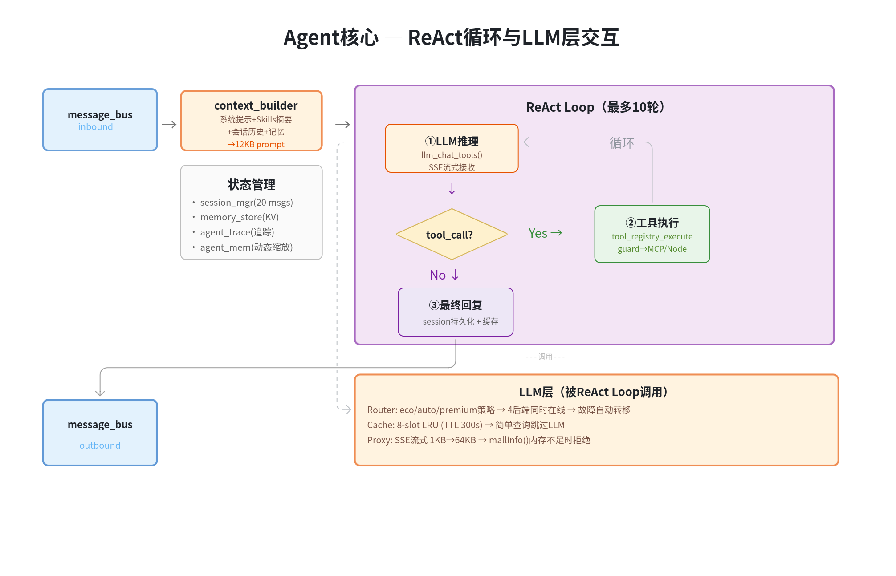
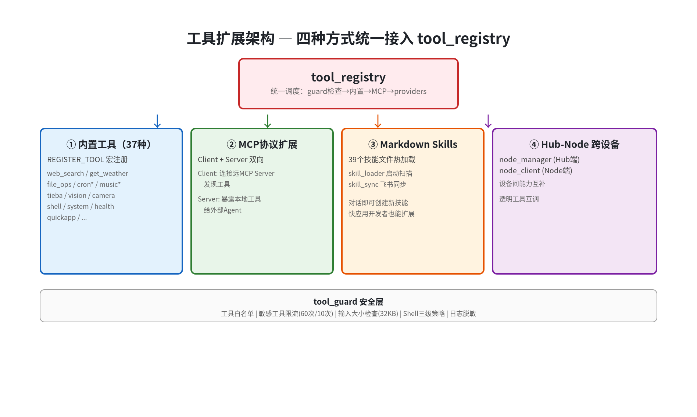
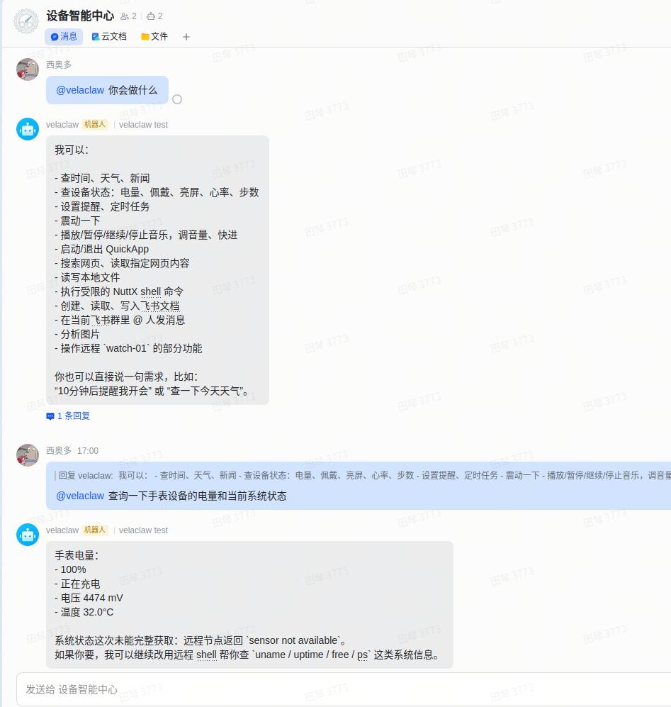
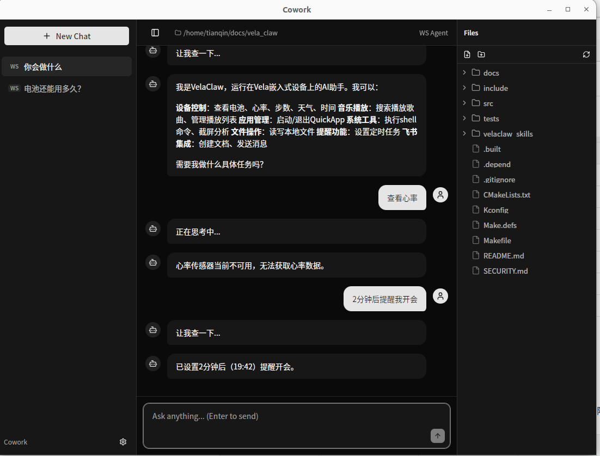

# ai_agent 应用开发上手指南

> 本文档面向 2026 首届 openvela AI 硬件开发者大赛参赛者，介绍如何从零搭建 openvela + ai_agent 环境、配置 LLM、体验核心能力，并了解框架架构与开发板集成方式。

## 一、前置准备

### 硬件

- 一块支持 openvela 的开发板（具体型号待补充）
- USB 数据线（注意是数据线，不是只能充电的）
- （可选）安卓手机，安装 [com.agent.coapp](https://github.com/tnaught/com.agent.coapp)，可通过蓝牙配网和推送配置，省去部分命令行操作

### 环境搭建

开始之前，需要先完成以下准备：

1. **搭建 openvela 开发环境** — 参见 [快速入门（Ubuntu）](../../quickstart/openvela_ubuntu_quick_start.md)
2. **编译 ai_agent 固件** — 在 menuconfig 中启用 `Application Configuration → Packages → Vela AI Agent`，然后编译
3. **烧录到开发板** — 连接 USB，烧录固件，启动后看到 NSH 提示符 `nsh>`

> 以上每一步的详细操作请参考 openvela 官方文档。本文档从 `nsh>` 提示符开始，假设你已经把固件跑起来了。

### LLM API Key（只需要 1 个就能跑）

ai_agent 需要连接大语言模型才能工作，你只需准备一个 LLM 的 API Key：

| 服务      | 申请地址                              | 推荐度     |
| --------- | ------------------------------------- | ---------- |
| 小米 MiMo | https://mimo.mi.com/                  | ⭐ 优先推荐 |
| DeepSeek  | https://platform.deepseek.com/        | 备选       |
| 通义千问  | https://dashscope.console.aliyun.com/ | 备选       |
| Kimi      | https://platform.moonshot.cn/         | 备选       |

> 先别急着申请，下一节配好网络后再填 Key 就行。

## 二、最小配置：联网 + 设置 LLM API Key = 能对话

> 目标：和 ai_agent 完成第一次对话。
>
> 前提顺序：**先联网，再配 LLM** —— ai_agent 依赖 LLM 做推理，而云端 LLM API 依赖网络。

### 1、连接 WiFi

```bash
nsh> ai_agent
```

进入 ai_agent 的命令行（提示符变为 `vela>`），先配网：

```bash
vela> set_wifi <wifi_ssid> <wifi_password>
```

验证：`vela> net_test` 显示成功。

> 如果你的开发板没有 WiFi 模块（如 QEMU 模拟器），可跳过这步——大赛使用的 `goldfish-arm64-v8a-ap` 配置自带 NAT 网络（eth0 自动获取 `10.0.2.15`），开机即联网，详见本文「六、3 QEMU 模拟器（goldfish-arm64-v8a-ap）」。

### 2、设置 LLM

```bash
# 以 MiMo 为例
vela> router_set mimo <api_key>

# 验证设置成功
vela> router_status

# 更换模型：router_model <router_index> <router_model>
# router_index 是 router 的序号，router_model 是模型名称（以模型 API 官网名称为准）
vela> router_model 0 mimo-v2.5
```

> Key 只需设置一次，会加密保存在设备存储中，重启和重新刷包不丢失；重新刷资源或清除数据会重置为空。

### 3、第一次对话

```bash
vela> ask 你好，请介绍一下你自己
```

如果一切正常，你会看到 AI 的回复。

### 4、验证点

收到 AI 的文字回复 → 说明网络 + LLM 都配置成功。

### 5、没收到回复？

按这个顺序排查：

```bash
# 1. 确认网络通了（最常见的问题）
vela> net_test

# 2. 确认 Key 存进去了
vela> config_show

# 3. 如果网络不通，重新配 WiFi
vela> net_status
vela> set_wifi <wifi_ssid> <wifi_password>
```

> 到这里你已经能用了。下面的配置都是按产品需求来追加，不配不影响大模型调用功能。

### 6、想让 AI 联网搜索？→ 配置搜索 API Key

配置搜索 API Key 后，ai_agent 内置的 `web_search` 工具即可联网查信息。支持 3 种搜索后端，按优先级自动回退；不配置不影响对话和其他工具。

| 后端              | CLI 命令               | 申请地址             | 说明                                                 |
| ----------------- | ---------------------- | -------------------- | ---------------------------------------------------- |
| Tavily ⭐推荐      | `set_tavily_key <key>` | https://tavily.com/  | AI 优化搜索，POST 请求，TLS 兼容性好，嵌入式设备友好 |
| SerpAPI（Google） | `set_search_key <key>` | https://serpapi.com/ | Google 搜索结果，GET 请求，国内网络可能有路由问题    |
| Exa AI            | `set_exa_key <key>`    | https://exa.ai/      | 语义搜索引擎，适合知识型查询                         |

> 另有 `set_news_key <key>` 配置 NewsAPI（新闻专用），申请地址：https://newsapi.org/。

**为什么推荐 Tavily：**

- POST 请求 + JSON body，TLS 握手更稳定，嵌入式设备上兼容性好
- AI 优化的搜索结果，直接返回内容摘要，不需要二次提取
- SerpAPI 依赖 Google 搜索，在国内网络环境可能遇到连接问题

**配置示例**（只需配 1 个就能用，推荐 Tavily）：

```bash
# 推荐：Tavily
vela> set_tavily_key tvly-xxxxxxxxxxxxxxxx

# 备选：SerpAPI（Google 搜索）
vela> set_search_key xxxxxxxxxxxxxxxxxxxxxxxxxxxxxxxxxx

# 备选：Exa AI（语义搜索）
vela> set_exa_key exa-xxxxxxxxxxxxxxxx

# 新闻搜索（可选，独立配置）
vela> set_news_key xxxxxxxxxxxxxxxxxxxxxxxxxxxxxxxxxx
```

**验证：**

```bash
vela> ask 今天北京天气怎么样
vela> ask 搜索一下最新的AI Agent开源项目
```

如果 AI 返回了实时搜索结果，说明搜索 Key 配置成功。

> 验证点：AI 回复包含实时信息（天气、新闻等），不再只说「我无法访问互联网」。
>
> 💡 搜索 Key 和 LLM Key 一样，加密保存在设备存储中，重启不丢失。可用 `config_show` 查看配置状态（Key 会脱敏显示）。
>
> ⚠️ 不配置搜索 Key 时，`web_search` 工具不可用，AI 无法联网搜索，但不影响对话和其他工具功能。

## 三、更多功能的配置

> 每项独立，不互相依赖，可组合使用。需先在 menuconfig 中开启对应的 Kconfig 开关，重新编译并烧录后才能使用。

### 1、想用微信对话？→ 开启微信通道 + 扫码登录

menuconfig 开启：

```
Application Configuration → Packages → Vela AI Agent → Enable WeChat channel
```

对应 Kconfig：`AI_AGENT_WEIXIN`（默认开启）。配置：

```bash
vela> weixin_login
```

屏幕会显示二维码，用微信扫码确认。登录后直接给微信的 Bot 发消息即可对话。

验证：在微信里发一条消息，收到 AI 回复。

### 2、想用飞书对话？→ 开启飞书通道 + 配置应用

menuconfig 开启：

```
Application Configuration → Packages → Vela AI Agent → Enable Feishu bot channel
```

对应 Kconfig：`AI_AGENT_FEISHU`（默认开启）。配置：

```bash
vela> set_feishu_app <app_id> <app_secret>
```

需要在飞书开放平台创建一个应用，获取 App ID 和 App Secret。

验证：在飞书群里 @机器人 发消息，收到回复。

### 3、想用语音交互？→ 开启音频配置 + 火山引擎

在 [火山引擎语音服务控制台](https://console.volcengine.com/speech/service/10038) 获取 APIKey、AppID 和 Token，然后填入：

```bash
vela> set_volc_key <api_key>
vela> set_volc_asr <app_id> <access_token> volcengine_streaming_common
vela> voice_start
```

对着麦克风说话即可。

验证：说话后收到语音 + 文字回复。

### 4、内存紧张？→ 关掉不需要的模块

在 menuconfig 中按需关闭：`Application Configuration → Packages → Vela AI Agent`

| 模块         | Kconfig             | 默认 | 占用       | 关闭建议                                    |
| ------------ | ------------------- | ---- | ---------- | ------------------------------------------- |
| 飞书 Bot     | `AI_AGENT_FEISHU`   | 开启 | ~108KB     | 不用飞书就关                                |
| 微信 Bot     | `AI_AGENT_WEIXIN`   | 开启 | ~45KB      | 不用微信就关                                |
| MQTT         | `AI_AGENT_MQTT`     | 开启 | ~15KB      | 不做 IoT 就关                               |
| 多设备协作   | `AI_AGENT_NODE`     | 开启 | ~20KB      | 不用 Hub/Node 就关                          |
| MCP 协议     | `AI_AGENT_MCP`      | 开启 | ~10KB      | 不用远程工具就关                            |
| LVGL UI      | `AI_AGENT_LVGL_UI`  | 关闭 | ~50KB      | 需要屏幕聊天才开                            |
| BLE GATT     | `AI_AGENT_BLE_GATT` | 关闭 | —          | 需要 BLE 数据通道（iOS/Android 客户端）时开 |
| BLE 网络通道 | `AI_AGENT_BLE_NET`  | 关闭 | —          | 无 WiFi、经手机 App 蓝牙 SPP 代理上网时开   |
| 相机         | `AI_AGENT_CAMERA`   | 关闭 | 依赖 VIDEO | 视觉识别场景开                              |

最小配置（纯 CLI）：关闭飞书 + 微信 + MQTT + Node + MCP + LVGL_UI，可节省约 260KB 内存。

## 四、体验核心能力

> 你已经跑起来了，现在看看 ai_agent 和普通聊天机器人有什么不同。

### 1、工具调用

ai_agent 不只是聊天，它能**操作设备**：

```bash
# 查看系统状态
vela> ask 现在系统内存用了多少？

# 播放音乐
vela> ask 播放音乐

# 设置定时提醒
vela> ask 提醒我明早7点开会
```

内置工具一览：

| 类别 | 工具                       | 能做什么          |
| ---- | -------------------------- | ----------------- |
| 搜索 | web_search                 | 搜索网页          |
| 文件 | read_file, write_file      | 读写文件          |
| 定时 | cron_add, cron_list        | 添加/查看定时任务 |
| 视觉 | analyze_image              | 分析图片          |
| 设备 | get_battery, get_heartrate | 获取设备状态      |
| 飞书 | feishu_doc_create          | 创建飞书文档      |
| 音乐 | music_play, music_search   | 播放/搜索音乐     |

### 2、Skills 技能系统

Skills 告诉 ai_agent 在特定场景下「该怎么做」。和工具的区别：工具是「能做事」，技能是「知道怎么做」。

内置 Skills：weather（天气）、daily-briefing（每日简报）、reminder（提醒）、translate（翻译）、news-digest（新闻摘要）。

```bash
vela> ask 每天早上8点给我发天气简报
```

ai_agent 会自动选择 weather + reminder + cron_add 组合完成任务。

### 3、主动任务

这是 ai_agent 区别于普通聊天机器人的核心能力——**它不等你说，自己就会做**。

```bash
# 设置定时提醒后，到时间它会主动推送
vela> ask 提醒我每天下午3点喝水
```

你不需要再问「我有什么提醒」，到点它自己来。

### 4、MCP 远程工具

MCP（Model Context Protocol）让你能调用远程服务器的工具：

```bash
# 添加高德地图 MCP
vela> mcp_add amap https://mcp.amap.com/mcp?key=<api_key>

# 查看已发现的工具
vela> mcp_discover
```

## 五、架构及设计

> 你已经用起来了。在开始开发具体的 Agent 应用之前，花几分钟了解一下 ai_agent 的运作原理和架构设计。

### 1、Agent 的核心



### 2、工具扩展方式



### 3、实现场景示例

**通过飞书来控制智能设备：**



**和桌面端智能体联动：**



开发应用时，你主要和这三层打交道：

1. **openvela + LVGL**：提供显示、输入、事件循环——你的应用跑在这上面
2. **ai_agent 框架**：提供 Router、Tool、主动任务、Skills——你的应用调用这些能力
3. **接入通道**：用户通过微信/飞书/语音和你的应用交互

**和普通嵌入式应用的区别**：普通应用是「用户点按钮 → 代码执行」；Agent 应用是「用户说话 → AI 理解 → 选择工具 → 执行 → 可能还主动推送」。

## 六、开发板集成方式

ai_agent 提供了预置的 defconfig 文件，支持不同开发板快速集成。每个开发板的 defconfig 目录（`packages/ai_agent/defconfigs/<board>/`）下都有对应的 README 说明。

### 1、ESP32-S3-EYE

| 项目      | 说明                                           |
| --------- | ---------------------------------------------- |
| 芯片      | ESP32-S3（Xtensa 双核）                        |
| 屏幕      | ST7789 240×240 LCD                             |
| 内存      | PSRAM 8MB                                      |
| 特性      | WiFi、LCD，无 BLE                              |
| defconfig | `defconfigs/esp32s3-eye/esp32s3-eye_defconfig` |

```bash
# 1. 复制 defconfig 到板子配置目录
cp packages/ai_agent/defconfigs/esp32s3-eye/esp32s3-eye_defconfig \
   nuttx/boards/xtensa/esp32s3/esp32s3-eye/configs/ai_agent/defconfig

# 2. 加载 ESP-IDF 环境
source /path/to/esp-idf/export.sh
export CCACHE_DISABLE=1

# 3. 清理 + 编译（fix 脚本需在编译过程中后台执行）
./build.sh esp32s3-eye:ai_agent distclean
bash packages/ai_agent/fix_esp32s3.sh &
./build.sh esp32s3-eye:ai_agent

# 4. 烧录
esptool.py -c esp32s3 -p /dev/ttyACM0 -b 460800 \
  --before default_reset --after hard_reset \
  write_flash 0x0 nuttx/nuttx.bin
```

> `fix_esp32s3.sh` 修复了 ESP-IDF 与 NuttX 的 mbedtls 头文件冲突、CCM 密码套件兼容性、自旋锁初始化等上游兼容问题（无法通过 defconfig 表达，必须用脚本打补丁）。
> 
> 已知可忽略警告：`ccache: error: execute_noreturn`、`expr: syntax error`，设置 `export CCACHE_DISABLE=1` 可消除。

### 2、Gemini-S1（全志 R528）

| 项目      | 说明                                         |
| --------- | -------------------------------------------- |
| 芯片      | R528S3（ARM Cortex-A7）                      |
| 屏幕      | ILI9341 LCD                                  |
| 特性      | WiFi、BLE GATT、media server、mini_memo demo |
| defconfig | `defconfigs/gemini-s1/gemini-s1_defconfig`   |

关键 Kconfig 选项：

```
CONFIG_EXAMPLES_AI_AGENT_VELA=y   # 启用 ai_agent
CONFIG_LVX_USE_DEMO_MINI_MEMO=y   # 启用 mini_memo LVGL demo
CONFIG_AI_AGENT_BLE_GATT=y        # BLE GATT 数据通道
CONFIG_MEDIA=y                    # media 框架
CONFIG_MEDIA_SERVER=y             # media server（录音+播放）
CONFIG_LIB_FFMPEG=y               # PCM/WAV 管线
```

```bash
# 1. 复制 defconfig
cp packages/ai_agent/defconfigs/gemini-s1/gemini-s1_defconfig \
   vendor/allwinnertech/boards/r528/r528s3-gemini-s1/configs/nsh_minidisplay/defconfig

# 2. 应用音频框架补丁
bash packages/ai_agent/fix_gemini_s1.sh

# 3. 编译
./build.sh vendor/allwinnertech/boards/r528/r528s3-gemini-s1/configs/nsh_minidisplay/ \
    -e -Wno-error -j"$(nproc)"
```

> `fix_gemini_s1.sh` 做两件事：
> 
> (1) 用最小化音频图替换原厂全功能 smart-speaker 管线（只保留录音、播放两条路径）；
> 
> (2) 应用 PTT 录音修复补丁（DMA 中断 use-after-free、media server 非阻塞处理、abufsink 采样率协商等）。
> 
> 运行 mini_memo：ai_agent 启动后在屏幕 launcher 找到 mini_memo 入口，按住 PTT 按钮录音，松开后自动分类存储。

### 3、QEMU 模拟器（goldfish-arm64-v8a-ap）

| 项目      | 说明                                                               |
| --------- | ------------------------------------------------------------------ |
| 平台      | QEMU ARM64 模拟器                                                  |
| 特性      | QuickApp ↔ ai_agent 联动（`system.velaclaw`）、ADB 调试            |
| defconfig | `defconfigs/goldfish-arm64-v8a-ap/goldfish-arm64-v8a-ap_defconfig` |

该配置验证三项能力组合：QuickApp 安装运行、ai_agent 启用、QuickApp 通过 `system.velaclaw` 调用 ai_agent。

**集成步骤：**

```bash
# 1. 复制 defconfig
cp packages/ai_agent/defconfigs/goldfish-arm64-v8a-ap/goldfish-arm64-v8a-ap_defconfig \
   vendor/openvela/boards/vela/configs/goldfish-arm64-v8a-ap/defconfig

# 2. 清理 + 编译（defconfig 变更后必须 clean build）
rm -rf cmake_out/vela_goldfish-arm64-v8a-ap
./build.sh vendor/openvela/boards/vela/configs/goldfish-arm64-v8a-ap --cmake -j8

# 3. 启动模拟器
./emulator.sh cmake_out/vela_goldfish-arm64-v8a-ap/
```

**安装 demo QuickApp：**

```bash
# 解压并推送 QuickApp 到模拟器
adb connect 127.0.0.1:5555
mkdir -p /tmp/agent && \
  unzip -o packages/ai_agent/defconfigs/goldfish-arm64-v8a-ap/com.application.agent.demo.debug.1.0.0.rpk \
  -d /tmp/agent
adb shell mkdir -p /data/app/com.application.agent.demo
adb push /tmp/agent/. /data/app/com.application.agent.demo/

# 推送字体
adb push vendor/openvela/boards/vela/resource/font /data/
```

**在 QuickApp 中调用 ai_agent：**

```javascript
import velaclaw from '@system.velaclaw'

velaclaw.ask({
  query: '北京今天天气怎么样',
  success: function (res) { console.log('AI reply:', res.reply) },
  fail:    function (data, code) { console.log('fail, code:', code) }
})
```

> 💡 QEMU 模拟器默认有 NAT 网络（eth0 自动获取 `10.0.2.15`），无需 WiFi 配网。

**注意事项：**

- `router_set`、`ask` 等是 `vela>` 提示符下的命令，不是 NSH 命令。前台运行 `ai_agent` 进入 vela CLI，或提前推送 config 文件。
- 该模拟器与快应用调用 `@system.velaclaw` 的完整流程，另见 [快应用调用端侧 AI Agent 教程](../quickapp/quickapp_velaclaw.md)。

### 4、添加新开发板

如果你的开发板不在上述列表，可参考已有 defconfig 创建：

1. 在 `defconfigs/<device-name>/` 下创建 `<device-name>_defconfig`
2. 如需额外补丁（不能通过 Kconfig 表达的），创建 `fix_<device>.sh` 脚本
3. 添加 `README.md` 描述配置与补丁说明
4. 提交 PR 到 `packages_ai_agent` 仓库

## 七、常见问题

### 1、defconfig 循环

- **症状**：改了 defconfig，编译后配置被覆盖回去了。
- **原因**：openvela 使用 CMake 缓存，直接改 defconfig 不生效。
- **解决**：用 menuconfig 修改，或清除构建缓存后重新配置：

```bash
rm -rf cmake_out/
./build.sh <board_config> --cmake menuconfig
```

### 2、NuttX 升级后 link 未对齐

- **症状**：升级 openvela 分支后，链接阶段报对齐错误。
- **原因**：NuttX 新版本对某些结构的对齐要求变了，旧的编译产物没跟着更新。
- **解决**：全量清理后重新编译：

```bash
rm -rf cmake_out/
./build.sh <board_config> --cmake -j8
```

如果还不行，检查是否有 patch 需要打。

### 3、音频框架 crash

- **症状**：调用音频相关 API 时 crash，尤其在编解码环节。
- **原因**：音频框架的 API 调用方式在新版本中有变化，旧写法不兼容。
- **解决**：确认使用的是最新分支的音频 API，必要时查看 packages_ai_agent 中的 audio 相关源码。

### 4、LVGL 控件创建崩溃

- **症状**：在其他线程创建 LVGL 控件时 crash。
- **原因**：LVGL 不是线程安全的，不能在非 LVGL 线程中创建控件。
- **解决**：使用 `lv_async_call()` 进行线程安全调用：

```c
/* ❌ 错误：在非 LVGL 线程直接创建控件 */
void other_thread(void) {
    lv_obj_t* btn = lv_button_create(screen);
}

/* ✅ 正确：通过 async_call 交给 LVGL 线程 */
void create_btn_async(void* arg) {
    lv_obj_t* btn = lv_button_create(screen);
}
void other_thread(void) {
    lv_async_call(create_btn_async, NULL);
}
```

### 5、Shell 命令执行被拒绝

- **症状**：ai_agent 调用 run_shell 工具时被拒绝。
- **原因**：run_shell 默认是「白名单模式」，只允许预定义的安全命令。
- **解决**：开发环境可切换到 Full 模式：`Security → Shell security policy → Full mode (development)`。

> 生产环境不要用 Full 模式。

### 6、编译内存不足（OOM）

- **症状**：编译过程中 `cc1plus: out of memory`。
- **解决**：减少并行编译核数：

```bash
./build.sh <board_config> --cmake -j2
```

### 7、缺少依赖

- **症状**：`cmake: command not found` 等错误。
- **解决**：

```bash
sudo apt install cmake ninja-build gcc g++ python3
```

## 八、进阶方向

### 1、通过手机 App（com.agent.coapp）实现蓝牙配网和对话

如果你有安卓手机，可以安装 [com.agent.coapp](https://github.com/tnaught/com.agent.coapp)，通过蓝牙连接设备后做 **WiFi 配网**；如果手机和智能硬件设备在同一局域网内，还可以**配置各种 Key**、**推送和删除技能**、**实时获取 ai_agent 运行日志**、**手机和智能硬件对话**，不仅省去命令行操作，也更加灵活。

流程：

1. 手机安装 com.agent.coapp
2. 打开蓝牙，搜索并连接设备
3. 在 App 中填写 WiFi 和 LLM Key，一键推送

适合不想在 NSH 里手敲配置的用户，同时也可挖掘更多跨设备协同的能力。

### 2、更多 Demo 参考

| Demo      | 说明                                            | 代码位置                                                     |
| --------- | ----------------------------------------------- | ------------------------------------------------------------ |
| ai_chat   | AI 对话助手，展示基础对话和 TTS                 | `packages/demos/ai_chat/`                                    |
| mini-memo | AI 记忆助手，展示主动任务 + Router + 结构化输出 | 见 [mini-memo 应用开发指引](./mini_memo_guide.md) 手把手构建 |

### 3、完整文档

- [ai_agent 仓库](../../../../../../packages_ai_agent)：源码和更多文档
- [openvela 主仓库](../../../../../../)：系统源码
