# 支持的硬件平台

> 本页汇总本届大赛提供的硬件开发平台。提交项目方向时可备注意向硬件型号，主办方将优先参考分配，并结合项目实际需求匹配更适配的平台。
>
> 平台分为两类：**已支持开发板**（openvela 已适配，可直接上手）与**待适配开发板**（提供技术资料，适合「新硬件平台适配」赛道挑战）。

## 一、已支持开发板

### 1、润芯微 Gemini-S1（R528）— 全志

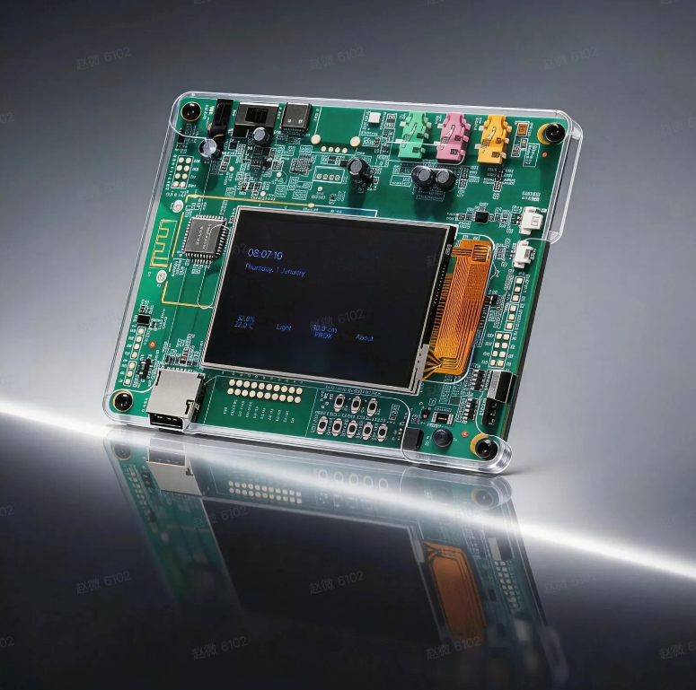

- **芯片特点**：Cortex-A7 + HiFi4 DSP + WiFi/BLE + LCD + 音频（首款 openvela 官方产品兼容性认证）
- **适用场景**：openvela 系统生态适配、快应用演示、智能屏/音响原型、端侧 AI 交互
- **开发指南**：[Gemini-S1 README](../../../../../../vendor_allwinnertech/blob/dev-ai-contest-2026/boards/r528/r528s3-gemini-s1/README_zh-cn.md)

### 2、ESP32-S3-EYE — 乐鑫

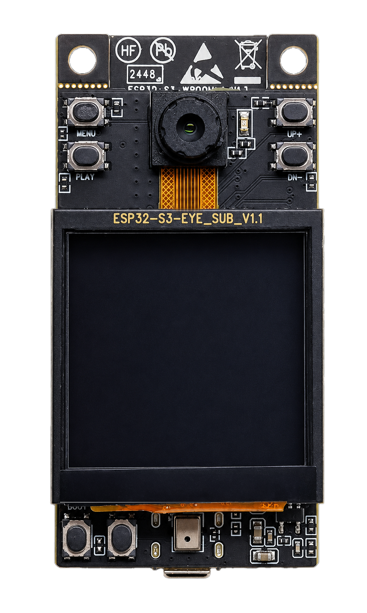

- **芯片特点**：双核 240MHz + WiFi/BLE + 摄像头 + LCD + 麦克风（AIoT 视觉/语音一体化板）
- **适用场景**：人脸检测、物体识别、语音交互、智能门禁、扫码识别
- **设备介绍**：搭载 ESP32-S3 与 ESP-WHO AI 框架，配 200 万像素摄像头、LCD 与麦克风，板载 8MB PSRAM + 8MB flash，支持 Wi-Fi 图传与 USB 调试，适用于图像识别、音频处理等 AIoT 应用。[官方入门指南](https://documentation.espressif.com/esp-who/master/docs/zh_CN/get-started/ESP32-S3-EYE_Getting_Started_Guide.md)
- **开发指南**：[ESP32-S3-EYE README](../../../../../../vendor_espressif/blob/dev-ai-contest-2026/boards/esp32s3/esp32s3-eye/README_zh-cn.md)

### 3、黄山派 SF32LB52 — 思澈科技

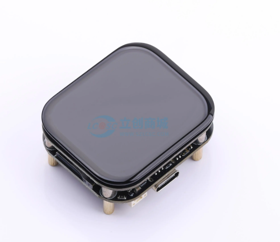

- **芯片特点**：低功耗双模蓝牙 + 自研 GPU + 多媒体 + 集成屏幕和传感器
- **适用场景**：轻量穿戴（手表/手环原型）、码表、低功耗显示
- **设备介绍**：[黄山派 wiki](https://wiki.sifli.com/board/sf32lb52x/SF32LB52-黄山派.html)
- **开发指南**：[黄山派 README](../../../../../../vendor_sifli/blob/dev-ai-contest-2026/boards/sf32lb52/lckfb_huangshan_pi/README_zh-cn.md)

### 4、SF32LB52 LCD（DevKit）— 思澈科技

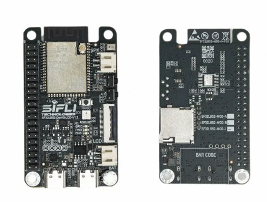

- **芯片特点**：低功耗双模蓝牙 + 自研 GPU + 多媒体 + 可自由拓展外设
- **适用场景**：智能手表/手环原型、蓝牙音频终端、LVGL 应用开发
- **设备介绍**：[SF32LB52-DevKit-LCD wiki](https://wiki.sifli.com/board/sf32lb52x/SF32LB52-DevKit-LCD.html)
- **开发指南**：[SF32LB52 DevKit LCD README](../../../../../../vendor_sifli/blob/dev-ai-contest-2026/boards/sf32lb52/sf32lb52_devkit_lcd/README_zh-cn.md)

### 5、百问网 DShanPixVela-Devkit（R528）— 全志

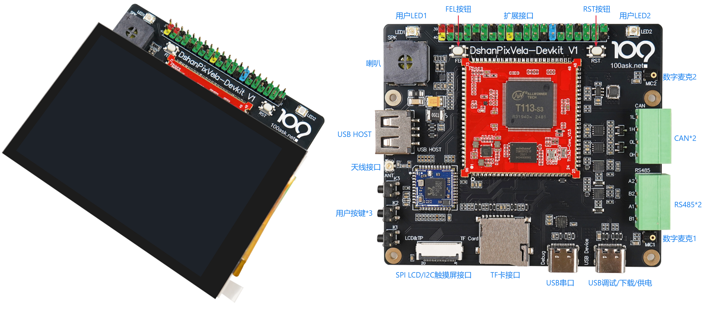

- **芯片特点**：Cortex-A7 + HiFi4 DSP + WiFi/BLE + LCD + 音频
- **适用场景**：工业控制、智能显示、AIoT 音视频、教学开发

### 6、BES 2800BP — 恒玄科技

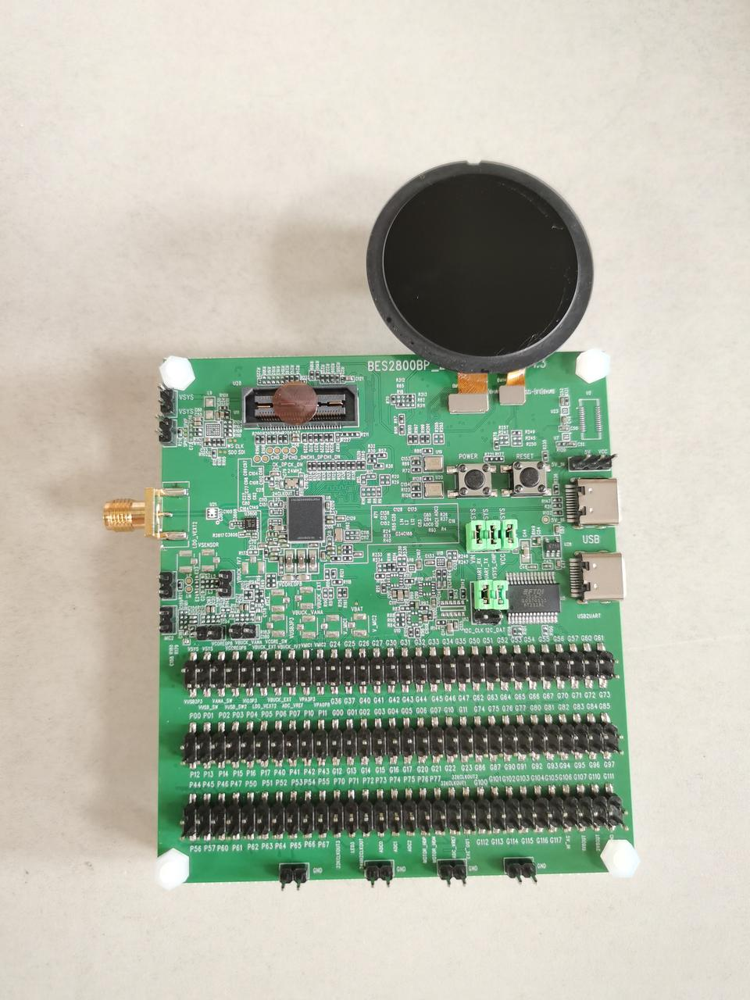

- **芯片特点**：M55 + HiFi4 + 2×M33 / BT6.0 / Wi-Fi 6 / 8.3MB SRAM / 64MB PSRAM / 40MB Nor Flash / Audio CODEC / 2.5D GPU
- **适用场景**：TWS 耳机、智能手表/手环、低功耗蓝牙音频终端

### 7、STM32H750VBT6 — 意法半导体

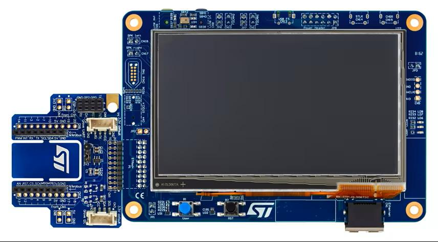

- **芯片特点**：Cortex-M7 480MHz + QSPI Flash
- **适用场景**：AI 硬件、高性能 MCU 通用开发
- **开发指南**：[STM32H750B-DK README](../../../../../../nuttx/blob/dev-ai-contest-2026/boards/arm/stm32h7/stm32h750b-dk/README_zh-cn.md)

### 8、STM32H7A3 — 意法半导体

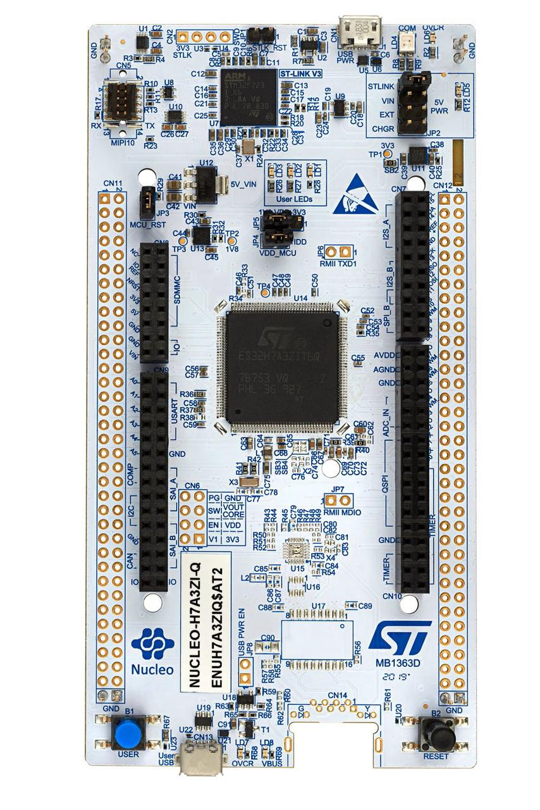

- **芯片特点**：Cortex-M7 280MHz + 大容量 Flash/RAM
- **适用场景**：AIoT 边缘节点、低功耗 HMI、可穿戴主控、工业控制器
- **开发指南**：[NUCLEO-H7A3ZI-Q README](../../../../../../vendor_st/blob/dev-ai-contest-2026/boards/stm32h7a3/nucleo-h7a3zi-q/README_zh-cn.md)

### 9、GD32F470V-START — 兆易创新

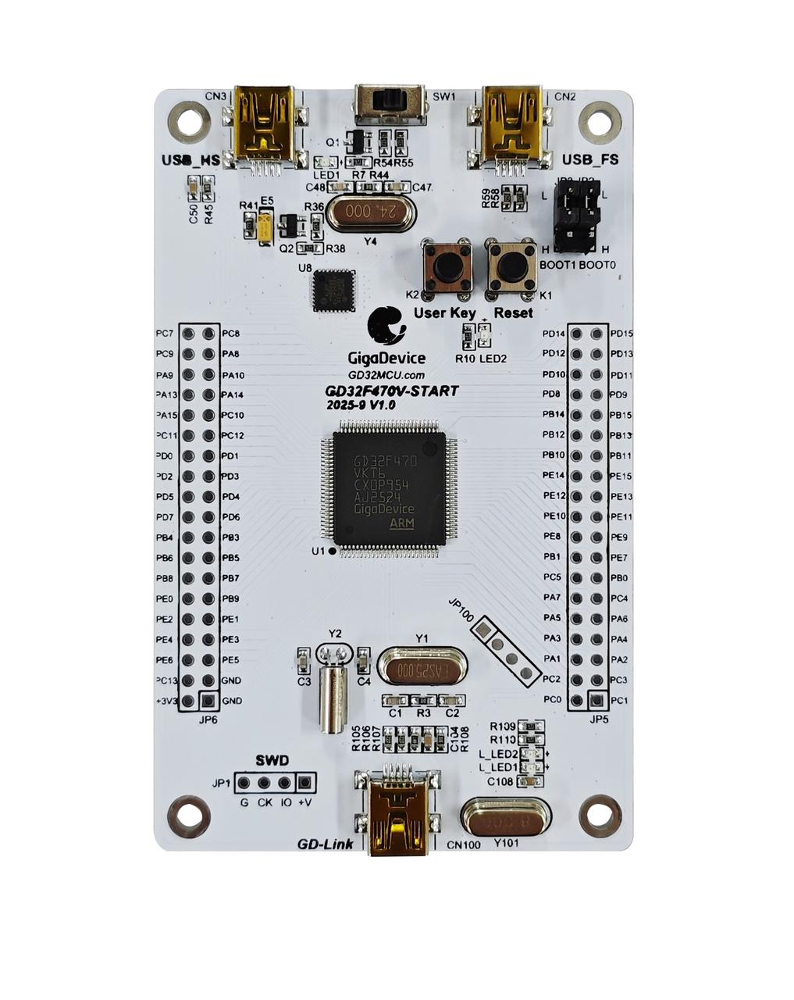

- **芯片特点**：Cortex-M4 240MHz，内置高级 DSP 硬件加速器与单精度 FPU；3072KB Flash（含 1024KB Code-Flash）+ 768KB SRAM；EXMC 支持 SDRAM/SRAM/NOR/NAND；8×U(S)ART、3×I2C、6×SPI、2×I2S；USB FS+HS OTG、Ethernet、CAN2.0B；TFT-LCD/Camera/IPA；3×12bit ADC、2×12bit DAC
- **适用场景**：物联网与智能家居、机器人与关节驱动、工业自动化与电机控制、高精度数据采集与仪器仪表、HMI 人机界面、四轴飞行器
- **说明**：GD32F4 系列已成功适配 Xiaomi Vela OS，支持 I2C、SPI、USART 等基础外设。

## 二、待适配开发板

> 以下平台 openvela 尚未完成适配，主办方提供芯片手册、硬件设计文档、参考代码等技术资料，适合「新硬件平台适配」赛道挑战（重点加分方向）。

### 1、ESP32-P4X-Function-EV-Board — 乐鑫

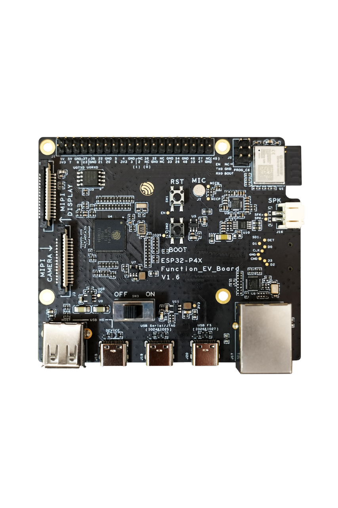

- **芯片特点**：双核 400MHz RISC-V + AI 加速 + MIPI CSI/DSI
- **适用场景**：AI 视觉终端、多媒体网关、高性能 IoT 边缘设备
- **设备介绍**：基于 ESP32-P4 的多媒体开发板，双核 RISC-V，最大 32MB PSRAM，支持 USB 2.0、MIPI-CSI/DSI、H264 编码；板载 ESP32-C6-MINI-1（Wi-Fi 6 + BLE 5）、7 寸 1024×600 触摸屏、200 万像素 MIPI CSI 摄像头，适用于可视门铃、网络摄像头、智能家居中控屏等。[官方文档](https://docs.espressif.com/projects/esp-dev-kits/zh_CN/latest/esp32p4/esp32-p4x-function-ev-board/index.html)

### 2、BK7258 DevKit — 博通集成

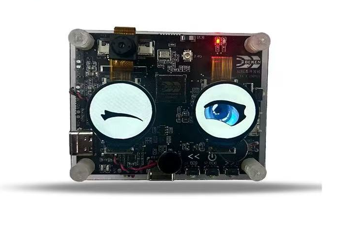

- **芯片特点**：双核 480MHz Armv8-M Wi-Fi SoC + 低功耗 + 硬件音视频编解码 + 丰富显示接口
- **适用场景**：智能门锁、AI 玩具、AI 眼镜、智能家电
- **设备介绍**：面向端侧 AI 的全功能评估/量产参考平台，BK7258 Wi-Fi 6 AI-SoC（480MHz ARMv8-M），板载双 QSPI 屏、DVP 摄像头、麦克风阵列、陀螺仪、NFC、震动马达、Nand Flash 等；支持端侧语音唤醒（KWS）、AEC、NS、G711/G722 编码及 H.264/MJPEG 硬件编解码，可对接 OpenAI、豆包、DeepSeek 等大模型。[官方文档](https://docs.bekencorp.com/arminodoc/bk_ai_smp/bk7258/zh_CN/v3.1.1/intro/index.html)

### 3、D13x 系列 EVM 评估板 — 匠芯创

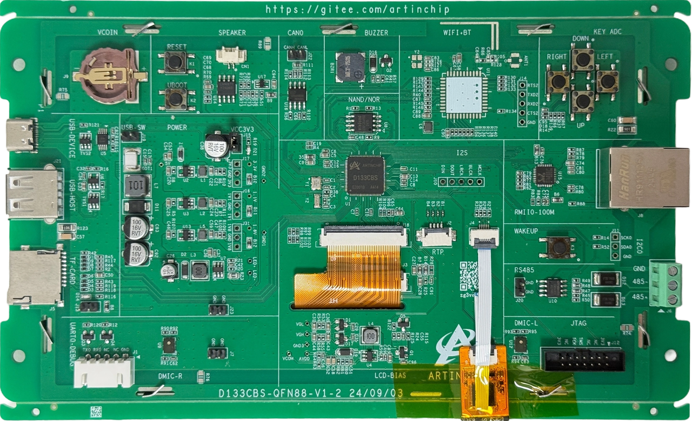

- **芯片特点**：RISC-V 架构、国产自主、显控一体 MCU
- **适用场景**：工业 HMI、网关、串口屏等泛工业领域及智慧家居
- **技术资料**：[匠芯创开发板资料.zip](../attachment/匠芯创开发板资料.zip)

### 4、STM32N647 开发板 — 意法半导体

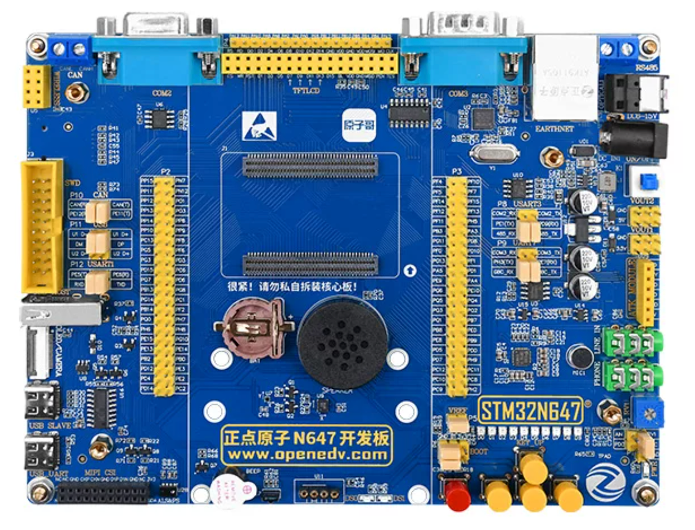

- **芯片特点**：CM55 800MHz CPU / 600GOPS 算力 NPU；MIPI CSI-2 接口和 ISP / 图形加速器 / 超大容量存储
- **适用场景**：边缘 AI 应用开发 / 音视频处理 / 嵌入式学习
- **设备介绍**：[STM32N6 系列](https://www.st.com.cn/zh/microcontrollers-microprocessors/stm32n6-series.html) ｜ [正点原子 DNN647 资料](https://wiki.alientek.com/docs/Boards/STM32/DNN647/TOC/)

### 5、RK3588 开发板 — 瑞芯微（适配中）

- **芯片特点**：高性能多核 SoC（详见数据手册）
- **状态**：适配进行中。
- **技术资料**：[RK3588 开发板资料.zip](../attachment/RK3588%20开发板资料.zip) ｜ [百度网盘（提取码 gff2）](https://pan.baidu.com/s/1GxmBTRQScAm-h79onpWidA?pwd=gff2)

## 三、相关资源

- [新硬件适配赛道详细指引](./hardware_porting_track_guide.md)
- [openvela 芯片移植指南](../../chip_porting/porting_guide.md)
