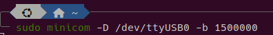
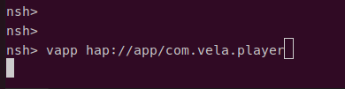
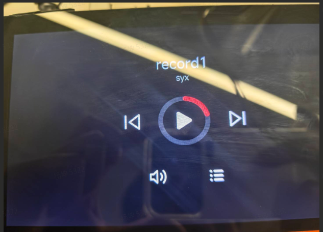

# 快应用开发指南（手动开发）

> 本文档面向 2026 首届 openvela AI 硬件开发者大赛参赛者，帮助开发者在最短时间内完成 Vela 快应用的环境搭建、项目创建、开发调试、打包提交及真机部署全流程。

> 如果你希望用 AI 辅助自动生成代码和调试，请参考《快应用开发指南（AI 工作流）》。

## 一、创建第一个项目

### 1、创建步骤

1. 打开 AIoT-IDE，点击「文件」>「新建项目」
2. 左侧选择 **watch**，点击「创建」
3. 选择一个项目模板，点击「下一步」
4. 输入项目名称和保存路径，点击「创建」

### 2、项目目录结构

```
├── package.json         # 项目配置
├── sign/                # 签名文件（用于打包发布）
└── src/                 # 源码目录
    ├── app.ux           # 应用入口（全局生命周期、全局数据）
    ├── manifest.json    # 应用配置（包名、版本、权限、路由）
    ├── common/          # 公共资源（组件、图片、脚本）
    ├── i18n/            # 多语言配置
    └── pages/           # 页面目录（每个页面一个子目录）
```

### 3、核心文件说明

| 文件                   | 作用                                            |
| ---------------------- | ----------------------------------------------- |
| `src/manifest.json`    | 声明应用基本信息、系统接口权限、页面路由        |
| `src/app.ux`           | 应用入口，定义全局生命周期回调和全局数据        |
| `src/pages/xxx/xxx.ux` | 页面文件，包含 template + style + script 三部分 |

---

## 二、运行与调试

### 1、配置模拟器

1. 在 AIoT-IDE 中点击 banner 栏的「模拟器」按钮。
2. 点击「新建」，选择 **vela-watch-5** 镜像。
3. 填写模拟器名称，点击「新建」。

### 2、运行项目

点击 banner 栏的「选择设备」按钮 → 选择上一步新建的模拟器。

### 3、调试项目

点击 banner 栏的「调试」按钮，底部弹出调试面板，支持：
- **DOM 树查看**：检查页面结构和样式。
- **Console**：查看日志输出。
- **断点调试**：逐步执行代码，定位问题。

---

## 三、打包

### 1、开发模式打包

点击 banner 栏「打包」按钮，生成 `dist/xxx.debug.rpk`。

> 注意：debug.rpk 仅用于开发调试阶段，参赛提交时请使用 release.rpk（生产模式打包）。

### 2、生产模式打包（参赛提交用）

1. **生成签名**：点击「发布」按钮 → 填写信息 → 自动生成签名文件。
2. **打包**：再次点击「发布」，生成 `dist/xxx.release.rpk`

---

## 四、部署到 openvela 模拟器

> **两种模拟器的区别**：AIoT-IDE 内置模拟器用于开发阶段快速预览调试；openvela 模拟器用于在真实 openvela 系统环境下验证应用（更接近真机行为）。如果你只需快速看效果，用第二章即可；要验证真实部署，用本章。

### 1、模拟器环境准备

参考[快速入门（Ubuntu）](../../quickstart/openvela_ubuntu_quick_start.md)完成 openvela 模拟器运行环境搭建编译。

> 大赛参赛者请统一基于大赛分支 `dev-ai-contest-2026` 拉取 openvela 代码（`repo init` 时通过 `-b dev-ai-contest-2026` 指定），不要使用 dev 或 trunk 分支，以确保与大赛环境一致。

### 2、启动模拟器

本章以 `vela_goldfish-arm64-v8a-ap` 模拟器为例，启动命令如下（请根据实际编译产物路径替换）：

```bash
./emulator.sh cmake_out/vela_goldfish-arm64-v8a-ap/
```

`emulator.sh` 启动后会占用当前终端持续输出模拟器日志，请保持该终端运行，**另开一个终端**在 host（你的 Ubuntu 主机）上执行后续 `adb` 命令。

待模拟器完全启动后，在新终端执行 `adb devices` 确认设备已连接（设备名通常为 `emulator-5554`，若有其他模拟器占用该端口则可能为 `emulator-5556` 等，后续命令请替换为实际显示的设备名）：

```bash
adb devices
```

> 说明：本章所有 `adb` 命令均在 **host 主机**的终端执行，`adb` 会通过通道把指令发送到模拟器内部，无需手动"进入"模拟器。

> 重要：openvela arm64 模拟器的 adb 仅支持 push/pull 文件传输操作。adb shell 交互式命令（如 ls、mkdir、vapp）会返回 error: closed，这是正常现象。需要执行设备端命令时，请直接在模拟器的串口控制台（即 emulator.sh 所在终端，显示 goldfish-armv8a-ap> 提示符）中输入。

### 3、安装字体包

模拟器默认不包含中文字体，下载字体包并解压，执行如下命令手动推送：

> 字体包下载：[font.zip](attachment/font.zip)

```bash
# font.zip 下载到任意目录均可，解压后得到一个 font 文件夹（里面是 MiSans、simhei 等 .ttf）
# 注意：下面命令以「当前目录」为准——请先 cd 到 font 文件夹所在的上一级目录（即当前目录下能看到 font 这个文件夹），再执行：
adb -s emulator-5554 push ./font /data/
```

> 推送成功会显示类似 `xx files pushed, xx bytes in xxs` 的提示，字体即位于设备的 `/data/font/` 目录。由于 adb shell 不可用，无法通过 `adb shell ls` 验证，以 push 输出为准即可。

### 4、解压并推送应用

本节以生成的 `com.vela.player.release.1.0.0.rpk` 为例（请替换为你自己应用的 rpk 文件名，包名需与 `manifest.json` 中的 `package` 字段一致）：

```bash
# 1. 解压 rpk（rpk 本质是 zip 包）
unzip com.vela.player.release.1.0.0.rpk -d com.vela.player

# 2. 推送应用（注意：目标路径必须包含完整包名，确保 manifest.json 位于 /data/app/包名/ 下）
adb -s emulator-5554 push com.vela.player /data/app/com.vela.player
```

### 5、启动应用

在模拟器的串口控制台（emulator.sh 所在终端）输入：

```bash
vapp hap://app/com.vela.player
```

> 注意：`adb shell vapp ...` 在 arm64 模拟器上不可用（会返回 error: closed），必须在串口控制台直接输入。

## 五、部署到开发板

以润芯微 7 寸 MIPI 屏开发板（R528S3-Gemini-S1）为例，说明从固件打包到应用运行的完整流程。

> 前置条件：已完成开发板 SDK 拉取、编译环境搭建及固件编译。参考[《快速入门（Ubuntu）》](../../quickstart/openvela_ubuntu_quick_start.md)完成环境搭建与代码拉取，编译说明见下方。

### 1、开发板编译说明

**SDK 目录结构：**

```
vendor/allwinnertech/
├── apps/              # 核心应用与 Demo
├── boards/            # 板级支持包（启动代码、引脚配置）
│   └── r528/
│       └── r528s3-gemini-s1/  # 本开发板核心目录
├── chips/             # 芯片级驱动（GPIO, SPI, TWI 等）
│   └── r528/
│       ├── drivers/   # 底层 HAL 与 RTOS 适配层
│       └── drv/       # NuttX 驱动实现层
├── lichee/            # 固件打包与产线工具
├── Make.defs          # 全局构建规则
└── Kconfig            # 全局配置入口
```

**编译命令（7寸 MIPI 屏）：**

```bash
# 可选：只有 menuconfig 改变之后才需要 clean
./build.sh vendor/allwinnertech/boards/r528/r528s3-gemini-s1/configs/nsh/ -j8 distclean

# 编译
./build.sh vendor/allwinnertech/boards/r528/r528s3-gemini-s1/configs/nsh/ -j8
```

### 2、配置字体

在目录 `vendor/allwinnertech/lichee/board/common/data/UDISK` 下新建 `font` 文件夹，将字体包中的所有字体文件复制到 `font` 下。

> 字体包：[font.zip](./attachment/font.zip)

### 3、部署应用文件

1. 在 `vendor/allwinnertech/lichee/board/common/data/UDISK/` 下新建 `app` 文件夹
2. 将 rpk 文件解压，将解压后的应用文件夹放入该目录：

```bash
unzip com.vela.player.release.1.0.0.rpk -d com.vela.player
cp -r com.vela.player vendor/allwinnertech/lichee/board/common/data/UDISK/app/
```

### 4、打包固件

```bash
# 在 bash 终端依次执行以下命令
cd vendor/allwinnertech/lichee/
source envsetup.sh
lunch_nuttx  # 选择 2 r528s3-gemini-s1
pack
# 打包产物在 vendor/allwinnertech/lichee/out/r528s3/gemini-s1_nand/rtos_nuttx_r528s3-gemini-s1_uart0_128Mnand.img
```

> 打包只需几分钟，不需要重新编译内核。只有修改了 defconfig 或源码才需要重新执行 build.sh 编译。

### 5、烧录并启动应用

烧录固件到开发板后，通过串口终端进入 nsh shell：

```bash
# 在 bash 终端进入串口
sudo minicom -D /dev/ttyUSB0 -b 1500000
```



进入 nsh 终端后，启动快应用：

```bash
# nsh 终端启动快应用
vapp hap://app/com.vela.player
```



> 启动成功后，开发板屏幕上会显示你的应用界面。



---

## 六、提交参赛代码

> 完整的提交流程、仓库获取方式、时间与权限说明，以 [《参赛代码提交指南》](../code_submission_guide.md) 为准。

组委会会为每支队伍 / 每位参赛者创建专属的 GitHub 代码仓库（命名 `contest2026_<编号>_<队伍名>`，默认 public）。比赛期间，你 **fork 自己的专属仓** 进行开发，再以 **PR** 形式提交回专属仓，可**自行 review 并合入**（无需等待组委会审核）。

AI Coding 对话会自动记录到本机 staging（不会自动上传），需由你**主动导出/打包**选定会话到仓内 `logs/` 目录后一并提交（详见 [《AI Coding 日志归集与提交手册》](../ai_coding_log_guide.md)）。

**提交内容**：快应用**源码工程**（`src/`、`package.json`、`manifest.json` 等）+ 生产模式打包产物 **release.rpk**，二者都放入你的专属仓。

> 大赛仅在 GitHub 进行（不在 Gitee）；专属仓通过 **fork → PR → 自行 review 合入** 提交。**获奖后**需按要求将作品 PR 至 openvela 上游 `packages_apps` 仓库的 `dev-ai-contest-2026` 分支，走标准 PR + CI 流程。
>
> 运行环境区分：`packages_apps` 在 openvela 模拟器上运行；`packages_fe_examples` 在 AIoT IDE 内置模拟器中运行，仅供学习参考。

---

## 七、常见问题

### Q1: 模拟器 adb devices 无设备

**原因**：模拟器未完全启动或 adb 服务异常。
**解决**：等待模拟器完全启动，或执行 `adb kill-server && adb start-server`。

### Q2: 应用启动后白屏或中文乱码

**原因**：缺少中文字体文件。
**解决**：确认字体包已正确安装到 `/data/font/` 目录。

### Q3: Can not load manifest.json

**原因**：应用文件未正确部署到 `/data/app/包名/` 目录。
**解决**：
1. 确认目录结构：`/data/app/com.vela.player/manifest.json` 必须存在
2. 检查 cp 命令是否成功执行
3. NuttX nsh 的 cp 不支持通配符 `*`，需使用完整路径

### Q4: vapp 命令报错找不到应用

**原因**：包名不匹配或路径错误。
**解决**：确认启动命令中的包名与 `manifest.json` 中的 `package` 字段完全一致。

### Q5: 开发板上 cp -r 命令报错

**原因**：NuttX nsh 的 cp 实现有限制。
**解决**：使用完整路径，不要使用通配符：

```bash
cp -r /resource/app/com.vela.player /data/app/com.vela.player
```

### Q6: 更新应用后未生效

**解决**：
- 模拟器：在串口控制台执行 `rm -rf /data/app/com.vela.player`，再用 adb push 重新推送
- 开发板：重新打包烧录，或在 nsh 中执行 `rm -rf /data/app/com.vela.player` 后重新 cp

### Q7: adb push 后应用目录结构不对（manifest.json 直接在 /data/app/ 下）

**原因**：`adb push com.vela.player /data/app/` 时若 `/data/app/` 目录不存在，adb 会将源目录重命名为目标路径，导致文件直接散落在 `/data/app/` 下而缺少包名子目录。

**解决**：推送时明确指定完整目标路径：

```bash
adb -s emulator-5554 push com.vela.player /data/app/com.vela.player
```

确认最终结构为 `/data/app/com.vela.player/manifest.json`。

---

## 附录

### A. 快应用与 LVGL 原生应用对比

| 特性     | Vela 快应用                  | LVGL 原生应用            |
| -------- | ---------------------------- | ------------------------ |
| 开发语言 | HTML/CSS/JavaScript          | C/C++                    |
| 开发门槛 | 低（前端技术栈）             | 高（嵌入式开发经验）     |
| 部署方式 | rpk 包推送，无需重新编译固件 | 编译进固件，需重新烧录   |
| 适用场景 | UI 交互类应用、快速原型      | 高性能需求、底层硬件控制 |

### B. 相关资源链接

- openvela 快应用官网：https://iot.mi.com/vela/quickapp/
- AIoT-IDE 下载：https://iot.mi.com/vela/quickapp/zh/guide/start/use-ide.html
- openvela GitHub：https://github.com/open-vela
- LVGL 官方文档：https://lvgl.io/documentation
