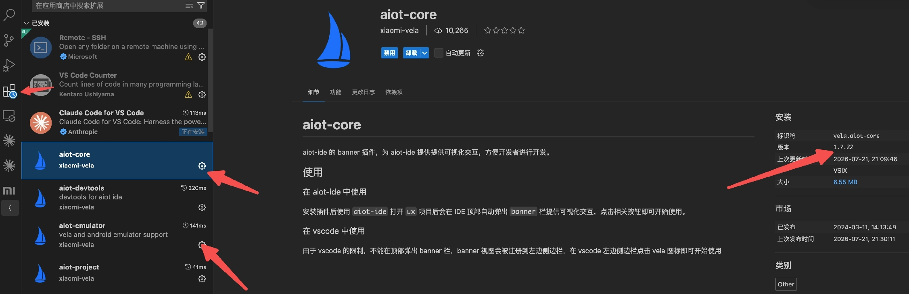
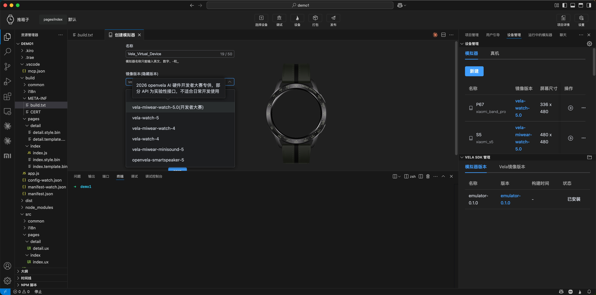
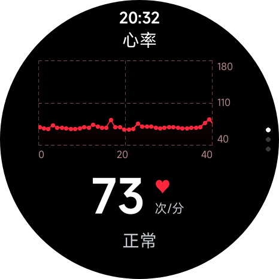
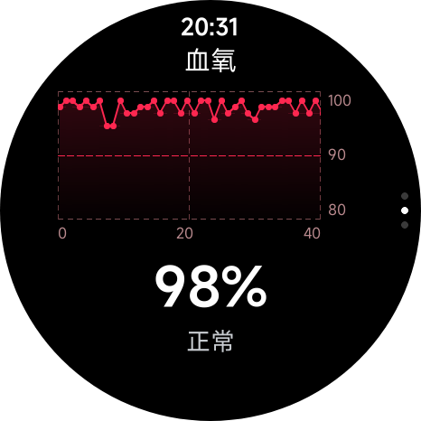
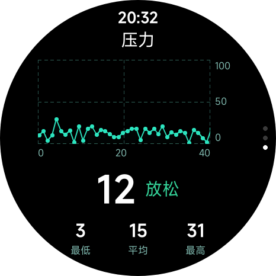

# openvela 快应用健康数据接口（service.health）使用手册

> 本文档面向 2026 首届 openvela AI 硬件开发者大赛参赛者，介绍如何在快应用中通过 `service.health` 读取手表健康数据（心率 / 血氧 / 压力）。

## 一、概述

`service.health` 让 openvela 快应用直接读取手表系统的健康数据流——**心率、血氧、压力**——开发者**不用关心传感器底层**，订阅一行 JS 就能拿到实时数据。

**典型作品场景（仅供参考）：**

- **表盘健康卡片**：腕上常驻显示当前心率、血氧、压力，配合简易趋势曲线。
- **健康看护类应用**：长期采集老人/儿童心率，异常时本地或云端告警；配合智能家居端做家庭级看护。
- **健身实时反馈**：跑步/骑行场景下实时心率显示与区间提示。
- **压力提醒应用**：压力值持续偏高时弹出呼吸放松引导。

**本期范围**：仅开放 3 个**采样族接口**（`getRecentSamples` / `subscribeSample` / `unsubscribeSample`）+ 3 种**数据类型**（HEART_RATE / SPO2 / STRESS）。睡眠与汇总类接口规划在后续版本。

## 二、跑通最小示例

**获取与使用**：出库包后续将集成到 IDE——开发者在 IDE 中启动对应的模拟器即可直接使用，`service.health` 与调试用模拟数据均已内置在模拟器中，无需手动安装。

**IDE 插件版本要求**：使用 `service.health` 前，请先在 IDE 中将 `aiot-core` 与 `aiot-emulator` 两个插件更新至 **1.7.22 及以上**版本。版本过低会导致 `service.health` 模块无法加载，或模拟器内置的健康数据回放不可用。

- **更新方式**：打开 IDE 扩展面板，搜索 `aiot-core` 与 `aiot-emulator`，分别点击「更新」至 1.7.22+。



**模拟器镜像版本要求**：在 IDE 中创建模拟器时，镜像版本必须选择 **`vela-miwear-watch-5.0(开发者大赛)`**。只有该镜像内置了 `service.health` 模块及调试用的健康数据回放数据，选择其他镜像会导致 `service.health` 无法加载或无数据回放。

- **创建方式**：打开 IDE 模拟器管理面板 → 新建 → 在「镜像版本」下拉列表中选择 `vela-miwear-watch-5.0(开发者大赛)` → 完成创建后启动即可。



**前置 checklist：**

- 在 `manifest.json` 中加入权限：`hapjs.permission.HEALTH`
- 在 `manifest.json` 中加入特性：`service.health`
- 在 JS 中引入：`import health from "@service.health";`

**manifest.json 片段：**

```json
{
  "package": "com.example.health.demo",
  "deviceTypeList": ["watch"],
  "features": [
    { "name": "service.health" }
  ],
  "permissions": [
    { "name": "hapjs.permission.HEALTH" }
  ],
  "config": {
    "designWidth": 480,
    "background": {
      "features": ["service.health"]
    }
  }
}
```

**字段说明：**

- `deviceTypeList: ["watch"]`：声明只在手表设备上运行，必填。
- `features` + `permissions`：声明使用 `service.health` 模块和健康数据权限，**两者必须同时声明**——只声明 features 不声明 permissions 会被权限管控拒绝，反之模块加载不到。
- `config.designWidth: 480`：圆形表盘的设计宽度（health-demo 取 480；如果你的目标是方屏请按实际改）。
- `config.background.features: ["service.health"]`：**这是「后台运行」生效的关键**（见第七节）——只有声明了这里，应用切到后台后 `subscribeSample` 才会持续回调；如果只在 features 里声明、不写 background，切后台就停了。

**最小可运行 JS（订阅心率，持续接收数据）：**

```javascript
import health from "@service.health";

export default {
  onReady() {
    health.subscribeSample({
      dataType: health.DATA_TYPES.HEART_RATE,
      callback: (sample) => {
        // sample = { timeStamp: <毫秒>, value: <bpm> }
        console.log(`心率: ${sample.value} bpm @ ${new Date(sample.timeStamp).toLocaleTimeString()}`);
      },
      fail: (data, code) => {
        console.log("订阅失败 code:", code);
      },
    });
  },
  onDestroy() {
    health.unsubscribeSample({ dataType: health.DATA_TYPES.HEART_RATE });
  },
};
```

**在 AIoT IDE 模拟器中能看到什么？**

- 控制台每秒打印 1 条日志，心率值在 **48 ~ 182 bpm** 之间真实波动（来自 31 天真人数据循环回放）。
- 切到后台 callback 仍持续回调，回到前台数据已往前推进。

**想跑完整示例？** 直接参考 [health-demo](https://github.com/open-vela/packages_apps/tree/dev-ai-contest-2026/wearable/health-demo)（三卡片心率/血氧/压力 + 趋势曲线）。

## 三、支持的 DATA_TYPES

本期采样支持以下 3 种类型；其余类型暂不支持。

| 名称       | 值  | value 类型 / 单位    |
| ---------- | --- | -------------------- |
| HEART_RATE | 0   | Int，bpm（心率）     |
| SPO2       | 6   | Int，%（血氧饱和度） |
| STRESS     | 9   | Int（压力值）        |

- 通过 `health.DATA_TYPES.HEART_RATE` 等方式取值。
- `timeStamp` 统一为**毫秒级 epoch 时间戳**，可直接 `new Date(timeStamp)` 解析。
- 不支持的类型：`getRecentSamples` 跳过、`subscribeSample` 触发 `fail` 且 `code === 203`（详见第六节错误码）。

## 四、调试环境数据说明（QEMU）

调试环境（AIoT IDE 内置模拟器）的健康数据由模拟器固件内置的 **mock publisher** 驱动，用一份**真人约 31 天的真实健康数据**循环回放，便于联调。

**关键特性：**

- **发布频率：各类型均以 1Hz（每秒 1 条）持续上报。**
  - **HEART_RATE / SPO2**：1Hz 与真机「前台 / 连续测量」的实际输出频率一致。
  - **STRESS**：真机上约 1 次 / 60s；调试环境为便于联调将其**加速到 1Hz**（约 60× 加速）。因此该类在调试环境下的**频率比真机快**，仅用于调试，不代表真机节奏。
- **timeStamp 行为**：由发布时刻的**当前设备时间**生成，因此**接近"现在"且单调递增**，可直接 `new Date(timeStamp)`。
- **取值范围**（来自真人数据）：

| 类型       | value 范围   |
| ---------- | ------------ |
| HEART_RATE | bpm 48 ~ 182 |
| SPO2       | 90 ~ 99 %    |
| STRESS     | 1 ~ 49       |

## 五、接口说明

### 5.1 health.getRecentSamples(OBJECT)

获取所请求类型的最近一次采样数据（一次性，非订阅）。

| 参数      | 类型              | 必填 | 说明                     |
| --------- | ----------------- | ---- | ------------------------ |
| dataTypes | Array<DATA_TYPES> | 是   | 要查询的数据类型数组     |
| success   | Function          | 否   | 成功回调，参数为结果数组 |
| fail      | Function          | 否   | 失败回调 `(data, code)`  |
| complete  | Function          | 否   | 完成回调                 |

success 返回一个数组，每项结构：

```text
{ dataType: <DATA_TYPES>, data: { timeStamp: <毫秒>, value: <由 dataType 决定> } }
```

**行为说明：**

- 只返回**能查询到**的类型；若请求的类型都查不到，返回**空数组**（仍走 success）。
- 不支持的类型会被**忽略**（不会因此触发 fail）。

**两种调用方式**：`getRecentSamples` 既支持下面的 `success` / `fail` 回调写法，也**原生返回 Promise**。health-demo 示例用的是 Promise 形式：

```javascript
// Promise 写法（health-demo 采用）
health
  .getRecentSamples({ dataTypes: [health.DATA_TYPES.HEART_RATE, health.DATA_TYPES.SPO2] })
  .then((list) => {
    // list = [{ dataType, data: { timeStamp, value } }, ...]
    console.log(JSON.stringify(list));
  })
  .catch(() => {});
```

下面是等价的回调写法：

```javascript
import health from "@service.health";

health.getRecentSamples({
  dataTypes: [health.DATA_TYPES.HEART_RATE, health.DATA_TYPES.SPO2],
  success: (data) => {
    // data = [{ dataType: 0, data: { timeStamp: 1750000000000, value: 73 } }, ...]
    console.log(JSON.stringify(data));
  },
  fail: (data, code) => { console.log("fail:", code); },
});
```

### 5.2 health.subscribeSample(OBJECT)

订阅某个类型，数据更新时持续回调。

| 参数     | 类型       | 必填 | 说明                    |
| -------- | ---------- | ---- | ----------------------- |
| dataType | DATA_TYPES | 是   | 单个数据类型            |
| callback | Function   | 是   | 数据回调，参数为 Sample |
| fail     | Function   | 否   | 失败回调 `(data, code)` |

callback 参数 Sample 结构：

```text
{ timeStamp: <毫秒>, value: <由 dataType 决定> }
```

```javascript
health.subscribeSample({
  dataType: health.DATA_TYPES.HEART_RATE,
  callback: (sample) => {
    // sample = { timeStamp: 1750000000000, value: 73 }
    console.log(JSON.stringify(sample));
  },
  fail: (data, code) => { console.log("fail:", code); },
});
```

### 5.3 health.unsubscribeSample(OBJECT)

取消某类型的订阅。

| 参数     | 类型       | 必填 | 说明                 |
| -------- | ---------- | ---- | -------------------- |
| dataType | DATA_TYPES | 是   | 要取消订阅的数据类型 |

```javascript
health.unsubscribeSample({ dataType: health.DATA_TYPES.HEART_RATE });
```

## 六、错误码

| code | 含义                                    |
| ---- | --------------------------------------- |
| 200  | 通用 / 系统错误                         |
| 202  | 参数错误（如 dataTypes 缺失或为空数组） |
| 203  | 功能不支持（该 dataType 本期不支持）    |

**各 API 对不支持类型的行为差异：**

- `getRecentSamples`：对不支持的类型**跳过**（请求全为不支持类型时返回空数组、走 success，不报 203）。
- `subscribeSample`：对不支持的类型触发 **fail，code = 203**。

## 七、后台运行注意事项

`subscribeSample` 的订阅在应用**切到后台后仍持续回调**，适合后台持续采集场景。

- 订阅一次即可，前台、后台都会持续收到 `callback`，无需在 `onShow` / `onHide` 里反复订阅。
- 不再需要时请调用 `unsubscribeSample` 取消，避免无谓的后台回调与功耗。
- 应用被系统回收或退出后订阅自然失效，重新进入需再次 `subscribeSample`。

> 后台持续回调依赖 `manifest.json` 中 `config.background.features` 声明了 `service.health`（见第二节）。

## 八、完整示例 app

仓库地址：[wearable/health-demo](https://github.com/open-vela/packages_apps/tree/dev-ai-contest-2026/wearable/health-demo)（已合入 `dev-ai-contest-2026` 分支，含三卡片运行截图）。

**功能要点：**

- 三张可上下滑动的卡片：**心率 / 血氧 / 压力**，分别对相应类型 `subscribeSample` 实时刷新。
- 冷启动 `onReady` 用 `getRecentSamples` 补一帧最近值，避免首帧空白。
- manifest 声明 `background.features`，切到后台后订阅仍持续回调。
- 对不支持类型的 `fail`（`code === 203`）给出友好提示。
- 适配圆形表盘（`designWidth: 480`，`deviceTypeList: ["watch"]`）。

**关键文件：**

- `src/manifest.json`：权限与 feature 声明
- `src/pages/index/health.js`：service.health 调用封装（getRecent / subscribe / unsubscribe）
- `src/pages/index/index.ux`：主页面 + 数据编排
- `src/components/HrCard.ux` / `Spo2Card.ux` / `StressCard.ux`：三张卡片

**运行效果（心率 / 血氧 / 压力三张卡片）：**

| 心率                                      | 血氧                                        | 压力                                          |
| ----------------------------------------- | ------------------------------------------- | --------------------------------------------- |
|  |  |  |

## 九、问题反馈

接入中遇到问题欢迎反馈。为便于快速定位，请按以下规范提供信息——**信息越完整定位越快，其中最关键的是一个能稳定复现的最小 case**。

- **问题描述**：一句话概括现象，指明涉及的接口（`getRecentSamples` / `subscribeSample` / `unsubscribeSample`）与数据类型。
- **最小复现 case**：能稳定复现问题的最小代码，含 `manifest.json` 的权限 / feature 声明与调用片段，去掉无关逻辑。
- **复现步骤**：从启动到问题出现的操作步骤，并注明「必现 / 偶现」（偶现请给出大致概率）。
- **期望结果**：你认为正确的行为或返回。
- **实际结果**：实际发生的行为，含错误码 `code`、回调内容、报错信息，附必要日志 / 截图。
- **环境信息**：出库包 / 模拟器版本、`aiot-toolkit` 版本、IDE 版本。

可直接复制下面模板填写：

```text
【问题描述】
【涉及接口 / 数据类型】
【最小复现 case】
【复现步骤】（必现 / 偶现，概率）
【期望结果】
【实际结果】（错误码 / 回调 / 日志 / 截图）
【环境信息】（出库包 / 模拟器、aiot-toolkit、IDE 版本）
```

## 十、更新日志

**v1.0.0**

- 开放采样族 3 个接口：`getRecentSamples` / `subscribeSample` / `unsubscribeSample`。
- 支持 3 种数据类型：`HEART_RATE`(0) / `SPO2`(6) / `STRESS`(9)。
- 支持后台订阅：应用切到后台后 `subscribeSample` 仍持续回调。
- 统一错误码：`200` 通用 / `202` 参数错误 / `203` 功能不支持。
- 提供配套最小示例快应用（心率 / 血氧 / 压力三张卡片）。

## 十一、FAQ

暂未沉淀常见问题。参赛者提问后将逐步补充。
