# openvela 文档开发流程

## 流程图

## 开发工程师要做的

### 1 开发文档

如果你负责开发某一特性，你需要与文档团队一起配合，确保在版本发布之前完成该特性所配套文档的开发。否则，未提供配套文档的特性在发布时可能被移除。

1. 联系[文档团队资料作者](doc_reviewer.md)，讨论文档设计。
2. 参考[文档写作模板](../template)进行配套文档的写作。
3. 为功能特性撰写详细的文档初稿，提交 PR 并在描述中提供对应的需求 `Issue` 链接。

### 2 提交PR评审

- 提交 PR 后，会自动指定技术专家和资料专家进行评审。
- 技术专家审核后给出 `Approve` 的结论。
- 资料专家审核后给出 `DocsApprove` 的评论。

### 3 提交测试

- 文档随版本转测试后，文档工程师会对文档进行测试。
- 测试过程中发现的文档问题，以 `Issue` 形式提交到 Docs 仓，对应文档作者闭环确认测试意见并完成文档修改。

### 4 提交翻译

- 建议自行翻译。
- 如需文档团队翻译，请在中文文档完成评审测试定稿后提交翻译需求。提交翻译需求时请配套提供以下信息：
  1. 新增术语请补充至[术语表](../../overview/glossary.md)。
  2. 英文截图。

## 文档工程师要做的

### 1 评审文档

#### 内容易理解

- 逻辑准确，术语一致。
- 步骤清晰，有效指导开发者完成相关任务开发
- 图文结合，避免只有大量篇幅的文字描述。

#### 整体信息架构

- 新增 Markdown 页面时，需确保：
  - 该页面内容使用了正确的内容模板。

- 变更 Markdown 页面时，需确保：
  - 该页面对社区其他内容链接未产生影响，建议本地进行检查。

### 2 测试文档

文档工程师对文档进行测试，测试过程中发现的文档问题，以 `Issue` 形式跟踪，对应文档作者闭环确认测试意见并完成文档修改。

### 3 翻译文档

完成核心文档的翻译需求。
