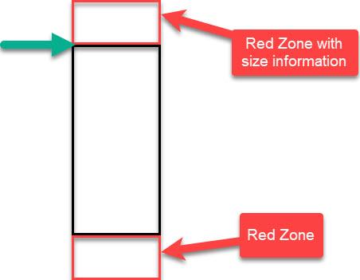
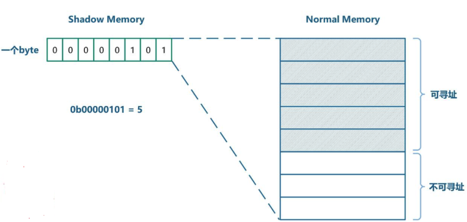

# 使用 AddressSanitizer 调试内存错误

\[ [English](../../../../../en/debugging_tools/crash/memory/heap/ASan.md) | 简体中文 \]

AddressSanitizer (ASan) 是一款基于编译器的、高效的内存错误检测工具，能够帮助开发者在运行时精确地发现和诊断各类内存问题。本指南详细介绍如何在 openvela 的 `simulator` 平台中启用和使用 ASan。

**注意**：当前 AddressSanitizer 功能仅在 `simulator` 平台上受支持。

## 一、概述

AddressSanitizer (ASan) 是 [Google Sanitizer Tools](https://github.com/google/sanitizers) 的一部分，它通过在编译时对代码进行插桩 (Instrumentation) 并在运行时链接一个专用的库来工作。这种机制使其能够以中等的性能开销高效地捕获多种内存错误。

ASan 可以检测以下常见问题：

- **越界访问 (Out-of-Bounds Access)**：对堆、栈及全局变量的访问超出了其合法边界。
- **释放后使用 (Use-after-Free)**：访问了已经被 `free()` 或 `delete` 回收的内存。
- **返回后使用 (Use-after-Return)**：访问了函数返回后其栈帧上的局部变量。
- **作用域后使用 (Use-after-Scope)**：访问了生命周期已在作用域 `{}` 内结束的局部变量。
- **重复释放 (Double-Free)**：对同一块内存执行了两次 `free()`。
- **无效释放 (Invalid-Free)**：释放了无效的或未分配的内存地址。
- **内存泄漏** **(Memory Leaks)**：由集成的 LeakSanitizer (LSan) 检测，找出已分配但无法再访问的内存。
- **初始化顺序错误 (Initialization-Order-Fiasco)**：检测 C++ 中跨编译单元的全局变量初始化顺序问题。

## 二、ASan 工作原理

ASan 主要由**编译器插桩**模块和**运行时库**两部分协同工作。

### 1、编译器插桩 (Compiler Instrumentation)

启用 ASan 后，编译器会在程序的每一次内存访问（读/写）操作前后，自动插入用于验证访问合法性的检查代码。效果如下所示：


### 2、运行时库 (Runtime Library)

ASan 的运行时库 (`libasan`) 接管了标准的内存管理函数（如 `malloc` 和 `free`），并引入了**影子内存 (Shadow Memory)**和**内存中毒 (Memory Poisoning)**机制。

- **影子内存 (Shadow Memory)**：ASan 将一部分虚拟地址空间保留为影子内存。影子内存中的一个字节用于描述主应用程序内存中对应的 8 个字节的状态（例如：不可访问、完全可访问、部分可访问）。

- **内存中毒 (Poisoning)**：

    - **分配时**：当调用 `malloc` 分配内存时，ASan 运行时库会在请求的内存区域周围分配额外的“红区 (Redzone)”。这些红区和对齐产生的填充字节会被标记为“中毒”，任何对它们的访问都会被立即报告为错误。
    - **释放时**：当调用 `free` 释放内存时，整块内存区域（包括原先的有效区域和红区）都会被标记为“中毒”，并被放入一个隔离队列中。这块内存暂时不会被重新分配，从而能有效地检测出“释放后使用”的错误。



### 3、检测算法

每次内存访问时，编译器插入的检查代码会执行以下伪代码逻辑：

1. 根据访问地址 `Addr` 计算出其在影子内存中的对应地址 `ShadowAddr`。
2. 读取影子字节 `k` 的值。`k` 描述了 `Addr` 所在 8 字节对齐块的状态。
3. 检查访问是否合法：

    - 如果 `k` 为 `0`，表示 8 字节全部可访问。
    - 如果 `k` 为负数，表示整个 8 字节块不可访问（例如，红区或已释放内存）。
    - 如果 `k` 为正数（`1` 到 `7`），表示前 `k` 个字节可访问。
    - 如果访问越过了 `k` 定义的边界，则判定为内存错误。

```C
// 伪代码表示检测逻辑
ShadowAddr = (Addr >> 3) + Offset;   // 计算影子地址
k = *ShadowAddr;                     // 读取影子字节 
if (k != 0 && ((Addr & 7) + AccessSize > k)) {
    ReportAndCrash(Addr);            // 如果访问非法，则报告错误并终止程序
}
```



## 三、如何在 openvela 中使用 ASan

在 `simulator` 平台启用 ASan 非常简单，只需三个步骤。

### 步骤 1：启用 ASan 配置

通过 `menuconfig` 或直接修改 `.config` 文件，启用以下 Kconfig 选项：

```Makefile
# 在 sim 平台启用 Address Sanitizer
CONFIG_SIM_ASAN=y
```

**说明**：启用此选项后，构建系统会自动为编译器和链接器添加 `-fsanitize=address` 选项，并为了获得更清晰的堆栈跟踪信息，通常会附带 `-fno-omit-frame-pointer` 选项。

### 步骤 2：编译并运行

执行标准编译流程，然后启动 `simulator` 运行您的应用程序。

```Bash
# 运行模拟器（示例）
./emulator.sh vela
```

### 步骤 3：分析错误报告

若 ASan 检测到内存错误，程序将立即终止并打印详细报告。一份典型的 ASan 报告包含以下关键信息：

```Bash
# 1. 错误摘要：指明错误类型 (heap-use-after-free) 和非法访问的地址。
==9901==ERROR: AddressSanitizer: heap-use-after-free on address 0x60700000dfb5

# 2. 访问详情和堆栈跟踪：显示非法的内存操作 (READ of size 1) 及其发生位置。
READ of size 1 at 0x60700000dfb5 thread T0
    #0 0x45917a in main use-after-free.c:5
    #1 0x7fce9f25e76c in __libc_start_main ...

# 3. 内存位置描述：说明非法地址位于哪个内存区域。
0x60700000dfb5 is located 5 bytes inside of 80-byte region [0x60700000dfb0,0x60700000e000)

# 4. 释放点堆栈跟踪：(若适用) 显示该内存块在何处被释放。
freed by thread T0 here:
    #0 0x4441ee in __interceptor_free ...
    #1 0x45914a in main use-after-free.c:4

# 5. 分配点堆栈跟踪：显示该内存块最初在何处被分配。
previously allocated by thread T0 here:
    #0 0x44436e in __interceptor_malloc ...
    #1 0x45913f in main use-after-free.c:3

# 6. 最终概要：对整个错误的简洁总结。
SUMMARY: AddressSanitizer: heap-use-after-free use-after-free.c:5 main
```

## 四、常见错误类型及示例

以下是 ASan 可以检测到的几种典型内存错误。

### 1、堆内存释放后使用 (Heap-use-after-free)

**场景**：访问已通过 `free` 或 `delete` 释放的堆内存。

**示例代码**：

```C
  5 int main (int argc, char** argv)
  6 {
  7     int* array = new int[100];
  8     delete []array;
  9     return array[1];  // <-- 错误：访问已释放的内存
 10 }
```

**错误报告摘要**：

```Bash
==3189==ERROR: AddressSanitizer: heap-use-after-free on address 0x61400000fe44
...
freed by thread T0 here:
    #1 0x4008b5 in main /home/ron/dev/as/use_after_free.cpp:8
previously allocated by thread T0 here:
    #1 0x40089e in main /home/ron/dev/as/use_after_free.cpp:7
```

### 2、堆缓冲区溢出 (Heap-buffer-overflow)

**场景**：访问堆上分配的内存区域时超出了其边界。

**示例代码**：

```C
  2 int main (int argc, char** argv)
  3 {
  4     int* array = new int[100];
  5     int res = array[100];  // <-- 错误：访问第 101 个元素，越界
  6     delete [] array;
  7     return res;
  8 } 
```

**错误报告摘要**：

```Bash
==3322==ERROR: AddressSanitizer: heap-buffer-overflow on address 0x61400000ffd0
...
0x61400000ffd0 is located 0 bytes to the right of 400-byte region [0x61400000fe40,0x61400000ffd0)
allocated by thread T0 here:
    #1 0x40089e in main /home/ron/dev/as/heap_buf_overflow.cpp:4
```

### 3、栈缓冲区溢出 (Stack-buffer-overflow)

**场景**：访问栈上分配的局部变量时超出了其边界。

**示例代码**：

```C
  2 int main (int argc, char** argv)
  3 {
  4     int array[100];
  5     return array[100];  // <-- 错误：访问第 101 个元素，越界
  6 }
```

**错误报告摘要**：

```Bash
==3389==ERROR: AddressSanitizer: stack-buffer-overflow on address 0x7ffd061fa4a0
...
Address 0x7ffd061fa4a0 is located in stack of thread T0 at offset 432 in frame
    #0 0x400935 in main /home/ron/dev/as/stack_buf_overflow.cpp:3
  This frame has 1 object(s):
    [32, 432) 'array' <== Memory access at offset 432 overflows this variable
```

### 4、全局变量缓冲区溢出 (Global-buffer-overflow)

**场景**：访问全局或静态变量时超出了其边界。

**示例代码**：

```C
  2 int array[100];
  3 
  4 int main (int argc, char** argv)
  5 {
  6     return array[100]; // <-- 错误：访问第 101 个元素，越界
  7 }
```

**错误报告摘要**：

```Bash
==3499==ERROR: AddressSanitizer: global-buffer-overflow on address 0x000000601270
...
0x000000601270 is located 0 bytes to the right of global variable 'array' defined in '...'
```

### 5、返回后使用 (Use-after-return)

**场景**：函数返回后，其栈帧被销毁，但程序仍然通过指针访问该栈上的局部变量。

**示例代码**：

```C
int *ptr;
__attribute__((noinline))
void FunctionThatEscapesLocalObject() {
  int local[100];
  ptr = &local[0];  // ptr 指向一个即将被销毁的局部变量
}

int main(int argc, char **argv) {
  FunctionThatEscapesLocalObject();
  return ptr[argc];  // <-- 错误：访问已失效的栈内存
}
```

**错误报告摘要**：

```Bash
==6268== ERROR: AddressSanitizer: stack-use-after-return on address 0x7fa19a8fc024
```

### 6、作用域后使用 (Use-after-scope)

**场景**：变量的生命周期在一个作用域 (`{...}`) 内结束，但在该作用域外仍被访问。

**示例代码**：

```C
volatile int *p = 0;

int main() {
  {
    int x = 0;
    p = &x;
  }  // x 的作用域在此结束
  *p = 5;  // <-- 错误：访问已失效的栈内存
  return 0;
}
```

**错误报告摘要**：

```Bash
==58237==ERROR: AddressSanitizer: stack-use-after-scope on address 0x7ffc4d830880
```

### 7. 初始化顺序错误 (Initialization-Order-Fiasco)

**场景**：此问题主要发生在 C++ 中。当一个单元（`.cpp` 文件）中的全局变量的初始化依赖于另一个单元中尚未初始化的全局变量时，就会发生此错误。

**示例**：

```C++
// a.cc
extern int extern_global;
int x = extern_global + 1; // <-- 错误：在 extern_global 初始化前读取它
// b.cc
int extern_global = 42;
```

**错误报告摘要**：

```Bash
==ERROR: AddressSanitizer: initialization-order-fiasco on address 0x...
READ of size 4 at 0x...
... is located 0 bytes inside of global variable 'extern_global' from 'b.cc'
```

### 8、内存泄漏 (Memory Leak)

**场景**：分配的堆内存（通过 `malloc` 或 `new`）在不再需要时没有被正确释放，导致内存占用持续增长。此功能由 LeakSanitizer (LSan) 提供，它默认集成在 ASan 中。

**示例代码**：

```C
  4 void* p;
  5 
  6 int main ()
  7 {
  8     p = malloc (7);
  9     p = 0;           // <-- 错误：原始指针丢失，7字节内存泄漏
 10     return 0;
 11 }
```

**错误报告摘要**：

```Bash
==4088==ERROR: LeakSanitizer: detected memory leaks

Direct leak of 7 byte(s) in 1 object(s) allocated from:
    #0 0x7ff9ae510602 in malloc (...)
    #1 0x4008d3 in main /home/ron/dev/as/mem_leak.cpp:8
```

**RTOS 环境下的内存泄漏说明**

- 在 openvela 等 RTOS 中，任务（Task）退出时，其动态分配的内存通常不会被系统自动回收，这与桌面操作系统的进程（Process）行为不同。
- LeakSanitizer 通过追踪指针是否丢失来判断泄漏。如果一个指针直到任务结束仍然可达，即使内存未释放，LSan 也可能不会报告为泄漏。
- 因此，开发者需要自行确保所有动态分配的内存在不再使用时被显式释放。

## 五、结合 GDB 进行高级调试

当 ASan 检测到错误并终止程序时，您可能希望在错误发生的确切位置进行交互式调试。为此，您可以在 GDB 中对 ASan 的报告函数设置一个断点。在 GDB 中，使用以下命令：

```C
# 在 ASan 报告错误的函数处设置断点
b __asan::ReportGenericError
```

当程序触发内存错误时，执行会停在断点处，此时你可以使用标准的 GDB 命令（如 `bt`, `p`, `info locals`）来检查调用堆栈、变量值和程序状态，从而更深入地分析问题根源。

## 六、参考资料

- **Google Sanitizers Project Wiki**: https://github.com/google/sanitizers/wiki/AddressSanitizer
- **Clang Documentation on AddressSanitizer**: https://clang.llvm.org/docs/AddressSanitizer.html