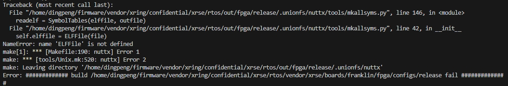

# Allsyms 符号表功能使用指南

\[ [English](../../../en/debugging_tools/offline_debugging/allsyms_guide.md) | 简体中文 \]

本文档指导您如何在 openvela 系统中启用并使用 **Allsyms** 功能。通过启用此功能，您可以将完整的符号表编译到固件镜像中，从而在设备运行时将函数地址直接解析为可读的函数名，提升在线调试（例如分析崩溃栈）的效率。

## 一、前置条件

在编译包含 **Allsyms** 功能的固件前，您必须确保开发环境中已安装以下 Python 依赖包。构建系统使用这些工具来解析 ELF 文件并生成符号表。

请在您的终端中运行以下命令进行安装：

```C
pip3 install pyelftools cxxfilt
```

## 二、如何启用 Allsyms

> **警告**
>
> 启用 **Allsyms** 功能会显著增加最终固件镜像的体积。请在评估存储空间后，仅在调试版本中开启此功能。

要启用此功能，您只需在项目的配置文件中添加以下配置项：

```Makefile
CONFIG_ALLSYMS=y
```

此功能的底层实现代码位于 openvela 的以下路径： `nuttx/libs/libc/symtab`

## 三、使用方法

启用 **Allsyms** 后，您可以通过以下几种方式利用符号表进行调试。

### 1、在回溯跟踪中自动显示函数名

这是 **Allsyms** 最核心的应用场景。当系统发生崩溃或您手动调用 `dumpstack`、`sched_dumpstack` 等函数时，系统打印的回溯跟踪（Backtrace）将不再是裸地址，而是自动解析后的函数名，方便您快速定位问题。

### 2、在 `printf` 中格式化输出符号

您可以在 `printf` 系列函数中使用 `%pS` 格式说明符，直接打印指定地址对应的符号信息。如果找不到匹配的符号，系统将打印原始地址。

**代码示例：**

```C
#include <stdio.h>
extern void hello_world(void);
void my_debug_function(void)
{
  // 打印 hello_world 函数的符号名和地址
  printf("Symbol info for hello_world: %pS\n", hello_world);
}
```

### 3、使用 API 手动查询符号

openvela 提供了两个核心 API，允许您在代码中实现函数名与地址的相互转换。

- `allsyms_findbyname()`：根据函数名查找其地址。
- `allsyms_findbyvalue()`：根据地址查找最接近的函数名。

## 四、API 参考

以下是 **Allsyms** 功能相关的核心数据结构与函数原型。

### 1、`struct symtab_s`

此结构体定义了符号表中的单个条目。

```C
/* struct symbtab_s describes one entry in the symbol table.  A symbol table
 * is a fixed size array of struct symtab_s. The information is intentionally
 * minimal and supports only:
 *
 * 1. Function pointers as sym_values.  Of other kinds of values need to be
 *    supported, then typing information would also need to be included in
 *    the structure.
 *
 * 2. Fixed size arrays.  There is no explicit provisional for dynamically
 *    adding or removing entries from the symbol table (realloc might be
 *    used for that purpose if needed).  The intention is to support only
 *    fixed size arrays completely defined at compilation or link time.
 */

struct symtab_s
{
  FAR const char *sym_name;  /* A pointer to the symbol name string */
  FAR const void *sym_value; /* The value associated with the string */
};
```

### 2、`allsyms_findbyname()`

根据符号名称查找符号表条目。

```C
/****************************************************************************
 * Name: allsyms_findbyname
 *
 * Description:
 *   Find the symbol in the symbol table with the matching name.
 *
 * Returned Value:
 *   A reference to the symbol table entry if an entry with the matching
 *   name is found; NULL is returned if the entry is not found.
 *
 ****************************************************************************/

FAR const struct symtab_s *allsyms_findbyname(FAR const char *name,
                                              FAR size_t *size);
```

### 3、`allsyms_findbyvalue()`

根据值（地址）查找符号表条目。

```C
/****************************************************************************
 * Name: symtab_findbyvalue
 *
 * Description:
 *   Find the symbol in the symbol table whose value closest (but not greater
 *   than), the provided value. This version assumes that table is not
 *   ordered with respect to symbol value and, hence, access time will be
 *   linear with respect to nsyms.
 *
 * Returned Value:
 *   A reference to the symbol table entry if an entry with the matching
 *   name is found; NULL is returned if the entry is not found.
 *
 ****************************************************************************/

FAR const struct symtab_s *allsyms_findbyvalue(FAR void *value,
                                               FAR size_t *size);
```

## 四、FAQ

### 1、编译时提示缺少 `elftools` 或 `cxxfilt` 模块

#### 问题描述



#### 原因分析

这是因为 **Allsyms** 功能的构建过程依赖这两个 **Python** 工具来处理 **ELF** 文件并提取符号信息。

#### 解决方案

请参照本文档的[前置条件](#前置条件)章节，使用 `pip3` 命令安装它们。

## 五、相关文档

- [Backtrace 使用指南](./backtrace.md)
