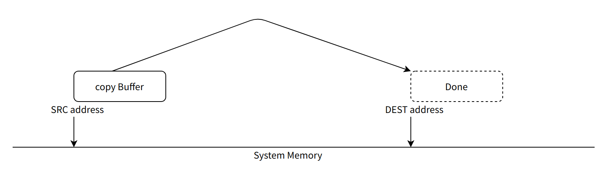

# ramspeed 内存性能测试指南

\[ [English](./../../../../en/debugging_tools/performance/Benchmark/ramspeed.md) | 简体中文 \]

本文档为 openvela 系统的开发者和性能工程师提供 `ramspeed` 基准测试工具的详细使用指南。该工具通过执行一系列标准内存操作，旨在精确评估系统在不同负载下 `memcpy` 和 `memset` 函数的性能。

## 一、概述

`ramspeed` 是一个用于评估内存性能的命令行工具。它通过在指定内存区域上重复执行 `memcpy` (内存拷贝) 和 `memset` (内存填充) 操作，来测量不同数据块大小下的内存读写速率。

测试结果可以帮助开发者：

- 评估系统 C 库中内存操作函数的实际性能。
- 分析不同编译优化选项对性能的影响。
- 识别潜在的系统级性能瓶颈。

为了确保测试结果的准确性和可复现性，请在执行测试前仔细阅读本文档的配置要求和最佳实践。

## 二、系统配置

为了获取可靠的性能基准数据，必须在测试前对系统进行专门配置，以排除不相关的系统活动和调试功能带来的性能开销。

### 1、Kconfig 配置

在 `defconfig` 文件中，请确认并应用以下配置。这些设置旨在最大化代码执行效率并关闭可能干扰性能测量的调试和监控功能。

```Makefile
# 启用自定义优化选项
DEBUG_CUSTOMOPT=y
# 设置编译器优化等级为 -O3，以获取最高性能
DEBUG_OPTLEVEL=-O3

# --- 关闭以下性能干扰项 ---
# 关闭调度器指令插桩
CONFIG_SCHED_INSTRUMENTATION=n
# 关闭中断监控
CONFIG_SCHED_IRQMONITOR=n
# 关闭临界区监控
CONFIG_SCHED_CRITMONITOR=n
# 关闭stack检查。这个性能影响较大，特别是短函数调用，最大可达3倍性能差距！
CONFIG_STACK_CANARIES=n
#关闭wachdog，避免长时间测试触发assert
CONFIG_WATCHDOG=n

# --- 启用 ramspeed 测试套件 ---
# 编译 ramspeed 工具
CONFIG_BENCHMARK_RAMSPEED=y
# 启用浮点支持，ramspeed 计算速率时需要
CONFIG_LIBC_FLOATINGPOINT=y
```

## 三、使用方法

`ramspeed` 工具通过命令行接口启动，并支持多种参数来控制测试行为。

### 1、命令语法

```Bash
nsh> ramspeed -h
RAM Speed: Missing required arguments

Usage: ramspeed -a -r <hex-address> -w <hex-address> -s <decimal-size> -v <hex-value>[0x00] -n <decimal-repeat number>[100] -i

Where:
  -a allocate RW buffers on heap. Overwrites -r and -w option.
  -r <hex-address> read address.
  -w <hex-address> write address.
  -s <decimal-size> number of memory locations (in bytes).
  -v <hex-value> value to fill in memory [default value: 0x00].
  -n <decimal-repeat num> number of repetitions [default value: 100].
  -i turn off interrupts while testing [default value: false].
```

### 2、参数说明

| **参数**              | **说明**                                                                                       | **是否必需**        |
| --------------------- | ---------------------------------------------------------------------------------------------- | ------------------- |
| `-a`                  | **自动分配内存**。<br>在堆 (Heap) 上自动申请读/写缓冲区。此选项会覆盖 `-r` 和 `-w`。           | 与 `-r`/`-w` 二选一 |
| `-r <hex-address>`    | **指定读地址**。<br>设置 `memcpy` 的源内存地址。                                               | 否                  |
| `-w <hex-address>`    | **指定写地址**。<br>设置 `memcpy` 的目标地址或 `memset` 的操作地址。                           | 否                  |
| `-s <decimal-size>`   | **设置最大测试大小** (单位：字节)。<br>测试将从 32 字节开始，以 2 的倍数递增，直至达到此上限。 | 是                  |
| `-v <hex-value>`      | `memset` 测试时填充的 16 进制数值。默认为 `0x00`。                                             | 否                  |
| `-n <decimal-repeat>` | 每个数据块大小的**重复测试次数**。<br>默认为 100 次。                                          | 否                  |
| `-i`                  | **关闭中断**。<br>在测试执行期间进入临界区，以屏蔽中断对测试结果的干扰。                       | 否                  |

**工作模式说明：**

- **`memcpy` 测试**：必须同时提供读、写地址。您可以使用 `-a` 自动分配，或手动通过 `-r` 和 `-w` 指定。
- **`memset` 测试**：仅需提供写地址。您可以使用 `-a` 自动分配（此时读缓冲区将被忽略），或手动通过 `-w` 指定。

### 3、执行示例

以下命令演示了自动分配 512 KB (524288 字节) 内存，并对每个块大小重复测试 10000 次。

```Bash
ramspeed -a -s 524288 -n 10000
```

## 四、输出解读与分析

测试结果会分别展示 `memcpy` 和 `memset` 的性能数据。



### 1、示例输出

```Shell
vela> ramspeed -a -s 524288 -n 10000
RAM Speed: Allocate RW buffers on heap
RAM Speed: Write address: 0xed95d800
RAM Speed: Read address: 0xed57f800
RAM Speed: Size: 524288 bytes
RAM Speed: Value: 0x00
RAM Speed: Repeat number: 10000
RAM Speed: Interrupts disabled: false
______memcpy performance______
______Perform 32 Bytes access ______
RAM Speed: system memcpy():      Rate = 781250.000 KB/s [cost: 0.400 ms]
RAM Speed: internal memcpy():    Rate = 781250.000 KB/s [cost: 0.400 ms]
______Perform 64 Bytes access ______
RAM Speed: system memcpy():      Rate = 892857.143 KB/s [cost: 0.700 ms]
RAM Speed: internal memcpy():    Rate = 781250.000 KB/s [cost: 0.800 ms]
______Perform 128 Bytes access ______
RAM Speed: system memcpy():      Rate = 1041666.667 KB/s        [cost: 1.200 ms]
RAM Speed: internal memcpy():    Rate = 833333.333 KB/s [cost: 1.500 ms]
______Perform 256 Bytes access ______
...
```

### 2、结果分析

输出日志中包含两组核心性能指标：

- **`system memxxx()`**

    - **含义**：调用标准 C 库 (`libc`) 提供的 `memcpy`/`memset` 函数进行测试。其性能直接受编译器版本、优化选项和 C 库实现的影响。
    - **用途**：反映系统在实际应用中的内存操作性能。

- **`internal memxxx()`**

    - **含义**：调用 `ramspeed` 工具内部实现的一个基础版 C 语言 `memcpy`/`memset` 函数。该实现作为一个性能基准，其核心思想是通过单次循环处理更多数据（如按 32-bit 或 64-bit 字宽操作）来减少循环开销。
    - **用途**：提供一个稳定、可控的性能参考基线。

**性能诊断要点：** 通常情况下，`system memxxx()` 的性能应接近或优于 `internal memxxx()`。如果发现 `system` 性能远低于 `internal`，请排查以下原因：

1. **编译优化未生效**：请返回第二章，仔细检查 `defconfig` 中的优化相关配置是否已正确启用。
2. **编译器特定优化**：较新版本的 GCC 工具链可能会对 C 实现的 `memcpy` 进行向量化优化（例如，使用 Arm MVE 指令集）。这可能导致在某些测试中 `internal` 的性能反超 `system`，属于正常现象。您可以通过分析反汇编代码来确认具体实现。

## 五、最佳实践

为了获取准确且可复现的性能数据，请遵循以下建议：

- **创建最小化测试环境**：在执行测试前，关闭所有非必需的业务应用和后台任务，确保仅有核心系统进程运行，以减少对 CPU 和内存总线的竞争。
- **规避缓存效应**：使用较大的测试内存（`-s` 参数，建议 512 KB 或更大），以减少 Cache-hit 对小数据块测试结果的过度美化，更真实地反映 DDR/SRAM 的性能。
- **增加测试样本量**：使用较高的重复次数（`-n` 参数，建议 1000 或更大），以平滑单次运行的性能抖动，使统计结果更具说服力。
- **屏蔽中断干扰**：对于对实时性要求极高的场景分析，可使用 `-i` 参数在测试期间关闭中断，以测量纯粹的 CPU-to-Memory 性能。

## 六、参考资料

- **[How Memory Usage Patterns Can Derail Real-time Performance](https://interrupt.memfault.com/blog/memory-debugging)**：一篇深入探讨内存使用模式如何影响实时性能的专业文章。
